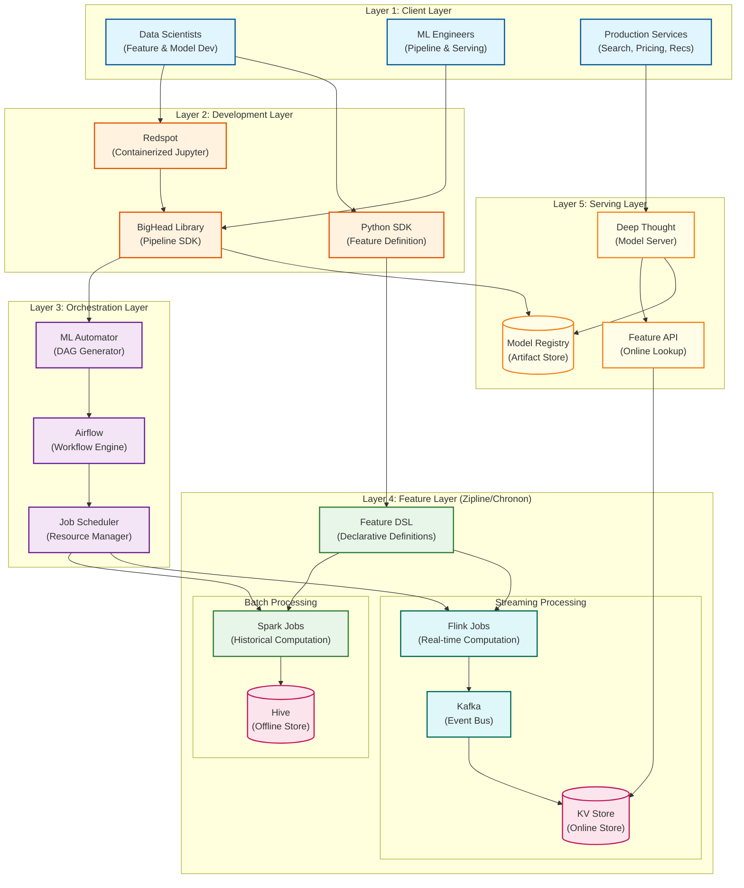
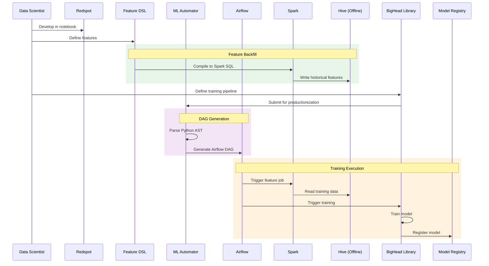
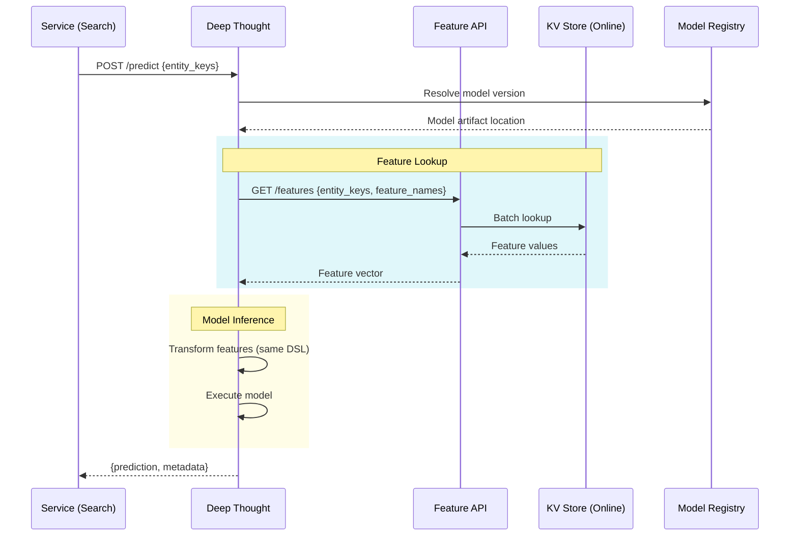
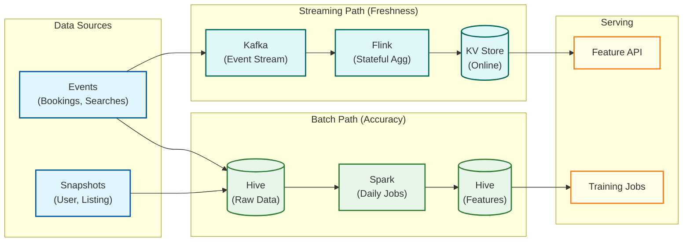
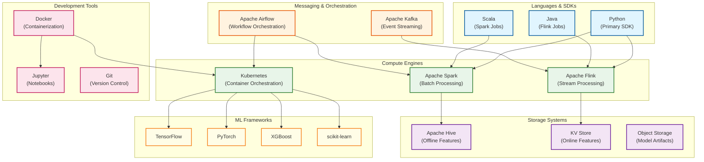
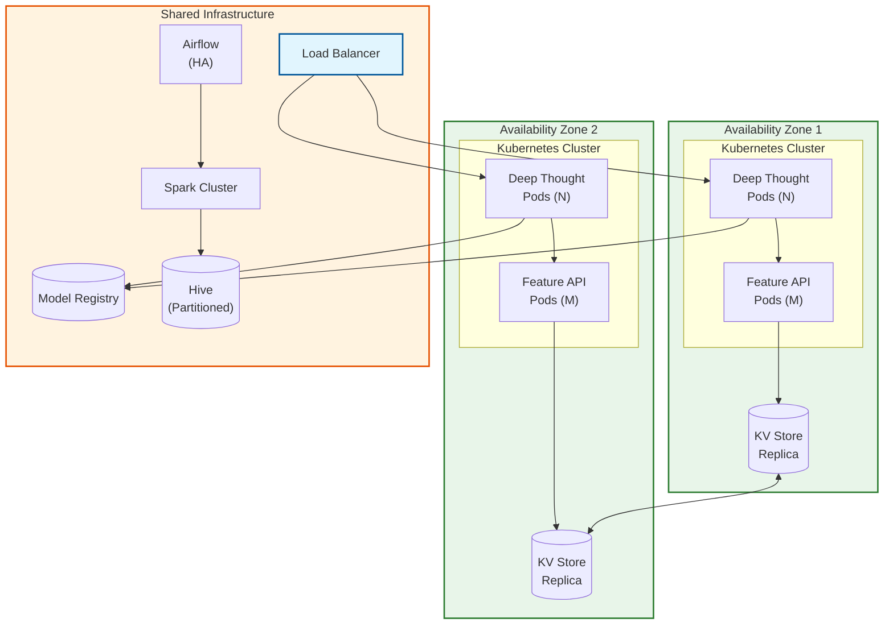

# High-Level Design

## 5-Layer Architecture

Airbnb BigHead follows a layered architecture that separates concerns across the ML lifecycle while maintaining integration through well-defined interfaces.

---

## Layer Descriptions

### Layer 1: Client Layer

| Component | Users | Responsibilities |
|-----------|-------|------------------|
| **Data Scientists** | Model developers | Define features, train models, evaluate experiments |
| **ML Engineers** | Platform users | Deploy pipelines, optimize serving, monitor production |
| **Production Services** | Automated systems | Request predictions for search, pricing, recommendations |

### Layer 2: Development Layer

| Component | Technology | Responsibility |
|-----------|------------|----------------|
| **Redspot** | Docker + JupyterHub | Containerized notebooks with reproducible environments |
| **BigHead Library** | Python (scikit-learn wrapper) | Pipeline definition, training utilities, model serialization |
| **Python SDK** | Python | Feature definition DSL, API clients |

### Layer 3: Orchestration Layer

| Component | Technology | Responsibility |
|-----------|------------|----------------|
| **ML Automator** | Custom Python | Parse code → Generate Airflow DAGs automatically |
| **Airflow** | Apache Airflow | Workflow scheduling, dependency management, monitoring |
| **Job Scheduler** | Custom + K8s | Resource allocation, priority queuing, capacity management |

### Layer 4: Feature Layer (Zipline/Chronon)

| Component | Technology | Responsibility |
|-----------|------------|----------------|
| **Feature DSL** | Python declarative | Single source of truth for feature definitions |
| **Spark Jobs** | Apache Spark | Batch feature computation, backfills |
| **Flink Jobs** | Apache Flink | Streaming feature computation |
| **Kafka** | Apache Kafka | Event bus for real-time data |
| **Hive (Offline)** | Apache Hive | Historical feature storage for training |
| **KV Store (Online)** | Custom/Redis | Low-latency feature serving |

### Layer 5: Serving Layer

| Component | Technology | Responsibility |
|-----------|------------|----------------|
| **Deep Thought** | Kubernetes + Docker | Real-time model inference |
| **Model Registry** | Custom | Model versioning, artifact storage, deployment state |
| **Feature API** | REST/gRPC | Online feature lookup interface |

---

## Data Flow Diagrams

### Training Pipeline Flow

### Online Prediction Flow

### Lambda Architecture for Features

---

## Key Architectural Decisions

### Decision 1: Declarative Feature DSL vs Imperative Code

| Aspect | Declarative DSL (Chosen) | Imperative Code |
|--------|-------------------------|-----------------|
| **Pros** | Single source of truth, train-serve consistency, optimization opportunities | Flexible, familiar to developers |
| **Cons** | Learning curve, limited expressiveness | Consistency bugs, duplicate logic |
| **Decision** | **Declarative DSL** - The #1 ML production bug is train-serve skew |

### Decision 2: Lambda Architecture vs Kappa Architecture

| Aspect | Lambda (Chosen) | Kappa |
|--------|----------------|-------|
| **Pros** | Historical accuracy guaranteed, batch for correctness, stream for freshness | Single codebase, simpler operations |
| **Cons** | Two code paths, sync complexity | Late data handling complex, reprocessing expensive |
| **Decision** | **Lambda** - Point-in-time correctness requires batch path for training |

### Decision 3: Automatic vs Manual DAG Generation

| Aspect | Automatic (Chosen) | Manual |
|--------|-------------------|--------|
| **Pros** | Reduced boilerplate, enforced patterns, faster iteration | Full control, explicit dependencies |
| **Cons** | Less flexibility, debugging harder | Inconsistent across teams, error-prone |
| **Decision** | **Automatic** - 80% reduction in pipeline code, pattern enforcement |

### Decision 4: Kubernetes-Native vs Custom Serving

| Aspect | Kubernetes (Chosen) | Custom Platform |
|--------|--------------------|--------------------|
| **Pros** | Container isolation, ecosystem tooling, auto-scaling | Optimized for ML, lower overhead |
| **Cons** | Complexity, K8s operational burden | Maintenance cost, limited ecosystem |
| **Decision** | **Kubernetes** - Leverage ecosystem for serving, custom for ML-specific |

---

## Architecture Pattern Checklist

| Pattern | Decision | Rationale |
|---------|----------|-----------|
| **Sync vs Async** | Both | Sync for predictions, async for training pipelines |
| **Event-Driven vs Request-Response** | Both | Event-driven for features, request-response for predictions |
| **Push vs Pull** | Pull (serving) | Features pulled on-demand at prediction time |
| **Stateless vs Stateful** | Stateless (serving) | Models loaded from registry, no in-memory state |
| **Read vs Write Optimization** | Read-heavy | Online store optimized for feature lookups |
| **Real-time vs Batch** | Lambda (both) | Batch for accuracy, streaming for freshness |
| **Edge vs Origin** | Origin | No edge caching for ML predictions |

---

## Technology Stack

---

## Component Integration Summary

| Integration | Source | Target | Protocol | Data Format |
|-------------|--------|--------|----------|-------------|
| Feature Definition | Python SDK | Zipline DSL | Python API | DSL Objects |
| DAG Generation | BigHead Library | ML Automator | Python API | AST |
| DAG Execution | ML Automator | Airflow | Airflow API | DAG Python |
| Batch Features | Airflow | Spark | SparkSubmit | Spark Job |
| Streaming Features | Kafka | Flink | Kafka Protocol | Avro/JSON |
| Feature Serving | Deep Thought | Feature API | gRPC | Protobuf |
| Model Loading | Deep Thought | Model Registry | HTTP | Model Artifact |
| Prediction Request | Services | Deep Thought | REST/gRPC | JSON/Protobuf |

---

## Deployment Architecture

