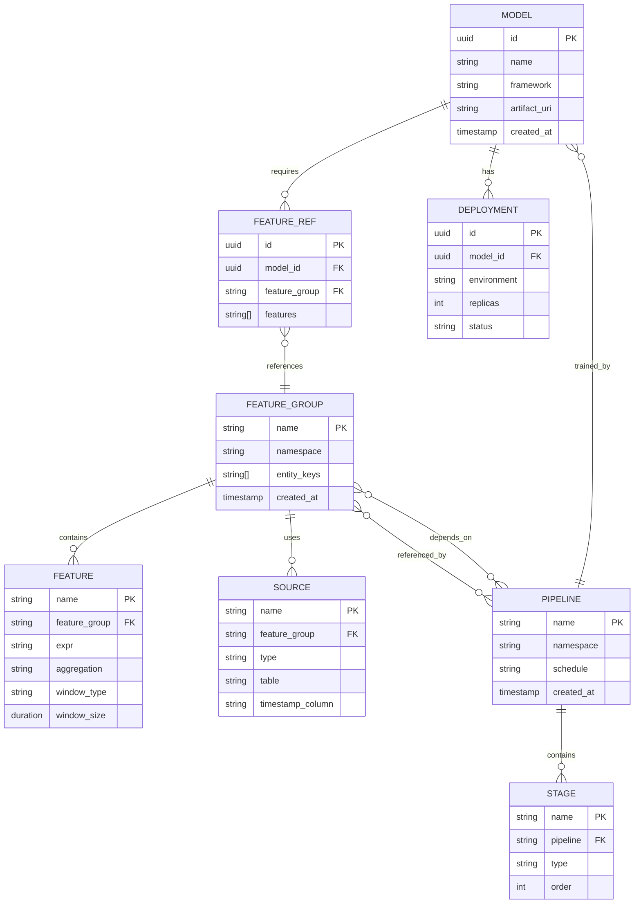

# Low-Level Design

## Data Model

### Zipline/Chronon Feature Definition Schema

```
FeatureGroup {
    name: String                      // Unique identifier: "user_booking_features"
    namespace: String                 // Team/domain grouping: "search"
    description: String               // Human-readable purpose

    // Entity grain
    entity_keys: List<KeyColumn> {
        name: String                  // "user_id", "listing_id"
        dtype: DataType               // INT64, STRING
    }

    // Data sources
    sources: List<Source> {
        name: String                  // "bookings", "searches"
        type: EVENT | ENTITY          // Time-series vs snapshot
        table: String                 // Hive table path
        timestamp_column: String      // For point-in-time: "event_time"
        mutation_topic: String        // Kafka topic for streaming
    }

    // Feature definitions
    features: List<Feature> {
        name: String                  // "booking_count_7d"
        expr: Expression              // "COUNT(*)", "AVG(price)"
        dtype: DataType               // INT64, FLOAT64, ARRAY
        aggregation: AggregationType  // SUM, COUNT, AVG, MIN, MAX, LAST
        window: WindowSpec            // Temporal boundary
        default_value: Any            // Fallback when missing
    }

    // Computation config
    batch_schedule: CronExpression    // "0 2 * * *" (daily at 2 AM)
    backfill_start: Date              // Historical data start
    streaming_enabled: Boolean        // Real-time updates

    // Serving config
    online_enabled: Boolean           // Serve from KV store
    ttl: Duration                     // Feature expiration

    created_at: Timestamp
    updated_at: Timestamp
    version: Integer
}

WindowSpec {
    type: UNBOUNDED | SLIDING | TUMBLING | SNAPSHOT
    size: Duration                    // 7 days, 30 days
    slide: Duration (optional)        // For sliding windows
}

AggregationType = SUM | COUNT | AVG | MIN | MAX | FIRST | LAST |
                  LAST_N | APPROX_UNIQUE | APPROX_PERCENTILE |
                  HISTOGRAM | BLOOM_FILTER
```

### BigHead Pipeline Schema

```
Pipeline {
    name: String                      // "pricing_model_v3"
    namespace: String                 // "pricing"
    description: String

    // Feature dependencies
    feature_refs: List<FeatureRef> {
        feature_group: String         // "user_booking_features"
        features: List<String>        // ["booking_count_7d", "avg_price_30d"]
    }

    // Pipeline stages
    stages: List<Stage> {
        name: String                  // "preprocess", "train", "evaluate"
        type: TRANSFORM | TRAIN | EVALUATE | DEPLOY

        // For TRANSFORM stages
        transformer: Transformer {
            class: String             // "StandardScaler", "OneHotEncoder"
            params: Map<String, Any>
        }
        input_columns: List<String>
        output_columns: List<String>

        // For TRAIN stages
        estimator: Estimator {
            framework: SKLEARN | TENSORFLOW | PYTORCH | XGBOOST
            model_class: String
            hyperparams: Map<String, Any>
        }

        // For EVALUATE stages
        metrics: List<String>         // ["auc", "accuracy", "f1"]
        thresholds: Map<String, Float>
    }

    // DAG config
    schedule: CronExpression          // "0 6 * * 1" (weekly Monday 6 AM)
    dependencies: List<PipelineRef>   // Upstream pipelines
    notifications: NotificationConfig

    created_at: Timestamp
    version: Integer
}
```

### Deep Thought Model Schema

```
Model {
    id: UUID
    name: String                      // "search_ranking_v2"
    namespace: String                 // "search"
    description: String

    // Framework info
    framework: TENSORFLOW | PYTORCH | XGBOOST | SKLEARN | ONNX
    framework_version: String

    // Artifact
    artifact_uri: String              // "s3://models/search_ranking_v2/1.0.0/"
    artifact_hash: String             // SHA256 for integrity
    artifact_size_bytes: Integer

    // Docker environment
    docker_image: String              // "bighead/tf-serving:2.8"
    docker_digest: String

    // Feature requirements
    feature_refs: List<FeatureRef>
    input_schema: Schema {
        fields: List<Field> {
            name: String
            dtype: DataType
            shape: List<Integer>      // [None, 128] for variable batch
            required: Boolean
        }
    }
    output_schema: Schema

    // Serving config
    default_replicas: Integer
    min_replicas: Integer
    max_replicas: Integer
    resources: ResourceSpec {
        cpu_request: String           // "500m"
        cpu_limit: String             // "2"
        memory_request: String        // "1Gi"
        memory_limit: String          // "4Gi"
        gpu_request: Integer          // 0 or 1
    }

    // Deployment state
    deployments: List<Deployment> {
        environment: String           // "production", "staging"
        replicas: Integer
        status: PENDING | RUNNING | FAILED
        deployed_at: Timestamp
    }

    // Metadata
    created_by: String
    created_at: Timestamp
    trained_at: Timestamp
    metrics: Map<String, Float>       // {"auc": 0.85, "accuracy": 0.92}
}
```

---

## Entity Relationship Diagram



---

## API Design

### Feature Definition API

```
// Create/Update Feature Group
POST /api/v1/feature-groups
Request:
{
    "name": "user_booking_features",
    "namespace": "search",
    "entity_keys": [{"name": "user_id", "dtype": "INT64"}],
    "sources": [{
        "name": "bookings",
        "type": "EVENT",
        "table": "hive.bookings.events",
        "timestamp_column": "booking_time"
    }],
    "features": [{
        "name": "booking_count_7d",
        "expr": "COUNT(*)",
        "aggregation": "COUNT",
        "window": {"type": "SLIDING", "size": "7d"}
    }],
    "batch_schedule": "0 2 * * *",
    "online_enabled": true
}
Response:
{
    "name": "user_booking_features",
    "version": 1,
    "status": "CREATED",
    "pipelines_generated": {
        "batch": "user_booking_features_batch_v1",
        "streaming": "user_booking_features_stream_v1"
    }
}

// Online Feature Lookup
POST /api/v1/features/online
Request:
{
    "feature_group": "user_booking_features",
    "entity_keys": {"user_id": [123, 456, 789]},
    "features": ["booking_count_7d", "avg_booking_value_30d"]
}
Response:
{
    "features": {
        "123": {"booking_count_7d": 5, "avg_booking_value_30d": 150.0},
        "456": {"booking_count_7d": 2, "avg_booking_value_30d": 200.0},
        "789": {"booking_count_7d": 0, "avg_booking_value_30d": null}
    },
    "metadata": {
        "freshness": {"booking_count_7d": "2024-01-15T10:00:00Z"},
        "latency_ms": 3
    }
}

// Trigger Backfill
POST /api/v1/feature-groups/{name}/backfill
Request:
{
    "start_date": "2023-01-01",
    "end_date": "2024-01-01",
    "parallelism": 10
}
Response:
{
    "job_id": "backfill_123",
    "status": "SUBMITTED",
    "estimated_completion": "2024-01-15T18:00:00Z"
}
```

### ML Automator API

```
// Generate DAG from Python Code
POST /api/v1/pipelines/generate
Request:
{
    "name": "pricing_model_pipeline",
    "code_path": "s3://notebooks/pricing_model.py",
    "schedule": "0 6 * * 1",
    "notifications": {
        "on_failure": ["team@airbnb.com"],
        "on_success": []
    }
}
Response:
{
    "dag_id": "pricing_model_pipeline_v1",
    "airflow_url": "https://airflow.internal/dags/pricing_model_pipeline_v1",
    "tasks": ["fetch_features", "preprocess", "train", "evaluate", "register"],
    "schedule": "0 6 * * 1"
}

// Get Pipeline Status
GET /api/v1/pipelines/{dag_id}/status
Response:
{
    "dag_id": "pricing_model_pipeline_v1",
    "status": "SUCCESS",
    "last_run": {
        "execution_date": "2024-01-15T06:00:00Z",
        "duration_seconds": 3600,
        "tasks": {
            "fetch_features": "SUCCESS",
            "preprocess": "SUCCESS",
            "train": "SUCCESS",
            "evaluate": "SUCCESS",
            "register": "SUCCESS"
        }
    },
    "next_run": "2024-01-22T06:00:00Z"
}
```

### Deep Thought Serving API

```
// Prediction Request
POST /api/v1/predict
Request:
{
    "model": "search_ranking",
    "version": "latest",  // or specific version number
    "instances": [
        {"user_id": 123, "listing_id": 456},
        {"user_id": 123, "listing_id": 789}
    ],
    "parameters": {
        "return_probabilities": true
    }
}
Response:
{
    "predictions": [
        {"score": 0.85, "rank": 1, "probabilities": [0.15, 0.85]},
        {"score": 0.72, "rank": 2, "probabilities": [0.28, 0.72]}
    ],
    "metadata": {
        "model_version": "v2.3.1",
        "latency_ms": 12,
        "features_used": ["booking_count_7d", "listing_views_30d"]
    }
}

// Deploy Model
POST /api/v1/models/{model_id}/deploy
Request:
{
    "environment": "production",
    "replicas": 3,
    "canary_percent": 10,
    "rollback_on_error": true
}
Response:
{
    "deployment_id": "deploy_abc123",
    "status": "DEPLOYING",
    "progress": {
        "canary_replicas": 1,
        "target_replicas": 3,
        "healthy_replicas": 0
    }
}

// Get Model Health
GET /api/v1/models/{model_id}/health
Response:
{
    "model_id": "search_ranking",
    "version": "v2.3.1",
    "status": "HEALTHY",
    "replicas": {
        "desired": 3,
        "ready": 3,
        "available": 3
    },
    "metrics": {
        "qps": 1500,
        "latency_p50_ms": 8,
        "latency_p99_ms": 25,
        "error_rate": 0.001
    }
}
```

---

## Core Algorithms

### Algorithm 1: Point-in-Time Feature Join

```
ALGORITHM: PointInTimeJoin

PURPOSE: Join features to events at historical timestamps, preventing data leakage

INPUT:
    events: DataFrame           // Events with entity_key, event_timestamp
    features: DataFrame         // Historical features with entity_key, feature_timestamp, values
    entity_key: String         // Join key (e.g., "user_id")
    event_time: String         // Column name for event timestamp
    feature_time: String       // Column name for feature timestamp

OUTPUT:
    DataFrame with events joined to features as they existed at event time

PSEUDOCODE:
    FUNCTION point_in_time_join(events, features, entity_key, event_time, feature_time):
        // Step 1: For each event, find all features with timestamp <= event_timestamp
        joined = events.join(
            features,
            on = entity_key,
            condition = features[feature_time] <= events[event_time]
        )

        // Step 2: For each event, keep only the latest feature value
        window = Window.partition_by(entity_key, event_time)
                       .order_by(feature_time, descending=True)

        ranked = joined.with_column(
            row_number().over(window).alias("rank")
        )

        result = ranked.filter(rank == 1).drop("rank")

        RETURN result

OPTIMIZATION - Partition Pruning:
    // If features are date-partitioned, only scan relevant partitions
    FUNCTION optimized_pit_join(events, features, ...):
        // Get date range from events
        min_date = events.select(min(event_time)).first()
        max_date = events.select(max(event_time)).first()

        // Add lookback window for features
        feature_min_date = min_date - LOOKBACK_DAYS

        // Filter features to relevant partitions
        filtered_features = features.filter(
            feature_date >= feature_min_date AND
            feature_date <= max_date
        )

        RETURN point_in_time_join(events, filtered_features, ...)

COMPLEXITY:
    Time: O(E * log(F)) where E = events, F = features per entity (with sorted merge)
    Space: O(E + F) for the result set
    Optimization: Partition pruning reduces F significantly
```

### Algorithm 2: Feature DSL to Execution Plan Compilation

```
ALGORITHM: CompileFeatureDSL

PURPOSE: Compile declarative feature definition to batch (Spark) and streaming (Flink) plans

INPUT:
    feature_group: FeatureGroup    // Declarative feature definition

OUTPUT:
    batch_plan: SparkPlan          // Spark SQL + DataFrame operations
    stream_plan: FlinkPlan         // Flink stateful operators

PSEUDOCODE:
    FUNCTION compile(feature_group):
        // Step 1: Parse and validate DSL
        ast = parse_dsl(feature_group)
        validate_semantics(ast)

        // Step 2: Generate batch plan (Spark)
        batch_plan = generate_batch_plan(ast)

        // Step 3: Generate streaming plan (Flink)
        stream_plan = generate_stream_plan(ast)

        // Step 4: Verify equivalence (same output schema)
        verify_schema_match(batch_plan.output_schema, stream_plan.output_schema)

        RETURN (batch_plan, stream_plan)

    FUNCTION generate_batch_plan(ast):
        // Convert aggregations to Spark SQL window functions
        FOR each feature IN ast.features:
            IF feature.aggregation == COUNT:
                sql = "COUNT(*) OVER (PARTITION BY {entity_key}
                       ORDER BY {timestamp}
                       RANGE BETWEEN INTERVAL '{window}' PRECEDING AND CURRENT ROW)"
            ELIF feature.aggregation == AVG:
                sql = "AVG({expr}) OVER (...)"
            // ... other aggregations

        // Combine into single Spark job
        spark_job = SparkJob(
            source = ast.sources[0].table,
            transformations = sql_expressions,
            output = hive_table(ast.name)
        )
        RETURN spark_job

    FUNCTION generate_stream_plan(ast):
        // Convert aggregations to Flink stateful operators
        FOR each feature IN ast.features:
            IF feature.aggregation == COUNT:
                operator = CountAggregator(
                    window = feature.window,
                    state_backend = RocksDB
                )
            ELIF feature.aggregation == AVG:
                operator = AverageAggregator(...)
            // ... other aggregations

        // Build Flink job DAG
        flink_job = FlinkJob(
            source = KafkaSource(ast.sources[0].mutation_topic),
            operators = operators,
            sink = KVStoreSink(ast.name)
        )
        RETURN flink_job

KEY INSIGHT:
    Same DSL compiles to different execution engines while maintaining
    identical semantics, ensuring train-serve consistency.

AGGREGATION MAPPING:
    | DSL Aggregation | Spark (Batch)           | Flink (Streaming)         |
    |-----------------|-------------------------|---------------------------|
    | COUNT           | COUNT(*) OVER window    | CountAggregator(state)    |
    | SUM             | SUM(x) OVER window      | SumAggregator(state)      |
    | AVG             | AVG(x) OVER window      | RunningAverage(sum, cnt)  |
    | LAST            | LAST_VALUE OVER window  | LatestValueState          |
    | APPROX_UNIQUE   | APPROX_COUNT_DISTINCT   | HyperLogLog               |
```

### Algorithm 3: ML Automator DAG Generation

```
ALGORITHM: GenerateDAG

PURPOSE: Convert Python training code with decorators to Airflow DAG

INPUT:
    python_code: String           // Python source code with @bighead decorators
    config: PipelineConfig        // Schedule, notifications, resources

OUTPUT:
    airflow_dag: String           // Generated Airflow DAG Python file

PSEUDOCODE:
    FUNCTION generate_dag(python_code, config):
        // Step 1: Parse Python AST
        ast = parse_python(python_code)

        // Step 2: Extract decorated functions
        tasks = []
        FOR each function IN ast.functions:
            IF has_decorator(function, "@bighead.task"):
                task = extract_task(function)
                tasks.append(task)

        // Step 3: Build dependency graph
        dependencies = {}
        FOR each task IN tasks:
            deps = extract_dependencies(task)
            dependencies[task.name] = deps

        // Step 4: Validate no cycles
        IF has_cycle(dependencies):
            RAISE ValidationError("Circular dependency detected")

        // Step 5: Map to Airflow operators
        operators = []
        FOR each task IN tasks:
            operator = map_to_operator(task)
            operators.append(operator)

        // Step 6: Generate DAG code
        dag_code = generate_airflow_code(operators, dependencies, config)

        RETURN dag_code

    FUNCTION extract_task(function):
        decorator_args = function.decorator.args
        RETURN Task(
            name = function.name,
            type = decorator_args.get("type", "python"),
            inputs = extract_inputs(function),
            outputs = extract_outputs(function),
            resources = decorator_args.get("resources", default_resources)
        )

    FUNCTION map_to_operator(task):
        MATCH task.type:
            CASE "feature":
                RETURN SparkSubmitOperator(
                    task_id = task.name,
                    application = "feature_job.py",
                    conf = {"spark.executor.memory": "4g"}
                )
            CASE "train":
                RETURN KubernetesPodOperator(
                    task_id = task.name,
                    image = "bighead/training:latest",
                    resources = task.resources
                )
            CASE "python":
                RETURN PythonOperator(
                    task_id = task.name,
                    python_callable = task.function
                )

EXAMPLE INPUT:
    @bighead.task(type="feature")
    def fetch_features():
        return zipline.get_features(["user_features", "listing_features"])

    @bighead.task(type="train", depends_on=["fetch_features"])
    def train_model(features):
        model = XGBClassifier()
        model.fit(features)
        return model

EXAMPLE OUTPUT (Airflow DAG):
    dag = DAG("generated_pipeline", schedule_interval="0 6 * * 1")

    fetch_features = SparkSubmitOperator(task_id="fetch_features", ...)
    train_model = KubernetesPodOperator(task_id="train_model", ...)

    fetch_features >> train_model
```

### Algorithm 4: Online Feature Lookup with Caching

```
ALGORITHM: LookupFeaturesOnline

PURPOSE: Low-latency feature retrieval with multi-level caching

INPUT:
    entity_keys: Map<String, List<Any>>   // e.g., {"user_id": [123, 456]}
    feature_names: List<String>            // e.g., ["booking_count_7d"]

OUTPUT:
    features: Map<EntityKey, Map<FeatureName, Value>>
    metadata: LookupMetadata

PSEUDOCODE:
    FUNCTION lookup_features(entity_keys, feature_names):
        result = {}
        cache_hits = {"l1": 0, "l2": 0, "store": 0}

        // Step 1: Check L1 cache (local in-memory)
        l1_cache_key = hash(entity_keys, feature_names)
        IF l1_cache.contains(l1_cache_key):
            cache_hits["l1"] += 1
            RETURN l1_cache.get(l1_cache_key)

        // Step 2: Check L2 cache (distributed cache)
        missing_keys = []
        FOR each entity_key IN entity_keys:
            l2_key = f"{entity_key}:{feature_names}"
            IF l2_cache.contains(l2_key):
                result[entity_key] = l2_cache.get(l2_key)
                cache_hits["l2"] += 1
            ELSE:
                missing_keys.append(entity_key)

        // Step 3: Query online store for cache misses
        IF missing_keys.length > 0:
            store_result = online_store.batch_get(missing_keys, feature_names)
            FOR each (key, features) IN store_result:
                result[key] = features
                cache_hits["store"] += 1

                // Populate caches
                l2_cache.set(f"{key}:{feature_names}", features, ttl=300s)

        // Step 4: Apply transformations (same as training DSL)
        transformed = apply_transformations(result, feature_names)

        // Step 5: Update L1 cache
        l1_cache.set(l1_cache_key, transformed, ttl=60s)

        RETURN (transformed, LookupMetadata(cache_hits, latency))

LATENCY TARGET: P99 < 10ms

CACHE CONFIGURATION:
    | Level | Type         | Size   | TTL  | Eviction |
    |-------|--------------|--------|------|----------|
    | L1    | In-memory    | 100MB  | 60s  | LRU      |
    | L2    | Distributed  | 10GB   | 300s | LRU      |
    | Store | KV Database  | 21TB   | None | TTL-based|

BATCH OPTIMIZATION:
    // Batch multiple entity lookups in single store query
    FUNCTION batch_get(entity_keys, feature_names):
        // Use multi-get for KV store efficiency
        keys = [f"{ek}:{fn}" for ek in entity_keys for fn in feature_names]
        RETURN kv_store.multi_get(keys)
```

---

## Indexing Strategy

### Feature Store (Online KV)

| Index Type | Key Structure | Purpose |
|------------|---------------|---------|
| **Primary** | `{entity_type}:{entity_id}:{feature_group}` | Point lookups |
| **Secondary** | `{feature_group}:{entity_type}` | Feature group scans |

### Feature Store (Offline Hive)

| Partition Strategy | Columns | Purpose |
|-------------------|---------|---------|
| **Date** | `ds` (date string) | Time-based queries, retention |
| **Entity Type** | `entity_type` | Efficient entity-specific queries |
| **Feature Group** | `feature_group` | Feature group isolation |

### Model Registry

| Index | Columns | Purpose |
|-------|---------|---------|
| **Primary** | `model_id` | Direct lookup |
| **Name-Version** | `(name, version)` | Version resolution |
| **Namespace** | `namespace` | Team-based queries |
| **Created** | `created_at` | Audit, cleanup |

---

## Rate Limiting

| Endpoint | Rate Limit | Scope | Burst |
|----------|------------|-------|-------|
| `/features/online` | 100K QPS | Per feature group | 150K |
| `/predict` | 10K QPS | Per model | 15K |
| `/feature-groups` (create) | 10/minute | Per user | 20 |
| `/backfill` | 10/hour | Per user | 15 |
| `/pipelines/generate` | 100/day | Per user | 150 |
| `/models/deploy` | 50/hour | Per namespace | 75 |

---

## Idempotency Handling

| Operation | Idempotency Key | Behavior |
|-----------|-----------------|----------|
| Feature Backfill | `feature_group + date_range + version` | Skip if exists with same version |
| DAG Generation | `pipeline_name + code_hash` | Return existing DAG if hash matches |
| Model Deployment | `model_id + version + environment` | Restart if failed, skip if running |
| Prediction | None (stateless) | Always execute |
| Feature Lookup | None (read-only) | Always execute |

---

## Error Handling

| Error Type | HTTP Code | Retry Strategy | Client Action |
|------------|-----------|----------------|---------------|
| Feature Not Found | 404 | No retry | Use default value |
| Store Timeout | 504 | Exponential backoff (3x) | Fall back to cached |
| Model Not Ready | 503 | Fixed delay (1s, 3x) | Queue or fallback |
| Invalid Request | 400 | No retry | Fix request |
| Rate Limited | 429 | Use Retry-After header | Backoff |
| Internal Error | 500 | Exponential backoff (3x) | Alert if persistent |
