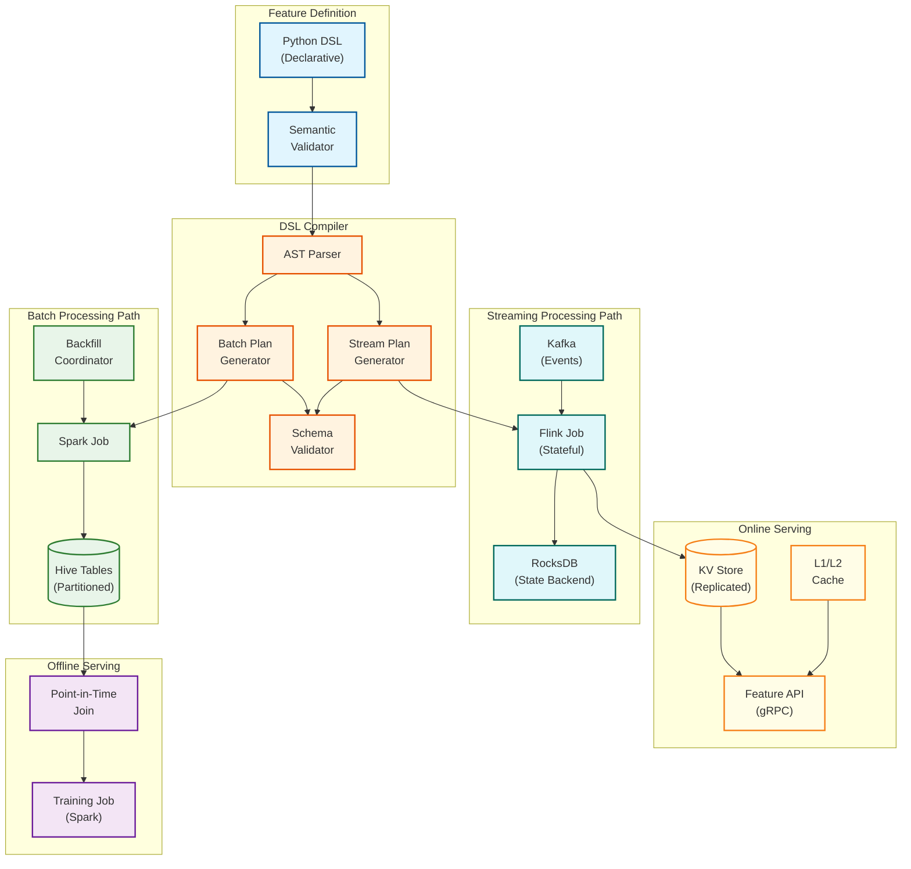
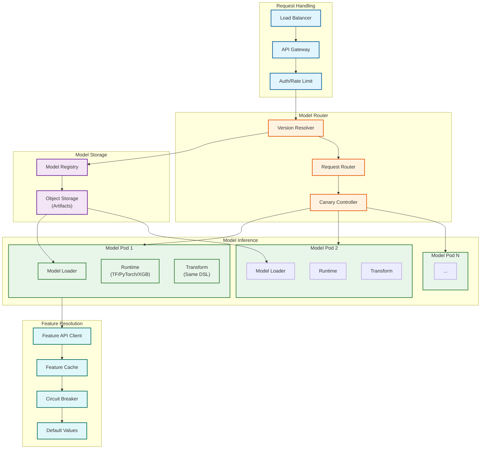

# Deep Dive and Bottlenecks

## Critical Component 1: Zipline/Chronon Feature Store

### Why Critical

| Factor | Impact | Consequence if Failed |
|--------|--------|----------------------|
| **Train-Serve Consistency** | #1 cause of ML production bugs | Models degrade silently in production |
| **Point-in-Time Correctness** | Prevents data leakage in training | Overfitted models, invalid evaluations |
| **Scale** | 30,000+ features, millions of lookups | Revenue-impacting predictions fail |
| **Developer Velocity** | Months to days feature development | Competitive disadvantage |

### Internal Architecture



### Declarative DSL Deep Dive

**Example Feature Definition:**

```python
# Zipline/Chronon Feature DSL
user_booking_features = FeatureGroup(
    name="user_booking_features",
    namespace="search",
    keys=["user_id"],

    sources=[
        EventSource(
            name="bookings",
            table="hive.bookings.events",
            timestamp="booking_time",
            mutation_topic="bookings-events"  # Kafka topic for streaming
        )
    ],

    features=[
        Feature(
            name="booking_count_7d",
            expr="1",  # Count each event
            aggregation=Aggregation.COUNT,
            window=Window.sliding(days=7)
        ),
        Feature(
            name="avg_booking_value_30d",
            expr="booking_value",
            aggregation=Aggregation.AVG,
            window=Window.sliding(days=30)
        ),
        Feature(
            name="last_booking_city",
            expr="city",
            aggregation=Aggregation.LAST,
            window=Window.unbounded()
        )
    ],

    online_enabled=True,
    batch_schedule="0 2 * * *"  # Daily at 2 AM
)
```

### How DSL Compiles to Batch vs Streaming

| DSL Element | Batch (Spark) | Streaming (Flink) |
|-------------|---------------|-------------------|
| `COUNT` over 7d window | `COUNT(*) OVER (PARTITION BY user_id ORDER BY booking_time RANGE BETWEEN INTERVAL 7 DAYS PRECEDING AND CURRENT ROW)` | `CountAggregator` with `SlidingEventTimeWindow(7d)` state in RocksDB |
| `AVG` over 30d window | `AVG(booking_value) OVER (...)` | `RunningAverage` state (sum + count), update on each event |
| `LAST` unbounded | `LAST_VALUE(city) OVER (ORDER BY booking_time)` | `LatestValueState` updated on each event |
| Late data handling | Recompute affected partitions | Watermark + late data allowance (configurable) |

### Point-in-Time Correctness Implementation

```
PROBLEM: Training data must use features as they existed when the event occurred,
         not current feature values. Using future data causes "data leakage."

EXAMPLE:
    Event: User 123 booked on 2024-01-15
    Wrong: Use booking_count_7d as of 2024-01-20 (includes future bookings)
    Right: Use booking_count_7d as of 2024-01-15 (only past bookings)

SOLUTION - Temporal Join:
    FOR each training event:
        1. Get event timestamp (e.g., 2024-01-15 10:00:00)
        2. Find feature snapshot WHERE feature_timestamp <= event_timestamp
        3. Use the LATEST such snapshot (closest to but not after event)

IMPLEMENTATION:
    -- Spark SQL for point-in-time join
    SELECT
        e.event_id,
        e.user_id,
        e.event_timestamp,
        f.booking_count_7d,
        f.avg_booking_value_30d
    FROM events e
    LEFT JOIN (
        SELECT
            user_id,
            feature_timestamp,
            booking_count_7d,
            avg_booking_value_30d,
            ROW_NUMBER() OVER (
                PARTITION BY user_id, event_id
                ORDER BY feature_timestamp DESC
            ) as rn
        FROM features f
        JOIN events e ON f.user_id = e.user_id
        WHERE f.feature_timestamp <= e.event_timestamp
    ) ranked ON ranked.rn = 1

OPTIMIZATION - Partition Pruning:
    Features partitioned by date (ds)
    Only scan ds >= (event_date - lookback_window) AND ds <= event_date
    Reduces data scanned by 90%+ for long-running feature stores
```

### Failure Modes and Handling

| Failure Mode | Symptoms | Detection | Mitigation | Recovery |
|--------------|----------|-----------|------------|----------|
| **Batch Job Failure** | Stale offline features, missing partitions | Airflow alerts, partition monitoring | Retry with exponential backoff | Manual backfill for missed dates |
| **Streaming Lag** | Online features stale, increased latency | Consumer lag monitoring, freshness SLO | Auto-scale Flink parallelism | Catch-up from Kafka offset |
| **KV Store Unavailable** | Feature lookups fail | Health checks, error rate spike | Circuit breaker → default values | Failover to replica |
| **Schema Drift** | Feature computation errors, null values | Schema validation in DSL compiler | Block deployment, alert | Migrate schema with backfill |
| **Backfill Corruption** | Wrong feature values | Checksums, validation queries | Pause serving, alert | Re-run backfill, validate |

---

## Critical Component 2: Deep Thought Model Serving

### Why Critical

| Factor | Impact | Consequence if Failed |
|--------|--------|----------------------|
| **User-Facing Latency** | Direct impact on guest/host experience | Poor UX, lost bookings |
| **Availability** | Revenue-generating predictions | Search/pricing failures |
| **Multi-Framework** | TensorFlow, PyTorch, XGBoost, sklearn | Developer productivity |
| **Feature Integration** | Native Zipline feature lookup | Consistent predictions |

### Internal Architecture



### Kubernetes-Native Deployment

```yaml
# Deep Thought Model Deployment (Conceptual)
Deployment:
  metadata:
    name: search-ranking-v2
    labels:
      model: search-ranking
      version: v2.3.1
  spec:
    replicas: 3
    selector:
      matchLabels:
        model: search-ranking
    template:
      spec:
        containers:
        - name: model-server
          image: bighead/deep-thought:latest
          env:
          - name: MODEL_URI
            value: "s3://models/search-ranking/v2.3.1/"
          - name: FRAMEWORK
            value: "tensorflow"
          resources:
            requests:
              memory: "2Gi"
              cpu: "1"
            limits:
              memory: "4Gi"
              cpu: "2"
          ports:
          - containerPort: 8080
          livenessProbe:
            httpGet:
              path: /health
              port: 8080
            initialDelaySeconds: 30
            periodSeconds: 10
          readinessProbe:
            httpGet:
              path: /ready
              port: 8080
            initialDelaySeconds: 5
            periodSeconds: 5

        - name: feature-sidecar
          image: bighead/feature-client:latest
          env:
          - name: FEATURE_API_ENDPOINT
            value: "feature-api.internal:9090"
          - name: CACHE_SIZE_MB
            value: "100"
          resources:
            requests:
              memory: "256Mi"
              cpu: "100m"

---
Service:
  spec:
    type: ClusterIP
    ports:
    - port: 80
      targetPort: 8080
    selector:
      model: search-ranking

---
HorizontalPodAutoscaler:
  spec:
    scaleTargetRef:
      name: search-ranking-v2
    minReplicas: 3
    maxReplicas: 20
    metrics:
    - type: Resource
      resource:
        name: cpu
        targetAverageUtilization: 70
    - type: Pods
      pods:
        metric:
          name: latency_p99_ms
        target:
          type: AverageValue
          averageValue: 25m  # Scale when P99 > 25ms
```

### Latency Breakdown

| Stage | P50 | P95 | P99 | Optimization |
|-------|-----|-----|-----|--------------|
| **Request Parsing** | 0.3ms | 0.5ms | 1ms | Protocol buffers instead of JSON |
| **Auth/Rate Limit** | 0.2ms | 0.5ms | 1ms | In-memory token cache |
| **Version Resolution** | 0.5ms | 1ms | 2ms | Local cache with 60s TTL |
| **Feature Lookup** | 2ms | 5ms | 8ms | L1/L2 caching, batch requests |
| **Feature Transform** | 0.5ms | 1ms | 2ms | Pre-compiled transformers |
| **Model Inference** | 3ms | 8ms | 12ms | Optimized runtimes, batching |
| **Response Serialization** | 0.2ms | 0.5ms | 1ms | Pre-allocated buffers |
| **Network Overhead** | 0.3ms | 1ms | 2ms | Keep-alive connections |
| **Total** | **7ms** | **17.5ms** | **29ms** | Target: P99 < 30ms |

### Failure Modes and Handling

| Failure Mode | Symptoms | Detection | Mitigation | Recovery |
|--------------|----------|-----------|------------|----------|
| **Model Load Failure** | 503 errors, zero replicas ready | Readiness probe fails | Rollback to previous version | Fix artifact, redeploy |
| **Feature Timeout** | Increased latency, partial responses | Latency SLO breach | Circuit breaker → default features | Feature API recovery |
| **OOM (Out of Memory)** | Pod restarts, intermittent errors | Container OOMKilled | Increase memory limits, model optimization | Auto-restart, alert |
| **GPU Error** | Inference failures on GPU models | CUDA errors in logs | Fallback to CPU inference | GPU node replacement |
| **Canary Failure** | High error rate in canary | Error rate monitoring | Auto-rollback canary | Debug, fix, redeploy |

---

## Critical Component 3: ML Automator

### Why Critical

| Factor | Impact | Consequence if Failed |
|--------|--------|----------------------|
| **Developer Productivity** | 80% reduction in pipeline boilerplate | Slower ML iteration |
| **Consistency** | Enforced patterns across 100+ teams | Inconsistent pipelines, hard to maintain |
| **Reliability** | Automatic retry, monitoring integration | Manual error handling |
| **Governance** | Audit trail, approval workflows | Compliance issues |

### DAG Generation Pipeline

```mermaid
flowchart LR
    subgraph Input["Input Analysis"]
        CODE["Python Code<br/>(@bighead decorators)"]
        AST["AST Parser"]
        EXTRACT["Task Extractor"]
    end

    subgraph Analysis["Dependency Analysis"]
        DEP["Dependency<br/>Graph Builder"]
        CYCLE["Cycle<br/>Detector"]
        TOPO["Topological<br/>Sort"]
    end

    subgraph Generation["DAG Generation"]
        MAP["Operator<br/>Mapper"]
        RES["Resource<br/>Allocator"]
        GEN["Airflow DAG<br/>Generator"]
    end

    subgraph Deployment["Deployment"]
        VAL["DAG Validator"]
        DEPLOY["Airflow<br/>Deployment"]
        REG["Pipeline<br/>Registry"]
    end

    CODE --> AST
    AST --> EXTRACT
    EXTRACT --> DEP
    DEP --> CYCLE
    CYCLE --> TOPO
    TOPO --> MAP
    MAP --> RES
    RES --> GEN
    GEN --> VAL
    VAL --> DEPLOY
    DEPLOY --> REG

    classDef input fill:#e1f5fe,stroke:#01579b,stroke-width:2px
    classDef analysis fill:#fff3e0,stroke:#e65100,stroke-width:2px
    classDef gen fill:#e8f5e9,stroke:#2e7d32,stroke-width:2px
    classDef deploy fill:#f3e5f5,stroke:#6a1b9a,stroke-width:2px

    class CODE,AST,EXTRACT input
    class DEP,CYCLE,TOPO analysis
    class MAP,RES,GEN gen
    class VAL,DEPLOY,REG deploy
```



### Task Type Mapping

| Decorator | Task Type | Airflow Operator | Resources |
|-----------|-----------|------------------|-----------|
| `@bighead.feature()` | Feature computation | SparkSubmitOperator | Spark cluster |
| `@bighead.train()` | Model training | KubernetesPodOperator | CPU/GPU pods |
| `@bighead.evaluate()` | Model evaluation | PythonOperator | Lightweight |
| `@bighead.deploy()` | Model deployment | CustomOperator | API calls |
| `@bighead.transform()` | Data transformation | SparkSubmitOperator | Spark cluster |

### Failure Modes and Handling

| Failure Mode | Symptoms | Detection | Mitigation | Recovery |
|--------------|----------|-----------|------------|----------|
| **Invalid Python Code** | DAG generation fails | AST parsing error | Return clear error message | Developer fixes code |
| **Circular Dependency** | DAG validation fails | Cycle detection | Block submission, show cycle | Developer refactors |
| **Task Failure** | Pipeline incomplete | Airflow task failure | Retry policies (3x exponential) | Auto-retry, then alert |
| **Resource Exhaustion** | Tasks stuck in queue | Queue depth monitoring | Priority queuing, capacity alerts | Scale resources |
| **Airflow Unavailable** | DAG not scheduled | Health check failures | HA Airflow deployment | Failover to standby |

---

## Bottleneck Analysis

### Bottleneck 1: Point-in-Time Join Performance

```
SYMPTOMS:
- Slow feature backfills (hours instead of minutes)
- Training data generation delays
- High Spark cluster costs

ROOT CAUSES:
1. Full table scans for historical features
2. Large shuffle during joins (all data to single partition)
3. Unoptimized date range selection
4. Wide feature tables (many columns)

MITIGATION STRATEGIES:

1. Partition Pruning
   - Partition features by date (ds)
   - Filter to relevant date range before join
   - Reduces data scanned by 90%+

2. Pre-Aggregation
   - Materialize common temporal aggregations
   - Store at multiple granularities (daily, weekly)
   - Trade storage for compute

3. Incremental Backfills
   - Only compute new/changed features
   - Use change data capture for delta detection
   - Merge with existing snapshots

4. Bucketing
   - Bucket by entity_key for co-located joins
   - Eliminates shuffle for same-bucket joins
   - Requires careful key distribution analysis

PERFORMANCE IMPROVEMENT:
| Strategy | Before | After | Improvement |
|----------|--------|-------|-------------|
| Partition Pruning | 4 hours | 30 min | 8x |
| + Pre-Aggregation | 30 min | 10 min | 3x |
| + Incremental | 10 min | 2 min | 5x |
| Combined | 4 hours | 2 min | 120x |
```

### Bottleneck 2: Online Store Latency

```
SYMPTOMS:
- P99 latency spikes
- Feature lookup timeouts
- Inconsistent prediction latency

ROOT CAUSES:
1. Hot partitions (popular entities)
2. Cache misses for cold entities
3. Large feature vectors
4. Cross-datacenter lookups

MITIGATION STRATEGIES:

1. Hot Partition Handling
   - Identify hot entities from access patterns
   - Replicate hot entities across more nodes
   - Use consistent hashing with virtual nodes

2. Multi-Level Caching
   | Level | Location | Size | TTL | Hit Rate Target |
   |-------|----------|------|-----|-----------------|
   | L1 | Pod local | 100MB | 60s | 30% |
   | L2 | Datacenter | 10GB | 300s | 50% |
   | L3 | KV Store | Full | None | 100% |

3. Feature Compression
   - Use sparse representations for high-dim features
   - Quantize float features (16-bit vs 32-bit)
   - Lazy loading for large features

4. Read Replicas
   - Deploy replicas per availability zone
   - Route to nearest replica
   - Async replication with 100ms lag budget

LATENCY IMPROVEMENT:
| Strategy | P99 Before | P99 After |
|----------|------------|-----------|
| Baseline | 50ms | 50ms |
| + L1 Cache | 50ms | 35ms |
| + L2 Cache | 35ms | 15ms |
| + Read Replicas | 15ms | 10ms |
| + Hot Partition | 10ms | 8ms |
```

### Bottleneck 3: Streaming Feature Lag

```
SYMPTOMS:
- Stale features in production
- Inconsistency between batch and streaming features
- Flink backpressure alerts

ROOT CAUSES:
1. Kafka consumer lag during traffic spikes
2. Flink checkpoint overhead
3. State backend (RocksDB) slowdown
4. Key skew in aggregations

MITIGATION STRATEGIES:

1. Consumer Scaling
   - Auto-scale Flink parallelism based on lag
   - Use Kafka partition count = 3x peak parallelism
   - Pre-warm consumers before peak hours

2. Checkpoint Optimization
   - Incremental checkpoints (only changed state)
   - Checkpoint interval: 60s (balance durability vs overhead)
   - Async checkpointing to minimize pause

3. State Backend Tuning
   - RocksDB block cache: 1GB per task manager
   - Compaction: level-based with 4 levels
   - Write buffer: 64MB

4. Key Skew Handling
   - Salt hot keys with random suffix
   - Local pre-aggregation before global
   - Monitoring for key distribution

LAG IMPROVEMENT:
| Strategy | Lag (P99) |
|----------|-----------|
| Baseline | 5 minutes |
| + Scaling | 2 minutes |
| + Checkpoints | 1 minute |
| + State Tuning | 30 seconds |
| + Key Handling | 10 seconds |
```

---

## Concurrency and Race Conditions

### Race 1: Feature Update During Prediction

```
SCENARIO:
    T1: Streaming job updates user_123's booking_count_7d from 5 to 6
    T2: Prediction request reads user_123's features

    If T1 and T2 interleave, might read inconsistent state

SOLUTION: Snapshot Isolation
    - Each prediction request uses features at a consistent point in time
    - Accept eventual consistency (seconds of staleness OK for most models)
    - Document freshness SLA (features < 5 min old)

IMPLEMENTATION:
    FUNCTION get_features_snapshot(entity_keys, timestamp):
        // Read from snapshot, not live state
        snapshot_version = floor(timestamp / SNAPSHOT_INTERVAL)
        RETURN kv_store.get_at_version(entity_keys, snapshot_version)
```

### Race 2: Model Deployment During Traffic

```
SCENARIO:
    T1: Deploy model v2, starts replacing v1 pods
    T2: Prediction requests arrive, some go to v1, some to v2

    Mixed versions serving simultaneously

SOLUTION: Atomic Version Switch
    1. Deploy v2 pods without traffic
    2. Wait for all v2 pods to be ready
    3. Switch load balancer atomically to v2
    4. Drain v1 pods gracefully

IMPLEMENTATION (Kubernetes):
    # Blue-Green Deployment
    1. Create new deployment (green) with v2
    2. Wait for green.replicas == green.readyReplicas
    3. Update service selector to point to green
    4. Scale down blue deployment
```

### Race 3: DAG Update While Running

```
SCENARIO:
    T1: ML Automator generates new DAG version
    T2: Airflow scheduler picks up changes
    T3: Existing DAG run still in progress

    Partial execution with mixed DAG versions

SOLUTION: Versioned DAG Isolation
    - Each DAG version has unique ID: "pipeline_v{hash}"
    - Running DAGs complete with original version
    - New runs use new version
    - Never modify in-flight DAG

IMPLEMENTATION:
    dag_id = f"pipeline_{code_hash[:8]}"

    # Airflow handles version isolation
    # Each dag_id is independent
    # Concurrent runs of different versions OK
```

---

## Performance Tuning Reference

### Feature Store Tuning

| Parameter | Default | Optimized | Impact |
|-----------|---------|-----------|--------|
| Spark executor memory | 4GB | 8GB | Fewer spills, faster joins |
| Spark shuffle partitions | 200 | 500 | Better parallelism for large data |
| Hive partition columns | date | date, entity_type | Faster pruning |
| KV store replication | 2 | 3 | Higher availability |
| Flink parallelism | 4 | 16 | Lower lag |
| Flink checkpoint interval | 30s | 60s | Lower overhead |

### Model Serving Tuning

| Parameter | Default | Optimized | Impact |
|-----------|---------|-----------|--------|
| Pod memory request | 1GB | 2GB | Fewer OOMs |
| Pod CPU request | 500m | 1000m | Faster inference |
| L1 cache size | 50MB | 100MB | Higher hit rate |
| L1 cache TTL | 30s | 60s | Higher hit rate |
| Connection pool size | 10 | 50 | Better concurrency |
| gRPC max message | 4MB | 16MB | Larger batches |
