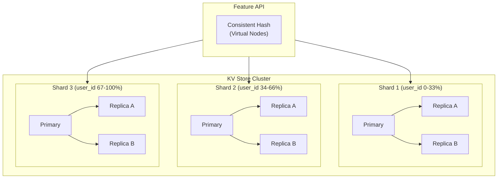
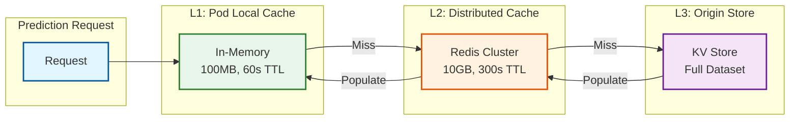
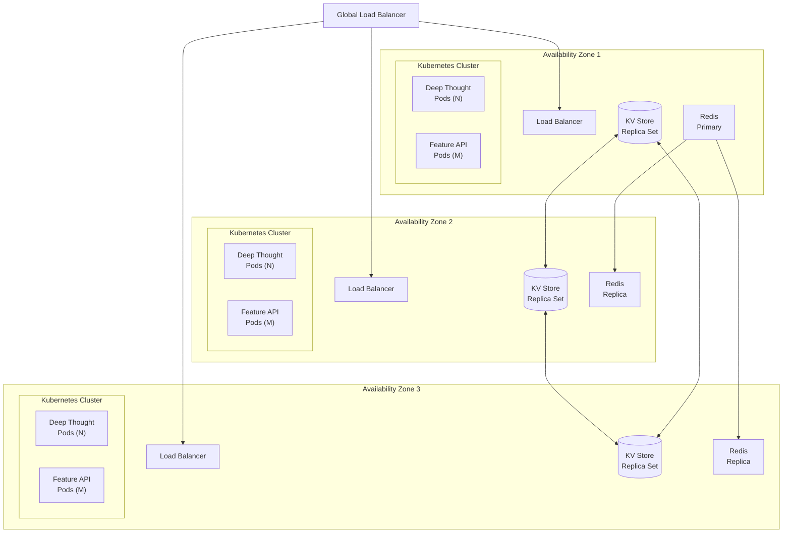
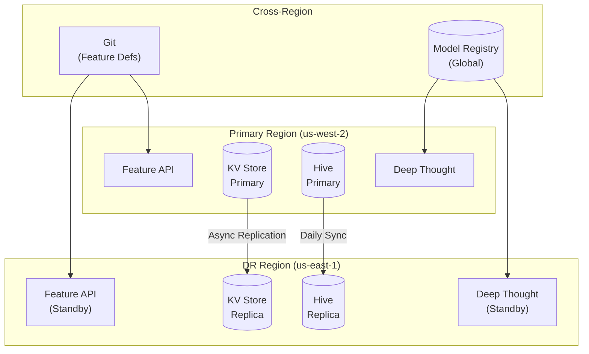

# Scalability and Reliability

## Scalability Strategy

### Horizontal Scaling

| Component | Scaling Unit | Trigger | Action | Limits |
|-----------|--------------|---------|--------|--------|
| **Feature API** | Pod replicas | CPU > 70% OR Latency P99 > 8ms | Add 2 pods | Max 50 pods |
| **Deep Thought** | Pod replicas | CPU > 70% OR QPS > 80% capacity | Add 1 pod | Max 20 pods/model |
| **KV Store (Online)** | Nodes | Storage > 80% OR Read latency > 5ms | Add node | Max 100 nodes |
| **Spark Cluster** | Executors | Queue wait > 5 min | Add 10 executors | Max 500 executors |
| **Flink Jobs** | Parallelism | Consumer lag > 2 min | Double parallelism | Max 64 |
| **Kafka** | Partitions | Throughput > 80% | Add partitions | Max 256/topic |

### Vertical Scaling

| Component | Resource | When to Scale | Target |
|-----------|----------|---------------|--------|
| **Deep Thought Pods** | Memory | Large model artifacts | 4GB → 8GB |
| **Deep Thought Pods** | CPU | Complex inference | 2 cores → 4 cores |
| **Spark Executors** | Memory | Wide feature tables | 8GB → 16GB |
| **Flink Task Managers** | Memory | Large state backends | 4GB → 8GB |
| **KV Store Nodes** | Storage | Feature growth | 500GB → 1TB |

### Auto-Scaling Configuration

```yaml
# Feature API Auto-Scaling
HorizontalPodAutoscaler:
  metadata:
    name: feature-api-hpa
  spec:
    scaleTargetRef:
      name: feature-api
    minReplicas: 5
    maxReplicas: 50
    metrics:
    - type: Resource
      resource:
        name: cpu
        target:
          type: Utilization
          averageUtilization: 70
    - type: Pods
      pods:
        metric:
          name: http_request_latency_p99_ms
        target:
          type: AverageValue
          averageValue: "8"
    behavior:
      scaleUp:
        stabilizationWindowSeconds: 60
        policies:
        - type: Pods
          value: 4
          periodSeconds: 60
      scaleDown:
        stabilizationWindowSeconds: 300
        policies:
        - type: Percent
          value: 10
          periodSeconds: 60

---
# Deep Thought Model Auto-Scaling
HorizontalPodAutoscaler:
  metadata:
    name: search-ranking-hpa
  spec:
    scaleTargetRef:
      name: search-ranking
    minReplicas: 3
    maxReplicas: 20
    metrics:
    - type: Resource
      resource:
        name: cpu
        target:
          type: Utilization
          averageUtilization: 70
    - type: External
      external:
        metric:
          name: prediction_qps
        target:
          type: AverageValue
          averageValue: "500"  # 500 QPS per pod
```

---

## Database Scaling Strategy

### Feature Store (Online - KV)



| Strategy | Implementation | Benefit |
|----------|----------------|---------|
| **Sharding** | Consistent hashing by entity_key | Linear write scaling |
| **Replication** | 3 replicas per shard | Read scaling, fault tolerance |
| **Virtual Nodes** | 100 vnodes per physical node | Even distribution |
| **Read Routing** | Nearest replica | Lower latency |
| **Write Routing** | Primary only | Strong consistency |

### Feature Store (Offline - Hive)

| Strategy | Implementation | Benefit |
|----------|----------------|---------|
| **Partitioning** | By date (ds) and entity_type | Query pruning |
| **Bucketing** | By entity_key (256 buckets) | Join optimization |
| **Compression** | Snappy for hot, Zstd for cold | Storage efficiency |
| **Tiering** | Hot (7d) → Warm (90d) → Cold | Cost optimization |

---

## Caching Strategy

### Multi-Level Cache Architecture



| Cache Level | Type | Size | TTL | Eviction | Hit Rate Target |
|-------------|------|------|-----|----------|-----------------|
| **L1** | Pod-local (Guava) | 100MB | 60s | LRU | 30% |
| **L2** | Distributed (Redis) | 10GB | 300s | LRU | 50% |
| **L3** | Origin (KV Store) | Full | TTL-based | - | 100% |

### Cache Invalidation

| Trigger | Strategy | Latency |
|---------|----------|---------|
| **Streaming Update** | Write-through to L2 | < 100ms |
| **Batch Update** | TTL expiration | 60-300s |
| **Schema Change** | Full invalidation | Manual |
| **Feature Group Update** | Namespace invalidation | < 1s |

---

## Reliability and Fault Tolerance

### Single Points of Failure Analysis

| Component | SPOF Risk | Impact | Mitigation |
|-----------|-----------|--------|------------|
| **KV Store** | High | All online predictions fail | 3x replication, multi-zone |
| **Model Registry** | Medium | New deployments fail | Read replicas, local cache |
| **Airflow Scheduler** | Medium | No new jobs scheduled | HA deployment (2 schedulers) |
| **Feature API** | Low | Degraded predictions | Multi-pod, multi-zone |
| **Deep Thought** | Low | Model-specific outage | Multi-replica, canary |

### Redundancy Strategy



### Failover Mechanisms

| Component | Detection | Failover Time | Mechanism |
|-----------|-----------|---------------|-----------|
| **Pod Failure** | Liveness probe (10s) | 30s | Kubernetes restart |
| **Node Failure** | Node heartbeat (40s) | 2 min | Pod rescheduling |
| **Zone Failure** | Health checks (30s) | 1 min | Load balancer reroute |
| **KV Node Failure** | Gossip protocol (5s) | 30s | Replica promotion |
| **Redis Failure** | Sentinel (5s) | 10s | Automatic failover |

### Circuit Breaker Pattern

```
CIRCUIT BREAKER: Feature Lookup

STATES:
    CLOSED: Normal operation, requests pass through
    OPEN: Failures exceeded threshold, requests fail fast
    HALF_OPEN: Testing if service recovered

CONFIGURATION:
    failure_threshold: 5 failures in 10 seconds
    open_duration: 30 seconds
    half_open_requests: 3

PSEUDOCODE:
    FUNCTION lookup_with_circuit_breaker(entity_keys, features):
        IF circuit.state == OPEN:
            IF current_time > circuit.open_until:
                circuit.state = HALF_OPEN
            ELSE:
                RETURN default_features(features)

        TRY:
            result = feature_api.lookup(entity_keys, features)
            circuit.record_success()
            IF circuit.state == HALF_OPEN:
                circuit.state = CLOSED
            RETURN result
        CATCH timeout_or_error:
            circuit.record_failure()
            IF circuit.failures >= failure_threshold:
                circuit.state = OPEN
                circuit.open_until = current_time + open_duration
            RETURN default_features(features)

DEFAULT VALUES:
    - Numeric features: 0 or global median
    - Categorical features: most common value
    - Boolean features: false
    - Array features: empty array
```

### Retry Strategy

| Operation | Max Retries | Backoff | Timeout |
|-----------|-------------|---------|---------|
| **Feature Lookup** | 2 | Immediate, 10ms | 50ms |
| **Model Prediction** | 1 | Immediate | 100ms |
| **Batch Job Task** | 3 | Exponential (1s, 2s, 4s) | Per task |
| **Model Deployment** | 3 | Fixed (30s) | 5 min |
| **KV Store Write** | 3 | Exponential (100ms) | 1s |

### Graceful Degradation

| Failure Scenario | Degradation Strategy | User Impact |
|------------------|---------------------|-------------|
| Feature Store Down | Use default features | Slightly worse predictions |
| Streaming Lag | Use batch features | Features up to 24h old |
| Model Unavailable | Use fallback model | Older model version |
| Partial Feature Failure | Use available features | Some features missing |
| High Latency | Return cached prediction | Stale prediction |

---

## Disaster Recovery

### Recovery Objectives

| Metric | Target | Justification |
|--------|--------|---------------|
| **RTO (Recovery Time)** | 15 minutes | Critical for revenue |
| **RPO (Recovery Point)** | 1 hour | Feature store can rebuild |

### Backup Strategy

| Data Type | Backup Frequency | Retention | Storage |
|-----------|------------------|-----------|---------|
| **Feature Definitions** | On change (Git) | Forever | Git repository |
| **Model Artifacts** | On registration | 90 days | Object storage |
| **KV Store (Online)** | Continuous streaming | 7 days | Cross-region replica |
| **Hive (Offline)** | Daily snapshots | 365 days | Object storage |
| **Pipeline Configs** | On change | Forever | Git repository |

### Multi-Region Considerations



### Failover Runbook

```
DISASTER RECOVERY RUNBOOK

SCENARIO: Primary Region (us-west-2) Unavailable

PRE-REQUISITES:
    - DR region (us-east-1) has warm standby
    - KV store replica < 1 hour behind
    - Model artifacts in global registry

STEPS:

1. DETECTION (Automated)
   - Global health check fails for > 5 minutes
   - Alert triggers on-call

2. ASSESSMENT (5 minutes)
   - Verify primary region is truly down
   - Check DR region health
   - Assess data lag in DR

3. FAILOVER DECISION (2 minutes)
   - If RTO > 15 min without failover: PROCEED
   - If expected primary recovery < 15 min: WAIT

4. DNS FAILOVER (3 minutes)
   - Update DNS to point to DR region
   - TTL: 60 seconds
   - Propagation: 2-3 minutes

5. ACTIVATE DR SERVICES (5 minutes)
   - Scale up DR Deep Thought replicas
   - Scale up DR Feature API replicas
   - Verify model loading

6. VERIFY (5 minutes)
   - Run smoke tests
   - Monitor error rates
   - Confirm predictions flowing

7. COMMUNICATE
   - Update status page
   - Notify stakeholders

TOTAL RTO: ~15 minutes

FAILBACK:
    - When primary recovers, reverse sync DR → Primary
    - Gradual traffic shift (10% → 50% → 100%)
    - Full failback in maintenance window
```

---

## Capacity Planning

### Growth Projections

| Metric | Current | Year 2 | Year 5 | Scaling Strategy |
|--------|---------|--------|--------|------------------|
| **Features** | 30K | 60K | 150K | Namespace sharding |
| **Online QPS** | 1.7M | 3.4M | 8.5M | Add cache layers, read replicas |
| **Offline Storage** | 760 TB | 1.5 PB | 3.8 PB | Cold storage tiering |
| **Models** | 100 | 200 | 500 | Multi-cluster deployment |
| **Entities** | 7M | 14M | 35M | Shard by entity type |

### Capacity Thresholds

| Resource | Warning (Yellow) | Critical (Red) | Action |
|----------|------------------|----------------|--------|
| **CPU Utilization** | 70% | 85% | Scale horizontally |
| **Memory Utilization** | 75% | 90% | Scale vertically or horizontally |
| **Storage Utilization** | 70% | 85% | Add nodes or tier cold data |
| **Network Bandwidth** | 60% | 80% | Optimize protocols, add capacity |
| **Kafka Lag** | 2 min | 5 min | Scale consumers |
| **API Latency P99** | 80% of SLO | 95% of SLO | Investigate bottlenecks |
