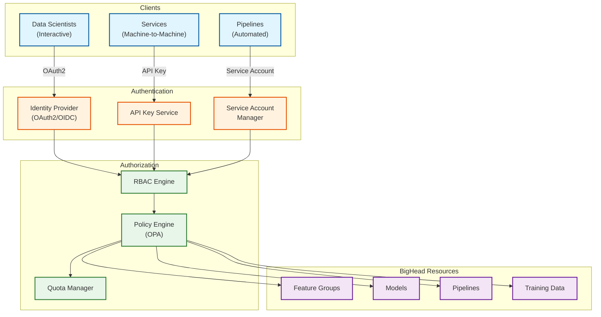
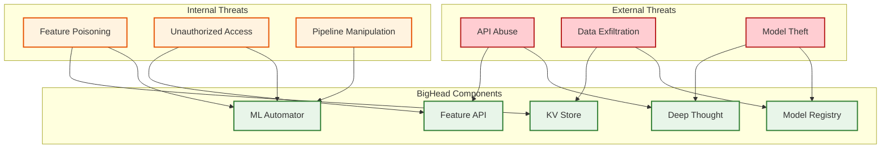

# Security and Compliance

## Authentication and Authorization

### Authentication Architecture



### Authentication Methods

| Client Type | Method | Token Type | Expiry | Refresh |
|-------------|--------|------------|--------|---------|
| **Data Scientists** | OAuth2 + OIDC | JWT | 1 hour | Refresh token (24h) |
| **Services** | API Key | Opaque | None | Manual rotation |
| **Pipelines** | Service Account | JWT | 24 hours | Auto-refresh |
| **Internal** | mTLS | Certificate | 1 year | Auto-rotation |

### Authorization Model (RBAC + ABAC)

**Roles:**

| Role | Description | Permissions |
|------|-------------|-------------|
| **viewer** | Read-only access | View features, models, predictions |
| **developer** | Create and modify | Create features, train models, deploy to staging |
| **deployer** | Production access | Deploy to production, modify serving config |
| **admin** | Full access | All operations, manage permissions |
| **service** | Machine access | API calls, no interactive access |

**Namespace-Based Access:**

```
AUTHORIZATION POLICY STRUCTURE:

Subject: user or service identity
Resource: namespace/resource_type/resource_id
Action: create, read, update, delete, deploy

EXAMPLE POLICIES:

# Search team can manage their features
ALLOW user IN group:search-team
    ON namespace:search/feature_groups/*
    ACTION: create, read, update, delete

# ML platform team can deploy any model
ALLOW user IN group:ml-platform
    ON namespace:*/models/*
    ACTION: deploy

# Services can read features in their namespace
ALLOW service WITH namespace:search
    ON namespace:search/features/*
    ACTION: read
```

**Attribute-Based Access Control (ABAC):**

| Attribute | Example | Use Case |
|-----------|---------|----------|
| `namespace` | "search", "pricing" | Team isolation |
| `environment` | "staging", "production" | Deployment control |
| `data_classification` | "public", "pii", "restricted" | Data access |
| `model_tier` | "critical", "standard" | Change control |

---

## Data Security

### Encryption

| Data State | Method | Key Management | Rotation |
|------------|--------|----------------|----------|
| **At Rest (KV Store)** | AES-256-GCM | Cloud KMS | Annual |
| **At Rest (Hive)** | AES-256 | Cloud KMS | Annual |
| **At Rest (Model Artifacts)** | AES-256 | Cloud KMS | Annual |
| **In Transit (Internal)** | TLS 1.3 | Internal CA | 90 days |
| **In Transit (External)** | TLS 1.3 | Public CA | Annual |
| **API Keys** | SHA-256 hash | Vault | Manual |

### Data Classification

| Classification | Description | Features | Controls |
|----------------|-------------|----------|----------|
| **Public** | Non-sensitive aggregates | `listing_count`, `avg_price_region` | Standard access |
| **Internal** | Business data | `booking_count`, `search_patterns` | Namespace access |
| **PII** | Personal identifiable | `user_location`, `name_embedding` | PII-approved access only |
| **Restricted** | Highly sensitive | `payment_features`, `fraud_signals` | Explicit approval, audit |

### PII Handling

```
PII PROTECTION MEASURES:

1. IDENTIFICATION
   - Automatic PII detection in feature definitions
   - Manual classification override
   - Regular scans for unmarked PII

2. ACCESS CONTROL
   - Separate PII access role
   - Approval workflow for PII features
   - Time-limited access grants

3. DATA MINIMIZATION
   - Hash/tokenize identifiers where possible
   - Aggregate rather than individual
   - Delete when no longer needed

4. ANONYMIZATION TECHNIQUES
   | Technique | Use Case | Example |
   |-----------|----------|---------|
   | Hashing | User identifiers | SHA-256(user_id + salt) |
   | k-Anonymity | Location features | Round to city level |
   | Differential Privacy | Aggregate stats | Add calibrated noise |
   | Tokenization | External IDs | Replace with internal token |

5. AUDIT TRAIL
   - Log all PII feature access
   - Include accessor, timestamp, justification
   - Retain for 2 years
```

### Data Masking

| Context | Masking Level | Example |
|---------|---------------|---------|
| **Production Serving** | None (authorized) | Full feature values |
| **Development** | Partial | Hashed user_id, rounded values |
| **Logs** | Full | `user_id=***`, `email=***@***.com` |
| **Exports** | Configurable | Based on destination classification |

---

## Threat Model

### Attack Surface



### Top Threat Analysis

| Threat | Likelihood | Impact | Risk | Mitigation |
|--------|------------|--------|------|------------|
| **Feature Poisoning** | Medium | High | High | Validation, audit, rollback |
| **Model Extraction** | Low | High | Medium | Rate limiting, watermarking |
| **Data Exfiltration** | Low | Critical | High | DLP, access controls, audit |
| **API Abuse (DoS)** | High | Medium | Medium | Rate limiting, WAF |
| **Unauthorized Access** | Low | High | Medium | Strong AuthN, MFA, audit |
| **Pipeline Injection** | Low | High | Medium | Code review, sandboxing |

### Threat Mitigations

**1. Feature Poisoning**

```
THREAT: Malicious actor corrupts feature values to manipulate predictions

ATTACK VECTORS:
- Compromised streaming source
- Malicious backfill job
- Direct KV store access

MITIGATIONS:
1. Input Validation
   - Schema enforcement in DSL
   - Range checks for numeric features
   - Cardinality limits for categorical

2. Anomaly Detection
   - Monitor feature distributions
   - Alert on sudden changes (>3 sigma)
   - Automatic quarantine

3. Audit Trail
   - Log all feature writes
   - Track source pipeline/user
   - Immutable audit log

4. Rollback Capability
   - Point-in-time feature snapshots
   - Quick rollback to previous state
   - Automated on anomaly detection
```

**2. Model Extraction**

```
THREAT: Attacker queries model repeatedly to reconstruct it

ATTACK VECTORS:
- High-volume API queries
- Systematic input exploration
- Confidence score analysis

MITIGATIONS:
1. Rate Limiting
   - Per-user/service limits
   - Anomaly-based throttling
   - Captcha for suspicious patterns

2. Output Perturbation
   - Round confidence scores
   - Add small noise to outputs
   - Limit precision of responses

3. Query Monitoring
   - Detect systematic queries
   - Alert on extraction patterns
   - Block and investigate

4. Model Watermarking
   - Embed traceable patterns
   - Detect stolen models
   - Legal recourse
```

**3. Data Exfiltration**

```
THREAT: Unauthorized extraction of training data or features

ATTACK VECTORS:
- Overly broad data exports
- Compromised service account
- Malicious pipeline

MITIGATIONS:
1. Data Loss Prevention (DLP)
   - Scan exports for PII
   - Block large data transfers
   - Require approval for bulk access

2. Access Logging
   - Log all data reads
   - Alert on unusual patterns
   - Regular access reviews

3. Network Controls
   - Egress filtering
   - VPC isolation
   - No direct internet access

4. Encryption
   - Data encrypted at rest
   - Keys in separate system
   - Access requires decryption permission
```

### DDoS Protection

| Layer | Protection | Implementation |
|-------|------------|----------------|
| **Network (L3/L4)** | Cloud DDoS protection | Auto-mitigation at edge |
| **Application (L7)** | WAF | Pattern-based blocking |
| **API** | Rate limiting | Token bucket per client |
| **Resource** | Quotas | Max concurrent requests |

---

## Compliance

### Regulatory Framework

| Regulation | Applicability | Key Requirements | BigHead Controls |
|------------|---------------|------------------|------------------|
| **GDPR** | EU users | Right to deletion, consent | Data retention policies, deletion API |
| **CCPA** | California users | Opt-out, data access | Privacy controls, export API |
| **SOC 2** | All | Security, availability | Access controls, monitoring |
| **PCI-DSS** | Payment features | Cardholder data protection | Isolated environment |

### GDPR Compliance

| Requirement | Implementation |
|-------------|----------------|
| **Right to Access** | Feature export API with user's data |
| **Right to Deletion** | Delete feature by entity_key API |
| **Right to Portability** | Standard export format (JSON) |
| **Consent Management** | Feature-level consent flags |
| **Data Minimization** | Retention policies per feature group |
| **Purpose Limitation** | Namespace-based access control |

### Data Retention

| Data Type | Retention Period | Deletion Method |
|-----------|------------------|-----------------|
| **Online Features** | TTL-based (7-90 days) | Automatic expiration |
| **Offline Features** | 365 days | Partition deletion |
| **Training Data** | 90 days after training | Spark job |
| **Model Artifacts** | 90 days after deprecation | Object storage lifecycle |
| **Audit Logs** | 2 years | Archive then delete |
| **Access Logs** | 90 days | Automatic rotation |

### Audit Trail

```
AUDIT LOG SCHEMA:

{
    "timestamp": "2024-01-15T10:30:00Z",
    "event_type": "FEATURE_ACCESS",
    "actor": {
        "type": "user",
        "id": "user@airbnb.com",
        "ip": "10.0.1.100",
        "user_agent": "bighead-sdk/1.0"
    },
    "resource": {
        "type": "feature_group",
        "namespace": "search",
        "name": "user_booking_features",
        "features": ["booking_count_7d"]
    },
    "action": "read",
    "context": {
        "entity_count": 1000,
        "purpose": "model_training",
        "pipeline_id": "training_job_123"
    },
    "result": "success"
}

AUDIT EVENTS LOGGED:
- Feature group creation/modification
- Feature access (batch and online)
- Model registration/deployment
- Pipeline execution
- Permission changes
- Authentication events
```

---

## Security Operations

### Vulnerability Management

| Category | Scan Frequency | Tool | Response SLA |
|----------|----------------|------|--------------|
| **Container Images** | On build + daily | Trivy | Critical: 24h |
| **Dependencies** | Daily | Dependabot | Critical: 48h |
| **Infrastructure** | Weekly | Cloud scanner | Critical: 72h |
| **Code** | On PR | SAST tools | Before merge |

### Incident Response

| Severity | Examples | Response Time | Escalation |
|----------|----------|---------------|------------|
| **P1 (Critical)** | Data breach, complete outage | 15 min | VP Engineering |
| **P2 (High)** | Partial outage, suspected breach | 1 hour | Director |
| **P3 (Medium)** | Performance degradation | 4 hours | Manager |
| **P4 (Low)** | Minor issues | 24 hours | Team lead |

### Security Monitoring

| Signal | Detection | Alert Threshold |
|--------|-----------|-----------------|
| **Failed auth attempts** | Auth service logs | >10 in 1 min per user |
| **Unusual data access** | Audit logs + ML | >3 sigma from baseline |
| **API abuse** | Rate limiter logs | >80% of quota |
| **Privilege escalation** | IAM audit logs | Any unauthorized attempt |
| **Anomalous predictions** | Model monitoring | Distribution shift |
