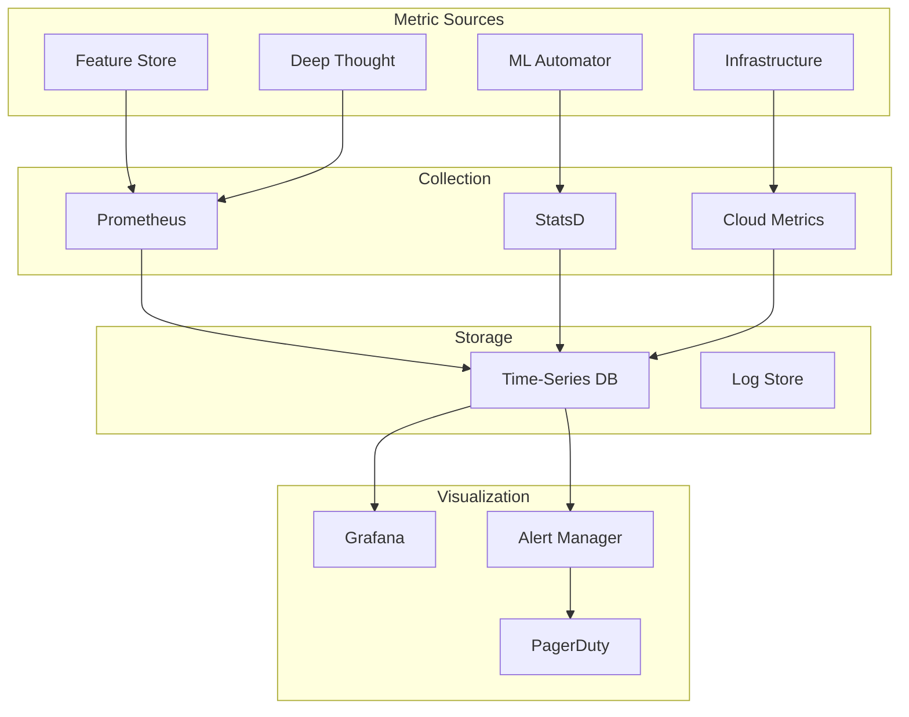
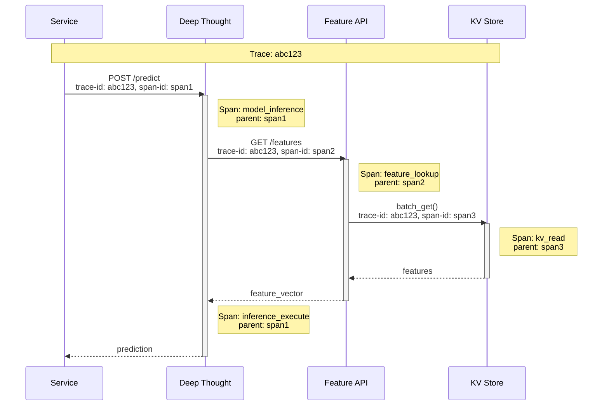
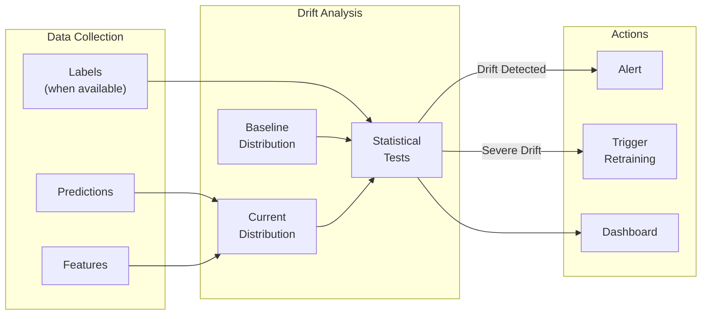

# Observability

## Metrics Strategy

### Overview Dashboard



### Feature Store Metrics (USE Method)

| Category | Metric | Labels | Purpose |
|----------|--------|--------|---------|
| **Utilization** | `feature_store_cpu_usage` | namespace, component | Resource usage |
| **Utilization** | `feature_store_memory_usage` | namespace, component | Memory pressure |
| **Saturation** | `feature_store_queue_depth` | queue_name | Backpressure indicator |
| **Saturation** | `feature_store_connection_pool_usage` | pool_name | Connection exhaustion |
| **Errors** | `feature_lookup_errors_total` | namespace, error_type | Error tracking |
| **Errors** | `feature_backfill_failures_total` | feature_group | Batch job health |

### Feature Store Metrics (RED Method)

| Category | Metric | Labels | Alert Threshold |
|----------|--------|--------|-----------------|
| **Rate** | `feature_lookups_total` | namespace, feature_group | N/A (info) |
| **Rate** | `feature_writes_total` | namespace, source_type | N/A (info) |
| **Errors** | `feature_lookup_errors_rate` | namespace | > 0.1% |
| **Errors** | `feature_freshness_violations` | feature_group | Any |
| **Duration** | `feature_lookup_latency_seconds` | namespace, quantile | P99 > 10ms |
| **Duration** | `feature_backfill_duration_seconds` | feature_group | > 2x baseline |

### Feature Freshness Metrics

| Metric | Description | Alert Threshold |
|--------|-------------|-----------------|
| `feature_last_update_timestamp` | Last update time per feature group | > 1 hour stale |
| `feature_streaming_lag_seconds` | Kafka consumer lag in seconds | > 300s |
| `feature_batch_job_delay_hours` | Hours since last successful batch | > 24 hours |
| `feature_online_offline_consistency` | Match rate between stores | < 99% |

### Deep Thought Metrics

| Category | Metric | Labels | Alert Threshold |
|----------|--------|--------|-----------------|
| **Rate** | `predictions_total` | model, version | N/A (info) |
| **Errors** | `prediction_errors_total` | model, error_type | > 1% |
| **Duration** | `prediction_latency_seconds` | model, quantile | P99 > 30ms |
| **Saturation** | `model_memory_bytes` | model, version | > 80% limit |
| **Saturation** | `model_queue_depth` | model | > 100 |
| **Availability** | `model_replicas_ready` | model | < desired |

### Model Quality Metrics

| Metric | Description | Collection |
|--------|-------------|------------|
| `prediction_score_distribution` | Histogram of model outputs | Per prediction |
| `feature_input_distribution` | Histogram of feature values | Sampled |
| `prediction_feedback_labels` | Actual outcomes when available | Async join |
| `model_accuracy_online` | Running accuracy estimate | Aggregated |

### ML Automator Metrics

| Category | Metric | Labels | Alert Threshold |
|----------|--------|--------|-----------------|
| **Rate** | `dag_executions_total` | pipeline, status | N/A (info) |
| **Errors** | `dag_failures_total` | pipeline, task | > 10% |
| **Duration** | `dag_duration_seconds` | pipeline, quantile | > 2x baseline |
| **Duration** | `task_duration_seconds` | pipeline, task | > 3x baseline |
| **Queue** | `dag_queue_depth` | priority | > 100 |

---

## Logging Strategy

### Log Levels

| Level | Usage | Example |
|-------|-------|---------|
| **ERROR** | Failures requiring attention | Feature lookup timeout |
| **WARN** | Anomalies, degraded performance | Cache miss rate high |
| **INFO** | Significant events | Model deployment, DAG completion |
| **DEBUG** | Detailed troubleshooting | Request details, timing |

### Structured Log Format

```json
{
    "timestamp": "2024-01-15T10:30:00.123Z",
    "level": "INFO",
    "service": "feature-api",
    "instance": "feature-api-pod-abc123",
    "trace_id": "abc123def456",
    "span_id": "span789",
    "message": "Feature lookup completed",
    "context": {
        "namespace": "search",
        "feature_group": "user_booking_features",
        "entity_count": 100,
        "latency_ms": 5,
        "cache_hit_rate": 0.75
    }
}
```

### Log Categories

| Service | Key Events | Retention |
|---------|------------|-----------|
| **Feature API** | Lookups, cache hits/misses, errors | 14 days |
| **Deep Thought** | Predictions, model loads, errors | 14 days |
| **ML Automator** | DAG lifecycle, task status | 30 days |
| **Zipline (Batch)** | Job start/end, partition writes | 7 days |
| **Zipline (Stream)** | Lag, checkpoints, errors | 7 days |

### What to Log

| Component | Log | Don't Log |
|-----------|-----|-----------|
| **Feature API** | Entity count, latency, namespace | Entity IDs, feature values |
| **Deep Thought** | Model version, latency, error type | Prediction inputs/outputs |
| **ML Automator** | Pipeline name, task status, duration | Training data |
| **Auth** | Login attempts, failures, IP | Passwords, tokens |

---

## Distributed Tracing

### Trace Propagation



### Key Spans to Instrument

| Span Name | Service | Tags | Purpose |
|-----------|---------|------|---------|
| `prediction_request` | Deep Thought | model, version | End-to-end prediction |
| `model_inference` | Deep Thought | model, framework | Pure inference time |
| `feature_lookup` | Feature API | namespace, count | Feature retrieval |
| `cache_check` | Feature API | level, hit | Cache performance |
| `kv_read` | Feature API | shard, keys | Store latency |
| `transform` | Deep Thought | transformer | Feature transformation |

### Sampling Strategy

| Traffic Type | Sample Rate | Rationale |
|--------------|-------------|-----------|
| **Errors** | 100% | Always trace failures |
| **High Latency** | 100% | P99+ always traced |
| **Normal** | 1% | Reduce storage |
| **Batch Jobs** | 100% | Low volume |

---

## Alerting Strategy

### Alert Severity Levels

| Level | Response Time | Notification | Example |
|-------|---------------|--------------|---------|
| **P1 (Critical)** | Immediate | Page on-call | Feature store down |
| **P2 (High)** | 15 min | Page + Slack | Prediction latency P99 > SLO |
| **P3 (Medium)** | 1 hour | Slack only | Cache hit rate low |
| **P4 (Low)** | Next business day | Ticket | Disk usage warning |

### Critical Alerts (P1)

| Alert | Condition | Runbook |
|-------|-----------|---------|
| `FeatureStoreDown` | Error rate > 10% for 2 min | [Link](#runbook-feature-store-down) |
| `PredictionServiceDown` | No successful predictions for 2 min | [Link](#runbook-prediction-down) |
| `ModelLoadFailure` | Model fails to load on all replicas | [Link](#runbook-model-load) |
| `StreamingPipelineDown` | Flink job not running | [Link](#runbook-streaming) |

### High Alerts (P2)

| Alert | Condition | Runbook |
|-------|-----------|---------|
| `FeatureLatencyHigh` | P99 > 15ms for 5 min | [Link](#runbook-latency) |
| `PredictionLatencyHigh` | P99 > 50ms for 5 min | [Link](#runbook-latency) |
| `FeatureStaleness` | Features > 30 min old | [Link](#runbook-staleness) |
| `DAGFailureRate` | > 20% failures in 1 hour | [Link](#runbook-dag-failure) |
| `CacheHitRateLow` | < 50% for 15 min | [Link](#runbook-cache) |

### Medium Alerts (P3)

| Alert | Condition | Action |
|-------|-----------|--------|
| `StreamingLagHigh` | Kafka lag > 5 min | Scale consumers |
| `DiskUsageHigh` | > 80% on any node | Plan expansion |
| `ReplicaUnhealthy` | < N-1 replicas ready | Investigate |
| `BackfillSlow` | > 2x baseline duration | Check resources |

### Alert Configuration Example

```yaml
# Prometheus AlertManager Rule
groups:
- name: bighead-feature-store
  rules:
  - alert: FeatureStoreDown
    expr: |
      sum(rate(feature_lookup_errors_total[2m])) /
      sum(rate(feature_lookups_total[2m])) > 0.1
    for: 2m
    labels:
      severity: critical
      team: ml-platform
    annotations:
      summary: "Feature store error rate > 10%"
      description: "Feature lookup error rate is {{ $value | humanizePercentage }}"
      runbook: "https://runbooks.internal/feature-store-down"

  - alert: FeatureLatencyHigh
    expr: |
      histogram_quantile(0.99,
        rate(feature_lookup_latency_seconds_bucket[5m])
      ) > 0.015
    for: 5m
    labels:
      severity: high
      team: ml-platform
    annotations:
      summary: "Feature lookup P99 latency > 15ms"
      description: "P99 latency is {{ $value | humanizeDuration }}"
```

---

## Model Drift Detection

### Input Drift (Feature Drift)

| Method | Description | Alert Threshold |
|--------|-------------|-----------------|
| **PSI (Population Stability Index)** | Compare feature distributions | PSI > 0.2 |
| **KL Divergence** | Information-theoretic distance | KL > 0.1 |
| **Chi-Square Test** | Categorical feature drift | p-value < 0.05 |
| **Kolmogorov-Smirnov** | Continuous feature drift | p-value < 0.05 |

### Output Drift (Prediction Drift)

| Method | Description | Alert Threshold |
|--------|-------------|-----------------|
| **Score Distribution** | Monitor prediction distribution | Shift > 2 sigma |
| **Confidence Calibration** | Expected vs actual accuracy | Gap > 10% |
| **Conversion Rate** | Downstream metric correlation | Drop > 5% |

### Drift Detection Pipeline



### Auto-Retraining Triggers

| Trigger | Condition | Action |
|---------|-----------|--------|
| **Scheduled** | Weekly/Monthly | Standard retraining |
| **PSI Drift** | PSI > 0.25 | Alert + queue retraining |
| **Performance Drop** | AUC drop > 5% | Alert + expedite retraining |
| **Data Volume Change** | > 50% increase | Queue retraining |

---

## Dashboards

### Executive Dashboard

| Panel | Metrics | Purpose |
|-------|---------|---------|
| **Platform Health** | Overall availability, error rate | Quick status |
| **Prediction Volume** | Total predictions, by model | Usage trends |
| **Feature Coverage** | Features used, adoption rate | Platform value |
| **Model Performance** | Accuracy metrics, drift status | Quality |

### Operational Dashboard

| Panel | Metrics | Purpose |
|-------|---------|---------|
| **Feature Store Health** | Latency, error rate, freshness | Real-time health |
| **Serving Health** | QPS, latency, replicas | Capacity |
| **Pipeline Health** | Success rate, duration, queue | Batch operations |
| **Resource Usage** | CPU, memory, storage | Capacity planning |

### Model-Specific Dashboard

| Panel | Metrics | Purpose |
|-------|---------|---------|
| **Traffic** | QPS, by version | Load |
| **Latency** | P50, P95, P99 | Performance |
| **Errors** | Rate, by type | Reliability |
| **Features** | Input distributions | Drift detection |
| **Predictions** | Output distribution | Quality |

---

## Runbooks

### Runbook: Feature Store Down

```
SYMPTOMS:
- Alert: FeatureStoreDown
- High error rate on feature lookups
- Prediction errors mentioning features

INVESTIGATION:
1. Check feature-api pod status
   kubectl get pods -l app=feature-api

2. Check KV store health
   curl http://kv-store:8080/health

3. Check recent deployments
   kubectl rollout history deployment/feature-api

4. Check logs for errors
   kubectl logs -l app=feature-api --tail=100

MITIGATION:
1. If pods unhealthy: restart
   kubectl rollout restart deployment/feature-api

2. If KV store issue: failover to replica
   # Update service to point to replica

3. If bad deployment: rollback
   kubectl rollout undo deployment/feature-api

ESCALATION:
- After 10 min without resolution: Page secondary
- After 30 min: Page manager
```

### Runbook: High Feature Latency

```
SYMPTOMS:
- Alert: FeatureLatencyHigh
- P99 > 15ms
- Prediction latency increasing

INVESTIGATION:
1. Check cache hit rates
   Query: feature_cache_hit_rate{level="l1"}
   Query: feature_cache_hit_rate{level="l2"}

2. Check KV store latency
   Query: kv_read_latency_seconds{quantile="0.99"}

3. Check for hot partitions
   Query: topk(10, feature_lookups_total by entity_type)

4. Check recent traffic patterns
   Query: rate(feature_lookups_total[1h])

MITIGATION:
1. If cache hit rate low:
   - Check cache size, consider increasing
   - Check TTL, consider extending

2. If hot partition:
   - Enable hot-key caching
   - Consider redistributing data

3. If traffic spike:
   - Scale feature-api pods
   - Enable request shedding if needed

ESCALATION:
- If latency > 30ms: Page on-call
```

### Runbook: Streaming Pipeline Lag

```
SYMPTOMS:
- Alert: StreamingLagHigh
- Kafka consumer lag > 5 min
- Stale online features

INVESTIGATION:
1. Check Flink job status
   flink list -r

2. Check consumer lag
   kafka-consumer-groups --describe --group zipline-consumer

3. Check for backpressure
   Query: flink_taskmanager_backpressured

4. Check checkpoint status
   Query: flink_checkpoint_duration_seconds

MITIGATION:
1. If job not running:
   flink run -d /path/to/zipline-streaming.jar

2. If backpressure high:
   - Increase parallelism
   - Check for key skew

3. If checkpoint slow:
   - Increase checkpoint interval
   - Check RocksDB state size

ESCALATION:
- If lag > 30 min: Page secondary
- If job repeatedly fails: Page data platform team
```
