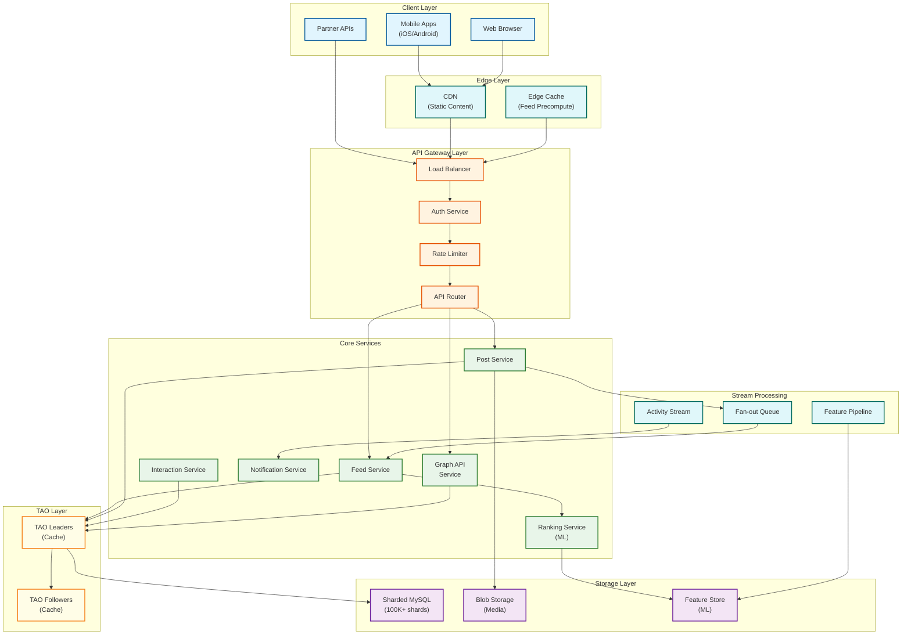

# Facebook System Design

[← Back to System Design Index](../README.md)

---

## Overview

Facebook is the world's largest social networking platform, enabling billions of users to connect, share content, and interact with friends, pages, and groups. The system's core technical challenges center on managing a massive social graph through TAO (The Associations and Objects), delivering personalized News Feeds at scale using ML-powered ranking, and providing developer access through the Graph API.

**Key Differentiators:**
- **TAO**: Custom distributed data store optimized for social graph traversal
- **Hybrid Fan-out**: Intelligent content distribution balancing write amplification and read latency
- **ML-Powered Ranking**: Three-stage pipeline processing billions of ranking decisions per day

---

## System Characteristics

| Characteristic | Value | Implication |
|----------------|-------|-------------|
| Traffic Pattern | Read-heavy (99:1 read-write ratio) | Heavy caching, precomputation required |
| Latency Target | <100ms p99 for feed | Edge caching, tiered ranking |
| Consistency Model | Eventual for feed, Strong per-shard | TAO leader/follower architecture |
| Availability Target | 99.99% | Multi-region active-active deployment |
| Data Model | Graph-based (Objects + Associations) | TAO over relational storage |
| Scale | 3.35B DAU, ~100M req/sec | Extreme horizontal scaling |

---

## Complexity Rating

| Component | Complexity | Reason |
|-----------|------------|--------|
| **Overall System** | Very High | Combines graph storage, ML ranking, real-time distribution |
| Social Graph (TAO) | High | Distributed sharding, two-tier caching, cross-region consistency |
| News Feed Ranking | High | Multi-stage ML pipeline, multi-objective optimization |
| Content Distribution | High | Hybrid fan-out, celebrity problem, cache coherence |
| Graph API | Medium-High | Rate limiting, privacy enforcement, versioning |
| Post Service | Medium | Media handling, moderation integration |
| Notification Service | Medium | Real-time delivery, batching, preferences |

---

## Quick Navigation

| Document | Description |
|----------|-------------|
| [01 - Requirements & Estimations](./01-requirements-and-estimations.md) | Functional/non-functional requirements, capacity planning |
| [02 - High-Level Design](./02-high-level-design.md) | Architecture, data flows, key decisions |
| [03 - Low-Level Design](./03-low-level-design.md) | Data models, APIs, algorithms |
| [04 - Deep Dive & Bottlenecks](./04-deep-dive-and-bottlenecks.md) | TAO internals, ranking, hot users |
| [05 - Scalability & Reliability](./05-scalability-and-reliability.md) | Scaling strategies, fault tolerance |
| [06 - Security & Compliance](./06-security-and-compliance.md) | Privacy, moderation, GDPR |
| [07 - Observability](./07-observability.md) | Metrics, tracing, alerting |
| [08 - Interview Guide](./08-interview-guide.md) | Pacing, trap questions, trade-offs |

---

## Core Modules

| Module | Responsibility | Key Challenge | Scale |
|--------|----------------|---------------|-------|
| **TAO (Social Graph)** | Store objects and associations | Sharded consistency, hot users | 100B+ objects |
| **News Feed Service** | Personalized content ranking | Real-time + latency balance | 33B+ feed loads/day |
| **Post Service** | Content creation and storage | Media handling, moderation | 1.3B+ posts/day |
| **Interaction Service** | Likes, comments, shares | Write amplification, counts | 5B+ likes/day |
| **Graph API** | External developer access | Rate limiting, privacy | 200 calls/user/hour |
| **Notification Service** | Real-time user notifications | Delivery guarantees, batching | 10B+ notifications/day |
| **Media Service** | Photo/video storage and delivery | CDN integration, transcoding | Petabytes/day |

---

## Architecture Overview



---

## News Feed Architecture: Three-Stage Pipeline

```
┌─────────────────────────────────────────────────────────────────────────┐
│                         FEED GENERATION PIPELINE                        │
├─────────────────────────────────────────────────────────────────────────┤
│                                                                         │
│  STAGE 1: CONTENT GATHERING                                            │
│  ┌─────────────────────────────────────────────────────────────────┐   │
│  │ • Fetch posts from friends (pushed via fan-out)                 │   │
│  │ • Pull posts from celebrities (on-demand)                       │   │
│  │ • Include followed pages and groups                             │   │
│  │ • Filter flagged/blocked content                                │   │
│  │ Output: ~1,500 candidate posts                                  │   │
│  └─────────────────────────────────────────────────────────────────┘   │
│                              ↓                                          │
│  STAGE 2: PREDICTION & SCORING                                         │
│  ┌─────────────────────────────────────────────────────────────────┐   │
│  │ • Extract features (user, post, author, context)                │   │
│  │ • Engagement prediction (like, comment, share probability)      │   │
│  │ • Value prediction (time well spent)                            │   │
│  │ • Integrity score (misinformation, harmful content)             │   │
│  │ Output: Scored posts with multi-objective ranking               │   │
│  └─────────────────────────────────────────────────────────────────┘   │
│                              ↓                                          │
│  STAGE 3: DIVERSITY & FILTERING                                        │
│  ┌─────────────────────────────────────────────────────────────────┐   │
│  │ • Apply diversity constraints (no consecutive same-source)      │   │
│  │ • Balance content types (photos, videos, text, links)           │   │
│  │ • Enforce freshness requirements                                │   │
│  │ • Apply user preferences and controls                           │   │
│  │ Output: Final feed of ~200 posts                                │   │
│  └─────────────────────────────────────────────────────────────────┘   │
│                                                                         │
└─────────────────────────────────────────────────────────────────────────┘
```

---

## TAO Data Model

```
┌─────────────────────────────────────────────────────────────────────────┐
│                           TAO DATA MODEL                                │
├─────────────────────────────────────────────────────────────────────────┤
│                                                                         │
│  OBJECTS (Nodes)                    ASSOCIATIONS (Edges)               │
│  ┌─────────────────────┐            ┌─────────────────────┐            │
│  │ • User              │            │ • FRIEND (User↔User)│            │
│  │ • Post              │◄──────────►│ • AUTHORED (User→Post)           │
│  │ • Comment           │            │ • LIKED (User→Post) │            │
│  │ • Photo             │            │ • COMMENTED (User→Post)          │
│  │ • Video             │            │ • FOLLOWS (User→Page)            │
│  │ • Page              │            │ • MEMBER (User→Group)            │
│  │ • Group             │            │ • TAGGED (Post→User)│            │
│  └─────────────────────┘            └─────────────────────┘            │
│                                                                         │
│  Object ID: 64-bit globally unique (contains shard_id)                 │
│  Association: (id1, atype, id2) stored on id1's shard                  │
│                                                                         │
└─────────────────────────────────────────────────────────────────────────┘
```

---

## When to Use This Design

| Scenario | Applicable | Reason |
|----------|------------|--------|
| Social networking platform | Yes | Core use case |
| Content feed with personalization | Yes | News Feed architecture applies |
| Graph-based relationships | Yes | TAO model applies |
| Read-heavy workload with caching needs | Yes | TAO caching patterns apply |
| Real-time activity feeds | Partial | Fan-out strategies apply |
| Simple CRUD application | No | Over-engineered |
| Strong consistency required everywhere | No | Eventual consistency model |

---

## Technology Stack Reference

| Layer | Technology Pattern | Real-World Example |
|-------|-------------------|-------------------|
| Social Graph Store | Sharded graph DB with cache | TAO |
| Caching | Distributed key-value cache | Memcached |
| Message Queue | Distributed log-based broker | Message queue systems |
| ML Serving | Feature store + model serving | Real-time inference |
| Blob Storage | Distributed object storage | Object storage systems |
| CDN | Edge caching network | CDN providers |

---

## Key Numbers

| Metric | Value | Source |
|--------|-------|--------|
| Daily Active Users (Meta Family) | 3.35 billion | Q4 2024 |
| Estimated Requests/Second | ~100 million | Scale extrapolation |
| Cache Reads per Page | 521 distinct reads | Engineering blog |
| Graph API Rate Limit | 200 calls/user/hour | API documentation |
| MySQL Shards | 100,000+ | TAO paper |
| Infrastructure Investment 2025 | $65 billion | Financial reports |
| H100 GPUs Deployed | 350,000+ | Engineering blog |

---

## Interview Readiness Checklist

Before your interview, ensure you can:

- [ ] Explain TAO's two-tier cache architecture and why it exists
- [ ] Describe hybrid fan-out and when to use push vs pull
- [ ] Walk through the three-stage feed ranking pipeline
- [ ] Calculate capacity estimates (QPS, storage, cache)
- [ ] Discuss the celebrity/hot user problem and solutions
- [ ] Explain consistency trade-offs (per-shard strong, cross-shard eventual)
- [ ] Describe Graph API rate limiting strategy
- [ ] Handle failure scenarios (cache miss, region failure, hot shard)

---

## Quick Reference Card

```
┌─────────────────────────────────────────────────────────────────────────┐
│                    FACEBOOK SYSTEM DESIGN CHEAT SHEET                   │
├─────────────────────────────────────────────────────────────────────────┤
│                                                                         │
│  SCALE NUMBERS:                                                         │
│  • 3.35B DAU  • ~100M req/sec  • 521 cache reads/page  • 100K+ shards  │
│                                                                         │
│  TAO ARCHITECTURE:                                                      │
│  • Objects (nodes) + Associations (edges)                               │
│  • Two-tier cache: Leaders (authoritative) → Followers (replicas)       │
│  • Single primary region per shard                                      │
│  • Association stored on source object's shard                          │
│                                                                         │
│  FAN-OUT STRATEGY:                                                      │
│  • Regular users (<10K followers): Fan-out on WRITE (push)              │
│  • Celebrities (>10K followers): Fan-out on READ (pull)                 │
│                                                                         │
│  FEED RANKING:                                                          │
│  • Stage 1: Gather candidates (~1,500 posts)                            │
│  • Stage 2: ML scoring (engagement + value + integrity)                 │
│  • Stage 3: Diversity filtering (~200 posts)                            │
│                                                                         │
│  KEY TRADE-OFFS:                                                        │
│  • Freshness vs Latency (precompute vs real-time)                       │
│  • Consistency vs Availability (strong per-shard, eventual cross-shard) │
│  • Write amplification vs Read latency (hybrid fan-out)                 │
│                                                                         │
│  COMMON TRAPS:                                                          │
│  • Forgetting celebrity problem → System overload                       │
│  • Assuming strong consistency everywhere → Won't scale                 │
│  • Single database → Can't handle billions                              │
│  • Real-time ranking for all → Too slow                                 │
│                                                                         │
└─────────────────────────────────────────────────────────────────────────┘
```

---

## Related Designs

| Design | Relevance |
|--------|-----------|
| [Recommendation Engine](../3.12-recommendation-engine/00-index.md) | Feed ranking patterns, two-stage retrieval |
| [Distributed Key-Value Store](../1.3-distributed-key-value-store/00-index.md) | Caching, sharding strategies |
| [Distributed Log-Based Broker](../1.5-distributed-log-based-broker/00-index.md) | Fan-out queue, activity streams |
| [Distributed Rate Limiter](../1.1-distributed-rate-limiter/00-index.md) | Graph API rate limiting |
| [Real-Time Personalization Engine](../3.34-ai-native-real-time-personalization-engine/00-index.md) | Advanced feed personalization |

---

*Next: [Requirements & Estimations →](./01-requirements-and-estimations.md)*
