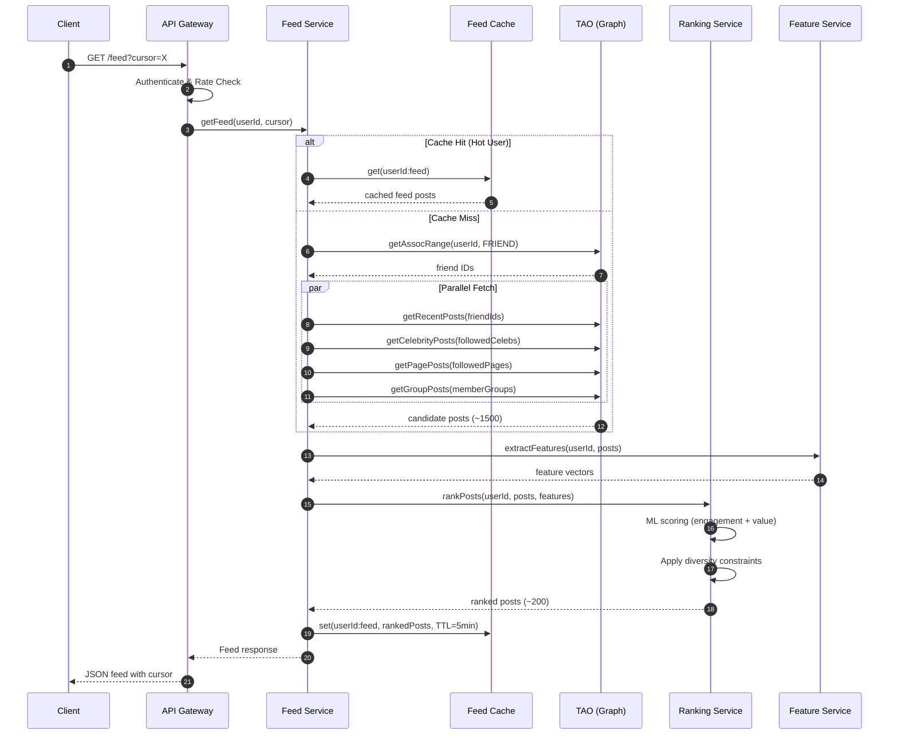
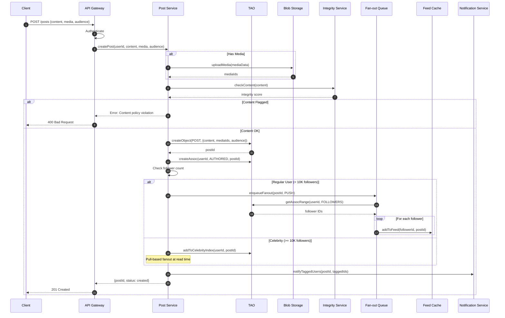
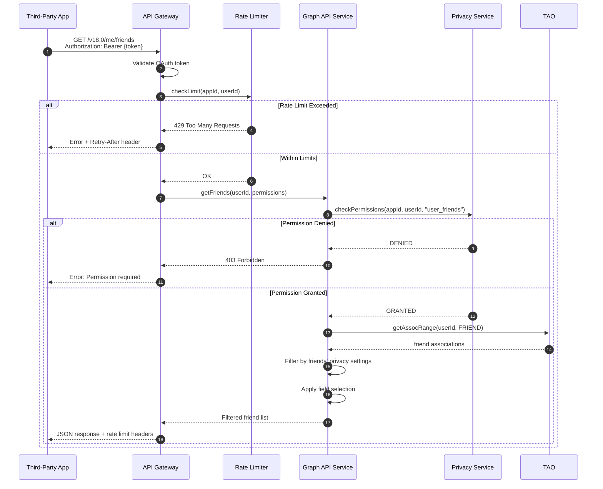
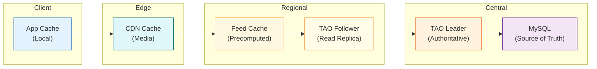
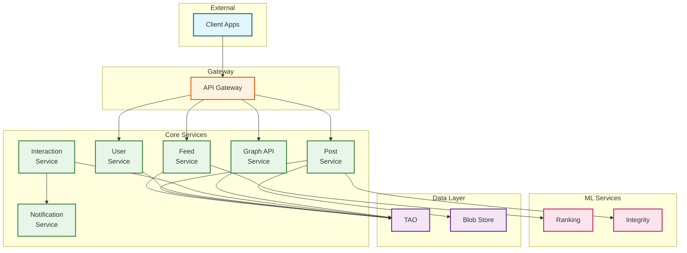
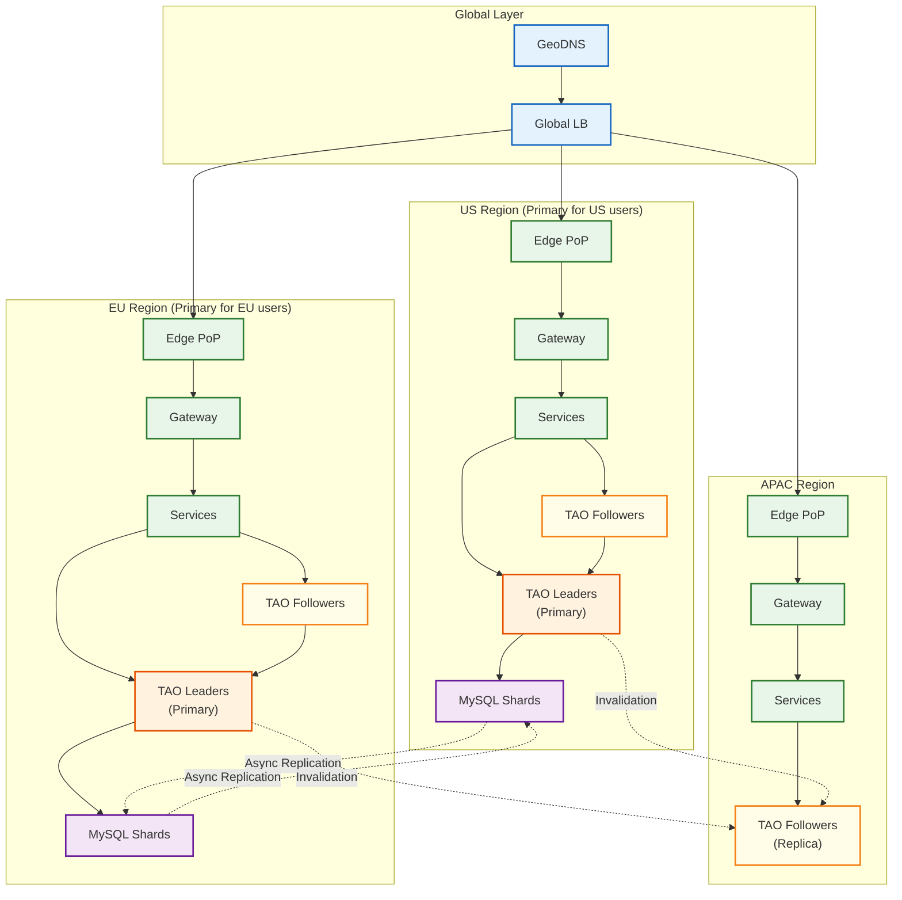

# High-Level Design

[← Back to Index](./00-index.md)

---

## System Architecture

```mermaid
flowchart TB
    subgraph Clients["Client Layer"]
        direction LR
        MobileApp["Mobile Apps<br/>(iOS/Android)"]
        WebApp["Web Browser"]
        ThirdParty["Third-Party Apps<br/>(Graph API)"]
    end

    subgraph EdgeLayer["Edge Layer"]
        direction LR
        CDN["CDN<br/>(Static Assets,<br/>Media Delivery)"]
        EdgePOP["Edge PoPs<br/>(Regional)"]
    end

    subgraph GatewayLayer["API Gateway Layer"]
        direction TB
        GLB["Global Load<br/>Balancer"]
        AuthService["Authentication<br/>Service"]
        RateLimiter["Rate Limiter<br/>(200/user/hour)"]
        APIRouter["API Router<br/>(GraphQL/REST)"]
    end

    subgraph CoreServices["Core Services"]
        direction TB
        FeedService["Feed Service"]
        PostService["Post Service"]
        InteractionService["Interaction<br/>Service"]
        UserService["User Service"]
        GraphAPIService["Graph API<br/>Service"]
        NotificationService["Notification<br/>Service"]
        SearchService["Search Service"]
    end

    subgraph MLServices["ML Services"]
        direction LR
        RankingService["Ranking<br/>Service"]
        IntegrityService["Integrity<br/>Service"]
        FeatureService["Feature<br/>Service"]
    end

    subgraph TAOLayer["TAO Layer (Social Graph)"]
        direction TB
        TAOLeaders["TAO Leaders<br/>(Authoritative Cache)"]
        TAOFollowers["TAO Followers<br/>(Replica Cache)"]
    end

    subgraph StorageLayer["Storage Layer"]
        direction LR
        MySQLShards["Sharded MySQL<br/>(100K+ shards)"]
        BlobStore["Blob Storage<br/>(Media)"]
        SearchIndex["Search Index<br/>(Inverted)"]
    end

    subgraph StreamLayer["Stream Processing"]
        direction LR
        FanoutQueue["Fan-out<br/>Queue"]
        ActivityStream["Activity<br/>Stream"]
        FeaturePipeline["Feature<br/>Pipeline"]
    end

    subgraph CacheLayer["Cache Layer"]
        direction LR
        FeedCache["Feed Cache<br/>(Precomputed)"]
        SessionCache["Session<br/>Cache"]
        CounterCache["Counter<br/>Cache"]
    end

    %% Client connections
    MobileApp --> CDN
    WebApp --> CDN
    ThirdParty --> GLB
    CDN --> EdgePOP --> GLB

    %% Gateway flow
    GLB --> AuthService --> RateLimiter --> APIRouter

    %% Router to services
    APIRouter --> FeedService
    APIRouter --> PostService
    APIRouter --> InteractionService
    APIRouter --> UserService
    APIRouter --> GraphAPIService
    APIRouter --> SearchService

    %% Service to TAO
    FeedService --> TAOLeaders
    PostService --> TAOLeaders
    InteractionService --> TAOLeaders
    UserService --> TAOLeaders
    GraphAPIService --> TAOLeaders

    %% TAO architecture
    TAOLeaders --> TAOFollowers
    TAOLeaders --> MySQLShards

    %% ML integration
    FeedService --> RankingService
    RankingService --> FeatureService
    PostService --> IntegrityService

    %% Storage connections
    PostService --> BlobStore
    SearchService --> SearchIndex

    %% Cache connections
    FeedService --> FeedCache
    UserService --> SessionCache
    InteractionService --> CounterCache

    %% Stream processing
    PostService --> FanoutQueue
    FanoutQueue --> FeedCache
    InteractionService --> ActivityStream
    ActivityStream --> NotificationService
    FeaturePipeline --> FeatureService

    %% Styling
    classDef client fill:#e1f5fe,stroke:#01579b,stroke-width:2px
    classDef edge fill:#e0f7fa,stroke:#00695c,stroke-width:2px
    classDef gateway fill:#fff3e0,stroke:#e65100,stroke-width:2px
    classDef service fill:#e8f5e9,stroke:#2e7d32,stroke-width:2px
    classDef ml fill:#fce4ec,stroke:#c2185b,stroke-width:2px
    classDef tao fill:#fffde7,stroke:#f57f17,stroke-width:2px
    classDef storage fill:#f3e5f5,stroke:#6a1b9a,stroke-width:2px
    classDef stream fill:#e0f7fa,stroke:#00695c,stroke-width:2px
    classDef cache fill:#fff8e1,stroke:#ff8f00,stroke-width:2px

    class MobileApp,WebApp,ThirdParty client
    class CDN,EdgePOP edge
    class GLB,AuthService,RateLimiter,APIRouter gateway
    class FeedService,PostService,InteractionService,UserService,GraphAPIService,NotificationService,SearchService service
    class RankingService,IntegrityService,FeatureService ml
    class TAOLeaders,TAOFollowers tao
    class MySQLShards,BlobStore,SearchIndex storage
    class FanoutQueue,ActivityStream,FeaturePipeline stream
    class FeedCache,SessionCache,CounterCache cache
```



---

## Data Flow: Feed Request



---

## Data Flow: Post Creation



---

## Data Flow: Graph API Request



---

## Key Architectural Decisions

### Decision 1: TAO vs Traditional Database

| Aspect | Traditional RDBMS | TAO |
|--------|------------------|-----|
| Data Model | Tables, JOINs | Objects + Associations |
| Query Pattern | Flexible SQL | Fixed graph operations |
| Caching | Application-managed | Built-in two-tier cache |
| Sharding | Custom implementation | Native, shard-aware |
| Consistency | ACID transactions | Per-shard linearizable |

**Decision: TAO**

**Rationale:**
- Social data is inherently graph-shaped (users, relationships, content)
- Fixed query patterns (get friends, get posts) allow optimization
- Built-in caching reduces read latency
- Native sharding simplifies horizontal scaling
- Per-shard consistency sufficient for social use cases

---

### Decision 2: Fan-out Strategy (Hybrid Push/Pull)

```
┌─────────────────────────────────────────────────────────────────────────┐
│                      FAN-OUT STRATEGY DECISION                          │
├─────────────────────────────────────────────────────────────────────────┤
│                                                                         │
│  FAN-OUT ON WRITE (Push)              FAN-OUT ON READ (Pull)           │
│  ┌─────────────────────┐              ┌─────────────────────┐          │
│  │ User posts          │              │ User posts          │          │
│  │      ↓              │              │      ↓              │          │
│  │ Write to ALL        │              │ Store once          │          │
│  │ followers' feeds    │              │      ↓              │          │
│  │      ↓              │              │ Fetch at read time  │          │
│  │ Instant visibility  │              │ for each follower   │          │
│  └─────────────────────┘              └─────────────────────┘          │
│                                                                         │
│  Pros:                                Pros:                             │
│  • Fast reads (precomputed)           • Low write cost                  │
│  • Simple read path                   • No wasted writes                │
│                                       • Scales for celebrities          │
│  Cons:                                                                  │
│  • Write amplification                Cons:                             │
│  • Celebrity problem                  • Slow reads (compute at request) │
│  • Wasted for inactive users          • Complex read path               │
│                                                                         │
│  HYBRID APPROACH (Facebook's Solution):                                 │
│  ┌─────────────────────────────────────────────────────────────────┐   │
│  │ Regular User (<10K followers)  →  Push (fan-out on write)       │   │
│  │ Celebrity (≥10K followers)     →  Pull (fan-out on read)        │   │
│  │ Threshold adjustable based on system load                       │   │
│  └─────────────────────────────────────────────────────────────────┘   │
│                                                                         │
└─────────────────────────────────────────────────────────────────────────┘
```

**Decision: Hybrid Fan-out**

**Rationale:**
- Pure push doesn't scale for celebrities (100M followers × 10 posts/day = 1B writes)
- Pure pull is too slow for most users (need to aggregate at read time)
- Hybrid balances: 95% of users get fast push, 5% use pull
- Dynamic threshold allows tuning based on system capacity

---

### Decision 3: Feed Ranking Architecture

| Approach | Description | Latency | Freshness |
|----------|-------------|---------|-----------|
| Chronological | Show newest first | ~10ms | Instant |
| Pre-ranked | Batch rank offline | ~10ms | Stale (hours) |
| Real-time ML | Rank at request time | ~100ms | Fresh |
| **Hybrid** | Pre-filter + Real-time rank | ~50ms | Fresh enough |

**Decision: Hybrid (Pre-filter + Real-time)**

**Rationale:**
- Pure chronological loses engagement (buried good content)
- Pure pre-ranked too stale (news becomes irrelevant)
- Pure real-time too slow (can't score 10K posts in 100ms)
- Hybrid: Pre-filter to 1,500 candidates, real-time rank to 200

---

### Decision 4: Caching Strategy (Multi-Layer)



| Cache Layer | TTL | Hit Rate | Content |
|-------------|-----|----------|---------|
| Client App | 5 min | 30% | User's feed, profile |
| CDN | 24h | 95% | Static assets, media |
| Feed Cache | 5 min | 70% | Precomputed feeds |
| TAO Follower | 1 min | 85% | Graph data (regional) |
| TAO Leader | 10 min | 95% | Graph data (authoritative) |

**Decision: Multi-layer with TAO two-tier**

**Rationale:**
- Each layer optimizes for different access patterns
- TAO two-tier separates read scaling (followers) from consistency (leaders)
- Feed precomputation reduces ranking latency
- CDN handles media at edge

---

### Decision 5: Consistency Model

```
┌─────────────────────────────────────────────────────────────────────────┐
│                       CONSISTENCY MODEL                                 │
├─────────────────────────────────────────────────────────────────────────┤
│                                                                         │
│  Per-Shard (Strong)                   Cross-Shard (Eventual)           │
│  ┌─────────────────────┐              ┌─────────────────────┐          │
│  │ Single leader per    │              │ Async replication   │          │
│  │ shard ensures        │              │ between regions     │          │
│  │ linearizability      │              │                     │          │
│  │                      │              │ Propagation delay   │          │
│  │ User sees their own  │              │ typically <1 second │          │
│  │ writes immediately   │              │                     │          │
│  └─────────────────────┘              └─────────────────────┘          │
│                                                                         │
│  Cross-Region Strategy:                                                 │
│  • Each shard has ONE primary region                                    │
│  • Writes always go to primary region                                   │
│  • Reads can go to local follower (may be stale)                       │
│  • Read-your-writes: Route to leader after write                       │
│                                                                         │
└─────────────────────────────────────────────────────────────────────────┘
```

**Decision: Per-shard strong, Cross-shard eventual**

**Rationale:**
- Strong consistency for user's own data (critical for privacy)
- Eventual consistency acceptable for feed (slight delay OK)
- Single leader per shard simplifies conflict resolution
- Cross-region async keeps latency low globally

---

## Component Interactions

### Core Service Dependencies



### Service Communication Patterns

| Source | Target | Pattern | Protocol |
|--------|--------|---------|----------|
| API Gateway → Services | Sync | Request-Response | gRPC |
| Post → Fan-out Queue | Async | Fire-and-forget | Message Queue |
| Interaction → Notification | Async | Event-driven | Event Stream |
| Services → TAO | Sync | Request-Response | Custom RPC |
| Services → ML | Sync | Request-Response | gRPC |

---

## Deployment Topology

### Multi-Region Architecture



### Sharding Strategy

| Data Type | Shard Key | Rationale |
|-----------|-----------|-----------|
| User Objects | user_id % N | User data locality |
| Posts | shard_id in post_id | Keep with author |
| Associations | id1 (source) | Co-locate with source object |
| Friend Lists | user_id | Access pattern locality |
| Feed Cache | user_id | Per-user feed |

### Replica Distribution

| Region | Role | Shards Owned | Read Traffic | Write Traffic |
|--------|------|--------------|--------------|---------------|
| US-East | Primary | 33% | 25% | 50% |
| US-West | Primary | 17% | 15% | 20% |
| EU-West | Primary | 25% | 25% | 20% |
| APAC | Follower | 0% | 30% | 10% (forwarded) |
| LATAM | Follower | 0% | 5% | Remote |

---

## Architecture Pattern Checklist

| Pattern | Decision | Rationale |
|---------|----------|-----------|
| Sync vs Async | Hybrid | Sync for reads, Async for fan-out |
| Event-driven vs Request-response | Both | Events for notifications, RPC for queries |
| Push vs Pull | Hybrid | Push for regular, Pull for celebrities |
| Stateless vs Stateful | Stateless services | Horizontal scaling |
| Read-heavy vs Write-heavy | Read-heavy (99:1) | Heavy caching emphasis |
| Real-time vs Batch | Hybrid | Real-time ranking, batch features |
| Edge vs Origin | Edge for media | CDN for static, origin for dynamic |

---

## Integration Points

### External Integrations

| System | Integration Type | Purpose |
|--------|-----------------|---------|
| Push Notification Services | Async | APNs, FCM delivery |
| CDN Providers | HTTP | Media delivery |
| Identity Providers | OAuth2 | Social login |
| Payment Systems | Sync | Marketplace transactions |
| Moderation Services | Async | Content review |

### Internal Service Mesh

| Feature | Implementation |
|---------|---------------|
| Service Discovery | Internal DNS + Load Balancer |
| Load Balancing | L7 with health checks |
| Circuit Breaker | Per-service timeout + retry |
| Rate Limiting | Distributed token bucket |
| Tracing | Distributed trace propagation |

---

*Next: [Low-Level Design →](./03-low-level-design.md)*
