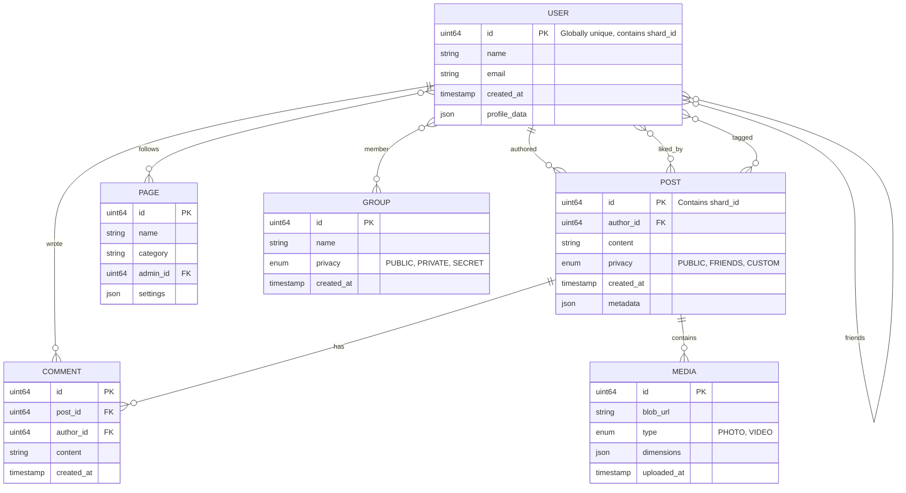

# Low-Level Design

[← Back to Index](./00-index.md)

---

## Data Model

### TAO Object and Association Model



### TAO Object Schema

```
┌─────────────────────────────────────────────────────────────────────────┐
│                         TAO OBJECT STRUCTURE                            │
├─────────────────────────────────────────────────────────────────────────┤
│                                                                         │
│  Object ID (64-bit):                                                    │
│  ┌────────────────────────────────────────────────────────────────┐    │
│  │ [shard_id: 16 bits] [type: 8 bits] [sequence: 40 bits]         │    │
│  └────────────────────────────────────────────────────────────────┘    │
│                                                                         │
│  Object Types (otype):                                                  │
│  • 1 = USER                                                             │
│  • 2 = POST                                                             │
│  • 3 = COMMENT                                                          │
│  • 4 = PHOTO                                                            │
│  • 5 = VIDEO                                                            │
│  • 6 = PAGE                                                             │
│  • 7 = GROUP                                                            │
│  • 8 = EVENT                                                            │
│                                                                         │
│  Object Fields:                                                         │
│  {                                                                      │
│    "id": 140737488355328,          // 64-bit globally unique           │
│    "otype": 2,                     // POST                              │
│    "data": {                       // Type-specific payload             │
│      "content": "Hello world!",                                         │
│      "privacy": "FRIENDS",                                              │
│      "media_ids": [1234, 5678]                                          │
│    },                                                                   │
│    "created_time": 1704067200,     // Unix timestamp                    │
│    "updated_time": 1704067200                                           │
│  }                                                                      │
│                                                                         │
└─────────────────────────────────────────────────────────────────────────┘
```

### TAO Association Schema

```
┌─────────────────────────────────────────────────────────────────────────┐
│                       TAO ASSOCIATION STRUCTURE                         │
├─────────────────────────────────────────────────────────────────────────┤
│                                                                         │
│  Association Key: (id1, atype, id2)                                     │
│                                                                         │
│  Association Types (atype):                                             │
│  • 1 = FRIEND          (User ↔ User, symmetric)                        │
│  • 2 = AUTHORED        (User → Post)                                   │
│  • 3 = LIKED           (User → Post)                                   │
│  • 4 = COMMENTED       (User → Post)                                   │
│  • 5 = FOLLOWS_PAGE    (User → Page)                                   │
│  • 6 = MEMBER_OF       (User → Group)                                  │
│  • 7 = TAGGED_IN       (Post → User)                                   │
│  • 8 = CONTAINS_MEDIA  (Post → Media)                                  │
│  • 9 = ADMIN_OF        (User → Page/Group)                             │
│                                                                         │
│  Association Record:                                                    │
│  {                                                                      │
│    "id1": 123456789,             // Source object ID                   │
│    "atype": 3,                   // LIKED                               │
│    "id2": 987654321,             // Target object ID (post)            │
│    "time": 1704067200,           // When association created           │
│    "data": {                     // Optional edge data                  │
│      "reaction": "LOVE"          // Extended like type                  │
│    }                                                                    │
│  }                                                                      │
│                                                                         │
│  Storage Rule:                                                          │
│  Associations are stored on the shard of id1 (source object)           │
│                                                                         │
│  Association Counts:                                                    │
│  Maintained separately for performance:                                 │
│  • assoc_count(user_id, FRIEND) → 500                                  │
│  • assoc_count(post_id, LIKED) → 1,234                                 │
│                                                                         │
└─────────────────────────────────────────────────────────────────────────┘
```

---

## Database Schemas

### MySQL Schema for TAO (Sharded)

```sql
-- Object table (one per shard)
CREATE TABLE objects (
    id              BIGINT UNSIGNED PRIMARY KEY,
    otype           TINYINT UNSIGNED NOT NULL,  -- Object type
    data            MEDIUMBLOB,                  -- Serialized object data
    created_time    INT UNSIGNED NOT NULL,
    updated_time    INT UNSIGNED NOT NULL,
    INDEX idx_otype_created (otype, created_time)
) ENGINE=InnoDB;

-- Association table (one per shard)
CREATE TABLE assoc (
    id1             BIGINT UNSIGNED NOT NULL,   -- Source object
    atype           SMALLINT UNSIGNED NOT NULL, -- Association type
    id2             BIGINT UNSIGNED NOT NULL,   -- Target object
    time            INT UNSIGNED NOT NULL,      -- Creation time
    data            VARBINARY(255),             -- Optional edge data
    PRIMARY KEY (id1, atype, id2),
    INDEX idx_id1_atype_time (id1, atype, time DESC)
) ENGINE=InnoDB;

-- Association count table (one per shard)
CREATE TABLE assoc_count (
    id              BIGINT UNSIGNED NOT NULL,
    atype           SMALLINT UNSIGNED NOT NULL,
    count           INT UNSIGNED NOT NULL DEFAULT 0,
    updated_time    INT UNSIGNED NOT NULL,
    PRIMARY KEY (id, atype)
) ENGINE=InnoDB;

-- Inverse association table (for bidirectional lookups)
CREATE TABLE assoc_inverse (
    id2             BIGINT UNSIGNED NOT NULL,   -- Target object
    atype           SMALLINT UNSIGNED NOT NULL,
    id1             BIGINT UNSIGNED NOT NULL,   -- Source object
    time            INT UNSIGNED NOT NULL,
    PRIMARY KEY (id2, atype, id1),
    INDEX idx_id2_atype_time (id2, atype, time DESC)
) ENGINE=InnoDB;
```

### Feed Cache Schema (In-Memory Store)

```
# Feed Cache Data Structures

# Pre-computed feed for each user
KEY: feed:{user_id}
TYPE: Sorted Set
MEMBERS: post_ids
SCORES: ranking_scores (higher = better)
TTL: 300 seconds (5 minutes)

EXAMPLE:
  feed:12345 = {
    post_111: 0.95,
    post_222: 0.87,
    post_333: 0.82,
    ...
  }

# Feed cursor for pagination
KEY: feed:{user_id}:cursor
TYPE: String
VALUE: JSON with pagination state
TTL: 3600 seconds (1 hour)

EXAMPLE:
  feed:12345:cursor = {
    "last_post_id": 333,
    "last_score": 0.82,
    "page": 2
  }

# Celebrity post index (for pull-based fanout)
KEY: celebrity:{user_id}:posts
TYPE: Sorted Set
MEMBERS: post_ids
SCORES: timestamps (unix)
TTL: 86400 seconds (24 hours)

# Engagement counters (approximate)
KEY: post:{post_id}:engagement
TYPE: Hash
FIELDS: likes, comments, shares
TTL: None (updated in real-time)

EXAMPLE:
  post:111:engagement = {
    "likes": 1234,
    "comments": 56,
    "shares": 12
  }
```

### Session and Rate Limit Schema

```
# Session cache
KEY: session:{session_id}
TYPE: Hash
FIELDS: user_id, created_at, last_active, device_info
TTL: 2592000 seconds (30 days)

# Rate limit counter
KEY: ratelimit:user:{user_id}:hour:{hour_bucket}
TYPE: Counter
TTL: 3600 seconds

KEY: ratelimit:app:{app_id}:hour:{hour_bucket}
TYPE: Counter
TTL: 3600 seconds
```

---

## API Design

### Graph API (External)

#### Read Endpoints

```yaml
# Get user profile
GET /v18.0/{user-id}
  Parameters:
    - fields: comma-separated field names
    - access_token: OAuth token
  Response:
    {
      "id": "12345",
      "name": "John Doe",
      "email": "john@example.com"  # If email permission granted
    }
  Rate Limit: 200/user/hour

# Get user's friends
GET /v18.0/{user-id}/friends
  Parameters:
    - fields: id,name,picture
    - limit: 25 (default), max 5000
    - after: pagination cursor
  Response:
    {
      "data": [
        {"id": "111", "name": "Alice"},
        {"id": "222", "name": "Bob"}
      ],
      "paging": {
        "cursors": {"after": "xyz"},
        "next": "https://graph.facebook.com/..."
      },
      "summary": {"total_count": 500}
    }

# Get user's feed
GET /v18.0/{user-id}/feed
  Parameters:
    - fields: id,message,created_time,from
    - limit: 25
    - since: unix timestamp
    - until: unix timestamp
  Response:
    {
      "data": [
        {
          "id": "12345_67890",
          "message": "Hello world!",
          "created_time": "2024-01-01T12:00:00+0000",
          "from": {"id": "12345", "name": "John"}
        }
      ],
      "paging": {...}
    }
```

#### Write Endpoints

```yaml
# Create a post
POST /v18.0/{user-id}/feed
  Parameters:
    - message: Post content (required)
    - link: URL to share
    - place: Location ID
    - tags: Tagged user IDs
    - privacy: {"value": "FRIENDS"}
  Response:
    {
      "id": "12345_67890"
    }

# Like a post
POST /v18.0/{post-id}/likes
  Response:
    {"success": true}

# Comment on a post
POST /v18.0/{post-id}/comments
  Parameters:
    - message: Comment text (required)
  Response:
    {
      "id": "67890_11111"
    }

# Delete a post
DELETE /v18.0/{post-id}
  Response:
    {"success": true}
```

### Internal Service APIs

#### Feed Service

```yaml
# Generate personalized feed
POST /internal/feed/generate
  Request:
    {
      "user_id": 12345,
      "cursor": "abc123",
      "limit": 50,
      "include_sponsored": true
    }
  Response:
    {
      "posts": [
        {
          "post_id": 111,
          "author_id": 222,
          "content": "...",
          "ranking_score": 0.95,
          "ranking_reason": "friend_engagement"
        }
      ],
      "cursor": "def456",
      "has_more": true
    }

# Refresh feed cache
POST /internal/feed/refresh
  Request:
    {
      "user_id": 12345,
      "reason": "post_created"
    }
```

#### TAO Service

```yaml
# Get object by ID
GET /internal/tao/object/{id}
  Response:
    {
      "id": 12345,
      "otype": 2,
      "data": {...},
      "created_time": 1704067200
    }

# Get associations
GET /internal/tao/assoc/{id1}/{atype}
  Parameters:
    - limit: 100
    - high: max timestamp
    - low: min timestamp
  Response:
    {
      "associations": [
        {"id2": 111, "time": 1704067200, "data": null},
        {"id2": 222, "time": 1704060000, "data": null}
      ],
      "count": 500
    }

# Create object
POST /internal/tao/object
  Request:
    {
      "otype": 2,
      "data": {...}
    }
  Response:
    {"id": 12345}

# Create association
POST /internal/tao/assoc
  Request:
    {
      "id1": 12345,
      "atype": 3,
      "id2": 67890,
      "data": {"reaction": "LOVE"}
    }
  Response:
    {"success": true}
```

#### Ranking Service

```yaml
# Score posts for a user
POST /internal/ranking/score
  Request:
    {
      "user_id": 12345,
      "candidate_posts": [111, 222, 333, ...],
      "context": {
        "device": "mobile",
        "time_of_day": "evening",
        "session_start": 1704067200
      }
    }
  Response:
    {
      "scores": [
        {"post_id": 111, "score": 0.95, "components": {...}},
        {"post_id": 333, "score": 0.87, "components": {...}},
        {"post_id": 222, "score": 0.72, "components": {...}}
      ]
    }
```

---

## Core Algorithms

### Algorithm 1: TAO Cache Lookup (Two-Tier)

```
ALGORITHM TAO_Two_Tier_Cache_Lookup

PURPOSE: Retrieve object with two-tier cache (followers + leader)

INPUT:
  - object_id: 64-bit unique identifier
  - consistency: READ_LATEST or READ_CACHED

OUTPUT:
  - object: Object data or null

CONSTANTS:
  - FOLLOWER_TIMEOUT = 10ms
  - LEADER_TIMEOUT = 50ms
  - DB_TIMEOUT = 500ms

FUNCTION get_object(object_id, consistency):
    shard_id = extract_shard(object_id)

    // Step 1: Try local follower cache
    IF consistency != READ_LATEST:
        follower = get_local_follower(shard_id)
        result = follower.get(object_id, timeout=FOLLOWER_TIMEOUT)
        IF result != null:
            metrics.record("cache_hit", "follower")
            RETURN result

    // Step 2: Try leader cache
    leader = get_leader_for_shard(shard_id)
    result = leader.get(object_id, timeout=LEADER_TIMEOUT)
    IF result != null:
        metrics.record("cache_hit", "leader")
        // Backfill follower cache asynchronously
        async_backfill(follower, object_id, result)
        RETURN result

    // Step 3: Fetch from MySQL
    mysql_shard = get_mysql_shard(shard_id)
    result = mysql_shard.select(
        "SELECT * FROM objects WHERE id = ?",
        [object_id],
        timeout=DB_TIMEOUT
    )

    IF result != null:
        metrics.record("cache_miss", "db_fetch")
        // Populate both caches
        leader.set(object_id, result, ttl=600)
        async_backfill(follower, object_id, result)

    RETURN result

FUNCTION get_assoc_range(id1, atype, limit, high_time, low_time):
    shard_id = extract_shard(id1)  // Association stored on id1's shard

    // Try follower first
    follower = get_local_follower(shard_id)
    cache_key = format("assoc:%d:%d", id1, atype)

    cached = follower.get_range(cache_key, high_time, low_time, limit)
    IF len(cached) >= limit:
        RETURN cached

    // Need to go to leader or DB
    leader = get_leader_for_shard(shard_id)
    result = leader.get_range(cache_key, high_time, low_time, limit)

    IF len(result) < limit:
        // Cache miss, fetch from DB
        mysql_shard = get_mysql_shard(shard_id)
        result = mysql_shard.select(
            "SELECT id2, time, data FROM assoc
             WHERE id1 = ? AND atype = ?
             AND time <= ? AND time >= ?
             ORDER BY time DESC LIMIT ?",
            [id1, atype, high_time, low_time, limit]
        )
        leader.set_range(cache_key, result, ttl=60)

    RETURN result
```

### Algorithm 2: Hybrid Fan-out

```
ALGORITHM Hybrid_Fanout_Post_Creation

PURPOSE: Distribute new post to followers using hybrid push/pull

INPUT:
  - author_id: Post author's user ID
  - post: Post object with content, media, privacy

OUTPUT:
  - post_id: Created post ID

CONSTANTS:
  - CELEBRITY_THRESHOLD = 10000
  - BATCH_SIZE = 1000
  - MAX_FANOUT_FOLLOWERS = 5000

FUNCTION create_post_with_fanout(author_id, post):
    // Step 1: Create the post object
    post.author_id = author_id
    post.created_time = now()
    post_id = tao.create_object(POST, post)
    tao.create_assoc(author_id, AUTHORED, post_id)

    // Step 2: Determine fanout strategy
    follower_count = tao.get_assoc_count(author_id, FOLLOWERS)

    IF follower_count >= CELEBRITY_THRESHOLD:
        // PULL-based fanout (lazy)
        handle_celebrity_post(author_id, post_id, post)
    ELSE:
        // PUSH-based fanout (eager)
        handle_regular_post(author_id, post_id, post, follower_count)

    // Step 3: Handle tagged users (always notify)
    IF post.tagged_users:
        FOR user_id IN post.tagged_users:
            notification.send(user_id, POST_TAG, post_id)

    RETURN post_id

FUNCTION handle_celebrity_post(author_id, post_id, post):
    // Add to celebrity index (pulled at read time)
    celebrity_cache.add(
        key=format("celebrity:%d:posts", author_id),
        member=post_id,
        score=post.created_time
    )

    // Optionally push to most engaged followers
    top_followers = get_most_engaged_followers(author_id, limit=1000)
    FOR follower_id IN top_followers:
        feed_cache.add(follower_id, post_id, post.created_time)

    // Trigger background notification for others
    notification_queue.enqueue({
        "type": "celebrity_post",
        "author_id": author_id,
        "post_id": post_id
    })

FUNCTION handle_regular_post(author_id, post_id, post, follower_count):
    // Get all followers (capped)
    followers = tao.get_assoc_range(
        author_id, FOLLOWERS,
        limit=MAX_FANOUT_FOLLOWERS
    )

    // Batch write to feed caches
    batches = chunk(followers, BATCH_SIZE)
    FOR batch IN batches:
        // Async fanout to each follower's feed
        fanout_queue.enqueue({
            "post_id": post_id,
            "follower_ids": batch,
            "ranking_time": post.created_time
        })

FUNCTION process_fanout_batch(job):
    FOR follower_id IN job.follower_ids:
        // Check if post is visible to this follower
        IF check_privacy(job.post_id, follower_id):
            feed_cache.add(
                key=format("feed:%d", follower_id),
                member=job.post_id,
                score=job.ranking_time
            )
```

### Algorithm 3: News Feed Ranking

```
ALGORITHM News_Feed_Ranking

PURPOSE: Generate personalized feed using three-stage ranking

INPUT:
  - user_id: Requesting user
  - limit: Number of posts to return
  - cursor: Pagination state

OUTPUT:
  - ranked_posts: List of posts with scores
  - new_cursor: Updated pagination state

CONSTANTS:
  - CANDIDATE_POOL_SIZE = 1500
  - RANKING_BATCH_SIZE = 500
  - FINAL_FEED_SIZE = 200
  - DIVERSITY_SAME_AUTHOR_GAP = 3

FUNCTION generate_feed(user_id, limit, cursor):
    // STAGE 1: Content Gathering
    candidates = gather_candidates(user_id, cursor)

    // STAGE 2: ML Scoring
    scored_posts = score_candidates(user_id, candidates)

    // STAGE 3: Diversity & Filtering
    final_feed = apply_diversity(scored_posts, limit)

    new_cursor = create_cursor(final_feed)
    RETURN final_feed, new_cursor

FUNCTION gather_candidates(user_id, cursor):
    candidates = []

    // 1. Pushed posts (from regular friends)
    pushed = feed_cache.get_range(
        key=format("feed:%d", user_id),
        min_score=cursor.last_score,
        limit=CANDIDATE_POOL_SIZE / 2
    )
    candidates.extend(pushed)

    // 2. Pulled posts (from celebrities)
    celebrity_follows = tao.get_assoc_range(
        user_id, FOLLOWS_CELEBRITY, limit=100
    )
    FOR celeb_id IN celebrity_follows:
        celeb_posts = celebrity_cache.get_range(
            key=format("celebrity:%d:posts", celeb_id),
            min_time=cursor.last_time - 86400,  // Last 24 hours
            limit=10
        )
        candidates.extend(celeb_posts)

    // 3. Page and Group posts
    pages = tao.get_assoc_range(user_id, FOLLOWS_PAGE, limit=50)
    groups = tao.get_assoc_range(user_id, MEMBER_OF, limit=50)

    FOR page_id IN pages:
        page_posts = get_recent_posts(page_id, limit=5)
        candidates.extend(page_posts)

    FOR group_id IN groups:
        group_posts = get_recent_posts(group_id, limit=5)
        candidates.extend(group_posts)

    // Remove duplicates and already-seen posts
    candidates = deduplicate(candidates)
    candidates = filter_seen(user_id, candidates)

    RETURN candidates[:CANDIDATE_POOL_SIZE]

FUNCTION score_candidates(user_id, candidates):
    // Extract features
    user_features = feature_store.get_user_features(user_id)

    scored = []
    batches = chunk(candidates, RANKING_BATCH_SIZE)

    FOR batch IN batches:
        // Get post and author features
        post_features = feature_store.get_post_features(batch)

        // Build feature vectors
        feature_matrix = []
        FOR post IN batch:
            features = concat(
                user_features,
                post_features[post.id],
                interaction_features(user_id, post.author_id),
                context_features()  // time, device, etc.
            )
            feature_matrix.append(features)

        // ML model inference
        engagement_scores = engagement_model.predict(feature_matrix)
        value_scores = value_model.predict(feature_matrix)
        integrity_scores = integrity_model.predict(feature_matrix)

        // Combine scores
        FOR i, post IN enumerate(batch):
            final_score = (
                0.5 * engagement_scores[i] +
                0.3 * value_scores[i] +
                0.2 * integrity_scores[i]
            )

            // Apply time decay
            age_hours = (now() - post.created_time) / 3600
            decay = 1.0 / (1.0 + 0.1 * age_hours)
            final_score *= decay

            scored.append({
                "post": post,
                "score": final_score,
                "components": {
                    "engagement": engagement_scores[i],
                    "value": value_scores[i],
                    "integrity": integrity_scores[i]
                }
            })

    // Sort by final score
    scored.sort(key=lambda x: x.score, reverse=True)
    RETURN scored

FUNCTION apply_diversity(scored_posts, limit):
    result = []
    author_positions = {}  // Track last position of each author
    content_type_counts = {}  // Balance content types

    FOR post IN scored_posts:
        IF len(result) >= limit:
            BREAK

        author = post.author_id
        content_type = post.content_type

        // Check author diversity
        IF author IN author_positions:
            gap = len(result) - author_positions[author]
            IF gap < DIVERSITY_SAME_AUTHOR_GAP:
                CONTINUE  // Skip, too many from same author

        // Check content type balance
        type_count = content_type_counts.get(content_type, 0)
        type_ratio = type_count / max(len(result), 1)
        IF type_ratio > 0.3:  // No more than 30% of one type
            CONTINUE

        // Add to result
        result.append(post)
        author_positions[author] = len(result) - 1
        content_type_counts[content_type] = type_count + 1

    RETURN result
```

### Algorithm 4: Celebrity Detection and Handling

```
ALGORITHM Celebrity_Detection

PURPOSE: Identify and specially handle high-follower users

CONSTANTS:
  - CELEBRITY_THRESHOLD = 10000
  - CHECK_INTERVAL = 3600  // Re-check hourly

FUNCTION is_celebrity(user_id):
    // Check cache first
    cached = celebrity_status_cache.get(user_id)
    IF cached != null AND cached.timestamp > now() - CHECK_INTERVAL:
        RETURN cached.is_celebrity

    // Query TAO for follower count
    follower_count = tao.get_assoc_count(user_id, FOLLOWERS)
    is_celeb = follower_count >= CELEBRITY_THRESHOLD

    // Cache result
    celebrity_status_cache.set(user_id, {
        "is_celebrity": is_celeb,
        "follower_count": follower_count,
        "timestamp": now()
    }, ttl=CHECK_INTERVAL)

    RETURN is_celeb

FUNCTION get_celebrity_followers_for_notification(user_id):
    // For notifications, we sample followers rather than notifying all
    follower_count = tao.get_assoc_count(user_id, FOLLOWERS)

    IF follower_count < 100000:
        // Under 100K, notify all (in batches)
        RETURN tao.get_all_assocs(user_id, FOLLOWERS)

    // Over 100K, use tiered approach
    tiers = []

    // Tier 1: Super engaged followers (always notify)
    tier1 = get_top_engaged_followers(user_id, 10000)
    tiers.append(tier1)

    // Tier 2: Recent interactors (likely to engage)
    tier2 = get_recent_interactors(user_id, 30, days=7)
    tiers.append(tier2)

    // Tier 3: Random sample of rest
    tier3_sample_rate = min(50000 / follower_count, 1.0)
    tier3 = sample_followers(user_id, tier3_sample_rate)
    tiers.append(tier3)

    RETURN deduplicate(flatten(tiers))
```

### Algorithm 5: Graph API Rate Limiting

```
ALGORITHM Graph_API_Rate_Limiter

PURPOSE: Enforce rate limits for Graph API requests

CONSTANTS:
  - USER_LIMIT_PER_HOUR = 200
  - APP_BASE_LIMIT = 200
  - SLIDING_WINDOW_SIZE = 3600  // 1 hour in seconds

FUNCTION check_rate_limit(user_id, app_id, endpoint):
    current_time = now()
    window_start = current_time - SLIDING_WINDOW_SIZE

    // Check user rate limit
    user_key = format("ratelimit:user:%d", user_id)
    user_count = sliding_window_count(user_key, window_start, current_time)

    IF user_count >= USER_LIMIT_PER_HOUR:
        retry_after = calculate_retry_after(user_key, USER_LIMIT_PER_HOUR)
        RETURN {
            "allowed": false,
            "reason": "user_rate_limit",
            "retry_after": retry_after,
            "usage": {
                "call_count": user_count,
                "total_cputime": get_cpu_time(user_key),
                "total_time": SLIDING_WINDOW_SIZE
            }
        }

    // Check app rate limit
    app_limit = get_app_limit(app_id)
    app_key = format("ratelimit:app:%d", app_id)
    app_count = sliding_window_count(app_key, window_start, current_time)

    IF app_count >= app_limit:
        retry_after = calculate_retry_after(app_key, app_limit)
        RETURN {
            "allowed": false,
            "reason": "app_rate_limit",
            "retry_after": retry_after
        }

    // Record this request
    record_request(user_key, current_time)
    record_request(app_key, current_time)

    RETURN {
        "allowed": true,
        "remaining": {
            "user": USER_LIMIT_PER_HOUR - user_count - 1,
            "app": app_limit - app_count - 1
        }
    }

FUNCTION get_app_limit(app_id):
    // App limit based on daily active users
    app_info = get_app_info(app_id)
    users_yesterday = app_info.users_yesterday
    new_logins_today = app_info.new_logins_today

    // Formula: (Users yesterday + New logins today) × 200
    base_limit = (users_yesterday + new_logins_today) * APP_BASE_LIMIT

    // Apply tier multipliers
    IF app_info.tier == "PREMIUM":
        base_limit *= 2

    RETURN base_limit

FUNCTION sliding_window_count(key, window_start, current_time):
    // Use sorted set with timestamps as scores
    count = cache.zcount(key, window_start, current_time)

    // Clean up old entries
    cache.zremrangebyscore(key, 0, window_start - 1)

    RETURN count

FUNCTION record_request(key, timestamp):
    cache.zadd(key, timestamp, format("%d:%s", timestamp, uuid()))
    cache.expire(key, SLIDING_WINDOW_SIZE + 60)
```

---

## Indexing Strategy

### TAO Indexes

| Index | Purpose | Structure |
|-------|---------|-----------|
| Primary (id) | Object lookup | B-tree on object_id |
| Type + Time | Recent objects by type | (otype, created_time DESC) |
| Assoc Primary | Association lookup | (id1, atype, id2) |
| Assoc Time | Time-ordered associations | (id1, atype, time DESC) |
| Assoc Inverse | Reverse lookups | (id2, atype, id1) |

### Search Indexes

| Index | Content | Update Frequency |
|-------|---------|------------------|
| User Search | Name, username, location | Real-time |
| Post Search | Content, hashtags | Real-time |
| Page Search | Name, category, description | Real-time |
| Group Search | Name, description, topics | Real-time |

---

## Partitioning Strategy

### Shard Key Selection

| Data Type | Shard Key | Rationale |
|-----------|-----------|-----------|
| User Objects | user_id | User data locality |
| Posts | post_id (embeds shard) | Keep with author's shard |
| Associations | id1 (source) | Co-locate with source |
| Comments | post_id | Co-locate with post |

### Shard Distribution

```
Object ID Structure (64 bits):
┌───────────────┬──────────┬─────────────────────────────────────┐
│ Shard ID (16) │ Type (8) │ Sequence Number (40)                │
└───────────────┴──────────┴─────────────────────────────────────┘

Shard ID Encoding:
  - 16 bits = 65,536 logical shards
  - Mapped to physical MySQL instances via consistent hashing
  - Allows rebalancing without changing object IDs

Shard Assignment:
  - New users: Round-robin to least-loaded shard
  - Posts: Same shard as author
  - Associations: Same shard as source object (id1)
```

---

## Idempotency and Consistency

### Post Creation Idempotency

```
FUNCTION create_post_idempotent(client_request_id, author_id, post):
    // Check for duplicate request
    idempotency_key = format("idem:post:%d:%s", author_id, client_request_id)
    existing = cache.get(idempotency_key)

    IF existing:
        RETURN existing.post_id  // Return cached result

    // Create post (with optimistic locking)
    post_id = create_post(author_id, post)

    // Cache result for 24 hours
    cache.set(idempotency_key, {"post_id": post_id}, ttl=86400)

    RETURN post_id
```

### Like/Unlike Consistency

```
FUNCTION toggle_like(user_id, post_id):
    // Use distributed lock for consistency
    lock_key = format("lock:like:%d:%d", user_id, post_id)

    WITH acquire_lock(lock_key, timeout=5000):
        existing = tao.get_assoc(user_id, LIKED, post_id)

        IF existing:
            // Unlike
            tao.delete_assoc(user_id, LIKED, post_id)
            tao.decrement_count(post_id, LIKED)
            RETURN {"action": "unliked"}
        ELSE:
            // Like
            tao.create_assoc(user_id, LIKED, post_id)
            tao.increment_count(post_id, LIKED)
            RETURN {"action": "liked"}
```

---

*Next: [Deep Dive & Bottlenecks →](./04-deep-dive-and-bottlenecks.md)*
