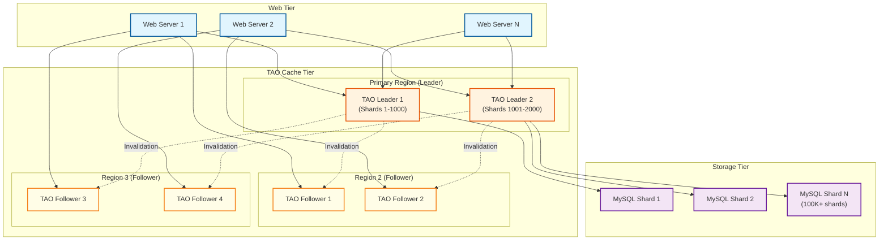
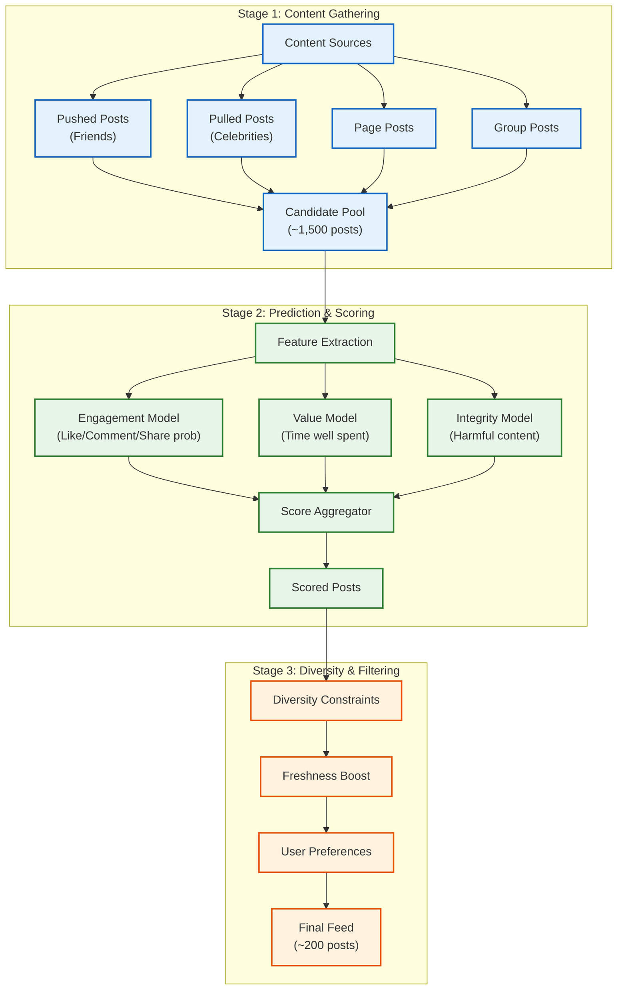
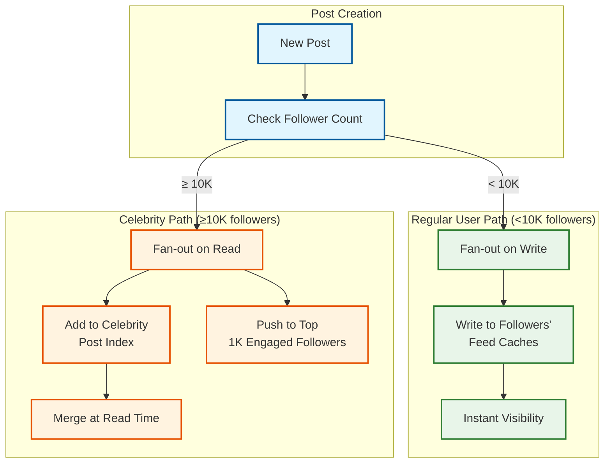

# Deep Dive and Bottlenecks

[← Back to Index](./00-index.md)

---

## Deep Dive 1: TAO Architecture

### Overview

TAO (The Associations and Objects) is Facebook's custom distributed data store designed specifically for the social graph. It handles over **1 billion read requests per second** and millions of writes per second across hundreds of thousands of MySQL shards.

### Architecture Diagram



### Two-Tier Cache Architecture

```
┌─────────────────────────────────────────────────────────────────────────┐
│                    TAO TWO-TIER CACHE ARCHITECTURE                      │
├─────────────────────────────────────────────────────────────────────────┤
│                                                                         │
│  LEADER CACHE (Tier 1)                                                  │
│  ┌─────────────────────────────────────────────────────────────────┐   │
│  │ • One leader per shard (or shard range)                         │   │
│  │ • Authoritative cache - source of truth for reads               │   │
│  │ • All writes go through leader                                  │   │
│  │ • Responsible for cache invalidation to followers               │   │
│  │ • Located in PRIMARY region for that shard                      │   │
│  └─────────────────────────────────────────────────────────────────┘   │
│                                                                         │
│  FOLLOWER CACHE (Tier 2)                                               │
│  ┌─────────────────────────────────────────────────────────────────┐   │
│  │ • Multiple followers per leader (different regions)             │   │
│  │ • Serve reads WITHOUT contacting leader (local reads)           │   │
│  │ • Eventually consistent with leader                             │   │
│  │ • Receive invalidation messages from leader                     │   │
│  │ • On cache miss: forward to leader, backfill locally            │   │
│  └─────────────────────────────────────────────────────────────────┘   │
│                                                                         │
│  WRITE PATH:                                                            │
│  Client → Leader → MySQL → Invalidate Followers                         │
│                                                                         │
│  READ PATH:                                                             │
│  Client → Follower (hit?) → Leader (hit?) → MySQL                      │
│                                                                         │
│  WHY TWO-TIER?                                                          │
│  • Single leader prevents write conflicts                               │
│  • Multiple followers enable geographic read scaling                    │
│  • Followers can serve stale reads (acceptable for most social data)   │
│  • Invalidation provides eventual consistency                           │
│                                                                         │
└─────────────────────────────────────────────────────────────────────────┘
```

### Sharding Strategy

```
SHARDING DETAILS:

Total Shards: 100,000+ MySQL shards

Shard Key: Embedded in object_id (top 16 bits)

Shard Assignment:
  • New users: Assigned to least-loaded shard
  • Posts: Same shard as author (co-location)
  • Associations: Stored on id1's shard

Benefits of This Strategy:
  1. User's data is co-located (friends list, posts, likes)
  2. Friend-of-friend queries span few shards
  3. Consistent hashing allows shard rebalancing
  4. Object IDs never change (shard encoded at creation)

Shard Rebalancing:
  • Physical servers can be added/removed
  • Logical shards remapped via consistent hash ring
  • Object IDs remain stable (point to logical shard)
```

### Read-Your-Writes Consistency

```
ALGORITHM Read_Your_Writes_TAO

PURPOSE: Ensure user sees their own writes immediately

FUNCTION handle_request(user_id, operation, data):
    // Track last write time per user-shard
    shard_id = get_user_shard(user_id)

    IF operation == WRITE:
        result = forward_to_leader(shard_id, operation, data)
        // Record write timestamp
        write_tracker.set(user_id, shard_id, now())
        RETURN result

    IF operation == READ:
        last_write = write_tracker.get(user_id, shard_id)

        IF last_write AND (now() - last_write) < CONSISTENCY_WINDOW:
            // Recent write - must read from leader
            RETURN forward_to_leader(shard_id, operation, data)
        ELSE:
            // Safe to read from follower
            RETURN read_from_follower(shard_id, operation, data)

CONSTANTS:
  CONSISTENCY_WINDOW = 5 seconds  // Time before follower is safe
```

### Cache Invalidation Protocol

```
CACHE INVALIDATION FLOW:

1. Write arrives at Leader
2. Leader writes to MySQL (with transaction)
3. Leader updates local cache
4. Leader sends invalidation message to all Followers
5. Followers invalidate their local cache entry

Invalidation Message:
{
  "type": "invalidate",
  "object_id": 12345,
  "version": 42,
  "timestamp": 1704067200
}

Follower Handling:
  • If cached version < message version: invalidate
  • If cached version >= message version: ignore (already updated)
  • On next read: fetch from leader (which may fetch from MySQL)

Failure Handling:
  • If follower misses invalidation: stale reads until TTL
  • Periodic background sync catches missed invalidations
  • Bounded staleness: max 60 seconds
```

---

## Deep Dive 2: News Feed Ranking

### Three-Stage Pipeline Architecture



### Ranking Signals

```
┌─────────────────────────────────────────────────────────────────────────┐
│                        RANKING SIGNALS                                  │
├─────────────────────────────────────────────────────────────────────────┤
│                                                                         │
│  EXPLICIT SIGNALS (User Actions)                                        │
│  ┌─────────────────────────────────────────────────────────────────┐   │
│  │ • Likes (including reaction type: love, haha, wow, sad, angry)  │   │
│  │ • Comments (with sentiment analysis)                            │   │
│  │ • Shares (public share vs private message)                      │   │
│  │ • Clicks (link clicks, photo opens, video plays)                │   │
│  │ • Saves (bookmark for later)                                    │   │
│  │ • Hide/Report (negative signal)                                 │   │
│  └─────────────────────────────────────────────────────────────────┘   │
│                                                                         │
│  IMPLICIT SIGNALS (Behavioral)                                          │
│  ┌─────────────────────────────────────────────────────────────────┐   │
│  │ • View duration (time spent looking at post)                    │   │
│  │ • Scroll velocity (fast scroll = low interest)                  │   │
│  │ • Video watch time (percentage completed)                       │   │
│  │ • Return visits (came back to see comments)                     │   │
│  │ • Dwell time before scrolling                                   │   │
│  └─────────────────────────────────────────────────────────────────┘   │
│                                                                         │
│  SOCIAL SIGNALS (Relationship)                                          │
│  ┌─────────────────────────────────────────────────────────────────┐   │
│  │ • Friend closeness score (interaction frequency)                │   │
│  │ • Mutual friends who engaged with post                          │   │
│  │ • Profile visit frequency                                       │   │
│  │ • Messaging frequency                                           │   │
│  │ • Photo tagging together                                        │   │
│  └─────────────────────────────────────────────────────────────────┘   │
│                                                                         │
│  CONTENT SIGNALS (Post Characteristics)                                 │
│  ┌─────────────────────────────────────────────────────────────────┐   │
│  │ • Post type (text, photo, video, link)                          │   │
│  │ • Content freshness (age in minutes/hours)                      │   │
│  │ • Text length and readability                                   │   │
│  │ • Image/video quality signals                                   │   │
│  │ • Link domain reputation                                        │   │
│  │ • Hashtags and mentions                                         │   │
│  └─────────────────────────────────────────────────────────────────┘   │
│                                                                         │
│  CONTEXT SIGNALS (Environment)                                          │
│  ┌─────────────────────────────────────────────────────────────────┐   │
│  │ • Time of day                                                   │   │
│  │ • Day of week                                                   │   │
│  │ • Device type (mobile vs desktop)                               │   │
│  │ • Connection speed                                              │   │
│  │ • User's current session depth                                  │   │
│  └─────────────────────────────────────────────────────────────────┘   │
│                                                                         │
└─────────────────────────────────────────────────────────────────────────┘
```

### EdgeRank Evolution

```
EDGERANK (Original Algorithm, ~2010):
┌─────────────────────────────────────────────────────────────────────────┐
│                                                                         │
│  Score = Σ (Affinity × Weight × Decay)                                 │
│           edges                                                         │
│                                                                         │
│  Affinity: How close is the viewer to the content creator?             │
│  Weight: How important is this type of action? (comment > like)        │
│  Decay: How recent is this edge? (newer = higher)                       │
│                                                                         │
│  LIMITATIONS:                                                           │
│  • Too simple for billions of users                                     │
│  • Couldn't capture nuanced preferences                                 │
│  • Easy to game (engagement bait)                                       │
│  • No personalization beyond friend affinity                            │
│                                                                         │
└─────────────────────────────────────────────────────────────────────────┘

MODERN ML-BASED RANKING (2020+):
┌─────────────────────────────────────────────────────────────────────────┐
│                                                                         │
│  • Deep learning models with thousands of features                      │
│  • Separate models for different objectives                             │
│  • Multi-task learning (predict multiple engagement types)              │
│  • Real-time feature computation                                        │
│  • Personalized per-user model weights                                  │
│                                                                         │
│  Model Architecture:                                                    │
│  ┌─────────────────────────────────────────────────────────────────┐   │
│  │ Input Features (1000+)                                          │   │
│  │        ↓                                                        │   │
│  │ Embedding Layers (user, post, author embeddings)                │   │
│  │        ↓                                                        │   │
│  │ Deep Neural Network (multiple hidden layers)                    │   │
│  │        ↓                                                        │   │
│  │ Multi-Task Heads:                                               │   │
│  │   • P(like) | P(comment) | P(share) | P(click)                  │   │
│  │   • P(hide) | P(report)                                         │   │
│  │   • E(watch_time) | E(dwell_time)                               │   │
│  │        ↓                                                        │   │
│  │ Weighted Combination → Final Score                               │   │
│  └─────────────────────────────────────────────────────────────────┘   │
│                                                                         │
└─────────────────────────────────────────────────────────────────────────┘
```

### Multi-Objective Optimization

```
OBJECTIVE WEIGHTING:

Final_Score = w1 × Engagement + w2 × Value + w3 × Integrity

Where:
  Engagement = P(like) + 2×P(comment) + 3×P(share) + P(click)
  Value = E(watch_time) + E(dwell_time) - P(regret)
  Integrity = 1 - P(misinformation) - P(hate_speech) - P(violence)

Trade-off Example:
  • Clickbait: High engagement, low value → Demoted
  • Thoughtful article: Medium engagement, high value → Promoted
  • Misinformation: Any engagement score → Heavily demoted

Weight Tuning:
  • Weights adjusted based on user studies and satisfaction surveys
  • A/B testing different weight combinations
  • Regional variations for cultural differences
```

---

## Deep Dive 3: Hot User Problem (Celebrity Handling)

### Problem Statement

```
THE CELEBRITY PROBLEM:
┌─────────────────────────────────────────────────────────────────────────┐
│                                                                         │
│  Scenario: Celebrity with 100 million followers posts                   │
│                                                                         │
│  NAIVE FAN-OUT ON WRITE:                                               │
│  • 1 post → 100,000,000 feed cache writes                              │
│  • At 10 posts/day → 1 billion writes/day from ONE user                │
│  • System overload, cascading failures                                  │
│                                                                         │
│  ISSUES:                                                                │
│  1. Write amplification: O(followers) per post                         │
│  2. Cache stampede: Millions of simultaneous writes                     │
│  3. Wasted writes: Most followers won't see post today                 │
│  4. Latency spike: Post appears slow to publish                        │
│                                                                         │
└─────────────────────────────────────────────────────────────────────────┘
```

### Solution: Hybrid Fan-out



### Celebrity Post Handling Algorithm

```
ALGORITHM Celebrity_Post_Distribution

CONSTANTS:
  CELEBRITY_THRESHOLD = 10000
  TOP_FOLLOWER_PUSH_COUNT = 1000
  CELEBRITY_INDEX_TTL = 86400  // 24 hours

FUNCTION distribute_celebrity_post(author_id, post_id, post):
    // Step 1: Store in celebrity index (for pull-based retrieval)
    celebrity_index.add(
        key=format("celebrity:%d:posts", author_id),
        member=post_id,
        score=post.created_time,
        ttl=CELEBRITY_INDEX_TTL
    )

    // Step 2: Identify top engaged followers
    top_followers = identify_top_followers(author_id, TOP_FOLLOWER_PUSH_COUNT)

    // Step 3: Push to top followers (they're most likely to engage)
    FOR follower_id IN top_followers:
        IF check_privacy(post, follower_id):
            feed_cache.add(follower_id, post_id, post.created_time)

    // Step 4: Queue background notification (sampling)
    notification_queue.enqueue({
        "type": "celebrity_post",
        "author_id": author_id,
        "post_id": post_id,
        "sample_rate": calculate_sample_rate(author_id)
    })

FUNCTION identify_top_followers(author_id, count):
    // Use engagement scoring to find most likely engagers
    // Factors: recent interactions, profile visits, notification enables

    engagement_scores = engagement_store.get_top(
        key=format("engagement:%d:followers", author_id),
        count=count
    )

    RETURN [f.follower_id FOR f IN engagement_scores]

FUNCTION merge_celebrity_posts_at_read(user_id, base_feed):
    // Called during feed generation

    // Get celebrities this user follows
    celebrity_follows = tao.get_assoc_range(
        user_id, FOLLOWS_CELEBRITY, limit=100
    )

    celebrity_posts = []
    FOR celeb_id IN celebrity_follows:
        // Pull recent posts from celebrity index
        posts = celebrity_index.get_range(
            key=format("celebrity:%d:posts", celeb_id),
            min_time=now() - 86400,  // Last 24 hours
            limit=10
        )
        celebrity_posts.extend(posts)

    // Merge with base feed
    merged = merge_sorted_by_time(base_feed, celebrity_posts)

    RETURN merged
```

### Dynamic Threshold Adjustment

```
DYNAMIC CELEBRITY THRESHOLD:

Base Threshold: 10,000 followers

Adjustment Factors:
  • System load: Higher load → Lower threshold (more pull)
  • Time of day: Peak hours → Lower threshold
  • User activity: High posting frequency → Lower threshold
  • Post type: Video posts → Lower threshold (more expensive)

FUNCTION calculate_dynamic_threshold(author_id, post_type):
    base = 10000

    // Adjust for system load
    current_load = system_metrics.get_write_queue_depth()
    IF current_load > HIGH_LOAD_THRESHOLD:
        base = base * 0.5  // 5K threshold under load

    // Adjust for post type
    IF post_type == VIDEO:
        base = base * 0.7  // Lower for expensive content

    // Adjust for author's posting frequency
    posts_last_hour = author_stats.posts_last_hour(author_id)
    IF posts_last_hour > 5:
        base = base * 0.8  // Prolific posters use pull earlier

    RETURN base
```

---

## Deep Dive 4: Memcached at Scale

### Scale Numbers

```
MEMCACHED AT FACEBOOK SCALE:
┌─────────────────────────────────────────────────────────────────────────┐
│                                                                         │
│  Requests: Billions per second                                          │
│  Cache Reads per Page: 521 distinct reads (average)                     │
│  Cache Hit Rate Target: 99%+ for hot data                               │
│  Cluster Size: Thousands of servers per region                          │
│  Total Memory: Petabytes across all clusters                            │
│                                                                         │
│  Architecture:                                                          │
│  • Client-side consistent hashing (no central router)                   │
│  • Servers are independent (shared-nothing)                             │
│  • UDP for get operations (lower overhead)                              │
│  • TCP for set operations (reliability)                                 │
│                                                                         │
└─────────────────────────────────────────────────────────────────────────┘
```

### Thundering Herd Prevention

```
THUNDERING HERD PROBLEM:
┌─────────────────────────────────────────────────────────────────────────┐
│                                                                         │
│  Scenario: Popular key expires or is invalidated                        │
│                                                                         │
│  1. 10,000 concurrent requests arrive for same key                      │
│  2. All see cache miss                                                  │
│  3. All query database simultaneously                                   │
│  4. Database overloaded, cascading failure                              │
│                                                                         │
└─────────────────────────────────────────────────────────────────────────┘

SOLUTION: Lease-Based Regeneration

ALGORITHM Lease_Based_Cache_Get

FUNCTION get_with_lease(key):
    // Atomic get-or-lease operation
    result = memcached.gets(key)

    IF result.value != null:
        // Cache hit
        RETURN result.value

    // Cache miss - try to get lease
    lease_granted = memcached.add(
        key=format("lease:%s", key),
        value=my_request_id,
        ttl=10  // 10 second lease
    )

    IF lease_granted:
        // We won the lease - regenerate value
        value = regenerate_from_database(key)
        memcached.set(key, value, ttl=DEFAULT_TTL)
        memcached.delete(format("lease:%s", key))
        RETURN value
    ELSE:
        // Someone else is regenerating - wait and retry
        sleep(50ms)
        RETURN get_with_lease(key)  // Recursive retry

OPTIMIZATION: Stale-While-Revalidate
  • Keep stale value with "stale" flag
  • Serve stale value while one client regenerates
  • Reduces latency during regeneration
```

### Regional Cache Pools

```
REGIONAL CACHE ARCHITECTURE:
┌─────────────────────────────────────────────────────────────────────────┐
│                                                                         │
│  ┌─────────────────────────────────────────────────────────────────┐   │
│  │                        Region A (Primary)                        │   │
│  │  ┌─────────────┐  ┌─────────────┐  ┌─────────────┐             │   │
│  │  │ Pool: User  │  │ Pool: Feed  │  │ Pool: Graph │             │   │
│  │  │ (hot users) │  │ (feed cache)│  │ (TAO data)  │             │   │
│  │  └─────────────┘  └─────────────┘  └─────────────┘             │   │
│  └─────────────────────────────────────────────────────────────────┘   │
│                              ↑ Cross-region invalidation               │
│  ┌─────────────────────────────────────────────────────────────────┐   │
│  │                        Region B (Replica)                        │   │
│  │  ┌─────────────┐  ┌─────────────┐  ┌─────────────┐             │   │
│  │  │ Pool: User  │  │ Pool: Feed  │  │ Pool: Graph │             │   │
│  │  │ (read-only) │  │ (read-only) │  │ (read-only) │             │   │
│  │  └─────────────┘  └─────────────┘  └─────────────┘             │   │
│  └─────────────────────────────────────────────────────────────────┘   │
│                                                                         │
│  POOL ISOLATION:                                                        │
│  • Separate pools for different data types                              │
│  • Prevents one type from evicting another                              │
│  • Different TTLs per pool based on data characteristics                │
│                                                                         │
│  CROSS-REGION INVALIDATION:                                             │
│  • Primary region invalidates secondary regions                         │
│  • Uses message queue for reliable delivery                             │
│  • Bounded staleness (typically < 1 second)                             │
│                                                                         │
└─────────────────────────────────────────────────────────────────────────┘
```

---

## Bottleneck Analysis

### Bottleneck 1: TAO Cache Invalidation Lag

```
PROBLEM:
  Cross-region cache invalidation takes time
  User in Region B may see stale data after friend in Region A posts

IMPACT:
  • Feed shows slightly outdated content (seconds)
  • Privacy changes not immediately reflected
  • Like counts may be inconsistent

MITIGATION STRATEGIES:

1. Read-Your-Writes Routing
   After write: Force reads to leader for N seconds
   Implementation: Sticky session to leader region

2. Version-Based Invalidation
   Include version in cache entry
   Reject reads with older version than expected

3. Bounded Staleness SLA
   Guarantee: All invalidations within 1 second
   Monitoring: Alert if invalidation queue backs up

4. User-Facing Optimistic Updates
   Show user their own action immediately (client-side)
   Reconcile with server state on next refresh
```

### Bottleneck 2: Feed Generation Latency

```
PROBLEM:
  100ms latency budget for feed generation
  Need to gather, score, and filter 1500+ posts

LATENCY BREAKDOWN:
  ┌─────────────────────────────────────────────────────────────────┐
  │ Operation                           │ Target    │ Actual       │
  ├─────────────────────────────────────┼───────────┼──────────────┤
  │ Auth & Rate Check                   │ 5ms       │ 3ms          │
  │ Fetch Friend List (TAO)             │ 10ms      │ 8ms          │
  │ Gather Pushed Posts (Cache)         │ 10ms      │ 7ms          │
  │ Gather Pulled Posts (Celebrity)     │ 15ms      │ 12ms         │
  │ Feature Extraction                  │ 15ms      │ 18ms *       │
  │ ML Model Inference                  │ 30ms      │ 35ms *       │
  │ Diversity Filtering                 │ 5ms       │ 4ms          │
  │ Response Serialization              │ 5ms       │ 3ms          │
  ├─────────────────────────────────────┼───────────┼──────────────┤
  │ TOTAL                               │ 95ms      │ 90ms         │
  └─────────────────────────────────────────────────────────────────┘

MITIGATION STRATEGIES:

1. Precomputation
   • Precompute feeds for active users (scheduled job)
   • Serve from cache, refresh in background
   • Trade-off: Freshness vs latency

2. Tiered Ranking
   • Light model for initial filtering (fast)
   • Heavy model only for top 500 candidates
   • Progressive enhancement

3. Feature Caching
   • Cache user features (profile, preferences)
   • Cache post features (engagement stats)
   • Real-time features computed only for final candidates

4. Model Optimization
   • Quantized models for faster inference
   • Batched inference across users
   • GPU serving for high throughput
```

### Bottleneck 3: Write Amplification

```
PROBLEM:
  One post by regular user triggers 500 feed cache writes
  800M posts/day × 500 = 400B cache writes/day

IMPACT:
  • Cache write throughput limit
  • Network bandwidth consumption
  • Potential cache eviction storms

MITIGATION STRATEGIES:

1. Hybrid Fan-out (Already Implemented)
   • Push only to active followers
   • Pull for inactive users (on read)
   • Threshold: Activity in last 7 days

2. Batch Writes
   • Group writes to same cache server
   • Pipeline multiple operations
   • Reduces network round trips

3. Selective Fan-out
   • Only fan-out to users likely to read soon
   • Use prediction model for activity
   • Lazy fan-out for others

4. Feed Compression
   • Store only post IDs in feed cache
   • Fetch full posts on demand
   • Reduces cache memory pressure
```

### Bottleneck 4: Hot Shards

```
PROBLEM:
  Celebrity's shard receives disproportionate traffic
  Single MySQL shard becomes bottleneck

IMPACT:
  • Increased latency for celebrity's data
  • Risk of shard failure affecting many users
  • Uneven resource utilization

MITIGATION STRATEGIES:

1. Read Replicas
   • Multiple read replicas per hot shard
   • Route reads to replicas
   • Leader handles writes only

2. Aggressive Caching
   • Higher TTL for celebrity data
   • Multiple cache copies across regions
   • Dedicated cache pool for hot users

3. Shard Splitting
   • Split hot shard into multiple shards
   • Re-hash objects to new shards
   • Requires data migration

4. Time-Based Sharding for Posts
   • Recent posts on hot shard
   • Old posts migrate to cold storage
   • Reduces hot shard size over time
```

---

## Concurrency and Race Conditions

### Race Condition 1: Like Count Inconsistency

```
PROBLEM:
  Two users like same post simultaneously
  Both read count=100, both write count=101
  Final count=101 instead of 102

SOLUTION: Atomic Increment

FUNCTION like_post(user_id, post_id):
    lock_key = format("lock:like:%d:%d", user_id, post_id)

    // Optimistic check (no lock)
    IF already_liked(user_id, post_id):
        RETURN "already_liked"

    // Atomic operations
    WITH distributed_lock(lock_key, timeout=1000):
        // Double-check after acquiring lock
        IF already_liked(user_id, post_id):
            RETURN "already_liked"

        // Create association
        tao.create_assoc(user_id, LIKED, post_id)

        // Atomic increment (no read-modify-write)
        tao.atomic_increment(post_id, LIKE_COUNT, 1)

    RETURN "liked"
```

### Race Condition 2: Privacy Check During Feed Generation

```
PROBLEM:
  Feed generation reads friend list
  Friend unfriends user during generation
  Feed may include posts user shouldn't see

SOLUTION: Point-in-Time Privacy Check

FUNCTION generate_feed_with_privacy(user_id):
    // Snapshot friend list at start
    friends_snapshot = tao.get_assoc_range(user_id, FRIEND)
    snapshot_time = now()

    // Generate candidate posts
    candidates = gather_candidates(user_id, friends_snapshot)

    // Before returning, re-verify privacy
    final_posts = []
    FOR post IN candidates:
        // Check current (not snapshot) privacy
        IF can_view_post(user_id, post, check_time=now()):
            final_posts.append(post)

    RETURN final_posts
```

### Race Condition 3: Duplicate Post Creation

```
PROBLEM:
  User double-clicks "Post" button
  Two posts created with same content

SOLUTION: Client-Side Idempotency Key

FUNCTION create_post_idempotent(idempotency_key, user_id, content):
    cache_key = format("idem:%s", idempotency_key)

    // Check for duplicate
    existing = cache.get(cache_key)
    IF existing:
        RETURN existing.post_id

    // Create with lock to prevent race
    lock_key = format("lock:create:%s", idempotency_key)
    WITH distributed_lock(lock_key, timeout=5000):
        // Double-check after lock
        existing = cache.get(cache_key)
        IF existing:
            RETURN existing.post_id

        // Create post
        post_id = tao.create_object(POST, {content: content})
        tao.create_assoc(user_id, AUTHORED, post_id)

        // Cache result
        cache.set(cache_key, {post_id: post_id}, ttl=86400)

    RETURN post_id
```

---

*Next: [Scalability & Reliability →](./05-scalability-and-reliability.md)*
