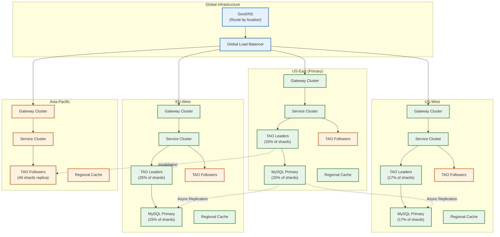
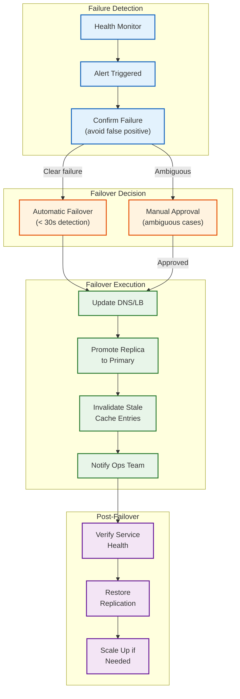

# Scalability and Reliability

[← Back to Index](./00-index.md)

---

## Horizontal Scaling Architecture

### Scaling Strategy by Component

| Component | Scaling Type | Trigger | Strategy |
|-----------|-------------|---------|----------|
| API Gateway | Horizontal | CPU > 70% | Add instances behind LB |
| Feed Service | Horizontal | QPS > threshold | Auto-scale pods |
| Post Service | Horizontal | Write QPS | Scale with queue depth |
| Ranking Service | Horizontal | Latency > 50ms | Add GPU nodes |
| TAO Leaders | Horizontal | Shard load | Split shards |
| TAO Followers | Horizontal | Read QPS | Add replicas per region |
| MySQL Shards | Horizontal | Storage/IOPS | Shard splitting |
| Feed Cache | Horizontal | Memory pressure | Add nodes to cluster |

### Multi-Region Deployment



### Auto-Scaling Configuration

```yaml
# Feed Service Auto-Scaling
apiVersion: autoscaling/v2
kind: HorizontalPodAutoscaler
metadata:
  name: feed-service-hpa
spec:
  scaleTargetRef:
    kind: Deployment
    name: feed-service
  minReplicas: 100
  maxReplicas: 1000
  metrics:
    - type: Resource
      resource:
        name: cpu
        target:
          type: Utilization
          averageUtilization: 70
    - type: External
      external:
        metric:
          name: feed_request_queue_depth
        target:
          type: AverageValue
          averageValue: 100
  behavior:
    scaleUp:
      stabilizationWindowSeconds: 60
      policies:
        - type: Percent
          value: 50
          periodSeconds: 60
    scaleDown:
      stabilizationWindowSeconds: 300
      policies:
        - type: Percent
          value: 10
          periodSeconds: 120
```

---

## Caching Strategy

### Multi-Layer Cache Architecture

```
┌─────────────────────────────────────────────────────────────────────────┐
│                      CACHE HIERARCHY                                    │
├─────────────────────────────────────────────────────────────────────────┤
│                                                                         │
│  LAYER 1: Client-Side Cache                                            │
│  ┌─────────────────────────────────────────────────────────────────┐   │
│  │ Location: Mobile app / Browser                                  │   │
│  │ TTL: 5 minutes                                                  │   │
│  │ Content: User's feed, profile, settings                         │   │
│  │ Hit Rate: ~30%                                                  │   │
│  │ Benefit: Instant load, offline support                          │   │
│  └─────────────────────────────────────────────────────────────────┘   │
│                              ↓                                          │
│  LAYER 2: CDN Edge Cache                                               │
│  ┌─────────────────────────────────────────────────────────────────┐   │
│  │ Location: Edge PoPs globally                                    │   │
│  │ TTL: Varies (24h for static, 0 for dynamic)                     │   │
│  │ Content: Images, videos, JS/CSS                                 │   │
│  │ Hit Rate: 95%+ for media                                        │   │
│  │ Benefit: Low latency media delivery                             │   │
│  └─────────────────────────────────────────────────────────────────┘   │
│                              ↓                                          │
│  LAYER 3: Feed Cache (Regional)                                        │
│  ┌─────────────────────────────────────────────────────────────────┐   │
│  │ Location: Regional data centers                                 │   │
│  │ TTL: 5 minutes (active users), 0 (inactive)                     │   │
│  │ Content: Precomputed user feeds                                 │   │
│  │ Hit Rate: 70% for active users                                  │   │
│  │ Benefit: Avoid ranking computation                              │   │
│  └─────────────────────────────────────────────────────────────────┘   │
│                              ↓                                          │
│  LAYER 4: TAO Follower Cache (Regional)                                │
│  ┌─────────────────────────────────────────────────────────────────┐   │
│  │ Location: Regional data centers                                 │   │
│  │ TTL: 60 seconds                                                 │   │
│  │ Content: Social graph data (objects, associations)              │   │
│  │ Hit Rate: 85%                                                   │   │
│  │ Benefit: Local reads without cross-region latency               │   │
│  └─────────────────────────────────────────────────────────────────┘   │
│                              ↓                                          │
│  LAYER 5: TAO Leader Cache (Central)                                   │
│  ┌─────────────────────────────────────────────────────────────────┐   │
│  │ Location: Primary region per shard                              │   │
│  │ TTL: 10 minutes                                                 │   │
│  │ Content: Authoritative graph data                               │   │
│  │ Hit Rate: 95%                                                   │   │
│  │ Benefit: Avoid MySQL queries                                    │   │
│  └─────────────────────────────────────────────────────────────────┘   │
│                              ↓                                          │
│  LAYER 6: MySQL (Source of Truth)                                      │
│  ┌─────────────────────────────────────────────────────────────────┐   │
│  │ Location: Primary region per shard                              │   │
│  │ Content: All persistent data                                    │   │
│  │ Hit Rate: 5% of requests reach MySQL                            │   │
│  └─────────────────────────────────────────────────────────────────┘   │
│                                                                         │
└─────────────────────────────────────────────────────────────────────────┘
```

### Cache Invalidation Strategy

| Cache Layer | Invalidation Trigger | Mechanism | Latency |
|-------------|---------------------|-----------|---------|
| Client | Server push / TTL | WebSocket / Poll | ~seconds |
| CDN | Purge API | Edge invalidation | <1s |
| Feed Cache | Post/Like/Follow | Queue-based update | <5s |
| TAO Follower | Leader invalidation | Invalidation message | <1s |
| TAO Leader | Write-through | Immediate on write | 0 |

### Cache Warming Strategy

```
CACHE WARMING APPROACHES:

1. Predictive Warming
   - Predict users likely to become active (ML model)
   - Pre-generate feeds before they request
   - Based on: time of day, historical patterns

2. Login-Triggered Warming
   - On successful authentication
   - Async job to generate feed
   - Feed ready by time user navigates

3. Push-Based Warming
   - When friend posts, warm follower's cache
   - Part of fan-out process
   - Ensures fresh content on next load

4. Scheduled Warming
   - Nightly job for top 10% active users
   - Generate fresh feeds during off-peak
   - Reduces morning peak load
```

---

## Fault Tolerance

### Graceful Degradation Levels

```
┌─────────────────────────────────────────────────────────────────────────┐
│                    DEGRADATION LEVELS                                   │
├─────────────────────────────────────────────────────────────────────────┤
│                                                                         │
│  LEVEL 0: NORMAL OPERATION                                             │
│  ┌─────────────────────────────────────────────────────────────────┐   │
│  │ • Full personalized ranking                                     │   │
│  │ • Real-time features                                            │   │
│  │ • All content types                                             │   │
│  │ • Full notification delivery                                    │   │
│  └─────────────────────────────────────────────────────────────────┘   │
│                                                                         │
│  LEVEL 1: RANKING DEGRADED                                             │
│  Trigger: Ranking service latency > 100ms                              │
│  ┌─────────────────────────────────────────────────────────────────┐   │
│  │ • Use cached ranking scores                                     │   │
│  │ • Fall back to lighter model                                    │   │
│  │ • Reduce candidate pool size                                    │   │
│  │ • User impact: Slightly less personalized feed                  │   │
│  └─────────────────────────────────────────────────────────────────┘   │
│                                                                         │
│  LEVEL 2: FEED CACHE DEGRADED                                          │
│  Trigger: Feed cache hit rate < 50%                                    │
│  ┌─────────────────────────────────────────────────────────────────┐   │
│  │ • Serve chronological feed (no ranking)                         │   │
│  │ • Pull from friend posts directly                               │   │
│  │ • Increase cache TTL temporarily                                │   │
│  │ • User impact: Feed order is time-based                         │   │
│  └─────────────────────────────────────────────────────────────────┘   │
│                                                                         │
│  LEVEL 3: TAO DEGRADED                                                 │
│  Trigger: TAO error rate > 1%                                          │
│  ┌─────────────────────────────────────────────────────────────────┐   │
│  │ • Serve stale cached data (ignore freshness)                    │   │
│  │ • Disable writes (read-only mode)                               │   │
│  │ • Show "connectivity issues" banner                             │   │
│  │ • User impact: Can browse but not post/interact                 │   │
│  └─────────────────────────────────────────────────────────────────┘   │
│                                                                         │
│  LEVEL 4: REGIONAL FAILOVER                                            │
│  Trigger: Region unreachable                                           │
│  ┌─────────────────────────────────────────────────────────────────┐   │
│  │ • Route traffic to backup region                                │   │
│  │ • Higher latency but functional                                 │   │
│  │ • Some data may be stale (replication lag)                      │   │
│  │ • User impact: Slower but working                               │   │
│  └─────────────────────────────────────────────────────────────────┘   │
│                                                                         │
└─────────────────────────────────────────────────────────────────────────┘
```

### Circuit Breaker Implementation

```
CIRCUIT BREAKER CONFIGURATION:

Service: Ranking Service
States: CLOSED → OPEN → HALF_OPEN → CLOSED

Parameters:
  failure_threshold: 5 failures in 10 seconds
  open_duration: 30 seconds
  half_open_requests: 3 requests
  success_threshold: 2 consecutive successes

FUNCTION call_with_circuit_breaker(service, request):
    breaker = get_breaker(service)

    IF breaker.state == OPEN:
        IF breaker.open_since + OPEN_DURATION < now():
            breaker.state = HALF_OPEN
        ELSE:
            RETURN fallback_response(service, request)

    TRY:
        response = service.call(request, timeout=50ms)
        breaker.record_success()

        IF breaker.state == HALF_OPEN:
            IF breaker.half_open_successes >= SUCCESS_THRESHOLD:
                breaker.state = CLOSED
                breaker.reset_counters()

        RETURN response

    CATCH TimeoutException, ServiceException:
        breaker.record_failure()

        IF breaker.state == HALF_OPEN:
            breaker.state = OPEN
            breaker.open_since = now()
        ELIF breaker.recent_failures >= FAILURE_THRESHOLD:
            breaker.state = OPEN
            breaker.open_since = now()

        RETURN fallback_response(service, request)

FUNCTION fallback_response(service, request):
    SWITCH service:
        CASE "ranking":
            RETURN chronological_feed(request.user_id)
        CASE "tao":
            RETURN cached_data(request.key)
        DEFAULT:
            RETURN error_response("Service temporarily unavailable")
```

### Retry Strategy

```
RETRY CONFIGURATION:

Operation: TAO Read
  max_retries: 3
  initial_delay: 10ms
  max_delay: 100ms
  backoff_multiplier: 2
  jitter: 0.2 (20%)
  retryable_errors: [TIMEOUT, UNAVAILABLE, RESOURCE_EXHAUSTED]

Operation: Post Write
  max_retries: 2
  initial_delay: 50ms
  max_delay: 200ms
  idempotency_key: required
  retryable_errors: [TIMEOUT, UNAVAILABLE]

FUNCTION retry_with_backoff(operation, max_retries, initial_delay):
    delay = initial_delay

    FOR attempt IN range(max_retries + 1):
        TRY:
            result = operation()
            RETURN result

        CATCH RetryableException as e:
            IF attempt == max_retries:
                RAISE e

            # Add jitter to prevent thundering herd
            jittered_delay = delay * (1 + random(-0.2, 0.2))
            sleep(jittered_delay)
            delay = min(delay * 2, max_delay)

        CATCH NonRetryableException as e:
            RAISE e  # Don't retry
```

---

## Disaster Recovery

### Recovery Objectives

| Metric | Target | Strategy |
|--------|--------|----------|
| **RTO** (Recovery Time Objective) | 5 minutes | Automated failover |
| **RPO** (Recovery Point Objective) | 1 second | Synchronous replication within region |
| **Cross-Region RPO** | 30 seconds | Async replication |

### Backup Strategy

```
BACKUP HIERARCHY:

1. Continuous Replication (RPO: 0)
   - MySQL: Synchronous replication to standby
   - TAO: Write-ahead log shipping
   - Feed Cache: N/A (regenerable)

2. Point-in-Time Recovery (RPO: 1 second)
   - MySQL: Binary log archival
   - Retention: 7 days
   - Stored: Cross-region object storage

3. Daily Snapshots (RPO: 24 hours)
   - Full database dumps
   - Retention: 30 days
   - Used for: Dev/test environments, compliance

4. Cold Archive (Long-term)
   - Monthly snapshots
   - Retention: 7 years
   - Used for: Legal compliance, audit
```

### Failover Procedures



### Regional Failover Scenarios

| Scenario | Detection | Action | Impact |
|----------|-----------|--------|--------|
| Single MySQL shard failure | Health check failure | Promote replica | None (transparent) |
| TAO Leader node failure | Connection errors | Re-elect leader | Brief latency spike |
| Region network partition | Multi-service errors | Route to backup region | Higher latency |
| Full region outage | All endpoints unreachable | DNS failover | RPO loss, ~5 min RTO |
| Data corruption | Integrity checks | Restore from backup | Potential data loss |

---

## Load Balancing

### Multi-Level Load Balancing

```
┌─────────────────────────────────────────────────────────────────────────┐
│                    LOAD BALANCING HIERARCHY                             │
├─────────────────────────────────────────────────────────────────────────┤
│                                                                         │
│  LEVEL 1: DNS (GeoDNS)                                                  │
│  ┌─────────────────────────────────────────────────────────────────┐   │
│  │ Algorithm: Geographic routing                                   │   │
│  │ Purpose: Route to nearest region                                │   │
│  │ Failover: Health-based DNS changes                              │   │
│  └─────────────────────────────────────────────────────────────────┘   │
│                              ↓                                          │
│  LEVEL 2: Global Load Balancer (L4/L7)                                 │
│  ┌─────────────────────────────────────────────────────────────────┐   │
│  │ Algorithm: Weighted round-robin with health checks              │   │
│  │ Purpose: Distribute across regional endpoints                   │   │
│  │ Features: SSL termination, DDoS protection                      │   │
│  └─────────────────────────────────────────────────────────────────┘   │
│                              ↓                                          │
│  LEVEL 3: Regional Load Balancer                                       │
│  ┌─────────────────────────────────────────────────────────────────┐   │
│  │ Algorithm: Least connections                                    │   │
│  │ Purpose: Distribute to service instances                        │   │
│  │ Features: Connection draining, graceful shutdown                │   │
│  └─────────────────────────────────────────────────────────────────┘   │
│                              ↓                                          │
│  LEVEL 4: Service Mesh (Internal)                                      │
│  ┌─────────────────────────────────────────────────────────────────┐   │
│  │ Algorithm: Consistent hashing (for stateful), Round-robin       │   │
│  │ Purpose: Service-to-service load balancing                      │   │
│  │ Features: Circuit breaking, retry, timeout                      │   │
│  └─────────────────────────────────────────────────────────────────┘   │
│                                                                         │
└─────────────────────────────────────────────────────────────────────────┘
```

### TAO-Specific Load Balancing

```
TAO ROUTING LOGIC:

Client → TAO Request → Router

Router Logic:
1. Extract shard_id from object_id
2. Determine read vs write

FOR READS:
  IF read_your_writes_required:
      Route to Leader for shard
  ELSE:
      Route to nearest Follower

FOR WRITES:
  ALWAYS route to Leader for shard

Leader Selection:
  - Each shard has exactly ONE leader
  - Leader location stored in coordination service
  - Failover: New leader elected on failure

Follower Selection:
  - Multiple followers per region per shard
  - Select by: latency, load, health
  - Fallback: Cross-region follower if local unavailable
```

---

## Capacity Planning

### Growth Projections

| Metric | Current | Year 1 | Year 3 | Year 5 |
|--------|---------|--------|--------|--------|
| DAU | 2B | 2.2B | 2.5B | 3B |
| Peak QPS | 700K | 850K | 1.1M | 1.5M |
| Posts/Day | 800M | 1B | 1.5B | 2B |
| Storage (Posts) | 200TB | 450TB | 1PB | 2.5PB |
| TAO Shards | 100K | 130K | 200K | 300K |

### Infrastructure Scaling Plan

```
SCALING MILESTONES:

Year 1 (+10% DAU):
  • Add 2 new regions (Africa, Middle East)
  • Increase cache cluster size by 30%
  • Add GPU capacity for ranking (2x)

Year 3 (+25% DAU):
  • Major shard rebalancing
  • Upgrade to next-gen ML models
  • Implement edge-native feed serving
  • New media transcoding pipeline

Year 5 (+50% DAU):
  • Full edge compute for feed generation
  • Migrate to new storage technology
  • AI-driven auto-scaling
```

### Cost Optimization Strategies

| Strategy | Savings | Trade-off |
|----------|---------|-----------|
| Spot instances for batch jobs | 60-70% | Job interruption risk |
| Reserved capacity for steady state | 30-40% | Commitment required |
| Tiered storage (hot/warm/cold) | 50% | Access latency for cold |
| Model quantization | 40% GPU | Slight accuracy loss |
| Regional data residency | 20% egress | Compliance complexity |

---

*Next: [Security & Compliance →](./06-security-and-compliance.md)*
