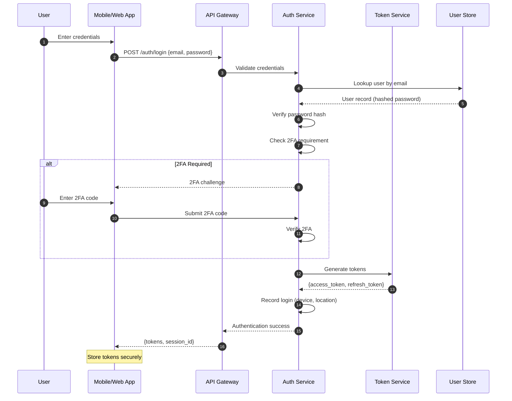
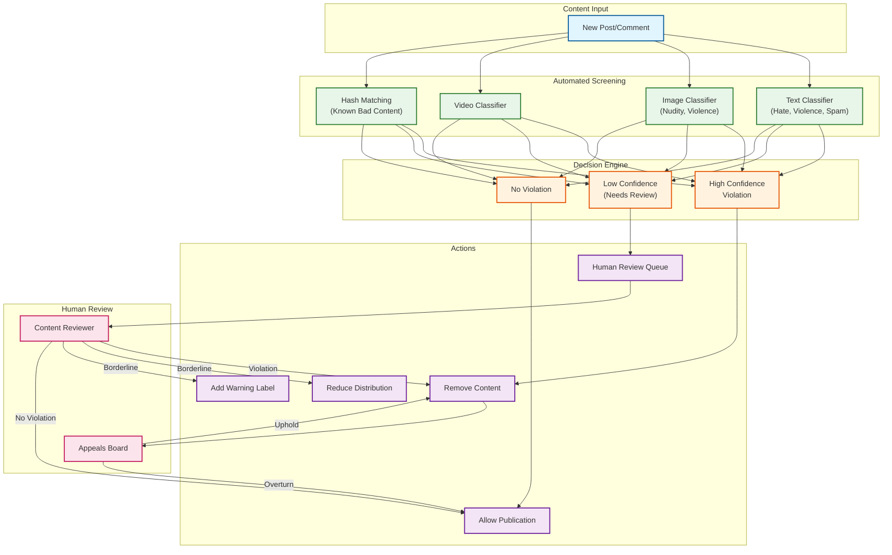

# Security and Compliance

[← Back to Index](./00-index.md)

---

## Threat Model

### STRIDE Analysis

| Threat | Description | Facebook-Specific Risk | Mitigation |
|--------|-------------|------------------------|------------|
| **Spoofing** | Impersonating another user | Account takeover, fake profiles | MFA, login anomaly detection |
| **Tampering** | Modifying posts/data | Editing others' content, vote manipulation | Cryptographic signatures, audit logs |
| **Repudiation** | Denying actions | Claiming didn't post harmful content | Immutable audit trail |
| **Information Disclosure** | Data leaks | PII exposure, private posts | Encryption, access controls |
| **Denial of Service** | Overloading systems | API abuse, feed flooding | Rate limiting, auto-scaling |
| **Elevation of Privilege** | Gaining unauthorized access | Admin access, bypassing privacy | RBAC, least privilege |

### Top Attack Vectors

```
┌─────────────────────────────────────────────────────────────────────────┐
│                    CRITICAL ATTACK VECTORS                              │
├─────────────────────────────────────────────────────────────────────────┤
│                                                                         │
│  1. ACCOUNT TAKEOVER                                                    │
│  ┌─────────────────────────────────────────────────────────────────┐   │
│  │ Methods:                                                        │   │
│  │ • Credential stuffing (leaked passwords)                        │   │
│  │ • Phishing (fake login pages)                                   │   │
│  │ • SIM swapping (bypass SMS 2FA)                                 │   │
│  │ • Session hijacking                                             │   │
│  │                                                                 │   │
│  │ Mitigations:                                                    │   │
│  │ • Hardware security keys (FIDO2)                                │   │
│  │ • Login anomaly detection (new device, location)                │   │
│  │ • Breached password checking                                    │   │
│  │ • Session binding to device fingerprint                         │   │
│  └─────────────────────────────────────────────────────────────────┘   │
│                                                                         │
│  2. DATA SCRAPING                                                       │
│  ┌─────────────────────────────────────────────────────────────────┐   │
│  │ Methods:                                                        │   │
│  │ • Automated profile crawling                                    │   │
│  │ • API abuse (high volume requests)                              │   │
│  │ • Fake friend requests to access private data                   │   │
│  │                                                                 │   │
│  │ Mitigations:                                                    │   │
│  │ • Rate limiting (200 calls/user/hour)                           │   │
│  │ • Behavioral analysis (bot detection)                           │   │
│  │ • CAPTCHAs for suspicious activity                              │   │
│  │ • Data access logging and anomaly detection                     │   │
│  └─────────────────────────────────────────────────────────────────┘   │
│                                                                         │
│  3. COORDINATED INAUTHENTIC BEHAVIOR                                    │
│  ┌─────────────────────────────────────────────────────────────────┐   │
│  │ Methods:                                                        │   │
│  │ • Bot networks spreading disinformation                         │   │
│  │ • Fake account farms                                            │   │
│  │ • Manipulation of trending topics                               │   │
│  │                                                                 │   │
│  │ Mitigations:                                                    │   │
│  │ • ML-based fake account detection                               │   │
│  │ • Network analysis (coordinated behavior patterns)              │   │
│  │ • Phone/ID verification for suspicious accounts                 │   │
│  │ • Transparency reports                                          │   │
│  └─────────────────────────────────────────────────────────────────┘   │
│                                                                         │
│  4. PRIVACY VIOLATIONS                                                  │
│  ┌─────────────────────────────────────────────────────────────────┐   │
│  │ Methods:                                                        │   │
│  │ • Apps accessing data beyond permissions                        │   │
│  │ • Friend-of-friend data leakage                                 │   │
│  │ • Re-identification of anonymized data                          │   │
│  │                                                                 │   │
│  │ Mitigations:                                                    │   │
│  │ • Granular permissions model                                    │   │
│  │ • App review process                                            │   │
│  │ • Data access audits                                            │   │
│  │ • Privacy-preserving analytics                                  │   │
│  └─────────────────────────────────────────────────────────────────┘   │
│                                                                         │
└─────────────────────────────────────────────────────────────────────────┘
```

---

## Authentication and Authorization

### Authentication Flow



### OAuth2 Permissions Model (Graph API)

```
PERMISSION CATEGORIES:

1. Public Permissions (No Review Required)
   • email - User's email address
   • public_profile - Basic profile info

2. User Data Permissions (Review Required)
   • user_friends - Access to friend list
   • user_photos - Access to photos
   • user_posts - Access to posts
   • user_likes - Access to page likes
   • user_location - Access to location

3. Extended Permissions (Business Verification)
   • pages_manage_posts - Post to pages
   • ads_management - Manage ad accounts
   • business_management - Business access

PERMISSION REQUEST FLOW:
  1. App requests permissions during OAuth
  2. User sees permission dialog
  3. User can selectively approve/deny
  4. App receives access token with granted scopes
  5. API enforces scope on each request
```

### Authorization Architecture

```
AUTHORIZATION CHECKS AT MULTIPLE LAYERS:

┌─────────────────────────────────────────────────────────────────────────┐
│  Layer 1: API Gateway                                                   │
│  • Token validation                                                     │
│  • Rate limiting                                                        │
│  • Basic scope checking                                                 │
├─────────────────────────────────────────────────────────────────────────┤
│  Layer 2: Service Layer                                                 │
│  • Business logic authorization                                         │
│  • Resource ownership verification                                      │
│  • App permission verification                                          │
├─────────────────────────────────────────────────────────────────────────┤
│  Layer 3: Data Layer (TAO)                                             │
│  • Privacy setting enforcement                                          │
│  • Friend-list based access control                                     │
│  • Blocked user filtering                                               │
└─────────────────────────────────────────────────────────────────────────┘

PRIVACY CHECK PSEUDOCODE:

FUNCTION can_view_post(viewer_id, post):
    // Check if viewer is blocked
    IF is_blocked(post.author_id, viewer_id):
        RETURN false

    // Check post privacy setting
    SWITCH post.privacy:
        CASE PUBLIC:
            RETURN true

        CASE FRIENDS:
            RETURN is_friend(post.author_id, viewer_id)

        CASE FRIENDS_OF_FRIENDS:
            RETURN is_friend(post.author_id, viewer_id) OR
                   has_mutual_friend(post.author_id, viewer_id)

        CASE CUSTOM:
            RETURN is_in_custom_list(post.privacy_list, viewer_id)

        CASE ONLY_ME:
            RETURN viewer_id == post.author_id

    RETURN false
```

---

## Data Privacy

### Privacy-by-Design Principles

| Principle | Implementation |
|-----------|---------------|
| **Data Minimization** | Collect only necessary data; delete when no longer needed |
| **Purpose Limitation** | Use data only for stated purposes |
| **Storage Limitation** | Retention policies per data type |
| **Accuracy** | Allow users to correct their data |
| **Transparency** | Clear privacy policies, data access tools |
| **User Control** | Granular privacy settings per post/profile field |

### Audience Controls

```
PRIVACY OPTIONS PER POST:

1. Public
   - Visible to anyone, including non-users
   - Indexed by search engines

2. Friends
   - Visible only to confirmed friends
   - Default for most users

3. Friends except...
   - Friends minus specific excluded people
   - For sensitive content

4. Specific friends
   - Only selected friends can see
   - For small-group sharing

5. Only me
   - Private to author
   - For drafts, memories

CUSTOM LISTS:
  - Close Friends
  - Family
  - Acquaintances
  - User-defined groups
```

### Data Portability

```
DOWNLOAD YOUR DATA (DYD) FEATURE:

Available Data:
  • Posts, photos, videos
  • Comments and reactions
  • Messages (if requested)
  • Profile information
  • Friend list
  • Activity log
  • Ads data
  • Location history

Format: JSON or HTML
Delivery: Downloadable ZIP file
Processing Time: Up to 48 hours for large accounts

IMPLEMENTATION:
  1. User requests download
  2. Background job collects data across services
  3. Data compiled and compressed
  4. User notified when ready
  5. Download link valid for 4 days
  6. Access logged for security
```

---

## Regulatory Compliance

### GDPR Compliance

| Requirement | Implementation |
|-------------|---------------|
| **Lawful Basis** | Consent for processing, legitimate interest for platform |
| **Right to Access** | Download Your Data feature |
| **Right to Rectification** | Edit profile, posts at any time |
| **Right to Erasure** | Account deletion, post deletion |
| **Right to Portability** | Export in machine-readable format |
| **Right to Object** | Opt-out of personalized ads |
| **Data Protection Officer** | Designated DPO, published contact |
| **Breach Notification** | 72-hour notification to authorities |

### CCPA Compliance (California)

| Requirement | Implementation |
|-------------|---------------|
| **Right to Know** | Disclose data collected and sold |
| **Right to Delete** | Honor deletion requests |
| **Right to Opt-Out** | "Do Not Sell My Info" link |
| **Non-Discrimination** | Equal service regardless of privacy choices |

### Content Moderation (DSA Compliance)

```
DIGITAL SERVICES ACT (EU) REQUIREMENTS:

1. Transparency Reports
   - Content removed
   - Government requests
   - Automated moderation stats

2. Illegal Content Removal
   - Expedited removal of clearly illegal content
   - Notice-and-action mechanism

3. Recommender System Transparency
   - Explain how feed ranking works
   - Provide non-personalized option

4. Researcher Access
   - API access for vetted researchers
   - Study platform dynamics

5. Risk Assessment
   - Annual risk assessment for systemic risks
   - Mitigation measures documentation
```

---

## Security Controls

### Encryption

```
ENCRYPTION STRATEGY:

At Rest:
  • MySQL: AES-256 transparent data encryption (TDE)
  • Blob Storage: Server-side encryption with managed keys
  • Backups: Encrypted before transfer
  • Key rotation: Annual, automated

In Transit:
  • External: TLS 1.3 mandatory
  • Internal: mTLS for service-to-service
  • Certificate management: Automated renewal

Application-Level:
  • Passwords: Argon2id hashing
  • Tokens: Signed JWTs (RS256)
  • Sensitive fields: Field-level encryption (PII)
```

### Network Security

```
NETWORK ARCHITECTURE:

┌─────────────────────────────────────────────────────────────────────────┐
│                                                                         │
│  INTERNET                                                               │
│      ↓                                                                  │
│  ┌─────────────────────────────────────────────────────────────────┐   │
│  │ DDoS Protection (Edge)                                          │   │
│  │ • Rate limiting                                                 │   │
│  │ • IP reputation filtering                                       │   │
│  │ • Bot detection                                                 │   │
│  └─────────────────────────────────────────────────────────────────┘   │
│      ↓                                                                  │
│  ┌─────────────────────────────────────────────────────────────────┐   │
│  │ WAF (Web Application Firewall)                                  │   │
│  │ • SQL injection prevention                                      │   │
│  │ • XSS filtering                                                 │   │
│  │ • OWASP Top 10 rules                                            │   │
│  └─────────────────────────────────────────────────────────────────┘   │
│      ↓                                                                  │
│  ┌─────────────────────────────────────────────────────────────────┐   │
│  │ DMZ (Public-facing services)                                    │   │
│  │ • API Gateway                                                   │   │
│  │ • CDN origin                                                    │   │
│  └─────────────────────────────────────────────────────────────────┘   │
│      ↓ (Internal network)                                              │
│  ┌─────────────────────────────────────────────────────────────────┐   │
│  │ Service Mesh (Zero Trust)                                       │   │
│  │ • mTLS between services                                         │   │
│  │ • Service identity verification                                 │   │
│  │ • Network policies (deny by default)                            │   │
│  └─────────────────────────────────────────────────────────────────┘   │
│      ↓                                                                  │
│  ┌─────────────────────────────────────────────────────────────────┐   │
│  │ Data Layer (Restricted)                                         │   │
│  │ • Database servers                                              │   │
│  │ • Only accessible from app tier                                 │   │
│  │ • No direct internet access                                     │   │
│  └─────────────────────────────────────────────────────────────────┘   │
│                                                                         │
└─────────────────────────────────────────────────────────────────────────┘
```

### API Security

```
API SECURITY MEASURES:

1. Authentication
   • OAuth2 bearer tokens
   • Short-lived access tokens (1 hour)
   • Refresh tokens for renewal

2. Rate Limiting
   • 200 calls/user/hour
   • Per-app limits based on tier
   • Endpoint-specific limits

3. Input Validation
   • Schema validation on all inputs
   • Parameter sanitization
   • Size limits (max post length, file size)

4. Output Filtering
   • Privacy-based field filtering
   • PII masking in logs
   • Response sanitization

5. Abuse Detection
   • Anomaly detection on access patterns
   • Automated blocking of suspicious apps
   • Manual review for flagged apps
```

---

## Content Moderation

### Moderation Pipeline



### Policy Categories

| Category | Examples | Action |
|----------|----------|--------|
| **Violence & Incitement** | Threats, calls for violence | Remove, notify authorities if credible |
| **Hate Speech** | Attacks on protected groups | Remove, account warning |
| **Nudity & Sexual Content** | Non-consensual, minors | Remove immediately, law enforcement |
| **Harassment & Bullying** | Targeted harassment | Remove, restrict account |
| **Misinformation** | Health, election misinformation | Label, reduce distribution |
| **Spam** | Fake engagement, scams | Remove, suspend account |
| **Intellectual Property** | Copyright infringement | Remove on valid notice |

---

## Audit and Logging

### Audit Log Requirements

```
AUDITED EVENTS:

User Actions:
  • Login/logout (device, location, IP)
  • Password changes
  • Privacy setting changes
  • Post creation/deletion
  • Friend requests sent/accepted

Admin Actions:
  • Content removal
  • Account suspension
  • Data access for support
  • Configuration changes

System Events:
  • API access (app, endpoint, user)
  • Data exports
  • Failed authentication attempts
  • Rate limit triggers

LOG FORMAT:
{
  "timestamp": "2024-01-01T12:00:00Z",
  "event_type": "post.create",
  "actor_id": "user:12345",
  "target_id": "post:67890",
  "ip_address": "[hashed or regional]",
  "device_id": "[hashed]",
  "result": "success",
  "metadata": {...}
}

RETENTION:
  • Security logs: 2 years
  • Audit logs: 7 years (compliance)
  • Access logs: 90 days
```

### Security Monitoring

```
REAL-TIME MONITORING:

1. Login Anomaly Detection
   • New device + new location = challenge
   • Impossible travel (login from 2 far locations)
   • Unusual time patterns

2. API Abuse Detection
   • Sudden spike in requests
   • Sequential user ID enumeration
   • Excessive data access

3. Account Compromise Indicators
   • Mass friend removal
   • Profile changes
   • Unusual posting patterns

4. Coordinated Activity Detection
   • Multiple accounts, same behavior
   • Synchronized posting
   • Network graph anomalies

ALERTING:
  • P1 (Immediate): Potential breach, mass account compromise
  • P2 (1 hour): Suspicious API activity, new attack patterns
  • P3 (24 hours): Trend analysis, policy violations
```

---

*Next: [Observability →](./07-observability.md)*
