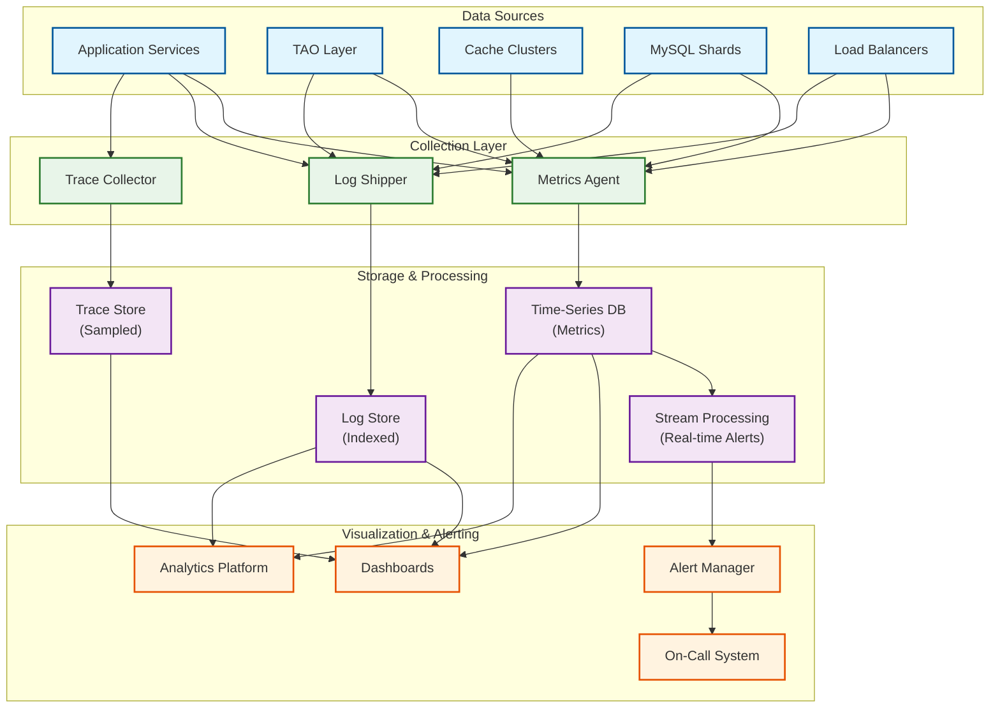

# Observability

[← Back to Index](./00-index.md)

---

## Observability Architecture



---

## Metrics

### Business Metrics

| Metric | Description | Target | Alert Threshold |
|--------|-------------|--------|-----------------|
| `dau` | Daily Active Users | 2B+ | <1.9B (5% drop) |
| `feed_loads_per_user` | Average feed refreshes per user | 10 | <8 (engagement drop) |
| `posts_created` | Posts created per minute | 555K | <400K |
| `likes_per_post` | Average likes per post | 50 | <30 (quality issue) |
| `time_spent` | Average session duration | 30 min | <20 min |
| `share_rate` | Posts shared / posts viewed | 2% | <1% |

### System Metrics (RED Method)

```
┌─────────────────────────────────────────────────────────────────────────┐
│                    RED METRICS BY SERVICE                               │
├─────────────────────────────────────────────────────────────────────────┤
│                                                                         │
│  FEED SERVICE                                                           │
│  ┌─────────────────────────────────────────────────────────────────┐   │
│  │ Rate:     feed_requests_total (per second)                      │   │
│  │ Errors:   feed_errors_total (by error_code)                     │   │
│  │ Duration: feed_latency_seconds (p50, p95, p99)                  │   │
│  │                                                                 │   │
│  │ Target:  700K QPS, <0.01% errors, <100ms p99                    │   │
│  └─────────────────────────────────────────────────────────────────┘   │
│                                                                         │
│  POST SERVICE                                                           │
│  ┌─────────────────────────────────────────────────────────────────┐   │
│  │ Rate:     post_creates_total, post_deletes_total                │   │
│  │ Errors:   post_errors_total (by type: validation, storage)      │   │
│  │ Duration: post_create_latency_seconds                           │   │
│  │                                                                 │   │
│  │ Target:  30K QPS writes, <0.001% errors, <500ms p99             │   │
│  └─────────────────────────────────────────────────────────────────┘   │
│                                                                         │
│  RANKING SERVICE                                                        │
│  ┌─────────────────────────────────────────────────────────────────┐   │
│  │ Rate:     ranking_requests_total                                │   │
│  │ Errors:   ranking_errors_total, ranking_fallbacks_total         │   │
│  │ Duration: ranking_latency_seconds, feature_extraction_seconds   │   │
│  │                                                                 │   │
│  │ Target:  700K QPS, <0.1% fallbacks, <50ms p99                   │   │
│  └─────────────────────────────────────────────────────────────────┘   │
│                                                                         │
│  GRAPH API                                                              │
│  ┌─────────────────────────────────────────────────────────────────┐   │
│  │ Rate:     graphapi_requests_total (by endpoint)                 │   │
│  │ Errors:   graphapi_errors_total (by status_code)                │   │
│  │ Duration: graphapi_latency_seconds                              │   │
│  │ Extra:    rate_limits_hit_total (by app_id)                     │   │
│  │                                                                 │   │
│  │ Target:  100K QPS, <0.1% errors, <200ms p99                     │   │
│  └─────────────────────────────────────────────────────────────────┘   │
│                                                                         │
└─────────────────────────────────────────────────────────────────────────┘
```

### TAO-Specific Metrics

| Metric | Description | Target | Critical |
|--------|-------------|--------|----------|
| `tao_cache_hit_ratio` | Cache hit rate (follower + leader) | >99% | <95% |
| `tao_follower_hit_ratio` | Follower cache hit rate | >85% | <70% |
| `tao_leader_hit_ratio` | Leader cache hit rate | >95% | <85% |
| `tao_mysql_qps` | Queries reaching MySQL | <5% of total | >10% |
| `tao_read_amplification` | Avg TAO reads per request | ~521 | >700 |
| `tao_invalidation_lag_ms` | Time to propagate invalidation | <1000ms | >5000ms |
| `tao_shard_imbalance` | Max/avg shard load ratio | <2x | >5x |

### Feed Quality Metrics

| Metric | Description | Purpose |
|--------|-------------|---------|
| `feed_diversity_score` | Content type variety | Prevent monotony |
| `feed_freshness_p50` | Median post age in feed | Ensure timeliness |
| `feed_engagement_rate` | Actions / impressions | Quality indicator |
| `feed_celebrity_pull_ratio` | Pull vs push content | Fan-out health |
| `ranking_model_latency` | ML inference time | Performance |
| `candidate_pool_size` | Avg candidates before ranking | Coverage |

### Infrastructure Metrics (USE Method)

```
┌─────────────────────────────────────────────────────────────────────────┐
│                    USE METRICS BY RESOURCE                              │
├─────────────────────────────────────────────────────────────────────────┤
│                                                                         │
│  CPU                                                                    │
│  • Utilization: cpu_usage_percent (by service)                         │
│  • Saturation: cpu_throttled_seconds_total                             │
│  • Errors: N/A                                                          │
│                                                                         │
│  MEMORY                                                                 │
│  • Utilization: memory_used_bytes / memory_total_bytes                 │
│  • Saturation: memory_oom_kills_total                                  │
│  • Errors: memory_allocation_failures_total                            │
│                                                                         │
│  NETWORK                                                                │
│  • Utilization: network_bytes_sent/received                            │
│  • Saturation: network_dropped_packets_total                           │
│  • Errors: network_errors_total                                        │
│                                                                         │
│  DISK (MySQL)                                                           │
│  • Utilization: disk_used_bytes, disk_io_percent                       │
│  • Saturation: disk_io_queue_depth                                     │
│  • Errors: disk_errors_total                                           │
│                                                                         │
│  CACHE (Memcached/TAO)                                                  │
│  • Utilization: cache_memory_used_bytes                                │
│  • Saturation: cache_evictions_total                                   │
│  • Errors: cache_connection_errors_total                               │
│                                                                         │
└─────────────────────────────────────────────────────────────────────────┘
```

---

## Logging

### Log Levels and Usage

| Level | Usage | Examples |
|-------|-------|----------|
| **ERROR** | Actionable failures | Database connection failed, Auth service unavailable |
| **WARN** | Potential issues | High latency, Rate limit approaching, Degraded mode |
| **INFO** | Significant events | Request completed, User logged in, Post created |
| **DEBUG** | Development details | Cache lookup result, Feature values, SQL query |

### Structured Log Format

```json
{
  "timestamp": "2024-01-01T12:00:00.123Z",
  "level": "INFO",
  "service": "feed-service",
  "instance": "feed-service-abc123",
  "trace_id": "4bf92f3577b34da6a3ce929d0e0e4736",
  "span_id": "00f067aa0ba902b7",
  "user_id": "[REDACTED:hash123]",
  "request_id": "req-456789",
  "event": "feed_generated",
  "duration_ms": 87,
  "metadata": {
    "candidate_count": 1423,
    "final_count": 200,
    "cache_hit": true,
    "ranking_model": "v3.2"
  }
}
```

### Privacy-Preserving Logging

```
LOGGING RULES:

PII Handling:
  • User IDs: Hash or tokenize (not plaintext)
  • IP Addresses: Log only region or hash
  • Content: Never log post/message content
  • Emails: Never log in application logs

Sensitive Data:
  • Passwords: Never logged (even hashed)
  • Tokens: Log only last 4 characters
  • Phone numbers: Masked (***-***-1234)

Exceptions:
  • Security audit logs: Full detail, restricted access
  • Legal holds: Preserved with encryption

Retention:
  • Application logs: 30 days
  • Security logs: 2 years
  • Aggregated metrics: Indefinite
```

### Critical Log Patterns

```
PATTERNS TO MONITOR:

1. Authentication Failures
   Pattern: level="ERROR" AND event="auth_failed"
   Alert: >100 failures per minute per user → Brute force

2. Rate Limit Hits
   Pattern: level="WARN" AND event="rate_limit_exceeded"
   Alert: >1000 per minute per app → Abuse or misconfiguration

3. Database Errors
   Pattern: level="ERROR" AND service="tao" AND error_type="mysql"
   Alert: Any occurrence → Potential outage

4. Ranking Fallbacks
   Pattern: level="WARN" AND event="ranking_fallback"
   Alert: >1% of requests → ML service degraded

5. Privacy Violations
   Pattern: level="ERROR" AND event="privacy_check_failed"
   Alert: Any occurrence → Security incident
```

---

## Distributed Tracing

### Trace Context Propagation

```
TRACE PROPAGATION FLOW:

Client Request
    │
    ├─[trace_id: abc123, span_id: 001]─→ API Gateway
    │                                        │
    │   ├─[trace_id: abc123, span_id: 002]─→ Feed Service
    │   │                                        │
    │   │   ├─[trace_id: abc123, span_id: 003]─→ TAO (get friends)
    │   │   │                                        │
    │   │   │   └─[trace_id: abc123, span_id: 004]─→ MySQL
    │   │   │
    │   │   ├─[trace_id: abc123, span_id: 005]─→ TAO (get posts)
    │   │   │
    │   │   ├─[trace_id: abc123, span_id: 006]─→ Feature Service
    │   │   │
    │   │   └─[trace_id: abc123, span_id: 007]─→ Ranking Service
    │   │                                            │
    │   │       └─[trace_id: abc123, span_id: 008]─→ ML Model
    │   │
    │   └── Response aggregated
    │
    └── Final response to client

SAMPLING STRATEGY:
  • 0.1% of all requests (baseline)
  • 100% of error requests
  • 100% of slow requests (>p99)
  • 10% of requests from flagged apps
```

### Key Spans to Instrument

| Span Name | Service | Critical Metrics |
|-----------|---------|-----------------|
| `feed.generate` | Feed Service | Total latency, cache hit |
| `feed.gather_candidates` | Feed Service | Candidate count, sources |
| `feed.rank` | Ranking Service | ML latency, fallback used |
| `tao.get_object` | TAO | Cache layer hit, shard |
| `tao.get_assoc_range` | TAO | Result count, time range |
| `mysql.query` | TAO Storage | Query latency, rows |
| `graphapi.handle` | Graph API | Endpoint, rate limit status |

### Trace Analysis Queries

```
COMMON TRACE QUERIES:

1. Slow Feed Requests
   SELECT traces
   WHERE service = "feed-service"
     AND duration > 200ms
     AND timestamp > now() - 1h
   ORDER BY duration DESC

2. TAO Cache Miss Investigation
   SELECT traces
   WHERE span.name = "tao.get_object"
     AND span.tags["cache_hit"] = false
     AND timestamp > now() - 1h
   GROUP BY span.tags["shard_id"]

3. Cross-Service Latency Breakdown
   SELECT
     span.name,
     percentile(duration, 0.99) as p99
   FROM traces
   WHERE trace_id IN (
     SELECT trace_id FROM traces
     WHERE service = "feed-service"
       AND duration > 100ms
   )
   GROUP BY span.name
```

---

## Alerting

### Alert Severity Levels

| Severity | Response Time | Examples | Notification |
|----------|---------------|----------|--------------|
| **P1 - Critical** | Immediate | Service down, data loss risk | Page on-call, exec notification |
| **P2 - High** | 15 minutes | Major degradation, >1% errors | Page on-call |
| **P3 - Medium** | 1 hour | Minor degradation, capacity warning | Slack notification |
| **P4 - Low** | Next business day | Trend anomaly, optimization needed | Ticket created |

### Critical Alerts (P1)

```yaml
# Feed Service Down
- alert: FeedServiceDown
  expr: sum(up{service="feed-service"}) < 50
  for: 1m
  severity: P1
  annotations:
    summary: "Feed service has insufficient healthy instances"
    runbook: "https://wiki/runbooks/feed-service-down"

# TAO Leader Unavailable
- alert: TAOLeaderUnavailable
  expr: tao_leader_healthy == 0
  for: 30s
  severity: P1
  annotations:
    summary: "TAO leader for shard {{ $labels.shard }} is down"
    runbook: "https://wiki/runbooks/tao-leader-failover"

# MySQL Shard Unreachable
- alert: MySQLShardUnreachable
  expr: mysql_up{shard=~".+"} == 0
  for: 30s
  severity: P1
  annotations:
    summary: "MySQL shard {{ $labels.shard }} is unreachable"

# Data Corruption Detected
- alert: DataCorruptionDetected
  expr: tao_integrity_check_failures > 0
  severity: P1
  annotations:
    summary: "Data integrity check failed"
    runbook: "https://wiki/runbooks/data-corruption"
```

### High Priority Alerts (P2)

```yaml
# High Error Rate
- alert: HighErrorRate
  expr: |
    sum(rate(http_requests_total{status=~"5.."}[5m]))
    /
    sum(rate(http_requests_total[5m])) > 0.01
  for: 5m
  severity: P2
  annotations:
    summary: "Error rate exceeds 1%"

# Feed Latency Degraded
- alert: FeedLatencyDegraded
  expr: histogram_quantile(0.99, rate(feed_latency_seconds_bucket[5m])) > 0.2
  for: 5m
  severity: P2
  annotations:
    summary: "Feed p99 latency exceeds 200ms"

# TAO Cache Hit Rate Low
- alert: TAOCacheHitRateLow
  expr: tao_cache_hit_ratio < 0.95
  for: 10m
  severity: P2
  annotations:
    summary: "TAO cache hit rate dropped below 95%"

# Ranking Service Fallback High
- alert: RankingFallbackHigh
  expr: rate(ranking_fallbacks_total[5m]) / rate(ranking_requests_total[5m]) > 0.05
  for: 5m
  severity: P2
  annotations:
    summary: "Ranking fallback rate exceeds 5%"
```

### Alert Routing

```
ROUTING RULES:

P1 Alerts:
  • PagerDuty → On-call engineer
  • Slack → #incidents-critical
  • Email → SRE team, Engineering managers
  • Auto-escalation after 5 minutes if unacknowledged

P2 Alerts:
  • PagerDuty → On-call engineer
  • Slack → #incidents
  • Auto-escalation after 15 minutes

P3 Alerts:
  • Slack → #alerts-medium
  • Create Jira ticket

P4 Alerts:
  • Slack → #alerts-low
  • Weekly digest email
```

---

## Dashboards

### Platform Overview Dashboard

```
┌─────────────────────────────────────────────────────────────────────────┐
│                    FACEBOOK PLATFORM OVERVIEW                           │
├─────────────────────────────────────────────────────────────────────────┤
│                                                                         │
│  ┌───────────────┐  ┌───────────────┐  ┌───────────────┐              │
│  │ DAU           │  │ Feed QPS      │  │ Error Rate    │              │
│  │ 2.01B         │  │ 687K          │  │ 0.003%        │              │
│  │ ▲ 0.5%        │  │ ▼ 2%          │  │ ✓ Normal      │              │
│  └───────────────┘  └───────────────┘  └───────────────┘              │
│                                                                         │
│  Feed Latency (p99)                 Posts Created/min                  │
│  ┌─────────────────────────────┐   ┌─────────────────────────────┐    │
│  │     100ms                   │   │     600K                    │    │
│  │  ┌─────────────────────┐   │   │  ┌─────────────────────┐   │    │
│  │  │   ~~~~~~~~~~~      │   │   │  │  ▄▄▄█████▄▄▄       │   │    │
│  │  │  87ms avg          │   │   │  │  555K avg           │   │    │
│  │  └─────────────────────┘   │   │  └─────────────────────┘   │    │
│  └─────────────────────────────┘   └─────────────────────────────┘    │
│                                                                         │
│  Regional Status                                                        │
│  ┌──────────────────────────────────────────────────────────────────┐ │
│  │ US-East  [████████████████████] 100% ✓                          │ │
│  │ US-West  [████████████████████] 100% ✓                          │ │
│  │ EU-West  [████████████████████] 100% ✓                          │ │
│  │ APAC     [██████████████████░░]  95% ⚠ (degraded)               │ │
│  └──────────────────────────────────────────────────────────────────┘ │
│                                                                         │
└─────────────────────────────────────────────────────────────────────────┘
```

### TAO Health Dashboard

| Panel | Metrics | Purpose |
|-------|---------|---------|
| Cache Hit Rates | Follower, Leader by region | Cache efficiency |
| MySQL Load | QPS by shard, latency | Database health |
| Invalidation Lag | p50, p99 by region | Consistency monitoring |
| Shard Distribution | Objects per shard | Hotspot detection |
| Replication Status | Lag by region | Cross-region health |

### Feed Health Dashboard

| Panel | Metrics | Purpose |
|-------|---------|---------|
| Feed Latency | p50, p95, p99 over time | Performance |
| Candidate Pool | Avg size, sources breakdown | Coverage |
| Ranking Health | ML latency, fallback rate | Model performance |
| Cache Efficiency | Hit rate, warm rate | Optimization |
| Quality Scores | Engagement, diversity | User experience |

---

## Social Graph Health Monitoring

### Graph Connectivity Metrics

```
GRAPH HEALTH INDICATORS:

1. Connectivity Ratio
   Definition: Users with >0 friends / Total users
   Target: >99%
   Alert: <95% (suggests onboarding issue)

2. Average Clustering Coefficient
   Definition: Probability that two friends of a user are friends
   Normal Range: 0.15-0.25
   Alert: Sudden change >10%

3. Orphan Objects
   Definition: Objects with no associations
   Target: <0.01% of posts
   Alert: >0.1% (suggests creation bug)

4. Broken Associations
   Definition: Associations pointing to deleted objects
   Target: 0
   Alert: Any occurrence (cleanup job needed)

5. Shard Connectivity
   Definition: Cross-shard association ratio
   Optimal: <10% cross-shard
   Alert: >20% (suggests poor sharding)
```

### Anomaly Detection

```
ANOMALIES TO DETECT:

1. Sudden Friend Count Changes
   • User loses >50 friends in 1 hour
   • Could indicate: Account compromise, mass unfriending

2. Unusual Posting Patterns
   • User posts >100 times in 1 hour
   • Could indicate: Bot activity, spam

3. Graph Structure Anomalies
   • Cluster of new accounts all friending same users
   • Could indicate: Coordinated inauthentic behavior

4. Association Imbalance
   • User with 5000 friends but 0 posts
   • Could indicate: Fake account

DETECTION APPROACH:
   • ML models trained on historical patterns
   • Real-time streaming analysis
   • Human review for flagged accounts
```

---

*Next: [Interview Guide →](./08-interview-guide.md)*
