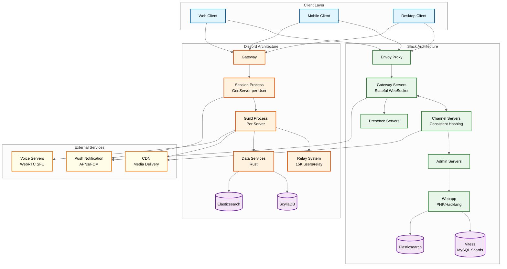

# Slack/Discord System Design

## Overview

**Slack** and **Discord** are channel-based real-time communication platforms that revolutionized team collaboration and community building. While both share core messaging primitives, they serve distinct markets: Slack targets enterprise collaboration with compliance, threading, and integrations, while Discord focuses on gaming communities with voice channels, large guilds, and real-time presence.

This documentation covers the architectural patterns behind both platforms, enabling you to design systems that handle millions of concurrent WebSocket connections, real-time message fanout to large channels, presence tracking, and threaded conversations.

---

## System Characteristics

| Characteristic | Slack | Discord |
|----------------|-------|---------|
| **Primary Focus** | Enterprise collaboration | Gaming/community |
| **Scale** | 5M+ concurrent WebSockets | 12M+ concurrent users |
| **Message Throughput** | Billions/day | 26M WebSocket events/sec |
| **Max Channel/Guild Size** | Unlimited (enterprise) | 15M+ users single guild |
| **Threading Model** | First-class (single-level) | Basic replies |
| **Voice Support** | Huddles (limited) | Core feature (WebRTC + SFU) |
| **Backend Stack** | Java + PHP (Webapp) | Elixir/BEAM + Rust |
| **Database** | Vitess (MySQL sharding) | ScyllaDB |
| **Connection Model** | Stateful Gateway Servers | Session processes (GenServer) |

---

## Complexity Rating

| Component | Complexity | Notes |
|-----------|------------|-------|
| Real-Time Message Fanout | Very High | Large channels require hierarchical fanout |
| Presence System | High | Millions of status updates, eventual consistency |
| Threading Model | High (Slack) / Medium (Discord) | Slack's thread notifications are complex |
| Voice Channels | Very High (Discord) | WebRTC, SFU, codec optimization |
| Enterprise Compliance | Very High (Slack) | EKM, DLP, eDiscovery, audit logs |
| Search at Scale | High | Full-text across billions of messages |
| Multi-Region | High | Global WebSocket routing, data residency |

---

## Architecture Overview

---

## Core Modules

| Module | Purpose | Key Technology |
|--------|---------|----------------|
| **Gateway/Session Layer** | WebSocket management, connection state | Slack: Java Gateway Servers, Discord: Elixir GenServer |
| **Channel/Guild Router** | Message routing to correct server | Consistent hashing, process-per-guild |
| **Presence Service** | Online/idle/DnD tracking | In-memory with heartbeats |
| **Message Store** | Durable message persistence | Vitess (Slack), ScyllaDB (Discord) |
| **Search Service** | Full-text message search | Elasticsearch |
| **Fanout Engine** | Deliver messages to channel members | Push to online, queue for offline |
| **Thread Manager** | Parent-child message relationships | Slack: first-class, Discord: reply_to |
| **Voice Engine** | Real-time audio/video | Discord: WebRTC + SFU |
| **Notification Service** | Push notifications for offline users | APNs, FCM |
| **Integration Platform** | Bots, webhooks, slash commands | OAuth, event subscriptions |

---

## Quick Navigation

| Document | Description |
|----------|-------------|
| [01 - Requirements & Estimations](./01-requirements-and-estimations.md) | Functional/non-functional requirements, capacity planning |
| [02 - High-Level Design](./02-high-level-design.md) | Architecture diagrams, data flow, key decisions |
| [03 - Low-Level Design](./03-low-level-design.md) | Data models, API design, algorithms |
| [04 - Deep Dive & Bottlenecks](./04-deep-dive-and-bottlenecks.md) | Fanout, presence, threading, voice deep dives |
| [05 - Scalability & Reliability](./05-scalability-and-reliability.md) | Scaling strategies, fault tolerance, DR |
| [06 - Security & Compliance](./06-security-and-compliance.md) | Auth, encryption, enterprise compliance |
| [07 - Observability](./07-observability.md) | Metrics, logging, tracing, alerting |
| [08 - Interview Guide](./08-interview-guide.md) | Pacing, trap questions, trade-offs |

---

## Key Trade-offs: Slack vs Discord

| Decision | Slack Approach | Discord Approach | Trade-off |
|----------|----------------|------------------|-----------|
| **Message Storage** | Server-accessible (search, compliance) | Server-accessible | Both avoid E2EE for enterprise/moderation features |
| **Backend Language** | Java (Channel/Gateway Servers) | Elixir/BEAM + Rust | JVM maturity vs BEAM concurrency |
| **Database** | Vitess (MySQL sharding) | ScyllaDB | SQL familiarity vs NoSQL scale |
| **Large Channel Handling** | Channel Servers with consistent hashing | Guild + Relay hierarchy | Simpler model vs explicit partitioning |
| **Threading** | First-class single-level threads | Basic reply_to field | Rich UX vs simplicity |
| **Voice** | Huddles (add-on) | Core feature (SFU) | Focus on text vs voice-first |
| **Presence Model** | Eventual consistency, 10-min idle | 5-min idle, invisible mode | Aggressive status vs privacy |

---

## Interview Focus Areas

1. **Real-Time Fanout**: How do you deliver a message to 100K+ channel members in <500ms?
2. **Presence at Scale**: How do you track online status for millions without overwhelming the system?
3. **Threading UX**: How does Slack's thread model differ from simple reply-to?
4. **Database Choice**: Why did Discord migrate from Cassandra to ScyllaDB?
5. **Hot Partition Problem**: How do you handle "celebrity" channels with disproportionate traffic?
6. **Voice Architecture**: How does Discord handle 2.5M+ concurrent voice users?

---

## References

- [Slack Engineering - Real-time Messaging](https://slack.engineering/real-time-messaging/)
- [Slack Engineering - Scaling Datastores with Vitess](https://slack.engineering/scaling-datastores-at-slack-with-vitess/)
- [Discord - How Discord Stores Trillions of Messages](https://discord.com/blog/how-discord-stores-trillions-of-messages)
- [Discord - How Discord Scaled Elixir to 5M Concurrent Users](https://discord.com/blog/how-discord-scaled-elixir-to-5-000-000-concurrent-users)
- [Slack Design - Threads Design Journey](https://slack.design/articles/threads-in-slack-a-long-design-journey-part-1-of-2/)
- [ByteByteGo - How Discord Serves 15M Users on One Server](https://blog.bytebytego.com/p/how-discord-serves-15-million-users)
