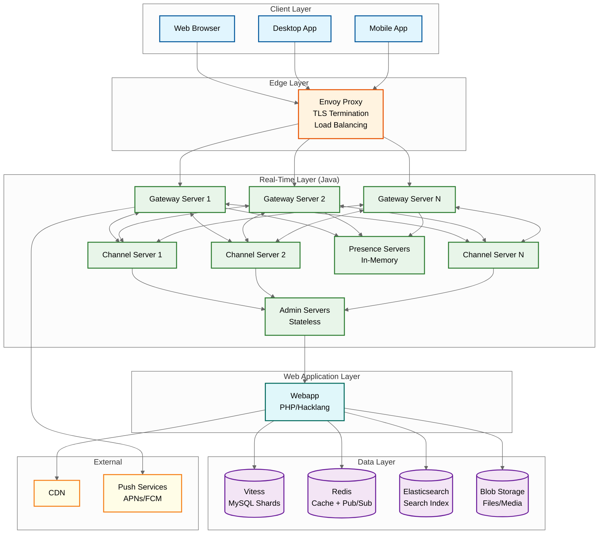
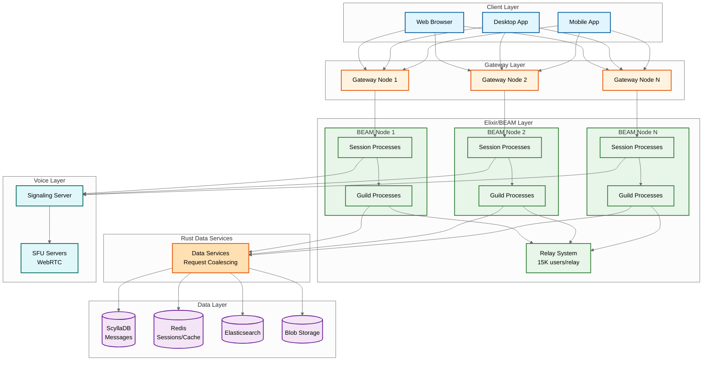
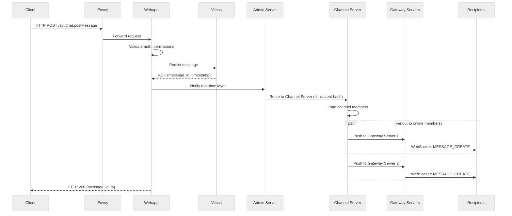
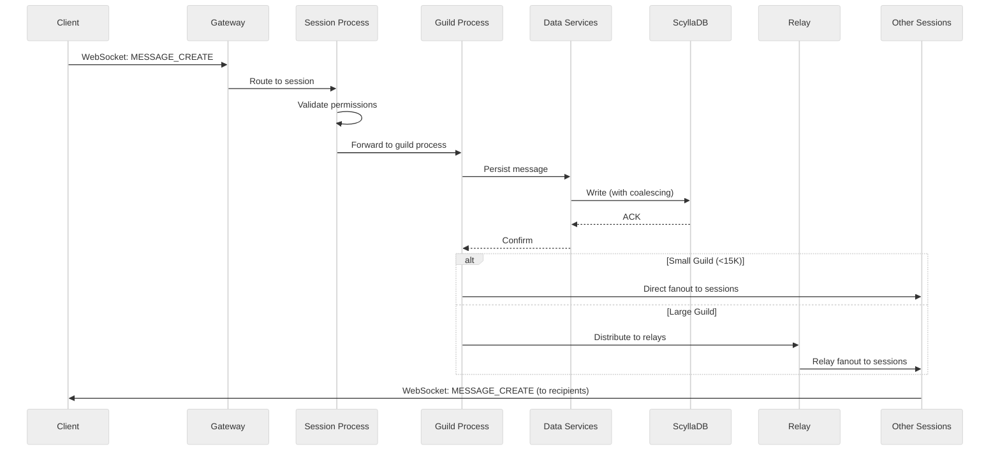
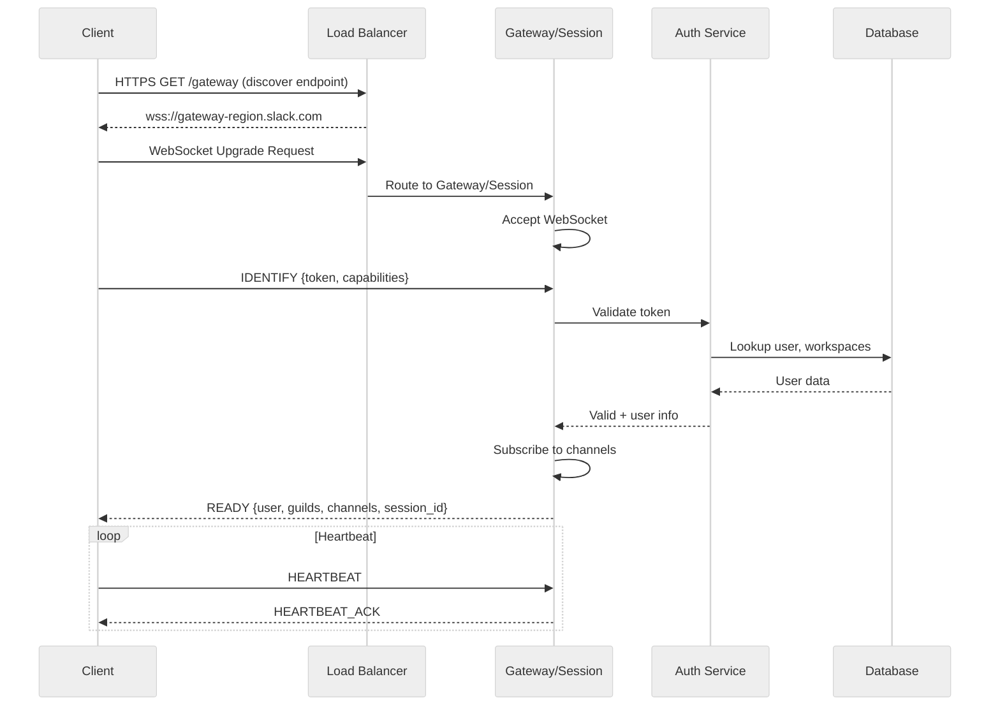
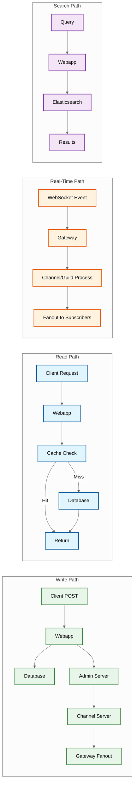

# High-Level Design

## System Architecture

### Slack Architecture

Slack's architecture is built around four core Java services that handle real-time communication:

**Key Components:**

| Component | Type | Purpose |
|-----------|------|---------|
| **Gateway Servers** | Stateful, in-memory | Hold WebSocket connections, route to Channel Servers |
| **Channel Servers** | Stateful, in-memory | Host channel state, fan out messages using consistent hashing |
| **Admin Servers** | Stateless | Interface between Webapp and real-time layer |
| **Presence Servers** | In-memory | Track online status, users hashed to specific servers |
| **Webapp** | PHP/Hacklang | REST APIs, business logic, database access |

---

### Discord Architecture

Discord uses Elixir/BEAM for its real-time layer, with Rust for performance-critical paths:

**Key Components:**

| Component | Type | Purpose |
|-----------|------|---------|
| **Session Process** | Elixir GenServer | One per WebSocket connection, holds user state |
| **Guild Process** | Elixir GenServer | One per guild, central routing for all guild events |
| **Relay System** | Elixir | Partition large guilds (15K users per relay) |
| **Data Services** | Rust | Request coalescing, hot partition mitigation |
| **SFU Servers** | WebRTC | Selective Forwarding Unit for voice |

---

## Data Flow

### Message Send Flow (Slack)

**Key Design Decision**: Slack uses HTTP POST (not WebSocket) for sending messages. This provides:
- Crash safety: Client has evidence of send attempt
- Mobile-friendly: Works with background fetch
- Clear success/failure semantics

---

### Message Send Flow (Discord)

---

### WebSocket Connection Establishment

---

## Key Architectural Decisions

### Decision 1: Stateful Gateway Servers

| Option | Pros | Cons |
|--------|------|------|
| **Stateful (Slack/Discord)** | Low latency, efficient fanout, connection affinity | Complex failover, memory pressure |
| **Stateless** | Easy scaling, simple deployment | Requires external state store, higher latency |

**Recommendation**: Stateful gateways with graceful failover. State includes:
- WebSocket connection
- Channel/guild subscriptions
- Pending message queue
- Heartbeat timers

---

### Decision 2: Message Persistence Strategy

| Option | Pros | Cons |
|--------|------|------|
| **Write-through (Slack)** | Strong durability, clear success semantics | Higher latency on send |
| **Write-behind** | Lower latency | Risk of message loss on crash |

**Slack's Approach**: HTTP POST writes to database first, then notifies real-time layer. This ensures:
- Message is durable before client gets ACK
- Clear failure notification on database issues
- Decouples persistence from fanout

---

### Decision 3: Channel/Guild Routing

| Option | Slack | Discord |
|--------|-------|---------|
| **Strategy** | Consistent hashing to Channel Servers | Process-per-guild on BEAM |
| **Pros** | Predictable routing, good load distribution | Natural isolation, fault tolerance |
| **Cons** | Rebalancing on scale changes | Guild process can become bottleneck |
| **Large Scale** | Hash ring expansion | Relay system partitions users |

---

### Decision 4: Database Choice

| Aspect | Slack (Vitess/MySQL) | Discord (ScyllaDB) |
|--------|---------------------|-------------------|
| **Query Model** | SQL (familiar, flexible) | CQL (Cassandra-compatible) |
| **Sharding** | Automatic via Vitess | Native partitioning |
| **Consistency** | Configurable (eventual by default) | Tunable per-query |
| **Operations** | Complex (but mature tooling) | Simpler (C++, no GC pauses) |
| **Migration** | Vitess handles resharding | Discord built custom Rust tooling |

**Discord's Migration Story**: Moved from 177 Cassandra nodes to 72 ScyllaDB nodes with:
- 15ms p99 read latency (vs 40-125ms)
- 5ms p99 write latency (vs 5-70ms)
- No garbage collection pauses

---

### Decision 5: Thread vs Reply Model

| Aspect | Slack (Threads) | Discord (Replies) |
|--------|-----------------|-------------------|
| **Structure** | Single-level parent-child | Simple reply_to reference |
| **Visibility** | Threads hidden from channel by default | Replies inline in channel |
| **Notifications** | Thread participants notified separately | @mention required |
| **UX Complexity** | High (thread sidebar, "Also send to channel") | Low (just a reference) |
| **Use Case** | Detailed discussions, enterprise workflows | Quick responses, casual chat |

---

## Architecture Pattern Checklist

| Pattern | Decision | Rationale |
|---------|----------|-----------|
| **Sync vs Async** | Async (WebSocket push) | Real-time requirement |
| **Event-driven vs Request-response** | Event-driven for real-time, REST for mutations | Best of both |
| **Push vs Pull** | Push for online, pull for history | Optimize for common case |
| **Stateless vs Stateful** | Stateful gateways | Connection affinity |
| **Read-heavy vs Write-heavy** | Write-heavy (messages), Read-heavy (search) | Optimize separately |
| **Real-time vs Batch** | Real-time messaging, batch for search indexing | Different latency needs |
| **Edge vs Origin** | Edge for gateway routing, origin for data | Latency optimization |

---

## Component Interactions

