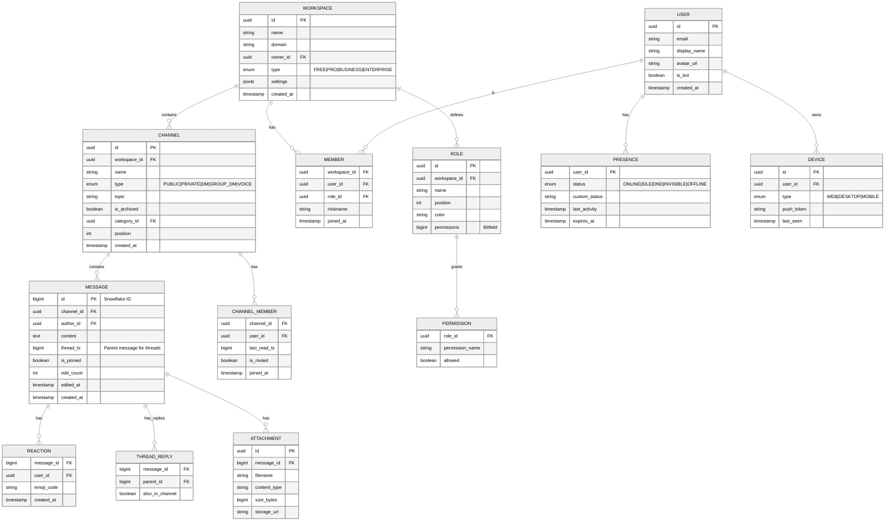
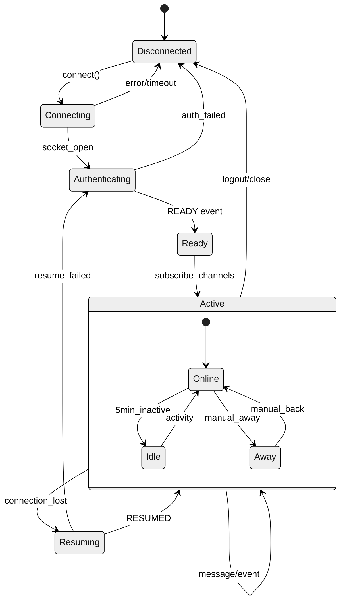

# Low-Level Design

## Data Models

### Core Entities



---

### Message Schema (Detailed)

```
Message {
    // Identity
    id: Snowflake                    // 64-bit: timestamp(42) + worker(5) + dc(5) + seq(12)
    channel_id: UUID
    workspace_id: UUID               // Denormalized for sharding

    // Content
    author_id: UUID
    content: String                  // Max 4000 chars (Slack), 2000 (Discord)
    content_type: Enum               // TEXT, SYSTEM, BOT_COMMAND

    // Threading (Slack)
    thread_ts: Timestamp             // Parent message timestamp (null if not reply)
    reply_count: Integer             // Cached count for display
    reply_users: [UUID]              // Participants in thread (limit 50)
    last_reply_at: Timestamp

    // Threading (Discord)
    reply_to: MessageId              // Simple reference to parent
    mentions: [UUID]                 // Extracted @mentions

    // Attachments
    attachments: [Attachment]
    embeds: [Embed]                  // Link previews, rich content

    // Reactions
    reactions: [{
        emoji: String,
        count: Integer,
        users: [UUID]                // First N users for display
    }]

    // Metadata
    edited_at: Timestamp
    is_pinned: Boolean
    flags: Bitfield                  // Deleted, crossposted, urgent, etc.

    // Timestamps
    created_at: Timestamp
}
```

---

### Presence Schema

```
Presence {
    user_id: UUID (PK)

    // Status
    status: Enum                     // ONLINE, IDLE, DND, INVISIBLE, OFFLINE
    custom_status: {
        text: String,                // "In a meeting"
        emoji: String,               // :calendar:
        expires_at: Timestamp
    }

    // Activity (Discord)
    activities: [{
        type: Enum,                  // PLAYING, STREAMING, LISTENING, WATCHING
        name: String,                // "Valorant"
        details: String,
        state: String,
        timestamps: {start, end}
    }]

    // Connection State
    devices: [{
        device_id: UUID,
        type: Enum,                  // WEB, DESKTOP, MOBILE
        last_heartbeat: Timestamp
    }]

    // Aggregated
    last_activity: Timestamp
    is_mobile: Boolean               // True if only mobile connected
}
```

---

### Thread Schema (Slack-specific)

```
Thread {
    thread_ts: Timestamp (PK)        // Same as parent message timestamp
    channel_id: UUID
    workspace_id: UUID

    // Parent
    parent_message_id: MessageId

    // Stats
    reply_count: Integer
    participant_count: Integer
    participants: [UUID]             // Users who replied

    // Activity
    last_reply_at: Timestamp
    last_read: Map<UserId, Timestamp>

    // Subscriptions
    subscribers: [UUID]              // Users following the thread
}
```

---

## Sharding Strategy

### Slack (Vitess)

**Shard Key**: `channel_id`

```
Shard Distribution:
├── Shard 0: channels 0x0000... - 0x0FFF...
├── Shard 1: channels 0x1000... - 0x1FFF...
├── ...
└── Shard N: channels 0xF000... - 0xFFFF...

Query Patterns:
- GET messages by channel: Single shard (efficient)
- GET messages by user: Cross-shard (scatter-gather)
- Search: Elasticsearch (separate index)
```

**Why channel_id?**
- Messages are accessed by channel 99% of the time
- Avoids hot partitions from popular users
- Thread queries stay on same shard

### Discord (ScyllaDB)

**Partition Key**: `(channel_id, bucket)`

```
Bucket Strategy:
- Bucket = message_id / 10_000_000 (time-based bucketing)
- Prevents unbounded partition growth

Clustering Key: message_id (descending for recent-first)

Table Definition:
CREATE TABLE messages (
    channel_id UUID,
    bucket BIGINT,
    message_id BIGINT,
    author_id UUID,
    content TEXT,
    -- ... other fields
    PRIMARY KEY ((channel_id, bucket), message_id)
) WITH CLUSTERING ORDER BY (message_id DESC);
```

---

## API Design

### WebSocket Events

#### Client → Server

| Event | Payload | Description |
|-------|---------|-------------|
| `IDENTIFY` | `{token, properties, capabilities}` | Authenticate connection |
| `HEARTBEAT` | `{sequence}` | Keep connection alive |
| `RESUME` | `{token, session_id, sequence}` | Reconnect with state |
| `TYPING_START` | `{channel_id}` | User started typing |
| `PRESENCE_UPDATE` | `{status, custom_status}` | Update own presence |
| `VOICE_STATE_UPDATE` | `{channel_id, self_mute, self_deaf}` | Join/leave voice |

#### Server → Client

| Event | Payload | Description |
|-------|---------|-------------|
| `READY` | `{user, workspaces, session_id}` | Initial state after auth |
| `MESSAGE_CREATE` | `{message}` | New message in subscribed channel |
| `MESSAGE_UPDATE` | `{message}` | Message edited |
| `MESSAGE_DELETE` | `{channel_id, message_id}` | Message deleted |
| `TYPING_START` | `{channel_id, user_id, timestamp}` | Someone typing |
| `PRESENCE_UPDATE` | `{user_id, status, activities}` | User status changed |
| `CHANNEL_UPDATE` | `{channel}` | Channel settings changed |
| `MEMBER_UPDATE` | `{user_id, roles, nickname}` | Member roles changed |

---

### REST API Endpoints

#### Messages

```
POST /api/channels/{channel_id}/messages
Request:
{
    "content": "Hello world!",
    "thread_ts": "1234567890.123456",    // Optional: reply to thread
    "attachments": [...],
    "reply_to": "message_id"              // Discord style
}
Response: 201 Created
{
    "id": "1234567890123456789",
    "channel_id": "...",
    "author": {...},
    "content": "Hello world!",
    "timestamp": "2024-01-15T10:30:00Z"
}

GET /api/channels/{channel_id}/messages
Query: ?limit=50&before=message_id&after=message_id
Response: 200 OK
{
    "messages": [...],
    "has_more": true
}

PATCH /api/channels/{channel_id}/messages/{message_id}
Request: {"content": "Updated content"}
Response: 200 OK {...}

DELETE /api/channels/{channel_id}/messages/{message_id}
Response: 204 No Content
```

#### Threads (Slack)

```
GET /api/channels/{channel_id}/threads/{thread_ts}/replies
Query: ?limit=50&cursor=xxx
Response:
{
    "messages": [...],
    "has_more": true,
    "response_metadata": {"next_cursor": "..."}
}

POST /api/channels/{channel_id}/threads/{thread_ts}/replies
Request:
{
    "content": "Thread reply",
    "broadcast": true    // Also send to channel
}
```

#### Presence

```
PUT /api/users/@me/presence
Request:
{
    "status": "dnd",
    "custom_status": {
        "text": "In a meeting",
        "emoji": ":calendar:",
        "expiration": "2024-01-15T12:00:00Z"
    }
}
```

---

### Idempotency

```
POST /api/channels/{channel_id}/messages
Headers:
    Idempotency-Key: "unique-client-generated-uuid"
    X-Retry-Count: 0

Server Behavior:
1. Hash(idempotency_key) → Check Redis cache (TTL: 24h)
2. If exists: Return cached response
3. If not: Process request, cache response, return

Retry Logic:
- Client generates unique key per logical operation
- Retries use same key
- Server deduplicates within 24-hour window
```

---

## Core Algorithms

### Message Fanout Algorithm

```
ALGORITHM: Fanout_Message_To_Channel

INPUT: channel_id, message
OUTPUT: delivery_count

CONSTANTS:
    BATCH_SIZE = 1000
    ONLINE_PRIORITY = TRUE

PROCEDURE:
    // 1. Get channel members
    members = Get_Channel_Members(channel_id)
    online_members = []
    offline_members = []

    // 2. Partition by online status
    FOR member IN members:
        IF Is_Online(member):
            online_members.append(member)
        ELSE:
            offline_members.append(member)

    // 3. Priority: Online users first
    delivery_count = 0

    // 4. Batch delivery to online users
    FOR batch IN Chunk(online_members, BATCH_SIZE):
        gateway_groups = Group_By_Gateway(batch)

        FOR gateway, users IN gateway_groups:
            Push_To_Gateway(gateway, message, users)
            delivery_count += len(users)

    // 5. Queue notifications for offline users
    FOR member IN offline_members:
        IF Should_Notify(member, channel_id):
            Queue_Push_Notification(member, message)

    RETURN delivery_count
```

---

### Presence Aggregation Algorithm

```
ALGORITHM: Aggregate_User_Presence

INPUT: user_id
OUTPUT: aggregated_status

PROCEDURE:
    devices = Get_User_Devices(user_id)

    IF devices.is_empty():
        RETURN OFFLINE

    // Check for manual status override
    manual_status = Get_Manual_Status(user_id)
    IF manual_status == DND:
        RETURN DND
    IF manual_status == INVISIBLE:
        RETURN INVISIBLE

    // Aggregate across devices
    any_active = FALSE
    all_idle = TRUE
    is_mobile_only = TRUE

    FOR device IN devices:
        IF device.last_heartbeat > NOW - 30 seconds:
            any_active = TRUE

            IF device.last_activity > NOW - 5 minutes:
                all_idle = FALSE

            IF device.type != MOBILE:
                is_mobile_only = FALSE

    IF NOT any_active:
        RETURN OFFLINE

    IF all_idle:
        RETURN IDLE

    status = ONLINE
    status.is_mobile = is_mobile_only

    RETURN status
```

---

### Thread Reply Routing (Slack)

```
ALGORITHM: Route_Thread_Reply

INPUT: message, thread_ts, broadcast_to_channel
OUTPUT: notification_list

PROCEDURE:
    thread = Get_Thread(thread_ts)
    channel = Get_Channel(thread.channel_id)
    notifications = []

    // 1. Always notify thread subscribers
    FOR subscriber IN thread.subscribers:
        IF subscriber != message.author_id:
            notifications.append({
                user: subscriber,
                type: THREAD_REPLY,
                show_in: THREADS_VIEW
            })

    // 2. Notify @mentioned users
    mentioned_users = Extract_Mentions(message.content)
    FOR user IN mentioned_users:
        notifications.append({
            user: user,
            type: MENTION,
            show_in: MENTIONS_VIEW
        })

    // 3. If broadcast, also show in channel
    IF broadcast_to_channel:
        FOR member IN channel.members:
            IF member NOT IN thread.subscribers:
                // Show as thread preview in channel
                notifications.append({
                    user: member,
                    type: CHANNEL_MESSAGE,
                    show_in: CHANNEL_VIEW,
                    is_thread_preview: TRUE
                })

    // 4. Auto-subscribe author to thread
    Add_Thread_Subscriber(thread_ts, message.author_id)

    RETURN notifications
```

---

### Typing Indicator Debouncing

```
ALGORITHM: Typing_Indicator_Handler

INPUT: user_id, channel_id
STATE: typing_state = Map<(user_id, channel_id), last_sent_ts>

CONSTANTS:
    DEBOUNCE_INTERVAL = 3 seconds
    TYPING_TIMEOUT = 8 seconds

PROCEDURE On_Key_Press:
    key = (user_id, channel_id)
    now = Current_Timestamp()

    last_sent = typing_state.get(key, 0)

    IF now - last_sent > DEBOUNCE_INTERVAL:
        // Send typing event
        Broadcast_To_Channel(channel_id, {
            type: TYPING_START,
            user_id: user_id,
            timestamp: now
        })

        typing_state[key] = now

PROCEDURE Client_Display:
    // Client-side: show "User is typing..." for TYPING_TIMEOUT
    // Remove indicator if no new event within timeout
    // Multiple users: "User1, User2 are typing..."
    // Many users: "Several people are typing..."
```

---

### Consistent Hashing for Channel Servers (Slack)

```
ALGORITHM: Route_To_Channel_Server

INPUT: channel_id
OUTPUT: channel_server_address

STATE:
    hash_ring = Sorted list of (hash_value, server_address)
    VIRTUAL_NODES_PER_SERVER = 150

PROCEDURE Initialize_Ring(servers):
    FOR server IN servers:
        FOR i IN 0..VIRTUAL_NODES_PER_SERVER:
            hash_value = Hash(server.id + ":" + i)
            hash_ring.insert((hash_value, server.address))
    hash_ring.sort_by_key()

PROCEDURE Find_Server(channel_id):
    channel_hash = Hash(channel_id)

    // Binary search for first node >= channel_hash
    index = Binary_Search(hash_ring, channel_hash)

    IF index >= len(hash_ring):
        index = 0  // Wrap around

    RETURN hash_ring[index].server_address

PROCEDURE Handle_Server_Failure(failed_server):
    // Remove virtual nodes
    hash_ring.remove_all(server == failed_server)

    // Channels automatically route to next server in ring
    // Clients reconnect and re-subscribe
```

---

## Indexing Strategy

### Primary Indexes

| Table | Index | Purpose |
|-------|-------|---------|
| `messages` | `(channel_id, message_id) DESC` | Fetch recent messages |
| `messages` | `(channel_id, thread_ts, message_id)` | Thread replies |
| `messages` | `(workspace_id, author_id, created_at)` | User's messages |
| `channel_members` | `(channel_id, user_id)` | Membership check |
| `channel_members` | `(user_id, channel_id)` | User's channels |
| `presence` | `(user_id)` | Lookup by user |

### Secondary Indexes (Elasticsearch)

```
Index: messages_{workspace_id}

Mapping:
{
    "channel_id": {"type": "keyword"},
    "author_id": {"type": "keyword"},
    "content": {
        "type": "text",
        "analyzer": "standard"
    },
    "mentions": {"type": "keyword"},
    "has_attachment": {"type": "boolean"},
    "created_at": {"type": "date"}
}

Query Optimizations:
- Shard by workspace_id
- Routing key = channel_id (for channel-scoped searches)
- Index only last 90 days (archive older)
```

---

## Connection State Machine


