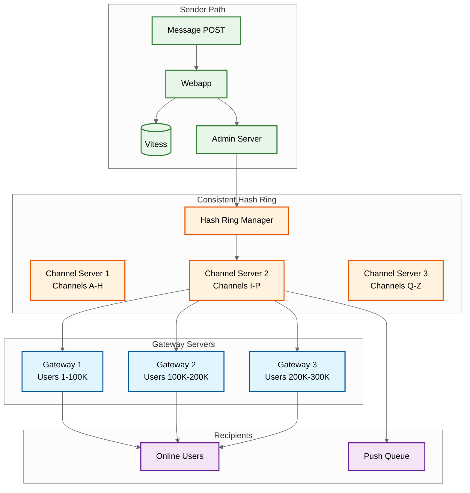
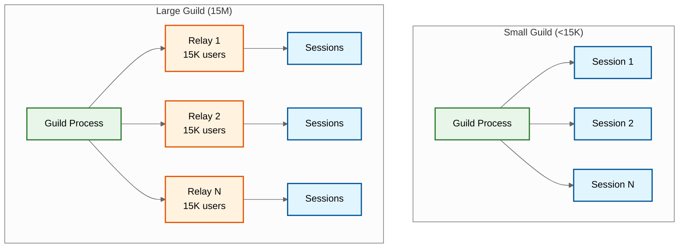
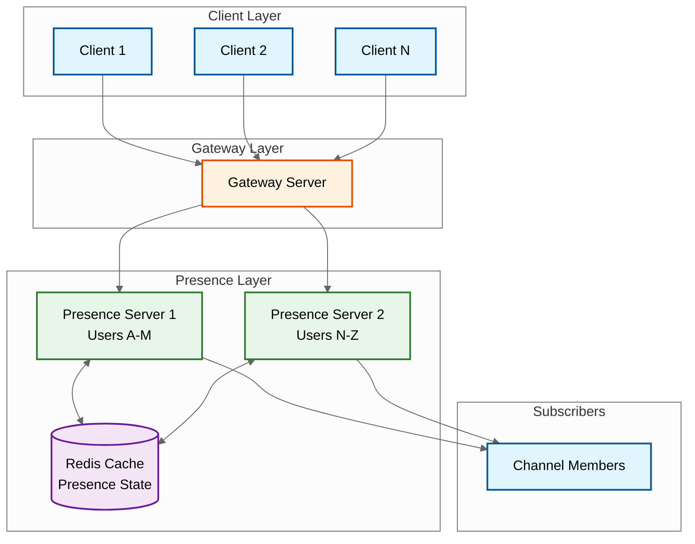
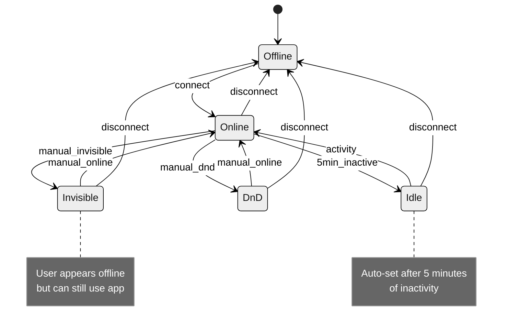
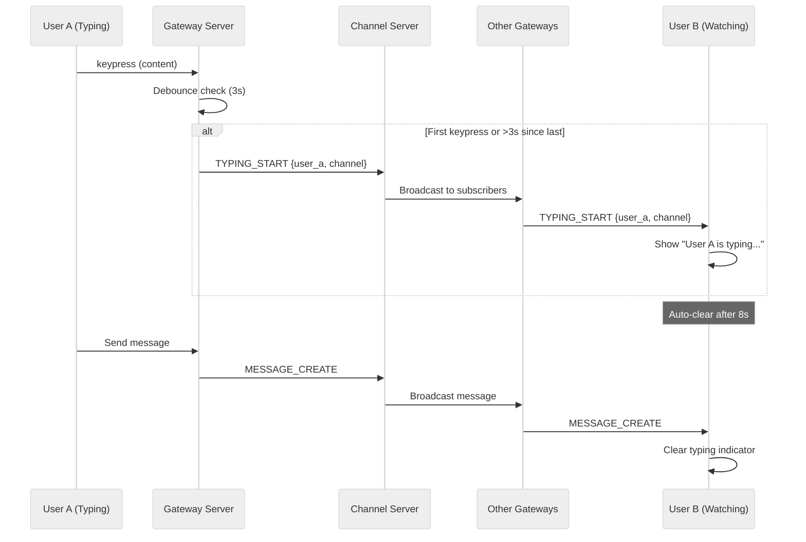
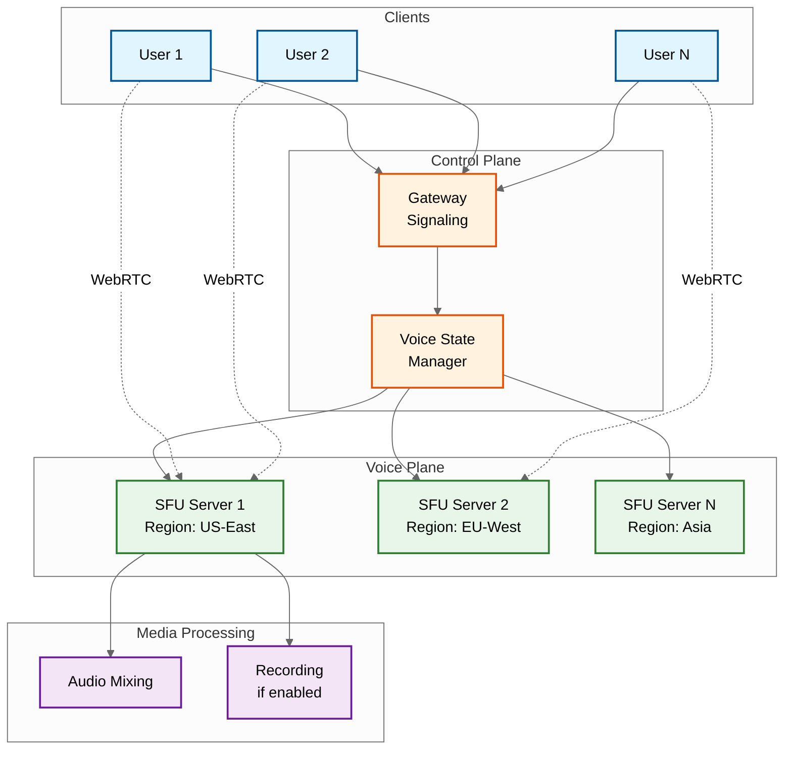
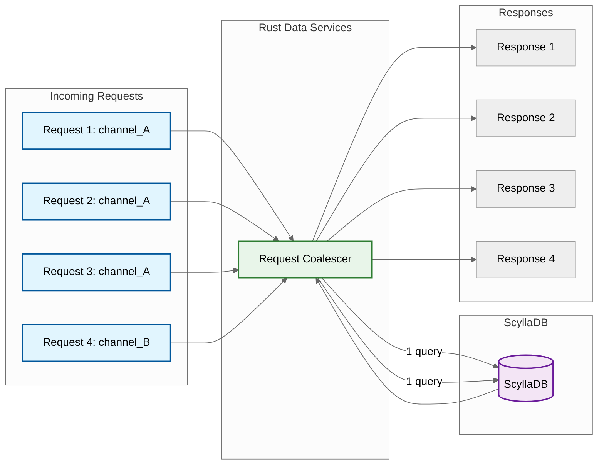

# Deep Dive & Bottleneck Analysis

## Critical Component 1: Real-Time Message Fanout

### Why Critical

Message fanout is the core operation that defines messaging platform latency. A message sent to a channel with 100K members must be delivered to all online users within 500ms while handling:
- Millions of concurrent connections
- Uneven channel sizes (1 user to 15M users)
- Geographic distribution
- Variable online rates

### Slack's Channel Server Approach



**How It Works:**

1. **Consistent Hashing**: Channel ID hashes to specific Channel Server
2. **Channel Server State**: Maintains in-memory list of subscribed Gateway Servers
3. **Parallel Push**: Sends message to all Gateway Servers in parallel
4. **Gateway Fanout**: Each Gateway pushes to its connected users

**Key Optimizations:**
- Virtual nodes (150 per server) for even distribution
- Batch messages to same Gateway Server
- Compress messages before network hop

---

### Discord's Guild/Relay Approach



**How It Works:**

1. **Process Per Guild**: Each Discord server has one Elixir GenServer
2. **Direct Fanout (Small)**: Guild process sends directly to session processes
3. **Relay Hierarchy (Large)**: For guilds >15K, relays partition the user base
4. **Permission Checking**: Each relay validates permissions before forwarding

**Key Innovation: Relay System**
- Each relay manages up to 15,000 users
- Relays exist on different BEAM nodes for fault isolation
- 15M user guild = 1,000 relays

---

### Fanout Performance Comparison

| Metric | Slack | Discord |
|--------|-------|---------|
| **Small Channel (50 users)** | Direct push via Channel Server | Direct push via Guild Process |
| **Large Channel (100K users)** | Batch to Gateway Servers | Relay partitioning |
| **Extreme (15M users)** | N/A (different model) | 1,000 relays × 15K each |
| **Latency Target** | <500ms | <100ms |
| **Bottleneck** | Channel Server memory | Guild Process throughput |

---

### Failure Modes

| Failure | Impact | Mitigation |
|---------|--------|------------|
| **Channel Server crash** | Messages to those channels delayed | Consistent hashing redirects to next node; clients reconnect |
| **Guild Process crash** | Guild events lost during restart | Supervisor restarts process; clients resync via REST |
| **Gateway Server crash** | Users lose connection | Clients reconnect to different gateway; resume via session_id |
| **Relay crash** | Subset of large guild affected | Supervisor restarts; relay rebuilds member list |
| **Network partition** | Split-brain fanout | Conflict resolution on reconnect; dedup via message_id |

---

## Critical Component 2: Presence System

### Why Critical

Presence powers the green/yellow/red dots showing user status. At scale:
- 5M+ users online simultaneously
- Each user visible to hundreds of channel members
- Status changes every few minutes
- Typing indicators every few seconds

### Architecture



### Presence State Machine



### Presence Subscription Strategy

**Problem**: If every user subscribes to every other user's presence, the system explodes.

**Solution**: Selective subscription based on visibility.

```
STRATEGY: Presence_Subscriptions

RULE 1: Only subscribe to visible users
    - Users currently on screen
    - DM partners
    - Active channel members (limit 500)

RULE 2: Lazy loading
    - Fetch presence on-demand for new views
    - Unsubscribe when user scrolls away

RULE 3: Batch updates
    - Aggregate presence changes over 1-second window
    - Send single update with multiple user statuses

RULE 4: Debounce rapid changes
    - User toggling between windows creates noise
    - Only propagate stable state (after 3s)
```

### Typing Indicator Flow



---

## Critical Component 3: Threading Model (Slack)

### Why Critical

Slack's threading is a core UX differentiator. Threads allow focused discussions without cluttering the main channel. The complexity includes:
- Separate notification path for thread participants
- "Also send to channel" creates dual visibility
- Thread sidebar aggregates all threads

### Thread Data Flow

```mermaid
%%{init: {'theme': 'neutral'}}%%
flowchart TB
    subgraph Message["Original Message"]
        M[Message in Channel]
    end

    subgraph Thread["Thread Space"]
        T1[Reply 1]
        T2[Reply 2]
        T3[Reply 3]
    end

    subgraph Notifications["Notification Targets"]
        TP[Thread Participants]
        CM[Channel Members]
        MU[@Mentioned Users]
    end

    subgraph Views["UI Views"]
        CV[Channel View<br/>Shows message + reply count]
        TV[Thread Sidebar<br/>Full thread]
        AV[All Threads<br/>Aggregated]
    end

    M --> T1 & T2 & T3

    T1 -->|always| TP
    T1 -->|if broadcast| CM
    T1 -->|if @mention| MU

    M --> CV
    T1 & T2 & T3 --> TV
    T1 & T2 & T3 --> AV

    classDef message fill:#e8f5e9,stroke:#2e7d32,stroke-width:2px
    classDef thread fill:#fff3e0,stroke:#e65100,stroke-width:2px
    classDef notify fill:#e1f5fe,stroke:#01579b,stroke-width:2px
    classDef view fill:#f3e5f5,stroke:#6a1b9a,stroke-width:2px

    class M message
    class T1,T2,T3 thread
    class TP,CM,MU notify
    class CV,TV,AV view
```

### Thread Subscription Logic

```
ALGORITHM: Thread_Subscription_Rules

AUTO_SUBSCRIBE when:
    - User creates the parent message
    - User replies to the thread
    - User is @mentioned in thread

MANUAL_SUBSCRIBE when:
    - User clicks "Follow thread"

NOTIFICATION_RULES:
    - Subscribers see updates in "Threads" view
    - @mentions show in "Mentions" view
    - "Also send to channel" shows in channel + thread

UNREAD_TRACKING:
    - Per-thread last_read timestamp
    - Thread indicator lights up on new replies
    - Channel shows "(N replies)" badge
```

### Why Single-Level Threading?

Slack explored multi-level threading (like Twitter/Reddit) but rejected it:

| Multi-Level | Single-Level (Chosen) |
|-------------|----------------------|
| Complex navigation | Simple parent + flat replies |
| Hard to follow long chains | All replies visible at once |
| Difficult to implement | Straightforward data model |
| Confusing notifications | Clear: thread or channel |

---

## Critical Component 4: Voice Channels (Discord)

### Why Critical

Voice is Discord's core differentiator. They handle:
- 2.5M+ concurrent voice users
- Low latency (<200ms)
- Variable quality based on network
- Screen sharing and video

### Voice Architecture



### SFU vs MCU Trade-off

| Aspect | SFU (Discord's Choice) | MCU |
|--------|------------------------|-----|
| **Processing** | Forwards streams, no mixing | Mixes into single stream |
| **Server Load** | Lower (just routing) | Higher (transcoding) |
| **Client Load** | Higher (decode N streams) | Lower (one stream) |
| **Latency** | Lower | Higher (mix delay) |
| **Quality** | Per-participant adaptive | Fixed output quality |
| **Scalability** | Better | Worse |

### Voice Quality Optimization

```
ALGORITHM: Adaptive_Voice_Quality

INPUT: network_conditions, participant_count
OUTPUT: encoding_parameters

PROCEDURE:
    // Measure network
    packet_loss = Measure_Packet_Loss()
    latency = Measure_RTT()
    bandwidth = Estimate_Bandwidth()

    // Select codec parameters
    IF packet_loss > 5%:
        Enable_FEC()  // Forward Error Correction
        Reduce_Bitrate(20%)

    IF latency > 200ms:
        Reduce_Buffer_Size()
        Increase_Jitter_Buffer()

    IF participant_count > 25:
        // Limit simultaneous speakers
        Enable_Voice_Activity_Detection()
        Only_Transmit_Active_Speakers(max=3)

    // Opus codec tuning
    RETURN {
        codec: "opus",
        bitrate: Calculated_Bitrate,
        frame_size: 20ms,
        fec: FEC_Enabled,
        dtx: TRUE  // Discontinuous Transmission
    }
```

---

## Bottleneck Analysis

### Bottleneck 1: Hot Channels/Guilds

**Problem**: Popular channels (company-wide announcements) or massive Discord guilds create disproportionate load.

**Symptoms**:
- Single Channel Server overwhelmed
- Guild Process becomes CPU bottleneck
- Message delivery latency spikes

**Mitigations**:

| Strategy | Implementation | Trade-off |
|----------|----------------|-----------|
| **Rate Limiting** | Limit messages/second per channel | Impacts power users |
| **Write Coalescing** | Batch messages for fanout | Slight latency increase |
| **Horizontal Partitioning** | Slack: Multiple Channel Servers per hot channel | Complexity |
| **Relay System** | Discord: Partition users across relays | Memory overhead |
| **Tiered Fanout** | Priority for online users, batch for offline | Uneven experience |

---

### Bottleneck 2: Presence Storms

**Problem**: Everyone logging in at 9 AM creates a presence update storm.

**Symptoms**:
- Presence Servers overloaded
- Stale "online" indicators
- Delayed typing indicators

**Mitigations**:

```
STRATEGY: Presence_Storm_Mitigation

1. DEBOUNCE
   - Don't propagate rapid status changes
   - Wait 3 seconds for stable state

2. BATCH
   - Aggregate presence changes over 1-second window
   - Single network round-trip for multiple updates

3. LAZY_LOAD
   - Presence fetched on-demand when user becomes visible
   - Not pushed proactively

4. TTL_BASED
   - Presence has TTL (30 seconds)
   - If no heartbeat, assume offline
   - Reduces "ghost online" issues

5. REGIONAL_ISOLATION
   - Stagger login across timezones
   - Process presence locally before global propagation
```

---

### Bottleneck 3: Search at Scale

**Problem**: Full-text search across billions of messages is expensive.

**Symptoms**:
- Slow search results (>5 seconds)
- Elasticsearch cluster strain
- Index lag

**Mitigations**:

| Strategy | Implementation |
|----------|----------------|
| **Workspace Sharding** | Separate Elasticsearch index per workspace |
| **Time-Based Partitioning** | Hot index (last 90 days) + archive |
| **Query Optimization** | Limit results, use filters before full-text |
| **Caching** | Cache frequent queries (org-wide searches) |
| **Async Indexing** | Index in background, tolerate slight lag |

---

### Bottleneck 4: Database Hot Partitions (Discord)

**Problem**: Popular channels create hot partitions in ScyllaDB.

**Original Problem (Cassandra)**:
- JVM garbage collection pauses
- Unpredictable latency (40-125ms p99)
- Requires manual intervention

**Discord's Solution (ScyllaDB + Rust Data Services)**:



**Request Coalescing**: Multiple requests for the same data are combined into a single database query, with the response shared among all requesters.

**Results**:
- 177 Cassandra nodes → 72 ScyllaDB nodes
- p99 read: 40-125ms → 15ms
- p99 write: 5-70ms → 5ms
- No GC pauses (C++ vs Java)

---

## Concurrency & Race Conditions

### Race Condition 1: Duplicate Messages

**Scenario**: Client retries after network timeout, server already processed first request.

**Solution**: Idempotency keys with 24-hour cache.

```
Client:
    idempotency_key = UUID()
    WHILE NOT success AND retries < 3:
        response = POST /messages {key: idempotency_key}
        IF response.status == 200:
            success = TRUE
        ELSE IF response.status == 409:  // Duplicate
            success = TRUE  // Already processed
        ELSE:
            retries += 1
            wait(exponential_backoff)

Server:
    IF Redis.exists(idempotency_key):
        RETURN cached_response
    ELSE:
        result = process_message()
        Redis.setex(idempotency_key, 24h, result)
        RETURN result
```

### Race Condition 2: Message Ordering

**Scenario**: User A sends message 1, User B sends message 2, but they arrive out of order.

**Solution**: Server-side timestamp assignment + client-side reordering.

```
Server:
    message.id = Snowflake()  // Monotonically increasing
    message.server_ts = now()

Client:
    ON message_receive:
        channel.messages.insert_sorted(message, key=message.id)
        // ID is ordered, so insertion maintains order
```

### Race Condition 3: Edit/Delete Conflict

**Scenario**: User edits message while another user deletes it.

**Solution**: Last-write-wins with version tracking.

```
Message:
    version: Integer (incremented on each edit)

Edit Request:
    PATCH /messages/{id}
    {content: "new", expected_version: 3}

Server:
    IF message.version != expected_version:
        RETURN 409 Conflict
    IF message.deleted:
        RETURN 404 Not Found
    message.content = new_content
    message.version += 1
    RETURN 200 OK
```
