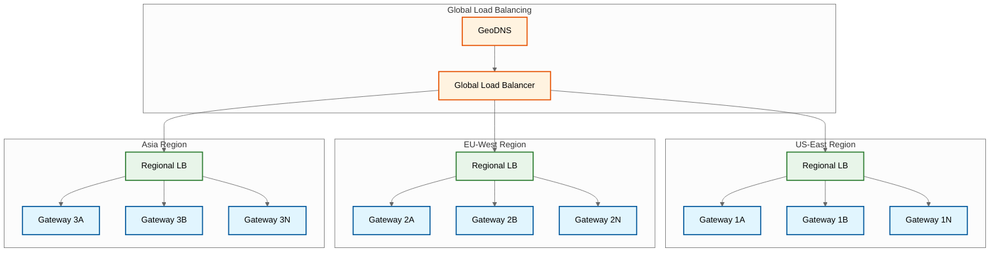
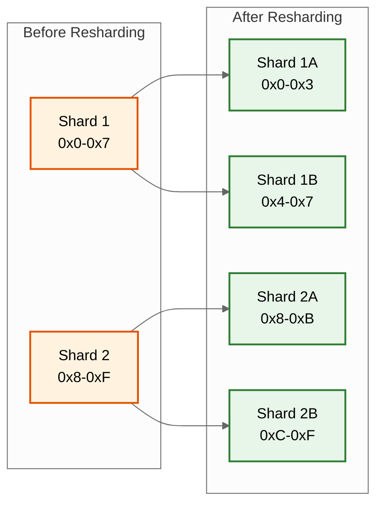
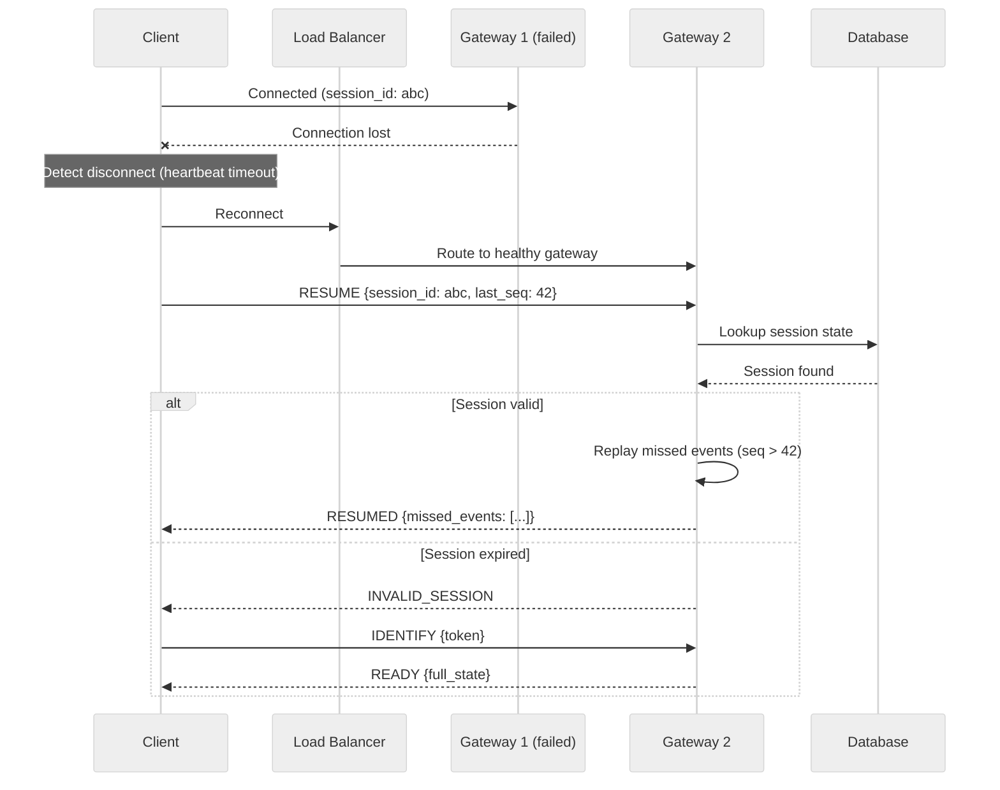
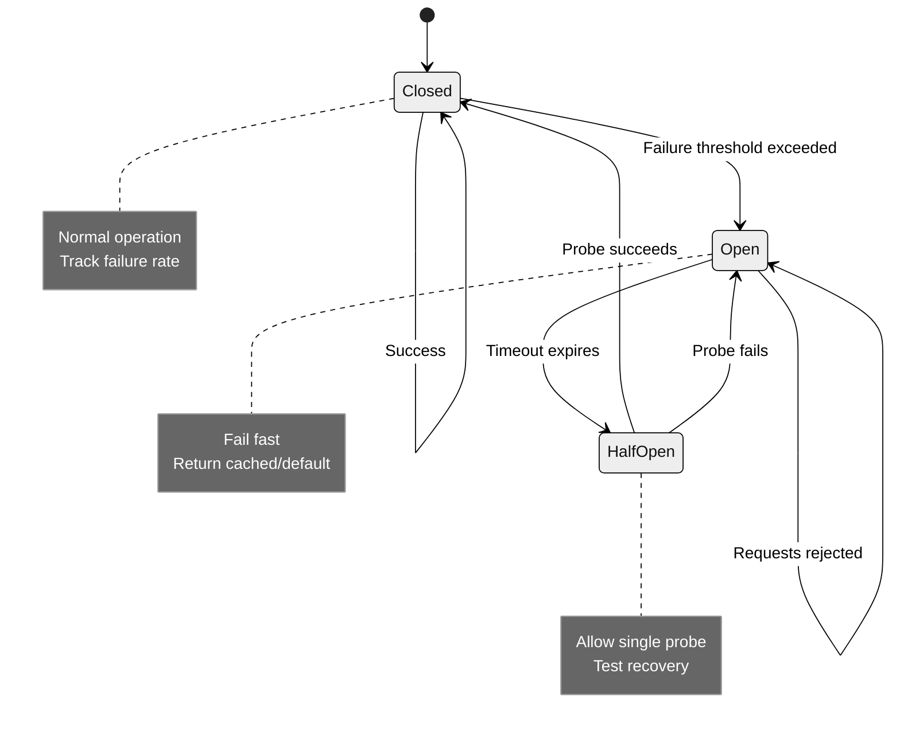
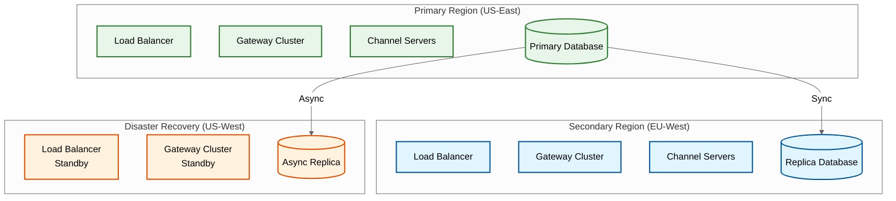

# Scalability & Reliability

## Horizontal Scaling Strategy

### Connection Layer Scaling



**Scaling Triggers:**

| Metric | Threshold | Action |
|--------|-----------|--------|
| Connections per Gateway | >80K | Add gateway instances |
| CPU Utilization | >70% | Scale out |
| Memory Utilization | >75% | Scale out |
| WebSocket Errors | >0.1% | Investigate, potentially scale |

**Capacity Formula:**

```
Required Gateways = Peak_Concurrent_Users / Connections_Per_Gateway × Safety_Factor

Example (Slack):
= 5,000,000 / 100,000 × 1.5
= 75 gateways minimum (across regions)
```

---

### Channel/Guild Server Scaling

**Slack: Consistent Hashing**

```
Scaling Event: Add new Channel Server

1. Update hash ring configuration
2. New server added with virtual nodes
3. Subset of channels migrate (consistent hashing minimizes movement)
4. Clients reconnect and re-subscribe

Channel Movement = N / (N + 1) where N = existing servers
For 10 → 11 servers: ~9% of channels move
```

**Discord: BEAM Node Scaling**

```
Scaling Event: Add new BEAM node

1. New node joins Erlang cluster
2. Guild processes can be migrated via BEAM distribution
3. Session processes connect to new node for new users
4. Relay processes spawn on new node for large guilds

Key Advantage: BEAM handles distribution automatically
```

---

### Database Scaling

**Slack: Vitess Resharding**



**Vitess Resharding Process:**

1. **Prepare**: Create new shard tablets
2. **Copy**: VReplication copies data to new shards
3. **Verify**: Checksums validate data integrity
4. **Cutover**: Atomic switch of traffic
5. **Cleanup**: Remove old shards

**Discord: ScyllaDB Scaling**

```
Adding Nodes:
1. New node joins cluster
2. Automatic data streaming from existing nodes
3. Consistent hashing rebalances partitions
4. Zero downtime, no resharding needed

Key Difference: ScyllaDB handles distribution automatically
```

---

### Caching Layer Scaling

**Multi-Tier Cache Strategy:**

| Tier | Technology | Data | TTL |
|------|------------|------|-----|
| **L1: In-Process** | Local memory | Hot messages, presence | 30s |
| **L2: Regional** | Redis Cluster | Sessions, recent channels | 5min |
| **L3: Global** | Redis Cluster | User profiles, permissions | 1hr |

**Cache Scaling:**

```
Redis Cluster Scaling:
- Start with 6 nodes (3 masters + 3 replicas)
- Add nodes in pairs (master + replica)
- Automatic slot migration
- Use hash tags for related data: {channel:123}:messages

Scaling Trigger:
- Memory > 70%: Add nodes
- CPU > 60%: Add nodes
- Network > 80%: Add nodes
```

---

## Fault Tolerance Patterns

### Single Points of Failure Analysis

| Component | SPOF Risk | Mitigation |
|-----------|-----------|------------|
| Gateway Server | Low | Multiple instances, sticky sessions |
| Channel Server | Medium | Consistent hashing, failover to next node |
| Guild Process | Medium | BEAM supervisor restarts, state rebuild |
| Database | Low | Replicated, automated failover |
| Redis | Low | Cluster mode, cross-region replication |
| Load Balancer | Low | Active-passive, DNS failover |
| Search Cluster | Low | Replicated shards |

---

### Connection Recovery Flow



**Key Recovery Mechanisms:**

1. **Session Persistence**: Store session state in Redis (TTL: 5 minutes)
2. **Sequence Numbers**: Track last delivered event per session
3. **Event Replay**: On reconnect, replay missed events
4. **Graceful Degradation**: If replay fails, client fetches via REST

---

### Gateway Server Failover

```
PROCEDURE: Gateway_Failover

1. DETECTION (3 methods):
   - Health check failure (3 consecutive)
   - No heartbeat response (30s)
   - Process crash detection

2. NOTIFICATION:
   - Load balancer removes from rotation
   - Alert to on-call

3. CLIENT_HANDLING:
   - Clients detect via heartbeat timeout
   - Reconnect with RESUME or IDENTIFY
   - Sticky session cookie cleared

4. STATE_RECOVERY:
   - Session state in Redis survives gateway crash
   - New gateway loads session on RESUME
   - Channels re-subscribed

5. METRICS:
   - Track: failover_count, reconnection_time, missed_events
```

---

### Channel/Guild Server Failover

**Slack: Consistent Hash Ring Failover**

```
Scenario: Channel Server 3 fails

Before:
    Hash Ring: [CS1, CS2, CS3, CS4, CS5]
    Channel X → CS3 (hash lands on CS3)

After CS3 failure:
    Hash Ring: [CS1, CS2, CS4, CS5]
    Channel X → CS4 (next node in ring)

Client Impact:
    - Brief message delay (seconds)
    - Gateway routes to new Channel Server
    - State rebuilt from database
```

**Discord: BEAM Supervisor Restart**

```
Scenario: Guild Process crashes

1. Supervisor detects crash
2. New process spawned (milliseconds)
3. State rebuilt from database
4. Sessions reconnected to new process
5. No lost messages (persisted before ACK)

BEAM Advantage:
    - Lightweight process restart
    - Isolation (one guild crash doesn't affect others)
    - Built-in supervision trees
```

---

### Database Failover

**Vitess Failover:**

```
Master Failure Detection:
    - Orchestrator monitors MySQL topology
    - Heartbeat failure triggers election

Failover Process:
    1. Orchestrator detects master down
    2. Select most up-to-date replica
    3. Promote replica to master
    4. Update routing topology
    5. Redirect traffic

Failover Time: ~30 seconds
Data Loss: 0 (synchronous replication)
```

**ScyllaDB Failover:**

```
Node Failure:
    - Consistent hashing routes to replicas
    - No failover needed (multi-master)
    - Reads/writes continue on surviving replicas

Partition Handling:
    - Quorum reads/writes tolerate minority failure
    - Hinted handoff for temporarily down nodes
    - Repair process for consistency

Recovery Time: Immediate (for quorum operations)
```

---

## Circuit Breaker Pattern



**Implementation:**

```
CIRCUIT_BREAKER for Database calls:
    failure_threshold: 5 failures in 10 seconds
    open_duration: 30 seconds
    half_open_probes: 3

    ON_REQUEST:
        IF state == OPEN:
            RETURN cached_response OR error
        IF state == HALF_OPEN:
            IF probe_count >= half_open_probes:
                RETURN cached_response
            ELSE:
                probe_count++
                TRY request

        TRY request
        ON_SUCCESS:
            reset_failures()
            IF state == HALF_OPEN:
                state = CLOSED
        ON_FAILURE:
            increment_failures()
            IF failures >= threshold:
                state = OPEN
                start_timer(open_duration)
```

---

## Disaster Recovery

### Multi-Region Architecture



### RTO/RPO Targets

| Scenario | RTO | RPO | Strategy |
|----------|-----|-----|----------|
| **Gateway failure** | <1 minute | 0 | Auto-reconnect |
| **Region failure** | <5 minutes | <1 second | Active-active failover |
| **Database failure** | <2 minutes | 0 | Synchronous replication |
| **Complete DR** | <30 minutes | <5 minutes | Async replica promotion |

### Backup Strategy

```
Data Backup Schedule:

MESSAGES:
    - Continuous replication to replica regions
    - Daily snapshots to cold storage
    - Retention: 7 years (enterprise compliance)

USER_DATA:
    - Real-time replication
    - Hourly snapshots
    - Retention: Per account settings

SEARCH_INDEX:
    - Daily snapshot
    - Can be rebuilt from message database
    - Retention: 30 days

CONFIGURATION:
    - Version controlled
    - Deployed via CI/CD
    - Retention: All versions
```

---

## Graceful Degradation

### Feature Degradation Tiers

| Tier | Condition | Degraded Features | Preserved Features |
|------|-----------|-------------------|-------------------|
| **Tier 1** | High load | Search slower, typing indicators delayed | Messaging, presence |
| **Tier 2** | Partial outage | Search disabled, reactions delayed | Messaging |
| **Tier 3** | Major outage | Presence disabled, history limited | Real-time messaging |
| **Tier 4** | Critical | Push only, no real-time | Queued message delivery |

### Load Shedding Strategy

```
ALGORITHM: Load_Shedding

INPUT: current_load, request
OUTPUT: allow/reject

PROCEDURE:
    // Priority levels
    P0: Real-time messages
    P1: Presence updates
    P2: Typing indicators
    P3: Search queries
    P4: Analytics/telemetry

    capacity = Get_Current_Capacity()

    IF current_load < 70% capacity:
        ALLOW all requests

    ELSE IF current_load < 85%:
        REJECT P4 requests (50%)

    ELSE IF current_load < 95%:
        REJECT P3, P4 requests
        DELAY P2 requests

    ELSE:  // Critical
        REJECT P2, P3, P4
        SAMPLE P1 (10%)
        PRIORITIZE P0

    // Always allow reconnection attempts
    IF request.type == RECONNECT:
        ALLOW
```

---

## Auto-Scaling Configuration

### Gateway Servers

```
Auto-Scaling Policy:

SCALE_OUT:
    Metric: Average connections per instance
    Threshold: >80,000 for 5 minutes
    Action: Add 2 instances
    Cooldown: 3 minutes

SCALE_IN:
    Metric: Average connections per instance
    Threshold: <40,000 for 15 minutes
    Action: Remove 1 instance
    Cooldown: 10 minutes

CONSTRAINTS:
    Min instances: 10 (per region)
    Max instances: 100 (per region)
    Drain time: 5 minutes (for graceful shutdown)
```

### Channel/Guild Servers

```
Auto-Scaling Policy:

SCALE_OUT:
    Metric: Message processing latency (p99)
    Threshold: >100ms for 3 minutes
    Action: Add 1 instance
    Cooldown: 5 minutes

SCALE_IN:
    Metric: CPU utilization
    Threshold: <30% for 30 minutes
    Action: Remove 1 instance
    Cooldown: 15 minutes

REBALANCING:
    Trigger: New instance added
    Action: Consistent hash ring update
    Impact: ~10% of channels migrate
```

### Database Scaling

```
Database Auto-Scaling:

VERTICAL (per shard):
    Metric: CPU, IOPS, connections
    Threshold: >80% for 10 minutes
    Action: Upgrade instance class
    Downtime: <1 minute (failover)

HORIZONTAL (add shards):
    Metric: Storage per shard
    Threshold: >70% capacity
    Action: Split shard (Vitess resharding)
    Duration: Hours (online, no downtime)

READ_REPLICAS:
    Metric: Read IOPS
    Threshold: >70% of master capacity
    Action: Add read replica
    Duration: ~1 hour (initial sync)
```
