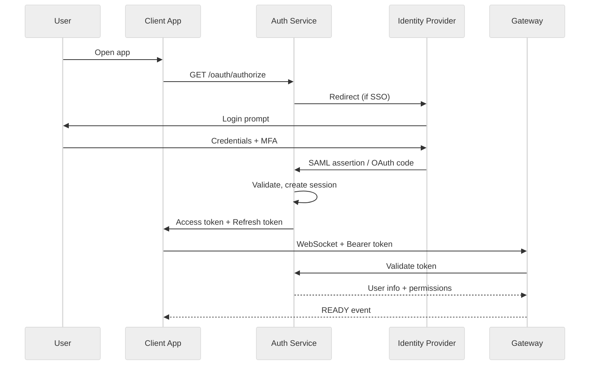
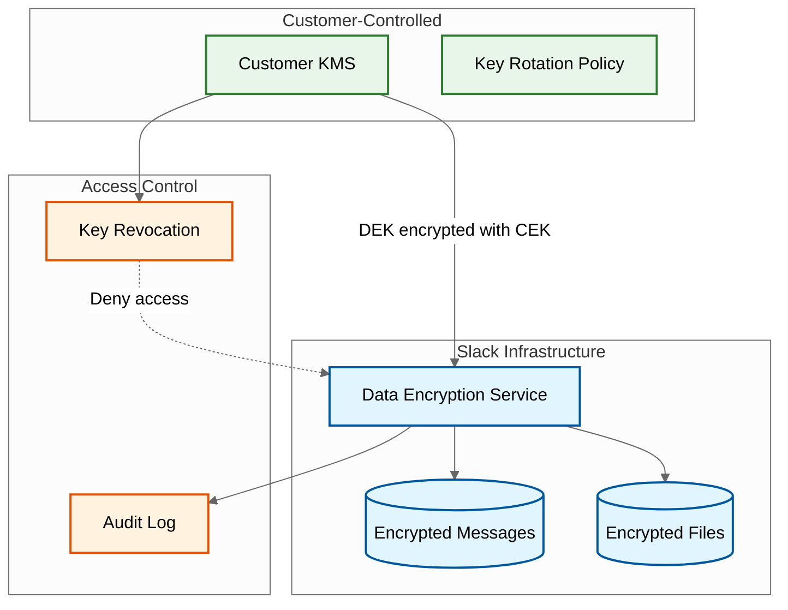
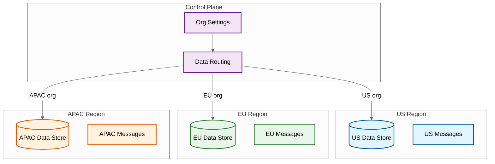

# Security & Compliance

## Authentication & Authorization

### Authentication Mechanisms

| Method | Slack | Discord | Use Case |
|--------|-------|---------|----------|
| **OAuth 2.0** | Yes | Yes | Third-party apps, bots |
| **SAML 2.0 SSO** | Enterprise Grid | N/A | Enterprise identity providers |
| **OIDC** | Yes | N/A | Modern SSO |
| **API Tokens** | User/Bot tokens | Bot tokens | Programmatic access |
| **MFA/2FA** | Yes | Yes | Additional security layer |

### Authentication Flow



### Token Management

```
Token Structure (JWT-like):

Access Token:
{
    "sub": "user_id",
    "workspace_id": "W123",
    "scopes": ["messages:read", "channels:write"],
    "iat": 1705312000,
    "exp": 1705315600,  // 1 hour
    "iss": "slack.com"
}

Refresh Token:
{
    "sub": "user_id",
    "session_id": "session_uuid",
    "exp": 1712918400,  // 90 days
    "rotatable": true
}

Security Measures:
- Access token: Short-lived (1 hour)
- Refresh token: Long-lived (90 days), rotated on use
- Revocation: Stored in Redis blacklist
- Device binding: Optional fingerprint validation
```

---

### Authorization Model

**Slack: Workspace-Based Permissions**

```
Permission Hierarchy:
    Organization (Enterprise Grid)
    └── Workspace
        ├── Workspace Admin
        ├── Channel
        │   ├── Channel Owner
        │   ├── Channel Members
        │   └── External Guests
        └── User Roles
            ├── Owner
            ├── Admin
            ├── Member
            └── Guest (Single/Multi-channel)

Channel Permissions:
    - posting_permissions: EVERYONE | ADMINS_ONLY | SPECIFIC_USERS
    - membership: PUBLIC | PRIVATE | SHARED (Slack Connect)
    - can_archive: ADMINS | OWNER_ONLY
```

**Discord: Role-Based Permissions**

```
Permission Hierarchy:
    Guild (Server)
    └── Roles (ordered by position)
        ├── @everyone (base)
        ├── Custom Roles
        │   ├── Permissions bitfield
        │   └── Position (higher = more power)
        └── Category/Channel Overrides

Permission Bitfield (64-bit):
    Bit 0:  CREATE_INSTANT_INVITE
    Bit 1:  KICK_MEMBERS
    Bit 2:  BAN_MEMBERS
    Bit 3:  ADMINISTRATOR (overrides all)
    Bit 4:  MANAGE_CHANNELS
    ...
    Bit 46: SEND_VOICE_MESSAGES

Permission Resolution:
    1. Start with @everyone permissions
    2. Add role permissions (OR)
    3. Apply channel overwrites (AND/DENY)
    4. ADMINISTRATOR bypasses all checks
```

---

## Data Security

### Encryption

| Layer | Mechanism | Details |
|-------|-----------|---------|
| **In Transit** | TLS 1.3 | All client-server, server-server |
| **At Rest** | AES-256 | Database, blob storage |
| **Key Management** | Platform KMS | AWS KMS / GCP KMS |
| **Enterprise Keys (Slack EKM)** | Customer-controlled | Customers hold encryption keys |

### Enterprise Key Management (Slack)



**EKM Benefits:**
- Customer controls encryption keys
- Can revoke access immediately
- Full audit trail of key usage
- Compliance with data sovereignty requirements

---

### Data Classification

| Classification | Examples | Handling |
|----------------|----------|----------|
| **Public** | Workspace name, public channel names | Cached broadly, indexed |
| **Internal** | Private channel names, user list | Encrypted at rest |
| **Confidential** | Message content, files | Encrypted, access-controlled |
| **Restricted** | SSO credentials, tokens | HSM-protected, no logging |

### PII Handling

```
PII Data Types:
    - Email addresses
    - Display names
    - Profile photos
    - Phone numbers (optional)
    - Custom status text

Protection Measures:
    1. Encryption at rest (AES-256)
    2. Access logging
    3. Data minimization (collect only necessary)
    4. Retention policies (configurable)
    5. Anonymization for analytics

GDPR Compliance:
    - Right to access: Data export API
    - Right to erasure: Account deletion flow
    - Right to portability: Standard format export
    - Consent: Explicit opt-in for optional data
```

---

## Threat Model

### STRIDE Analysis

| Threat | Attack Vector | Mitigation |
|--------|---------------|------------|
| **Spoofing** | Stolen credentials, session hijacking | MFA, token rotation, IP binding |
| **Tampering** | Message modification, API manipulation | Digital signatures, input validation |
| **Repudiation** | Deny sending message | Immutable audit logs, message IDs |
| **Information Disclosure** | Data breach, API leakage | Encryption, access controls, DLP |
| **Denial of Service** | Connection floods, message spam | Rate limiting, circuit breakers |
| **Elevation of Privilege** | Permission bypass, role escalation | RBAC enforcement, principle of least privilege |

### Top Attack Vectors

#### 1. Account Takeover

```
Attack: Credential stuffing, phishing

Mitigations:
    - Enforce MFA for all users
    - Detect suspicious login patterns
    - IP-based anomaly detection
    - Session invalidation on password change
    - Breached password checking
```

#### 2. Malicious Bots/Integrations

```
Attack: Abuse OAuth scopes, data exfiltration

Mitigations:
    - Granular OAuth scopes
    - Rate limiting per bot
    - Audit log for bot actions
    - Admin approval for sensitive scopes
    - Token revocation capability
```

#### 3. Data Exfiltration

```
Attack: Bulk download via API, insider threat

Mitigations:
    - Rate limiting on exports
    - DLP scanning (Slack Enterprise)
    - Anomaly detection on API usage
    - Watermarking for screenshots
    - Audit trail for data access
```

#### 4. WebSocket Abuse

```
Attack: Connection exhaustion, message flooding

Mitigations:
    - Connection limits per user/IP
    - Message rate limiting
    - Payload size limits
    - WebSocket authentication
    - Heartbeat timeout enforcement
```

---

## Rate Limiting

### Per-User Limits

| Resource | Limit | Window | Action on Exceed |
|----------|-------|--------|------------------|
| Messages sent | 1/second | Per channel | 429 + backoff |
| API calls | 50/minute | Per token | 429 + retry-after |
| File uploads | 20/minute | Per workspace | 429 |
| Search queries | 20/minute | Per user | 429 |
| WebSocket connects | 5/minute | Per user | Reject |

### Per-Channel Limits

| Resource | Limit | Action |
|----------|-------|--------|
| Messages/second | 5 (normal), 50 (large) | Queue overflow |
| Members | 1000 (Slack), unlimited (Discord) | Invite blocked |
| Pins | 100 | Error |
| Reactions per message | 50 unique | Error |

### DDoS Protection

```
Layer 3/4 Protection:
    - Cloud provider DDoS mitigation (AWS Shield, Cloudflare)
    - BGP blackholing for volumetric attacks
    - SYN flood protection

Layer 7 Protection:
    - WAF rules for common attacks
    - Bot detection (CAPTCHA challenge)
    - Geographic restrictions (optional)
    - Request fingerprinting
```

---

## Compliance

### Regulatory Frameworks

| Framework | Applicability | Key Requirements |
|-----------|---------------|------------------|
| **GDPR** | EU users | Data protection, consent, right to erasure |
| **CCPA** | California users | Data disclosure, opt-out, deletion |
| **HIPAA** | Healthcare (Slack) | BAA, encryption, access controls |
| **SOC 2** | Enterprise | Security, availability, confidentiality |
| **FedRAMP** | US Government (Slack) | Federal security standards |
| **ISO 27001** | Global | Information security management |

### Data Residency



**Slack Data Residency:**
- Enterprise Grid: US, EU, Australia, Japan, Germany, France
- Data never leaves designated region
- Control plane may be centralized (US)

---

### Audit Logging

```
Audit Events Captured:

USER_ACTIONS:
    - Login/logout (IP, device, location)
    - MFA enrollment/usage
    - Password changes
    - Profile updates

ADMIN_ACTIONS:
    - User provisioning/deprovisioning
    - Permission changes
    - Channel creation/deletion
    - Integration installations

DATA_ACCESS:
    - Message exports
    - File downloads
    - Search queries (enterprise)
    - API calls

SECURITY_EVENTS:
    - Failed login attempts
    - Token revocations
    - Suspicious activity alerts
    - DLP violations

Log Retention:
    - Standard: 90 days
    - Enterprise: 1 year+
    - Compliance: 7 years (configurable)
```

### eDiscovery (Slack Enterprise)

```
eDiscovery Capabilities:

LEGAL_HOLD:
    - Preserve messages/files for specific users
    - Prevent deletion during hold
    - Track chain of custody

SEARCH:
    - Full-text search across all content
    - Filter by date, user, channel
    - Include deleted messages (if preserved)

EXPORT:
    - Standard formats (JSON, EML)
    - Include metadata
    - Audit trail of exports

CUSTODIAN_MANAGEMENT:
    - Define custodians (people of interest)
    - Apply holds to custodian content
    - Report on custodian data volume
```

### Data Loss Prevention (DLP)

```
DLP Features (Slack Enterprise):

DETECTION:
    - Credit card numbers
    - Social security numbers
    - Custom patterns (regex)
    - File type restrictions

ACTIONS:
    - Block message send
    - Redact sensitive content
    - Alert admins
    - Quarantine for review

INTEGRATION:
    - Third-party DLP (Netskope, Symantec)
    - CASB integration
    - Custom webhooks

Example Policy:
    IF message MATCHES /\b\d{16}\b/:  // Credit card pattern
        AND channel.type == EXTERNAL:
            BLOCK message
            ALERT security_team
            LOG violation
```

---

## Security Best Practices

### For Administrators

| Practice | Implementation |
|----------|----------------|
| Enforce MFA | Required for all users, especially admins |
| Review app permissions | Quarterly audit of installed apps |
| Monitor audit logs | Alert on suspicious patterns |
| Limit external sharing | Restrict Slack Connect, file sharing |
| Configure DLP | Block sensitive data in external channels |
| Regular access reviews | Remove inactive users, unused bots |

### For Developers (Integrations)

| Practice | Implementation |
|----------|----------------|
| Minimum scopes | Request only needed permissions |
| Token security | Never log tokens, rotate regularly |
| Input validation | Validate all webhook payloads |
| Rate limit handling | Implement exponential backoff |
| Secure storage | Use secrets managers for credentials |
| Vulnerability scanning | Regular dependency audits |

### For End Users

| Practice | Implementation |
|----------|----------------|
| Enable MFA | Use authenticator app, not SMS |
| Verify links | Check URLs before clicking |
| Report phishing | Use report feature for suspicious DMs |
| Secure devices | Lock devices, use encryption |
| Review connected apps | Revoke unused app permissions |
