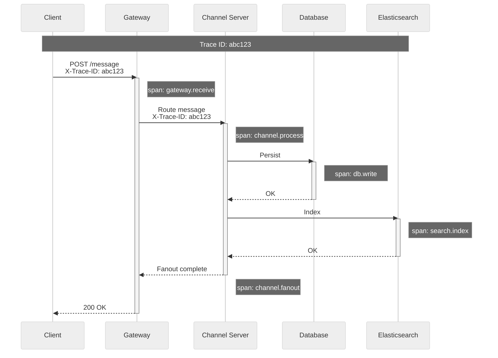

# Observability

## Key Metrics

### USE Method (Utilization, Saturation, Errors)

| Component | Utilization | Saturation | Errors |
|-----------|-------------|------------|--------|
| **Gateway Server** | connections/capacity | pending_sends queue | websocket_errors |
| **Channel Server** | channels_hosted/capacity | message_queue_depth | fanout_failures |
| **Database** | connections_used/max | query_queue_depth | query_errors |
| **Cache** | memory_used/allocated | eviction_rate | cache_errors |
| **Search** | cpu_utilization | pending_indexing | search_errors |

### RED Method (Rate, Errors, Duration)

| Service | Rate | Errors | Duration (p99) |
|---------|------|--------|----------------|
| **Message Send** | messages/sec | send_failures | 500ms |
| **Message Delivery** | deliveries/sec | delivery_failures | 100ms |
| **Presence Update** | updates/sec | update_failures | 50ms |
| **Search Query** | queries/sec | search_errors | 2s |
| **API Request** | requests/sec | 5xx_errors | 200ms |

---

## Real-Time Metrics

### WebSocket Metrics

```
GAUGE: websocket.connections.active
    Labels: region, gateway_instance
    Alert: > 90% capacity per instance

COUNTER: websocket.messages.received
    Labels: event_type, region
    Use: Track message volume

COUNTER: websocket.messages.sent
    Labels: event_type, region
    Use: Track fanout volume

HISTOGRAM: websocket.message.latency
    Labels: event_type
    Buckets: 10ms, 50ms, 100ms, 250ms, 500ms, 1s
    Alert: p99 > 500ms

COUNTER: websocket.errors
    Labels: error_type (auth_failed, timeout, closed)
    Alert: Rate > 0.1% of connections

GAUGE: websocket.reconnections.pending
    Labels: region
    Alert: Spike indicates instability
```

### Message Delivery Metrics

```
HISTOGRAM: message.delivery.latency
    Labels: channel_type (public, private, dm)
    Buckets: 50ms, 100ms, 250ms, 500ms, 1s, 2s
    Alert: p99 > 500ms for 5 minutes

COUNTER: message.fanout.total
    Labels: channel_size_bucket (small, medium, large)
    Use: Correlate with latency

GAUGE: message.queue.depth
    Labels: channel_server
    Alert: > 10,000 pending

COUNTER: message.duplicates.detected
    Labels: reason (retry, race_condition)
    Alert: Rate > 0.01%
```

### Presence Metrics

```
GAUGE: presence.users.online
    Labels: region, status (online, idle, dnd)
    Use: Dashboard, capacity planning

HISTOGRAM: presence.update.latency
    Labels: update_type (connect, disconnect, status_change)
    Buckets: 10ms, 50ms, 100ms, 500ms
    Alert: p99 > 100ms

COUNTER: presence.events.total
    Labels: event_type
    Use: Volume tracking

GAUGE: presence.subscriptions.active
    Labels: region
    Use: Capacity planning
```

---

## Logging Strategy

### Structured Logging Format

```json
{
    "timestamp": "2024-01-15T10:30:00.123Z",
    "level": "INFO",
    "service": "gateway-server",
    "instance_id": "gs-useast-042",
    "trace_id": "abc123def456",
    "span_id": "span789",
    "user_id": "U12345678",
    "workspace_id": "W87654321",
    "event": "message.sent",
    "channel_id": "C11111111",
    "message_id": "1705312200.123456",
    "latency_ms": 45,
    "success": true
}
```

### Log Levels

| Level | Use Case | Examples |
|-------|----------|----------|
| **ERROR** | Failures requiring attention | Database errors, auth failures, crashes |
| **WARN** | Degraded but functioning | Rate limits hit, retry succeeded, timeout |
| **INFO** | Key business events | Message sent, user connected, channel created |
| **DEBUG** | Detailed diagnostics | Request/response payloads, state transitions |
| **TRACE** | Fine-grained debugging | Internal function calls, cache lookups |

### What to Log

```
MUST LOG:
    - Authentication events (success/failure)
    - Authorization decisions
    - Message delivery status
    - Error conditions with context
    - Admin actions
    - Security-relevant events

MUST NOT LOG:
    - Message content (privacy)
    - Full tokens/credentials
    - PII beyond necessary identifiers
    - Passwords (even hashed)

REDACTION RULES:
    - Tokens: Show last 4 characters
    - Emails: user***@domain.com
    - IPs: Optional based on compliance
```

### Log Retention

| Log Type | Retention | Storage |
|----------|-----------|---------|
| **Security/Audit** | 2 years | Cold storage, encrypted |
| **Application** | 30 days | Hot storage |
| **Debug** | 7 days | Hot storage |
| **Metrics** | 15 months | Time-series DB |

---

## Distributed Tracing

### Trace Context Propagation



### Key Spans to Instrument

| Span Name | Service | Key Attributes |
|-----------|---------|----------------|
| `gateway.receive` | Gateway | `event_type`, `user_id` |
| `gateway.authenticate` | Gateway | `auth_method`, `success` |
| `channel.route` | Admin Server | `channel_id`, `target_server` |
| `channel.process` | Channel Server | `channel_id`, `member_count` |
| `channel.fanout` | Channel Server | `recipient_count`, `duration` |
| `db.query` | Database | `query_type`, `table`, `duration` |
| `cache.lookup` | Cache | `key`, `hit/miss` |
| `search.query` | Elasticsearch | `query`, `result_count` |

### Sampling Strategy

```
Sampling Rules:

DEFAULT:
    - Sample 1% of all requests (baseline)

HIGH_VALUE:
    - 100% of error traces
    - 100% of slow traces (>500ms)
    - 100% of admin actions

TARGETED:
    - 10% of messages in large channels (>1000 members)
    - 100% of enterprise workspace traffic (if configured)

IMPLEMENTATION:
    - Head-based sampling at gateway
    - Tail-based sampling for errors (collect all, decide later)
    - Trace ID in all logs for correlation
```

---

## Alerting

### Alert Severity Levels

| Severity | Response Time | Examples |
|----------|---------------|----------|
| **P1 - Critical** | <15 minutes | Complete outage, data loss |
| **P2 - High** | <1 hour | Partial outage, degraded service |
| **P3 - Medium** | <4 hours | Performance degradation |
| **P4 - Low** | Next business day | Minor issues, cleanup |

### Critical Alerts (Page-Worthy)

```yaml
- name: MessageDeliveryFailure
  condition: message.delivery.failures > 1% for 2 minutes
  severity: P1
  runbook: /runbooks/message-delivery-failure

- name: WebSocketConnectionDrop
  condition: websocket.connections.active drop > 20% in 1 minute
  severity: P1
  runbook: /runbooks/websocket-mass-disconnect

- name: DatabaseLatencySpike
  condition: db.query.latency.p99 > 500ms for 3 minutes
  severity: P1
  runbook: /runbooks/database-latency

- name: GatewayServerDown
  condition: gateway.health.status = down for 30 seconds
  severity: P1
  runbook: /runbooks/gateway-failover
```

### Warning Alerts

```yaml
- name: HighConnectionUtilization
  condition: websocket.connections.active > 80% capacity
  severity: P3
  action: Scale out gateways

- name: CacheEvictionRate
  condition: cache.evictions.rate > 1000/sec for 10 minutes
  severity: P3
  action: Review cache sizing

- name: SearchIndexLag
  condition: search.index.lag > 5 minutes
  severity: P3
  action: Check indexing pipeline

- name: ErrorRateElevated
  condition: api.errors.5xx > 0.5% for 5 minutes
  severity: P2
  action: Investigate error logs
```

---

## Dashboards

### Global Health Dashboard

```
┌─────────────────────────────────────────────────────────────────────────┐
│ SLACK/DISCORD GLOBAL HEALTH                               [Auto-refresh] │
├─────────────────────────────────────────────────────────────────────────┤
│                                                                          │
│  ┌──────────────────┐  ┌──────────────────┐  ┌──────────────────┐       │
│  │ CONNECTIONS      │  │ MESSAGE RATE     │  │ ERROR RATE       │       │
│  │ ████████████░░░░ │  │ ████████████████ │  │ █░░░░░░░░░░░░░░░ │       │
│  │ 4.2M / 5M        │  │ 45,230/sec       │  │ 0.02%            │       │
│  │ 84% capacity     │  │ +12% vs yesterday│  │ ✓ Healthy        │       │
│  └──────────────────┘  └──────────────────┘  └──────────────────┘       │
│                                                                          │
│  MESSAGE DELIVERY LATENCY (p99)                                         │
│  ┌────────────────────────────────────────────────────────────────────┐ │
│  │    500ms ─────────────────────────────────────────────────         │ │
│  │    250ms ─────────────────────────────────────────────────         │ │
│  │    100ms ████████████████████████████████████████████████████████  │ │
│  │      0ms └───────────────────────────────────────────────────────  │ │
│  │          10:00    10:15    10:30    10:45    11:00    11:15        │ │
│  └────────────────────────────────────────────────────────────────────┘ │
│                                                                          │
│  REGIONAL STATUS                                                        │
│  ┌─────────────┐ ┌─────────────┐ ┌─────────────┐ ┌─────────────┐       │
│  │ US-EAST     │ │ US-WEST     │ │ EU-WEST     │ │ ASIA        │       │
│  │ ● HEALTHY   │ │ ● HEALTHY   │ │ ● HEALTHY   │ │ ● HEALTHY   │       │
│  │ 1.5M conn   │ │ 1.0M conn   │ │ 1.2M conn   │ │ 0.5M conn   │       │
│  └─────────────┘ └─────────────┘ └─────────────┘ └─────────────┘       │
│                                                                          │
└─────────────────────────────────────────────────────────────────────────┘
```

### Real-Time Events Dashboard

```
┌─────────────────────────────────────────────────────────────────────────┐
│ REAL-TIME EVENTS                                                        │
├─────────────────────────────────────────────────────────────────────────┤
│                                                                          │
│  WEBSOCKET EVENTS/SECOND                                                │
│  ┌────────────────────────────────────────────────────────────────────┐ │
│  │  MESSAGE_CREATE     ████████████████████████████  28,450           │ │
│  │  PRESENCE_UPDATE    ████████████████              15,230           │ │
│  │  TYPING_START       ████████████                  12,100           │ │
│  │  CHANNEL_UPDATE     ███                            2,340           │ │
│  │  REACTION_ADD       ██                             1,890           │ │
│  └────────────────────────────────────────────────────────────────────┘ │
│                                                                          │
│  FANOUT METRICS                                                         │
│  ┌──────────────────┐  ┌──────────────────┐  ┌──────────────────┐       │
│  │ AVG FANOUT       │  │ MAX FANOUT       │  │ FANOUT LATENCY   │       │
│  │ 52 recipients    │  │ 15,420 (guild)   │  │ 45ms (p99)       │       │
│  └──────────────────┘  └──────────────────┘  └──────────────────┘       │
│                                                                          │
│  PRESENCE STATUS DISTRIBUTION                                           │
│  Online: ████████████████████████ 62%                                   │
│  Idle:   ████████                 21%                                   │
│  DnD:    ████                     10%                                   │
│  Offline:██                        7%                                   │
│                                                                          │
└─────────────────────────────────────────────────────────────────────────┘
```

### Voice Health Dashboard (Discord)

```
┌─────────────────────────────────────────────────────────────────────────┐
│ VOICE HEALTH                                                            │
├─────────────────────────────────────────────────────────────────────────┤
│                                                                          │
│  ┌──────────────────┐  ┌──────────────────┐  ┌──────────────────┐       │
│  │ ACTIVE VOICE     │  │ VOICE QUALITY    │  │ PACKET LOSS      │       │
│  │ 245,000 users    │  │ 4.2/5.0 MOS      │  │ 0.3% avg         │       │
│  │ +15% vs peak     │  │ ✓ Excellent      │  │ ✓ Acceptable     │       │
│  └──────────────────┘  └──────────────────┘  └──────────────────┘       │
│                                                                          │
│  SFU SERVER UTILIZATION BY REGION                                       │
│  ┌────────────────────────────────────────────────────────────────────┐ │
│  │  US-East    ████████████████████░░░░░░░░  65%  (45 servers)        │ │
│  │  US-West    ████████████████░░░░░░░░░░░░  52%  (32 servers)        │ │
│  │  EU-West    ████████████████████████░░░░  78%  (28 servers)        │ │
│  │  Asia       ████████████░░░░░░░░░░░░░░░░  42%  (20 servers)        │ │
│  └────────────────────────────────────────────────────────────────────┘ │
│                                                                          │
│  VOICE LATENCY DISTRIBUTION                                             │
│  <50ms:   ████████████████████████████  72%                             │
│  50-100ms:████████████                  28%                             │
│  >100ms:  █                              3%                             │
│                                                                          │
└─────────────────────────────────────────────────────────────────────────┘
```

---

## Runbook References

### Common Incidents

| Incident | Runbook | Key Actions |
|----------|---------|-------------|
| Mass disconnection | `/runbooks/websocket-mass-disconnect` | Check LB health, gateway logs |
| Message delivery delay | `/runbooks/message-delivery-slow` | Check Channel Server queues |
| Database latency spike | `/runbooks/database-latency` | Check slow queries, connections |
| Search not returning results | `/runbooks/search-failure` | Check ES cluster health |
| Presence showing stale | `/runbooks/presence-stale` | Check Presence Server, Redis |
| Voice quality degraded | `/runbooks/voice-quality` | Check SFU servers, network |

### Escalation Path

```
L1: On-call engineer (15-min response)
    ↓ If not resolved in 30 min
L2: Service team lead
    ↓ If customer-impacting
L3: Engineering manager + Incident commander
    ↓ If extended outage
L4: VP Engineering + Executive notification
```
