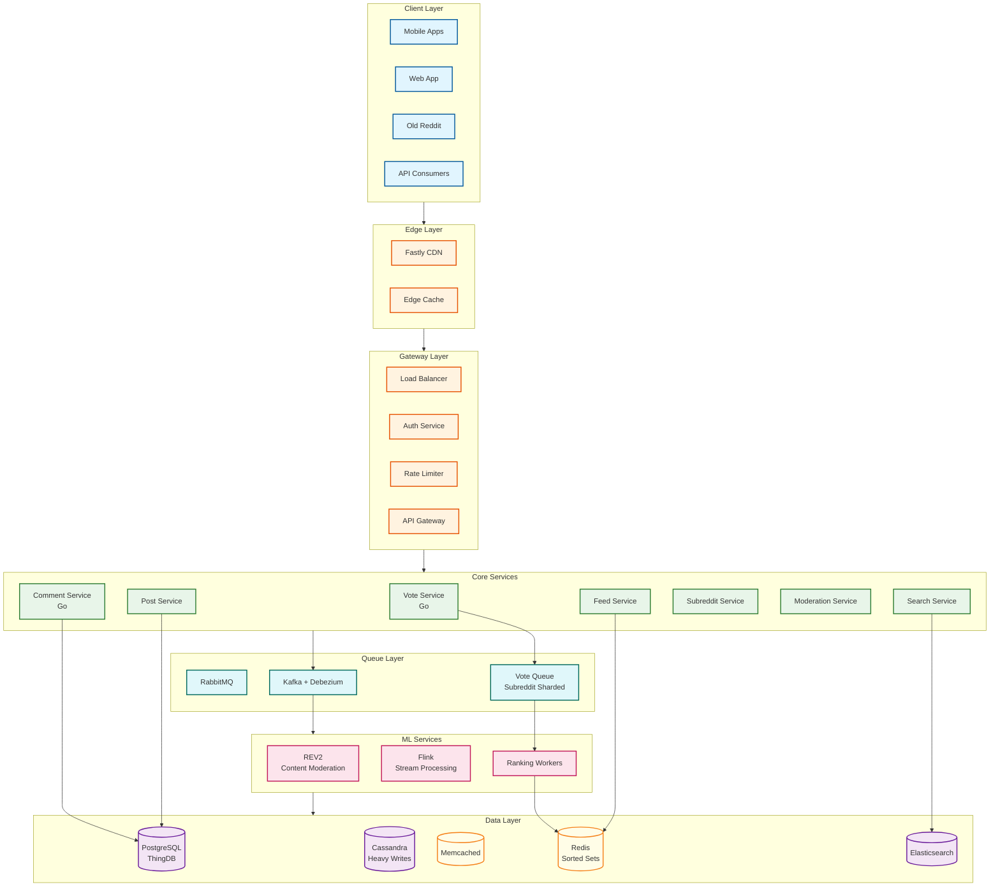

# Reddit System Design

## Overview

Reddit is a **community-driven content aggregation and discussion platform** enabling 116M+ daily active users to submit, vote on, and discuss content within topic-based communities called **subreddits**. The core engineering challenges center on the **democratic voting system** (Hot, Best, Rising, Controversial algorithms), **hierarchical comment threading**, and **subreddit-based content isolation** at massive scale.

**Key differentiator from Twitter/Facebook:** Reddit uses community-based organization (subreddits) rather than user-based graphs (followers/friends). Content ranking is determined by **community voting** rather than ML-driven engagement prediction, creating unique challenges around vote manipulation prevention and hot spot isolation.

---

## System Characteristics

| Characteristic | Value | Implication |
|----------------|-------|-------------|
| Traffic Pattern | Read-heavy, vote-heavy | Multi-tier caching, async vote processing |
| Latency Target | <500ms feed, <150ms vote | Precomputed hot lists, optimistic UI |
| Consistency Model | Eventual (votes), Strong (posts) | Vote counts update within seconds |
| Availability Target | 99.99% | Multi-region, graceful degradation |
| Data Model | ThingDB (Thing + Data tables) | Flexible schema evolution |
| Scale | 116M DAU, 58M votes/day | Subreddit-based sharding |
| Ranking Model | Algorithmic (Hot, Best, Rising) | Background score computation |

---

## Complexity Rating

| Component | Complexity | Key Challenge |
|-----------|------------|---------------|
| **Overall System** | Very High | Democratic voting + threading + moderation at scale |
| Voting System | High | Hot algorithm, manipulation prevention, 58M votes/day |
| Comment Threading | High | Hierarchical trees, "load more" pagination, depth limiting |
| Content Ranking | High | Multiple algorithms (Hot, Best, Rising, Controversial, New) |
| Subreddit Isolation | High | Hot spot handling, vote queue sharding |
| Moderation System | High | Per-subreddit rules, AutoModerator, REV2 ML pipeline |
| Search | Medium | Full-text across billions of posts/comments |

---

## Quick Navigation

| Document | Description |
|----------|-------------|
| [01 - Requirements & Estimations](./01-requirements-and-estimations.md) | Functional/non-functional requirements, capacity planning |
| [02 - High-Level Design](./02-high-level-design.md) | Architecture, data flows, key decisions |
| [03 - Low-Level Design](./03-low-level-design.md) | ThingDB schema, APIs, ranking algorithms |
| [04 - Deep Dives & Bottlenecks](./04-deep-dive-and-bottlenecks.md) | Vote pipeline, comment trees, hot algorithm |
| [05 - Scalability & Reliability](./05-scalability-and-reliability.md) | Scaling strategies, Go migration, fault tolerance |
| [06 - Security & Compliance](./06-security-and-compliance.md) | Vote manipulation, moderation, GDPR |
| [07 - Observability](./07-observability.md) | Metrics, logging, tracing, alerting |
| [08 - Interview Guide](./08-interview-guide.md) | Pacing, trap questions, trade-offs |

---

## Core Modules

| Module | Responsibility | Key Challenge | Scale |
|--------|----------------|---------------|-------|
| **Vote Service** | Vote processing, score aggregation | 58M votes/day, manipulation prevention | ~2K QPS peak |
| **Feed Service** | Content ranking, personalization | Multiple algorithms, subreddit hot spots | ~20K QPS |
| **Comment Service** | Threaded comments, tree construction | Deep nesting, "load more" pagination | 7.5M/day |
| **Post Service** | Post CRUD, media handling | Cross-post, flair, media processing | 1.2M/day |
| **Subreddit Service** | Community management, rules | Hot subreddit isolation | 100K+ subreddits |
| **Moderation Service** | Content filtering, spam detection | REV2 ML pipeline, AutoModerator | Real-time |
| **Search Service** | Post/comment/subreddit search | Full-text across billions | 100s TBs indexed |

---

## Architecture Overview



---

## Reddit vs Twitter vs Facebook

| Aspect | Reddit | Twitter | Facebook |
|--------|--------|---------|----------|
| **Graph Type** | Community membership | Unidirectional (follow) | Bidirectional (friend) |
| **Content Organization** | Subreddits (communities) | Timeline (chronological/ML) | News Feed (ML) |
| **Ranking Model** | Democratic voting | ML engagement prediction | ML engagement prediction |
| **Hot Spot Pattern** | Subreddit-based (r/pics viral) | Celebrity-based (Elon tweets) | Celebrity-based (pages) |
| **Identity** | Pseudonymous (throwaways OK) | Public identity | Real name |
| **Content Length** | Unlimited text | 280 characters | Unlimited |
| **Threading** | Hierarchical (deep nesting) | Flat replies | Single-level comments |
| **Unique Challenge** | Vote manipulation prevention | Celebrity fan-out (150M) | Social graph consistency |

### Reddit's Unique Technical Challenges

```
COMMUNITY-BASED VS USER-BASED:

Twitter/Facebook:
  - Content distribution follows user graph
  - Celebrity = many followers = fan-out problem
  - Solution: Push/pull hybrid based on follower count

Reddit:
  - Content distribution follows subreddit membership
  - Hot subreddit = many subscribers = isolation problem
  - Solution: Subreddit-based queue sharding

DEMOCRATIC RANKING:

Twitter/Facebook:
  - ML predicts what you'll engage with
  - Algorithm decides visibility

Reddit:
  - Community votes determine ranking
  - Hot algorithm: log(score) + time_decay
  - Users explicitly control content value
  - Creates vote manipulation vulnerability
```

---

## Technology Stack

| Layer | Technology | Purpose |
|-------|------------|---------|
| **Backend (Legacy)** | Python (r2 monolith) | Original architecture |
| **Backend (Modern)** | Go microservices | Comments, Accounts (50% latency reduction) |
| **Primary Database** | PostgreSQL | ThingDB model (Things + Data tables) |
| **Write-Heavy Storage** | Cassandra | High-volume writes, resilience |
| **Read Cache** | Memcached | Sub-second reads |
| **Ranking Cache** | Redis | Sorted sets for hot lists, pub/sub |
| **CDN** | Fastly | Edge routing, static content |
| **Message Queue** | RabbitMQ | Async job processing |
| **Event Streaming** | Kafka + Debezium | Change data capture, replication |
| **Stream Processing** | Flink | REV2 content moderation |
| **Search** | Elasticsearch | Full-text search |

---

## Key Scale Numbers

| Metric | Value | Context |
|--------|-------|---------|
| DAU | 116 million | Q3 2025 |
| MAU | 1+ billion | Monthly active users |
| Votes/day | 58 million | Upvotes + downvotes |
| Upvotes/month | 2.8 billion | Average monthly |
| Comments/day | 7.5 million | New comments |
| Posts/year | 430+ million | New posts |
| Subreddits | 100,000+ | Active communities |
| Hot algorithm decay | 45,000 seconds | 12.5 hours per order of magnitude |
| Vote QPS (peak) | ~2,000 | Vote submissions |
| Feed QPS (peak) | ~20,000 | Feed loads |
| Go migration impact | 50% | P99 latency reduction |

---

## Ranking Algorithms Overview

### Hot Algorithm (Default Sort)

```
HOT_SCORE = sign(score) × log₁₀(max(|score|, 1)) + (seconds / 45000)

Where:
  score = upvotes - downvotes
  seconds = post_created_utc - 1134028003 (Reddit epoch: Dec 8, 2005)

Properties:
  - 12.5 hours to decay one order of magnitude
  - 10 upvotes ≈ 100 upvotes + 12.5 hours age
  - Negative scores decay faster (appear lower)
  - Time-weighted: newer content surfaces faster
```

### Best Algorithm (Wilson Score)

```
BEST_SCORE = (p + z²/2n - z×√(p(1-p)/n + z²/4n²)) / (1 + z²/n)

Where:
  n = upvotes + downvotes
  p = upvotes / n
  z = 1.96 (95% confidence)

Properties:
  - Confidence-weighted vote ratio
  - Favors items with more votes (higher confidence)
  - 1 up, 0 down scores LOWER than 100 up, 20 down
  - Primary sort for comments
```

### Rising Algorithm

```
RISING_SCORE = vote_velocity × freshness_boost

Where:
  vote_velocity = score / max(age_hours, 1)
  freshness_boost = 2.0 - (age_hours / 2) if age < 2 hours, else 1.0

Properties:
  - Identifies trending content early
  - Predicts tomorrow's hot posts
  - High velocity = rapid upvoting
```

---

## Interview Readiness Checklist

Before your interview, ensure you can:

- [ ] Explain subreddit-based sharding vs user-based fan-out
- [ ] Derive the Hot algorithm formula and explain time decay
- [ ] Describe Wilson score for comment ranking (Best sort)
- [ ] Walk through vote processing pipeline with queue sharding
- [ ] Calculate capacity estimates (votes/day, QPS, storage)
- [ ] Compare Reddit to Twitter/Facebook architecturally
- [ ] Explain ThingDB's two-table model and benefits
- [ ] Discuss vote manipulation prevention strategies
- [ ] Handle hierarchical comment threading with "load more"
- [ ] Describe the Go migration and tap-compare testing

---

## Quick Reference Card

```
┌─────────────────────────────────────────────────────────────────┐
│                      REDDIT QUICK REFERENCE                     │
├─────────────────────────────────────────────────────────────────┤
│  SCALE:                                                         │
│    DAU: 116M | MAU: 1B+ | Votes/day: 58M                       │
│    Comments/day: 7.5M | Posts/year: 430M+                      │
│                                                                 │
│  HOT ALGORITHM:                                                 │
│    sign(score) × log₁₀(|score|) + seconds/45000                │
│    12.5 hours = 1 order of magnitude decay                     │
│    10 upvotes ≈ 100 upvotes + 12.5 hours                       │
│                                                                 │
│  BEST ALGORITHM (Comments):                                     │
│    Wilson score lower bound (95% confidence)                    │
│    Favors more votes over high ratio                           │
│                                                                 │
│  VOTE PROCESSING:                                               │
│    Subreddit-sharded queues: subreddit_id % N                  │
│    Async score recalculation                                    │
│    Optimistic UI (instant feedback)                            │
│                                                                 │
│  DATA MODEL (ThingDB):                                          │
│    Thing Table: id, type, ups, downs, created_utc              │
│    Data Table: thing_id, key, value (flexible schema)          │
│                                                                 │
│  COMMENT THREADING:                                             │
│    Hierarchical (parent_id references)                          │
│    Depth limiting (~10 levels)                                  │
│    "Load more" stubs for pagination                            │
│                                                                 │
│  KEY SERVICES (Go):                                             │
│    Vote Service | Comment Service | Feed Service               │
│    50% P99 latency reduction after migration                   │
│                                                                 │
│  UNIQUE CHALLENGES:                                             │
│    Vote manipulation (rings, bots, velocity)                    │
│    Subreddit hot spots (r/all aggregation)                     │
│    Democratic ranking (users decide, not ML)                   │
└─────────────────────────────────────────────────────────────────┘
```

---

## References

- [Reddit Engineering - Migrating Comment Backend to Go](https://www.infoq.com/news/2025/11/reddit-comments-go-migration/)
- [ByteByteGo - Reddit's Architecture Evolution](https://blog.bytebytego.com/p/reddits-architecture-the-evolutionary)
- [ByteByteGo - How Reddit Delivers Notifications](https://blog.bytebytego.com/p/how-reddit-delivers-notifications)
- [GitHub - reddit-archive/reddit Wiki](https://github.com/reddit-archive/reddit/wiki/architecture-overview)
- [InfoQ - Evolution of Reddit.com's Architecture](https://www.infoq.com/presentations/reddit-architecture-evolution/)
- [QCon SF 2017 - Reddit's Architecture](https://qconsf.com/sf2017/system/files/presentation-slides/qconsf-20171113-reddits-architecture.pdf)
- [Kevin Burke - Reddit's Database Has Two Tables](https://kevin.burke.dev/kevin/reddits-database-has-two-tables/)
- [High Scalability - 7 Lessons from Reddit](http://highscalability.com/blog/2010/5/17/7-lessons-learned-while-building-reddit-to-270-million-page.html)
- [Medium - How Reddit Ranking Algorithms Work](https://medium.com/hacking-and-gonzo/how-reddit-ranking-algorithms-work-ef111e33d0d9)
