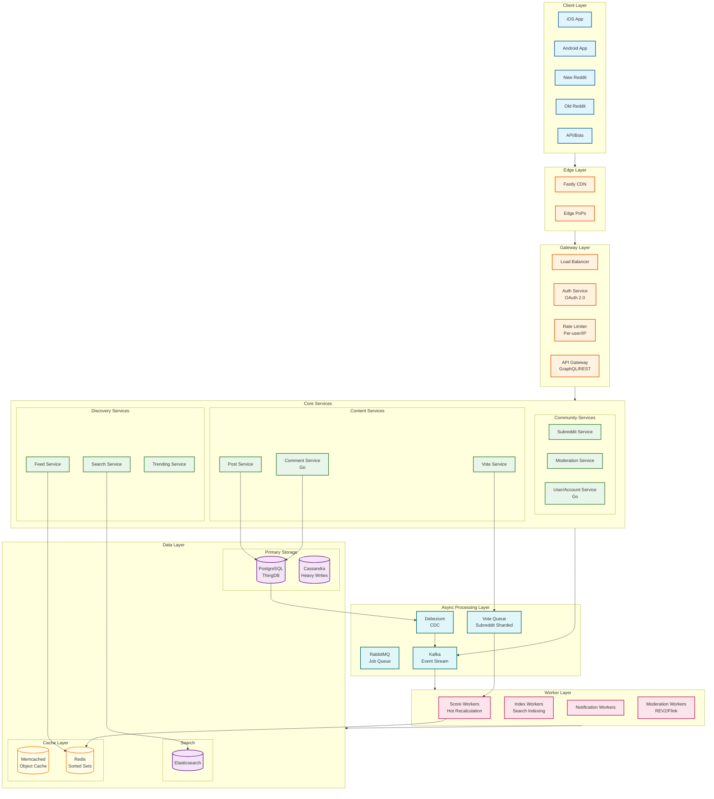
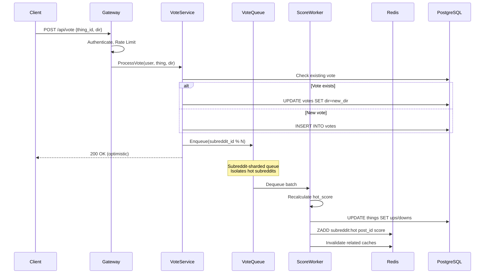
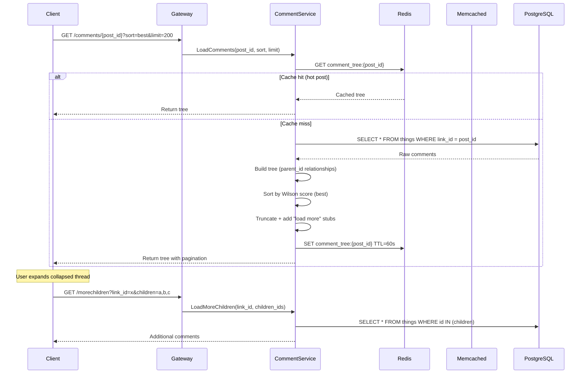
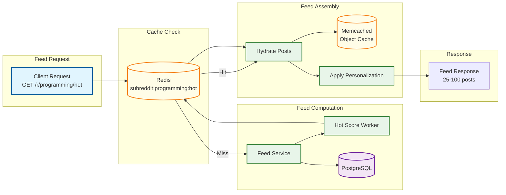
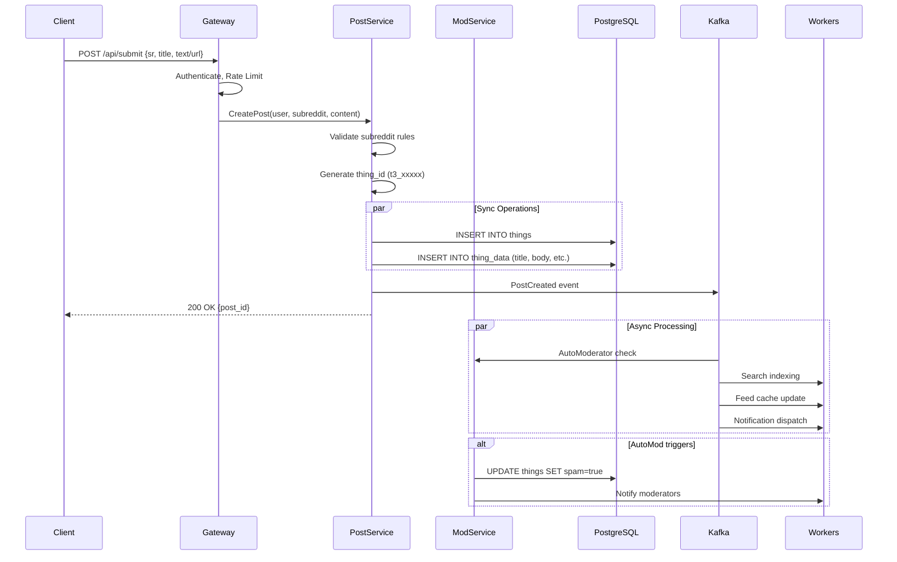
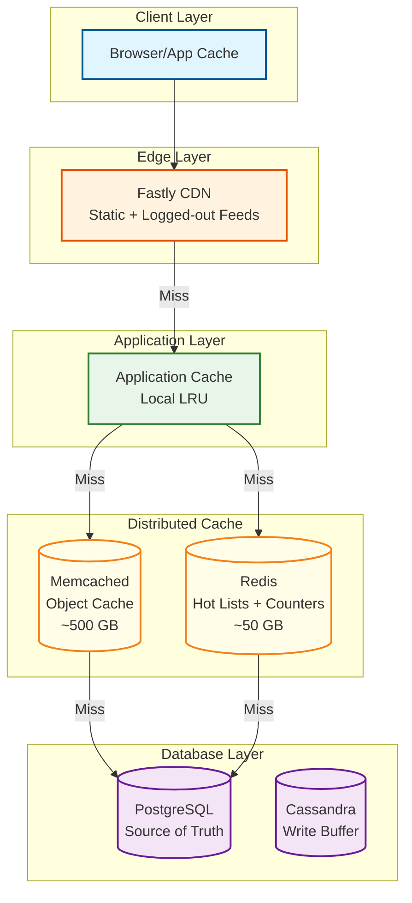
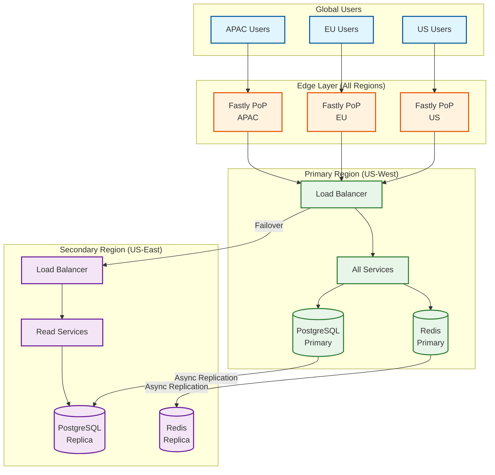

# Reddit: High-Level Design

[← Back to Index](./00-index.md) | [← Requirements](./01-requirements-and-estimations.md) | [Next: Low-Level Design →](./03-low-level-design.md)

---

## Table of Contents

1. [System Architecture](#system-architecture)
2. [Data Flow Diagrams](#data-flow-diagrams)
3. [Key Architectural Decisions](#key-architectural-decisions)
4. [Caching Strategy](#caching-strategy)
5. [Multi-Region Deployment](#multi-region-deployment)
6. [Architecture Pattern Checklist](#architecture-pattern-checklist)

---

## System Architecture

### Component Architecture



### Service Responsibilities

| Service | Responsibility | Dependencies | Scale Characteristics |
|---------|----------------|--------------|----------------------|
| **Post Service** | Post CRUD, media handling | PostgreSQL, CDN | Write: 14 QPS, Read: via Feed |
| **Comment Service** | Comment CRUD, tree management | PostgreSQL, Redis | Write: 87 QPS, Read: 8K QPS |
| **Vote Service** | Vote submission, deduplication | Vote Queue, PostgreSQL | 2K QPS peak |
| **Feed Service** | Home/Popular/All feed assembly | Redis, Memcached | 60K QPS peak |
| **Search Service** | Full-text search | Elasticsearch | 9K QPS peak |
| **Subreddit Service** | Community management | PostgreSQL | Low volume, high cache |
| **Moderation Service** | AutoMod, spam, reports | Flink, PostgreSQL | Real-time stream |
| **User Service** | Accounts, karma, prefs | PostgreSQL | Medium read, low write |

---

## Data Flow Diagrams

### Vote Submission Flow



### Comment Tree Load Flow



### Feed Generation Flow



### Post Creation Flow



---

## Key Architectural Decisions

### Decision 1: ThingDB Data Model

**Context:** Reddit needs a flexible schema to support diverse content types (posts, comments, users, subreddits, awards) while maintaining relational integrity.

**Options Considered:**

| Option | Pros | Cons |
|--------|------|------|
| Traditional Relational | Strong typing, mature tools | Schema migrations painful |
| Document Store (MongoDB) | Flexible schema | Weak consistency, JOINs |
| Wide-Column (Cassandra) | Scale, write performance | No JOINs, query patterns |
| **ThingDB (Hybrid)** | Flexibility + ACID | Custom, learning curve |

**Decision: ThingDB (Two-Table Model)**

```
THINGDB ARCHITECTURE:

Things Table (normalized):
┌─────────────┬────────┬──────┬───────┬─────────────┐
│ id          │ type   │ ups  │ downs │ created_utc │
├─────────────┼────────┼──────┼───────┼─────────────┤
│ t3_abc123   │ 3      │ 1234 │ 56    │ 1704067200  │
│ t1_def456   │ 1      │ 89   │ 2     │ 1704067300  │
└─────────────┴────────┴──────┴───────┴─────────────┘

Data Table (schemaless):
┌─────────────┬───────────────┬─────────────────────────┐
│ thing_id    │ key           │ value                   │
├─────────────┼───────────────┼─────────────────────────┤
│ t3_abc123   │ title         │ "Post title here"       │
│ t3_abc123   │ url           │ "https://example.com"   │
│ t3_abc123   │ author_id     │ "t2_xyz789"             │
│ t3_abc123   │ subreddit_id  │ "t5_2qh1i"              │
└─────────────┴───────────────┴─────────────────────────┘

Benefits:
- Add new attributes without migrations
- Common fields (ups, downs) optimized in Things table
- Type-specific fields in Data table
- ACID guarantees from PostgreSQL
```

### Decision 2: Subreddit-Based Vote Queue Sharding

**Context:** Vote processing is the highest-volume write operation. Hot subreddits (r/funny, r/pics) can overwhelm the system during viral events.

**Options Considered:**

| Option | Pros | Cons |
|--------|------|------|
| Single queue | Simple | Single bottleneck |
| User-based sharding | Even distribution | Doesn't isolate hot content |
| Post-based sharding | Isolates hot posts | Too fine-grained |
| **Subreddit-based** | Isolates hot communities | Some imbalance |

**Decision: Subreddit-Based Queue Partitioning**

```
QUEUE SHARDING STRATEGY:

partition_id = hash(subreddit_id) % N

Where N = 100 (typical)

Example distribution:
  r/funny      → Partition 23
  r/pics       → Partition 67
  r/programming→ Partition 45
  r/AskReddit  → Partition 12

Benefits:
- r/funny viral post doesn't block r/programming
- Per-partition scaling
- Failure isolation
- Predictable routing

Worker allocation:
  - 1-3 workers per partition (auto-scaled)
  - Hot partitions get more workers
  - Cold partitions share workers
```

### Decision 3: Go Migration for Core Services

**Context:** Python r2 monolith had performance limitations. P99 latency for critical paths was problematic.

**Migration Strategy: Tap-Compare Testing**

```
TAP-COMPARE VALIDATION:

1. SHADOW TRAFFIC
   - Copy X% of production traffic to new Go service
   - Return original Python response to user
   - Compare responses offline

2. COMPARE RESPONSES
   - Diff detection for payload differences
   - Latency comparison
   - Error rate monitoring

3. GRADUAL ROLLOUT
   - 1% → 10% → 50% → 100%
   - Automatic rollback on divergence

Results (Comments Service):
  - P99 latency: 800ms → 400ms (50% reduction)
  - P50 latency: 150ms → 75ms
  - Memory usage: 40% reduction
  - Throughput: 3x improvement
```

### Decision 4: Precomputed Hot Lists

**Context:** Real-time hot score calculation for every feed request is computationally expensive.

**Decision: Background Precomputation + Cache**

```
PRECOMPUTATION STRATEGY:

Hot List Worker:
  EVERY 30 seconds:
    FOR each active subreddit:
      posts = fetch_recent_posts(subreddit, 1000)
      FOR post IN posts:
        score = calculate_hot_score(post)
        REDIS.ZADD(subreddit:hot, score, post_id)
      REDIS.ZREMRANGEBYRANK(subreddit:hot, 0, -1001)  // Keep top 1000

On Vote:
  - Queue score recalculation
  - Batch updates every few seconds
  - Eventually consistent (30-60s staleness OK)

Cache TTL:
  - Hot list: 60 seconds
  - Object cache: 5 minutes
  - CDN: 30 seconds (logged out)
```

---

## Caching Strategy

### Multi-Tier Cache Architecture



### Cache Key Patterns

| Data Type | Cache Location | Key Pattern | TTL |
|-----------|----------------|-------------|-----|
| Post object | Memcached | `thing:t3_xxxxx` | 5 min |
| Comment object | Memcached | `thing:t1_xxxxx` | 5 min |
| Comment tree | Redis | `comments:t3_xxxxx` | 60 sec |
| Hot list | Redis | `subreddit:{id}:hot` | 60 sec |
| Rising list | Redis | `subreddit:{id}:rising` | 30 sec |
| User session | Redis | `session:{token}` | 24 hours |
| Subreddit meta | Memcached | `subreddit:t5_xxxxx` | 10 min |
| Vote count | Redis | `thing:{id}:votes` | 5 sec |

### Cache Invalidation Strategy

```
WRITE-THROUGH + ASYNC INVALIDATION:

On Post Update:
  1. Write to PostgreSQL (sync)
  2. Invalidate Memcached key (sync)
  3. Queue hot list recalc (async)
  4. CDN purge if public (async)

On Vote:
  1. Write vote record (sync)
  2. Queue score recalc (async)
  3. Increment counter cache (Redis INCR)
  4. Hot list update via worker (async)

Consistency Model:
  - Post content: Strong (read-your-writes)
  - Vote counts: Eventual (5-30 seconds)
  - Hot rankings: Eventual (30-60 seconds)
```

---

## Multi-Region Deployment

### Geographic Distribution



### Replication Strategy

| Data Type | Replication Mode | Lag Tolerance | Failover |
|-----------|-----------------|---------------|----------|
| Posts/Comments | Async streaming | <5 seconds | Promote replica |
| Votes | Async streaming | <10 seconds | Queue locally |
| User accounts | Sync (critical) | 0 | Block until ACK |
| Hot lists | Compute locally | N/A | Region-independent |
| Sessions | Sync or sticky | 0 | Re-auth on failover |

---

## Architecture Pattern Checklist

| Pattern | Decision | Rationale |
|---------|----------|-----------|
| Sync vs Async | **Hybrid** | Sync for writes, async for score updates |
| Event-driven vs Request-response | **Event-driven** | Kafka for cross-service communication |
| Push vs Pull | **Pull (on-demand)** | Precomputed lists, pulled at read time |
| Stateless vs Stateful | **Stateless services** | All state in Redis/PostgreSQL |
| Read-heavy vs Write-heavy | **Read-heavy optimized** | 100:1 read/write ratio, heavy caching |
| Real-time vs Batch | **Near real-time** | 30-60 second staleness acceptable |
| Edge vs Origin | **Edge for static** | CDN for logged-out, origin for personalized |
| Monolith vs Microservices | **Migrating to microservices** | Go services for critical paths |

---

## Next Steps

- [Low-Level Design →](./03-low-level-design.md) - Data models, APIs, algorithms
