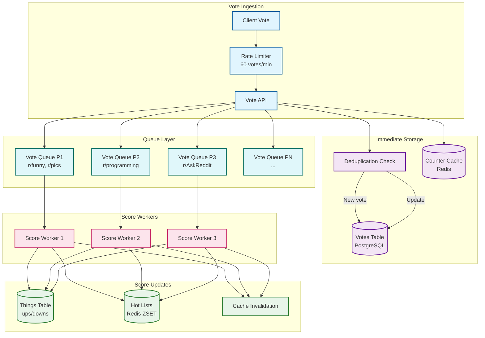
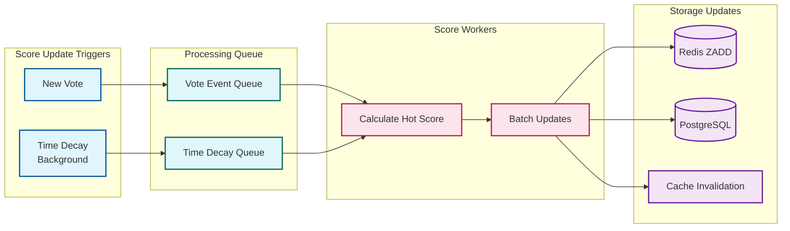

# Reddit: Deep Dives and Bottlenecks

[← Back to Index](./00-index.md) | [← Low-Level Design](./03-low-level-design.md) | [Next: Scalability →](./05-scalability-and-reliability.md)

---

## Table of Contents

1. [Deep Dive 1: Vote Processing Pipeline](#deep-dive-1-vote-processing-pipeline)
2. [Deep Dive 2: Comment Tree Construction](#deep-dive-2-comment-tree-construction)
3. [Deep Dive 3: Hot Algorithm Score Updates](#deep-dive-3-hot-algorithm-score-updates)
4. [Deep Dive 4: Subreddit Isolation](#deep-dive-4-subreddit-isolation)
5. [Bottleneck Analysis](#bottleneck-analysis)
6. [Race Conditions and Concurrency](#race-conditions-and-concurrency)

---

## Deep Dive 1: Vote Processing Pipeline

### Architecture Overview



### Vote Submission Flow (Detailed)

```
VOTE SUBMISSION SEQUENCE:

1. CLIENT REQUEST
   POST /api/vote {id: "t3_abc123", dir: 1}

2. RATE LIMITING
   key = "rate:vote:{user_id}:{minute}"
   count = REDIS.INCR(key)
   IF count == 1: REDIS.EXPIRE(key, 60)
   IF count > 60: RETURN 429 Too Many Requests

3. DEDUPLICATION CHECK
   existing = SELECT direction FROM votes
              WHERE user_id = :user AND thing_id = :thing

   IF existing:
     IF existing.direction == new_direction:
       RETURN 200 (idempotent)
     ELSE:
       UPDATE votes SET direction = :new_dir
       delta = new_direction - existing.direction
   ELSE:
     INSERT INTO votes (user_id, thing_id, direction)
     delta = new_direction

4. OPTIMISTIC UI UPDATE
   REDIS.HINCRBY("thing:{thing_id}:votes", "score", delta)
   RETURN 200 OK (immediately)

5. QUEUE FOR ASYNC PROCESSING
   subreddit_id = lookup_subreddit(thing_id)
   partition = hash(subreddit_id) % 100
   QUEUE.enqueue(partition, {
     thing_id: thing_id,
     delta: delta,
     subreddit_id: subreddit_id,
     timestamp: now()
   })

6. SCORE WORKER PROCESSING
   batch = QUEUE.dequeue(partition, batch_size=100)
   FOR vote_event IN batch:
     // Update denormalized counts
     UPDATE things SET
       ups = ups + (delta > 0 ? delta : 0),
       downs = downs + (delta < 0 ? -delta : 0)
     WHERE id = vote_event.thing_id

     // Recalculate hot score
     thing = SELECT * FROM things WHERE id = :thing_id
     hot_score = calculate_hot_score(thing.ups, thing.downs, thing.created_utc)

     // Update hot list
     REDIS.ZADD(
       "subreddit:{subreddit_id}:hot",
       hot_score,
       thing_id
     )

7. CACHE INVALIDATION
   MEMCACHED.delete("thing:{thing_id}")
```

### Vote Queue Sharding Details

```
SUBREDDIT-BASED QUEUE PARTITIONING:

Goal: Isolate hot subreddits from affecting others

Implementation:
    N = 100 partitions (configurable)
    partition_id = consistent_hash(subreddit_id) % N

Distribution Analysis:
    100,000 active subreddits / 100 partitions = 1,000 subreddits/partition
    58M votes/day / 100 partitions = 580,000 votes/day/partition

Hot Subreddit Handling:
    r/pics (10M subscribers) → Partition 23
    r/funny (40M subscribers) → Partition 67

    If r/pics goes viral:
      - Only partition 23 experiences load spike
      - Partitions 0-22, 24-99 unaffected
      - Auto-scale workers for partition 23

Worker Allocation:
    Base: 1 worker per partition
    Auto-scale: Add workers when queue depth > threshold
    Max: 10 workers per partition

    Hot partition: 5-10 workers
    Cold partition: 1 shared worker
```

### Vote Manipulation Detection

```
MANIPULATION DETECTION LAYERS:

1. VELOCITY CHECKS
   FUNCTION check_velocity(user_id, thing_id):
     // Max votes per user per hour
     hourly_votes = REDIS.GET("user_votes:{user_id}:{hour}")
     IF hourly_votes > 500:
       FLAG user_id FOR review
       RETURN RATE_LIMITED

     // Subreddit-specific limits
     sr_votes = REDIS.GET("user_sr_votes:{user_id}:{subreddit_id}:{hour}")
     IF sr_votes > 100:
       FLAG (user_id, subreddit_id) FOR review
       RETURN RATE_LIMITED

2. RING DETECTION
   FUNCTION detect_voting_ring(thing_id):
     recent_voters = SELECT user_id FROM votes
                     WHERE thing_id = :thing_id
                     AND created_utc > now() - interval '1 hour'

     // Check for IP clustering
     ips = get_ips(recent_voters)
     ip_clusters = cluster_by_subnet(ips)
     FOR cluster IN ip_clusters:
       IF cluster.size > 5:
         FLAG cluster.users FOR review

     // Check for account age patterns
     ages = SELECT created_utc FROM accounts WHERE id IN recent_voters
     IF median(ages) < 7 days AND count > 10:
       FLAG thing_id FOR investigation

3. SHADOWBANNING
   FUNCTION is_shadowbanned(user_id):
     RETURN REDIS.SISMEMBER("shadowbanned", user_id)

   FUNCTION process_vote(user_id, thing_id, direction):
     IF is_shadowbanned(user_id):
       // Store vote but don't affect score
       INSERT INTO votes ... -- Normal insert
       // Skip score update and queue
       RETURN SUCCESS  // User thinks vote counted

4. BOT DETECTION (REV2 Pipeline)
   Stream: votes → Kafka → Flink → REV2 ML
   Features:
     - Vote timing patterns
     - Session behavior
     - Account characteristics
     - Historical accuracy
   Actions:
     - Score < 0.3: Allow
     - Score 0.3-0.7: Rate limit
     - Score > 0.7: Shadowban
```

---

## Deep Dive 2: Comment Tree Construction

### Tree Data Structure

```
COMMENT TREE REPRESENTATION:

Database Storage (flat):
┌──────────────┬──────────────┬───────┬───────┐
│ id           │ parent_id    │ score │ depth │
├──────────────┼──────────────┼───────┼───────┤
│ t1_a         │ t3_post      │ 100   │ 0     │  ← Root comment
│ t1_b         │ t1_a         │ 50    │ 1     │  ← Reply to a
│ t1_c         │ t1_a         │ 30    │ 1     │  ← Reply to a
│ t1_d         │ t1_b         │ 20    │ 2     │  ← Reply to b
│ t1_e         │ t3_post      │ 80    │ 0     │  ← Root comment
│ t1_f         │ t1_e         │ 10    │ 1     │  ← Reply to e
└──────────────┴──────────────┴───────┴───────┘

In-Memory Tree (after construction):
{
  "t1_a": {
    "score": 100,
    "children": [
      {
        "id": "t1_b",
        "score": 50,
        "children": [
          {"id": "t1_d", "score": 20, "children": []}
        ]
      },
      {"id": "t1_c", "score": 30, "children": []}
    ]
  },
  "t1_e": {
    "score": 80,
    "children": [
      {"id": "t1_f", "score": 10, "children": []}
    ]
  }
}
```

### Tree Construction Algorithm

```
ALGORITHM Build_Efficient_Comment_Tree

FUNCTION build_tree(post_id, sort, limit, max_depth):
    // Phase 1: Fetch all comments (single query)
    comments = db.query("""
        SELECT t.id, t.ups, t.downs, t.created_utc,
               d1.value as body,
               d2.value as parent_id,
               d3.value as author_id
        FROM things t
        JOIN thing_data d1 ON t.id = d1.thing_id AND d1.key = 'body'
        JOIN thing_data d2 ON t.id = d2.thing_id AND d2.key = 'parent_id'
        JOIN thing_data d3 ON t.id = d3.thing_id AND d3.key = 'author_id'
        WHERE t.id IN (
            SELECT thing_id FROM thing_data
            WHERE key = 'link_id' AND value = :post_id
        )
        AND t.deleted = FALSE
        AND t.spam = FALSE
    """, post_id=post_id)

    // Phase 2: Build parent-child index
    children_index = defaultdict(list)
    comment_map = {}

    FOR comment IN comments:
        comment_map[comment.id] = comment
        children_index[comment.parent_id].append(comment)

    // Phase 3: Sort children at each level
    FOR parent_id, children IN children_index.items():
        children_index[parent_id] = sort_by(children, sort)

    // Phase 4: Build tree with depth limiting
    roots = children_index.get(post_id, [])
    tree = []
    total_count = 0

    FOR root IN roots:
        IF total_count >= limit:
            remaining = roots[roots.index(root):]
            tree.append({
                "kind": "more",
                "data": {
                    "count": len(remaining),
                    "children": [r.id for r in remaining[:5]]
                }
            })
            BREAK

        node, count = build_subtree(
            root, children_index, 0, max_depth, limit - total_count
        )
        tree.append(node)
        total_count += count

    RETURN tree

FUNCTION build_subtree(comment, children_index, depth, max_depth, remaining):
    node = {
        "kind": "t1",
        "data": serialize_comment(comment),
        "replies": {"data": {"children": []}}
    }

    IF depth >= max_depth OR remaining <= 1:
        children = children_index.get(comment.id, [])
        IF children:
            node["replies"]["data"]["children"].append({
                "kind": "more",
                "data": {
                    "count": len(children),
                    "children": [c.id for c in children[:5]]
                }
            })
        RETURN node, 1

    children = children_index.get(comment.id, [])
    subtree_count = 1  // This comment

    FOR child IN children:
        IF subtree_count >= remaining:
            rest = children[children.index(child):]
            node["replies"]["data"]["children"].append({
                "kind": "more",
                "data": {
                    "count": len(rest),
                    "children": [c.id for c in rest[:5]]
                }
            })
            BREAK

        child_node, child_count = build_subtree(
            child, children_index, depth + 1, max_depth, remaining - subtree_count
        )
        node["replies"]["data"]["children"].append(child_node)
        subtree_count += child_count

    RETURN node, subtree_count
```

### "Load More" Pagination

```
LOAD MORE IMPLEMENTATION:

Scenario: User clicks "load more replies" on a collapsed thread

Request:
  GET /api/morechildren?
    link_id=t3_abc123&
    children=t1_x,t1_y,t1_z&
    sort=best

Processing:
  1. VALIDATE
     - Verify children belong to link_id
     - Check user has permission

  2. FETCH COMMENTS
     comments = SELECT * FROM things
                WHERE id IN (:children)
                AND deleted = FALSE

  3. FETCH DESCENDANTS
     descendants = SELECT * FROM things
                   WHERE id IN (
                     SELECT thing_id FROM thing_data
                     WHERE key = 'parent_id'
                     AND value IN (:children)
                   )

  4. BUILD SUBTREES
     FOR child_id IN children:
       subtree = build_subtree(
         comment_map[child_id],
         children_index,
         current_depth,
         max_depth=10,
         remaining=50
       )
       results.append(subtree)

  5. RETURN
     {"json": {"data": {"things": results}}}

Client-Side:
  - Replace "more" placeholder with returned comments
  - Maintain scroll position
  - Update comment count
```

### Comment Tree Caching

```
CACHING STRATEGY:

Cache Structure:
  KEY: comments:{post_id}:{sort}
  VALUE: Serialized comment tree (MessagePack)
  TTL: 60 seconds for hot posts, 300 for cold

Cache Population:
  1. On cache miss: Build tree, cache result
  2. On comment create: Invalidate cache
  3. On vote: Don't invalidate (eventual consistency OK)

Cache Invalidation:
  FUNCTION on_comment_change(post_id):
    // Invalidate all sort variants
    FOR sort IN ["best", "top", "new", "controversial", "old"]:
      REDIS.DELETE(f"comments:{post_id}:{sort}")

    // Also invalidate parent if nested
    parent_post = get_parent_post(comment)
    IF parent_post != post_id:
      REDIS.DELETE(f"comments:{parent_post}:*")

Precomputation for Hot Posts:
  WORKER:
    FOR post IN get_hot_posts(limit=1000):
      FOR sort IN ["best", "top", "new"]:
        IF NOT REDIS.EXISTS(f"comments:{post.id}:{sort}"):
          tree = build_tree(post.id, sort, 200, 10)
          REDIS.SETEX(f"comments:{post.id}:{sort}", 300, serialize(tree))
```

---

## Deep Dive 3: Hot Algorithm Score Updates

### Score Update Pipeline



### Batch Score Recalculation

```
BATCH SCORE UPDATE STRATEGY:

Problem: 58M votes/day = 670 QPS
         Each vote triggers hot score recalc
         Need efficient batch processing

Solution: Batch + Debounce + Priority

ALGORITHM Batch_Score_Update:

  CONSTANTS:
    BATCH_SIZE = 100
    BATCH_WINDOW = 1 second
    HIGH_PRIORITY_THRESHOLD = 1000  // Hot post votes

  DATA STRUCTURES:
    pending_updates = PriorityQueue()  // (priority, thing_id, timestamp)
    last_update = HashMap()  // thing_id -> timestamp

  FUNCTION enqueue_score_update(thing_id, vote_delta):
    // Check if update already pending
    IF thing_id IN pending_updates:
      RETURN  // Debounce

    // Determine priority
    score = get_current_score(thing_id)
    IF score > HIGH_PRIORITY_THRESHOLD:
      priority = 0  // High priority for hot posts
    ELSE:
      priority = 1  // Normal priority

    pending_updates.add((priority, thing_id, now()))

  WORKER:
    WHILE TRUE:
      batch = []
      deadline = now() + BATCH_WINDOW

      WHILE len(batch) < BATCH_SIZE AND now() < deadline:
        item = pending_updates.pop_with_timeout(deadline - now())
        IF item:
          batch.append(item.thing_id)

      IF batch:
        process_batch(batch)

  FUNCTION process_batch(thing_ids):
    // Fetch current state in one query
    things = SELECT id, ups, downs, created_utc FROM things
             WHERE id IN (:thing_ids)

    // Calculate all scores
    updates = []
    FOR thing IN things:
      hot_score = calculate_hot_score(thing.ups, thing.downs, thing.created_utc)
      subreddit_id = get_subreddit(thing.id)
      updates.append((subreddit_id, thing.id, hot_score))

    // Batch update Redis
    pipe = REDIS.pipeline()
    FOR (subreddit_id, thing_id, score) IN updates:
      pipe.ZADD(f"subreddit:{subreddit_id}:hot", {thing_id: score})
    pipe.execute()

    // Update last_update timestamps
    FOR thing_id IN thing_ids:
      last_update[thing_id] = now()
```

### Time-Based Score Decay

```
TIME DECAY HANDLING:

Problem: Hot score depends on time
         Scores need updating even without new votes
         Can't recalculate all scores continuously

Solution: Selective recalculation based on ranking impact

ALGORITHM Time_Decay_Update:

  CONSTANTS:
    RECALC_INTERVAL = 60 seconds
    TOP_N_TO_RECALC = 100  // Per subreddit

  BACKGROUND_WORKER:
    EVERY RECALC_INTERVAL:
      FOR subreddit_id IN get_active_subreddits():
        recalculate_top_n(subreddit_id, TOP_N_TO_RECALC)

  FUNCTION recalculate_top_n(subreddit_id, n):
    // Get current top N from Redis
    current_top = REDIS.ZREVRANGE(f"subreddit:{subreddit_id}:hot", 0, n-1)

    // Also get recent posts that might rise
    recent_posts = SELECT id FROM things
                   WHERE subreddit_id = :subreddit_id
                   AND created_utc > now() - interval '24 hours'
                   ORDER BY (ups - downs) DESC
                   LIMIT n

    candidates = set(current_top) | set(recent_posts)

    // Recalculate scores
    FOR thing_id IN candidates:
      thing = get_thing(thing_id)
      new_score = calculate_hot_score(thing.ups, thing.downs, thing.created_utc)
      REDIS.ZADD(f"subreddit:{subreddit_id}:hot", {thing_id: new_score})

    // Trim to top 1000
    REDIS.ZREMRANGEBYRANK(f"subreddit:{subreddit_id}:hot", 0, -1001)

OPTIMIZATION: Skip recalculation for posts where:
  - Age > 48 hours (unlikely to rank high)
  - Score < 10 (low impact)
  - Already outside top 500
```

---

## Deep Dive 4: Subreddit Isolation

### The r/all Problem

```
R/ALL AGGREGATION CHALLENGE:

r/all = Top posts from ALL subreddits combined

Naive approach:
  UNION ALL top 100 from each of 100,000 subreddits
  = 10,000,000 candidates
  = Sort by hot score
  = Return top 25

Problems:
  1. Massive data volume
  2. Cross-shard query
  3. Constantly changing
  4. Hot subreddits dominate

SOLUTION: Sampled Aggregation with Rate Limiting

ALGORITHM R_All_Aggregation:

  CONSTANTS:
    SAMPLE_SIZE = 100  // Posts per subreddit
    MAX_PER_SUBREDDIT = 3  // Diversity limit
    REFRESH_INTERVAL = 60 seconds

  FUNCTION compute_r_all():
    global_candidates = []

    // Sample from each subreddit
    FOR subreddit IN get_subreddits_by_activity():
      top_posts = REDIS.ZREVRANGE(
        f"subreddit:{subreddit.id}:hot",
        0, SAMPLE_SIZE - 1,
        WITHSCORES
      )

      // Weight by subreddit size (but cap it)
      weight = min(log10(subreddit.subscribers), 3)

      FOR (post_id, score) IN top_posts:
        adjusted_score = score * weight
        global_candidates.append((post_id, adjusted_score, subreddit.id))

    // Sort by adjusted score
    global_candidates.sort(key=lambda x: x[1], reverse=True)

    // Apply diversity constraints
    result = []
    subreddit_counts = defaultdict(int)

    FOR (post_id, score, subreddit_id) IN global_candidates:
      IF subreddit_counts[subreddit_id] >= MAX_PER_SUBREDDIT:
        CONTINUE
      result.append(post_id)
      subreddit_counts[subreddit_id] += 1
      IF len(result) >= 1000:
        BREAK

    // Cache result
    REDIS.DELETE("r_all:hot")
    REDIS.ZADD("r_all:hot", {pid: i for i, pid in enumerate(result)})
    REDIS.EXPIRE("r_all:hot", REFRESH_INTERVAL)

    RETURN result
```

### Hot Subreddit Isolation

```
HOT SUBREDDIT HANDLING:

Scenario: r/wallstreetbets goes viral (GME event, 2021)
  - Normal: 500K votes/day
  - Viral: 10M votes/day (20x)

Without Isolation:
  - Vote queue backs up
  - Score updates delayed for ALL subreddits
  - Site-wide degradation

With Subreddit Sharding:
  - r/wallstreetbets → Partition 42
  - Partition 42 experiences 20x load
  - Other partitions unaffected

Auto-Scaling Response:
  1. DETECT
     queue_depth = QUEUE.get_depth(partition=42)
     IF queue_depth > 10000:
       ALERT("Hot partition: 42")

  2. SCALE
     current_workers = get_worker_count(partition=42)
     target_workers = min(current_workers * 2, 20)
     scale_workers(partition=42, target_workers)

  3. DEGRADE (if necessary)
     IF queue_depth > 100000:
       // Skip score recalc, just store votes
       enable_degraded_mode(partition=42)
       // Batch recalc later

  4. RECOVER
     WHEN queue_depth < 1000:
       disable_degraded_mode(partition=42)
       scale_workers(partition=42, baseline)
```

---

## Bottleneck Analysis

### Bottleneck 1: Hot Subreddit Write Amplification

```
PROBLEM:
  r/pics gets 10x normal traffic during viral post
  Each vote triggers: vote write + score update + hot list update
  Write amplification: 4x per vote

MANIFESTATION:
  - Vote queue backs up (>10s lag)
  - Hot list becomes stale
  - User sees outdated scores

MITIGATION:
  1. Subreddit-sharded queues (isolate impact)
  2. Batch score updates (reduce write ops)
  3. Optimistic UI (user sees immediate feedback)
  4. Degraded mode (skip score updates during extreme load)
  5. Auto-scaling workers (more capacity for hot partitions)

MONITORING:
  - vote_queue_depth{subreddit} > 10000
  - vote_processing_lag{subreddit} > 10s
  - hot_list_staleness{subreddit} > 60s
```

### Bottleneck 2: Viral Post Comment Trees

```
PROBLEM:
  Popular post gets 10K+ comments
  Tree construction becomes expensive
  Memory pressure from large trees

MANIFESTATION:
  - Comment load latency > 2s
  - OOM errors on comment service
  - "Load more" pagination slow

MITIGATION:
  1. Aggressive truncation
     - Initial load: 200 comments max
     - Depth limit: 10 levels
     - "Load more" stubs for the rest

  2. Precomputation for hot posts
     - Background worker builds trees
     - Cached for 60s
     - Serve stale during rebuild

  3. Progressive loading
     - Load top-level first
     - Lazy load children on expand
     - Pagination for siblings

  4. Comment tree sharding (extreme cases)
     - Split tree into chunks
     - Load by subtree

MONITORING:
  - comment_tree_build_time > 1s
  - comment_tree_size > 10MB
  - comment_load_latency_p99 > 2s
```

### Bottleneck 3: Vote Count Consistency

```
PROBLEM:
  User votes, refreshes, sees old count
  Vote count shows different values on different loads
  "My vote didn't count"

MANIFESTATION:
  - User confusion
  - Support tickets
  - Perception of vote manipulation

MITIGATION:
  1. Optimistic UI
     - Client increments/decrements immediately
     - Server confirms asynchronously
     - Client reconciles on next load

  2. Read-your-writes for own votes
     - Store user's recent votes in session
     - On page load, apply own votes to displayed count
     - Eventually consistent for others

  3. Sticky sessions (optional)
     - User always hits same cache replica
     - Consistent view (but operational cost)

  4. Version vectors
     - Track vote version
     - Display "updating..." for stale counts

MONITORING:
  - vote_count_divergence (compare cache vs DB)
  - vote_ack_latency > 30s
```

---

## Race Conditions and Concurrency

### Race Condition 1: Concurrent Votes

```
SCENARIO:
  User votes from two devices simultaneously
  Both requests see "no existing vote"
  Both insert new votes

CONSEQUENCE:
  Duplicate vote records
  Double-counted score

SOLUTION: Optimistic Locking + Upsert

  -- PostgreSQL UPSERT with conflict handling
  INSERT INTO votes (user_id, thing_id, direction, created_utc)
  VALUES (:user, :thing, :dir, now())
  ON CONFLICT (user_id, thing_id) DO UPDATE
  SET direction = EXCLUDED.direction,
      created_utc = now()
  RETURNING (xmax = 0) AS is_new;

  -- Returns is_new = TRUE for insert, FALSE for update
  -- Atomically handles race condition
```

### Race Condition 2: Comment Tree Updates

```
SCENARIO:
  Two users reply to same comment simultaneously
  Both build trees from same snapshot
  One overwrites the other's changes

CONSEQUENCE:
  Lost comment in display
  Inconsistent tree cache

SOLUTION: Invalidate-on-Write (No Concurrent Writes)

  FUNCTION add_comment(parent_id, body):
    // Write comment to DB
    comment_id = insert_comment(...)

    // Invalidate cache (don't try to update)
    post_id = get_post_id(parent_id)
    REDIS.DELETE(f"comments:{post_id}:*")

    // Next read will rebuild tree
    RETURN comment_id

  -- Tree cache is read-only
  -- Always rebuilt from source of truth
  -- Eventual consistency acceptable
```

### Race Condition 3: Score vs. Hot List Mismatch

```
SCENARIO:
  Vote updates thing.score
  Before hot list updated, another read occurs
  Post shows new score but old ranking

CONSEQUENCE:
  Post at wrong position in feed
  User confusion

SOLUTION: Accept Eventual Consistency

  -- This is acceptable because:
  1. Hot list updates within 30 seconds
  2. User perceives as "normal" feed behavior
  3. No data corruption

  -- Optimization: For user's own votes
  FUNCTION get_feed_with_own_votes(user_id, subreddit_id):
    feed = get_hot_feed(subreddit_id)
    own_votes = get_user_votes(user_id, feed.post_ids)

    FOR post IN feed:
      IF post.id IN own_votes:
        // Apply user's pending vote to display
        post.score = post.score + own_votes[post.id].delta
        post.voted = own_votes[post.id].direction

    RETURN feed
```

---

## Next Steps

- [Scalability & Reliability →](./05-scalability-and-reliability.md)
