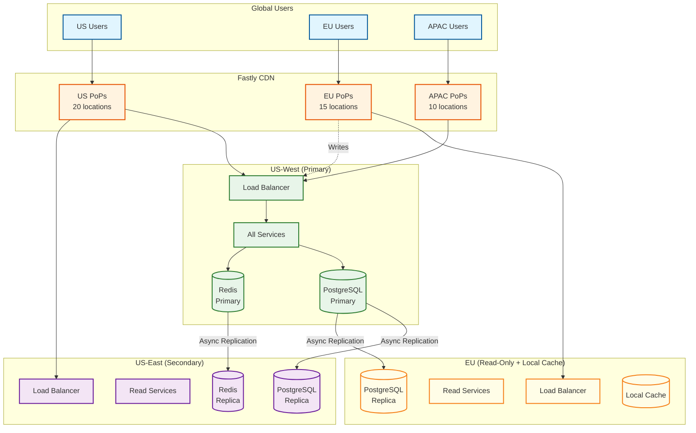

# Reddit: Scalability and Reliability

[← Back to Index](./00-index.md) | [← Deep Dives](./04-deep-dive-and-bottlenecks.md) | [Next: Security →](./06-security-and-compliance.md)

---

## Table of Contents

1. [Horizontal Scaling Strategy](#horizontal-scaling-strategy)
2. [Go Migration Impact](#go-migration-impact)
3. [Multi-Region Architecture](#multi-region-architecture)
4. [Caching Architecture](#caching-architecture)
5. [Fault Tolerance](#fault-tolerance)
6. [Disaster Recovery](#disaster-recovery)
7. [Load Balancing](#load-balancing)
8. [Capacity Planning](#capacity-planning)

---

## Horizontal Scaling Strategy

### Service Scaling Matrix

| Service | Scaling Type | Trigger Metric | Scale Unit | Max Instances |
|---------|-------------|----------------|------------|---------------|
| Vote Service | Horizontal | CPU > 70% | +2 pods | 50 |
| Feed Service | Horizontal | QPS/pod > 1000 | +4 pods | 100 |
| Comment Service | Horizontal | Latency p99 > 200ms | +2 pods | 40 |
| Post Service | Horizontal | QPS/pod > 500 | +2 pods | 30 |
| Vote Workers | Horizontal | Queue depth > 5000 | +1 worker/partition | 10/partition |
| Search Service | Horizontal | CPU > 60% | +2 pods | 30 |

### Auto-Scaling Configuration

```
AUTO-SCALING POLICIES:

Vote Service:
  min_replicas: 10
  max_replicas: 50
  metrics:
    - type: Resource
      resource: cpu
      target: 70%
    - type: Pods
      pods:
        metric: http_requests_per_second
        target: 500
  scale_up:
    stabilization_window: 30s
    policies:
      - type: Pods
        value: 4
        period: 60s
  scale_down:
    stabilization_window: 300s
    policies:
      - type: Percent
        value: 10
        period: 60s

Vote Workers (per partition):
  min_replicas: 1
  max_replicas: 10
  metrics:
    - type: External
      external:
        metric: rabbitmq_queue_depth
        target: 5000
  scale_up:
    policies:
      - type: Pods
        value: 2
        period: 30s
```

### Database Scaling

```
POSTGRESQL SCALING:

Primary-Replica Architecture:
  Primary: 1 (writes)
  Replicas: 8 (reads)
  Replica lag: < 100ms

Sharding Strategy:
  Shard key: subreddit_id
  Shards: 32 (initial), expandable to 256
  Rebalancing: Online, using logical replication

Read Distribution:
  - Feed queries → Replicas (round-robin)
  - Vote writes → Primary
  - Comment reads → Replicas (with read-your-writes for author)

Connection Pooling:
  - PgBouncer per service
  - Pool size: 100 connections/service
  - Transaction mode for short queries
  - Session mode for long transactions

REDIS SCALING:

Cluster Mode:
  - 16 shards (initial)
  - 3 replicas per shard
  - Auto-failover via Sentinel

Memory Distribution:
  - Hot lists: 4 shards
  - Comment trees: 8 shards
  - Counters: 4 shards

Eviction Policy:
  - allkeys-lru for hot lists
  - volatile-ttl for comment trees
```

---

## Go Migration Impact

### Migration Results

```
COMMENTS SERVICE MIGRATION (Python → Go):

Performance Improvements:
┌─────────────────────────────────────────────────────────────────┐
│ Metric              │ Before (Python) │ After (Go) │ Change    │
├─────────────────────┼─────────────────┼────────────┼───────────┤
│ P50 Latency         │ 150ms           │ 75ms       │ -50%      │
│ P99 Latency         │ 800ms           │ 400ms      │ -50%      │
│ P99.9 Latency       │ 2,000ms         │ 600ms      │ -70%      │
│ Memory per instance │ 4 GB            │ 1.5 GB     │ -62%      │
│ CPU per request     │ 50ms            │ 15ms       │ -70%      │
│ Instances needed    │ 40              │ 15         │ -62%      │
│ Error rate          │ 0.1%            │ 0.02%      │ -80%      │
└─────────────────────────────────────────────────────────────────┘

Cost Savings:
  - Compute: 60% reduction
  - Memory: 62% reduction
  - Operational overhead: Fewer instances to manage
```

### Tap-Compare Testing Strategy

```
TAP-COMPARE VALIDATION:

Phase 1: Shadow Traffic (Week 1-2)
  ┌─────────────┐
  │ Load        │──→ [Python Service] ──→ Response to user
  │ Balancer    │
  │             │──→ [Go Service] ──→ Compare (async)
  └─────────────┘

  Comparison Logic:
    - Response body diff (ignore timestamps)
    - Status code match
    - Latency comparison
    - Error rate comparison

  Success Criteria:
    - Response match > 99.9%
    - P99 latency improvement
    - Error rate not worse

Phase 2: Canary (Week 3)
  - 1% traffic to Go service
  - Monitor for 48 hours
  - Automatic rollback on errors

Phase 3: Gradual Rollout (Week 4-6)
  - 1% → 5% → 10% → 25% → 50% → 100%
  - Each stage: 24-48 hour bake time
  - Manual approval for each stage

Phase 4: Decommission (Week 7+)
  - Remove Python service
  - Update documentation
  - Archive old code
```

### Services Migrated

| Service | Status | Migration Date | Impact |
|---------|--------|----------------|--------|
| Comments | Completed | 2024 Q3 | 50% latency reduction |
| Accounts | Completed | 2024 Q4 | 45% latency reduction |
| Posts | In Progress | 2025 Q2 | Expected 40% reduction |
| Subreddits | Planned | 2025 Q4 | Expected 35% reduction |
| Vote Service | Planned | 2026 Q1 | Expected 50% reduction |

---

## Multi-Region Architecture

### Geographic Distribution



### Replication Strategy

| Data Type | Replication Mode | Lag Tolerance | Failover Approach |
|-----------|-----------------|---------------|-------------------|
| Posts/Comments | Streaming async | < 5s | Promote replica |
| Votes | Streaming async | < 10s | Queue locally, replay |
| User accounts | Sync (critical) | 0 | Block until ACK |
| Hot lists | Compute locally | N/A | Region-independent |
| Sessions | Sync or sticky | 0 | Re-authenticate |

### Cross-Region Traffic Routing

```
ROUTING LOGIC:

1. DNS-BASED GEOLOCATION
   - Fastly DNS returns nearest PoP
   - Fallback to US if PoP unavailable

2. CDN EDGE LOGIC
   - Logged-out: Serve from edge cache
   - Logged-in: Route to origin region

3. WRITE ROUTING
   - All writes → US-West (primary)
   - EU/APAC writes: Higher latency, but consistent

4. READ ROUTING
   - Reads → Nearest region with replica
   - Hot content: Edge-cached

LATENCY TARGETS:
  Region        Read (p50)   Write (p50)
  US-West       50ms         100ms
  US-East       75ms         150ms
  EU            100ms        200ms
  APAC          150ms        250ms
```

---

## Caching Architecture

### Multi-Layer Cache

```
CACHE HIERARCHY:

Layer 1: CDN Edge Cache (Fastly)
  - Static assets: Infinite TTL
  - Logged-out feeds: 30s TTL
  - Subreddit metadata: 60s TTL
  - Hit rate: 95%+

Layer 2: Application Cache (Local LRU)
  - Per-pod memory cache
  - Hot objects: 10s TTL
  - Size: 500MB per pod
  - Hit rate: 30%

Layer 3: Distributed Cache (Redis)
  - Hot lists: 60s TTL
  - Comment trees: 60-300s TTL
  - Vote counts: 5s TTL
  - Size: 50GB cluster
  - Hit rate: 85%

Layer 4: Object Cache (Memcached)
  - Post objects: 5min TTL
  - Comment objects: 5min TTL
  - User objects: 10min TTL
  - Size: 500GB cluster
  - Hit rate: 90%

Layer 5: Database (PostgreSQL)
  - Source of truth
  - Query result cache: 60s
  - Connection pool: 100/service
```

### Cache Warming

```
CACHE WARMING STRATEGY:

On Deploy:
  FUNCTION warm_caches():
    // Warm hot subreddits
    top_subreddits = get_top_subreddits(1000)
    FOR subreddit IN top_subreddits:
      ASYNC warm_subreddit_cache(subreddit)

    // Warm hot posts
    hot_posts = get_hot_posts(5000)
    FOR post IN hot_posts:
      ASYNC warm_post_cache(post)

  FUNCTION warm_subreddit_cache(subreddit):
    // Warm hot list
    compute_hot_list(subreddit)
    REDIS.SETEX(f"subreddit:{subreddit.id}:hot", 120, hot_list)

    // Warm metadata
    metadata = fetch_subreddit_metadata(subreddit)
    MEMCACHED.SET(f"subreddit:{subreddit.id}", metadata, 600)

  FUNCTION warm_post_cache(post):
    // Warm post object
    MEMCACHED.SET(f"thing:{post.id}", serialize(post), 300)

    // Warm comment tree
    tree = build_comment_tree(post.id, "best", 200, 10)
    REDIS.SETEX(f"comments:{post.id}:best", 300, serialize(tree))

On Cold Start:
  - Pods start with cold cache
  - First 60s: Accept lower hit rate
  - Gradual warm-up from traffic
  - Critical paths: Pre-warm before traffic
```

---

## Fault Tolerance

### Graceful Degradation

```
DEGRADATION MODES:

Level 0: Normal Operation
  - All features available
  - Real-time updates

Level 1: Vote Queue Backup
  Trigger: Vote queue depth > 50,000
  Actions:
    - Store votes in local buffer
    - Skip score recalculation
    - Batch process later
  User Impact: Vote counts stale (10-60s)

Level 2: Comment Service Degraded
  Trigger: Comment service error rate > 5%
  Actions:
    - Serve cached comment trees only
    - Disable new comment submission
    - Show "Comments temporarily unavailable"
  User Impact: Read-only comments

Level 3: Feed Service Degraded
  Trigger: Feed service unavailable
  Actions:
    - Serve stale hot lists from CDN
    - Show "Last updated X minutes ago"
    - Disable personalization
  User Impact: Stale content, no personalization

Level 4: Read-Only Mode
  Trigger: Primary database failover
  Actions:
    - Disable all writes
    - Serve all reads from replicas
    - Queue write requests
  User Impact: No voting, posting, commenting

Level 5: Emergency Static Mode
  Trigger: Multiple cascading failures
  Actions:
    - Serve static homepage
    - "Reddit is experiencing issues"
    - Status page link
  User Impact: Site effectively down
```

### Circuit Breaker Configuration

```
CIRCUIT BREAKER SETTINGS:

Vote Service:
  failure_threshold: 10
  success_threshold: 3
  timeout: 30s
  half_open_requests: 5

  states:
    CLOSED: Normal operation
    OPEN: All requests fail-fast
    HALF_OPEN: Test recovery

PostgreSQL:
  failure_threshold: 5
  timeout: 10s
  fallback: Read from replica

Redis:
  failure_threshold: 20
  timeout: 5s
  fallback: Serve stale data

Elasticsearch:
  failure_threshold: 15
  timeout: 60s
  fallback: "Search unavailable"
```

### Retry Strategy

```
RETRY CONFIGURATION:

Idempotent Operations (GET, DELETE):
  max_retries: 3
  initial_delay: 100ms
  max_delay: 2s
  backoff: exponential (2x)
  jitter: 10%

Non-Idempotent Operations (POST, PUT):
  max_retries: 1 (only on connection error)
  timeout: 5s
  retry_on: [ConnectionError, TimeoutError]
  no_retry_on: [4xx, 5xx responses]

Database Connections:
  max_retries: 5
  initial_delay: 50ms
  max_delay: 5s
  retry_on: [ConnectionError, PoolExhausted]

Queue Operations:
  max_retries: 10
  initial_delay: 1s
  max_delay: 60s
  dead_letter_after: 10 failures
```

---

## Disaster Recovery

### RTO/RPO Targets

| Scenario | RTO | RPO | Strategy |
|----------|-----|-----|----------|
| Single service failure | 30s | 0 | Auto-restart, health checks |
| Availability zone failure | 5min | 0 | Multi-AZ deployment |
| Primary database failure | 15min | < 1min | Automated failover |
| Region failure | 1hr | < 5min | Cross-region replication |
| Complete data loss | 4hr | < 1hr | Backup restoration |

### Backup Strategy

```
BACKUP CONFIGURATION:

PostgreSQL:
  Full backup: Daily (2 AM PST)
  Incremental: Every 15 minutes (WAL shipping)
  Retention: 30 days
  Location: Object storage (cross-region)
  Encryption: AES-256

Redis:
  RDB snapshots: Every 15 minutes
  AOF: Enabled (everysec)
  Retention: 7 days
  Location: Object storage (same region)

Elasticsearch:
  Snapshots: Every 6 hours
  Retention: 14 days
  Location: Object storage

Media (CDN):
  Origin backup: Object storage (multi-region)
  Retention: Indefinite
  Versioning: Enabled

RESTORE PROCEDURES:

Database Restore:
  1. Identify target recovery point
  2. Provision new replica from backup
  3. Apply WAL logs to recovery point
  4. Validate data integrity
  5. Promote to primary
  6. Update connection strings
  7. Verify application connectivity
  Time: 30-60 minutes

Full Region Restore:
  1. Activate DR region
  2. Promote replicas to primaries
  3. Update DNS
  4. Warm caches
  5. Verify functionality
  6. Announce recovery
  Time: 1-2 hours
```

---

## Load Balancing

### Load Balancer Configuration

```
LAYER 7 LOAD BALANCING:

Health Checks:
  path: /health
  interval: 5s
  timeout: 3s
  unhealthy_threshold: 3
  healthy_threshold: 2

Routing Rules:
  /api/vote/* → Vote Service Pool
  /api/comment/* → Comment Service Pool
  /r/*/hot → Feed Service Pool (cached)
  /search/* → Search Service Pool
  /* → Default Service Pool

Session Affinity:
  Type: Cookie-based (for logged-in users)
  Cookie: reddit_session
  TTL: 1 hour
  Fallback: Round-robin

Rate Limiting (at LB):
  Anonymous: 100 req/min
  Logged-in: 600 req/min
  API key: 1200 req/min
  Burst: 2x limit for 5 seconds
```

### Service Mesh (Optional)

```
SERVICE MESH CONFIGURATION:

Sidecar Proxy:
  - mTLS between services
  - Circuit breaker per service
  - Retry policies
  - Load balancing (least connections)

Traffic Management:
  - Canary deployments (1%, 10%, 50%, 100%)
  - A/B testing (header-based routing)
  - Traffic mirroring (shadow traffic)

Observability:
  - Automatic tracing
  - Per-service metrics
  - Access logs
```

---

## Capacity Planning

### Growth Projections

```
5-YEAR GROWTH PROJECTIONS:

Year 1 (Current):
  DAU: 116M
  Votes/day: 58M
  Comments/day: 7.5M
  Posts/day: 1.2M

Year 2 (+15%):
  DAU: 133M
  Votes/day: 67M
  Comments/day: 8.6M
  Posts/day: 1.4M

Year 3 (+12%):
  DAU: 149M
  Votes/day: 75M
  Comments/day: 9.6M
  Posts/day: 1.6M

Year 4 (+10%):
  DAU: 164M
  Votes/day: 82M
  Comments/day: 10.6M
  Posts/day: 1.7M

Year 5 (+8%):
  DAU: 177M
  Votes/day: 89M
  Comments/day: 11.4M
  Posts/day: 1.9M

Infrastructure Scaling:
  - Database shards: 32 → 64 (Year 3)
  - Redis cluster: 16 → 32 shards (Year 3)
  - Compute: +50% by Year 5
  - Storage: +100% by Year 5
```

### Capacity Thresholds

| Resource | Current Capacity | Alert Threshold | Critical Threshold |
|----------|------------------|-----------------|-------------------|
| Database CPU | 70% | 80% | 90% |
| Database storage | 50% | 70% | 85% |
| Redis memory | 60% | 75% | 90% |
| Vote queue depth | 5000 | 20000 | 50000 |
| API error rate | 0.1% | 0.5% | 1% |
| P99 latency (feed) | 300ms | 500ms | 1000ms |

---

## Next Steps

- [Security & Compliance →](./06-security-and-compliance.md)
