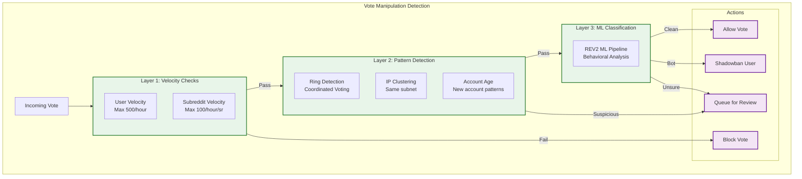

# Reddit: Security and Compliance

[← Back to Index](./00-index.md) | [← Scalability](./05-scalability-and-reliability.md) | [Next: Observability →](./07-observability.md)

---

## Table of Contents

1. [Authentication and Authorization](#authentication-and-authorization)
2. [Rate Limiting](#rate-limiting)
3. [Vote Manipulation Prevention](#vote-manipulation-prevention)
4. [Content Moderation](#content-moderation)
5. [Data Security](#data-security)
6. [Threat Model](#threat-model)
7. [Compliance](#compliance)

---

## Authentication and Authorization

### Authentication Mechanisms

```
AUTHENTICATION FLOW:

1. SESSION-BASED (Web)
   User → Login Form → /api/login
   Server:
     - Validate credentials (bcrypt)
     - Generate session token (random 256-bit)
     - Store in Redis: session:{token} → user_id
     - Set HttpOnly, Secure, SameSite=Lax cookie

   Subsequent Requests:
     - Cookie sent automatically
     - Validate session in Redis
     - Session TTL: 24 hours (refreshed on activity)

2. OAUTH 2.0 (API/Third-party)
   App → /api/v1/authorize → User consent
   User approves → Redirect with code
   App → /api/v1/access_token (code + client_secret)
   Server returns: access_token, refresh_token

   Token Types:
     - Access token: 1 hour TTL
     - Refresh token: 1 year TTL (revocable)
     - Scopes: read, vote, submit, edit, modposts, etc.

3. TWO-FACTOR AUTHENTICATION (Optional)
   - TOTP (Google Authenticator compatible)
   - Backup codes (10 single-use)
   - Required for moderators of large subreddits
```

### Authorization Model

```
PERMISSION MODEL:

User Roles:
  - anonymous: Read public content
  - user: Vote, comment, submit, create subreddits
  - moderator: Per-subreddit permissions
  - admin: Site-wide permissions

Subreddit Permissions (Moderators):
  ┌─────────────────────────────────────────────────────────────────┐
  │ Permission      │ Description                                  │
  ├─────────────────┼──────────────────────────────────────────────┤
  │ access          │ View mod tools                               │
  │ posts           │ Approve/remove posts                         │
  │ wiki           │ Edit subreddit wiki                          │
  │ flair           │ Manage user/post flairs                      │
  │ mail           │ View/respond to modmail                      │
  │ config          │ Change subreddit settings                    │
  │ chat_config     │ Manage chat settings                         │
  │ chat_operator   │ Moderate chat                                │
  │ all            │ Full moderator access                        │
  └─────────────────────────────────────────────────────────────────┘

Permission Check:
  FUNCTION can_moderate(user_id, subreddit_id, action):
    // Check if user is moderator
    mod = SELECT * FROM rel_subreddit_members
          WHERE user_id = :user_id
          AND subreddit_id = :subreddit_id
          AND rel_type = 2  // moderator

    IF NOT mod:
      RETURN FALSE

    // Check specific permission
    permissions = parse_permissions(mod.permissions)
    RETURN action IN permissions OR "all" IN permissions
```

### API Key Management

```
API KEY TYPES:

1. Personal Use Script
   - Rate limit: 60 req/min
   - Scopes: User-defined
   - No user authorization required

2. Web App
   - Rate limit: 600 req/min (OAuth)
   - Requires user authorization
   - Access to user data per scope

3. Installed App
   - Rate limit: 600 req/min
   - For mobile/desktop apps
   - Refresh token for long-term access

Key Rotation:
  - Client secrets can be regenerated
  - Old secrets invalidated immediately
  - Tokens using old secret fail with 401
```

---

## Rate Limiting

### Rate Limit Configuration

```
RATE LIMITING TIERS:

Anonymous Users:
  Global: 10 req/min (per IP)
  Feed: 30 req/min
  Search: 10 req/min

Logged-in Users:
  Global: 100 req/min
  Feed: 60 req/min
  Vote: 60 req/min
  Comment: 10 req/min
  Submit: 5 req/min

OAuth Clients:
  Global: 600 req/min (per client + user)
  Rate-limit headers returned:
    X-Ratelimit-Remaining: 590
    X-Ratelimit-Reset: 1640000000
    X-Ratelimit-Used: 10

Moderators:
  Moderation actions: 100 req/min
  Bulk actions: 30 req/min

IMPLEMENTATION:

  FUNCTION check_rate_limit(user_id, action):
    key = f"rate:{user_id}:{action}:{current_minute()}"
    count = REDIS.INCR(key)

    IF count == 1:
      REDIS.EXPIRE(key, 60)

    limit = get_limit(user_id, action)

    IF count > limit:
      retry_after = 60 - (now() % 60)
      RETURN RateLimitExceeded(retry_after)

    RETURN OK
```

### Subreddit-Level Limits

```
PER-SUBREDDIT RATE LIMITING:

Post Limits:
  - Default: 1 post per 10 minutes per subreddit
  - Low karma users: 1 post per hour
  - Trusted users: 1 post per 5 minutes

Comment Limits:
  - Default: 10 comments per minute per subreddit
  - New accounts: 1 comment per minute
  - Trusted users: 30 comments per minute

Karma Thresholds:
  - New user: < 10 karma, < 30 days
  - Regular user: 10-100 karma
  - Trusted user: > 100 karma in subreddit

Subreddit Customization:
  Moderators can set:
    - Minimum karma to post
    - Minimum account age
    - Approved submitters (bypass limits)
    - Banned users (blocked entirely)
```

---

## Vote Manipulation Prevention

### Detection Layers



### Velocity Checks

```
VELOCITY CHECK ALGORITHM:

FUNCTION check_vote_velocity(user_id, thing_id):
    subreddit_id = get_subreddit(thing_id)

    // Global user limit
    global_key = f"votes:{user_id}:{hour()}"
    global_count = REDIS.INCR(global_key)
    IF global_count == 1: REDIS.EXPIRE(global_key, 3600)
    IF global_count > 500:
        LOG("Velocity limit: user {user_id} exceeded global")
        RETURN RATE_LIMITED

    // Per-subreddit limit
    sr_key = f"votes:{user_id}:{subreddit_id}:{hour()}"
    sr_count = REDIS.INCR(sr_key)
    IF sr_count == 1: REDIS.EXPIRE(sr_key, 3600)
    IF sr_count > 100:
        LOG("Velocity limit: user {user_id} exceeded sr {subreddit_id}")
        RETURN RATE_LIMITED

    // Burst detection
    burst_key = f"votes:{user_id}:{minute()}"
    burst_count = REDIS.INCR(burst_key)
    IF burst_count == 1: REDIS.EXPIRE(burst_key, 60)
    IF burst_count > 30:
        LOG("Burst detected: user {user_id}")
        FLAG_FOR_REVIEW(user_id)
        RETURN RATE_LIMITED

    RETURN OK
```

### Ring Detection

```
RING DETECTION ALGORITHM:

FUNCTION detect_voting_ring(thing_id):
    // Get recent voters
    recent_votes = SELECT user_id, ip_address, created_utc
                   FROM votes v
                   JOIN sessions s ON v.user_id = s.user_id
                   WHERE v.thing_id = :thing_id
                   AND v.created_utc > now() - interval '2 hours'

    // Check IP clustering
    ip_clusters = cluster_by_subnet(recent_votes, prefix=24)  // /24 subnet
    FOR cluster IN ip_clusters:
        IF cluster.size >= 5:
            ALERT("IP cluster detected for {thing_id}")
            FOR user IN cluster.users:
                FLAG_FOR_REVIEW(user)

    // Check account age correlation
    account_ages = SELECT created_utc FROM accounts
                   WHERE id IN (SELECT user_id FROM recent_votes)
    median_age = median(now() - account_ages)
    IF median_age < 7 days AND len(recent_votes) > 10:
        ALERT("New account cluster for {thing_id}")
        INVESTIGATE(thing_id)

    // Check voting pattern similarity
    FOR user IN recent_votes:
        other_votes = get_recent_votes(user.user_id, limit=100)
        FOR other_user IN recent_votes:
            IF user != other_user:
                overlap = calculate_vote_overlap(user, other_user)
                IF overlap > 0.8:
                    ALERT(f"Vote overlap: {user} and {other_user}")
                    FLAG_FOR_REVIEW(user)
                    FLAG_FOR_REVIEW(other_user)
```

### Shadowbanning

```
SHADOWBAN IMPLEMENTATION:

FUNCTION is_shadowbanned(user_id):
    RETURN REDIS.SISMEMBER("shadowbanned_users", user_id)

FUNCTION process_vote_with_shadowban(user_id, thing_id, direction):
    // Store vote normally (user sees their vote)
    INSERT INTO votes (user_id, thing_id, direction)

    IF is_shadowbanned(user_id):
        // Don't update scores
        LOG(f"Shadowbanned vote ignored: {user_id} on {thing_id}")
        RETURN SUCCESS  // User thinks it worked

    // Normal vote processing
    queue_score_update(thing_id, direction)
    RETURN SUCCESS

SHADOWBAN TRIGGERS:
    - Confirmed bot account
    - Coordinated voting detected
    - Spam patterns
    - Multiple CAPTCHA failures
    - Admin action

USER PERCEPTION:
    - Votes appear to work
    - Posts visible to themselves
    - Actually hidden from others
    - No notification of ban
```

---

## Content Moderation

### REV2 ML Pipeline

```
REV2 CONTENT MODERATION SYSTEM:

Architecture:
  Content → Kafka → Flink → REV2 ML → Action

Pipeline Stages:
  1. CONTENT INGESTION
     - Posts, comments as they're created
     - Edits trigger re-evaluation
     - Kafka topic: content.new

  2. FEATURE EXTRACTION
     - Text analysis (toxicity, spam signals)
     - User history (past violations)
     - Subreddit context (rules, norms)
     - Metadata (account age, karma)

  3. ML CLASSIFICATION
     Models:
       - spam_classifier (0-1 score)
       - toxicity_classifier (0-1 score)
       - nsfw_classifier (0-1 score)
       - self_harm_classifier (0-1 score)

  4. ACTION DECISION
     IF spam_score > 0.9:
       auto_remove(content)
       increment_user_spam_count(user)
     ELSE IF spam_score > 0.7:
       queue_for_mod_review(content)
     ELSE IF toxicity_score > 0.8:
       flag_for_review(content)
     ELSE:
       allow(content)

  5. FEEDBACK LOOP
     - Mod actions feed back to training
     - False positive tracking
     - Model retraining weekly
```

### AutoModerator

```
AUTOMODERATOR SYSTEM:

Configuration (per subreddit):
  # Example AutoMod rule (YAML)
  ---
  type: submission
  author:
    account_age: "< 7 days"
    combined_karma: "< 10"
  action: filter
  action_reason: "New account with low karma"
  ---
  type: comment
  body (regex): ["buy now", "click here", "limited time"]
  action: spam
  action_reason: "Spam keywords detected"

Execution:
  FUNCTION run_automod(content, subreddit_id):
    rules = get_automod_rules(subreddit_id)

    FOR rule IN rules:
      IF matches_rule(content, rule):
        APPLY action(rule.action)
        LOG(f"AutoMod: {rule.action_reason}")
        IF rule.action IN ["remove", "spam"]:
          RETURN  // Stop processing

Actions:
  - filter: Queue for mod review
  - remove: Remove immediately
  - spam: Remove and train spam filter
  - approve: Auto-approve
  - report: Add to mod queue
  - set_flair: Apply flair
```

### Human Moderation Queue

```
MODERATION QUEUE:

Queue Sources:
  - User reports
  - AutoMod filters
  - REV2 ML flags
  - Cross-posts from quarantined subreddits

Queue Prioritization:
  1. Self-harm/violence (immediate)
  2. CSAM detection (immediate + escalate)
  3. High-report-count content
  4. Trusted reporter submissions
  5. ML-flagged content
  6. Standard reports

Moderator Actions:
  - Approve (removes from queue)
  - Remove (delete content)
  - Spam (delete + train filter)
  - Ban user (temporary or permanent)
  - Mute user (from modmail)
  - Lock (disable comments)

Audit Trail:
  ALL moderator actions logged:
    - Who took action
    - What action
    - When
    - On what content
    - Reason (optional)
  Logs retained: 2 years
  Accessible: Admins, other mods
```

---

## Data Security

### Encryption

```
ENCRYPTION STANDARDS:

At Rest:
  - Database: AES-256 (TDE)
  - Backups: AES-256-GCM
  - Object storage: SSE-S3 or SSE-KMS
  - Key rotation: 90 days

In Transit:
  - All traffic: TLS 1.3
  - Internal services: mTLS
  - Certificate: 2048-bit RSA or ECDSA P-256
  - HSTS: max-age=31536000; includeSubDomains

Sensitive Data:
  - Passwords: bcrypt (cost=12)
  - 2FA secrets: AES-256-GCM
  - API secrets: HMAC-SHA256
  - Session tokens: Cryptographically random
```

### PII Handling

```
PII DATA CLASSIFICATION:

High Sensitivity (encrypted + restricted):
  - Email addresses
  - IP addresses
  - 2FA recovery codes
  - Payment information (not stored)

Medium Sensitivity (encrypted):
  - Username-to-email mapping
  - Login history
  - Session data

Low Sensitivity (standard protection):
  - Usernames (public)
  - Karma scores (public)
  - Post/comment history (public or per-user setting)

Data Retention:
  - Active accounts: Indefinite
  - Deleted accounts: 90 days (for appeal)
  - IP logs: 90 days
  - Vote records: 180 days (then anonymized)
```

---

## Threat Model

### Top Attack Vectors

```
THREAT ANALYSIS:

1. VOTE MANIPULATION
   Threat: Botnets upvoting/downvoting content
   Impact: Content discovery manipulation
   Mitigation:
     - Velocity rate limiting
     - Ring detection
     - Shadowbanning
     - ML-based bot detection

2. ACCOUNT TAKEOVER
   Threat: Credential stuffing, phishing
   Impact: User data access, impersonation
   Mitigation:
     - Rate-limited login
     - 2FA for sensitive accounts
     - Suspicious login detection
     - Session invalidation

3. SPAM/ABUSE
   Threat: Bulk posting of spam content
   Impact: User experience degradation
   Mitigation:
     - Rate limiting per user/subreddit
     - AutoModerator
     - REV2 ML classification
     - CAPTCHA for suspicious behavior

4. DDOS
   Threat: Application-layer attacks
   Impact: Service availability
   Mitigation:
     - CDN-based DDoS protection
     - Rate limiting at edge
     - Graceful degradation
     - Auto-scaling

5. DATA EXFILTRATION
   Threat: Unauthorized data access
   Impact: Privacy violation
   Mitigation:
     - Encryption at rest/transit
     - Access controls
     - Audit logging
     - API rate limiting
```

### Security Controls

| Control | Implementation | Monitoring |
|---------|----------------|------------|
| Input Validation | Server-side, allowlist | WAF alerts |
| CSRF Protection | SameSite cookies, tokens | Request anomalies |
| XSS Prevention | CSP, output encoding | CSP violation reports |
| SQL Injection | Parameterized queries | Query pattern analysis |
| SSRF Prevention | Allowlist URLs, no redirects | Outbound traffic logs |

---

## Compliance

### GDPR Compliance

```
GDPR REQUIREMENTS:

Right to Access (Article 15):
  - User can download all personal data
  - Endpoint: /settings/data-request
  - Delivery: Within 30 days
  - Format: JSON, machine-readable

Right to Erasure (Article 17):
  - User can delete account
  - Process: Soft delete immediately, hard delete after 90 days
  - Posts/comments: Pseudonymized (author = "[deleted]")
  - Votes: Decoupled from user
  - Private messages: Deleted

Right to Portability (Article 20):
  - Export in standard format
  - Includes: Posts, comments, saved items, preferences

Data Processing Basis:
  - Account: Contract (Terms of Service)
  - Analytics: Legitimate interest
  - Marketing: Consent (opt-in)
```

### CCPA Compliance

```
CCPA REQUIREMENTS:

Do Not Sell My Personal Information:
  - Opt-out link in settings
  - No sale of personal data to third parties
  - Advertising: Contextual (not behavioral) after opt-out

Privacy Notice:
  - Categories of data collected
  - Purpose of collection
  - Third-party sharing

Consumer Rights:
  - Right to know
  - Right to delete
  - Right to opt-out of sale
  - Non-discrimination
```

### Content Compliance

```
CONTENT POLICIES:

Prohibited Content:
  - CSAM (immediate removal + law enforcement)
  - Terrorism/violence incitement
  - Non-consensual intimate media
  - Harassment/doxxing
  - Impersonation
  - Copyright infringement (DMCA)

Quarantined Content:
  - Potentially offensive but legal
  - Requires opt-in to view
  - No advertising revenue
  - Reduced discovery

Reporting Obligations:
  - CSAM: NCMEC CyberTipline
  - Terrorism: FBI/relevant authorities
  - Imminent harm: Local law enforcement
```

---

## Next Steps

- [Observability →](./07-observability.md)
