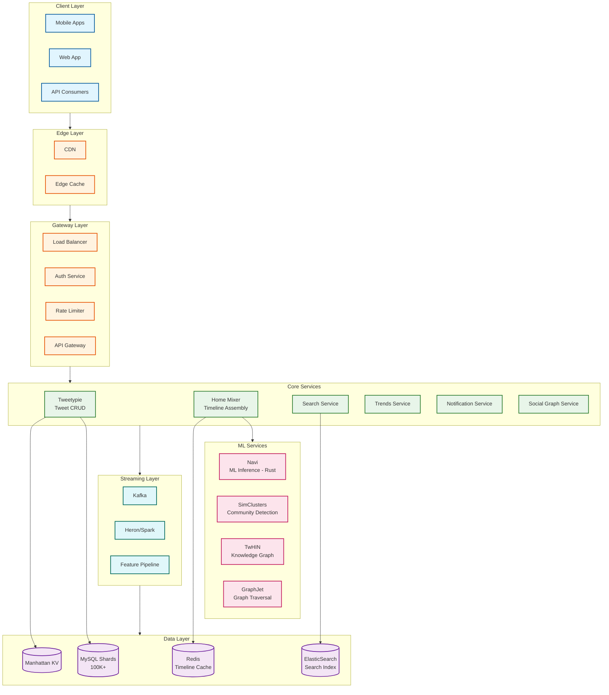

# Twitter/X System Design

## Overview

Twitter/X is a real-time microblogging and social networking platform enabling 500M+ daily tweets with **asymmetric follower relationships**. The core engineering challenges center on hybrid fan-out for extreme celebrity distribution (users with 150M+ followers), sub-second search indexing, and ML-powered "For You" feed ranking that processes 5 billion decisions daily.

**Key differentiator from Facebook:** Twitter's unidirectional follow graph creates a more extreme celebrity problem requiring a higher fan-out threshold (100K vs 10K) and pull-based merging for high-follower accounts.

---

## System Characteristics

| Characteristic | Value | Implication |
|----------------|-------|-------------|
| Traffic Pattern | Write-heavy fan-out, Read-heavy timeline | Hybrid push/pull model critical |
| Latency Target | <1.5s for timeline (220 CPU-seconds) | Aggressive caching, precomputation |
| Consistency Model | Eventual (timeline), Strong (tweets per-shard) | Manhattan KV store |
| Availability Target | 99.99% | Multi-region active-active |
| Data Model | Unidirectional graph (Follow relationships) | GraphJet for traversal |
| Scale | 500M tweets/day, 300K QPS | Extreme horizontal scaling |
| Real-time Requirement | <1s search indexing, live trends | Kafka + Heron streaming |

---

## Complexity Rating

| Component | Complexity | Key Challenge |
|-----------|------------|---------------|
| **Overall System** | Very High | Real-time + ML ranking + extreme scale |
| Timeline Assembly (Home Mixer) | Very High | 5B ranking decisions/day, 220 CPU-seconds in <1.5s |
| Search Infrastructure | High | 1-second indexing latency at 500M tweets/day |
| Trends Detection | High | Real-time streaming, predictive algorithms |
| Recommendation Algorithm | Very High | Three-stage pipeline, open-sourced complexity |
| Celebrity Fan-out | High | 150M followers, retweet amplification |

---

## Quick Navigation

| Document | Description |
|----------|-------------|
| [01 - Requirements & Estimations](./01-requirements-and-estimations.md) | Functional/non-functional requirements, capacity planning |
| [02 - High-Level Design](./02-high-level-design.md) | Architecture, data flows, key decisions |
| [03 - Low-Level Design](./03-low-level-design.md) | Data models, APIs, algorithms |
| [04 - Deep Dives & Bottlenecks](./04-deep-dive-and-bottlenecks.md) | Home Mixer, Celebrity Problem, Search, Trends |
| [05 - Scalability & Reliability](./05-scalability-and-reliability.md) | Scaling strategies, fault tolerance |
| [06 - Security & Compliance](./06-security-and-compliance.md) | Auth, threat model, GDPR/DSA |
| [07 - Observability](./07-observability.md) | Metrics, logging, tracing, alerting |
| [08 - Interview Guide](./08-interview-guide.md) | Pacing, trap questions, trade-offs |

---

## Core Modules

| Module | Responsibility | Key Challenge | Scale |
|--------|----------------|---------------|-------|
| **Tweetypie** | Tweet CRUD operations | Media handling, content moderation | 500M tweets/day |
| **Home Mixer** | Timeline assembly & ranking | Real-time personalization, ML inference | 5B decisions/day |
| **Product Mixer** | Feed construction framework | Declarative pipeline, parallelization | Foundation for feeds |
| **Search Service** | Real-time tweet/user search | <1 second indexing latency | 100s of TBs indexed |
| **Trends Service** | Trending topic detection | Prediction 1.5-5 hours ahead | Real-time streaming |
| **GraphJet** | Social graph traversal | Out-of-network discovery | Billions of edges |
| **Navi** | ML model inference | Sub-millisecond predictions | Rust-based, GPU-optimized |
| **SimClusters** | Community detection | Interest-based embeddings | Sparse representations |
| **TwHIN** | Knowledge graph embeddings | Entity relationships | Dense vectors |

---

## Architecture Overview



---

## Twitter vs Facebook: Key Differences

Understanding these differences is **critical** for system design interviews:

| Aspect | Twitter/X | Facebook | Impact on Design |
|--------|-----------|----------|------------------|
| **Graph Type** | Unidirectional (follow) | Bidirectional (friend) | More extreme celebrity distribution possible |
| **Celebrity Threshold** | 100,000 followers | 10,000 followers | Higher threshold needed for pull model |
| **Max Followers** | 150M+ (Elon, Obama) | ~100M | 15x more extreme fan-out problem |
| **Content Velocity** | Real-time, news-focused | Longer-lasting, personal | Faster cache invalidation needed |
| **Default Privacy** | Public | Friends-only | Simpler privacy checks, broader discovery |
| **Amplification** | Retweets (20x weight in scoring) | Shares (less viral) | Higher fan-out multiplier for viral content |
| **Content Length** | 280 characters | Unlimited | Denser storage, faster processing |
| **Graph Density** | Sparse (average: 700 followers) | Dense (mutual connections) | Different traversal patterns |

### The Celebrity Problem: Twitter's Unique Challenge

```
NAIVE FAN-OUT DISASTER SCENARIO:

@elonmusk posts a tweet:
  - Followers: 150,000,000
  - If push model: 150M Redis writes per tweet
  - At 10 tweets/day: 1.5B writes/day from ONE user

Add retweet amplification:
  - 100,000 users retweet
  - Each retweet fans out to their followers
  - Total writes: 150M + (100K × avg_followers)
  - Could be 200M+ additional writes

SOLUTION: Hybrid Fan-out with 100K Threshold
  - Regular users (<100K): Push to follower timelines
  - Celebrities (>=100K): Pull at read time
  - Retweet deduplication prevents cascade
```

---

## Technology Stack

| Layer | Technology | Purpose |
|-------|------------|---------|
| **Languages** | Scala (66%), Java (20%), Python (ML), Rust (Navi) | Open-sourced codebase |
| **RPC Framework** | Finagle | High-concurrency, protocol-agnostic |
| **HTTP Framework** | Finatra | Built on Finagle |
| **KV Store** | Manhattan | Distributed, tunable consistency |
| **Graph DB** | GraphJet | In-memory graph traversal |
| **Streaming** | Kafka, Heron, Summingbird | Real-time event processing |
| **Search** | ElasticSearch + Custom Proxy | <1s indexing latency |
| **Timeline Cache** | Redis | Precomputed timelines (800 entries) |
| **ML Inference** | Navi (Rust) | Sub-millisecond predictions |
| **Embeddings** | SimClusters, TwHIN | User/content representations |

---

## Key Scale Numbers

| Metric | Value | Context |
|--------|-------|---------|
| DAU | 250 million | Daily active users |
| Tweets/day | 500 million | Write volume |
| QPS (average) | 175,000 | Timeline reads |
| QPS (peak) | 300,000+ | 3x average |
| MySQL shards | 100,000+ | Massive horizontal scaling |
| Ranking decisions/day | 5 billion | Home Mixer throughput |
| CPU-seconds per timeline | 220 | Computational intensity |
| Timeline latency | <1.5 seconds | Wall-clock time |
| Search indexing latency | <1 second | Real-time requirement |
| Celebrity threshold | 100,000 followers | Push/pull model boundary |
| Timeline cache entries | 800 tweets | Per-user Redis storage |
| Fan-out writes/day | 332 billion | Regular user tweets × followers |

---

## Recommendation Scoring Formula (Open-Sourced)

Twitter open-sourced their recommendation algorithm in September 2025:

```
ENGAGEMENT_SCORE = (
    P(like) × 1.0 +
    P(retweet) × 20.0 +
    P(reply) × 13.5 +
    P(profile_click) × 12.0 +
    P(link_click) × 11.0 +
    P(bookmark) × 10.0
) × PREMIUM_BOOST × FRESHNESS_DECAY

PREMIUM_BOOST:
  - In-network: 4.0x
  - Out-of-network: 2.0x

FRESHNESS_DECAY:
  decay = 1.0 / (1.0 + 0.05 × age_hours)
```

**Key insight:** Retweets have 20x the weight of likes, explaining why Twitter content goes viral faster than other platforms.

---

## Three-Stage Recommendation Pipeline

```
┌─────────────────────────────────────────────────────────────────┐
│                    STAGE 1: CANDIDATE RETRIEVAL                 │
├─────────────────────────────────────────────────────────────────┤
│  Total: ~1,500 tweets                                           │
│                                                                 │
│  IN-NETWORK (50%):              OUT-OF-NETWORK (50%):           │
│  ├─ Followed accounts           ├─ Real Graph (engagement)     │
│  ├─ Recent tweets               ├─ SimClusters (community)     │
│  └─ Sorted by recency           └─ TwHIN (knowledge graph)     │
└─────────────────────────────────────────────────────────────────┘
                              ↓
┌─────────────────────────────────────────────────────────────────┐
│                    STAGE 2: SCORING (Navi ML)                   │
├─────────────────────────────────────────────────────────────────┤
│  For each candidate:                                            │
│  ├─ Extract features (user, tweet, author, context)             │
│  ├─ Engagement prediction (like, RT, reply probabilities)       │
│  ├─ Apply scoring formula with weights                          │
│  ├─ Premium boost (4x in-network, 2x out-of-network)            │
│  └─ Freshness decay                                             │
└─────────────────────────────────────────────────────────────────┘
                              ↓
┌─────────────────────────────────────────────────────────────────┐
│                    STAGE 3: RANKING & FILTERING                 │
├─────────────────────────────────────────────────────────────────┤
│  ├─ Diversity constraints (no consecutive same-author)          │
│  ├─ Content type balance (images, videos, text)                 │
│  ├─ Quality filtering (spam, low-quality)                       │
│  ├─ Integrity checks (misinformation flags)                     │
│  └─ Final output: ~200 tweets                                   │
└─────────────────────────────────────────────────────────────────┘
```

---

## Interview Readiness Checklist

Before your interview, ensure you can:

- [ ] Explain why Twitter's celebrity threshold (100K) is higher than Facebook's (10K)
- [ ] Describe the three-stage recommendation pipeline
- [ ] Walk through Home Mixer architecture using Product Mixer framework
- [ ] Calculate capacity estimates (QPS, storage, fan-out writes)
- [ ] Compare unidirectional (follow) vs bidirectional (friend) graphs
- [ ] Explain GraphJet's role in out-of-network discovery
- [ ] Handle retweet amplification scenarios
- [ ] Describe 1-second search indexing pipeline
- [ ] Discuss trends detection algorithms and prediction capability
- [ ] Draw the high-level architecture in 5-10 minutes

---

## Quick Reference Card

```
┌─────────────────────────────────────────────────────────────────┐
│                    TWITTER/X QUICK REFERENCE                    │
├─────────────────────────────────────────────────────────────────┤
│  SCALE:                                                         │
│    DAU: 250M | Tweets/day: 500M | QPS: 300K peak               │
│    MySQL shards: 100K+ | Ranking decisions: 5B/day             │
│                                                                 │
│  TIMELINE:                                                      │
│    Latency: <1.5s | CPU-seconds: 220 | Candidates: 1,500       │
│    Final feed: ~200 | In-network: 50% | Out-of-network: 50%    │
│                                                                 │
│  FAN-OUT:                                                       │
│    Celebrity threshold: 100K followers                          │
│    Regular (<100K): PUSH to Redis timelines                    │
│    Celebrity (>=100K): PULL at read time                       │
│                                                                 │
│  SCORING WEIGHTS:                                               │
│    Likes: 1x | Retweets: 20x | Replies: 13.5x                  │
│    Profile clicks: 12x | Link clicks: 11x | Bookmarks: 10x     │
│    Premium boost: 4x in-network, 2x out-of-network             │
│                                                                 │
│  SEARCH:                                                        │
│    Indexing latency: <1 second                                  │
│    Pipeline: Kafka → Ingestion Service → ElasticSearch         │
│                                                                 │
│  KEY SERVICES:                                                  │
│    Tweetypie (tweets) | Home Mixer (timeline)                  │
│    Navi (ML inference) | GraphJet (graph traversal)            │
│    SimClusters + TwHIN (embeddings)                            │
└─────────────────────────────────────────────────────────────────┘
```

---

## References

- [Twitter Engineering Blog - Recommendation Algorithm](https://blog.x.com/engineering/en_us/topics/open-source/2023/twitter-recommendation-algorithm)
- [GitHub - twitter/the-algorithm](https://github.com/twitter/the-algorithm)
- [GitHub - twitter/the-algorithm-ml](https://github.com/twitter/the-algorithm-ml)
- [Twitter Blog - Reducing Search Indexing Latency](https://blog.twitter.com/engineering/en_us/topics/infrastructure/2020/reducing-search-indexing-latency-to-one-second)
- [Twitter Blog - Stability and Scalability for Search](https://blog.x.com/engineering/en_us/topics/infrastructure/2022/stability-and-scalability-for-search)
- [High Scalability - Twitter Architecture](https://highscalability.com/the-architecture-twitter-uses-to-deal-with-150m-active-users/)
- [MIT Research - Predicting Twitter Trending Topics](https://news.mit.edu/2012/predicting-twitter-trending-topics-1101)
