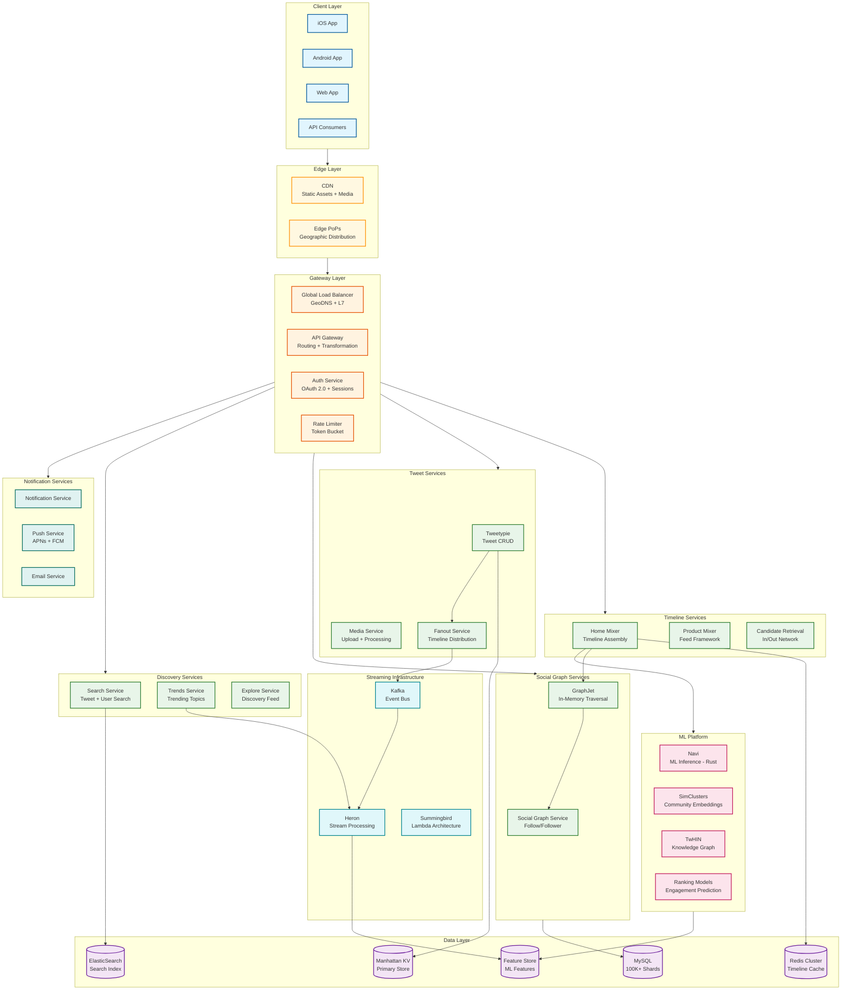
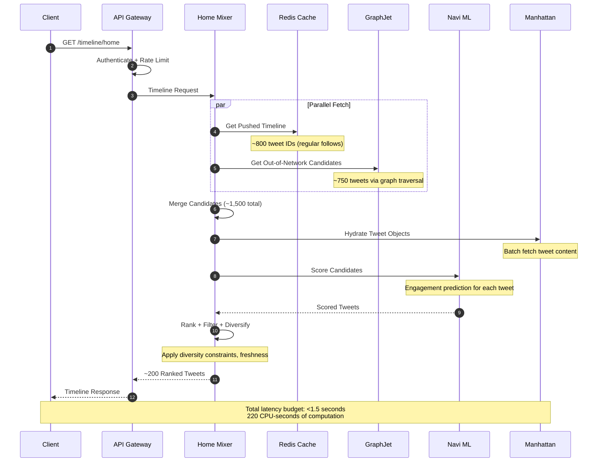
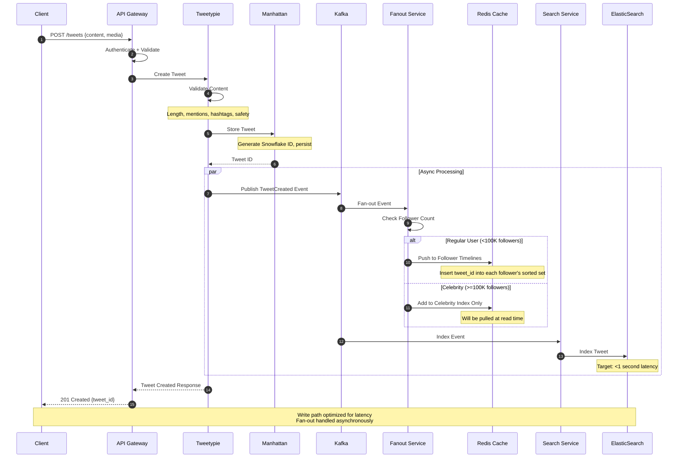
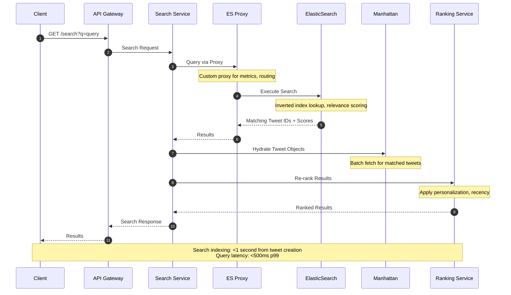
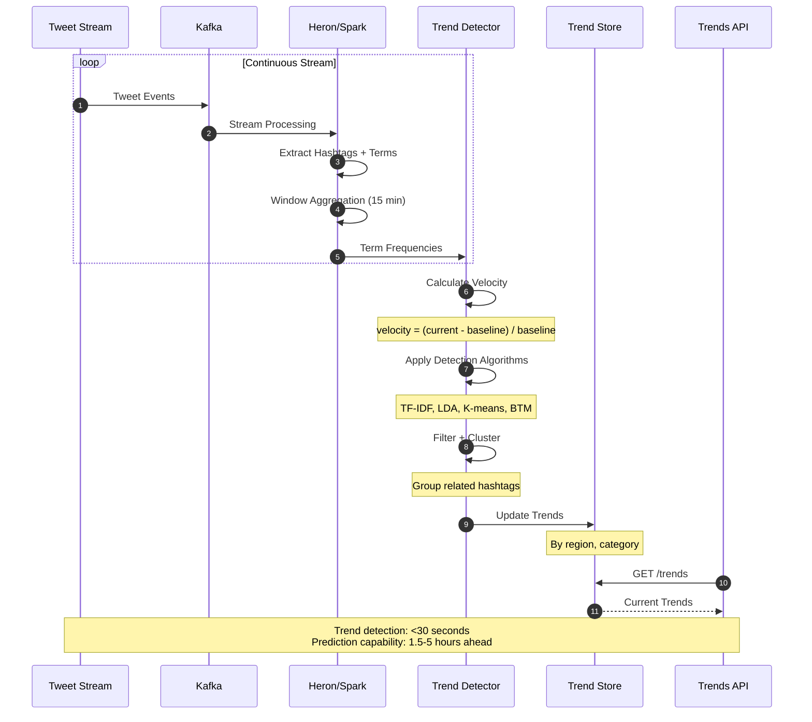
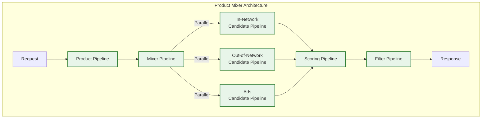
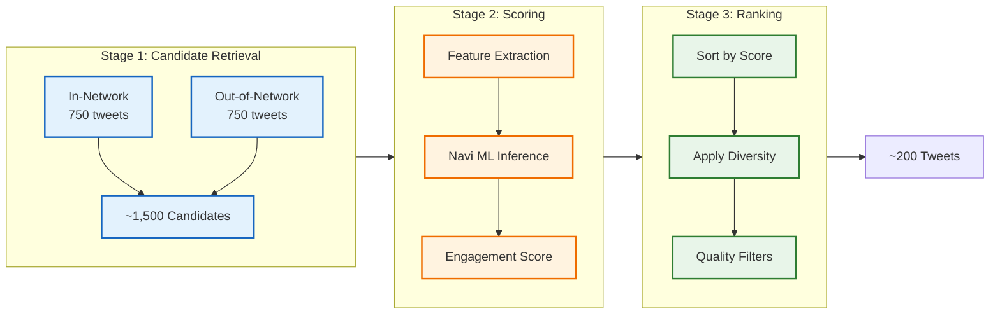
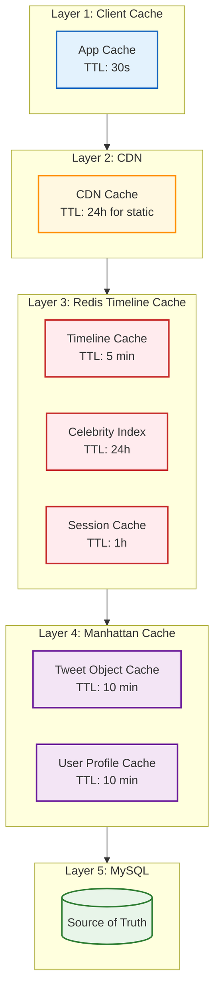
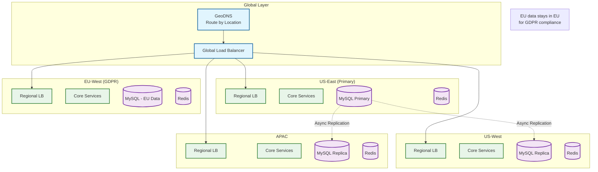

# High-Level Design

## Table of Contents

1. [System Architecture](#system-architecture)
2. [Data Flow Diagrams](#data-flow-diagrams)
3. [Key Architectural Decisions](#key-architectural-decisions)
4. [Caching Strategy](#caching-strategy)
5. [Multi-Region Deployment](#multi-region-deployment)
6. [Architecture Pattern Checklist](#architecture-pattern-checklist)

---

## System Architecture

### Component Architecture Diagram



### Service Responsibilities

| Service | Responsibility | Scale Characteristics |
|---------|----------------|----------------------|
| **Home Mixer** | Assembles personalized timeline using Product Mixer framework | 5B ranking decisions/day, <1.5s latency |
| **Product Mixer** | Generic feed construction framework (Scala) | Declarative pipelines, parallel execution |
| **Tweetypie** | Tweet CRUD operations, content validation | 500M tweets/day write throughput |
| **Fanout Service** | Distributes tweets to follower timelines | 3.85M writes/sec for regular users |
| **GraphJet** | In-memory social graph for discovery | Billions of edges, sub-ms traversal |
| **Navi** | ML model inference (Rust) | Sub-millisecond predictions, GPU-optimized |
| **Search Service** | Real-time tweet and user search | <1 second indexing latency |
| **Trends Service** | Trending topic detection | Real-time streaming, predictive algorithms |

---

## Data Flow Diagrams

### Timeline Request Flow



### Tweet Creation Flow



### Search Query Flow



### Trends Detection Flow



---

## Key Architectural Decisions

### Decision 1: Product Mixer Framework for Timeline

**Context:** Twitter needs to serve 5 billion ranking decisions daily with <1.5 second latency while requiring 220 CPU-seconds of computation per request.



| Approach | Pros | Cons |
|----------|------|------|
| **Product Mixer (Chosen)** | Declarative pipelines, parallel execution, open-sourced | Scala expertise required |
| Custom imperative code | Full control, simple debugging | Hard to parallelize, maintain |
| GraphQL resolvers | Flexible, client-driven | Not optimized for feed use case |

**Decision:** Product Mixer because it enables:
- Declarative pipeline definition with automatic parallelization
- 220 CPU-seconds in <1.5s wall-clock via massive parallelism
- Clear separation of candidate sources, scoring, and filtering
- Reusable across Home, Search, and Notifications

### Decision 2: Hybrid Fan-out with 100K Threshold

**Context:** Twitter's unidirectional graph allows extreme follower counts (150M+), making pure push model infeasible.

```
FAN-OUT COMPARISON:

                    PUSH MODEL                    PULL MODEL
                    (Regular Users)               (Celebrities)

Write Time:         Expensive                     Cheap
                    (fan to N followers)          (index only)

Read Time:          Cheap                         Expensive
                    (precomputed)                 (merge at read)

Best For:           Users with                    Users with
                    <100K followers               >=100K followers

Twitter Adoption:   95% of tweets                 5% of tweets
                    (332B writes/day)             (pulls at read)
```

| Approach | Fan-out Writes/Day | Read Latency Impact |
|----------|-------------------|---------------------|
| Pure Push | 25+ trillion (infeasible) | Minimal |
| Pure Pull | 0 | High (>3s) |
| **Hybrid 100K (Chosen)** | 332 billion | +50-100ms for celebrities |

**Decision:** Hybrid with 100K threshold because:
- 100K is optimal for Twitter's asymmetric graph (higher than Facebook's 10K)
- Eliminates write amplification from top 50K accounts
- Only adds 50-100ms to read path for celebrity content
- Can dynamically adjust threshold based on load

### Decision 3: Three-Stage Recommendation Pipeline

**Context:** Need to select ~200 relevant tweets from billions of possibilities.



**Stage Details:**

| Stage | Input | Output | Key Components |
|-------|-------|--------|----------------|
| Candidate Retrieval | User context | ~1,500 tweets | In-network (followed), Out-of-network (GraphJet) |
| Scoring | Candidates + Features | Scored tweets | Navi (Rust), engagement prediction |
| Ranking | Scored tweets | ~200 tweets | Diversity, freshness, quality filters |

### Decision 4: GraphJet for Out-of-Network Discovery

**Context:** 50% of For You content comes from accounts users don't follow.

```mermaid
flowchart TB
    subgraph GraphJet["GraphJet In-Memory Graph"]
        direction LR
        Users[User Nodes]
        Tweets[Tweet Nodes]
        Users <--> |"Engagement<br/>Edges"|Tweets
    end

    subgraph Discovery["Discovery Methods"]
        RealGraph[Real Graph<br/>Engagement-based]
        SimClusters[SimClusters<br/>Community-based]
        TwHINEmbed[TwHIN<br/>Knowledge Graph]
    end

    GraphJet --> Discovery
    Discovery --> Candidates[Out-of-Network<br/>Candidates]

    classDef graph fill:#e8f5e9,stroke:#2e7d32,stroke-width:2px
    classDef discovery fill:#fff3e0,stroke:#e65100,stroke-width:2px

    class Users,Tweets graph
    class RealGraph,SimClusters,TwHINEmbed discovery
```

| Approach | Latency | Memory | Discovery Quality |
|----------|---------|--------|-------------------|
| **GraphJet (Chosen)** | <10ms | ~100GB | High (real engagement data) |
| Graph database queries | 50-100ms | Disk-based | High |
| Precomputed recommendations | <1ms | High | Medium (stale) |

**Decision:** GraphJet because:
- Sub-millisecond traversal required for timeline latency budget
- Bipartite user-tweet graph enables multiple discovery algorithms
- In-memory design fits within modern server memory
- Segmented storage allows focus on recent interactions

### Decision 5: Manhattan vs TAO

**Context:** Need distributed key-value storage for tweets and user data.

| Feature | Manhattan (Twitter) | TAO (Facebook) |
|---------|---------------------|----------------|
| Data Model | Key-Value | Objects + Associations |
| Consistency | Tunable | Strong per-shard |
| Caching | Integrated | Two-tier (Leader/Follower) |
| Use Case | General KV | Social graph optimized |
| Open Source | Partially | No |

**Decision:** Manhattan because:
- Simpler key-value model sufficient for tweets
- Tunable consistency supports different use cases
- Multi-tenant architecture for different data types
- Better fit for Twitter's existing infrastructure

---

## Caching Strategy

### Cache Hierarchy



### Cache Configuration

| Cache Layer | TTL | Size | Hit Rate Target | Invalidation |
|-------------|-----|------|-----------------|--------------|
| Client App | 30 seconds | 10 MB | 20% | On refresh |
| CDN (static) | 24 hours | Distributed | 95% | Purge API |
| Timeline (Redis) | 5 minutes | 2.5 TB | 70% | On new tweet/follow |
| Celebrity Index | 24 hours | 3 GB | 90% | On new celebrity tweet |
| Tweet Object | 10 minutes | 500 GB | 90% | Write-through |
| User Profile | 10 minutes | 100 GB | 95% | Write-through |

### Cache Invalidation Strategy

```
TIMELINE CACHE INVALIDATION:

Trigger: New tweet from followed account
  1. Tweetypie publishes TweetCreated to Kafka
  2. Fanout Service consumes event
  3. For regular users: INSERT into follower timeline sorted sets
  4. For celebrities: INSERT into celebrity index only

Trigger: New follow relationship
  1. Social Graph Service publishes FollowCreated
  2. Timeline Service receives event
  3. Mark user's timeline cache as dirty
  4. Background job rebuilds timeline (or lazy on next read)

Trigger: Tweet deletion
  1. Tweetypie publishes TweetDeleted
  2. Fanout Service removes from all cached timelines
  3. Search Service removes from index
```

---

## Multi-Region Deployment

### Geographic Distribution



### Regional Responsibilities

| Region | Role | Data Residency | Traffic % |
|--------|------|----------------|-----------|
| US-East | Primary write region | Global (non-EU) | 35% |
| US-West | Read replica, failover | Global (non-EU) | 20% |
| EU-West | EU data primary | EU users only (GDPR) | 25% |
| APAC | Read replica | Global (non-EU) | 20% |

### Cross-Region Replication

```
REPLICATION STRATEGY:

Tweets:
  - Async replication from primary region
  - Lag tolerance: <30 seconds
  - Conflict resolution: Last-write-wins with timestamp

User Data:
  - EU users: Stays in EU region
  - Non-EU users: Primary in US-East, replicated async

Timeline Cache:
  - Region-local only
  - Rebuilt from source on cache miss
  - No cross-region replication

Search Index:
  - Region-local indices
  - Near-real-time replication from tweet store
```

---

## Architecture Pattern Checklist

| Pattern | Decision | Rationale |
|---------|----------|-----------|
| **Sync vs Async Communication** | Hybrid | Sync for reads (latency), Async for fan-out (throughput) |
| **Event-driven vs Request-response** | Event-driven for writes | Kafka enables decoupling, replay, scaling |
| **Push vs Pull Model** | Hybrid (100K threshold) | Balance write amplification vs read latency |
| **Stateless vs Stateful Services** | Stateless | Horizontal scaling, easier failover |
| **Read-heavy vs Write-heavy Optimization** | Both | Write-heavy fan-out, Read-heavy timeline |
| **Real-time vs Batch Processing** | Real-time dominant | News/trends require freshness |
| **Edge vs Origin Processing** | Edge for static | CDN for media, origin for dynamic |
| **Monolith vs Microservices** | Microservices | Clear boundaries, independent scaling |
| **SQL vs NoSQL** | Polyglot | MySQL (relations), Manhattan (KV), Redis (cache), ES (search) |
| **Strong vs Eventual Consistency** | Eventual (mostly) | Timeline eventual, tweets strong per-shard |

---

## Technology Choices Summary

| Component | Technology | Justification |
|-----------|------------|---------------|
| Primary Language | Scala | Functional, concurrent, JVM ecosystem |
| ML Inference | Rust (Navi) | Performance-critical, memory-safe |
| RPC Framework | Finagle | Twitter-developed, high-concurrency |
| Event Streaming | Kafka | Durability, replay, high throughput |
| Stream Processing | Heron | Twitter-developed Storm successor |
| Timeline Cache | Redis | In-memory, sorted sets, pub/sub |
| KV Store | Manhattan | Multi-tenant, tunable consistency |
| Search Index | ElasticSearch | Full-text, real-time indexing |
| Graph Traversal | GraphJet | In-memory, sub-ms latency |
| Load Balancing | Custom (Finagle) | Service mesh integration |
