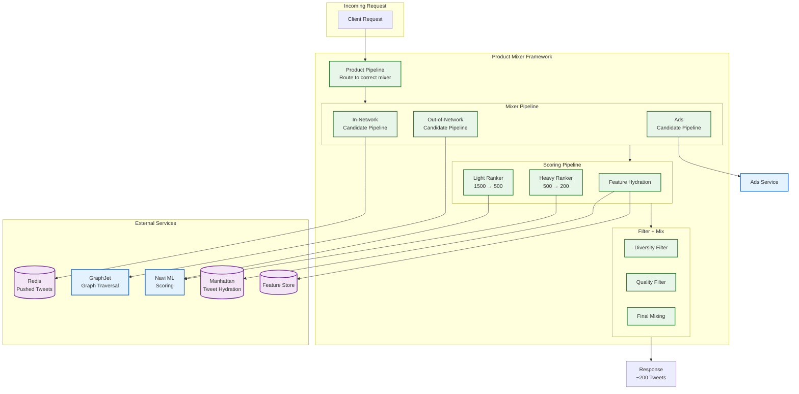
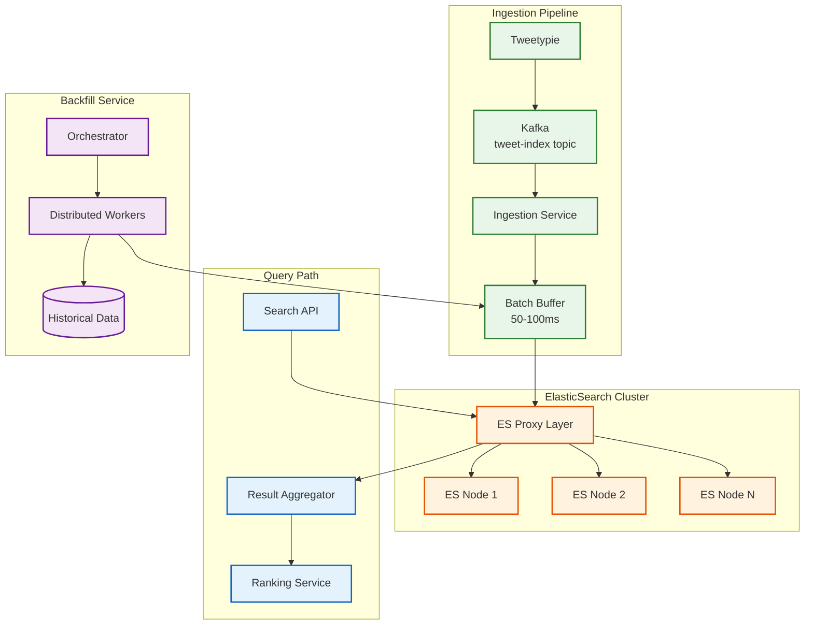
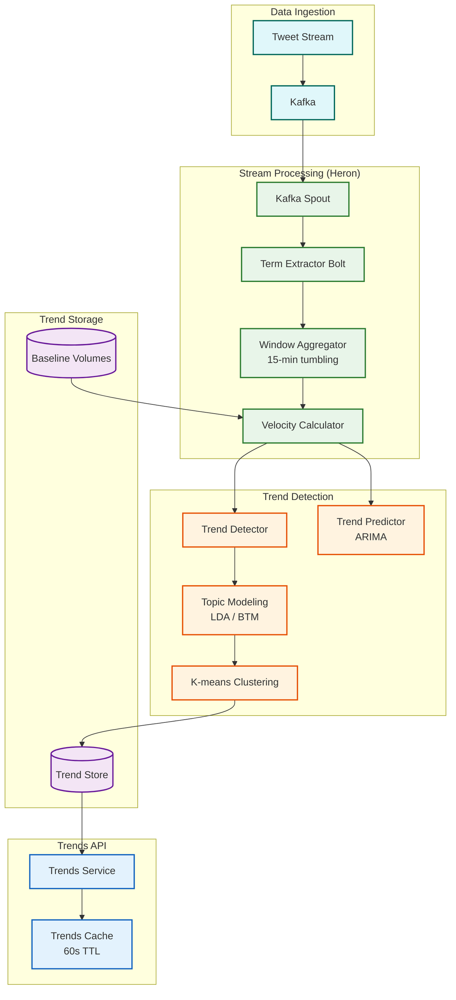

# Deep Dive and Bottlenecks

## Table of Contents

1. [Deep Dive 1: Home Mixer Architecture](#deep-dive-1-home-mixer-architecture)
2. [Deep Dive 2: Celebrity/Hot User Problem](#deep-dive-2-celebrityhot-user-problem)
3. [Deep Dive 3: Search Infrastructure](#deep-dive-3-search-infrastructure)
4. [Deep Dive 4: Trends Detection System](#deep-dive-4-trends-detection-system)
5. [Bottleneck Analysis](#bottleneck-analysis)
6. [Race Conditions and Concurrency](#race-conditions-and-concurrency)

---

## Deep Dive 1: Home Mixer Architecture

### Overview

Home Mixer is Twitter's timeline assembly service, responsible for generating the personalized "For You" feed. It processes **5 billion ranking decisions daily** with a strict latency budget of **<1.5 seconds**, despite requiring **220 CPU-seconds** of computation per request.

### Architecture Diagram



### Product Mixer Framework Internals

Product Mixer is Twitter's Scala framework for building feeds. Key concepts:

```
PRODUCT MIXER CONCEPTS:

1. PRODUCT PIPELINE
   - Entry point for requests
   - Routes to appropriate Mixer Pipeline
   - Handles authentication context

2. MIXER PIPELINE
   - Combines heterogeneous candidate sources
   - Parallel execution of Candidate Pipelines
   - Handles ads injection

3. CANDIDATE PIPELINE
   - Fetches candidates from a single source
   - Independent, parallelizable
   - Examples: In-Network, Out-of-Network, Ads

4. SCORING PIPELINE
   - Feature hydration (enrich candidates)
   - ML model inference
   - Can have multiple stages (light → heavy)

5. FILTER PIPELINE
   - Removes low-quality candidates
   - Applies diversity constraints
   - Prepares final response
```

### Latency Budget Breakdown

```
TIMELINE REQUEST LATENCY BUDGET (1500ms total):

┌──────────────────────────────────────────────────────┐
│ Phase                    │ Budget  │ Parallelism     │
├──────────────────────────┼─────────┼─────────────────┤
│ Auth + Rate Limiting     │  50ms   │ Sequential      │
│ Candidate Retrieval      │ 200ms   │ 3-way parallel  │
│   - In-Network (Redis)   │  50ms   │ ↳ Parallel      │
│   - Out-of-Network       │ 150ms   │ ↳ Parallel      │
│   - Ads                  │ 100ms   │ ↳ Parallel      │
│ Feature Hydration        │ 300ms   │ Batch parallel  │
│ Light Ranker             │ 200ms   │ Batched         │
│ Heavy Ranker             │ 400ms   │ Batched         │
│ Filtering + Mixing       │ 100ms   │ Sequential      │
│ Response Serialization   │  50ms   │ Sequential      │
├──────────────────────────┼─────────┼─────────────────┤
│ TOTAL                    │ 1300ms  │ Buffer: 200ms   │
└──────────────────────────────────────────────────────┘

HOW 220 CPU-SECONDS FIT IN 1.5 SECONDS:

Parallelism factor needed: 220s / 1.5s = 147x

Achieved through:
1. Parallel candidate source fetching (3-way)
2. Batched feature lookups (100s of parallel RPCs)
3. Batched ML inference (GPU batching)
4. Async I/O throughout
5. Connection pooling and keep-alive
```

### Candidate Sources Deep Dive

```
IN-NETWORK CANDIDATES (~50% of feed):

Source: Redis timeline cache
Content: Tweets from accounts user follows
Strategy: Pre-pushed via fan-out

FUNCTION get_in_network_candidates(user_id, limit=750):
    // Fetch from precomputed timeline
    pushed_tweets = redis.zrevrange(
        key = "timeline:" + user_id,
        start = 0,
        stop = limit - 1,
        withscores = True
    )

    // Fetch from celebrity index for followed celebrities
    followed_celebrities = get_followed_celebrities(user_id)
    celebrity_tweets = []

    FOR celeb_id IN followed_celebrities:
        tweets = redis.zrevrange(
            key = "celebrity:" + celeb_id + ":tweets",
            start = 0,
            stop = 20  // Latest 20 per celebrity
        )
        celebrity_tweets.extend(tweets)

    // Merge and deduplicate
    RETURN merge_and_sort(pushed_tweets, celebrity_tweets)[:limit]


OUT-OF-NETWORK CANDIDATES (~50% of feed):

Sources:
1. Real Graph - Based on engagement history
2. SimClusters - Community-based similarity
3. TwHIN - Knowledge graph embeddings

FUNCTION get_out_of_network_candidates(user_id, limit=750):
    candidates = []

    // Real Graph: Tweets from accounts user engaged with
    real_graph_tweets = graphjet.traverse(
        start_node = user_id,
        edge_type = "ENGAGED_WITH",
        hops = 2,  // User → Engaged Author → Their Tweets
        limit = 300
    )
    candidates.extend(real_graph_tweets)

    // SimClusters: Community-based discovery
    user_clusters = feature_store.get("simclusters", user_id)
    cluster_tweets = simclusters_ann.search(
        query_vector = user_clusters,
        index = "tweet_clusters",
        limit = 300
    )
    candidates.extend(cluster_tweets)

    // TwHIN: Knowledge graph embeddings
    user_embedding = feature_store.get("twhin", user_id)
    similar_tweets = twhin_ann.search(
        query_vector = user_embedding,
        limit = 200
    )
    candidates.extend(similar_tweets)

    // Deduplicate and filter already-seen
    RETURN deduplicate(candidates)[:limit]
```

### Two-Stage Ranking Architecture

```
LIGHT RANKER (1500 → 500 candidates):

Purpose: Quick filtering with simpler model
Model: Logistic regression or small neural network
Latency: ~200ms for 1500 candidates
Features used: ~50 features (subset of full feature set)

Features:
- User-tweet similarity (precomputed)
- Recency
- Author reputation
- Content type
- Basic engagement metrics

HEAVY RANKER (500 → 200 candidates):

Purpose: Precise ranking with full model
Model: Deep neural network (transformer-based)
Latency: ~400ms for 500 candidates (batched GPU)
Features used: ~500 features

Additional features:
- Real-time engagement signals
- SimCluster similarity scores
- TwHIN embeddings
- Historical user preferences
- Context (time of day, device, etc.)

RANKING FLOW:
    candidates (1500)
         ↓
    Light Ranker (CPU, fast)
         ↓
    filtered (500)
         ↓
    Heavy Ranker (GPU, accurate)
         ↓
    ranked (500)
         ↓
    Diversity + Quality filters
         ↓
    final (200)
```

---

## Deep Dive 2: Celebrity/Hot User Problem

### Problem Magnitude

Twitter's celebrity problem is more extreme than Facebook's due to the asymmetric follow graph:

```
TWITTER'S CELEBRITY DISTRIBUTION:

Top accounts by followers (2024-2025):
┌──────────────────────┬────────────────┬─────────────────┐
│ Account              │ Followers      │ Tweets/Day      │
├──────────────────────┼────────────────┼─────────────────┤
│ @elonmusk            │ 150,000,000+   │ 10-50           │
│ @barackobama         │ 130,000,000    │ 1-5             │
│ @justinbieber        │ 110,000,000    │ 1-5             │
│ @katyperry           │ 108,000,000    │ 1-5             │
│ @raboraboni          │ 103,000,000    │ 1-5             │
└──────────────────────┴────────────────┴─────────────────┘

NAIVE FAN-OUT DISASTER:

IF @elonmusk posts 20 tweets/day using push model:
  Writes = 20 tweets × 150M followers = 3 BILLION writes/day

IF top 100 celebrities average 10 tweets/day:
  Writes = 100 × 10 × 100M avg followers = 100 BILLION writes/day
  Just from 100 accounts!

RETWEET AMPLIFICATION:
  1 Elon tweet → 500K retweets
  Each retweet fans out to retweeter's followers
  Additional writes: 500K × 1000 avg followers = 500M more writes
  TOTAL: 150M + 500M = 650M writes from ONE TWEET
```

### Twitter vs Facebook Comparison

| Factor | Twitter | Facebook | Impact |
|--------|---------|----------|--------|
| Graph Type | Unidirectional | Bidirectional | Twitter allows unlimited followers |
| Celebrity Threshold | 100,000 | 10,000 | Twitter needs higher due to extremes |
| Max Followers | 150M+ | ~100M | 1.5x more extreme |
| Friend Cap | None | 5,000 friends | Facebook limits write amplification |
| Retweets | 20x engagement weight | Shares less viral | More write amplification |
| Content Lifespan | Hours | Days | Twitter needs faster invalidation |

### Solution: Aggressive Pull Model

```
TWITTER'S HYBRID FAN-OUT STRATEGY:

Threshold: 100,000 followers (10x Facebook's threshold)

CELEBRITY TWEET FLOW:
┌─────────────────────────────────────────────────────────────┐
│ 1. Celebrity creates tweet                                  │
│    └─> Store in Manhattan (permanent)                       │
│                                                             │
│ 2. Add to celebrity index ONLY                              │
│    └─> Redis: ZADD celebrity:{author_id}:tweets             │
│                                                             │
│ 3. Push to notification-enabled subset (10K max)            │
│    └─> These users get push notifications                   │
│    └─> Also added to their timeline cache                   │
│                                                             │
│ 4. NO fan-out to remaining followers                        │
│    └─> Will be pulled at read time                          │
└─────────────────────────────────────────────────────────────┘

READ-TIME MERGE:
┌─────────────────────────────────────────────────────────────┐
│ User requests timeline:                                     │
│                                                             │
│ 1. Fetch pushed tweets from timeline cache                  │
│    └─> Regular followed accounts                            │
│                                                             │
│ 2. Get list of followed celebrities                         │
│    └─> Typically 10-50 celebrities per user                 │
│                                                             │
│ 3. Fetch recent tweets from each celebrity index            │
│    └─> Redis: ZREVRANGE celebrity:{id}:tweets 0 19          │
│    └─> Latest 20 tweets per celebrity                       │
│                                                             │
│ 4. Merge all candidates                                     │
│                                                             │
│ 5. Re-rank with ML model                                    │
│                                                             │
│ 6. Return personalized timeline                             │
└─────────────────────────────────────────────────────────────┘

LATENCY IMPACT:
  Push-only timeline: ~100ms
  With celebrity pull: ~150-200ms (+50-100ms)
  Acceptable trade-off for 99%+ write reduction
```

### Retweet Amplification Handling

```
RETWEET DEDUPLICATION STRATEGY:

Problem: Popular tweet gets retweeted by many followed accounts

Scenario:
  - User follows 500 accounts
  - 50 of them retweet @elonmusk's tweet
  - Without dedup: Same tweet appears 50 times

Solution: Source-level deduplication

FUNCTION deduplicate_retweets(candidates):
    seen_source_tweets = Set()
    deduplicated = []

    FOR candidate IN candidates:
        // Get the original tweet ID (for retweets)
        source_id = candidate.retweet_of_id OR candidate.id

        IF source_id NOT IN seen_source_tweets:
            seen_source_tweets.add(source_id)

            // Keep the version with most social proof
            IF candidate.is_retweet:
                candidate.attribution = get_best_retweeter(
                    source_id,
                    user.following
                )

            deduplicated.append(candidate)

    RETURN deduplicated

FUNCTION get_best_retweeter(tweet_id, user_following):
    // Find the followed user who retweeted with highest engagement
    retweeters = get_retweeters(tweet_id)
    followed_retweeters = retweeters.intersect(user_following)

    // Prioritize: Mutual follows > High engagement > Recency
    RETURN ranked_retweeters[0]
```

### Dynamic Threshold Adjustment

```
ADAPTIVE CELEBRITY THRESHOLD:

Base threshold: 100,000 followers

Adjustments based on system load:

IF fan_out_queue_depth > 10_000_000:
    // System under stress, lower threshold
    threshold = 50_000
    LOG("Lowered celebrity threshold due to load")

IF breaking_news_detected:
    // Major event, preemptively lower
    threshold = 25_000

IF infrastructure_upgrade:
    // Can handle more, raise threshold
    threshold = 200_000

FUNCTION should_use_pull_model(author_id, follower_count):
    current_threshold = get_current_threshold()

    IF follower_count >= current_threshold:
        RETURN True

    // Also check recent posting velocity
    recent_tweets = count_tweets_last_hour(author_id)
    IF recent_tweets > 10 AND follower_count > current_threshold / 2:
        RETURN True  // Treat as celebrity temporarily

    RETURN False
```

---

## Deep Dive 3: Search Infrastructure

### Architecture Overview



### 1-Second Indexing Pipeline

```
INDEXING PIPELINE BREAKDOWN:

Target: 99% of tweets searchable within 1 second

┌────────────────────────────────────────────────────────────┐
│ Phase                     │ Latency │ Cumulative           │
├───────────────────────────┼─────────┼──────────────────────┤
│ Tweet creation            │   0ms   │    0ms               │
│ Kafka produce             │  20ms   │   20ms               │
│ Kafka propagation         │  30ms   │   50ms               │
│ Ingestion consume         │  10ms   │   60ms               │
│ Buffer accumulation       │  50ms   │  110ms (max wait)    │
│ Document enrichment       │  20ms   │  130ms               │
│ ES bulk index             │ 200ms   │  330ms               │
│ ES refresh (near-RT)      │ 500ms   │  830ms               │
│ Buffer                    │ 170ms   │ 1000ms               │
└────────────────────────────────────────────────────────────┘

PREVIOUS STATE (pre-2020): 15 seconds indexing latency
IMPROVEMENT: 15x faster through custom ingestion pipeline
```

### Custom Proxy Layer

```
ES PROXY RESPONSIBILITIES:

1. TRAFFIC MANAGEMENT
   - Route queries to appropriate shards
   - Implement circuit breakers for failing nodes
   - Load balance across replicas

2. METRICS COLLECTION
   - Query latency histograms
   - Indexing throughput
   - Error rates by query type
   - Node health monitoring

3. QUERY TRANSFORMATION
   - Add default filters (exclude suspended, deleted)
   - Inject personalization context
   - Rewrite complex queries for optimization

4. RATE LIMITING
   - Per-client query limits
   - Protection against expensive queries
   - Graceful degradation under load

PROXY IMPLEMENTATION:

FUNCTION handle_query(query, context):
    // Transform query
    transformed = transform_query(query)

    // Select healthy nodes
    nodes = get_healthy_nodes()
    IF nodes.empty():
        RETURN cached_results(query) OR error("Search unavailable")

    // Execute with timeout
    TRY:
        results = execute_with_timeout(
            nodes = nodes,
            query = transformed,
            timeout = 400ms
        )
    CATCH TimeoutException:
        metrics.increment("query_timeout")
        RETURN degraded_results(query)

    // Record metrics
    metrics.record("query_latency", elapsed_time)

    RETURN results
```

### Backfill Service for Historical Data

```
BACKFILL CHALLENGES:

Scale: 100s of TBs of historical tweets
Constraint: Must not impact real-time indexing

BACKFILL ARCHITECTURE:

1. ORCHESTRATOR
   - Tracks backfill progress
   - Manages worker assignment
   - Handles failures and retries

2. DISTRIBUTED WORKERS
   - Read from partitioned storage
   - Rate-limited to prevent overload
   - Checkpoint progress for resume

3. PARALLEL EXECUTION
   - Multiple workers per partition
   - Adaptive rate limiting based on cluster health

BACKFILL ALGORITHM:

FUNCTION orchestrate_backfill(date_range, priority):
    partitions = partition_by_date(date_range)
    worker_count = calculate_workers(cluster_health())

    FOR partition IN partitions:
        job = create_backfill_job(partition, priority)
        job_queue.enqueue(job)

FUNCTION backfill_worker():
    WHILE True:
        job = job_queue.dequeue()
        checkpoint = get_checkpoint(job.partition)

        FOR batch IN read_partition(job.partition, start=checkpoint):
            // Wait if cluster is stressed
            WHILE cluster_stressed():
                sleep(1000)

            // Index batch
            success = index_batch(batch)

            IF success:
                save_checkpoint(job.partition, batch.end)
            ELSE:
                retry_queue.enqueue(batch)

        mark_complete(job)
```

---

## Deep Dive 4: Trends Detection System

### Architecture Overview



### Detection Algorithms

```
TREND DETECTION ALGORITHMS:

1. VELOCITY-BASED DETECTION (Primary)
   ┌─────────────────────────────────────────────────────────┐
   │ velocity = (current_volume - baseline) / baseline       │
   │                                                         │
   │ IF velocity > 2.0 AND volume > MIN_THRESHOLD:           │
   │     CANDIDATE for trending                              │
   │                                                         │
   │ Baseline: 24-hour rolling average with time-of-day      │
   │           adjustment                                    │
   └─────────────────────────────────────────────────────────┘

2. TF-IDF (Term Frequency-Inverse Document Frequency)
   ┌─────────────────────────────────────────────────────────┐
   │ PURPOSE: Weight terms by uniqueness                     │
   │                                                         │
   │ TF(t) = count(t) / total_terms_in_window                │
   │ IDF(t) = log(N / documents_containing_t)                │
   │ TF-IDF(t) = TF(t) × IDF(t)                              │
   │                                                         │
   │ High TF-IDF = Term is frequent but unusual              │
   └─────────────────────────────────────────────────────────┘

3. LDA (Latent Dirichlet Allocation)
   ┌─────────────────────────────────────────────────────────┐
   │ PURPOSE: Group tweets into topics                       │
   │                                                         │
   │ Input: Bag-of-words representation of tweets            │
   │ Output: Topic distribution per tweet                    │
   │                                                         │
   │ Identifies: Emerging topics even without hashtags       │
   └─────────────────────────────────────────────────────────┘

4. BITERM TOPIC MODEL (BTM)
   ┌─────────────────────────────────────────────────────────┐
   │ PURPOSE: Topic modeling for short text (tweets)         │
   │                                                         │
   │ Advantage: Handles sparse word co-occurrence            │
   │            Better than LDA for 280-char content         │
   │                                                         │
   │ Process: Models word pairs (biterms) instead of docs    │
   └─────────────────────────────────────────────────────────┘

5. K-MEANS CLUSTERING
   ┌─────────────────────────────────────────────────────────┐
   │ PURPOSE: Group related hashtags into single trend       │
   │                                                         │
   │ Example: #WorldCup, #FIFAWorldCup, #Qatar2022           │
   │          → Single trend: "World Cup"                    │
   │                                                         │
   │ Features: TF-IDF vectors, co-occurrence matrix          │
   │ Similarity: Cosine similarity > 0.7 = same cluster      │
   └─────────────────────────────────────────────────────────┘
```

### Predictive Capability

```
TREND PREDICTION (MIT Research: 1.5-5 hours ahead):

ALGORITHM:

1. COLLECT TIME SERIES
   - Volume of term over last 24 hours
   - 5-minute granularity
   - 288 data points

2. DETECT PATTERN
   - Exponential growth detection
   - Acceleration (second derivative)
   - Comparison to historical trends

3. ARIMA FORECASTING
   - Model: ARIMA(1,1,1)
   - Forecast horizon: 5 hours (60 points)
   - Confidence intervals

4. PREDICTION OUTPUT
   - Will trend: True/False (95% accuracy)
   - Time to peak: X hours
   - Expected peak volume
   - Confidence level

FEATURES FOR PREDICTION:
- Volume growth rate
- Acceleration
- Source diversity (number of unique authors)
- Geographic spread
- Influential user participation
- Time of day factors
- Day of week factors
- Historical similar trends
```

---

## Bottleneck Analysis

### Bottleneck 1: Timeline Assembly Latency

```
PROBLEM:
  Need 220 CPU-seconds of computation in <1.5 seconds
  Multiple services, network hops, ML inference

MANIFESTATION:
  - Timeline requests timeout
  - Increased p99 latency
  - Degraded user experience

ROOT CAUSES:
  1. Slow feature hydration (Manhattan lookups)
  2. ML model inference bottleneck (GPU saturation)
  3. GraphJet traversal under load
  4. Redis cache misses

MITIGATION STRATEGIES:

1. TIERED RANKING
   ┌────────────────────────────────────────────────┐
   │ Light Model: Filter 1500 → 500 candidates     │
   │   - Simple features only                      │
   │   - CPU-based, ~200ms                         │
   │                                               │
   │ Heavy Model: Rank 500 → 200 candidates        │
   │   - Full feature set                          │
   │   - GPU-based, ~400ms                         │
   │                                               │
   │ Savings: 3x less GPU inference                │
   └────────────────────────────────────────────────┘

2. AGGRESSIVE PRECOMPUTATION
   - Precompute timelines for active users every 5 minutes
   - Cache user features (don't recompute each request)
   - Pre-fetch celebrity tweets at login

3. ASYNC RESPONSE STREAMING
   - Return first 20 tweets immediately
   - Stream rest as they're ranked
   - Client renders progressively

4. GRACEFUL DEGRADATION
   - If latency > 1s, use lighter model
   - If latency > 2s, serve chronological
   - If latency > 3s, serve cached stale timeline
```

### Bottleneck 2: Celebrity Fan-out Write Amplification

```
PROBLEM:
  150M followers × 10 tweets/day = 1.5B writes/day
  From a single active celebrity

MANIFESTATION:
  - Fan-out queue depth spikes
  - Redis cluster overload
  - Cascading delays for regular users

MITIGATION STRATEGIES:

1. AGGRESSIVE PULL THRESHOLD (100K)
   - 10x higher than Facebook's 10K
   - Eliminates writes from top accounts

2. NOTIFICATION SUBSET
   - Only push to 10K "superfans"
   - Those with notifications enabled
   - Rest get tweets at read time

3. DYNAMIC THRESHOLD
   - Lower threshold during high load
   - During breaking news: 25K threshold
   - Temporarily treats more accounts as celebrities

4. RETWEET DEDUPLICATION
   - Don't fan-out if original already in timeline
   - Track "seen via retweet" relationship
   - Single entry with attribution

5. VIRAL CONTENT DETECTION
   - Detect rapidly spreading tweets
   - Switch to pull model dynamically
   - Even for non-celebrity authors
```

### Bottleneck 3: Search Indexing Latency

```
PROBLEM:
  Need <1 second indexing for real-time search
  500M tweets/day throughput

MANIFESTATION:
  - New tweets not immediately searchable
  - SLA breaches
  - User complaints about missing content

MITIGATION STRATEGIES:

1. KAFKA BUFFERING
   - Absorbs write spikes
   - Provides replay capability
   - Decouples ingestion from indexing

2. BATCHED BULK INDEXING
   - Accumulate 50-100ms
   - Single bulk request
   - Reduces ES overhead

3. TUNED REFRESH INTERVAL
   - Near-real-time refresh (500ms vs default 1s)
   - Trade-off: Higher resource usage
   - Worth it for search freshness

4. DEDICATED INGESTION CLUSTER
   - Separate from query serving
   - Independent scaling
   - No query interference

5. CIRCUIT BREAKER
   - Reject new writes if queue too deep
   - Prevent cascade failure
   - Alert for capacity scaling
```

### Bottleneck 4: Trends False Positives

```
PROBLEM:
  Bots and coordinated campaigns manipulate trends

MANIFESTATION:
  - Irrelevant/spam trends surfaced
  - User trust degradation
  - Platform reputation damage

MITIGATION STRATEGIES:

1. ACCOUNT QUALITY SCORING
   - Weight contributions by account reputation
   - New accounts contribute less
   - Accounts with suspicious patterns filtered

2. VELOCITY NORMALIZATION
   - Normalize by account diversity
   - 1000 tweets from 1000 accounts > 1000 from 10 accounts

3. BOT DETECTION INTEGRATION
   - ML model identifies bot-like behavior
   - Exclude suspected bots from trend calculation
   - Human review for borderline cases

4. GEOGRAPHIC DIVERSITY
   - Require geographic spread for global trends
   - Single-location spikes flagged for review

5. HUMAN REVIEW FOR TOP TRENDS
   - Top 10 trends get human verification
   - Especially during sensitive events
   - Quick removal of manipulated trends
```

---

## Race Conditions and Concurrency

### Race Condition 1: Engagement Count Accuracy

```
PROBLEM:
  Millions of concurrent likes on viral tweet
  Counter increment race conditions

SCENARIO:
  Current count: 1,000,000
  1000 concurrent like requests
  Expected: 1,001,000
  Actual (with race): Could be < 1,001,000

SOLUTION: Counter Sharding + Async Aggregation

FUNCTION like_tweet(user_id, tweet_id):
    // Shard counters to reduce contention
    shard_id = hash(tweet_id) % NUM_COUNTER_SHARDS

    // Increment specific shard
    redis.hincrby(
        key = "tweet_counter:" + shard_id,
        field = tweet_id,
        increment = 1
    )

    // Record engagement for user
    redis.sadd("user_likes:" + user_id, tweet_id)

FUNCTION get_like_count(tweet_id):
    total = 0
    FOR shard_id IN range(NUM_COUNTER_SHARDS):
        count = redis.hget("tweet_counter:" + shard_id, tweet_id)
        total += count OR 0
    RETURN total

RECONCILIATION:
  - Background job aggregates shards
  - Updates denormalized count in tweet object
  - Runs every minute for active tweets

DISPLAY:
  - Show approximate: "10K+" instead of "10,234"
  - Reduces pressure for exact counts
```

### Race Condition 2: Timeline Cache Consistency

```
PROBLEM:
  User follows new account
  Old timeline still served from cache

SCENARIO:
  1. User follows @newaccount at T=0
  2. User refreshes timeline at T=100ms
  3. Cache still has old timeline (without @newaccount tweets)

SOLUTION: Cache Invalidation + Lazy Rebuild

FUNCTION follow_user(follower_id, followed_id):
    // Record follow relationship
    social_graph.create_follow(follower_id, followed_id)

    // Invalidate timeline cache
    redis.delete("timeline:" + follower_id)

    // Mark for rebuild
    rebuild_queue.enqueue({
        user_id: follower_id,
        reason: "follow_change",
        followed_id: followed_id
    })

FUNCTION get_timeline(user_id):
    cached = redis.zrevrange("timeline:" + user_id, 0, 199)

    IF cached.exists AND NOT cache_dirty(user_id):
        RETURN hydrate_tweets(cached)

    // Cache miss or dirty - rebuild
    timeline = build_timeline(user_id)
    redis.zadd("timeline:" + user_id, timeline)
    clear_dirty_flag(user_id)

    RETURN timeline

READ-YOUR-WRITES:
  // For the follow action itself, user sees immediate effect
  recently_followed = get_recent_follows(user_id, minutes=5)
  FOR followed_id IN recently_followed:
      inject_recent_tweets(timeline, followed_id)
```

### Race Condition 3: Duplicate Tweet Prevention

```
PROBLEM:
  Network retry causes duplicate tweet creation

SCENARIO:
  1. Client sends POST /tweets
  2. Server creates tweet, but response times out
  3. Client retries
  4. Duplicate tweet created

SOLUTION: Idempotency Keys

FUNCTION create_tweet(request, idempotency_key):
    // Check for existing request
    existing = redis.get("idempotency:" + idempotency_key)

    IF existing:
        // Return cached response
        RETURN deserialize(existing)

    // Create tweet
    tweet = tweetypie.create(request)

    // Cache response for idempotency
    redis.setex(
        key = "idempotency:" + idempotency_key,
        value = serialize(tweet),
        ttl = 86400  // 24 hours
    )

    RETURN tweet

CLIENT BEHAVIOR:
  - Generate UUID for each tweet intention
  - Include in Idempotency-Key header
  - Safe to retry on failure
```

### Race Condition 4: Retweet Double-Counting

```
PROBLEM:
  Same user rapidly clicks retweet button
  Creates multiple retweet records

SOLUTION: Atomic Check-and-Set

FUNCTION retweet(user_id, tweet_id):
    // Atomic check and set
    added = redis.sadd(
        key = "user_retweets:" + user_id,
        member = tweet_id
    )

    IF added == 0:
        // Already retweeted
        RETURN {success: false, reason: "already_retweeted"}

    // Create retweet record
    retweet = create_retweet_record(user_id, tweet_id)

    // Increment counter (sharded)
    increment_retweet_count(tweet_id)

    // Fan out retweet
    fanout_service.distribute(retweet)

    RETURN {success: true, retweet_id: retweet.id}
```
