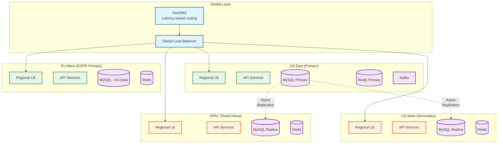
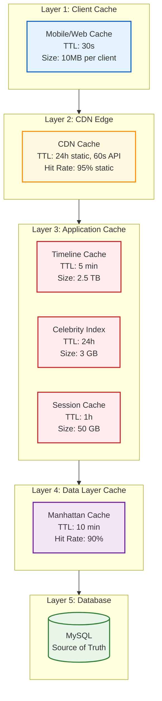
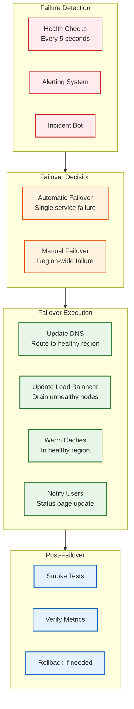

# Scalability and Reliability

## Table of Contents

1. [Horizontal Scaling Strategy](#horizontal-scaling-strategy)
2. [Multi-Region Architecture](#multi-region-architecture)
3. [Caching Architecture](#caching-architecture)
4. [Fault Tolerance](#fault-tolerance)
5. [Disaster Recovery](#disaster-recovery)
6. [Load Balancing](#load-balancing)
7. [Capacity Planning](#capacity-planning)

---

## Horizontal Scaling Strategy

### Service Scaling Matrix

| Service | Scaling Type | Trigger Metric | Threshold | Scale Unit |
|---------|-------------|----------------|-----------|------------|
| API Gateway | Horizontal | CPU utilization | >70% | +2 instances |
| Home Mixer | Horizontal | p99 latency | >1.2s | +5 pods |
| Tweetypie | Horizontal | Write QPS | >5000/instance | +3 instances |
| Navi (ML) | Horizontal + GPU | Inference latency | >50ms | +1 GPU node |
| Fanout Workers | Horizontal | Queue depth | >1M messages | +10 workers |
| Redis Cluster | Horizontal | Memory | >80% | +1 shard |
| ElasticSearch | Horizontal | Index lag | >2s | +2 data nodes |
| Kafka | Horizontal | Partition lag | >10K | +partitions |
| MySQL | Read replicas | CPU | >80% | +1 replica |

### Auto-Scaling Configuration

```
AUTO-SCALING POLICIES:

HOME MIXER:
  metric: custom/timeline_p99_latency
  target: 1200ms
  scale_up:
    threshold: >1200ms for 2 minutes
    cooldown: 60 seconds
    increment: 5 pods (10% of current)
  scale_down:
    threshold: <800ms for 10 minutes
    cooldown: 300 seconds
    decrement: 2 pods

FANOUT WORKERS:
  metric: kafka/consumer_group_lag
  target: 100,000 messages
  scale_up:
    threshold: >1,000,000 for 1 minute
    cooldown: 30 seconds
    increment: 10 workers
  scale_down:
    threshold: <50,000 for 5 minutes
    cooldown: 180 seconds
    decrement: 5 workers

NAVI GPU CLUSTER:
  metric: gpu/utilization
  target: 70%
  scale_up:
    threshold: >80% for 3 minutes
    cooldown: 120 seconds
    increment: 1 GPU node
  scale_down:
    threshold: <50% for 15 minutes
    cooldown: 600 seconds
    decrement: 1 GPU node
```

### Database Scaling Strategy

```
MYSQL SCALING (100K+ Shards):

VERTICAL SCALING:
  - Not preferred (limits reached)
  - Only for temporary relief

HORIZONTAL SCALING:
  1. READ REPLICAS
     - Each shard has 2-3 read replicas
     - Async replication (lag <100ms)
     - Route reads based on consistency requirements

  2. SHARD SPLITTING
     - Split hot shards when CPU >80% sustained
     - Use consistent hashing for minimal data movement
     - Online resharding with minimal downtime

  3. ARCHIVE/COLD STORAGE
     - Move tweets older than 1 year to cold storage
     - Lazy hydration on access
     - Reduces active shard size

SHARDING STRATEGY:
  ┌────────────────────────────────────────────────────────┐
  │ Data Type      │ Shard Key       │ Distribution       │
  ├────────────────┼─────────────────┼────────────────────┤
  │ Tweets         │ tweet_id        │ Time-based spread  │
  │ Users          │ user_id         │ Random hash        │
  │ Follows        │ follower_id     │ Co-locate with     │
  │                │                 │ user's follows     │
  │ Engagements    │ tweet_id        │ Co-locate with     │
  │                │                 │ tweet              │
  └────────────────────────────────────────────────────────┘
```

---

## Multi-Region Architecture

### Global Topology



### Regional Responsibilities

| Region | Role | Data Ownership | Traffic % |
|--------|------|----------------|-----------|
| **US-East** | Primary write, Global coordination | Non-EU users (primary) | 35% |
| **US-West** | Secondary, Failover for US-East | Non-EU users (replica) | 20% |
| **EU-West** | GDPR primary, EU data sovereignty | EU users only | 25% |
| **APAC** | Read replicas, Low-latency APAC | Non-EU users (replica) | 20% |

### Cross-Region Data Flow

```
DATA REPLICATION PATTERNS:

TWEETS (Non-EU):
  ┌──────────────────────────────────────────────────────┐
  │ US-East (Write Primary)                              │
  │      ↓                                               │
  │  Kafka (regional)                                    │
  │      ↓                                               │
  │  Cross-region replicator                             │
  │      ↓             ↓              ↓                  │
  │  US-West       EU-West*       APAC                   │
  │  (async)       (filtered)     (async)                │
  │                                                      │
  │ *EU-West only receives non-EU user tweets            │
  └──────────────────────────────────────────────────────┘

EU USER DATA (GDPR Compliance):
  ┌──────────────────────────────────────────────────────┐
  │ EU-West (Write Primary for EU users)                 │
  │      ↓                                               │
  │  EU Kafka cluster                                    │
  │      ↓                                               │
  │  Stays in EU (no cross-region replication)           │
  │                                                      │
  │ Exception: Public tweets viewable globally           │
  │            (content only, not user PII)              │
  └──────────────────────────────────────────────────────┘

TIMELINE CACHE:
  - Region-local only
  - No cross-region replication
  - Rebuilt from source on cache miss
  - Each region maintains independent cache

REPLICATION LAG TARGETS:
  - Within region: <10ms (sync for critical data)
  - Cross-region: <30 seconds (async)
  - EU → Other: N/A (no replication of EU user data)
```

### Consistency Model by Region

| Data Type | Within Region | Cross-Region | Notes |
|-----------|--------------|--------------|-------|
| Tweet content | Strong | Eventual (<30s) | Reads may see slightly stale |
| Engagement counts | Eventual | Eventual | Approximate counts OK |
| User profile | Strong | Eventual (<5s) | Fast propagation needed |
| Follow graph | Strong | Eventual (<10s) | Affects timeline delivery |
| Timeline cache | N/A | No replication | Region-local only |
| Search index | Strong | Eventual (<1s) | Fast indexing critical |

---

## Caching Architecture

### Five-Layer Cache Hierarchy



### Cache Configuration Details

| Layer | Component | TTL | Size | Hit Rate | Invalidation |
|-------|-----------|-----|------|----------|--------------|
| L1 | Client App | 30s | 10 MB | 20% | On refresh |
| L2 | CDN Static | 24h | Distributed | 95% | Purge API |
| L2 | CDN API | 60s | Distributed | 40% | TTL expiry |
| L3 | Timeline | 5 min | 2.5 TB | 70% | Kafka event |
| L3 | Celebrity | 24h | 3 GB | 90% | On new tweet |
| L3 | Session | 1h sliding | 50 GB | 99% | Logout/expire |
| L4 | Manhattan | 10 min | 500 GB | 90% | Write-through |

### Cache Warming Strategy

```
CACHE WARMING STRATEGIES:

1. LOGIN-TRIGGERED WARMING
   FUNCTION on_user_login(user_id):
       // Async warm critical caches
       background_job.enqueue([
           warm_timeline(user_id),
           warm_user_profile(user_id),
           warm_notification_count(user_id),
           prefetch_celebrity_tweets(user_id)
       ])

2. PREDICTIVE WARMING
   FUNCTION warm_active_users():
       // Every 5 minutes
       active_users = get_users_active_last_hour()

       FOR user_id IN active_users:
           IF cache_expired_soon(user_id):
               rebuild_timeline_async(user_id)

3. EVENT-DRIVEN WARMING
   FUNCTION on_celebrity_tweet(celebrity_id, tweet_id):
       // Proactively add to follower timelines
       followers_with_notifications = get_notification_followers(celebrity_id)

       FOR follower_id IN followers_with_notifications:
           inject_into_timeline(follower_id, tweet_id)

4. GEOGRAPHIC WARMING
   FUNCTION warm_region_on_deploy(region):
       // After deployment, warm critical caches
       top_users = get_top_users_in_region(region, limit=100000)

       FOR user_id IN top_users:
           warm_timeline(user_id)
           warm_profile(user_id)
```

---

## Fault Tolerance

### Graceful Degradation Levels

```
DEGRADATION LEVELS:

LEVEL 0: NORMAL OPERATION
├── Full personalization (ML ranking)
├── Real-time features (live counts, trends)
├── All content types (media, polls, etc.)
├── Full search functionality
└── Target latency: <1.5s

LEVEL 1: RANKING DEGRADED
├── Light model instead of heavy model
├── Reduced candidate pool (1000 → 500)
├── Slightly less personalized
├── Trigger: ML service degraded
└── Target latency: <1s

LEVEL 2: TIMELINE CACHE MISS
├── Serve chronological from follows
├── Skip out-of-network content
├── No ML ranking
├── Trigger: Redis cluster issues
└── Target latency: <2s

LEVEL 3: PARTIAL OUTAGE
├── Read-only mode (no posting)
├── Serve stale cached data
├── Disable engagement updates
├── Trigger: Database issues
└── Target latency: <3s

LEVEL 4: REGIONAL FAILOVER
├── Route to backup region
├── Higher latency accepted
├── May have stale data (replication lag)
├── Trigger: Full region failure
└── Target latency: <5s
```

### Circuit Breaker Configuration

```
CIRCUIT BREAKER PATTERNS:

NAVI ML SERVICE:
  ┌────────────────────────────────────────────────────────┐
  │ State: CLOSED → OPEN → HALF-OPEN → CLOSED             │
  │                                                        │
  │ Configuration:                                         │
  │   failure_threshold: 10 failures in 30 seconds         │
  │   success_threshold: 5 successes to close              │
  │   open_duration: 60 seconds                            │
  │   timeout: 100ms per request                           │
  │                                                        │
  │ Fallback: Use light ranker, chronological if needed    │
  └────────────────────────────────────────────────────────┘

MANHATTAN KV:
  ┌────────────────────────────────────────────────────────┐
  │ Configuration:                                         │
  │   failure_threshold: 20 failures in 60 seconds         │
  │   open_duration: 30 seconds                            │
  │   timeout: 50ms per request                            │
  │                                                        │
  │ Fallback: Serve from cache, degrade to IDs only        │
  └────────────────────────────────────────────────────────┘

ELASTICSEARCH:
  ┌────────────────────────────────────────────────────────┐
  │ Configuration:                                         │
  │   failure_threshold: 15 failures in 30 seconds         │
  │   open_duration: 45 seconds                            │
  │   timeout: 500ms per query                             │
  │                                                        │
  │ Fallback: Return cached trending, "Search unavailable" │
  └────────────────────────────────────────────────────────┘
```

### Retry Policies

```
RETRY POLICIES BY SERVICE:

TIMELINE READ:
  max_retries: 3
  initial_delay: 10ms
  max_delay: 100ms
  backoff: exponential (2x)
  jitter: 20%
  retry_on: [timeout, 503, 504]

TWEET WRITE:
  max_retries: 2
  initial_delay: 50ms
  max_delay: 200ms
  backoff: exponential
  idempotency_key: required
  retry_on: [timeout, 503]

ENGAGEMENT (LIKE/RT):
  max_retries: 1
  initial_delay: 20ms
  backoff: none
  retry_on: [timeout]
  note: Async reconciliation handles failures

SEARCH QUERY:
  max_retries: 2
  initial_delay: 100ms
  backoff: linear
  retry_on: [timeout, 503]
  fallback: cached results
```

### Bulkhead Pattern

```
BULKHEAD ISOLATION:

┌──────────────────────────────────────────────────────────┐
│                    REQUEST ROUTER                        │
└─────────────┬──────────────┬──────────────┬─────────────┘
              ↓              ↓              ↓
    ┌─────────────┐ ┌─────────────┐ ┌─────────────┐
    │  Timeline   │ │   Tweet     │ │   Search    │
    │   Pool      │ │   Pool      │ │   Pool      │
    │ (200 conn)  │ │ (100 conn)  │ │ (50 conn)   │
    └─────────────┘ └─────────────┘ └─────────────┘
          ↓              ↓              ↓
    ┌─────────────┐ ┌─────────────┐ ┌─────────────┐
    │ Home Mixer  │ │  Tweetypie  │ │Search Svc   │
    └─────────────┘ └─────────────┘ └─────────────┘

ISOLATION BENEFITS:
- Timeline failures don't affect tweet creation
- Search overload doesn't block timeline
- Resource limits per operation type

CONNECTION POOL SIZING:
- Timeline: 200 (highest volume)
- Tweet: 100 (writes need guaranteed capacity)
- Search: 50 (can degrade gracefully)
- Engagement: 150 (high volume, tolerant to drops)
```

---

## Disaster Recovery

### Recovery Objectives

| Metric | Target | Justification |
|--------|--------|---------------|
| **RTO** (Recovery Time Objective) | 5 minutes | Users can tolerate brief unavailability |
| **RPO** (Recovery Point Objective) - Within region | 0 | Synchronous replication for tweets |
| **RPO** - Cross-region | 30 seconds | Async replication acceptable |
| **Data Durability** | 99.999999999% (11 9s) | No tweet loss acceptable |

### Backup Strategy

```
BACKUP STRATEGY:

MYSQL (Tweets, Users):
  ├── Continuous: Binary log replication to replicas
  ├── Hourly: Incremental backups to blob storage
  ├── Daily: Full backup with point-in-time recovery
  ├── Weekly: Cross-region backup copy
  └── Retention: 90 days hot, 1 year cold

REDIS (Timeline Cache):
  ├── No backup needed (regenerable from source)
  ├── Persistence: AOF with fsync every second
  └── On restore: Rebuild from MySQL

ELASTICSEARCH (Search Index):
  ├── No backup needed (regenerable from tweets)
  ├── Snapshot: Daily for faster rebuild
  └── On restore: Re-index from tweet store

KAFKA (Event Streams):
  ├── Replication factor: 3
  ├── Retention: 7 days
  └── Cross-region mirroring: Yes

BLOB STORAGE (Media):
  ├── Erasure coding: Yes (11 nines durability)
  ├── Cross-region replication: Yes
  └── Versioning: Enabled
```

### Failover Procedures



### Region Failover Runbook

```
REGION FAILOVER RUNBOOK:

TRIGGER:
  - Primary region unreachable for >2 minutes
  - Data corruption detected
  - Mandatory evacuation (physical disaster)

STEPS:

1. CONFIRM FAILURE (T+0)
   □ Verify not a monitoring false positive
   □ Check multiple health endpoints
   □ Confirm with on-call in affected region

2. DECLARE INCIDENT (T+2 min)
   □ Page incident commander
   □ Update status page: "Investigating"
   □ Start incident channel

3. INITIATE FAILOVER (T+5 min)
   □ Update GeoDNS to route away from failed region
   □ Increase capacity in healthy regions
   □ Enable cache warming for migrated users

4. VERIFY FAILOVER (T+10 min)
   □ Run smoke tests in healthy regions
   □ Verify timeline loads
   □ Verify tweet creation
   □ Check search functionality

5. MONITOR (T+15 min onwards)
   □ Watch error rates
   □ Monitor latency (expected increase)
   □ Watch for capacity issues
   □ Update status page: "Partial outage, failover complete"

6. ROOT CAUSE ANALYSIS (Post-incident)
   □ Determine cause of failure
   □ Estimate data loss (RPO actual)
   □ Plan failback procedure

FAILBACK (When primary recovered):
  □ Verify primary region health
  □ Ensure replication caught up
  □ Gradual traffic shift (10% → 50% → 100%)
  □ Monitor for issues during shift
```

---

## Load Balancing

### Multi-Level Load Balancing

```
LOAD BALANCING HIERARCHY:

LEVEL 1: GeoDNS
├── Provider: Managed DNS with geo-routing
├── Strategy: Latency-based + availability
├── TTL: 60 seconds
└── Failover: Automatic health-check based

LEVEL 2: Global Load Balancer
├── Type: L7 (application-aware)
├── Strategy: Least connections with health weights
├── Features: SSL termination, DDoS protection
└── Failover: Cross-region automatic

LEVEL 3: Regional Load Balancer
├── Type: L7 with service routing
├── Strategy: Round-robin with health checks
├── Features: Request routing, rate limiting
└── Failover: Pod-level automatic

LEVEL 4: Service Mesh (Internal)
├── Implementation: Finagle-based
├── Strategy: Power of two choices
├── Features: Circuit breaking, retries, timeouts
└── Failover: Instance-level automatic
```

### Load Balancing Algorithms

```
ALGORITHM SELECTION BY TIER:

GLOBAL (GeoDNS):
  Algorithm: Weighted latency
  Weights based on:
    - Geographic proximity
    - Historical latency measurements
    - Current region health

API GATEWAY:
  Algorithm: Least connections
  Rationale:
    - Varied request duration (timeline vs like)
    - Prevents overload on slow instances
    - Health-weighted to avoid unhealthy nodes

HOME MIXER:
  Algorithm: Consistent hashing by user_id
  Rationale:
    - Cache locality (user's data on same instances)
    - Reduces cache misses
    - Sticky sessions for debugging

NAVI ML:
  Algorithm: Round-robin with GPU utilization weighting
  Rationale:
    - Balance GPU load
    - Batch efficiency (similar request sizes together)

REDIS CLUSTER:
  Algorithm: Hash slot based (Redis native)
  Rationale:
    - Data locality
    - Consistent hashing for minimal resharding
```

---

## Capacity Planning

### Growth Projections

| Metric | Current | Year 1 | Year 3 | Year 5 |
|--------|---------|--------|--------|--------|
| DAU | 250M | 300M | 400M | 500M |
| Tweets/day | 500M | 600M | 850M | 1B |
| Timeline QPS (peak) | 175K | 225K | 350K | 500K |
| Tweet Storage | 255 TB | 310 TB | 620 TB | 1 PB |
| Media Storage | 79 PB | 100 PB | 175 PB | 280 PB |
| MySQL Shards | 100K | 120K | 180K | 250K |
| Redis Cache | 2.5 TB | 3 TB | 4.5 TB | 6 TB |
| Navi GPU Nodes | 100 | 130 | 200 | 300 |

### Scaling Triggers

| Component | Metric | Warning | Critical | Action |
|-----------|--------|---------|----------|--------|
| Home Mixer | p99 latency | >1.5s | >2s | Scale +20% |
| Fanout Queue | Depth | >5M | >10M | Scale workers 2x |
| Redis | Memory | >75% | >85% | Add shard |
| MySQL | CPU | >70% | >85% | Add replica |
| ES | Indexing lag | >1s | >3s | Scale ingestion |
| Navi | GPU util | >75% | >90% | Add GPU node |
| API Gateway | CPU | >70% | >85% | Add instances |

### Capacity Planning Process

```
QUARTERLY CAPACITY PLANNING:

1. COLLECT METRICS
   - Current utilization by service
   - Growth rate over last quarter
   - Seasonal patterns

2. PROJECT DEMAND
   - Apply growth rate to current usage
   - Add buffer for events (elections, sports)
   - Account for new features

3. IDENTIFY GAPS
   - Compare projected demand to current capacity
   - Flag services <6 months runway
   - Prioritize by criticality

4. PLAN EXPANSION
   - Lead time for hardware: 2-3 months
   - Lead time for cloud: 1-2 weeks
   - Schedule maintenance windows

5. VALIDATE
   - Load test new capacity
   - Chaos engineering tests
   - Failover drills

EXAMPLE CALCULATION:

Current Timeline QPS: 175,000
Growth rate: 15% per quarter
Q4 projection: 175,000 × 1.15 = 201,250 QPS

Current capacity: 250,000 QPS (with 43% headroom)
Q4 headroom: 250,000 - 201,250 = 48,750 (24%)

Action: Within acceptable range (>20% headroom)
        Monitor, plan expansion for Q1 next year
```
