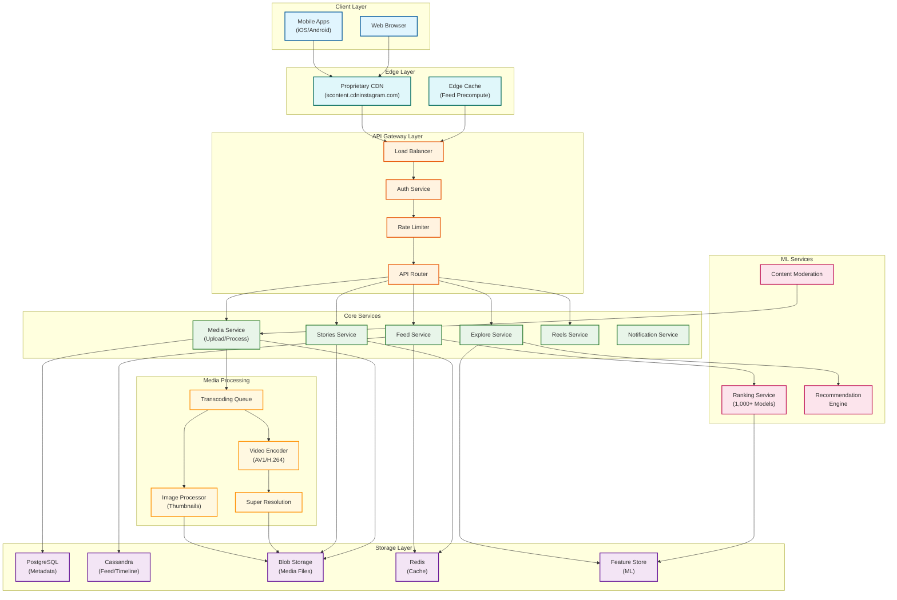

# Instagram System Design

[← Back to System Design Index](../README.md)

---

## Overview

Instagram is a media-first social platform enabling 2 billion monthly active users to share photos, videos, and ephemeral Stories. The system's core technical challenges center on **high-throughput media processing** (95+ million uploads daily), **24-hour Stories TTL management** at global scale, and **ML-powered Explore recommendations** extracting 65 billion features to make 90 million predictions per second.

**Key Differentiators from Facebook/Twitter:**
- **Media-First Architecture**: Every post requires image/video processing, not optional attachments
- **Visual Discovery**: Explore feed drives 50%+ of content discovery (vs text-based search)
- **Ephemeral Content**: Stories require precise 24-hour TTL with distributed cache synchronization

---

## System Characteristics

| Characteristic | Value | Implication |
|----------------|-------|-------------|
| Traffic Pattern | Read-heavy (100:1 read-write ratio) | Heavy CDN caching, precomputed feeds |
| Latency Target | <200ms feed load, <1s upload ack | Edge caching, async processing |
| Consistency Model | Eventual (feed), Strong (uploads) | Hybrid storage strategy |
| Availability Target | 99.99% | Multi-region active-active |
| Data Model | Media-centric with social graph | Blob storage + graph traversal |
| Scale | 2B MAU, 95M+ uploads/day | Extreme horizontal scaling |
| Unique Challenge | 24-hour Stories expiration | Distributed TTL management |

---

## Complexity Rating

| Component | Complexity | Reason |
|-----------|------------|--------|
| **Overall System** | Very High | Media processing + ML ranking + ephemeral content |
| Media Processing Pipeline | Very High | AV1 encoding, Super Resolution, thumbnail generation at 1,100 uploads/sec |
| Explore Recommendations | Very High | 65B features, 90M predictions/sec, two-stage ranking |
| Stories Architecture | High | 24-hour TTL, distributed expiration, cache synchronization |
| Feed Ranking | High | 1,000+ ML models, real-time personalization |
| CDN & Edge Caching | High | Proprietary CDN, global distribution, cache invalidation |
| Social Graph | Medium-High | Follow relationships, hybrid fan-out |

---

## Quick Navigation

| Document | Description |
|----------|-------------|
| [01 - Requirements & Estimations](./01-requirements-and-estimations.md) | Functional/non-functional requirements, capacity planning |
| [02 - High-Level Design](./02-high-level-design.md) | Architecture, data flows, key decisions |
| [03 - Low-Level Design](./03-low-level-design.md) | Data models, APIs, algorithms |
| [04 - Deep Dive & Bottlenecks](./04-deep-dive-and-bottlenecks.md) | Media pipeline, Stories TTL, Explore ranking |
| [05 - Scalability & Reliability](./05-scalability-and-reliability.md) | Scaling strategies, fault tolerance |
| [06 - Security & Compliance](./06-security-and-compliance.md) | Privacy, content moderation, GDPR |
| [07 - Observability](./07-observability.md) | Metrics, tracing, alerting |
| [08 - Interview Guide](./08-interview-guide.md) | Pacing, trap questions, trade-offs |

---

## Core Modules

| Module | Responsibility | Key Challenge | Scale |
|--------|----------------|---------------|-------|
| **Media Service** | Upload, processing, storage | AV1 encoding, thumbnail generation | 95M+ uploads/day |
| **Feed Service** | Timeline assembly & ranking | Real-time personalization | 500M+ DAU |
| **Stories Service** | Ephemeral content lifecycle | 24-hour TTL at global scale | 500M+ daily Stories users |
| **Explore Service** | Content discovery | 90M predictions/sec | 65B features extracted |
| **Reels Service** | Short-form video | Watch-time optimization | 200B+ plays/day (Meta family) |
| **CDN** | Media delivery | Edge caching, cache invalidation | Petabytes/day |
| **Ranking Service** | ML-based ordering | 1,000+ models in production | Real-time inference |

---

## Architecture Overview



---

## Instagram vs Facebook vs Twitter

| Aspect | Instagram | Facebook | Twitter |
|--------|-----------|----------|---------|
| **Primary Content** | Visual (photo/video) | Mixed (text + media) | Text-first (280 chars) |
| **Graph Type** | Unidirectional (follow) | Bidirectional (friend) | Unidirectional (follow) |
| **Discovery Model** | Visual Explore feed | News Feed + Groups | Search + Trends |
| **Ephemeral Content** | Stories (core feature) | Stories (secondary) | Fleets (discontinued) |
| **Celebrity Threshold** | ~100K followers | ~10K followers | ~100K followers |
| **Media Processing** | Every post (required) | Optional attachments | Optional attachments |
| **Ranking Priority** | Watch time, shares, saves | Engagement + connections | Retweets (20x weight) |

---

## Key Scale Numbers

| Metric | Value | Context |
|--------|-------|---------|
| Monthly Active Users | 2 billion | Global platform |
| Daily Active Users | 500+ million | High engagement |
| Photos/Videos Uploaded Daily | 95+ million | ~1,100/sec |
| Photos Uploaded per Minute | 33,472 | Peak load handling |
| Videos Uploaded per Minute | 15,833 | Transcoding capacity |
| ML Models in Production | 1,000+ | Ranking, moderation, recommendations |
| Explore Predictions/Second | 90 million | Real-time ML inference |
| Features Extracted for Explore | 65 billion | Feature engineering scale |
| Reels Plays Daily (Meta) | 200+ billion | Short-form video dominance |
| Video Watch Using AV1 | 70%+ | Codec adoption |
| Video Encoding Cost Reduction | 94% | Infrastructure optimization |

---

## Media Processing Pipeline Overview

```
┌─────────────────────────────────────────────────────────────────────────┐
│                        MEDIA UPLOAD PIPELINE                            │
├─────────────────────────────────────────────────────────────────────────┤
│                                                                         │
│  STAGE 1: INGESTION                                                     │
│  ┌─────────────────────────────────────────────────────────────────┐   │
│  │ • Accept upload (max 8MB images, larger with compression)       │   │
│  │ • Strip EXIF metadata (GPS, camera info) for privacy            │   │
│  │ • Generate unique media ID                                      │   │
│  │ • Queue for async processing                                    │   │
│  │ • Return immediate acknowledgment to client                     │   │
│  └─────────────────────────────────────────────────────────────────┘   │
│                              ↓                                          │
│  STAGE 2: PROCESSING (Parallel)                                        │
│  ┌─────────────────────────────────────────────────────────────────┐   │
│  │ IMAGES:                          VIDEOS:                         │   │
│  │ • ML-based compression           • Transcode to AV1 (primary)   │   │
│  │ • Generate thumbnails:           • Transcode to H.264 (fallback)│   │
│  │   - Preview (1440px)             • Generate ABR encodings       │   │
│  │   - Thumbnail (250px)            • Apply Super Resolution       │   │
│  │   - Thumbhash (blur)             • Extract keyframes            │   │
│  │ • Apply filters (if selected)    • Generate preview thumbnail   │   │
│  └─────────────────────────────────────────────────────────────────┘   │
│                              ↓                                          │
│  STAGE 3: STORAGE & DISTRIBUTION                                       │
│  ┌─────────────────────────────────────────────────────────────────┐   │
│  │ • Store processed media in blob storage                         │   │
│  │ • Push to CDN edge nodes                                        │   │
│  │ • Update metadata in PostgreSQL                                 │   │
│  │ • Trigger content moderation check                              │   │
│  │ • Notify feed fanout service                                    │   │
│  └─────────────────────────────────────────────────────────────────┘   │
│                                                                         │
└─────────────────────────────────────────────────────────────────────────┘
```

---

## Stories Architecture: 24-Hour TTL

```
┌─────────────────────────────────────────────────────────────────────────┐
│                        STORIES LIFECYCLE                                │
├─────────────────────────────────────────────────────────────────────────┤
│                                                                         │
│  USER POSTS STORY (T=0)                                                │
│  ┌─────────────────────────────────────────────────────────────────┐   │
│  │ • Upload media via Stories Upload Service                       │   │
│  │ • Store with created_at timestamp and expires_at = T + 24h      │   │
│  │ • Push to CDN edge cache                                        │   │
│  │ • Notify all followers (Stories tray update)                    │   │
│  └─────────────────────────────────────────────────────────────────┘   │
│                              ↓                                          │
│  ACTIVE PERIOD (T=0 to T=24h)                                          │
│  ┌─────────────────────────────────────────────────────────────────┐   │
│  │ • Stories tray ranks by: viewing history, closeness, prediction │   │
│  │ • Track view analytics (who viewed, replay count)               │   │
│  │ • Serve from edge cache (low latency)                           │   │
│  │ • Handle interactive elements (polls, questions)                │   │
│  └─────────────────────────────────────────────────────────────────┘   │
│                              ↓                                          │
│  EXPIRATION (T=24h)                                                    │
│  ┌─────────────────────────────────────────────────────────────────┐   │
│  │ • Expiration Service removes from active store                  │   │
│  │ • Invalidate CDN cache entries                                  │   │
│  │ • Update Stories tray (remove ring indicator)                   │   │
│  │ • Move to archive (if Highlights enabled) or delete             │   │
│  │ • Handle offline clients syncing stale content                  │   │
│  └─────────────────────────────────────────────────────────────────┘   │
│                                                                         │
└─────────────────────────────────────────────────────────────────────────┘
```

---

## Feed Ranking Signals (2025)

| Signal | Weight | Description |
|--------|--------|-------------|
| **Watch Time** | Highest | Both absolute duration and completion percentage |
| **Shares (DM Sends)** | Very High | Strongest signal for out-of-network discovery |
| **Saves** | High | Indicates depth of engagement |
| **Likes** | Medium-High | Basic engagement signal |
| **Comments** | Medium | Conversation depth matters more than count |
| **Recency** | Medium | Freshness decay applied |
| **Relationship** | High | History with creator influences ranking |

---

## When to Use This Design

| Scenario | Applicable | Reason |
|----------|------------|--------|
| Photo/video sharing platform | Yes | Core use case |
| Media-heavy social network | Yes | Processing pipeline applies |
| Ephemeral content (Stories-like) | Yes | TTL architecture applies |
| Visual discovery/recommendations | Yes | Explore architecture applies |
| Text-first social platform | Partial | Ranking applies, media pipeline overkill |
| E-commerce product images | Partial | Media pipeline applies, social graph doesn't |
| Simple file storage | No | Over-engineered |

---

## Technology Stack Reference

| Layer | Technology Pattern | Real-World Example |
|-------|-------------------|-------------------|
| Metadata Storage | Relational DB with sharding | PostgreSQL |
| Timeline Storage | Wide-column NoSQL | Cassandra |
| Caching | Distributed key-value cache | Redis, Memcached |
| Media Storage | Distributed blob storage | Proprietary (S3-like) |
| CDN | Proprietary edge network | scontent.cdninstagram.com |
| Video Codec | Next-gen compression | AV1 (70%+ adoption) |
| ML Serving | Real-time inference | 1,000+ models |
| Feature Store | ML feature serving | Custom (65B features) |

---

## Interview Readiness Checklist

Before your interview, ensure you can:

- [ ] Explain why Instagram needs a different architecture than Twitter/Facebook (media-first)
- [ ] Walk through the media upload pipeline (ingestion → processing → distribution)
- [ ] Describe Stories 24-hour TTL management across distributed systems
- [ ] Explain the two-stage Explore ranking pipeline (65B features, 90M predictions/sec)
- [ ] Calculate capacity estimates (uploads/sec, storage/day, cache requirements)
- [ ] Discuss hybrid fan-out for celebrity accounts
- [ ] Handle CDN cache invalidation scenarios
- [ ] Describe AV1 codec benefits (30% better compression, 70% adoption)
- [ ] Explain Super Resolution for quality optimization

---

## Quick Reference Card

```
┌─────────────────────────────────────────────────────────────────────────┐
│                    INSTAGRAM SYSTEM DESIGN CHEAT SHEET                  │
├─────────────────────────────────────────────────────────────────────────┤
│                                                                         │
│  SCALE NUMBERS:                                                         │
│  • 2B MAU  • 500M+ DAU  • 95M uploads/day  • 1,100 uploads/sec         │
│  • 90M predictions/sec  • 65B features  • 1,000+ ML models             │
│                                                                         │
│  MEDIA PIPELINE:                                                        │
│  • AV1 codec (70%+ video, 30% better compression)                      │
│  • Super Resolution for quality enhancement                            │
│  • 94% compute cost reduction achieved                                 │
│  • Thumbnails: Preview (1440px), Thumb (250px), Thumbhash              │
│                                                                         │
│  STORIES:                                                               │
│  • 24-hour TTL with distributed expiration                             │
│  • Tray ranking: viewing history, closeness, predictions               │
│  • Edge cached for low-latency playback                                │
│                                                                         │
│  EXPLORE:                                                               │
│  • Two-stage: Retrieval (thousands) → Ranking (hundreds)               │
│  • 65B features extracted per request                                  │
│  • 90M predictions/sec                                                 │
│                                                                         │
│  RANKING SIGNALS:                                                       │
│  • Watch Time (highest)  • Shares (very high)  • Saves (high)          │
│  • Likes (medium-high)  • Comments (medium)  • Recency (decay)         │
│                                                                         │
│  KEY TRADE-OFFS:                                                        │
│  • Immediate ack vs sync processing (async wins for UX)                │
│  • Quality vs latency (ABR streaming for videos)                       │
│  • Freshness vs cache hit rate (TTL tuning)                            │
│                                                                         │
│  COMMON TRAPS:                                                          │
│  • Forgetting media processing is required (not optional)              │
│  • Underestimating Stories expiration complexity                       │
│  • Not considering celebrity fan-out problem                           │
│  • Ignoring CDN cache invalidation                                     │
│                                                                         │
└─────────────────────────────────────────────────────────────────────────┘
```

---

## Related Designs

| Design | Relevance |
|--------|-----------|
| [Facebook](../4.1-facebook/00-index.md) | Social graph, feed ranking, TAO architecture |
| [Twitter/X](../4.2-twitter/00-index.md) | Celebrity fan-out, real-time feed |
| [Blob Storage System](../1.12-blob-storage-system/00-index.md) | Media storage patterns |
| [CDN Design](../1.15-content-delivery-network-cdn/00-index.md) | Edge caching, cache invalidation |
| [Recommendation Engine](../3.12-recommendation-engine/00-index.md) | Explore feed ranking |
| [AI Image Generation Platform](../3.20-ai-image-generation-platform/00-index.md) | Media processing at scale |

---

## References

- [Scaling the Instagram Explore recommendations system - Engineering at Meta](https://engineering.fb.com/2023/08/09/ml-applications/scaling-instagram-explore-recommendations-system/)
- [Journey to 1000 models: Scaling Instagram's recommendation system - Engineering at Meta](https://engineering.fb.com/2025/05/21/production-engineering/journey-to-1000-models-scaling-instagrams-recommendation-system/)
- [Reducing Instagram's basic video compute time by 94 percent - Engineering at Meta](https://engineering.fb.com/2022/11/04/video-engineering/instagram-video-processing-encoding-reduction/)
- [How Meta brought AV1 to Reels - Engineering at Meta](https://engineering.fb.com/2023/02/21/video-engineering/av1-codec-facebook-instagram-reels/)
- [Making Instagram.com faster: Part 3 — cache first - Instagram Engineering](https://instagram-engineering.com/making-instagram-com-faster-part-3-cache-first-6f3f130b9669/)
- [Instagram Feed Recommendations - Meta Transparency Center](https://transparency.meta.com/features/explaining-ranking/ig-feed-recommendations/)
- [Instagram Explore - Meta Transparency Center](https://transparency.meta.com/features/explaining-ranking/ig-explore/)

---

*Next: [Requirements & Estimations →](./01-requirements-and-estimations.md)*
