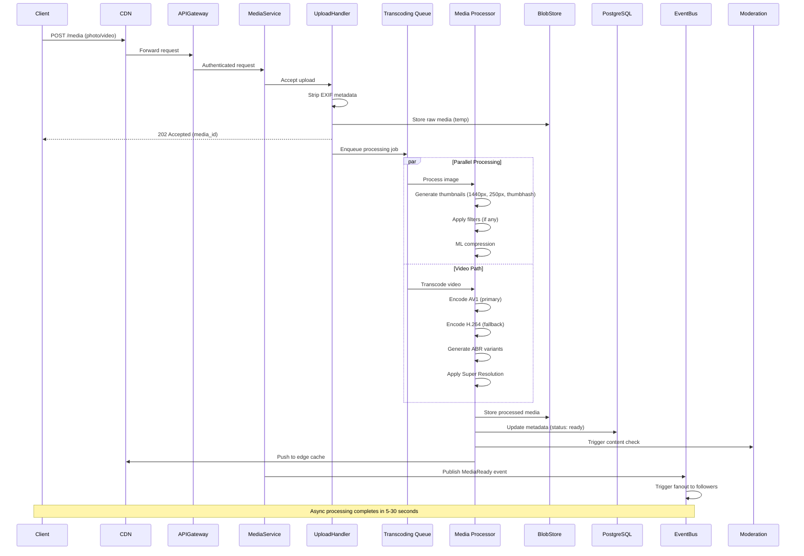
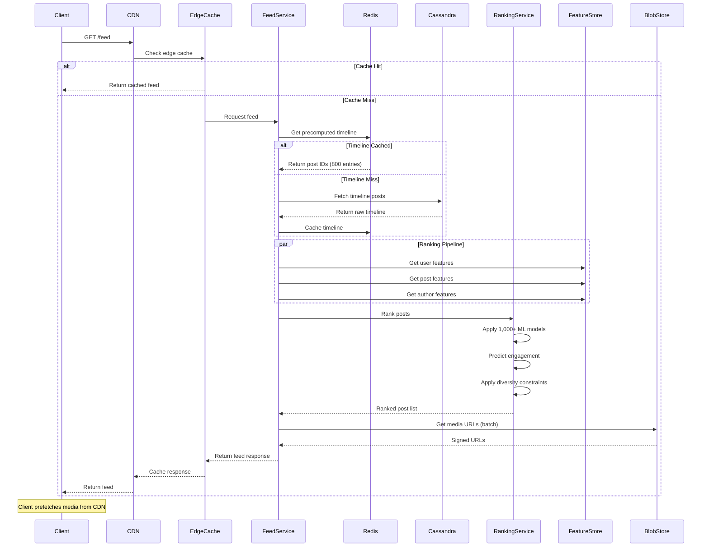
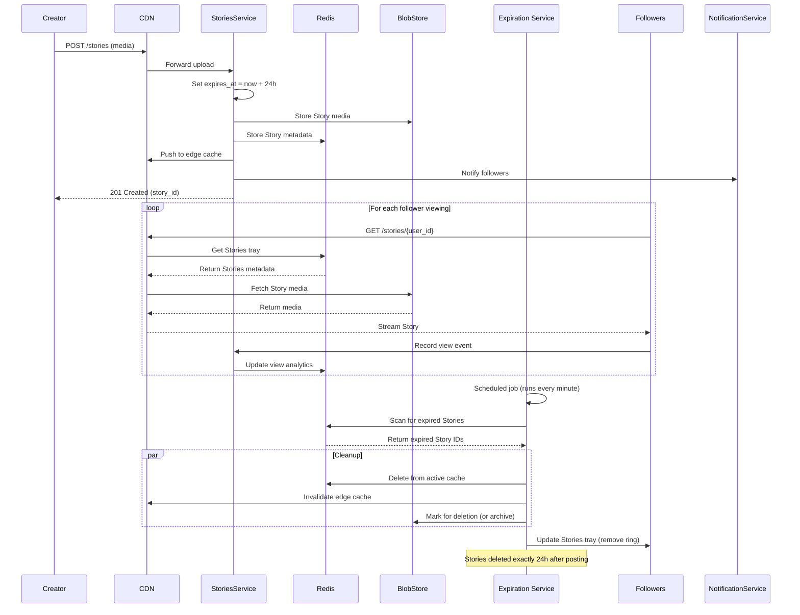
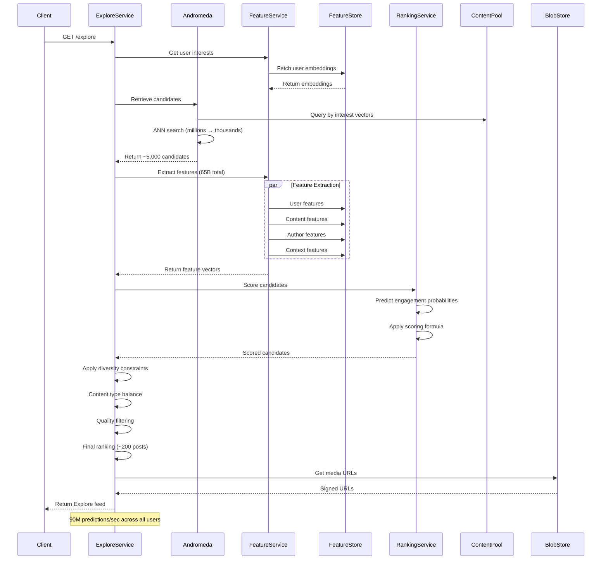
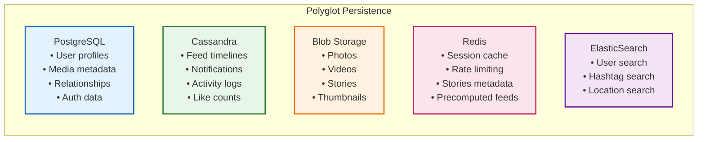
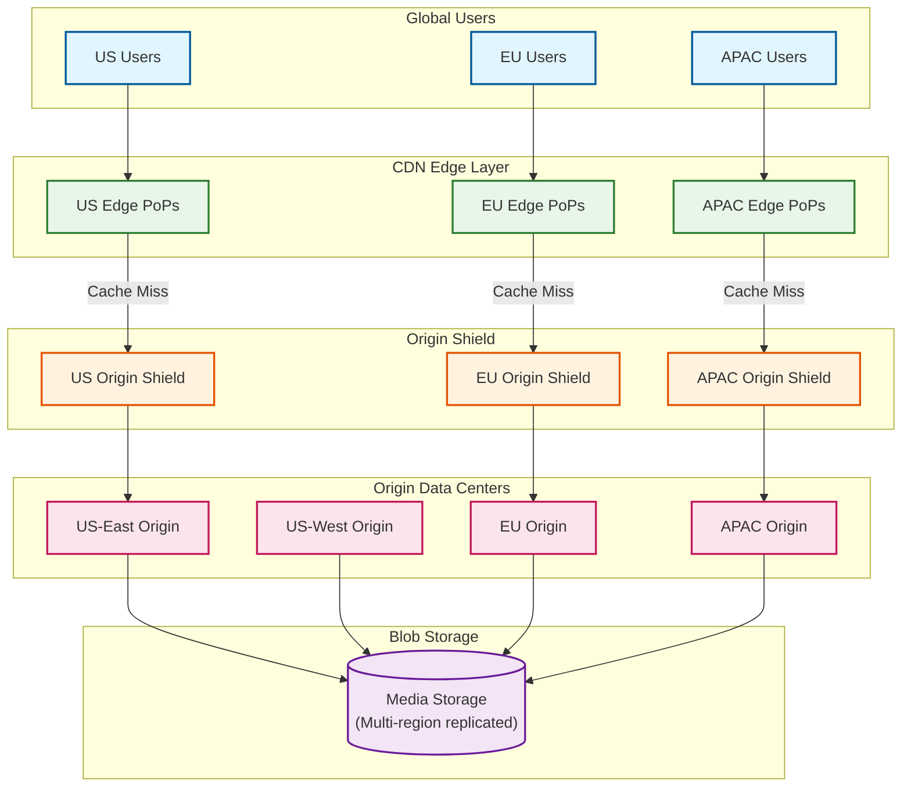
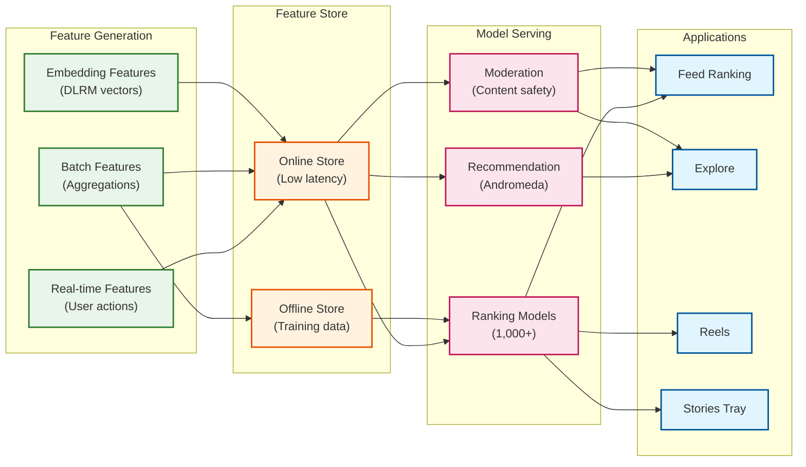

# High-Level Design

[← Back to Requirements](./01-requirements-and-estimations.md) | [Next: Low-Level Design →](./03-low-level-design.md)

---

## System Architecture

```mermaid
flowchart TB
    subgraph Clients["Client Layer"]
        iOS["iOS App"]
        Android["Android App"]
        Web["Web App<br/>(instagram.com)"]
    end

    subgraph Edge["Edge Layer"]
        CDN["Proprietary CDN<br/>(scontent.cdninstagram.com)"]
        EdgeCompute["Edge Compute<br/>(ExecuTorch ML)"]
    end

    subgraph Gateway["Gateway Layer"]
        GLB["Global Load Balancer<br/>(GeoDNS)"]
        LB["Regional Load Balancer"]
        APIGateway["API Gateway"]
        Auth["Auth Service<br/>(OAuth 2.0)"]
        RateLimiter["Rate Limiter"]
    end

    subgraph CoreServices["Core Services"]
        MediaService["Media Service"]
        FeedService["Feed Service"]
        StoriesService["Stories Service"]
        ExploreService["Explore Service"]
        ReelsService["Reels Service"]
        UserService["User Service"]
        FollowService["Follow Service"]
        InteractionService["Interaction Service<br/>(Likes/Comments)"]
        NotificationService["Notification Service"]
        SearchService["Search Service"]
    end

    subgraph MLServices["ML Services"]
        RankingService["Ranking Service<br/>(1,000+ Models)"]
        RecommendationEngine["Recommendation Engine<br/>(Andromeda)"]
        ModerationService["Content Moderation<br/>(ML + Human)"]
        FeatureService["Feature Service<br/>(65B features)"]
    end

    subgraph MediaPipeline["Media Processing Pipeline"]
        UploadHandler["Upload Handler"]
        TranscodingQueue["Transcoding Queue"]
        ImageProcessor["Image Processor"]
        VideoEncoder["Video Encoder<br/>(AV1/H.264)"]
        ThumbnailGenerator["Thumbnail Generator"]
        SuperResolution["Super Resolution<br/>(VSR)"]
        FilterEngine["Filter Engine"]
    end

    subgraph Streaming["Event Streaming"]
        EventBus["Event Bus"]
        FanoutService["Fanout Service"]
        ActivityStream["Activity Stream"]
    end

    subgraph Storage["Storage Layer"]
        PostgreSQL[("PostgreSQL<br/>(User/Media Metadata)")]
        Cassandra[("Cassandra<br/>(Feed/Timeline)")]
        BlobStorage[("Blob Storage<br/>(Media Files)")]
        Redis[("Redis<br/>(Cache/Sessions)")]
        Memcached[("Memcached<br/>(Query Cache)")]
        FeatureStore[("Feature Store<br/>(ML Features)")]
        SearchIndex[("Search Index<br/>(ElasticSearch)")]
    end

    %% Client connections
    iOS --> CDN
    Android --> CDN
    Web --> CDN
    iOS --> EdgeCompute
    Android --> EdgeCompute
    CDN --> GLB
    EdgeCompute --> GLB

    %% Gateway flow
    GLB --> LB --> APIGateway
    APIGateway --> Auth
    APIGateway --> RateLimiter

    %% Core service routing
    RateLimiter --> MediaService
    RateLimiter --> FeedService
    RateLimiter --> StoriesService
    RateLimiter --> ExploreService
    RateLimiter --> ReelsService
    RateLimiter --> UserService
    RateLimiter --> SearchService

    %% Media pipeline
    MediaService --> UploadHandler
    UploadHandler --> TranscodingQueue
    TranscodingQueue --> ImageProcessor
    TranscodingQueue --> VideoEncoder
    ImageProcessor --> ThumbnailGenerator
    ImageProcessor --> FilterEngine
    VideoEncoder --> SuperResolution
    ThumbnailGenerator --> BlobStorage
    SuperResolution --> BlobStorage
    FilterEngine --> BlobStorage

    %% Feed & ranking
    FeedService --> RankingService
    FeedService --> Cassandra
    FeedService --> Redis
    StoriesService --> Redis
    StoriesService --> BlobStorage
    ExploreService --> RecommendationEngine
    ExploreService --> FeatureService
    ReelsService --> RankingService

    %% ML connections
    RankingService --> FeatureStore
    RecommendationEngine --> FeatureStore
    ModerationService --> MediaService

    %% Streaming
    MediaService --> EventBus
    InteractionService --> EventBus
    EventBus --> FanoutService
    EventBus --> ActivityStream
    FanoutService --> Cassandra
    ActivityStream --> NotificationService

    %% Storage connections
    UserService --> PostgreSQL
    FollowService --> PostgreSQL
    MediaService --> PostgreSQL
    InteractionService --> Cassandra
    SearchService --> SearchIndex

    classDef client fill:#e1f5fe,stroke:#01579b,stroke-width:2px
    classDef edge fill:#e0f7fa,stroke:#00695c,stroke-width:2px
    classDef gateway fill:#fff3e0,stroke:#e65100,stroke-width:2px
    classDef core fill:#e8f5e9,stroke:#2e7d32,stroke-width:2px
    classDef ml fill:#fce4ec,stroke:#c2185b,stroke-width:2px
    classDef pipeline fill:#fff8e1,stroke:#ff8f00,stroke-width:2px
    classDef streaming fill:#e8eaf6,stroke:#3f51b5,stroke-width:2px
    classDef storage fill:#f3e5f5,stroke:#6a1b9a,stroke-width:2px

    class iOS,Android,Web client
    class CDN,EdgeCompute edge
    class GLB,LB,APIGateway,Auth,RateLimiter gateway
    class MediaService,FeedService,StoriesService,ExploreService,ReelsService,UserService,FollowService,InteractionService,NotificationService,SearchService core
    class RankingService,RecommendationEngine,ModerationService,FeatureService ml
    class UploadHandler,TranscodingQueue,ImageProcessor,VideoEncoder,ThumbnailGenerator,SuperResolution,FilterEngine pipeline
    class EventBus,FanoutService,ActivityStream streaming
    class PostgreSQL,Cassandra,BlobStorage,Redis,Memcached,FeatureStore,SearchIndex storage
```



---

## Data Flow Diagrams

### 1. Media Upload Flow



### 2. Feed Generation Flow



### 3. Stories Lifecycle Flow



### 4. Explore Discovery Flow



---

## Key Architectural Decisions

### 1. Service Architecture

| Decision | Choice | Rationale |
|----------|--------|-----------|
| Architecture Style | Microservices | Independent scaling, deployment, team ownership |
| Communication (Internal) | gRPC | Low latency, strong typing, streaming support |
| Communication (External) | REST + GraphQL | Developer familiarity, flexible queries |
| Service Discovery | DNS-based + Service Mesh | Reliability, traffic management |

### 2. Sync vs Async Communication

| Flow | Model | Reason |
|------|-------|--------|
| Media Upload | Async | Long processing time (5-30s); immediate ack needed |
| Feed Load | Sync | User waiting; low latency required |
| Stories Post | Async | Background processing, immediate confirmation |
| Fanout to Followers | Async | High volume; eventual consistency acceptable |
| ML Ranking | Sync (with timeout) | Required for response; fallback to cache |
| Notifications | Async | Fire-and-forget; batching optimization |

### 3. Database Choices



| Database | Use Case | Why This Choice |
|----------|----------|-----------------|
| **PostgreSQL** | User profiles, media metadata, relationships | Strong consistency, ACID, complex queries |
| **Cassandra** | Feed timelines, notifications, activity | High write throughput, horizontal scaling |
| **Blob Storage** | Media files | Optimized for large binary objects |
| **Redis** | Caching, sessions, rate limiting | Sub-millisecond latency, data structures |
| **Memcached** | Query caching | Simple, fast, distributed |
| **ElasticSearch** | Search (users, hashtags, locations) | Full-text search, relevance ranking |

### 4. Caching Strategy

| Layer | Technology | Data Cached | TTL |
|-------|------------|-------------|-----|
| **L1 (Client)** | IndexedDB | Feed data, session | Session-based |
| **L2 (Edge/CDN)** | Proprietary CDN | Media files, static assets | Hours-days |
| **L3 (Application)** | Redis | Precomputed feeds, Stories | Minutes-hours |
| **L4 (Database)** | Memcached | Query results, hot rows | Seconds-minutes |

**Cache-First Rendering Strategy:**
1. Client requests feed
2. Serve cached feed immediately (2.5% faster display)
3. Fetch fresh data in background
4. Replace cached data when fresh data arrives
5. User sees instant content, then updates

### 5. Message Queue Usage

| Use Case | Pattern | Technology |
|----------|---------|------------|
| Media Processing | Work Queue | Distributed queue |
| Feed Fanout | Pub/Sub | Event streaming |
| Notifications | Priority Queue | Batch processing |
| Activity Logging | Append-only Log | Event store |
| Analytics Events | Streaming | Real-time processing |

---

## Architecture Pattern Checklist

| Pattern | Decision | Implementation |
|---------|----------|----------------|
| Sync vs Async | Hybrid | Sync for reads, async for writes |
| Event-driven vs Request-response | Both | Event-driven for updates, request-response for queries |
| Push vs Pull (Feed) | Hybrid | Push for regular users (<100K), pull for celebrities |
| Stateless vs Stateful | Stateless services | State externalized to Redis/databases |
| Read-heavy optimization | Yes | Multi-tier caching, precomputation |
| Real-time vs Batch | Both | Real-time for feed ranking, batch for ML training |
| Edge processing | Yes | CDN caching, ExecuTorch on-device ML |

---

## Hybrid Fan-out Strategy

Instagram uses the same hybrid approach as Facebook/Twitter for content distribution:

```
┌─────────────────────────────────────────────────────────────────────────┐
│                        HYBRID FAN-OUT STRATEGY                          │
├─────────────────────────────────────────────────────────────────────────┤
│                                                                         │
│  REGULAR USERS (<100K followers)                                        │
│  ┌─────────────────────────────────────────────────────────────────┐   │
│  │ Fan-out on WRITE (Push Model)                                   │   │
│  │ • When user posts, push to all follower timelines               │   │
│  │ • Stored in Cassandra (follower_id, post_id, timestamp)         │   │
│  │ • Feed read = simple range query                                │   │
│  │ • Trade-off: Write amplification, but fast reads                │   │
│  └─────────────────────────────────────────────────────────────────┘   │
│                                                                         │
│  CELEBRITY USERS (≥100K followers)                                      │
│  ┌─────────────────────────────────────────────────────────────────┐   │
│  │ Fan-out on READ (Pull Model)                                    │   │
│  │ • When user posts, store only in author's post list             │   │
│  │ • When follower loads feed, merge celebrity posts on-demand     │   │
│  │ • Trade-off: Slower reads, but manageable write load            │   │
│  └─────────────────────────────────────────────────────────────────┘   │
│                                                                         │
│  TIMELINE ASSEMBLY:                                                     │
│  ┌─────────────────────────────────────────────────────────────────┐   │
│  │ 1. Fetch pushed posts from timeline (regular users)             │   │
│  │ 2. Fetch posts from followed celebrities (pull)                 │   │
│  │ 3. Merge and sort by timestamp                                  │   │
│  │ 4. Apply ML ranking                                             │   │
│  │ 5. Return top N posts                                           │   │
│  └─────────────────────────────────────────────────────────────────┘   │
│                                                                         │
└─────────────────────────────────────────────────────────────────────────┘
```

---

## CDN Architecture



**CDN Key Features:**
- **Proprietary CDN**: Instagram operates its own CDN (scontent.cdninstagram.com)
- **Edge Caching**: Media cached at PoPs closest to users
- **Origin Shield**: Intermediate caching layer protects origin
- **Intelligent Prefetching**: ML predicts content to cache (35% bandwidth savings)
- **Cache Invalidation**: Event-driven invalidation for Stories expiration

---

## ML Infrastructure Overview



---

## Key Technical Decisions Summary

| Area | Decision | Trade-off |
|------|----------|-----------|
| **Storage** | Polyglot (PostgreSQL + Cassandra + Blob) | Complexity vs optimal performance per use case |
| **Caching** | Multi-tier (Client → CDN → Redis → Memcached) | Memory cost vs latency |
| **Fan-out** | Hybrid (push <100K, pull ≥100K) | Write amplification vs read latency |
| **Processing** | Async with immediate ack | User experience vs processing delay |
| **Consistency** | Eventual for feed, strong for uploads | Freshness vs availability |
| **ML Ranking** | Real-time (1,000+ models) | Latency vs personalization quality |
| **Video Codec** | AV1 primary, H.264 fallback | Compression vs device compatibility |
| **CDN** | Proprietary | Control vs cost |

---

*[← Back to Requirements](./01-requirements-and-estimations.md) | [Next: Low-Level Design →](./03-low-level-design.md)*
