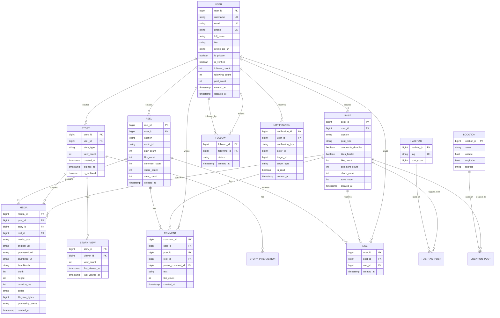

# Low-Level Design

[← Back to High-Level Design](./02-high-level-design.md) | [Next: Deep Dive & Bottlenecks →](./04-deep-dive-and-bottlenecks.md)

---

## Data Models

### Entity Relationship Diagram



---

## Schema Definitions

### PostgreSQL Schemas (Metadata)

```sql
-- Users table (sharded by user_id)
CREATE TABLE users (
    user_id         BIGINT PRIMARY KEY,      -- Snowflake ID
    username        VARCHAR(30) UNIQUE NOT NULL,
    email           VARCHAR(255) UNIQUE,
    phone           VARCHAR(20) UNIQUE,
    full_name       VARCHAR(100),
    bio             VARCHAR(150),
    profile_pic_url VARCHAR(512),
    is_private      BOOLEAN DEFAULT FALSE,
    is_verified     BOOLEAN DEFAULT FALSE,
    follower_count  INT DEFAULT 0,
    following_count INT DEFAULT 0,
    post_count      INT DEFAULT 0,
    created_at      TIMESTAMP DEFAULT NOW(),
    updated_at      TIMESTAMP DEFAULT NOW()
);

-- Indexes
CREATE INDEX idx_users_username ON users(username);
CREATE INDEX idx_users_created_at ON users(created_at);

-- Posts table (sharded by user_id)
CREATE TABLE posts (
    post_id           BIGINT PRIMARY KEY,    -- Snowflake ID
    user_id           BIGINT NOT NULL,
    caption           TEXT,
    post_type         VARCHAR(20) NOT NULL,  -- 'photo', 'video', 'carousel'
    comments_disabled BOOLEAN DEFAULT FALSE,
    likes_hidden      BOOLEAN DEFAULT FALSE,
    like_count        INT DEFAULT 0,
    comment_count     INT DEFAULT 0,
    share_count       INT DEFAULT 0,
    save_count        INT DEFAULT 0,
    created_at        TIMESTAMP DEFAULT NOW(),

    CONSTRAINT fk_posts_user FOREIGN KEY (user_id) REFERENCES users(user_id)
);

-- Indexes
CREATE INDEX idx_posts_user_id ON posts(user_id);
CREATE INDEX idx_posts_created_at ON posts(created_at DESC);
CREATE INDEX idx_posts_user_created ON posts(user_id, created_at DESC);

-- Media table (sharded by media_id)
CREATE TABLE media (
    media_id          BIGINT PRIMARY KEY,
    post_id           BIGINT,
    story_id          BIGINT,
    reel_id           BIGINT,
    media_type        VARCHAR(10) NOT NULL,  -- 'image', 'video'
    original_url      VARCHAR(512),
    processed_url     VARCHAR(512),
    thumbnail_url     VARCHAR(512),
    thumbhash         VARCHAR(64),           -- Blur placeholder
    width             INT,
    height            INT,
    duration_ms       INT,                   -- For videos
    codec             VARCHAR(20),           -- 'av1', 'h264'
    file_size_bytes   BIGINT,
    processing_status VARCHAR(20) DEFAULT 'pending',
    created_at        TIMESTAMP DEFAULT NOW(),

    CONSTRAINT chk_media_parent CHECK (
        (post_id IS NOT NULL AND story_id IS NULL AND reel_id IS NULL) OR
        (post_id IS NULL AND story_id IS NOT NULL AND reel_id IS NULL) OR
        (post_id IS NULL AND story_id IS NULL AND reel_id IS NOT NULL)
    )
);

-- Indexes
CREATE INDEX idx_media_post_id ON media(post_id);
CREATE INDEX idx_media_story_id ON media(story_id);
CREATE INDEX idx_media_status ON media(processing_status);

-- Follow relationships (sharded by follower_id)
CREATE TABLE follows (
    follower_id   BIGINT NOT NULL,
    following_id  BIGINT NOT NULL,
    status        VARCHAR(20) DEFAULT 'active',  -- 'active', 'pending', 'blocked'
    created_at    TIMESTAMP DEFAULT NOW(),

    PRIMARY KEY (follower_id, following_id),
    CONSTRAINT fk_follows_follower FOREIGN KEY (follower_id) REFERENCES users(user_id),
    CONSTRAINT fk_follows_following FOREIGN KEY (following_id) REFERENCES users(user_id)
);

-- Indexes for both directions of lookup
CREATE INDEX idx_follows_following ON follows(following_id);
CREATE INDEX idx_follows_status ON follows(follower_id, status);
```

### Cassandra Schemas (Timeline/Feed)

```cql
-- User timeline (posts pushed from followed accounts)
-- Partition key: user_id, Clustering: timestamp DESC
CREATE TABLE user_timeline (
    user_id     BIGINT,
    created_at  TIMESTAMP,
    post_id     BIGINT,
    author_id   BIGINT,
    post_type   TEXT,

    PRIMARY KEY (user_id, created_at, post_id)
) WITH CLUSTERING ORDER BY (created_at DESC, post_id DESC)
  AND default_time_to_live = 2592000;  -- 30 days TTL

-- User posts (author's own posts)
CREATE TABLE user_posts (
    user_id     BIGINT,
    created_at  TIMESTAMP,
    post_id     BIGINT,
    post_type   TEXT,
    like_count  COUNTER,

    PRIMARY KEY (user_id, created_at, post_id)
) WITH CLUSTERING ORDER BY (created_at DESC, post_id DESC);

-- Stories (24-hour TTL)
CREATE TABLE active_stories (
    user_id     BIGINT,
    story_id    BIGINT,
    created_at  TIMESTAMP,
    expires_at  TIMESTAMP,
    media_url   TEXT,
    story_type  TEXT,

    PRIMARY KEY (user_id, created_at, story_id)
) WITH CLUSTERING ORDER BY (created_at DESC, story_id DESC)
  AND default_time_to_live = 86400;  -- 24 hours TTL

-- Stories tray (for each user, their followed accounts' Stories)
CREATE TABLE stories_tray (
    viewer_id       BIGINT,
    author_id       BIGINT,
    has_unseen      BOOLEAN,
    latest_story_at TIMESTAMP,
    ranking_score   FLOAT,

    PRIMARY KEY (viewer_id, ranking_score, author_id)
) WITH CLUSTERING ORDER BY (ranking_score DESC, author_id ASC);

-- Likes (for fast existence check)
CREATE TABLE post_likes (
    post_id     BIGINT,
    user_id     BIGINT,
    created_at  TIMESTAMP,

    PRIMARY KEY (post_id, user_id)
);

-- Notifications
CREATE TABLE user_notifications (
    user_id           BIGINT,
    created_at        TIMESTAMP,
    notification_id   BIGINT,
    notification_type TEXT,
    actor_id          BIGINT,
    target_id         BIGINT,
    target_type       TEXT,
    is_read           BOOLEAN,

    PRIMARY KEY (user_id, created_at, notification_id)
) WITH CLUSTERING ORDER BY (created_at DESC, notification_id DESC)
  AND default_time_to_live = 7776000;  -- 90 days TTL
```

### Redis Data Structures

```
# Session storage
session:{session_id} -> {user_id, device_info, created_at, expires_at}
TTL: 30 days

# Rate limiting (sliding window)
rate_limit:{user_id}:{endpoint} -> sorted set of timestamps
TTL: 1 hour

# Precomputed feed cache
feed:{user_id} -> list of post_ids (800 entries max)
TTL: 5 minutes

# Stories metadata cache
stories:{user_id} -> hash {story_id -> {media_url, created_at, view_count}}
TTL: 24 hours

# User profile cache
user:{user_id} -> hash {username, full_name, profile_pic_url, follower_count, ...}
TTL: 10 minutes

# Post metadata cache
post:{post_id} -> hash {user_id, caption, like_count, comment_count, media_urls}
TTL: 5 minutes

# Celebrity follower lists (for pull fan-out)
celebrity_followers:{user_id} -> sorted set of follower_ids by activity score
TTL: 1 hour

# Active Stories ring indicator
stories_ring:{user_id} -> set of author_ids with active Stories
TTL: 24 hours

# Like existence cache (bloom filter alternative)
liked:{user_id}:{post_id} -> "1"
TTL: 24 hours
```

---

## API Design

### REST API Endpoints

#### Media Upload API

```yaml
# Upload Media
POST /api/v1/media
Content-Type: multipart/form-data

Request:
  - file: binary (required) - Photo or video file
  - caption: string (optional) - Post caption
  - location_id: string (optional) - Location tag
  - user_tags: array[{user_id, x, y}] (optional) - Tagged users
  - hashtags: array[string] (optional) - Hashtags
  - filter: string (optional) - Filter to apply

Response (202 Accepted):
{
  "media_id": "1234567890",
  "status": "processing",
  "upload_id": "abc-123-def",
  "estimated_completion_seconds": 15
}

Headers:
  X-RateLimit-Limit: 100
  X-RateLimit-Remaining: 95
  X-RateLimit-Reset: 1706700000

# Check Upload Status
GET /api/v1/media/{media_id}/status

Response (200 OK):
{
  "media_id": "1234567890",
  "status": "completed",  // "processing", "completed", "failed"
  "post_id": "9876543210",
  "media_url": "https://scontent.cdninstagram.com/...",
  "thumbnail_url": "https://scontent.cdninstagram.com/...",
  "processing_time_ms": 12500
}
```

#### Feed API

```yaml
# Get Feed
GET /api/v1/feed
Query Parameters:
  - cursor: string (optional) - Pagination cursor
  - limit: integer (default: 20, max: 50)

Response (200 OK):
{
  "posts": [
    {
      "post_id": "1234567890",
      "user": {
        "user_id": "111222333",
        "username": "johndoe",
        "profile_pic_url": "https://...",
        "is_verified": true
      },
      "media": [
        {
          "media_id": "555666777",
          "type": "image",
          "url": "https://scontent.cdninstagram.com/...",
          "thumbnail_url": "https://...",
          "thumbhash": "LEHV6nWB2yk8pyoJadR*.7kCMdnj",
          "width": 1080,
          "height": 1350
        }
      ],
      "caption": "Beautiful sunset!",
      "like_count": 1542,
      "comment_count": 89,
      "created_at": "2025-01-30T10:30:00Z",
      "has_liked": false,
      "has_saved": false
    }
  ],
  "next_cursor": "eyJsYXN0X3Bvc3RfaWQiOiIxMjM0NTY3ODkwIn0=",
  "has_more": true
}

Headers:
  Cache-Control: private, max-age=60
  ETag: "abc123"
```

#### Stories API

```yaml
# Get Stories Tray
GET /api/v1/stories/tray

Response (200 OK):
{
  "tray": [
    {
      "user": {
        "user_id": "111222333",
        "username": "johndoe",
        "profile_pic_url": "https://..."
      },
      "has_unseen": true,
      "latest_story_at": "2025-01-30T10:00:00Z",
      "story_count": 3
    }
  ],
  "own_story": {
    "story_count": 2,
    "latest_story_at": "2025-01-30T09:00:00Z"
  }
}

# Get User Stories
GET /api/v1/stories/{user_id}

Response (200 OK):
{
  "user": {
    "user_id": "111222333",
    "username": "johndoe"
  },
  "stories": [
    {
      "story_id": "999888777",
      "media_type": "image",
      "media_url": "https://...",
      "created_at": "2025-01-30T10:00:00Z",
      "expires_at": "2025-01-31T10:00:00Z",
      "view_count": 542,
      "has_viewed": false,
      "stickers": [
        {"type": "poll", "question": "Coffee or Tea?", "options": ["Coffee", "Tea"]}
      ]
    }
  ]
}

# Post Story
POST /api/v1/stories
Content-Type: multipart/form-data

Request:
  - file: binary (required)
  - stickers: array[sticker] (optional)
  - mentions: array[user_id] (optional)

Response (201 Created):
{
  "story_id": "999888777",
  "expires_at": "2025-01-31T10:30:00Z"
}
```

#### Explore API

```yaml
# Get Explore Feed
GET /api/v1/explore
Query Parameters:
  - cursor: string (optional)
  - limit: integer (default: 30)

Response (200 OK):
{
  "items": [
    {
      "type": "post",
      "post": { /* post object */ }
    },
    {
      "type": "reel",
      "reel": { /* reel object */ }
    }
  ],
  "topics": ["Travel", "Food", "Photography"],
  "next_cursor": "...",
  "has_more": true
}

# Get Explore for Topic
GET /api/v1/explore/topics/{topic_id}

Response (200 OK):
{
  "topic": {
    "topic_id": "travel",
    "display_name": "Travel",
    "post_count": 1500000000
  },
  "items": [ /* posts/reels */ ],
  "next_cursor": "..."
}
```

### API Idempotency

```yaml
# Idempotency for uploads
POST /api/v1/media
Headers:
  Idempotency-Key: "client-generated-uuid-v4"

# If same Idempotency-Key sent again within 24h:
Response (200 OK):  # Returns original response, no duplicate created
{
  "media_id": "1234567890",
  "status": "completed"
}

# Idempotency implementation
Pseudocode:
  function handleUpload(request):
    idempotencyKey = request.headers["Idempotency-Key"]

    if idempotencyKey:
      cached = redis.get(f"idempotency:{idempotencyKey}")
      if cached:
        return cached  # Return original response

    response = processUpload(request)

    if idempotencyKey:
      redis.setex(f"idempotency:{idempotencyKey}", 86400, response)

    return response
```

### Rate Limiting

| Endpoint | Limit | Window | Scope |
|----------|-------|--------|-------|
| POST /media | 100 | 1 hour | Per user |
| GET /feed | 1000 | 1 hour | Per user |
| POST /stories | 100 | 24 hours | Per user |
| GET /explore | 500 | 1 hour | Per user |
| POST /likes | 1000 | 1 hour | Per user |
| POST /comments | 200 | 1 hour | Per user |
| POST /follows | 200 | 1 hour | Per user |

---

## Core Algorithms

### Feed Ranking Algorithm

```
ALGORITHM: FeedRanking(user_id, candidate_posts)

INPUT:
  user_id: ID of the user requesting feed
  candidate_posts: List of posts from followed accounts + celebrities

OUTPUT:
  ranked_posts: Ordered list of posts for display

PSEUDOCODE:

function RankFeed(user_id, candidate_posts):
    // Step 1: Fetch features
    user_features = FeatureStore.getUserFeatures(user_id)

    scored_posts = []

    for post in candidate_posts:
        // Step 2: Get post and author features
        post_features = FeatureStore.getPostFeatures(post.id)
        author_features = FeatureStore.getUserFeatures(post.author_id)

        // Step 3: Compute relationship features
        relationship = computeRelationshipFeatures(user_id, post.author_id)

        // Step 4: Predict engagement probabilities (ML models)
        predictions = {
            p_like: PredictLike(user_features, post_features, author_features),
            p_comment: PredictComment(user_features, post_features, author_features),
            p_share: PredictShare(user_features, post_features, author_features),
            p_save: PredictSave(user_features, post_features, author_features),
            p_watch_time: PredictWatchTime(user_features, post_features)
        }

        // Step 5: Compute engagement score (2025 weights)
        engagement_score = (
            predictions.p_watch_time * 2.0 +     // Highest weight
            predictions.p_share * 1.8 +           // Very high (DM sends)
            predictions.p_save * 1.5 +            // High
            predictions.p_like * 1.0 +            // Medium-high
            predictions.p_comment * 0.8           // Medium
        )

        // Step 6: Apply freshness decay
        age_hours = (now() - post.created_at) / 3600
        freshness_multiplier = 1.0 / (1.0 + 0.02 * age_hours)

        // Step 7: Apply relationship boost
        relationship_boost = 1.0
        if relationship.is_close_friend:
            relationship_boost = 1.5
        elif relationship.high_engagement_history:
            relationship_boost = 1.3

        // Step 8: Final score
        final_score = engagement_score * freshness_multiplier * relationship_boost

        scored_posts.append({post: post, score: final_score})

    // Step 9: Sort by score
    sorted_posts = sort(scored_posts, by=score, descending=True)

    // Step 10: Apply diversity constraints
    final_posts = applyDiversityConstraints(sorted_posts)

    return final_posts[:200]  // Return top 200


function applyDiversityConstraints(posts):
    result = []
    author_counts = {}
    content_type_counts = {}

    for post in posts:
        // No more than 3 posts from same author consecutively
        recent_from_author = countRecentFromAuthor(result, post.author_id, window=5)
        if recent_from_author >= 3:
            continue

        // Balance content types
        type_count = content_type_counts.get(post.type, 0)
        if type_count > len(result) * 0.4:  // No type > 40%
            // Lower priority but don't exclude
            post.score *= 0.8

        result.append(post)
        author_counts[post.author_id] = author_counts.get(post.author_id, 0) + 1
        content_type_counts[post.type] = content_type_counts.get(post.type, 0) + 1

    return result


TIME COMPLEXITY: O(n * m) where n = candidates, m = features per candidate
SPACE COMPLEXITY: O(n) for storing scored posts
```

### Stories Tray Ranking

```
ALGORITHM: StoriesTrayRanking(viewer_id, followed_users_with_stories)

INPUT:
  viewer_id: User viewing the Stories tray
  followed_users_with_stories: List of followed users who have active Stories

OUTPUT:
  ranked_tray: Ordered list of users with Stories

PSEUDOCODE:

function RankStoriesTray(viewer_id, users_with_stories):
    scored_users = []

    for author in users_with_stories:
        // Factor 1: Viewing history (how often viewer watches this author's Stories)
        view_history = getViewingHistory(viewer_id, author.id)
        view_score = calculateViewScore(view_history)
        // view_score = (views_last_7_days / 7) * recency_weight

        // Factor 2: Closeness (relationship strength)
        closeness = getClosenessScore(viewer_id, author.id)
        // Based on: DM frequency, comment frequency, mutual interactions

        // Factor 3: Prediction (likelihood to engage)
        engagement_prediction = predictStoryEngagement(viewer_id, author.id)
        // ML model predicting: will viewer tap, reply, or skip?

        // Factor 4: Has unseen Stories (binary boost)
        unseen_boost = 1.5 if author.has_unseen_stories else 1.0

        // Factor 5: Recency of latest Story
        latest_story_age = now() - author.latest_story_at
        recency_score = 1.0 / (1.0 + latest_story_age.hours * 0.1)

        // Combine scores
        final_score = (
            view_score * 0.35 +
            closeness * 0.30 +
            engagement_prediction * 0.25 +
            recency_score * 0.10
        ) * unseen_boost

        scored_users.append({user: author, score: final_score})

    // Sort by score (highest first = leftmost in tray)
    return sort(scored_users, by=score, descending=True)


function getClosenessScore(viewer_id, author_id):
    signals = {
        dm_count_30d: getDMCount(viewer_id, author_id, days=30),
        comment_count_30d: getCommentCount(viewer_id, author_id, days=30),
        like_count_30d: getLikeCount(viewer_id, author_id, days=30),
        profile_visits_30d: getProfileVisits(viewer_id, author_id, days=30),
        is_mutual_follow: isMutualFollow(viewer_id, author_id)
    }

    score = 0
    score += min(signals.dm_count_30d / 10, 1.0) * 0.3
    score += min(signals.comment_count_30d / 20, 1.0) * 0.25
    score += min(signals.like_count_30d / 50, 1.0) * 0.15
    score += min(signals.profile_visits_30d / 10, 1.0) * 0.15
    score += 0.15 if signals.is_mutual_follow else 0

    return score
```

### Media Processing Pipeline

```
ALGORITHM: ProcessMedia(upload_request)

INPUT:
  upload_request: {file, media_type, user_id, options}

OUTPUT:
  processed_media: {media_id, urls, status}

PSEUDOCODE:

function ProcessMedia(request):
    // Step 1: Validate and sanitize
    if not validateFile(request.file):
        return Error("Invalid file format")

    media_id = generateSnowflakeId()

    // Step 2: Strip EXIF metadata (privacy)
    sanitized_file = stripExifMetadata(request.file)

    // Step 3: Store raw file temporarily
    temp_url = BlobStorage.store(
        bucket="temp-uploads",
        key=f"{media_id}/original",
        file=sanitized_file
    )

    // Step 4: Queue for async processing
    ProcessingQueue.enqueue({
        media_id: media_id,
        temp_url: temp_url,
        media_type: request.media_type,
        options: request.options
    })

    return {
        media_id: media_id,
        status: "processing"
    }


function ProcessImage(job):
    original = BlobStorage.get(job.temp_url)

    // Parallel thumbnail generation
    parallel:
        preview = generateThumbnail(original, width=1440)
        thumbnail = generateThumbnail(original, width=250)
        thumbhash = generateThumbhash(original)  // Blur placeholder

    // Apply ML-based compression
    compressed = mlCompress(original, {
        preserve_faces: true,
        preserve_text: true,
        target_quality: 0.85
    })

    // Apply filter if selected
    if job.options.filter:
        compressed = applyFilter(compressed, job.options.filter)

    // Store all variants
    urls = {
        original: BlobStorage.store(f"{job.media_id}/processed", compressed),
        preview: BlobStorage.store(f"{job.media_id}/preview", preview),
        thumbnail: BlobStorage.store(f"{job.media_id}/thumbnail", thumbnail),
        thumbhash: thumbhash  // Not a URL, just the hash string
    }

    // Update metadata
    Database.update("media", job.media_id, {
        processing_status: "completed",
        processed_url: urls.original,
        preview_url: urls.preview,
        thumbnail_url: urls.thumbnail,
        thumbhash: urls.thumbhash
    })

    // Push to CDN
    CDN.warmCache([urls.original, urls.preview, urls.thumbnail])

    return urls


function ProcessVideo(job):
    original = BlobStorage.get(job.temp_url)

    // Generate keyframes for thumbnail
    keyframes = extractKeyframes(original, count=5)
    thumbnail = selectBestKeyframe(keyframes)  // ML-based selection

    parallel:
        // Primary: AV1 encoding with multiple bitrates (ABR)
        av1_variants = encodeAV1(original, bitrates=[500, 1000, 2000, 4000])

        // Fallback: H.264 for older devices
        h264_fallback = encodeH264(original, bitrate=2000)

        // Apply Super Resolution to low-res variants
        for variant in av1_variants where variant.bitrate < 2000:
            variant = applySuperResolution(variant)

    // Generate HLS manifest
    manifest = generateHLSManifest(av1_variants, h264_fallback)

    // Store all variants
    urls = {
        manifest: BlobStorage.store(f"{job.media_id}/manifest.m3u8", manifest),
        thumbnail: BlobStorage.store(f"{job.media_id}/thumb.jpg", thumbnail)
    }

    for variant in av1_variants + [h264_fallback]:
        BlobStorage.store(f"{job.media_id}/{variant.name}", variant.file)

    // Update metadata
    Database.update("media", job.media_id, {
        processing_status: "completed",
        manifest_url: urls.manifest,
        thumbnail_url: urls.thumbnail,
        duration_ms: original.duration,
        codec: "av1"
    })

    return urls


TIME COMPLEXITY:
  - Image: O(width * height) for compression + O(1) for thumbnail generation
  - Video: O(frames * resolution) for transcoding

SPACE COMPLEXITY:
  - Image: ~4x original size during processing (temp storage)
  - Video: ~6x original size (all variants)
```

### Explore Candidate Retrieval

```
ALGORITHM: ExploreCandidateRetrieval(user_id)

INPUT:
  user_id: User requesting Explore feed

OUTPUT:
  candidates: List of ~5,000 content items for ranking

PSEUDOCODE:

function RetrieveCandidates(user_id):
    // Get user embedding (interests vector)
    user_embedding = FeatureStore.getUserEmbedding(user_id)

    // Get user's interest clusters
    interest_clusters = FeatureStore.getInterestClusters(user_id)

    candidates = []

    // Source 1: Interest-based retrieval (ANN search)
    interest_candidates = VectorIndex.search(
        query=user_embedding,
        top_k=2000,
        filter={
            created_after: now() - 7 days,
            not_from: user_id,
            not_seen_by: user_id
        }
    )
    candidates.extend(interest_candidates)

    // Source 2: Cluster-based retrieval
    for cluster in interest_clusters[:5]:  // Top 5 interest clusters
        cluster_candidates = ContentPool.getByCluster(
            cluster_id=cluster.id,
            limit=500,
            recency=7 days
        )
        candidates.extend(cluster_candidates)

    // Source 3: Trending content
    trending = TrendingService.getGlobalTrending(limit=500)
    candidates.extend(trending)

    // Source 4: Author-based (similar to engaged authors)
    engaged_authors = getHighEngagementAuthors(user_id, limit=20)
    for author in engaged_authors:
        similar_authors = findSimilarAuthors(author, limit=10)
        for similar in similar_authors:
            author_posts = getRecentPosts(similar, limit=20)
            candidates.extend(author_posts)

    // Deduplicate
    candidates = deduplicate(candidates, by="post_id")

    // Filter already seen
    candidates = filterSeen(candidates, user_id)

    // Filter blocked/muted
    candidates = filterBlocked(candidates, user_id)

    return candidates[:5000]  // Cap at 5000 for ranking stage


TIME COMPLEXITY: O(log n) for ANN search + O(k) for cluster queries
SPACE COMPLEXITY: O(candidates) ~ O(5000)
```

---

## Indexing Strategy

### PostgreSQL Indexes

| Table | Index | Type | Purpose |
|-------|-------|------|---------|
| users | idx_users_username | B-tree | Username lookup |
| users | idx_users_email | B-tree | Email lookup |
| posts | idx_posts_user_created | B-tree (composite) | User's posts by time |
| posts | idx_posts_created_at | B-tree | Global timeline |
| follows | idx_follows_following | B-tree | "Who follows user X" |
| media | idx_media_status | B-tree | Processing queue |

### Cassandra Partition Strategy

| Table | Partition Key | Clustering Key | Rationale |
|-------|---------------|----------------|-----------|
| user_timeline | user_id | (created_at DESC, post_id) | All user's feed in one partition |
| user_posts | user_id | (created_at DESC, post_id) | All user's posts together |
| active_stories | user_id | (created_at DESC, story_id) | User's active Stories |
| post_likes | post_id | user_id | All likes for a post |

### Sharding Strategy

| Data | Shard Key | Strategy |
|------|-----------|----------|
| Users | user_id | Hash-based |
| Posts | user_id (author) | Co-located with user |
| Media | media_id | Hash-based (independent scaling) |
| Follows | follower_id | Hash-based |
| Timeline | user_id | Hash-based |

---

## Data Retention Policy

| Data Type | Retention | Reason |
|-----------|-----------|--------|
| Posts | Indefinite | User content |
| Stories | 24 hours (active), indefinite (Highlights) | Ephemeral by design |
| Media files | Indefinite (posts), 24h (Stories) | Storage optimization |
| Feed cache | 30 days | Historical timeline |
| Notifications | 90 days | Reasonable history |
| Analytics events | 2 years | Business intelligence |
| Deleted content | 30 days (soft delete) | Recovery window |

---

*[← Back to High-Level Design](./02-high-level-design.md) | [Next: Deep Dive & Bottlenecks →](./04-deep-dive-and-bottlenecks.md)*
