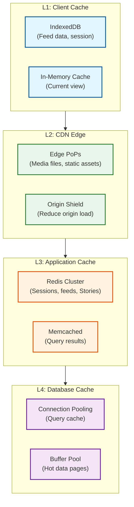

# Scalability & Reliability

[← Back to Deep Dive & Bottlenecks](./04-deep-dive-and-bottlenecks.md) | [Next: Security & Compliance →](./06-security-and-compliance.md)

---

## Scalability Strategy

### Horizontal vs Vertical Scaling

| Component | Strategy | Rationale |
|-----------|----------|-----------|
| API Servers | Horizontal | Stateless, easy to add nodes |
| Media Processing | Horizontal | CPU-bound, parallelizable |
| PostgreSQL | Horizontal (sharding) | Metadata scale requires distribution |
| Cassandra | Horizontal | Built for horizontal scaling |
| Redis | Horizontal (cluster) | Cache capacity needs |
| CDN | Horizontal | Geographic distribution |
| ML Inference | Horizontal + Vertical | GPU scaling for models |

### Database Scaling

#### PostgreSQL Sharding Strategy

```
┌─────────────────────────────────────────────────────────────────────────┐
│                    POSTGRESQL SHARDING                                  │
├─────────────────────────────────────────────────────────────────────────┤
│                                                                         │
│  Shard Key: user_id (hash-based)                                       │
│  Number of Shards: 10,000+ (similar to Facebook's scale)               │
│                                                                         │
│  Shard Distribution:                                                    │
│  ┌────────────┐ ┌────────────┐ ┌────────────┐ ┌────────────┐           │
│  │  Shard 0   │ │  Shard 1   │ │  Shard 2   │ │   ...N     │           │
│  │ user_id%N=0│ │ user_id%N=1│ │ user_id%N=2│ │            │           │
│  ├────────────┤ ├────────────┤ ├────────────┤ ├────────────┤           │
│  │ Users      │ │ Users      │ │ Users      │ │            │           │
│  │ Posts      │ │ Posts      │ │ Posts      │ │            │           │
│  │ Media meta │ │ Media meta │ │ Media meta │ │            │           │
│  │ Follows*   │ │ Follows*   │ │ Follows*   │ │            │           │
│  └────────────┘ └────────────┘ └────────────┘ └────────────┘           │
│                                                                         │
│  * Follows sharded by follower_id (outgoing relationships)             │
│                                                                         │
│  Co-location Benefits:                                                  │
│  • User profile + their posts = single shard query                     │
│  • User's outgoing follows = single shard query                        │
│  • Cross-shard queries minimized                                        │
│                                                                         │
└─────────────────────────────────────────────────────────────────────────┘
```

#### Cassandra Scaling

```
CASSANDRA CLUSTER CONFIGURATION:

Replication Factor: 3 (per data center)
Consistency Level:
  • Writes: LOCAL_QUORUM (2 of 3)
  • Reads: LOCAL_ONE (fast) or LOCAL_QUORUM (consistent)

Data Centers:
  • US-East: Primary region
  • US-West: Secondary region
  • EU: GDPR compliance region
  • APAC: Low latency for Asia

Node Count (per DC): ~1000 nodes
Total Capacity: Petabytes of timeline data

Partition Strategy:
  • user_timeline: Partitioned by user_id
  • active_stories: Partitioned by user_id
  • post_likes: Partitioned by post_id
```

### Auto-Scaling Configuration

```
AUTO-SCALING RULES:

API Servers:
  trigger:
    metric: cpu_utilization
    threshold: 70%
    duration: 2 minutes
  action:
    scale_out: +20% capacity
    cooldown: 5 minutes

Media Processing Workers:
  trigger:
    metric: queue_depth
    threshold: 10,000 jobs
    duration: 1 minute
  action:
    scale_out: +50% capacity
    max_capacity: 10,000 workers
    cooldown: 3 minutes

ML Inference Servers:
  trigger:
    metric: inference_latency_p99
    threshold: 50ms
    duration: 1 minute
  action:
    scale_out: +10 GPU nodes
    max_capacity: 1,000 GPU nodes
    cooldown: 10 minutes

CDN Origin:
  trigger:
    metric: origin_request_rate
    threshold: 100,000 req/s per origin
  action:
    activate_additional_origin_shield
    cooldown: 15 minutes
```

### Caching Layers



| Layer | Technology | Hit Rate | TTL | Size |
|-------|------------|----------|-----|------|
| L1 (Client) | IndexedDB | 90% | Session | ~50MB/user |
| L2 (CDN) | Edge PoPs | 85% | Hours-days | ~50 PB (distributed) |
| L3 (Application) | Redis | 95% | Minutes | ~100 TB |
| L4 (Database) | Buffer Pool | 99% | LRU | ~1 TB/shard |

### Hot Spot Mitigation

| Hot Spot | Cause | Mitigation |
|----------|-------|------------|
| Celebrity posts | Millions requesting same content | CDN caching, pull-based fan-out |
| Viral content | Sudden spike in engagement | Rate limiting, queue throttling |
| Single user shard | Power user with extreme activity | Virtual sharding, activity limits |
| New feature launch | All users hit new endpoint | Feature flags, gradual rollout |
| Time-based patterns | Midnight/noon spikes | Predictive scaling, prewarming |

---

## Reliability & Fault Tolerance

### Single Points of Failure (SPOF) Analysis

| Component | SPOF Risk | Mitigation |
|-----------|-----------|------------|
| Database | High | Multi-replica, multi-DC |
| CDN | Medium | Multi-PoP, origin shield |
| API Gateway | High | Active-active, multi-region |
| Redis Cache | Medium | Cluster mode, replicas |
| Blob Storage | Low | Erasure coding, cross-region |
| ML Inference | Medium | Multiple model replicas |
| Event Bus | High | Multi-broker, replication |

### Redundancy Strategy

```
┌─────────────────────────────────────────────────────────────────────────┐
│                      MULTI-REGION DEPLOYMENT                            │
├─────────────────────────────────────────────────────────────────────────┤
│                                                                         │
│  ┌─────────────────────┐    ┌─────────────────────┐                    │
│  │     US-EAST         │◄──►│     US-WEST         │                    │
│  │  (Primary Region)   │    │  (DR Region)        │                    │
│  ├─────────────────────┤    ├─────────────────────┤                    │
│  │ • API Servers       │    │ • API Servers       │                    │
│  │ • PostgreSQL Primary│    │ • PostgreSQL Replica│                    │
│  │ • Cassandra DC      │    │ • Cassandra DC      │                    │
│  │ • Redis Cluster     │    │ • Redis Cluster     │                    │
│  │ • Media Processing  │    │ • Media Processing  │                    │
│  │ • ML Inference      │    │ • ML Inference      │                    │
│  └─────────────────────┘    └─────────────────────┘                    │
│            │                          │                                 │
│            ▼                          ▼                                 │
│  ┌─────────────────────┐    ┌─────────────────────┐                    │
│  │        EU           │    │       APAC          │                    │
│  │  (GDPR Region)      │    │  (Low Latency)      │                    │
│  ├─────────────────────┤    ├─────────────────────┤                    │
│  │ • API Servers       │    │ • API Servers       │                    │
│  │ • PostgreSQL Replica│    │ • PostgreSQL Replica│                    │
│  │ • Cassandra DC      │    │ • Cassandra DC      │                    │
│  │ • Redis Cluster     │    │ • Redis Cluster     │                    │
│  │ • EU Data Residency │    │ • Edge Processing   │                    │
│  └─────────────────────┘    └─────────────────────┘                    │
│                                                                         │
│  Replication:                                                           │
│  • PostgreSQL: Streaming replication (async to other regions)          │
│  • Cassandra: Multi-DC replication (RF=3 per DC)                       │
│  • Redis: Cross-region replication (async)                             │
│  • Blob Storage: Cross-region replication (async)                      │
│                                                                         │
└─────────────────────────────────────────────────────────────────────────┘
```

### Failover Mechanisms

```
PSEUDOCODE: DatabaseFailover

// Primary database health check
function monitorPrimaryDatabase():
    while true:
        health = checkHealth(primary_db)

        if health.status == UNHEALTHY:
            consecutiveFailures++

            if consecutiveFailures >= 3:
                initiateFailover()
        else:
            consecutiveFailures = 0

        sleep(5 seconds)


function initiateFailover():
    // 1. Verify primary is truly down
    if confirmPrimaryDown():
        log.critical("Primary database confirmed down, initiating failover")

        // 2. Promote replica to primary
        new_primary = promoteReplica(best_replica)

        // 3. Update connection configuration
        updateConnectionString(new_primary)

        // 4. Notify dependent services
        broadcast(SERVICE_CONFIG_CHANGED, {
            database: new_primary.address
        })

        // 5. Alert operations team
        pagerduty.alert("Database failover completed", {
            old_primary: primary_db,
            new_primary: new_primary,
            data_loss_estimate: calculateLag()
        })


function calculateLag():
    // Async replication may have some lag
    last_primary_txn = getLastTransaction(old_primary)
    last_replica_txn = getLastTransaction(new_primary)
    return last_primary_txn - last_replica_txn
```

### Circuit Breaker Pattern

```
┌─────────────────────────────────────────────────────────────────────────┐
│                      CIRCUIT BREAKER STATES                             │
├─────────────────────────────────────────────────────────────────────────┤
│                                                                         │
│  ┌─────────┐    failures > threshold    ┌─────────┐                    │
│  │ CLOSED  │ ─────────────────────────► │  OPEN   │                    │
│  │(Normal) │                            │(Failing)│                    │
│  └────┬────┘                            └────┬────┘                    │
│       │                                      │                          │
│       │ success                              │ timeout                  │
│       │                                      ▼                          │
│       │                              ┌─────────────┐                   │
│       │                              │ HALF-OPEN   │                   │
│       │                              │ (Testing)   │                   │
│       │                              └──────┬──────┘                   │
│       │                                     │                          │
│       │         success                     │ failure                  │
│       └─────────────────────────────────────┴──────────────────────────│
│                                                                         │
│  Configuration:                                                         │
│  • Failure threshold: 50% in 10 seconds                                │
│  • Open timeout: 30 seconds                                            │
│  • Half-open probes: 3 requests                                        │
│                                                                         │
└─────────────────────────────────────────────────────────────────────────┘
```

**Circuit Breaker Implementation:**

```
PSEUDOCODE: CircuitBreaker

class CircuitBreaker:
    state = CLOSED
    failure_count = 0
    success_count = 0
    last_failure_time = null

    config:
        failure_threshold = 5
        success_threshold = 3
        open_timeout = 30 seconds

    function call(service, request):
        if state == OPEN:
            if now() - last_failure_time > open_timeout:
                state = HALF_OPEN
            else:
                return fallback(request)

        try:
            response = service.call(request)

            if state == HALF_OPEN:
                success_count++
                if success_count >= config.success_threshold:
                    state = CLOSED
                    reset_counts()

            return response

        catch error:
            failure_count++
            last_failure_time = now()

            if failure_count >= config.failure_threshold:
                state = OPEN
                alert("Circuit opened for " + service.name)

            if state == HALF_OPEN:
                state = OPEN

            return fallback(request)


    function fallback(request):
        // Return cached data, default response, or error
        cached = cache.get(request.cache_key)
        if cached:
            return cached
        else:
            return ErrorResponse("Service temporarily unavailable")
```

### Retry Strategies

| Service | Strategy | Max Retries | Backoff |
|---------|----------|-------------|---------|
| Upload Processing | Exponential | 3 | 1s, 5s, 30s |
| Feed Loading | Immediate + Fallback | 1 | None (fallback to cache) |
| External APIs | Exponential with jitter | 5 | 100ms-10s |
| Database Writes | Linear | 3 | 100ms |
| CDN Origin Fetch | Immediate | 2 | None |

### Graceful Degradation

```
┌─────────────────────────────────────────────────────────────────────────┐
│                    DEGRADATION HIERARCHY                                │
├─────────────────────────────────────────────────────────────────────────┤
│                                                                         │
│  LEVEL 0: NORMAL OPERATION                                             │
│  ┌─────────────────────────────────────────────────────────────────┐   │
│  │ All features available, real-time ranking, full ML inference    │   │
│  └─────────────────────────────────────────────────────────────────┘   │
│                              ↓ (ML service degraded)                    │
│  LEVEL 1: REDUCED ML                                                   │
│  ┌─────────────────────────────────────────────────────────────────┐   │
│  │ • Feed: Cached rankings + simple recency sort                   │   │
│  │ • Explore: Trending content only                                │   │
│  │ • Stories: No tray ranking, chronological order                 │   │
│  └─────────────────────────────────────────────────────────────────┘   │
│                              ↓ (Database degraded)                      │
│  LEVEL 2: CACHE-ONLY                                                   │
│  ┌─────────────────────────────────────────────────────────────────┐   │
│  │ • Serve cached content only                                     │   │
│  │ • No new posts/Stories visible                                  │   │
│  │ • Interactions queued for later                                 │   │
│  │ • Read-only mode                                                │   │
│  └─────────────────────────────────────────────────────────────────┘   │
│                              ↓ (CDN degraded)                           │
│  LEVEL 3: TEXT-ONLY                                                    │
│  ┌─────────────────────────────────────────────────────────────────┐   │
│  │ • No media loading                                              │   │
│  │ • Captions and comments only                                    │   │
│  │ • Profile text visible                                          │   │
│  └─────────────────────────────────────────────────────────────────┘   │
│                              ↓ (Complete outage)                        │
│  LEVEL 4: MAINTENANCE MODE                                             │
│  ┌─────────────────────────────────────────────────────────────────┐   │
│  │ • Static maintenance page                                       │   │
│  │ • Status page link                                              │   │
│  │ • Estimated recovery time                                       │   │
│  └─────────────────────────────────────────────────────────────────┘   │
│                                                                         │
└─────────────────────────────────────────────────────────────────────────┘
```

### Bulkhead Pattern

```
┌─────────────────────────────────────────────────────────────────────────┐
│                      SERVICE ISOLATION                                  │
├─────────────────────────────────────────────────────────────────────────┤
│                                                                         │
│  ┌─────────────────┐ ┌─────────────────┐ ┌─────────────────┐           │
│  │  Feed Service   │ │ Stories Service │ │ Explore Service │           │
│  │  ┌───────────┐  │ │  ┌───────────┐  │ │  ┌───────────┐  │           │
│  │  │Thread Pool│  │ │  │Thread Pool│  │ │  │Thread Pool│  │           │
│  │  │  100      │  │ │  │  50       │  │ │  │  75       │  │           │
│  │  └───────────┘  │ │  └───────────┘  │ │  └───────────┘  │           │
│  │  ┌───────────┐  │ │  ┌───────────┐  │ │  ┌───────────┐  │           │
│  │  │DB Conn    │  │ │  │DB Conn    │  │ │  │DB Conn    │  │           │
│  │  │Pool: 50   │  │ │  │Pool: 25   │  │ │  │Pool: 40   │  │           │
│  │  └───────────┘  │ │  └───────────┘  │ │  └───────────┘  │           │
│  │  ┌───────────┐  │ │  ┌───────────┐  │ │  ┌───────────┐  │           │
│  │  │Redis Conn │  │ │  │Redis Conn │  │ │  │Redis Conn │  │           │
│  │  │Pool: 100  │  │ │  │Pool: 50   │  │ │  │Pool: 75   │  │           │
│  │  └───────────┘  │ │  └───────────┘  │ │  └───────────┘  │           │
│  └─────────────────┘ └─────────────────┘ └─────────────────┘           │
│                                                                         │
│  Benefits:                                                              │
│  • Stories outage doesn't affect Feed                                  │
│  • Explore can degrade independently                                   │
│  • Resource exhaustion is contained                                    │
│                                                                         │
└─────────────────────────────────────────────────────────────────────────┘
```

---

## Disaster Recovery

### Recovery Objectives

| Metric | Target | Justification |
|--------|--------|---------------|
| **RTO** (Recovery Time Objective) | 15 minutes | Maximum acceptable downtime |
| **RPO** (Recovery Point Objective) | 1 minute | Maximum acceptable data loss |

### Backup Strategy

| Data | Backup Frequency | Retention | Storage |
|------|------------------|-----------|---------|
| PostgreSQL | Continuous (WAL) | 30 days | Cross-region blob storage |
| Cassandra | Daily snapshots | 7 days | Cross-region blob storage |
| Redis | Hourly RDB + AOF | 24 hours | Local + replicated |
| Blob Storage | Continuous replication | Indefinite | Multi-region |
| Configuration | On change | 90 days | Version control |

### Multi-Region Considerations

```
REGION FAILOVER PROCEDURE:

1. DETECTION (0-2 minutes)
   • Health checks fail for primary region
   • Automated monitoring triggers alert
   • Confirm not a false positive (multiple checks)

2. DECISION (2-5 minutes)
   • On-call engineer evaluates severity
   • Automated failover for clear failures
   • Manual decision for ambiguous cases

3. FAILOVER EXECUTION (5-10 minutes)
   • DNS update to route traffic to DR region
   • Promote read replicas to primary
   • Verify data consistency
   • Enable write traffic to DR region

4. VERIFICATION (10-15 minutes)
   • Synthetic transaction testing
   • Error rate monitoring
   • User-facing health checks
   • Gradual traffic increase (10% → 50% → 100%)

5. COMMUNICATION
   • Status page update
   • Internal notification
   • User notification (if extended)

6. POST-INCIDENT
   • Root cause analysis
   • Prepare for failback
   • Update runbooks
```

### Data Consistency During Failover

```
CONSISTENCY CONSIDERATIONS:

Asynchronous Replication Lag:
• PostgreSQL: ~100ms typical, up to 1 minute under load
• Cassandra: ~50ms (LOCAL_QUORUM ensures 2/3 replicas)
• Redis: ~10ms

Conflict Resolution:
• Last-write-wins for most data
• User-visible data prioritizes availability over consistency
• Financial/auth data uses synchronous writes

Potential Data Loss Scenarios:
• Uploads in-flight during failure: Re-queue from client
• Likes/comments not replicated: Lost (acceptable)
• DMs not replicated: Lost (requires sync replication)

Mitigation:
• Client-side retry for critical actions
• Idempotent operations where possible
• Queue-based processing for durability
```

---

## Capacity Planning

### Growth Projections

| Year | DAU | Uploads/Day | Storage (Cumulative) | Peak QPS |
|------|-----|-------------|----------------------|----------|
| 2025 | 500M | 95M | 550 PB | 2.7M |
| 2026 | 550M | 110M | 1.2 EB | 3.2M |
| 2027 | 600M | 130M | 2.0 EB | 3.8M |
| 2028 | 650M | 155M | 3.2 EB | 4.5M |
| 2030 | 700M | 180M | 5.5 EB | 5.0M |

### Infrastructure Scaling Plan

| Component | Current | Year 2 | Year 5 | Scaling Mechanism |
|-----------|---------|--------|--------|-------------------|
| API Servers | 5,000 | 6,500 | 10,000 | Auto-scaling |
| PostgreSQL Shards | 10,000 | 15,000 | 25,000 | Shard splitting |
| Cassandra Nodes | 4,000 | 6,000 | 12,000 | Ring expansion |
| CDN PoPs | 200 | 300 | 500 | Geographic expansion |
| GPU Nodes (ML) | 500 | 800 | 2,000 | Capacity addition |
| Storage (Blob) | 600 PB | 1.5 EB | 6 EB | Cluster expansion |

---

*[← Back to Deep Dive & Bottlenecks](./04-deep-dive-and-bottlenecks.md) | [Next: Security & Compliance →](./06-security-and-compliance.md)*
