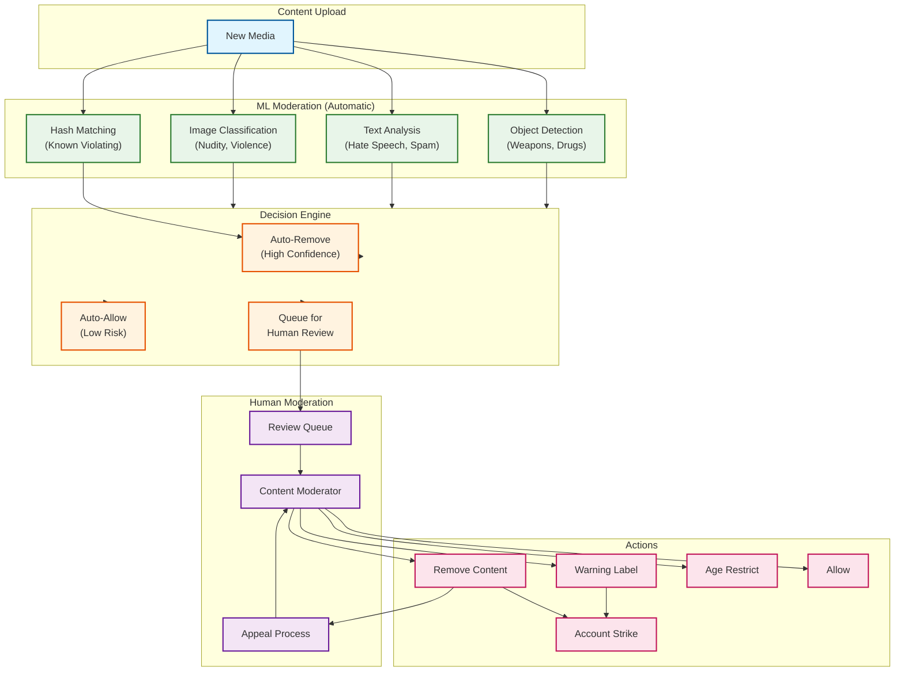

# Security & Compliance

[← Back to Scalability & Reliability](./05-scalability-and-reliability.md) | [Next: Observability →](./07-observability.md)

---

## Authentication & Authorization

### Authentication Mechanism

```
┌─────────────────────────────────────────────────────────────────────────┐
│                    AUTHENTICATION FLOW                                  │
├─────────────────────────────────────────────────────────────────────────┤
│                                                                         │
│  PRIMARY: OAuth 2.0 / OpenID Connect                                   │
│  ┌───────────────────────────────────────────────────────────────────┐ │
│  │                                                                   │ │
│  │  Client ──► Login Page ──► Auth Server ──► Token Issued          │ │
│  │                               │                                   │ │
│  │                               ▼                                   │ │
│  │                    ┌─────────────────────┐                       │ │
│  │                    │ Token Response      │                       │ │
│  │                    │ • access_token      │                       │ │
│  │                    │ • refresh_token     │                       │ │
│  │                    │ • id_token (OIDC)   │                       │ │
│  │                    │ • expires_in        │                       │ │
│  │                    └─────────────────────┘                       │ │
│  │                                                                   │ │
│  └───────────────────────────────────────────────────────────────────┘ │
│                                                                         │
│  TOKEN SPECIFICATIONS:                                                 │
│  ┌───────────────────────────────────────────────────────────────────┐ │
│  │ Access Token:                                                     │ │
│  │   • Type: JWT (signed, not encrypted)                            │ │
│  │   • Lifetime: 1 hour                                             │ │
│  │   • Claims: user_id, scope, device_id, issued_at                 │ │
│  │                                                                   │ │
│  │ Refresh Token:                                                    │ │
│  │   • Type: Opaque (stored server-side)                            │ │
│  │   • Lifetime: 90 days (sliding window)                           │ │
│  │   • Rotation: New refresh token on each use                      │ │
│  │                                                                   │ │
│  │ Session Token:                                                    │ │
│  │   • Tied to device fingerprint                                   │ │
│  │   • Invalidated on password change                               │ │
│  │   • Can be remotely revoked                                      │ │
│  └───────────────────────────────────────────────────────────────────┘ │
│                                                                         │
└─────────────────────────────────────────────────────────────────────────┘
```

### Multi-Factor Authentication (MFA)

| Method | Implementation | Use Case |
|--------|----------------|----------|
| SMS OTP | 6-digit code, 5-minute expiry | Legacy (being deprecated) |
| Authenticator App | TOTP (30-second codes) | Recommended |
| Push Notification | In-app approval prompt | Default for logged-in devices |
| Security Keys | FIDO2/WebAuthn | High-security accounts |
| Backup Codes | 8 one-time codes | Account recovery |

### Authorization Model

```
┌─────────────────────────────────────────────────────────────────────────┐
│                    AUTHORIZATION LAYERS                                 │
├─────────────────────────────────────────────────────────────────────────┤
│                                                                         │
│  LAYER 1: ROLE-BASED ACCESS CONTROL (RBAC)                            │
│  ┌───────────────────────────────────────────────────────────────────┐ │
│  │ Roles:                                                            │ │
│  │ • User (standard account)                                         │ │
│  │ • Creator (monetization features)                                 │ │
│  │ • Business (analytics, ads)                                       │ │
│  │ • Moderator (content review)                                      │ │
│  │ • Admin (platform management)                                     │ │
│  └───────────────────────────────────────────────────────────────────┘ │
│                                                                         │
│  LAYER 2: RELATIONSHIP-BASED ACCESS CONTROL (ReBAC)                   │
│  ┌───────────────────────────────────────────────────────────────────┐ │
│  │ Access determined by social graph relationships:                  │ │
│  │ • Following: Can see public content                               │ │
│  │ • Follower: Can see if account is private                        │ │
│  │ • Close Friends: Can see Close Friends Stories                   │ │
│  │ • Blocked: No access to content or profile                       │ │
│  │ • Restricted: Limited interaction visibility                     │ │
│  └───────────────────────────────────────────────────────────────────┘ │
│                                                                         │
│  LAYER 3: ATTRIBUTE-BASED ACCESS CONTROL (ABAC)                       │
│  ┌───────────────────────────────────────────────────────────────────┐ │
│  │ Dynamic policies based on context:                                │ │
│  │ • Age-restricted content (18+)                                    │ │
│  │ • Geographic restrictions (content licensing)                     │ │
│  │ • Account state (suspended, limited, full)                        │ │
│  │ • Device trust level (new vs established)                        │ │
│  └───────────────────────────────────────────────────────────────────┘ │
│                                                                         │
└─────────────────────────────────────────────────────────────────────────┘
```

### Privacy Controls

| Setting | Options | Default |
|---------|---------|---------|
| Account Privacy | Public / Private | Public |
| Story Visibility | Everyone / Followers / Close Friends | Followers |
| Comment Filtering | Off / Limited / Most | Off |
| Activity Status | Visible / Hidden | Visible |
| Mentions | Everyone / Followers / None | Everyone |
| DM Access | Everyone / Followers / None | Followers |
| Post Sharing | Enable / Disable | Enable |

---

## Data Security

### Encryption Strategy

```
┌─────────────────────────────────────────────────────────────────────────┐
│                    ENCRYPTION ARCHITECTURE                              │
├─────────────────────────────────────────────────────────────────────────┤
│                                                                         │
│  ENCRYPTION AT REST                                                    │
│  ┌───────────────────────────────────────────────────────────────────┐ │
│  │ Database:                                                         │ │
│  │   • PostgreSQL: Transparent Data Encryption (TDE)                │ │
│  │   • Cassandra: Volume-level encryption                           │ │
│  │   • Algorithm: AES-256-GCM                                        │ │
│  │                                                                   │ │
│  │ Blob Storage:                                                     │ │
│  │   • Server-side encryption by default                            │ │
│  │   • Algorithm: AES-256                                           │ │
│  │   • Key management: HSM-backed                                    │ │
│  │                                                                   │ │
│  │ Cache:                                                            │ │
│  │   • Redis: TLS for encryption in transit (not at rest)           │ │
│  │   • Sensitive data: Application-level encryption                 │ │
│  └───────────────────────────────────────────────────────────────────┘ │
│                                                                         │
│  ENCRYPTION IN TRANSIT                                                 │
│  ┌───────────────────────────────────────────────────────────────────┐ │
│  │ External (Client ↔ Server):                                       │ │
│  │   • TLS 1.3 required (1.2 deprecated)                            │ │
│  │   • Certificate pinning on mobile apps                           │ │
│  │   • HSTS with long max-age                                       │ │
│  │                                                                   │ │
│  │ Internal (Service ↔ Service):                                     │ │
│  │   • mTLS (mutual TLS) between services                           │ │
│  │   • Service mesh handles certificate rotation                    │ │
│  │                                                                   │ │
│  │ Database Connections:                                             │ │
│  │   • TLS required for all connections                              │ │
│  │   • Certificate authentication for services                      │ │
│  └───────────────────────────────────────────────────────────────────┘ │
│                                                                         │
└─────────────────────────────────────────────────────────────────────────┘
```

### PII Handling

| Data Type | Classification | Handling |
|-----------|----------------|----------|
| Email | PII | Encrypted at rest, hashed for lookup |
| Phone Number | PII | Encrypted, E.164 normalized |
| Full Name | PII | Stored as-is, user-controlled visibility |
| Location (precise) | Sensitive PII | Not stored (stripped from EXIF) |
| Location (tagged) | PII | User-controlled, approximate only |
| Biometrics (face detection) | Sensitive PII | Processed on-device, not stored |
| Password | Credential | Argon2id hashed, never stored plaintext |
| Payment Info | PCI | Not stored locally (payment processor) |

### EXIF Metadata Stripping

```
PRIVACY PROCESSING PIPELINE:

function processMediaForPrivacy(file):
    // 1. Read EXIF metadata
    exif = readExifData(file)

    // 2. Strip sensitive metadata
    sensitiveFields = [
        "GPSLatitude", "GPSLongitude", "GPSAltitude",
        "GPSDateStamp", "GPSTimeStamp",
        "CameraSerialNumber", "LensSerialNumber",
        "OwnerName", "Artist", "Copyright",
        "UserComment", "ImageDescription"
    ]

    for field in sensitiveFields:
        exif.remove(field)

    // 3. Preserve non-sensitive metadata (for display)
    preservedFields = [
        "DateTimeOriginal",  // For "taken on" display
        "Orientation",       // For correct rotation
        "ImageWidth", "ImageHeight"
    ]

    // 4. Write sanitized file
    sanitizedFile = writeWithExif(file, preservedFields)

    // 5. Log for audit (without PII values)
    auditLog.write({
        media_id: file.id,
        stripped_fields: sensitiveFields.length,
        preserved_fields: preservedFields.length,
        timestamp: now()
    })

    return sanitizedFile
```

### Data Masking/Anonymization

```
ANONYMIZATION FOR ANALYTICS:

function anonymizeUserData(user):
    return {
        // Pseudonymized (reversible internally)
        user_id_hash: sha256(user.id + salt),

        // Generalized
        age_bucket: bucketize(user.age, [13-17, 18-24, 25-34, 35-44, 45+]),
        location_region: generalizeLocation(user.location, "region"),

        // Suppressed
        email: "[REDACTED]",
        phone: "[REDACTED]",

        // Preserved (non-identifying)
        account_type: user.account_type,
        created_year: user.created_at.year,
        follower_bucket: bucketize(user.followers, [0-100, 100-1K, 1K-10K, 10K+])
    }


function exportUserData(user_id):  // GDPR data export
    user = getUser(user_id)

    return {
        profile: {
            username: user.username,
            email: user.email,
            phone: user.phone,
            bio: user.bio,
            created_at: user.created_at
        },
        content: {
            posts: getAllPosts(user_id),
            stories_archive: getArchivedStories(user_id),
            comments: getAllComments(user_id),
            likes: getAllLikes(user_id),
            saved: getAllSaved(user_id)
        },
        social: {
            followers: getFollowers(user_id),
            following: getFollowing(user_id),
            blocked: getBlocked(user_id)
        },
        activity: {
            login_history: getLoginHistory(user_id),
            device_history: getDeviceHistory(user_id),
            search_history: getSearchHistory(user_id)
        },
        ads: {
            interests: getAdInterests(user_id),
            advertisers: getInteractedAdvertisers(user_id)
        }
    }
```

---

## Threat Model

### Top Attack Vectors

| Attack | Risk | Mitigation |
|--------|------|------------|
| **Account Takeover** | High | MFA, suspicious login detection, device trust |
| **Credential Stuffing** | High | Rate limiting, CAPTCHA, breach monitoring |
| **Content Injection (XSS)** | Medium | Input sanitization, CSP headers |
| **API Abuse** | High | Rate limiting, OAuth scopes, anomaly detection |
| **Spam/Bot Accounts** | High | ML detection, phone verification, behavior analysis |
| **Phishing** | Medium | Link scanning, warning interstitials |
| **Data Exfiltration** | High | DLP, access logging, anomaly detection |
| **DDoS** | High | CDN absorption, rate limiting, auto-scaling |

### Mitigation Details

#### Account Takeover Prevention

```
SUSPICIOUS LOGIN DETECTION:

function evaluateLogin(request, user):
    riskScore = 0

    // Factor 1: Location anomaly
    if isNewLocation(request.ip, user.login_history):
        riskScore += 30

    // Factor 2: Device anomaly
    if isNewDevice(request.device_fingerprint, user.devices):
        riskScore += 25

    // Factor 3: Time anomaly
    if isUnusualTime(request.timestamp, user.activity_pattern):
        riskScore += 15

    // Factor 4: Velocity (rapid location changes)
    if impossibleTravel(request.location, user.last_login):
        riskScore += 40

    // Factor 5: Known bad signals
    if isTorExit(request.ip) or isVPN(request.ip):
        riskScore += 20

    // Factor 6: Behavioral anomaly
    if loginPatternMismatch(request, user.behavior_model):
        riskScore += 25

    // Decision
    if riskScore >= 70:
        return BLOCK_AND_VERIFY  // Require MFA or identity proof
    elif riskScore >= 40:
        return REQUIRE_MFA
    else:
        return ALLOW
```

#### Rate Limiting & DDoS Protection

```
RATE LIMITING CONFIGURATION:

API Endpoints:
  /api/v1/feed:
    per_user: 1000/hour
    per_ip: 10000/hour
    burst: 50/second

  /api/v1/media (upload):
    per_user: 100/hour
    per_ip: 500/hour
    burst: 5/second

  /api/v1/likes:
    per_user: 1000/hour
    per_ip: 5000/hour
    burst: 20/second

  /api/v1/follows:
    per_user: 200/hour
    per_ip: 1000/hour
    burst: 10/second

  /api/v1/search:
    per_user: 500/hour
    per_ip: 2000/hour
    burst: 30/second

DDoS Protection Layers:
  1. CDN edge filtering (absorb volumetric attacks)
  2. Geographic rate limiting (per-region quotas)
  3. Behavioral analysis (bot detection)
  4. Challenge-response (CAPTCHA for suspicious traffic)
  5. IP reputation scoring (known bad actors)
```

---

## Content Moderation

### Moderation Pipeline



### Moderation Categories

| Category | Detection Method | Action |
|----------|------------------|--------|
| CSAM | Hash matching (PhotoDNA) | Immediate removal + report to NCMEC |
| Terrorism | ML + hash matching | Auto-remove |
| Nudity (adult) | Image classification | Age gate or remove |
| Violence (graphic) | Image classification | Warning label or remove |
| Hate Speech | NLP models | Remove or reduce distribution |
| Harassment | NLP + context | Remove, limit reach |
| Spam | Behavioral analysis | Shadowban, remove |
| Misinformation | Fact-check partnerships | Label, reduce distribution |
| IP Violation | Hash matching + reports | Remove on DMCA |

---

## Compliance

### GDPR Compliance

| Requirement | Implementation |
|-------------|----------------|
| Right to Access | Data export tool (JSON download) |
| Right to Erasure | Account deletion (30-day grace period) |
| Right to Rectification | Profile edit capabilities |
| Right to Portability | Standard format export |
| Data Minimization | Only collect necessary data |
| Purpose Limitation | Clear privacy policy |
| Consent | Granular opt-in controls |
| Breach Notification | 72-hour notification process |

### Data Deletion Process

```
USER DATA DELETION FLOW:

Day 0: User requests account deletion
  • Immediate: Account deactivated, not visible
  • Data: Retained but marked for deletion

Day 1-30: Grace period
  • User can cancel and restore account
  • Data still available for restoration

Day 30: Permanent deletion begins
  • Profile data: Deleted from primary storage
  • Posts/Stories: Deleted
  • Media files: Queued for deletion
  • Comments on others' posts: Pseudonymized
  • DM history: Deleted (for this user only)
  • Analytics: Anonymized (not deleted)

Day 60: Backup purge
  • Backups containing user data: Purged
  • Audit logs: Retained (anonymized)

Day 90: Verification
  • Confirm deletion across all systems
  • Update deletion log
```

### Regional Compliance

| Region | Regulation | Key Requirements |
|--------|------------|------------------|
| EU | GDPR | Data subject rights, DPO, breach notification |
| California | CCPA/CPRA | Right to know, delete, opt-out of sale |
| Brazil | LGPD | Similar to GDPR, local DPO |
| China | PIPL | Data localization, consent |
| India | DPDP | Consent, data localization (certain data) |
| South Korea | PIPA | Consent, cross-border transfer restrictions |

### Audit Trail

```
AUDIT LOG SCHEMA:

{
    "event_id": "uuid",
    "timestamp": "2025-01-30T10:30:00Z",
    "event_type": "data_access",
    "actor": {
        "user_id": "123456",
        "type": "internal_admin",
        "ip": "10.0.1.100",
        "session_id": "abc123"
    },
    "target": {
        "user_id": "789012",
        "data_type": "profile"
    },
    "action": "view",
    "justification": "support_ticket_12345",
    "result": "success",
    "metadata": {
        "fields_accessed": ["email", "phone"],
        "duration_ms": 150
    }
}

Retention: 7 years (regulatory requirement)
Access: Security team, legal, compliance only
```

---

*[← Back to Scalability & Reliability](./05-scalability-and-reliability.md) | [Next: Observability →](./07-observability.md)*
