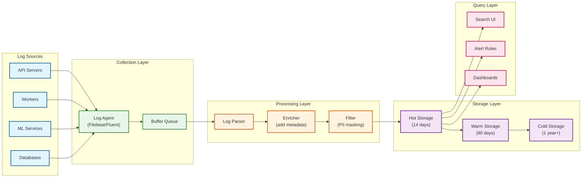

# Observability

[← Back to Security & Compliance](./06-security-and-compliance.md) | [Next: Interview Guide →](./08-interview-guide.md)

---

## Metrics (USE/RED Framework)

### USE Metrics (Utilization, Saturation, Errors)

| Resource | Utilization | Saturation | Errors |
|----------|-------------|------------|--------|
| **API Servers** | CPU %, Memory % | Request queue depth | HTTP 5xx rate |
| **Database** | Connection pool %, Query time | Lock wait time | Query errors |
| **Redis Cache** | Memory %, CPU % | Eviction rate | Connection errors |
| **CDN** | Bandwidth %, Cache capacity | Origin request rate | Cache errors |
| **Media Processing** | Worker utilization | Queue depth | Processing failures |
| **ML Inference** | GPU utilization | Inference queue | Model errors |

### RED Metrics (Rate, Errors, Duration)

| Service | Rate (req/s) | Error Rate (%) | Duration (p99) |
|---------|--------------|----------------|----------------|
| **Feed Service** | 200,000 | <0.01% | <200ms |
| **Media Upload** | 3,300 | <0.1% | <1s (ack) |
| **Stories Service** | 500,000 | <0.01% | <150ms |
| **Explore Service** | 100,000 | <0.05% | <350ms |
| **Search Service** | 30,000 | <0.1% | <300ms |
| **Notification Service** | 500,000 | <0.5% | <500ms |

### Key Business Metrics

```
┌─────────────────────────────────────────────────────────────────────────┐
│                      KEY METRICS DASHBOARD                              │
├─────────────────────────────────────────────────────────────────────────┤
│                                                                         │
│  USER ENGAGEMENT                                                        │
│  ┌───────────────────────────────────────────────────────────────────┐ │
│  │ • DAU / MAU ratio                                                │ │
│  │ • Session duration (average, p50, p95)                           │ │
│  │ • Sessions per user per day                                      │ │
│  │ • Posts/Stories created per user                                 │ │
│  │ • Engagement rate (likes + comments / impressions)               │ │
│  │ • Time to first content (feed load latency)                      │ │
│  └───────────────────────────────────────────────────────────────────┘ │
│                                                                         │
│  CONTENT HEALTH                                                        │
│  ┌───────────────────────────────────────────────────────────────────┐ │
│  │ • Upload success rate                                             │ │
│  │ • Media processing completion rate                               │ │
│  │ • Content moderation precision/recall                            │ │
│  │ • Stories view completion rate                                    │ │
│  │ • Explore engagement rate                                         │ │
│  │ • Reels watch time distribution                                   │ │
│  └───────────────────────────────────────────────────────────────────┘ │
│                                                                         │
│  PLATFORM HEALTH                                                       │
│  ┌───────────────────────────────────────────────────────────────────┐ │
│  │ • API error rate (by endpoint)                                    │ │
│  │ • Cache hit ratio (CDN, Redis)                                    │ │
│  │ • Database query latency (p50, p99)                               │ │
│  │ • ML model inference latency                                      │ │
│  │ • Background job queue depth                                      │ │
│  │ • Replication lag (cross-region)                                  │ │
│  └───────────────────────────────────────────────────────────────────┘ │
│                                                                         │
└─────────────────────────────────────────────────────────────────────────┘
```

### Dashboard Design

```
┌─────────────────────────────────────────────────────────────────────────┐
│                     INSTAGRAM OPS DASHBOARD                             │
├─────────────────────────────────────────────────────────────────────────┤
│                                                                         │
│  ┌─────────────────────────────────────────────────────────────────┐   │
│  │ GOLDEN SIGNALS (Real-time)                          [Last 1h]   │   │
│  ├─────────────────────────────────────────────────────────────────┤   │
│  │                                                                 │   │
│  │  Latency (p99)        Error Rate         Traffic (QPS)         │   │
│  │  ┌──────────┐         ┌──────────┐       ┌──────────┐          │   │
│  │  │  156ms   │         │  0.008%  │       │  2.1M    │          │   │
│  │  │   ▼      │         │    ▼     │       │    ▲     │          │   │
│  │  │ (good)   │         │  (good)  │       │ (+5%)    │          │   │
│  │  └──────────┘         └──────────┘       └──────────┘          │   │
│  │                                                                 │   │
│  │  Saturation           Availability        Active Users         │   │
│  │  ┌──────────┐         ┌──────────┐       ┌──────────┐          │   │
│  │  │   68%    │         │ 99.997%  │       │  42.5M   │          │   │
│  │  │   ─      │         │    ▲     │       │  (norm)  │          │   │
│  │  │ (normal) │         │  (good)  │       │          │          │   │
│  │  └──────────┘         └──────────┘       └──────────┘          │   │
│  └─────────────────────────────────────────────────────────────────┘   │
│                                                                         │
│  ┌─────────────────────────────────────────────────────────────────┐   │
│  │ SERVICE HEALTH                                       [Status]   │   │
│  ├─────────────────────────────────────────────────────────────────┤   │
│  │  Feed Service      ████████████████████  OK     (156ms p99)    │   │
│  │  Stories Service   ████████████████████  OK     (89ms p99)     │   │
│  │  Explore Service   ████████████████████  OK     (312ms p99)    │   │
│  │  Media Upload      ████████████████████  OK     (680ms ack)    │   │
│  │  ML Ranking        ███████████████████░  WARN   (48ms p99)     │   │
│  │  CDN               ████████████████████  OK     (99.8% hit)    │   │
│  └─────────────────────────────────────────────────────────────────┘   │
│                                                                         │
│  ┌─────────────────────────────────────────────────────────────────┐   │
│  │ RECENT ALERTS                                         [Last 4h] │   │
│  ├─────────────────────────────────────────────────────────────────┤   │
│  │  🟡 10:15  ML Ranking p99 approaching threshold (48ms/50ms)    │   │
│  │  🟢 09:42  CDN cache ratio recovered (99.8%)                   │   │
│  │  🔴 08:30  Stories upload spike handled (auto-scaled)          │   │
│  └─────────────────────────────────────────────────────────────────┘   │
│                                                                         │
└─────────────────────────────────────────────────────────────────────────┘
```

---

## Logging

### Log Levels Strategy

| Level | Usage | Example | Retention |
|-------|-------|---------|-----------|
| **ERROR** | System failures requiring attention | Database connection failed | 90 days |
| **WARN** | Degraded but functional | Cache miss rate high | 30 days |
| **INFO** | Significant business events | User uploaded post | 14 days |
| **DEBUG** | Development troubleshooting | Request parameters | 3 days (sampled) |
| **TRACE** | Detailed execution flow | Function entry/exit | 1 day (sampled) |

### Structured Logging Format

```json
{
  "timestamp": "2025-01-30T10:30:00.123Z",
  "level": "INFO",
  "service": "feed-service",
  "instance": "feed-service-abc123",
  "trace_id": "4bf92f3577b34da6a3ce929d0e0e4736",
  "span_id": "00f067aa0ba902b7",
  "user_id": "12345678",
  "request_id": "req-xyz-789",
  "event": "feed_loaded",
  "duration_ms": 145,
  "post_count": 25,
  "cache_hit": true,
  "ranking_model": "v2.3.1",
  "context": {
    "client_version": "280.0.0.15.117",
    "platform": "ios",
    "network": "wifi"
  }
}
```

### What to Log

| Event Type | Log Level | Fields |
|------------|-----------|--------|
| API Request/Response | INFO | endpoint, method, status, duration, user_id |
| Authentication Events | INFO | event_type, user_id, device_id, ip, success |
| Content Upload | INFO | media_id, user_id, type, size, processing_time |
| Database Query | DEBUG | query_type, table, duration, rows |
| Cache Operations | DEBUG | operation, key_pattern, hit/miss, duration |
| ML Inference | INFO | model, input_size, duration, predictions |
| Error/Exception | ERROR | error_type, message, stack_trace, context |
| Security Events | WARN/ERROR | event_type, severity, user_id, ip, action |

### Log Aggregation Architecture



---

## Distributed Tracing

### Trace Propagation Strategy

```
TRACE CONTEXT PROPAGATION:

Headers:
  traceparent: 00-4bf92f3577b34da6a3ce929d0e0e4736-00f067aa0ba902b7-01
               │   │                                  │                  │
               │   │                                  │                  └─ flags
               │   │                                  └─ parent span id
               │   └─ trace id
               └─ version

W3C Trace Context format used across all services

Example Flow (Feed Request):
┌─────────────────────────────────────────────────────────────────────────┐
│                                                                         │
│  Client                                                                │
│    │ [no trace yet]                                                    │
│    ▼                                                                    │
│  API Gateway                                                           │
│    │ [creates trace: 4bf92f..., span: gateway-001]                    │
│    ▼                                                                    │
│  Feed Service                                                          │
│    │ [span: feed-001, parent: gateway-001]                            │
│    ├──► Cache Lookup                                                   │
│    │    [span: cache-001, parent: feed-001]                           │
│    ├──► Ranking Service                                                │
│    │    │ [span: rank-001, parent: feed-001]                          │
│    │    └──► Feature Store                                             │
│    │         [span: feature-001, parent: rank-001]                    │
│    └──► Database Query                                                 │
│         [span: db-001, parent: feed-001]                              │
│                                                                         │
│  All spans share trace_id: 4bf92f3577b34da6a3ce929d0e0e4736           │
│                                                                         │
└─────────────────────────────────────────────────────────────────────────┘
```

### Key Spans to Instrument

| Span Name | Service | Purpose | Key Attributes |
|-----------|---------|---------|----------------|
| `http.request` | API Gateway | Incoming request | method, path, status |
| `feed.generate` | Feed Service | Feed generation | user_id, post_count |
| `ranking.score` | Ranking Service | ML scoring | model_version, candidate_count |
| `cache.get/set` | Cache Layer | Cache operations | key, hit/miss, size |
| `db.query` | Database | Query execution | table, operation, duration |
| `media.process` | Media Service | Processing | media_type, size, codec |
| `storage.read/write` | Blob Storage | Storage operations | bucket, key, size |
| `ml.inference` | ML Service | Model inference | model, batch_size |

### Trace Sampling Strategy

| Traffic Type | Sampling Rate | Reason |
|--------------|---------------|--------|
| Error traces | 100% | Full visibility for debugging |
| High-latency traces (>500ms) | 100% | Performance investigation |
| New deployments (1 hour) | 50% | Catch regressions early |
| Normal traffic | 1% | Cost-effective baseline |
| Background jobs | 10% | Less user-facing impact |
| ML inference | 5% | Balance cost vs visibility |

---

## Alerting

### Critical Alerts (Page-Worthy)

| Alert | Condition | Response Time | Escalation |
|-------|-----------|---------------|------------|
| **Service Down** | Health check fails 3+ times | Immediate | On-call → Lead → Director |
| **Error Rate Spike** | >1% errors for 5 minutes | 5 minutes | On-call |
| **Latency Degradation** | p99 >2x baseline for 10 minutes | 10 minutes | On-call |
| **Database Failover** | Primary unavailable | Immediate | On-call → DBA |
| **Storage Capacity** | >90% utilized | 1 hour | On-call → Infra |
| **Security Incident** | Anomaly detection trigger | Immediate | Security team |
| **Data Pipeline Failure** | ML features stale >1 hour | 15 minutes | ML On-call |

### Warning Alerts

| Alert | Condition | Notification |
|-------|-----------|--------------|
| **High CPU** | >80% for 15 minutes | Slack channel |
| **Cache Hit Rate Low** | <90% for 30 minutes | Slack channel |
| **Queue Depth Growing** | >10,000 for 10 minutes | Slack channel |
| **Replication Lag** | >1 minute | Slack + email |
| **Certificate Expiry** | <30 days | Email weekly |
| **Capacity Threshold** | >75% utilized | Email daily |

### Alert Configuration

```yaml
# Example: Feed Service Latency Alert
alert:
  name: feed_latency_high
  description: Feed service p99 latency exceeds threshold

  condition:
    metric: feed_service_latency_p99
    operator: ">"
    threshold: 300ms
    duration: 5m
    aggregation: max

  severity: critical

  labels:
    service: feed-service
    team: feed
    runbook: https://runbooks.internal/feed-latency

  notifications:
    - channel: pagerduty
      routing_key: feed-oncall
    - channel: slack
      webhook: "#feed-alerts"

  annotations:
    summary: "Feed latency is {{ $value }}ms (threshold: 300ms)"
    dashboard: "https://grafana.internal/d/feed-latency"
    runbook: "https://runbooks.internal/feed-latency"

  silencing:
    maintenance_windows:
      - "0 2 * * 0"  # Sunday 2 AM (maintenance window)
```

### Runbook Template

```markdown
# Feed Service High Latency Runbook

## Overview
Feed service p99 latency exceeded 300ms threshold.

## Impact
- Users experience slow feed loading
- Potential engagement drop
- May cascade to other services

## Quick Diagnosis
1. Check current latency: `grafana/feed-latency`
2. Check error rate: `grafana/feed-errors`
3. Check dependencies:
   - Redis: `grafana/redis-health`
   - Ranking service: `grafana/ranking-health`
   - Database: `grafana/db-health`

## Common Causes & Fixes

### 1. Cache Miss Storm
**Symptoms:** Low cache hit rate, high DB queries
**Fix:**
- Check for cache expiration event
- Verify cache cluster health
- Consider cache warmup procedure

### 2. Ranking Service Slow
**Symptoms:** High ranking_duration in traces
**Fix:**
- Check ML model serving latency
- Verify GPU utilization
- Fall back to simpler model if needed

### 3. Database Overload
**Symptoms:** High query latency, connection pool saturation
**Fix:**
- Check slow query log
- Verify no missing indexes
- Consider read replica routing

## Escalation
If not resolved in 15 minutes:
- Page Feed team lead
- Engage database team if DB-related
- Engage ML team if ranking-related

## Post-Incident
- Create incident ticket
- Update runbook if new failure mode
- Schedule postmortem if user-facing impact
```

---

## Anomaly Detection

### ML-Based Detection

```
ANOMALY DETECTION PIPELINE:

Real-time Metrics → Time Series DB → Detection Models → Alert Engine

Models:
1. Statistical: Moving average, standard deviation
2. Prophet: Seasonal decomposition for predictable patterns
3. Isolation Forest: Multi-dimensional anomalies
4. LSTM: Sequence-based pattern detection

Example Configuration:
  metric: feed_request_rate
  baseline: 7-day moving average
  seasonality: hourly, daily, weekly
  sensitivity: medium (2.5 sigma)
  min_anomaly_duration: 5m
```

### Automated Remediation

| Anomaly | Detection | Auto-Remediation |
|---------|-----------|------------------|
| Traffic spike | >3x baseline | Auto-scale API servers |
| Cache miss rate | >20% for 5m | Trigger cache warmup |
| Queue depth | >10,000 | Scale workers |
| Error rate spike | >1% new deployment | Auto-rollback |
| Slow queries | >100ms p99 | Enable query cache |

---

*[← Back to Security & Compliance](./06-security-and-compliance.md) | [Next: Interview Guide →](./08-interview-guide.md)*
