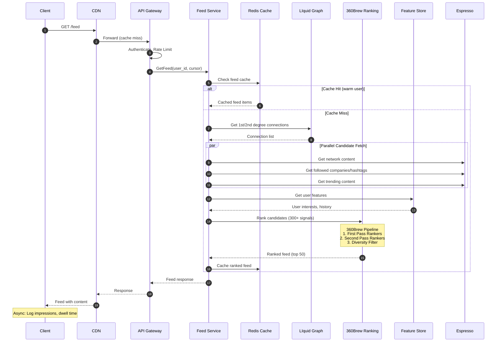
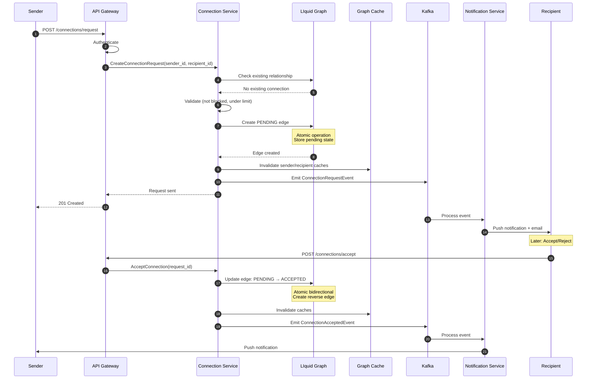
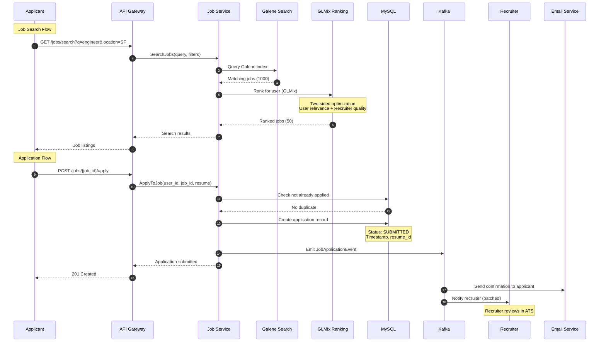
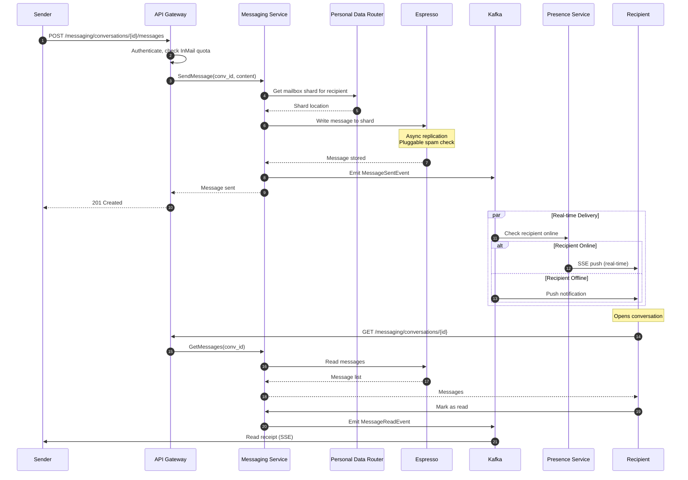
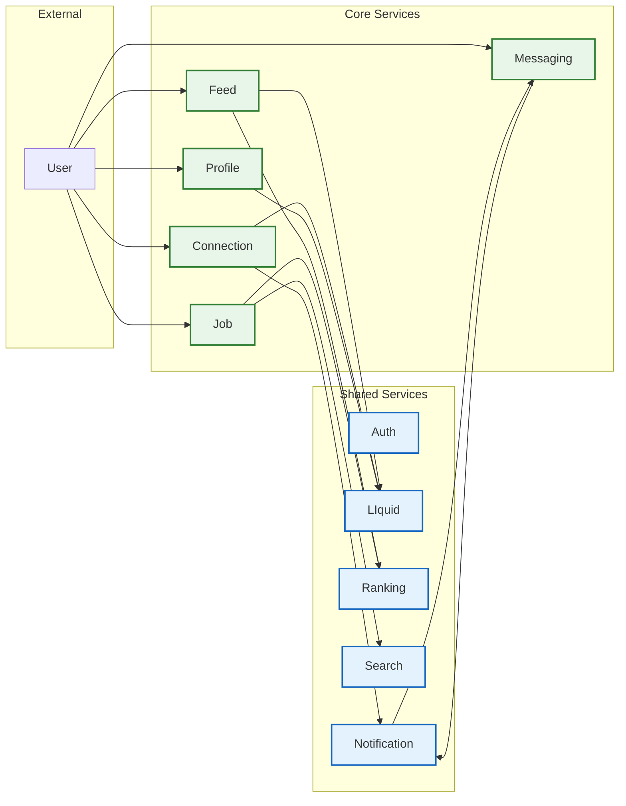
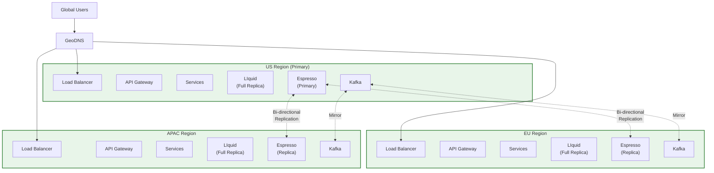

# LinkedIn: High-Level Design

[← Back to Index](./00-index.md)

---

## System Architecture

```mermaid
flowchart TB
    subgraph Clients["Client Layer"]
        direction LR
        WebApp["Web Application<br/>(React)"]
        iOS["iOS App"]
        Android["Android App"]
        Recruiter["Recruiter App"]
        SalesNav["Sales Navigator"]
    end

    subgraph Edge["Edge & CDN"]
        direction LR
        CDN["CDN<br/>(Static, Media)"]
        EdgePOP["Edge PoPs<br/>(Global)"]
    end

    subgraph LoadBalancing["Load Balancing"]
        GLB["Global Load Balancer<br/>(GeoDNS)"]
        RLB["Regional Load Balancers<br/>(L7)"]
    end

    subgraph Gateway["API Gateway"]
        APIGW["API Gateway Cluster"]
        Auth["Auth Service<br/>(OAuth2, SSO)"]
        RateLimit["Rate Limiter"]
    end

    subgraph CoreServices["Core Services"]
        Feed["Feed Service<br/>(360Brew)"]
        Connection["Connection Service"]
        Profile["Profile Service"]
        Job["Job Service"]
        Messaging["Messaging Service<br/>(InMail)"]
        Notification["Notification Service<br/>(Concourse)"]
        Search["Search Service"]
    end

    subgraph DiscoveryServices["Discovery & Recommendations"]
        PYMK["PYMK Service"]
        JobRec["Job Recommendations"]
        ContentRec["Content Recommendations"]
    end

    subgraph MLPlatform["ML Platform"]
        Ranking["Ranking Service<br/>(GLMix)"]
        Embeddings["Embedding Service"]
        FeatureStore["Feature Store"]
        LiGNN["LiGNN<br/>(Graph Neural Net)"]
    end

    subgraph GraphLayer["Graph Layer"]
        LIquid["LIquid Graph DB<br/>(270B edges)"]
        GraphCache["Graph Cache Layer"]
    end

    subgraph DataLayer["Data Layer"]
        subgraph Primary["Primary Stores"]
            Espresso["Espresso<br/>(NoSQL)"]
            MySQL["MySQL Clusters"]
        end
        subgraph Caching["Cache Layer"]
            Redis["Redis Clusters"]
            Memcache["Memcached"]
        end
        subgraph DerivedData["Derived Data"]
            Venice["Venice<br/>(Derived Store)"]
            HDFS["HDFS<br/>(Analytics)"]
        end
    end

    subgraph StreamingLayer["Streaming Platform"]
        Kafka["Kafka<br/>(7T msgs/day)"]
        Samza["Samza<br/>(Stream Processing)"]
        Brooklin["Brooklin<br/>(Change Capture)"]
    end

    subgraph RealTime["Real-Time Infrastructure"]
        Presence["Presence Service<br/>(Play/Akka)"]
        SSE["SSE Gateway"]
        WebSocket["WebSocket Gateway"]
    end

    %% Client connections
    WebApp --> CDN
    iOS --> CDN
    Android --> CDN
    Recruiter --> CDN
    SalesNav --> CDN
    CDN --> EdgePOP
    EdgePOP --> GLB

    %% Load balancing
    GLB --> RLB
    RLB --> APIGW

    %% Gateway
    APIGW --> Auth
    APIGW --> RateLimit
    Auth --> CoreServices
    RateLimit --> CoreServices

    %% Core services to ML
    Feed --> Ranking
    Feed --> FeatureStore
    JobRec --> Ranking
    PYMK --> LiGNN

    %% Core services to Graph
    Connection --> LIquid
    Connection --> GraphCache
    PYMK --> LIquid
    Profile --> GraphCache

    %% Core services to Data
    Profile --> Espresso
    Messaging --> Espresso
    Job --> MySQL
    Feed --> Redis

    %% Discovery services
    Feed --> ContentRec
    Search --> Ranking

    %% Streaming
    CoreServices --> Kafka
    Kafka --> Samza
    Samza --> Notification
    Brooklin --> Kafka

    %% Real-time
    Notification --> SSE
    Messaging --> Presence
    Presence --> WebSocket

    classDef client fill:#e1f5fe,stroke:#01579b,stroke-width:2px
    classDef edge fill:#fff3e0,stroke:#e65100,stroke-width:2px
    classDef gateway fill:#fce4ec,stroke:#880e4f,stroke-width:2px
    classDef service fill:#e8f5e9,stroke:#2e7d32,stroke-width:2px
    classDef ml fill:#f3e5f5,stroke:#6a1b9a,stroke-width:2px
    classDef graph fill:#e8eaf6,stroke:#3f51b5,stroke-width:2px
    classDef data fill:#e0f7fa,stroke:#00695c,stroke-width:2px
    classDef streaming fill:#fffde7,stroke:#f57f17,stroke-width:2px
    classDef realtime fill:#fbe9e7,stroke:#bf360c,stroke-width:2px

    class WebApp,iOS,Android,Recruiter,SalesNav client
    class CDN,EdgePOP edge
    class APIGW,Auth,RateLimit,GLB,RLB gateway
    class Feed,Connection,Profile,Job,Messaging,Notification,Search,PYMK,JobRec,ContentRec service
    class Ranking,Embeddings,FeatureStore,LiGNN ml
    class LIquid,GraphCache graph
    class Espresso,MySQL,Redis,Memcache,Venice,HDFS data
    class Kafka,Samza,Brooklin streaming
    class Presence,SSE,WebSocket realtime
```

---

## Data Flow: Feed Request



---

## Data Flow: Connection Request



---

## Data Flow: Job Application



---

## Data Flow: InMail Message Delivery



---

## Key Architectural Decisions

### Decision 1: LIquid Graph vs Traditional Graph Database

| Aspect | LIquid (Chosen) | Traditional Graph DB |
|--------|-----------------|---------------------|
| **Scale** | 270B edges, 2M QPS | Limited by single-node |
| **Latency** | <50ms avg (in-memory) | 100ms+ (disk-based) |
| **Consistency** | Strong per-partition | Varies |
| **Operational** | LinkedIn-specific expertise | Vendor support |
| **Cost** | High memory (1TB/server) | Lower memory |

**Decision**: LIquid - LinkedIn's workload requires in-memory graph traversal at massive scale. Professional graph queries (connection degrees, PYMK) are latency-sensitive. Custom solution allows optimization for bidirectional edges.

**Trade-off**: High memory cost and operational complexity justified by performance requirements.

---

### Decision 2: Bidirectional Connection Storage

| Approach | Pros | Cons |
|----------|------|------|
| **Single Edge (undirected)** | Less storage, simpler writes | Complex queries, no direction info |
| **Two Edges (both directions)** | Fast lookups from either node, direction metadata | 2x storage, must sync |
| **Single Edge + Index** | Space efficient | Index overhead, query complexity |

**Decision**: Store single edge with bidirectional indexes in LIquid.

```
Edge Storage:
{
  id1: sender_id,        // Lower ID stored first (canonical form)
  id2: recipient_id,
  type: CONNECTION,
  status: ACCEPTED,
  created_at: timestamp,
  metadata: {...}
}

Indexes:
- id1 → edges (outgoing from id1's perspective)
- id2 → edges (outgoing from id2's perspective)
```

**Rationale**: Single edge ensures atomicity. Dual indexes enable fast lookups from either member. Canonical ordering (lower ID first) prevents duplicates.

---

### Decision 3: Feed Ranking Architecture (360Brew)

| Approach | Latency | Freshness | Complexity |
|----------|---------|-----------|------------|
| **Pure Real-time** | High (500ms+) | Excellent | Very High |
| **Pure Pre-computed** | Low (50ms) | Stale | Medium |
| **Hybrid (Chosen)** | Medium (200ms) | Good | High |

**Decision**: Hybrid approach with 360Brew pipeline.

```
Feed Generation Strategy:
1. Pre-compute base feed for active users (hourly)
2. Real-time merge fresh content on request
3. Apply ranking at request time (cached features)

Three-Stage Pipeline:
┌─────────────────┐    ┌─────────────────┐    ┌─────────────────┐
│  First Pass     │ →  │  Second Pass    │ →  │  Diversity      │
│  Rankers (FPR)  │    │  Rankers (SPR)  │    │  Filter         │
├─────────────────┤    ├─────────────────┤    ├─────────────────┤
│ Per-inventory   │    │ Combined        │    │ No consecutive  │
│ type scoring    │    │ personalized    │    │ same source     │
│ (articles,jobs) │    │ ranking         │    │ Type balance    │
└─────────────────┘    └─────────────────┘    └─────────────────┘
```

**Trade-off**: Complexity of hybrid system justified by need for both freshness (new posts) and latency (professional users expect fast loads).

---

### Decision 4: Job Matching Strategy

| Approach | Pros | Cons |
|----------|------|------|
| **Query-time only** | Always fresh | High latency, expensive |
| **Pre-computed only** | Fast, cheap | Stale recommendations |
| **Hybrid (Chosen)** | Balanced | System complexity |

**Decision**: Hybrid with GLMix personalization.

```
Job Matching Architecture:

┌─────────────────────────────────────────────────────────────┐
│                    "Jobs for You" (Pre-computed)             │
├─────────────────────────────────────────────────────────────┤
│  Nightly batch job:                                         │
│  1. For each active job seeker                              │
│  2. Generate top-1000 candidate jobs                        │
│  3. Score with GLMix (entity-level personalization)         │
│  4. Store top-100 in cache                                  │
└─────────────────────────────────────────────────────────────┘

┌─────────────────────────────────────────────────────────────┐
│                    Job Search (Real-time)                    │
├─────────────────────────────────────────────────────────────┤
│  1. Query Galene index with user filters                    │
│  2. Retrieve top-1000 matches                               │
│  3. Score with GLMix (real-time features)                   │
│  4. Apply recruiter quality signals                         │
│  5. Return top-50                                           │
└─────────────────────────────────────────────────────────────┘
```

**Key Innovation**: GLMix learns both per-user parameters (preferences) and per-job parameters (quality), enabling true two-sided optimization.

---

### Decision 5: Messaging Architecture (Espresso)

| Aspect | Old (Oracle) | New (Espresso) |
|--------|--------------|----------------|
| **Scale** | Single DB | Distributed shards |
| **Latency** | Variable | Consistent |
| **Availability** | Single point | Multi-region |
| **Extensibility** | Rigid | Plug-in architecture |

**Decision**: Espresso with plug-in architecture.

```
Espresso Messaging Architecture:

┌─────────────────────────────────────────────────────────────┐
│                    Messaging Service                         │
├─────────────────────────────────────────────────────────────┤
│  ┌─────────┐  ┌─────────┐  ┌─────────┐  ┌─────────┐        │
│  │ Spam    │  │ Quality │  │ Routing │  │ Delivery │        │
│  │ Plugin  │  │ Plugin  │  │ Plugin  │  │ Plugin  │         │
│  └────┬────┘  └────┬────┘  └────┬────┘  └────┬────┘        │
│       │            │            │            │              │
│       └────────────┴────────────┴────────────┘              │
│                         │                                    │
│              ┌──────────┴──────────┐                        │
│              │  Personal Data      │                        │
│              │  Router (PDR)       │                        │
│              └──────────┬──────────┘                        │
│                         │                                    │
│    ┌────────────────────┼────────────────────┐              │
│    │                    │                    │              │
│    ▼                    ▼                    ▼              │
│ ┌──────┐            ┌──────┐            ┌──────┐           │
│ │Shard1│            │Shard2│            │ShardN│           │
│ │(MySQL)│            │(MySQL)│            │(MySQL)│          │
│ └──────┘            └──────┘            └──────┘           │
└─────────────────────────────────────────────────────────────┘
```

**Key Features**:
- **Personal Data Router (PDR)**: Maps mailbox to shard location
- **Plug-in Architecture**: Teams own specific plugins (spam, quality)
- **Bi-directional Replication**: Cross-datacenter availability
- **Kafka Integration**: Async processing, event streaming

---

## Component Interactions

### Core Service Dependencies



### Service Communication Patterns

| Pattern | Services | Protocol | Rationale |
|---------|----------|----------|-----------|
| **Sync RPC** | Gateway → Core Services | gRPC | Low latency reads |
| **Sync RPC** | Core → LIquid | Custom | Graph queries |
| **Async Event** | Core → Kafka → Notification | Kafka | Decoupled delivery |
| **Async Event** | Changes → Brooklin → Kafka | CDC | Change propagation |
| **Real-time** | Presence → Client | SSE/WebSocket | Live updates |
| **Batch** | ML Pipeline → Venice | Spark | Feature computation |

---

## Deployment Topology

### Multi-Region Architecture



### Sharding Strategy

| Data Type | Sharding Key | Shards | Rationale |
|-----------|--------------|--------|-----------|
| **Member Profiles** | member_id | 1000+ | Even distribution |
| **Messages** | mailbox_id | 500+ | Per-user isolation |
| **Connections** | member_id | Replicated | Full graph needed for BFS |
| **Jobs** | job_id | 100+ | Even distribution |
| **Feed Content** | content_id | 200+ | Write distribution |

### Replica Distribution

| Region | LIquid Replicas | Espresso Replicas | Kafka Brokers |
|--------|-----------------|-------------------|---------------|
| **US West** | 20-40 servers | Primary + 2 | 1500 |
| **US East** | 20-40 servers | Replica + 2 | 1000 |
| **EU** | 20-40 servers | Replica + 2 | 800 |
| **APAC** | 20-40 servers | Replica + 2 | 700 |

---

## Architecture Pattern Checklist

| Pattern | Decision | Rationale |
|---------|----------|-----------|
| **Sync vs Async** | Hybrid | Sync for reads, async for events |
| **Event-driven vs Request-response** | Both | Request for queries, events for updates |
| **Push vs Pull (Feed)** | Hybrid | Pre-compute + real-time merge |
| **Stateless vs Stateful** | Stateless services | Horizontal scaling |
| **Read-heavy vs Write-heavy** | Read-heavy (100:1) | Heavy caching |
| **Real-time vs Batch** | Both | Real-time presence, batch analytics |
| **Edge vs Origin** | Edge for static/media | Minimize origin load |

---

## Integration Points

### External Integrations

| System | Integration | Protocol | Purpose |
|--------|-------------|----------|---------|
| **Email Providers** | SMTP relay | SMTP | Notifications, InMail |
| **Push Services** | APNs, FCM | HTTPS | Mobile notifications |
| **OAuth Providers** | Google, Microsoft | OAuth 2.0 | SSO |
| **Payment Processors** | Stripe, PayPal | REST | Premium subscriptions |
| **Resume Parsers** | External service | REST | Job application processing |

### Internal Service Mesh

| Service | Dependencies | SLA |
|---------|--------------|-----|
| **Feed** | LIquid, Ranking, Espresso, Redis | 99.95% |
| **Connection** | LIquid, Kafka, Notification | 99.99% |
| **Job** | MySQL, Galene, Ranking | 99.99% |
| **Messaging** | Espresso, Kafka, Presence | 99.99% |
| **Profile** | Espresso, LIquid, Redis | 99.99% |

---

*Previous: [← 01 - Requirements & Estimations](./01-requirements-and-estimations.md) | Next: [03 - Low-Level Design →](./03-low-level-design.md)*
