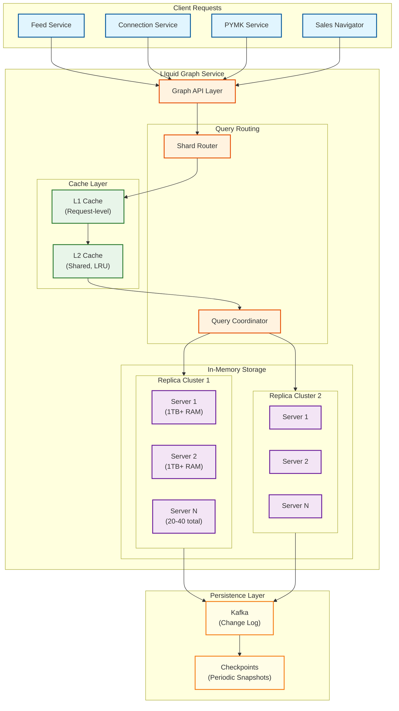
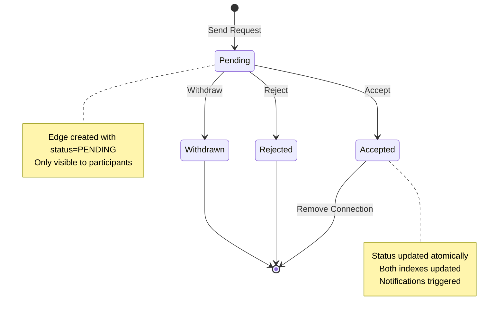
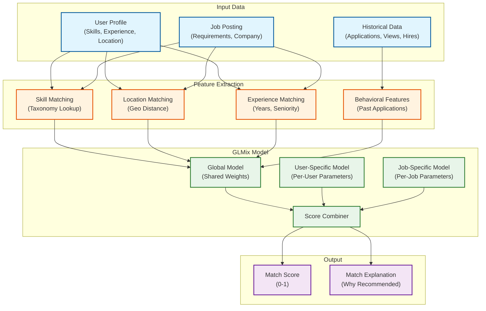
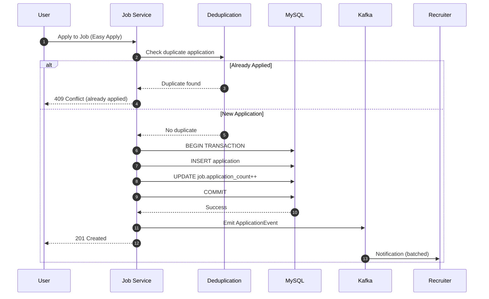
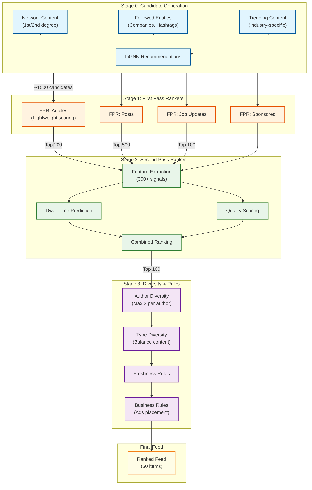

# LinkedIn: Deep Dive & Bottlenecks

[← Back to Index](./00-index.md)

---

## Deep Dive 1: LIquid Professional Graph

### Why LIquid is Critical

The professional graph is LinkedIn's core differentiator. Every major feature depends on it:
- **Connection degrees** (1st, 2nd, 3rd) for profile views and messaging
- **PYMK** (People You May Know) recommendations
- **Feed ranking** (connection strength signals)
- **Job matching** (connections at company)
- **Sales Navigator** (relationship paths to prospects)

**Scale Challenge**: 270 billion edges, 2 million QPS, <50ms latency.

### LIquid Architecture



### Key Design Decisions

#### 1. Full Replication vs Sharding

**Decision**: Full replication within each cluster.

| Approach | Pros | Cons |
|----------|------|------|
| **Sharding** | Lower memory per node | Cross-shard BFS is expensive |
| **Full Replication** | Fast local BFS | High memory (1TB+/server) |

**Rationale**: Bidirectional BFS for connection degree requires traversing from both ends. Sharding would require network hops for each BFS step, adding 10-50ms per hop. Full replication enables sub-50ms queries.

**Memory per Server**:
```
270B edges × 100 bytes/edge = 27TB raw
Compressed + indexed = ~500GB-1TB per server
20-40 servers per cluster = redundancy for failover
```

#### 2. Bidirectional Edge Storage

```
// Canonical edge storage (single edge, both directions indexed)
EDGE: {
    id1: MIN(member_a, member_b),    // Always lower ID first
    id2: MAX(member_a, member_b),
    status: ACCEPTED,
    initiator: member_a,             // Who sent request
    created_at: timestamp
}

// Dual indexes for O(1) lookup from either member
INDEX member_to_edges[member_id] -> [edge_ids]
// Populated for BOTH id1 and id2

INVARIANT: For any edge E,
  E ∈ member_to_edges[E.id1] AND E ∈ member_to_edges[E.id2]
```

**Why canonical form?**
- Prevents duplicate edges (A→B and B→A stored separately)
- Atomic creation/deletion (single edge to modify)
- Consistent hashing for routing

#### 3. Connection Request Lifecycle



### Performance Optimizations

#### 1. Bidirectional BFS Optimization

```
Standard BFS: O(b^d) where b=branching factor, d=depth
Bidirectional BFS: O(b^(d/2)) - meets in the middle

For LinkedIn (avg 400 connections, max depth 3):
- Standard: 400^3 = 64M node visits
- Bidirectional: 2 × 400^1.5 = ~16K node visits
- 4000x improvement
```

#### 2. 2nd Degree Caching

```
// Pre-compute 2nd degree for active users
BATCH JOB (hourly):
    FOR each active_user in TOP_10M_ACTIVE:
        first_degree = GetConnections(active_user)
        second_degree = {}

        FOR each conn in first_degree:
            second_degree.union(GetConnections(conn))

        second_degree.remove(first_degree)
        second_degree.remove(active_user)

        Cache.Set(f"2nd_degree:{active_user}", second_degree, TTL=1hr)

// Query-time: O(1) lookup instead of O(C²)
```

#### 3. Query Batching

```
// Client sends batch of degree queries
REQUEST: GetConnectionDegrees(member_id, [candidate_1, candidate_2, ..., candidate_100])

// Server batches BFS
FUNCTION BatchDegreeQuery(source, targets):
    // Single BFS from source
    visited = BFS(source, max_depth=3)

    results = []
    FOR each target in targets:
        IF target in visited:
            results.append({target: target, degree: visited[target].depth})
        ELSE:
            results.append({target: target, degree: 4})  // 3+

    RETURN results

// 100 individual queries: 100 × 50ms = 5000ms
// 1 batched query: 1 × 100ms = 100ms (50x faster)
```

### Failure Modes & Handling

| Failure | Impact | Mitigation |
|---------|--------|------------|
| **Server crash** | Loss of 1 replica | Other servers in cluster serve traffic; restart from checkpoint + Kafka |
| **Cluster failure** | Region degraded | Route to other cluster; cross-region failover |
| **Cache corruption** | Stale data | Invalidation via Kafka; fallback to source of truth |
| **Network partition** | Split brain | Quorum reads; reject writes during partition |

### Consistency Guarantees

```
WRITE PATH (Connection Accept):
1. Validate request exists (read from leader)
2. Update edge status: PENDING → ACCEPTED
3. Write to Kafka (durable commit log)
4. Update in-memory graph (all replicas via Kafka)
5. Invalidate caches (source and target member)
6. Return success

CONSISTENCY MODEL:
- Writes: Strongly consistent (Kafka commit before ACK)
- Reads: Eventually consistent (replica lag ~100ms)
- Read-your-writes: Guaranteed (route to same replica or wait)
```

---

## Deep Dive 2: Job Matching & Recommendations

### Why Job Matching is Critical

LinkedIn's revenue heavily depends on job marketplace:
- **Recruiter products**: $B+ revenue from talent solutions
- **Job Ads**: Promoted listings
- **Premium subscriptions**: Job seeker features

**Challenge**: Two-sided marketplace optimization (seekers AND recruiters must be satisfied).

### GLMix Architecture



### Two-Sided Optimization

```
Traditional Recommendation:
    Score(user, item) = Relevance(user → item)

Two-Sided Marketplace (LinkedIn Jobs):
    Score(user, job) = α × UserRelevance(user → job)
                     + β × RecruiterQuality(job → user)
                     + γ × MarketplaceHealth(job, user)

WHERE:
    UserRelevance = How good is this job for the user?
    RecruiterQuality = How good is this user for the recruiter?
    MarketplaceHealth = Does this match improve overall marketplace?

RECRUITER QUALITY SIGNALS:
    - User's response rate to similar jobs
    - User's application completion rate
    - User's interview rate after application
    - User's hire rate

MARKETPLACE HEALTH:
    - Avoid over-saturating popular jobs
    - Ensure new jobs get initial visibility
    - Balance geographic distribution
```

### Galene Search Index

```
// Galene: LinkedIn's distributed search infrastructure

INDEXING PIPELINE:
1. Job posted → Kafka event
2. Galene indexer consumes event
3. Extract and normalize fields
4. Build inverted index shards
5. Replicate to query servers

QUERY FLOW:
1. User query: "senior engineer remote python"
2. Parse into structured query:
   {
     title: ["senior", "engineer"],
     skills: ["python"],
     workplace_type: "REMOTE"
   }
3. Fan-out to index shards
4. Each shard returns top-K matches
5. Merge and re-rank with GLMix
6. Return final results

REAL-TIME INDEXING:
- New job visible in search: <30 seconds
- Job status change (closed): <10 seconds
- Batch reindexing: Nightly for consistency
```

### Multi-Armed Bandit for Exploration

```
// Recruiter search: Explore new candidates vs exploit known good ones

ALGORITHM: LinUCB for Candidate Exploration

CONTEXT:
    - Recruiter's past searches
    - Recruiter's past InMails
    - Recruiter's response rates by candidate type

ARMS:
    - Candidate segments (skill groups, experience levels)

REWARD:
    - InMail sent = +0.5
    - InMail replied = +1.0
    - Interview scheduled = +2.0
    - Hire made = +5.0

EXPLORATION:
    // Balance exploit (show proven candidate types) vs explore (new segments)
    score = expected_reward + α × uncertainty

    WHERE α = exploration coefficient (higher = more exploration)

PERSONALIZATION:
    // Learn per-recruiter preferences
    recruiter_params[recruiter_id] += gradient(observed_reward - predicted)
```

### Job Application Flow



### Failure Modes & Handling

| Failure | Impact | Mitigation |
|---------|--------|------------|
| **Galene index lag** | Stale search results | Show "recently posted" section from real-time feed |
| **GLMix model staleness** | Poor recommendations | Fallback to rule-based ranking; alert for retraining |
| **Application write failure** | Lost application | Retry with idempotency key; show "try again" |
| **Duplicate application** | User confusion | Idempotent API returns existing application |

---

## Deep Dive 3: 360Brew Feed Ranking

### Why Feed Ranking is Critical

Feed engagement drives:
- **Daily Active Users**: Primary engagement surface
- **Content creation**: Creators need audience
- **Ad revenue**: Feed is primary ad placement
- **Professional value**: LinkedIn's differentiation

**Key Insight**: LinkedIn optimizes for **dwell time** (professional value) not engagement (likes/shares). This prevents clickbait and maintains professional quality.

### 360Brew Pipeline



### Dwell Time Prediction

```
// Dwell time is LinkedIn's primary ranking signal

DEFINITION:
    Dwell Time = Time user spends viewing content
    - Scroll pause (>1 second)
    - Content expansion (clicking "see more")
    - Video watch time
    - Article read time

WHY DWELL TIME > ENGAGEMENT:
    - Likes can be gamed (engagement bait)
    - Comments can be low-quality ("Great post!")
    - Dwell time indicates actual value consumed
    - Aligns with LinkedIn's professional mission

MODEL ARCHITECTURE:
    Input Features:
        - Content length
        - Content type (text, image, video, article)
        - Author expertise (industry match, credentials)
        - Historical dwell on similar content
        - User's current session context
        - Device type (mobile vs desktop)

    Output:
        - Predicted dwell time (seconds)
        - Confidence score

TRAINING:
    - Log actual dwell time for impressions
    - Train regression model (gradient boosted trees)
    - Retrain weekly with fresh data
```

### Ranking Signal Weights

```
SIGNAL CATEGORY WEIGHTS (approximate):

┌─────────────────────────────────────────────────────────────┐
│                    360BREW SIGNAL WEIGHTS                    │
├─────────────────────────────────────────────────────────────┤
│                                                              │
│  Predicted Dwell Time          ████████████████████  40%    │
│  Author Expertise              ████████████          20%    │
│  Topic Relevance               ██████████            15%    │
│  Freshness                     ██████                10%    │
│  Engagement Rate               ██████                10%    │
│  Comment Quality               ███                   05%    │
│                                                              │
│  PENALTIES (multipliers):                                    │
│  - Spam score > 0.5            × 0.1                        │
│  - Low quality flag            × 0.5                        │
│  - Repeated content            × 0.3                        │
│                                                              │
└─────────────────────────────────────────────────────────────┘

AUTHOR EXPERTISE FACTORS:
    - Job title relevance to content topic
    - Industry match
    - Follower count in relevant field
    - Past content performance
    - Endorsements on relevant skills

TOPIC RELEVANCE FACTORS:
    - User's stated interests
    - User's industry/job function
    - Past engagement on similar topics
    - Hashtag match
```

### LLM Integration (2025)

```
// LinkedIn added LLM-based content understanding in 2025

USE CASES:
1. Content Classification
   - Identify content type (opinion, news, how-to, announcement)
   - Extract key topics beyond hashtags
   - Detect promotional vs valuable content

2. Quality Scoring
   - Assess writing quality
   - Identify thought leadership vs generic advice
   - Detect AI-generated low-effort content

3. Comment Quality
   - Distinguish "Great post!" from substantive comments
   - Identify expert comments (credentials match topic)
   - Surface valuable discussions

IMPLEMENTATION:
    // Batch processing for cost efficiency
    BATCH JOB (hourly):
        new_posts = GetPostsSince(last_run)

        FOR each batch of 100 posts:
            llm_response = LLM.Classify(batch)

            FOR each post, classification in zip(batch, llm_response):
                post.llm_quality_score = classification.quality
                post.llm_topics = classification.topics
                post.llm_content_type = classification.type

                UpdatePostMetadata(post)

    // Real-time fallback for new posts
    IF post.age < 1 hour AND post.llm_score IS NULL:
        score = FallbackHeuristicScore(post)
```

### Failure Modes & Handling

| Failure | Impact | Mitigation |
|---------|--------|------------|
| **Ranking service timeout** | Empty or stale feed | Serve cached feed; degrade to chronological |
| **Feature store unavailable** | Poor ranking quality | Use default features; cache user features locally |
| **LLM service down** | No quality scores | Skip LLM features; use heuristics |
| **Candidate generation failure** | No content | Show cached "top posts"; alert on-call |

---

## Bottleneck Analysis

### Bottleneck 1: Graph Traversal at Scale

**Problem**: 2nd/3rd degree queries require visiting millions of nodes.

```
Scenario: User with 1000 connections viewing PYMK
- 1st degree: 1000 queries
- 2nd degree: 1000 × 1000 = 1M potential nodes
- Deduplication and ranking: O(N log N)
```

**Mitigations**:
1. **Pre-computation**: Materialize 2nd degree for active users (hourly)
2. **Sampling**: For super-connectors, sample connections
3. **Caching**: LRU cache for frequent queries
4. **Batching**: Batch multiple degree queries in single request

```
BEFORE: 1000 individual queries × 50ms = 50s
AFTER:  1 batched query × 200ms + cache = 200ms
```

### Bottleneck 2: Real-Time Job Matching

**Problem**: GLMix scoring for thousands of jobs per search.

```
Scenario: Job search with 10K matching jobs
- Feature extraction: 10K × 50 features = 500K feature lookups
- Model inference: 10K × 1ms = 10s (sequential)
```

**Mitigations**:
1. **Two-stage ranking**: Cheap first pass, expensive second pass
2. **Feature caching**: Pre-compute user features
3. **Model quantization**: Faster inference with acceptable accuracy loss
4. **Batch inference**: GPU batching for parallel scoring

```
TWO-STAGE APPROACH:
Stage 1 (Cheap): BM25 text match → 10K → 1K candidates (50ms)
Stage 2 (Expensive): GLMix scoring → 1K → 50 results (200ms)
Total: 250ms vs 10s
```

### Bottleneck 3: Feed Freshness

**Problem**: Balancing pre-computation with fresh content.

```
Scenario: User opens app
- Pre-computed feed: 10 minutes old
- New post from close connection: 30 seconds ago
- User expects to see new post
```

**Mitigations**:
1. **Hybrid approach**: Pre-computed base + real-time merge
2. **Push on write**: For close connections, push to feed cache immediately
3. **Invalidation triggers**: Invalidate feed cache on high-engagement posts
4. **Client-side merge**: Client fetches both cached and "since" content

```
HYBRID FEED GENERATION:
1. Fetch pre-computed feed (50ms)
2. Fetch "since last_refresh" content (50ms, parallel)
3. Merge and re-rank top of feed (20ms)
4. Return hybrid feed (120ms total)
```

### Bottleneck 4: InMail Delivery Latency

**Problem**: Real-time messaging across distributed shards.

```
Scenario: InMail sent from US to user in India
- Sender shard: US-West
- Recipient shard: APAC
- Cross-region latency: 200ms+
```

**Mitigations**:
1. **Async write + notification**: Write locally, replicate async
2. **Regional presence**: Route notification to recipient's region
3. **Read-your-writes**: Sender sees message immediately from local shard
4. **Eventual consistency**: Recipient sees message within 2 seconds

```
OPTIMIZED FLOW:
1. Write to sender's local shard (20ms)
2. Return success to sender
3. Async: Replicate to recipient's shard via Kafka (100ms)
4. Async: Push notification to recipient's region (50ms)
Total sender latency: 20ms
Recipient receives: <2s
```

---

## Concurrency & Race Conditions

### Race 1: Simultaneous Connection Requests

**Scenario**: Member A and Member B both send connection requests to each other simultaneously.

```
TIMELINE:
T0: A sends request to B (in flight)
T1: B sends request to A (in flight)
T2: A's request creates edge (A,B) with status=PENDING, initiator=A
T3: B's request attempts to create edge...

PROBLEM: Could create duplicate edge or inconsistent state.
```

**Solution**: Canonical edge + optimistic locking

```
FUNCTION CreateConnectionRequest(sender, recipient):
    // Canonical edge key
    id1 = MIN(sender, recipient)
    id2 = MAX(sender, recipient)
    edge_key = f"{id1}:{id2}"

    // Optimistic lock with version
    existing = Graph.Get(edge_key)

    IF existing != NULL:
        IF existing.status == PENDING:
            IF existing.initiator != sender:
                // Other person already sent request - auto accept!
                Graph.Update(edge_key, status=ACCEPTED)
                RETURN {status: "AUTO_ACCEPTED"}
            ELSE:
                RETURN {status: "ALREADY_PENDING"}

        IF existing.status == ACCEPTED:
            RETURN {status: "ALREADY_CONNECTED"}

    // Create new edge with conditional write
    success = Graph.ConditionalWrite(edge_key, edge, IF_NOT_EXISTS)

    IF NOT success:
        // Lost race, retry logic
        RETURN CreateConnectionRequest(sender, recipient)  // Recursive retry

    RETURN {status: "PENDING"}
```

### Race 2: Job Application Deduplication

**Scenario**: User double-clicks "Apply" button, sending two requests.

```
TIMELINE:
T0: Click 1 received
T1: Click 2 received (before T0 completes)
T2: Both try to INSERT application
```

**Solution**: Idempotency key + unique constraint

```
FUNCTION ApplyToJob(user_id, job_id, idempotency_key):
    // Check idempotency cache first (fast path)
    cached = IdempotencyCache.Get(idempotency_key)
    IF cached != NULL:
        RETURN cached.response

    // Database-level deduplication
    TRY:
        result = DB.Insert(
            table="job_applications",
            values={user_id, job_id, ...},
            constraint="UNIQUE(user_id, job_id)"  // Prevents duplicates
        )

        response = {status: "CREATED", application_id: result.id}

    CATCH DuplicateKeyException:
        existing = DB.Get(user_id, job_id)
        response = {status: "ALREADY_APPLIED", application_id: existing.id}

    // Cache for idempotency
    IdempotencyCache.Set(idempotency_key, response, TTL=24h)

    RETURN response
```

### Race 3: Message Ordering

**Scenario**: User sends messages M1, M2, M3 rapidly. Network reordering causes M2 to arrive before M1.

```
TIMELINE:
T0: User sends M1 (seq=1)
T1: User sends M2 (seq=2)
T2: User sends M3 (seq=3)
T3: Server receives M2 (network reorder)
T4: Server receives M1
T5: Server receives M3
```

**Solution**: Client-side sequence + server reordering

```
CLIENT SIDE:
    // Assign client sequence numbers
    message.client_seq = client.next_seq++
    message.client_timestamp = client.now()

SERVER SIDE:
FUNCTION ProcessMessage(message):
    // Accept message regardless of order
    server_id = GenerateServerId()  // Time-ordered (Snowflake-like)
    message.server_id = server_id

    DB.Insert(message)

    // Emit event
    Kafka.Emit("message.created", message)

DISPLAY ORDERING:
    // Sort by client_timestamp for same sender
    // Sort by server_id for cross-sender
    messages.sort(key=lambda m:
        (m.client_timestamp if m.sender == viewer else m.server_id)
    )
```

### Race 4: Feed Cache Invalidation

**Scenario**: User's feed is cached. Connection posts new content. When should cache invalidate?

```
PROBLEM:
- Invalidate immediately: Cache thrashing, high load
- Never invalidate: Stale feeds
- Invalidate on interval: Predictable but delayed
```

**Solution**: Tiered invalidation strategy

```
INVALIDATION TIERS:

TIER 1 - IMMEDIATE (strong connections):
    IF post.author IN user.close_connections (top 50):
        InvalidateCache(user.feed_cache)
        PushToFeedCache(user, post)  // Insert at top

TIER 2 - SOFT INVALIDATE (normal connections):
    IF post.author IN user.connections:
        MarkCacheStale(user.feed_cache)  // Will refresh on next request

TIER 3 - LAZY (non-connections):
    // Don't invalidate, natural TTL expiry (1 hour)
    // Next request will fetch fresh rankings

IMPLEMENTATION:
    // On post creation
    Kafka.Emit("post.created", post)

    // Consumer determines tier
    FOR each follower of post.author:
        tier = DetermineInvalidationTier(follower, post.author)

        SWITCH tier:
            CASE 1: ImmediateInvalidate(follower)
            CASE 2: SoftInvalidate(follower)
            CASE 3: pass  // Natural expiry
```

---

*Previous: [← 03 - Low-Level Design](./03-low-level-design.md) | Next: [05 - Scalability & Reliability →](./05-scalability-and-reliability.md)*
