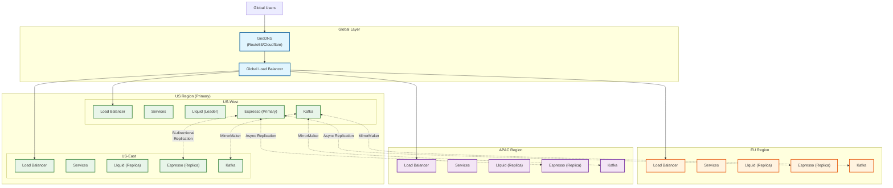
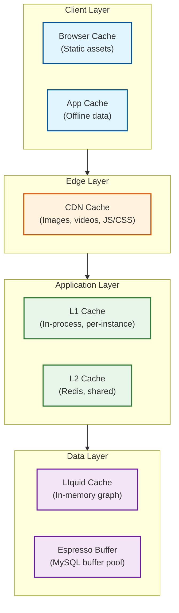

# LinkedIn: Scalability & Reliability

[← Back to Index](./00-index.md)

---

## Horizontal Scaling Strategy

### Service Scaling Matrix

| Service | Scaling Trigger | Scale Unit | Max Instances | Notes |
|---------|-----------------|------------|---------------|-------|
| **API Gateway** | Request rate | Container | 500+ | Stateless, fast scale |
| **Feed Service** | QPS + latency | Container | 200+ | CPU-bound ranking |
| **Connection Service** | Graph queries | Container | 100+ | Depends on LIquid |
| **Job Service** | Search QPS | Container | 150+ | Search + ranking |
| **Messaging Service** | Message rate | Container | 100+ | I/O bound |
| **LIquid Graph** | Memory + QPS | Server | 40/cluster | Memory-bound (1TB+) |
| **Espresso** | Storage + QPS | Shard | 500+ | Horizontal shards |
| **Redis Cache** | Memory | Cluster | 100+ | Distributed cache |
| **Kafka** | Message rate | Broker | 4000+ | Topic partitions |

### Auto-Scaling Configuration

```
// Kubernetes HPA configuration (pseudocode)

SERVICE: feed-service
SCALING_POLICY:
    min_replicas: 50
    max_replicas: 300

    SCALE_UP:
        metrics:
            - type: cpu
              target: 70%
            - type: custom
              name: request_latency_p99
              target: 200ms
            - type: custom
              name: queue_depth
              target: 100

        behavior:
            stabilization_window: 60s
            policies:
                - type: pods
                  value: 10
                  period: 60s
                - type: percent
                  value: 50
                  period: 60s

    SCALE_DOWN:
        metrics:
            - type: cpu
              target: 40%

        behavior:
            stabilization_window: 300s  // Slow scale-down
            policies:
                - type: percent
                  value: 10
                  period: 120s

SERVICE: liquid-graph
SCALING_POLICY:
    // LIquid doesn't auto-scale (memory-bound, full replication)
    // Manual capacity planning
    min_replicas: 20
    max_replicas: 40

    ALERT_ON:
        - memory_usage > 85%
        - query_latency_p99 > 100ms
        - error_rate > 0.1%
```

### Database Scaling Strategy

#### LIquid Graph Scaling

```
SCALING APPROACH: Full replication within cluster

CURRENT STATE:
- 270B edges
- 20-40 servers per cluster
- 1TB+ memory per server
- 2M QPS capacity

SCALING OPTIONS:

1. VERTICAL (preferred for LIquid):
   - Add memory to existing servers
   - Upgrade to faster CPUs
   - Capacity: 2TB RAM servers available

2. HORIZONTAL (add servers to cluster):
   - Each new server gets full replica
   - Linear QPS increase
   - Memory cost: Full graph per server

3. CLUSTER REPLICATION:
   - Add new replica cluster
   - Geographic distribution
   - Failover capacity

CAPACITY PLANNING:
    current_qps = 2M
    growth_rate = 20% / year
    year_5_qps = 2M × 1.2^5 = ~5M

    PLAN:
        Year 1: Optimize queries (30% reduction)
        Year 2: Add cluster (2x capacity)
        Year 3: Hardware refresh (2x per server)
        Year 5: Re-evaluate architecture
```

#### Espresso Scaling (Messaging)

```
SCALING APPROACH: Horizontal sharding

SHARD MANAGEMENT:
    current_shards = 500
    members_per_shard = 1.2B / 500 = 2.4M members

ADDING SHARDS:
    1. Create new shard (empty)
    2. Update PDR (Personal Data Router) for new member range
    3. New members route to new shard
    4. Optional: Rebalance existing members (expensive)

SHARD SPLIT (when shard too large):
    1. Pause writes to shard (brief)
    2. Snapshot shard
    3. Split by member_id range
    4. Update PDR routing
    5. Resume writes
    6. Background cleanup

REPLICATION:
    - 3 replicas per shard
    - Cross-datacenter async replication
    - Kafka-based change propagation
```

#### Read Replicas

```
READ REPLICA TOPOLOGY:

                    ┌─────────────┐
                    │   Primary   │
                    │  (US-West)  │
                    └──────┬──────┘
                           │
            ┌──────────────┼──────────────┐
            │              │              │
            ▼              ▼              ▼
     ┌───────────┐  ┌───────────┐  ┌───────────┐
     │  Replica  │  │  Replica  │  │  Replica  │
     │ (US-East) │  │   (EU)    │  │  (APAC)   │
     └───────────┘  └───────────┘  └───────────┘

REPLICATION LAG HANDLING:
    write_region = GetWriteRegion(member_id)

    IF operation.type == WRITE:
        route_to(write_region.primary)

    IF operation.type == READ:
        IF operation.requires_consistency:
            route_to(write_region.primary)  // Read from primary
        ELSE:
            route_to(local_replica)  // Read from nearest

READ-YOUR-WRITES:
    // Client tracks last write timestamp
    IF local_replica.timestamp < client.last_write_timestamp:
        route_to(primary)
    ELSE:
        route_to(local_replica)
```

---

## Multi-Region Architecture

### Global Topology



### Regional Responsibilities

| Region | Role | Data Ownership | Failover To |
|--------|------|----------------|-------------|
| **US-West** | Primary | US members (primary), Global (fallback) | US-East |
| **US-East** | Secondary | US members (replica) | US-West |
| **EU** | Regional | EU members (GDPR compliant) | US-West |
| **APAC** | Regional | APAC members | US-West |

### Cross-Region Data Flow

```
WRITE FLOW (User in EU updates profile):
1. Request → EU Load Balancer → EU API Gateway
2. EU Service → Espresso Primary (US-West, for consistency)
3. Async: US-West Espresso → Kafka → EU Espresso replica
4. Response to user (after primary write)
Latency: 200-300ms (cross-Atlantic)

READ FLOW (User in EU views feed):
1. Request → EU Load Balancer → EU API Gateway
2. EU Service → EU LIquid replica (local)
3. EU Service → EU Espresso replica (local)
4. Response to user
Latency: 50-100ms (local)

GDPR COMPLIANCE:
- EU member data stored in EU region
- Profile primary can be US (processing agreement)
- Messages must replicate to EU
- Right to deletion: Propagate to all regions
```

---

## Caching Architecture

### Multi-Layer Cache Strategy



### Cache Strategy Per Data Type

| Data Type | Cache Location | TTL | Invalidation |
|-----------|----------------|-----|--------------|
| **Feed** | Redis (L2) | 1 hour | On new post from connection |
| **Profile** | Redis + L1 | 30 min | On profile update |
| **Connections** | Redis | 30 min | On connection change |
| **2nd Degree** | Redis | 1 hour | Periodic refresh |
| **Job Listings** | Redis | 5 min | On job status change |
| **Session** | Redis | 24 hours (sliding) | On logout |
| **Images** | CDN | 1 year | Versioned URLs |
| **Static Assets** | CDN + Browser | 1 year | Hashed filenames |

### Thundering Herd Prevention

```
PROBLEM: Cache expires, 1000 requests hit database simultaneously

SOLUTIONS:

1. CACHE STAMPEDE LOCK:
    FUNCTION GetWithLock(key):
        value = Cache.Get(key)
        IF value != NULL:
            RETURN value

        lock_key = f"lock:{key}"
        IF Cache.SetNX(lock_key, "1", TTL=10s):
            // Got lock, fetch from DB
            value = Database.Get(key)
            Cache.Set(key, value, TTL=3600s)
            Cache.Delete(lock_key)
            RETURN value
        ELSE:
            // Wait for other request to populate
            SLEEP(100ms)
            RETURN GetWithLock(key)  // Retry

2. STALE-WHILE-REVALIDATE:
    FUNCTION GetWithStale(key):
        entry = Cache.GetWithMetadata(key)

        IF entry.is_fresh:
            RETURN entry.value

        IF entry.is_stale_but_valid:
            // Return stale, refresh async
            ASYNC: RefreshCache(key)
            RETURN entry.value

        // Truly expired, must refresh sync
        RETURN RefreshCache(key)

3. REQUEST COALESCING:
    // Multiple concurrent requests for same key
    // Only one fetches, others wait

    pending_requests = {}

    FUNCTION GetCoalesced(key):
        IF key IN pending_requests:
            RETURN pending_requests[key].wait()

        pending_requests[key] = Promise()

        value = Cache.Get(key)
        IF value == NULL:
            value = Database.Get(key)
            Cache.Set(key, value)

        pending_requests[key].resolve(value)
        DELETE pending_requests[key]

        RETURN value
```

---

## Fault Tolerance

### Failure Scenarios

| Scenario | Impact | Detection | Recovery |
|----------|--------|-----------|----------|
| **Single service instance** | Minimal | Health check | Auto-restart, traffic rerouted |
| **Service cluster** | Service degraded | Alert + synthetic probes | Manual failover, auto-recovery |
| **Database shard** | Partial data unavailable | Replication lag alert | Promote replica |
| **Region** | Regional outage | Cross-region health checks | DNS failover to other region |
| **LIquid cluster** | Graph queries fail | Query timeout spike | Failover to replica cluster |
| **Kafka broker** | Message delay | Consumer lag | Partition rebalance |

### Circuit Breaker Configuration

```
// Circuit breaker for external dependencies

CIRCUIT_BREAKER: graph-service
    failure_threshold: 5           // Failures to open
    success_threshold: 3           // Successes to close
    timeout: 30s                   // Time in open state
    half_open_requests: 3          // Test requests when half-open

    ON_OPEN:
        // Fallback behavior
        RETURN cached_connections OR empty_list

CIRCUIT_BREAKER: ranking-service
    failure_threshold: 10
    timeout: 60s

    ON_OPEN:
        // Degrade to chronological feed
        RETURN GetChronologicalFeed(user_id)

CIRCUIT_BREAKER: search-service
    failure_threshold: 5
    timeout: 30s

    ON_OPEN:
        // Show "search temporarily unavailable"
        // Offer cached popular jobs
        RETURN {
            status: "DEGRADED",
            popular_jobs: GetCachedPopularJobs()
        }

IMPLEMENTATION (Hystrix-style):
    FUNCTION CallWithCircuitBreaker(service, request):
        breaker = GetCircuitBreaker(service)

        IF breaker.state == OPEN:
            RETURN breaker.fallback()

        TRY:
            response = service.call(request, timeout=breaker.timeout)
            breaker.recordSuccess()
            RETURN response

        CATCH TimeoutException, ServiceException:
            breaker.recordFailure()

            IF breaker.failures >= breaker.failure_threshold:
                breaker.open()

            RETURN breaker.fallback()
```

### Graceful Degradation Strategies

```
DEGRADATION LEVELS:

LEVEL 1 - FULL SERVICE:
    - All features available
    - Real-time ranking
    - Full personalization

LEVEL 2 - REDUCED PERSONALIZATION:
    Trigger: Ranking service slow (>500ms p99)
    Actions:
        - Use cached ranking features
        - Reduce ranking signals (300 → 50)
        - Skip LLM quality scoring

LEVEL 3 - CACHED CONTENT:
    Trigger: Feed service degraded
    Actions:
        - Serve fully cached feeds
        - Disable real-time updates
        - Show "content may be outdated" banner

LEVEL 4 - READ ONLY:
    Trigger: Database write issues
    Actions:
        - Disable posts, messages, applications
        - Allow profile viewing
        - Queue writes for later processing

LEVEL 5 - STATIC FALLBACK:
    Trigger: Complete service failure
    Actions:
        - Serve static error page from CDN
        - Show status page link
        - Estimated recovery time

IMPLEMENTATION:
    degradation_level = HealthMonitor.GetLevel()

    SWITCH degradation_level:
        CASE 1: return FullServiceHandler(request)
        CASE 2: return ReducedPersonalizationHandler(request)
        CASE 3: return CachedContentHandler(request)
        CASE 4: return ReadOnlyHandler(request)
        CASE 5: return StaticFallbackHandler(request)
```

### Bulkhead Pattern

```
// Isolate failures to prevent cascade

BULKHEAD: critical-path
    // Feed, Profile, Connections
    thread_pool_size: 100
    queue_size: 50
    rejection_policy: FAIL_FAST

BULKHEAD: background-tasks
    // Analytics, Notifications
    thread_pool_size: 20
    queue_size: 100
    rejection_policy: QUEUE

BULKHEAD: external-integrations
    // Email, Push, Payment
    thread_pool_size: 10
    queue_size: 20
    rejection_policy: FAIL_FAST

ISOLATION:
    // Slow analytics query doesn't affect feed
    // External service timeout doesn't block profile view

    critical_pool = ThreadPool(100)
    background_pool = ThreadPool(20)
    external_pool = ThreadPool(10)

    FUNCTION HandleFeedRequest(request):
        critical_pool.submit(FeedHandler, request)

    FUNCTION HandleAnalyticsRequest(request):
        background_pool.submit(AnalyticsHandler, request)
```

---

## Disaster Recovery

### RPO/RTO Targets

| Data Type | RPO | RTO | Strategy |
|-----------|-----|-----|----------|
| **Member Profiles** | 0 (sync) | 5 min | Multi-region primary-primary |
| **Connections** | 0 (sync) | 5 min | LIquid replication |
| **Messages** | 1 min | 15 min | Kafka + Espresso replication |
| **Jobs** | 5 min | 30 min | Cross-region replication |
| **Analytics** | 1 hour | 4 hours | Batch recovery |

### Backup Strategy

```
BACKUP TYPES:

1. CONTINUOUS (WAL/Binlog):
    - Espresso: MySQL binlog → Kafka → Cross-region
    - LIquid: Change log → Kafka → Checkpoints
    - Retention: 7 days

2. POINT-IN-TIME SNAPSHOTS:
    - Espresso: Daily snapshots
    - LIquid: Hourly checkpoints
    - Retention: 30 days

3. COLD BACKUP:
    - Weekly full export to object storage
    - Retention: 1 year
    - Use case: Compliance, catastrophic recovery

BACKUP VERIFICATION:
    DAILY:
        - Restore random shard to test cluster
        - Run consistency checks
        - Alert on failures

    WEEKLY:
        - Full restore drill (one region)
        - Measure actual RTO

    QUARTERLY:
        - Complete DR drill
        - Failover to backup region
        - Verify all services functional
```

### Failover Procedures

```
SCENARIO: US-West region failure

DETECTION (automated):
    - Health check failures > 50%
    - Cross-region probe failures
    - Duration > 2 minutes

AUTOMATED RESPONSE:
    1. Alert on-call engineer
    2. Update GeoDNS to remove US-West
    3. Promote US-East Espresso replicas to primary
    4. Scale US-East services (2x)

MANUAL VERIFICATION:
    5. On-call verifies service health
    6. Confirms no data loss (check replication lag)
    7. Communicates via status page

RECOVERY (when US-West returns):
    8. Resync US-West from US-East
    9. Verify data consistency
    10. Gradually shift traffic back
    11. Post-incident review

RUNBOOK:
    $ ./failover.sh --region us-west --mode disable
    $ ./promote-replica.sh --region us-east --database espresso
    $ ./scale-services.sh --region us-east --factor 2
    $ ./verify-health.sh --region us-east
```

### Chaos Engineering

```
CHAOS EXPERIMENTS:

EXPERIMENT 1: Service Instance Failure
    Frequency: Daily
    Scope: Random service instance
    Action: Kill container
    Expected: Auto-restart, no user impact

EXPERIMENT 2: Database Shard Failure
    Frequency: Weekly
    Scope: Single Espresso shard
    Action: Disconnect shard
    Expected: Failover to replica < 30s

EXPERIMENT 3: Network Partition
    Frequency: Monthly
    Scope: Between services
    Action: Drop packets (tc netem)
    Expected: Circuit breakers activate, graceful degradation

EXPERIMENT 4: Region Failure
    Frequency: Quarterly
    Scope: Complete region
    Action: Disable region in load balancer
    Expected: Full failover < 5 minutes

EXPERIMENT 5: Kafka Broker Failure
    Frequency: Weekly
    Scope: Single broker
    Action: Kill broker process
    Expected: Partition rebalance, no message loss

GAMEDAY SCENARIO:
    // Combine multiple failures
    SCENARIO: Peak traffic + database shard failure + slow ranking

    STEPS:
        1. Inject traffic spike (2x normal)
        2. Fail one Espresso shard
        3. Add latency to ranking service (500ms)

    MEASURE:
        - User-facing error rate
        - Latency percentiles
        - Time to detection
        - Time to mitigation
```

---

## Load Balancing

### L4 vs L7 Strategy

| Layer | Technology | Use Case | Configuration |
|-------|------------|----------|---------------|
| **L4 (TCP)** | NLB/HAProxy | Database, Kafka | Round-robin, least-connections |
| **L7 (HTTP)** | ALB/Envoy | API Gateway, Services | Path-based routing, health checks |

```
L7 LOAD BALANCER CONFIG:

LISTENER: https://api.linkedin.com
    RULES:
        /v2/feed/*     → feed-service-target-group
        /v2/connections/* → connection-service-target-group
        /v2/jobs/*     → job-service-target-group
        /v2/messaging/* → messaging-service-target-group
        /*             → default-service-target-group

TARGET_GROUP: feed-service
    health_check:
        path: /health
        interval: 10s
        timeout: 5s
        healthy_threshold: 2
        unhealthy_threshold: 3

    load_balancing:
        algorithm: least_outstanding_requests
        slow_start: 30s  // Warm up new instances

    stickiness:
        enabled: false  // Stateless services
```

### Health Check Configuration

```
HEALTH CHECK TYPES:

1. LIVENESS (is process running?):
    GET /health/live
    Response: 200 OK
    Timeout: 1s
    Failure: Restart container

2. READINESS (can serve traffic?):
    GET /health/ready
    Response: 200 OK with checks
    Timeout: 5s
    Failure: Remove from load balancer

    {
        "status": "UP",
        "checks": {
            "database": "UP",
            "cache": "UP",
            "dependencies": "UP"
        }
    }

3. DEEP HEALTH (full functionality?):
    GET /health/deep
    Runs: Synthetic transaction
    Timeout: 10s
    Use: Monitoring, not routing

STARTUP PROBE:
    // For slow-starting services (e.g., loading ML models)
    initial_delay: 30s
    period: 10s
    failure_threshold: 30  // 5 minutes to start
```

---

## Capacity Planning

### Growth Projections

```
CURRENT STATE (2025):
    Members: 1.2 billion
    DAU: 134.5 million
    Graph edges: 270 billion
    Kafka messages/day: 7 trillion

GROWTH ASSUMPTIONS:
    Member growth: 10% / year
    DAU growth: 15% / year (improving engagement)
    Content growth: 20% / year
    Feature expansion: 25% / year (more signals, features)

5-YEAR PROJECTIONS:

    Year    Members    DAU        Graph Edges    Infra Cost
    ────────────────────────────────────────────────────────
    2025    1.2B       135M       270B           Baseline
    2026    1.3B       155M       320B           +20%
    2027    1.4B       178M       380B           +35%
    2028    1.5B       205M       450B           +50%
    2029    1.7B       236M       535B           +70%
    2030    1.9B       271M       635B           +95%

CAPACITY HEADROOM:
    Target: 2x peak capacity at all times
    Auto-scale: Handle 3x spikes without degradation
    DR: Full region capacity in backup region
```

### Infrastructure Automation

```
CAPACITY MANAGEMENT:

1. PREDICTIVE SCALING:
    // ML model predicts traffic 24 hours ahead
    FUNCTION PredictCapacity(service, time_window):
        historical = GetHistoricalTraffic(service, 30_days)
        seasonality = DetectPatterns(historical)
        events = GetScheduledEvents(time_window)  // Earnings, conferences

        predicted_traffic = Model.Predict(historical, seasonality, events)

        required_instances = predicted_traffic / instance_capacity
        safety_margin = 1.3  // 30% buffer

        RETURN ceil(required_instances * safety_margin)

2. AUTOMATED PROVISIONING:
    // Terraform + GitOps
    PIPELINE: infrastructure-changes
        ON: merge to main
        STEPS:
            - terraform plan
            - require approval (for >20% change)
            - terraform apply
            - smoke tests
            - rollback on failure

3. COST OPTIMIZATION:
    // Use spot/preemptible for non-critical workloads
    WORKLOAD_TIERS:
        CRITICAL (on-demand):
            - API Gateway
            - Feed Service
            - Connection Service

        STANDARD (mixed):
            - Job Service (70% on-demand, 30% spot)
            - Messaging (80% on-demand, 20% spot)

        BATCH (spot-first):
            - Analytics
            - ML Training
            - Batch Jobs
```

---

*Previous: [← 04 - Deep Dive & Bottlenecks](./04-deep-dive-and-bottlenecks.md) | Next: [06 - Security & Compliance →](./06-security-and-compliance.md)*
