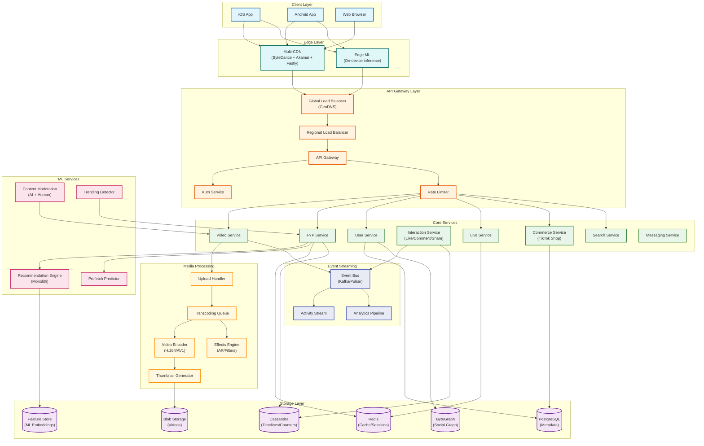

# TikTok System Design

[← Back to System Design Index](../README.md)

---

## Overview

TikTok is the world's leading short-form video platform, serving 1.9 billion monthly active users with an addictive, algorithm-driven "For You Page" (FYP). The system's core technical challenges center on **ultra-low-latency recommendation serving** (50ms inference budget), **aggressive video prefetching** to enable seamless swipe-based consumption, and **interest-graph-based discovery** that allows creators with zero followers to reach millions.

**Key Differentiators from Instagram/YouTube:**
- **Interest Graph vs Social Graph**: Content discovery driven by predicted interests, not follower relationships
- **Full-Screen Immersive UX**: Vertical video with swipe navigation requires aggressive multi-video prefetching
- **Real-Time ML at Scale**: Monolith recommendation system with online training and collisionless embeddings
- **Creator Democratization**: Zero-follower creators can go viral based purely on content quality

---

## System Characteristics

| Characteristic | Value | Implication |
|----------------|-------|-------------|
| Traffic Pattern | Read-heavy (1000:1 read-write ratio) | Aggressive CDN caching, video prefetching |
| Latency Target | <50ms FYP inference, <150ms video start | Edge caching, real-time ML inference |
| Consistency Model | Eventual (feed), Strong (uploads, payments) | Hybrid storage strategy |
| Availability Target | 99.99% | Multi-region active-active |
| Data Model | Interest-centric with social overlay | Embedding-based retrieval + graph traversal |
| Scale | 1.9B MAU, 34M uploads/day | Extreme horizontal scaling |
| Unique Challenge | Seamless swipe with zero buffering | Predictive multi-video prefetching |

---

## Complexity Rating

| Component | Complexity | Reason |
|-----------|------------|--------|
| **Overall System** | Very High | Real-time ML ranking + aggressive prefetch + global scale |
| FYP Recommendation Engine | Very High | 50ms budget, Monolith architecture, online training |
| Video Prefetching System | High | DRL-based prediction, bandwidth vs UX trade-off |
| Live Streaming Infrastructure | High | 2-3s latency, real-time gifting, horizontal scale |
| Content Moderation Pipeline | High | AI + 40K human moderators, regional compliance |
| Video Processing Pipeline | High | Multi-codec transcoding, effects, AR filters |
| TikTok Shop (E-commerce) | Medium-High | Payment processing, inventory management |
| Social Graph (ByteGraph) | Medium | Follow relationships, messaging |

---

## Quick Navigation

| Document | Description |
|----------|-------------|
| [01 - Requirements & Estimations](./01-requirements-and-estimations.md) | Functional/non-functional requirements, capacity planning |
| [02 - High-Level Design](./02-high-level-design.md) | Architecture, data flows, key decisions |
| [03 - Low-Level Design](./03-low-level-design.md) | Data models, APIs, algorithms (Monolith) |
| [04 - Deep Dive & Bottlenecks](./04-deep-dive-and-bottlenecks.md) | FYP ranking, prefetching, live streaming |
| [05 - Scalability & Reliability](./05-scalability-and-reliability.md) | Scaling strategies, fault tolerance |
| [06 - Security & Compliance](./06-security-and-compliance.md) | Content moderation, regional compliance, Project Texas |
| [07 - Observability](./07-observability.md) | Metrics, tracing, alerting |
| [08 - Interview Guide](./08-interview-guide.md) | Pacing, trap questions, trade-offs |

---

## Core Modules

| Module | Responsibility | Key Challenge | Scale |
|--------|----------------|---------------|-------|
| **Video Service** | Upload, processing, storage | Multi-codec transcoding, effects pipeline | 34M uploads/day |
| **FYP Service** | For You Page generation | 50ms inference, real-time ranking | 1B+ videos/day served |
| **Recommendation Engine** | Candidate retrieval & ranking | Monolith architecture, online training | Billions of predictions/day |
| **Live Service** | Real-time streaming | 2-3s latency, gift processing | Millions concurrent streams |
| **Commerce Service** | TikTok Shop | Payment processing, inventory | $70B+ GMV |
| **Prefetch Service** | Predictive video loading | Bandwidth optimization | Every swipe interaction |
| **Moderation Service** | Content safety | AI + human review | All uploaded content |

---

## Architecture Overview



---

## TikTok vs Instagram vs YouTube

| Aspect | TikTok | Instagram | YouTube |
|--------|--------|-----------|---------|
| **Primary Content** | Short-form video (15s-10min) | Mixed (photos, Stories, Reels) | Long-form + Shorts |
| **Graph Type** | Interest-based (algorithmic) | Social (follow-based) | Subscription-based |
| **Discovery Model** | FYP dominates (70%+ traffic) | Explore + Following | Search + Home |
| **Feed UX** | Full-screen swipe, immersive | Scrolling grid/feed | Click-to-watch |
| **Primary Ranking Signal** | Watch time, completion rate | Engagement (likes, shares) | Watch time, CTR |
| **Creator Entry Barrier** | Zero (viral from first post) | Medium (followers matter) | High (subscribers key) |
| **Preloading Strategy** | Aggressive (3-5 videos ahead) | Moderate (1 video) | Current video only |
| **ML Inference Budget** | 50ms | 100-200ms | 100-200ms |
| **Celebrity Threshold** | N/A (interest-based) | ~100K followers | ~100K subscribers |

---

## Key Scale Numbers

| Metric | Value | Context |
|--------|-------|---------|
| Monthly Active Users | 1.9 billion | Growing to 2.5B by end 2026 |
| Daily Active Users | 1.12 billion | 57% DAU/MAU ratio |
| Videos Uploaded Daily | 34 million | ~270/sec, ~16,000/min |
| Videos Watched Daily | 1+ billion | Massive read amplification |
| Average Session Time | 95-98 minutes | Highest among social platforms |
| App Opens per Day | 19 | Highly habitual usage |
| ML Inference Budget | 50ms | Real-time recommendation constraint |
| CDN Footprint | 2,070 IPs, 29 countries | Global edge distribution |
| TikTok Shop GMV | $70+ billion | Growing 20%+ annually |
| Human Moderators | 40,000+ | Hybrid AI + human moderation |

---

## For You Page (FYP) Pipeline Overview

```
┌─────────────────────────────────────────────────────────────────────────┐
│                        FYP RECOMMENDATION PIPELINE                       │
├─────────────────────────────────────────────────────────────────────────┤
│                                                                         │
│  STAGE 1: CANDIDATE RETRIEVAL (<10ms)                                   │
│  ┌─────────────────────────────────────────────────────────────────┐   │
│  │ • Two-Tower embedding model (user tower + item tower)           │   │
│  │ • ANN search across millions of videos                          │   │
│  │ • Output: ~5,000 candidates                                     │   │
│  │ • Sources: Interest vectors, trending, following, explore       │   │
│  └─────────────────────────────────────────────────────────────────┘   │
│                              ↓                                          │
│  STAGE 2: RANKING (<30ms)                                               │
│  ┌─────────────────────────────────────────────────────────────────┐   │
│  │ • DLRM (Deep Learning Recommendation Model)                     │   │
│  │ • Features: user profile, video features, context, history      │   │
│  │ • Predict: P(watch), P(like), P(share), P(complete)             │   │
│  │ • Online training via Monolith system                           │   │
│  │ • Output: Scored candidates                                     │   │
│  └─────────────────────────────────────────────────────────────────┘   │
│                              ↓                                          │
│  STAGE 3: RE-RANKING & FILTERING (<10ms)                                │
│  ┌─────────────────────────────────────────────────────────────────┐   │
│  │ • Diversity constraints (no consecutive same creator/sound)     │   │
│  │ • Exploration injection (30-50% explore, 50-70% exploit)        │   │
│  │ • Content policy filtering                                      │   │
│  │ • Quality score gating                                          │   │
│  │ • Output: Final ranked list (~50 videos)                        │   │
│  └─────────────────────────────────────────────────────────────────┘   │
│                              ↓                                          │
│  STAGE 4: PREFETCH PREDICTION                                           │
│  ┌─────────────────────────────────────────────────────────────────┐   │
│  │ • Predict next 3-5 videos user will swipe to                    │   │
│  │ • Adaptive preloading based on network conditions               │   │
│  │ • Balance: playback smoothness vs bandwidth waste               │   │
│  └─────────────────────────────────────────────────────────────────┘   │
│                                                                         │
└─────────────────────────────────────────────────────────────────────────┘
```

---

## Video Prefetching Strategy

```
┌─────────────────────────────────────────────────────────────────────────┐
│                    AGGRESSIVE PREFETCH ARCHITECTURE                      │
├─────────────────────────────────────────────────────────────────────────┤
│                                                                         │
│  USER VIEWING VIDEO N                                                   │
│  ┌─────────────────────────────────────────────────────────────────┐   │
│  │                                                                 │   │
│  │  ┌───────┐   ┌───────┐   ┌───────┐   ┌───────┐   ┌───────┐   │   │
│  │  │ N-1   │   │   N   │   │ N+1   │   │ N+2   │   │ N+3   │   │   │
│  │  │ PLAYED│   │PLAYING│   │BUFFERED│  │BUFFERED│  │BUFFERED│   │   │
│  │  │ 100%  │   │  ▶️   │   │ 100%  │   │  75%  │   │  50%  │   │   │
│  │  └───────┘   └───────┘   └───────┘   └───────┘   └───────┘   │   │
│  │                                                                 │   │
│  └─────────────────────────────────────────────────────────────────┘   │
│                                                                         │
│  PREFETCH DECISION ENGINE:                                              │
│  ┌─────────────────────────────────────────────────────────────────┐   │
│  │ • Lyapunov Optimization (APL): Balance smoothness + bandwidth   │   │
│  │ • Deep Reinforcement Learning: Learn optimal preload policy     │   │
│  │ • Network-aware: Adjust buffer depth based on bandwidth         │   │
│  │ • User behavior: Learn swipe patterns per user                  │   │
│  │ • Adaptive chunk size: Vary quality based on buffer state       │   │
│  └─────────────────────────────────────────────────────────────────┘   │
│                                                                         │
│  TRADE-OFF:                                                             │
│  • Aggressive prefetch → Seamless UX, wasted bandwidth                 │
│  • Conservative prefetch → Buffering delays, saved bandwidth           │
│  • TikTok optimizes for UX (waste ~30-40% bandwidth on average)        │
│                                                                         │
└─────────────────────────────────────────────────────────────────────────┘
```

---

## Feed Ranking Signals (2025-2026)

| Signal | Weight | Description |
|--------|--------|-------------|
| **Watch Time** | Highest | Duration watched (absolute and percentage) |
| **Video Completion Rate** | Very High | % who watch to end (70%+ = strong signal) |
| **Rewatch Rate** | Very High | Users rewatching (15-20%+ indicates quality) |
| **Shares** | High | DM shares, copy link (strongest engagement) |
| **Saves** | High | Bookmark for later |
| **Comments** | Medium-High | Conversation depth matters |
| **Likes** | Medium | Basic acknowledgment (lower weight in 2025) |
| **Follows (from video)** | Medium | Creator discovery signal |
| **Not Interested** | Negative | Explicit skip signal |
| **Skip Speed** | Negative | Swiping within 1-2 seconds |

---

## When to Use This Design

| Scenario | Applicable | Reason |
|----------|------------|--------|
| Short-form video platform | Yes | Core use case |
| Interest-graph recommendation | Yes | FYP architecture applies |
| Swipe-based content consumption | Yes | Prefetching system applies |
| Live streaming with monetization | Yes | Live + gifting architecture |
| Social commerce (in-app shopping) | Yes | TikTok Shop integration |
| Photo-first social network | Partial | Recommendation applies, video pipeline overkill |
| Long-form video (YouTube-style) | Partial | Ranking applies, prefetch differs |
| Text-first social platform | No | Over-engineered for text |

---

## Technology Stack Reference

| Layer | Technology Pattern | Real-World Example |
|-------|-------------------|-------------------|
| Metadata Storage | Relational DB | PostgreSQL |
| Timeline Storage | Wide-column NoSQL | Cassandra |
| Social Graph | Graph Database | ByteGraph (proprietary) |
| Caching | Distributed key-value | Redis, Aerospike |
| Video Storage | Distributed blob storage | Proprietary + cloud blob |
| CDN | Multi-vendor edge network | ByteDance CDN + Akamai + Fastly |
| ML Training | Real-time + batch | Monolith, Volcano Engine |
| ML Serving | Low-latency inference | 50ms budget, KiteX (gRPC) |
| Event Streaming | Distributed log | Kafka, Pulsar |
| Container Orchestration | Kubernetes | Kubernetes + Istio |

---

## Interview Readiness Checklist

Before your interview, ensure you can:

- [ ] Explain why TikTok's architecture differs from Instagram/YouTube (interest graph vs social graph)
- [ ] Walk through the FYP recommendation pipeline (retrieval → ranking → re-ranking)
- [ ] Describe the 50ms inference budget constraint and how Monolith achieves it
- [ ] Explain the Monolith architecture (collisionless embeddings, online training)
- [ ] Describe the aggressive prefetching strategy and bandwidth trade-offs
- [ ] Calculate capacity estimates (uploads/sec, videos served/day, storage)
- [ ] Discuss exploration vs exploitation balance in recommendations
- [ ] Handle the "cold start" problem for new users and new creators
- [ ] Explain content moderation at TikTok scale (AI + 40K moderators)
- [ ] Describe regional compliance (Project Texas, Project Clover)

---

## Quick Reference Card

```
┌─────────────────────────────────────────────────────────────────────────┐
│                    TIKTOK SYSTEM DESIGN CHEAT SHEET                     │
├─────────────────────────────────────────────────────────────────────────┤
│                                                                         │
│  SCALE NUMBERS:                                                         │
│  • 1.9B MAU  • 1.12B DAU  • 34M uploads/day  • 270 uploads/sec         │
│  • 1B+ videos watched/day  • 95 min avg session  • 50ms ML inference   │
│                                                                         │
│  FYP PIPELINE:                                                          │
│  • Retrieval: Two-Tower → 5K candidates (<10ms)                        │
│  • Ranking: DLRM → scored list (<30ms)                                 │
│  • Re-ranking: Diversity + exploration (<10ms)                         │
│  • Total budget: 50ms end-to-end                                       │
│                                                                         │
│  MONOLITH SYSTEM:                                                       │
│  • Collisionless embedding table (Cuckoo HashMap)                      │
│  • Online training (real-time feedback)                                │
│  • Single unified model for all stages                                 │
│                                                                         │
│  PREFETCHING:                                                           │
│  • Buffer 3-5 videos ahead                                             │
│  • Lyapunov optimization for bandwidth                                 │
│  • Deep RL for adaptive policy                                         │
│  • ~30-40% bandwidth waste accepted for UX                             │
│                                                                         │
│  RANKING SIGNALS:                                                       │
│  • Watch time (highest)  • Completion (very high)  • Rewatch (high)    │
│  • Shares (high)  • Saves (high)  • Likes (medium, declining)          │
│                                                                         │
│  KEY TRADE-OFFS:                                                        │
│  • Personalization vs diversity (filter bubbles)                       │
│  • Prefetch aggressiveness vs bandwidth waste                          │
│  • Real-time vs batch model updates                                    │
│  • Interest graph vs social graph (chose interest)                     │
│                                                                         │
│  COMMON TRAPS:                                                          │
│  • Treating TikTok like Instagram (follower-based vs interest-based)   │
│  • Ignoring 50ms inference constraint                                  │
│  • Underestimating prefetch complexity                                 │
│  • Forgetting exploration/exploitation balance                         │
│                                                                         │
└─────────────────────────────────────────────────────────────────────────┘
```

---

## Related Designs

| Design | Relevance |
|--------|-----------|
| [Instagram](../4.3-instagram/00-index.md) | Media processing, Stories, Reels competition |
| [Recommendation Engine](../3.12-recommendation-engine/00-index.md) | ML ranking fundamentals |
| [LLM Inference Engine](../3.23-llm-inference-engine/00-index.md) | Low-latency ML serving patterns |
| [CDN Design](../1.15-content-delivery-network-cdn/00-index.md) | Edge caching, multi-CDN |
| [Blob Storage System](../1.12-blob-storage-system/00-index.md) | Video storage patterns |
| [Feature Store](../3.16-feature-store/00-index.md) | ML feature serving |

---

## References

- [Monolith: Real Time Recommendation System With Collisionless Embedding Table](https://arxiv.org/pdf/2209.07663) - ByteDance, ACM RecSys 2022
- [TikTok Developer Blog](https://developers.tiktok.com/blogs)
- [ByteDance Processes Billions of Daily Videos Using Multimodal Models on AWS Inferentia2](https://aws.amazon.com/blogs/machine-learning/bytedance-processes-billions-of-daily-videos-using-their-multimodal-video-understanding-models-on-aws-inferentia2/)
- [Network-aware Prefetching Method for Short-Form Video Streaming](https://arxiv.org/pdf/2209.02927)
- [Short video preloading via domain knowledge assisted deep reinforcement learning](https://www.sciencedirect.com/science/article/pii/S2352864824000166)
- [TikTok Transparency Center](https://www.tiktok.com/transparency/)
- [How TikTok Works: Decoding System Design & Architecture](https://www.techaheadcorp.com/blog/decoding-tiktok-system-design-architecture/)
- [TikTok and the Art of Personalization: Investigating Exploration and Exploitation](https://dl.acm.org/doi/10.1145/3589334.3645600) - ACM Web Conference 2024

---

*Next: [Requirements & Estimations →](./01-requirements-and-estimations.md)*
