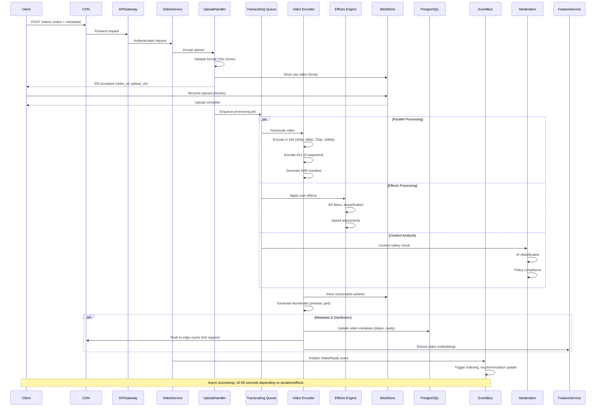
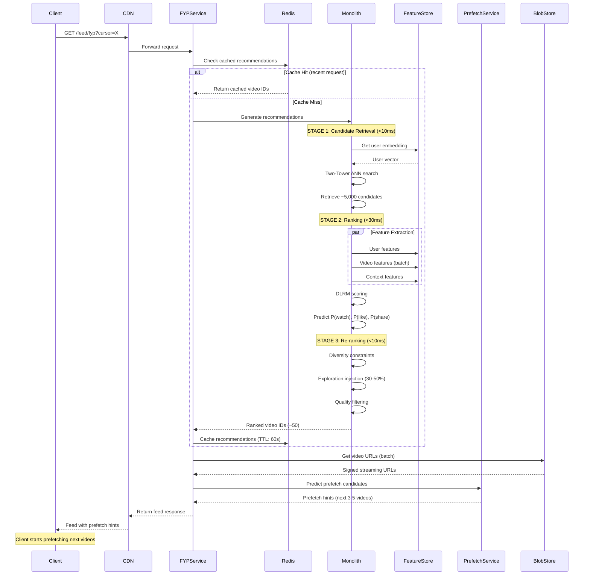
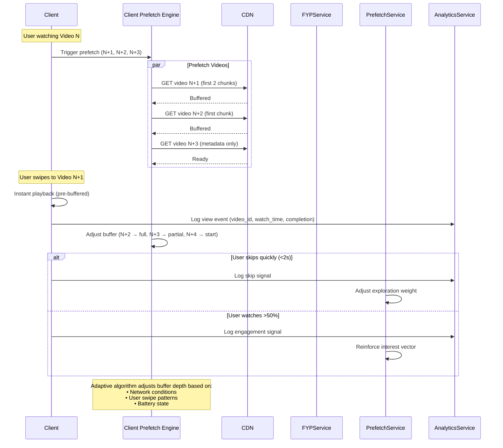
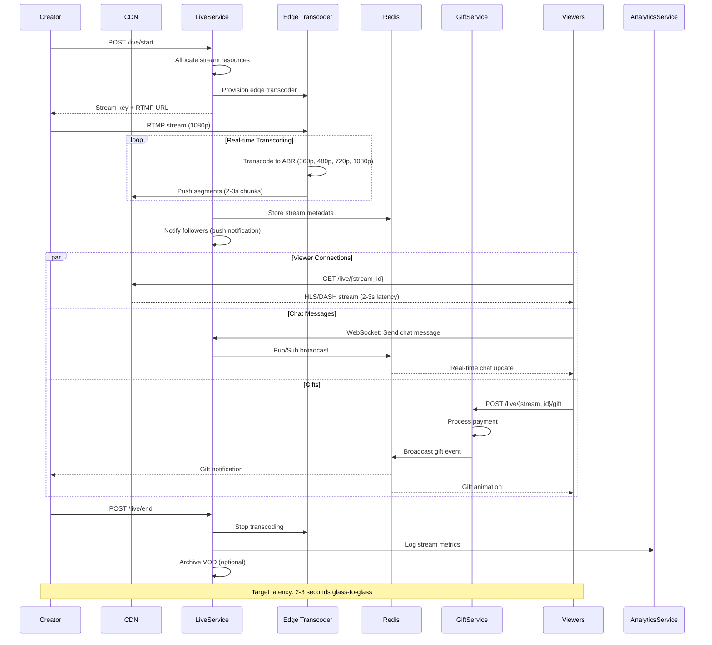
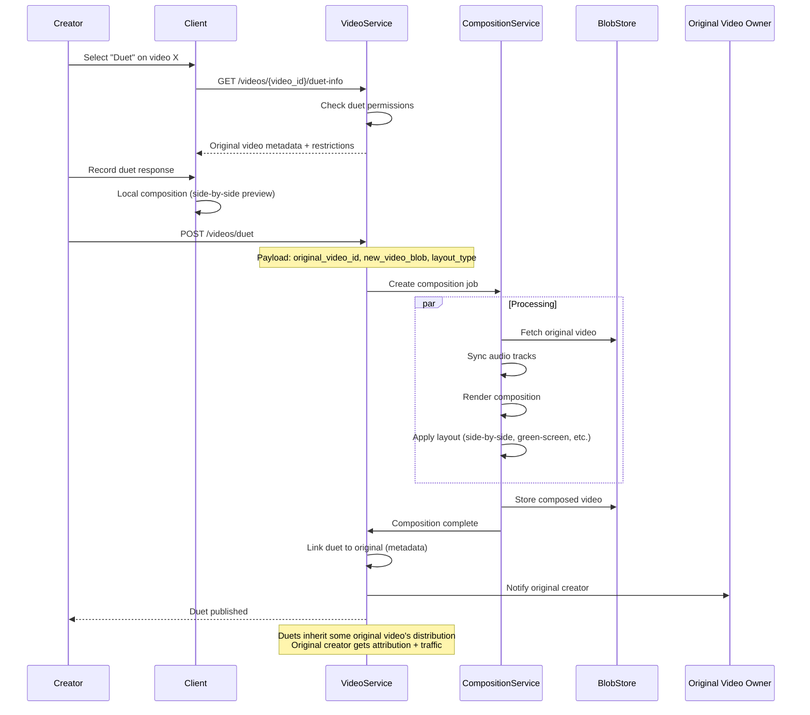
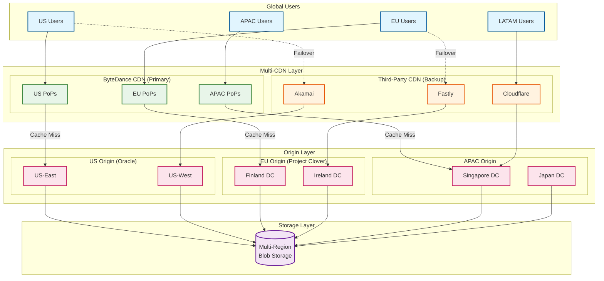
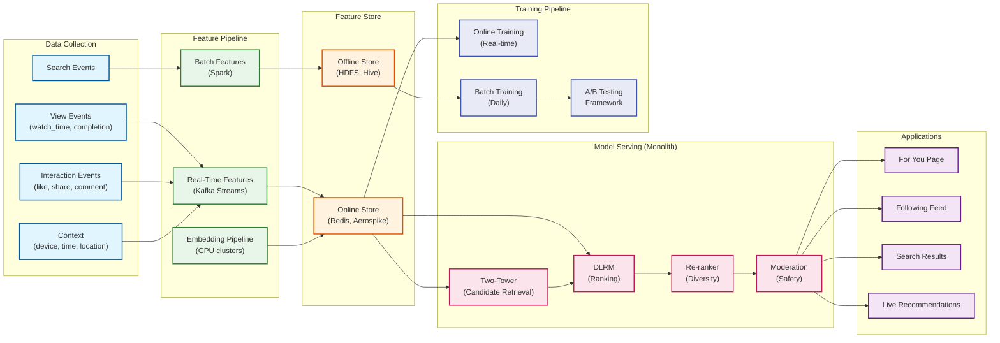

# High-Level Design

[← Back to Requirements](./01-requirements-and-estimations.md) | [Next: Low-Level Design →](./03-low-level-design.md)

---

## System Architecture

```mermaid
flowchart TB
    subgraph Clients["Client Layer"]
        iOS["iOS App"]
        Android["Android App"]
        Web["Web App<br/>(tiktok.com)"]
    end

    subgraph Edge["Edge Layer"]
        CDN["Multi-CDN<br/>(ByteDance + Akamai + Fastly)"]
        EdgeCompute["Edge Compute<br/>(On-device ML)"]
    end

    subgraph Gateway["Gateway Layer"]
        GLB["Global Load Balancer<br/>(GeoDNS)"]
        LB["Regional Load Balancer"]
        APIGateway["API Gateway<br/>(KiteX)"]
        Auth["Auth Service<br/>(OAuth 2.0)"]
        RateLimiter["Rate Limiter"]
    end

    subgraph CoreServices["Core Services"]
        VideoService["Video Service"]
        FYPService["FYP Service"]
        UserService["User Service"]
        FollowService["Follow Service"]
        InteractionService["Interaction Service<br/>(Like/Comment/Share)"]
        LiveService["Live Service"]
        CommerceService["Commerce Service<br/>(TikTok Shop)"]
        SearchService["Search Service"]
        NotificationService["Notification Service"]
        MessagingService["Messaging Service"]
    end

    subgraph MLServices["ML Services"]
        RecommendationEngine["Recommendation Engine<br/>(Monolith)"]
        ModerationService["Content Moderation<br/>(AI + Human)"]
        PrefetchService["Prefetch Predictor<br/>(DRL-based)"]
        TrendingService["Trending Detector"]
        FeatureService["Feature Service"]
    end

    subgraph MediaPipeline["Media Processing Pipeline"]
        UploadHandler["Upload Handler"]
        TranscodingQueue["Transcoding Queue"]
        VideoEncoder["Video Encoder<br/>(H.264/AV1)"]
        EffectsEngine["Effects Engine<br/>(AR/Filters)"]
        ThumbnailGen["Thumbnail Generator"]
        AudioExtractor["Audio Extractor"]
    end

    subgraph Streaming["Event Streaming"]
        EventBus["Event Bus<br/>(Kafka/Pulsar)"]
        ActivityStream["Activity Stream"]
        AnalyticsPipeline["Analytics Pipeline"]
        RealTimeAgg["Real-time Aggregator"]
    end

    subgraph Storage["Storage Layer"]
        Cassandra[("Cassandra<br/>(Timelines/Counters)")]
        Redis[("Redis<br/>(Cache/Sessions)")]
        PostgreSQL[("PostgreSQL<br/>(Metadata)")]
        ByteGraph[("ByteGraph<br/>(Social Graph)")]
        BlobStorage[("Blob Storage<br/>(Videos)")]
        FeatureStore[("Feature Store<br/>(Embeddings)")]
        SearchIndex[("Search Index<br/>(ElasticSearch)")]
    end

    %% Client to Edge
    iOS --> CDN
    Android --> CDN
    Web --> CDN
    iOS --> EdgeCompute
    Android --> EdgeCompute

    CDN --> GLB
    EdgeCompute --> GLB

    %% Gateway flow
    GLB --> LB --> APIGateway
    APIGateway --> Auth
    APIGateway --> RateLimiter

    %% Core service routing
    RateLimiter --> VideoService
    RateLimiter --> FYPService
    RateLimiter --> UserService
    RateLimiter --> FollowService
    RateLimiter --> InteractionService
    RateLimiter --> LiveService
    RateLimiter --> CommerceService
    RateLimiter --> SearchService

    %% FYP flow
    FYPService --> RecommendationEngine
    FYPService --> PrefetchService
    FYPService --> Redis
    FYPService --> Cassandra
    RecommendationEngine --> FeatureStore
    RecommendationEngine --> FeatureService

    %% Video upload flow
    VideoService --> UploadHandler
    UploadHandler --> TranscodingQueue
    TranscodingQueue --> VideoEncoder
    TranscodingQueue --> EffectsEngine
    TranscodingQueue --> AudioExtractor
    VideoEncoder --> ThumbnailGen
    ThumbnailGen --> BlobStorage
    VideoEncoder --> BlobStorage

    %% Moderation
    ModerationService --> VideoService
    ModerationService --> UploadHandler

    %% Trending
    TrendingService --> FYPService
    TrendingService --> SearchService

    %% Event streaming
    VideoService --> EventBus
    InteractionService --> EventBus
    EventBus --> ActivityStream
    EventBus --> AnalyticsPipeline
    EventBus --> RealTimeAgg
    ActivityStream --> NotificationService

    %% Storage connections
    UserService --> PostgreSQL
    UserService --> ByteGraph
    FollowService --> ByteGraph
    InteractionService --> Cassandra
    LiveService --> Redis
    CommerceService --> PostgreSQL
    SearchService --> SearchIndex

    classDef client fill:#e1f5fe,stroke:#01579b,stroke-width:2px
    classDef edge fill:#e0f7fa,stroke:#00695c,stroke-width:2px
    classDef gateway fill:#fff3e0,stroke:#e65100,stroke-width:2px
    classDef core fill:#e8f5e9,stroke:#2e7d32,stroke-width:2px
    classDef ml fill:#fce4ec,stroke:#c2185b,stroke-width:2px
    classDef pipeline fill:#fff8e1,stroke:#ff8f00,stroke-width:2px
    classDef streaming fill:#e8eaf6,stroke:#3f51b5,stroke-width:2px
    classDef storage fill:#f3e5f5,stroke:#6a1b9a,stroke-width:2px

    class iOS,Android,Web client
    class CDN,EdgeCompute edge
    class GLB,LB,APIGateway,Auth,RateLimiter gateway
    class VideoService,FYPService,UserService,FollowService,InteractionService,LiveService,CommerceService,SearchService,NotificationService,MessagingService core
    class RecommendationEngine,ModerationService,PrefetchService,TrendingService,FeatureService ml
    class UploadHandler,TranscodingQueue,VideoEncoder,EffectsEngine,ThumbnailGen,AudioExtractor pipeline
    class EventBus,ActivityStream,AnalyticsPipeline,RealTimeAgg streaming
    class Cassandra,Redis,PostgreSQL,ByteGraph,BlobStorage,FeatureStore,SearchIndex storage
```



---

## Data Flow Diagrams

### 1. Video Upload Flow



### 2. For You Page (FYP) Feed Generation



### 3. Swipe & Prefetch Flow



### 4. Live Streaming Flow



### 5. Duet/Stitch Composition Flow



---

## Key Architectural Decisions

### 1. Service Architecture

| Decision | Choice | Rationale |
|----------|--------|-----------|
| Architecture Style | Microservices | Independent scaling, team ownership, fault isolation |
| Internal Communication | gRPC (KiteX) | Low latency (sub-ms), strong typing, ByteDance optimized |
| External API | REST + GraphQL | Developer familiarity, mobile-optimized |
| Service Mesh | ByteMesh (Istio-based) | mTLS, traffic management, observability |
| Service Discovery | DNS + Consul | Reliability, multi-region support |

### 2. Sync vs Async Communication

| Flow | Model | Reason |
|------|-------|--------|
| FYP Feed Generation | Sync (50ms budget) | User waiting; real-time personalization |
| Video Upload | Async | Long processing (10-60s); immediate ack needed |
| Like/Comment | Sync (acknowledgment) + Async (propagation) | Fast user feedback, eventual consistency |
| View Logging | Async (fire-and-forget) | Analytics can batch; no user impact |
| Live Chat | Sync (WebSocket) | Real-time communication required |
| Notifications | Async (batch) | Can aggregate; timing flexible |
| Content Moderation | Async (parallel with upload) | Background processing |

### 3. Database Choices

```mermaid
flowchart LR
    subgraph Polyglot["Polyglot Persistence Strategy"]
        PostgreSQL["PostgreSQL<br/>• User profiles<br/>• Video metadata<br/>• Shop products<br/>• Auth data"]
        Cassandra["Cassandra<br/>• FYP timelines<br/>• Interaction logs<br/>• View counters<br/>• Notifications"]
        ByteGraph["ByteGraph<br/>• Follow graph<br/>• User relationships<br/>• Interest clusters"]
        BlobStore["Blob Storage<br/>• Video files<br/>• Thumbnails<br/>• Audio clips"]
        Redis["Redis<br/>• Session cache<br/>• Rate limiting<br/>• Live stream state<br/>• Prefetch hints"]
        FeatureStore["Feature Store<br/>• User embeddings<br/>• Video embeddings<br/>• Real-time features"]
        ElasticSearch["ElasticSearch<br/>• User search<br/>• Hashtag search<br/>• Sound search"]
    end

    classDef relational fill:#e3f2fd,stroke:#1565c0,stroke-width:2px
    classDef nosql fill:#e8f5e9,stroke:#2e7d32,stroke-width:2px
    classDef graph fill:#fff3e0,stroke:#ef6c00,stroke-width:2px
    classDef blob fill:#fce4ec,stroke:#c2185b,stroke-width:2px
    classDef cache fill:#e1f5fe,stroke:#0288d1,stroke-width:2px
    classDef ml fill:#f3e5f5,stroke:#6a1b9a,stroke-width:2px
    classDef search fill:#e0f2f1,stroke:#00695c,stroke-width:2px

    class PostgreSQL relational
    class Cassandra nosql
    class ByteGraph graph
    class BlobStore blob
    class Redis cache
    class FeatureStore ml
    class ElasticSearch search
```

| Database | Use Case | Why This Choice |
|----------|----------|-----------------|
| **PostgreSQL** | User profiles, video metadata, commerce | Strong consistency, ACID, complex queries |
| **Cassandra** | Timelines, counters, logs | High write throughput, horizontal scaling, eventual consistency |
| **ByteGraph** | Social graph, relationships | Optimized graph traversal, edge-tree indexing |
| **Blob Storage** | Video files | Optimized for large binary objects, CDN integration |
| **Redis** | Caching, sessions, real-time state | Sub-millisecond latency, pub/sub for live |
| **Feature Store** | ML embeddings, features | Low-latency serving for 50ms inference budget |
| **ElasticSearch** | Search | Full-text search, relevance ranking |

### 4. Caching Strategy

| Layer | Technology | Data Cached | TTL | Hit Rate |
|-------|------------|-------------|-----|----------|
| **L1 (Client)** | SQLite/IndexedDB | Feed state, preferences | Session | 80%+ |
| **L2 (Edge/CDN)** | Multi-CDN | Video files, thumbnails | Hours-days | 95%+ |
| **L3 (Application)** | Redis | FYP recommendations, sessions | 60s-5min | 70%+ |
| **L4 (ML)** | Feature Store | Embeddings, real-time features | Minutes | 90%+ |
| **L5 (Database)** | Cassandra cache | Hot rows, counters | Seconds | 60%+ |

### 5. Message Queue Usage

| Use Case | Pattern | Technology | Rationale |
|----------|---------|------------|-----------|
| Video Processing | Work Queue | Kafka | Ordered processing, replay capability |
| View/Interaction Events | Streaming | Pulsar | High throughput, exactly-once |
| Live Chat | Pub/Sub | Redis Pub/Sub | Low latency, ephemeral |
| Notifications | Priority Queue | Kafka | Batching, ordering |
| ML Feature Updates | CDC | Kafka Connect | Real-time feature freshness |

---

## Architecture Pattern Checklist

| Pattern | Decision | Implementation |
|---------|----------|----------------|
| Sync vs Async | Sync for FYP (50ms), async for uploads | gRPC for sync, Kafka for async |
| Event-driven vs Request-response | Both | Events for updates, request-response for queries |
| Push vs Pull (Feed) | Interest-based push | Algorithm pushes to FYP, not follower fan-out |
| Stateless vs Stateful | Stateless services | State externalized to Redis/databases |
| Read-heavy optimization | Yes (300:1) | Multi-tier caching, CDN, prefetching |
| Real-time vs Batch | Both | Real-time for FYP, batch for ML training |
| Edge processing | Yes | On-device ML, CDN caching, edge transcoding |

---

## Interest Graph vs Social Graph Architecture

Unlike Instagram/Facebook (social graph), TikTok uses an **interest graph** for content discovery:

```
┌─────────────────────────────────────────────────────────────────────────┐
│                    INTEREST GRAPH ARCHITECTURE                          │
├─────────────────────────────────────────────────────────────────────────┤
│                                                                         │
│  SOCIAL GRAPH (Instagram/Facebook)          INTEREST GRAPH (TikTok)    │
│  ┌─────────────────────────────┐            ┌─────────────────────────┐│
│  │ Feed = f(who you follow)    │            │ Feed = f(what you like) ││
│  │                             │            │                         ││
│  │ • Content from friends      │            │ • Content from anyone   ││
│  │ • Celebrity fan-out problem │            │ • No fan-out problem    ││
│  │ • Follow count matters      │            │ • Follow count irrelevant││
│  │ • Timeline-based storage    │            │ • Embedding-based search││
│  └─────────────────────────────┘            └─────────────────────────┘│
│                                                                         │
│  IMPLICATIONS FOR TIKTOK:                                               │
│  ┌─────────────────────────────────────────────────────────────────┐   │
│  │ 1. NO FOLLOWER FAN-OUT: No need to write to follower timelines  │   │
│  │ 2. REAL-TIME RANKING: Every FYP request runs full ML pipeline   │   │
│  │ 3. COLD START FRIENDLY: New users get personalized in ~8 swipes │   │
│  │ 4. CREATOR DEMOCRATIZATION: Zero followers can go viral         │   │
│  │ 5. EMBEDDING-CENTRIC: Feature Store is critical infrastructure  │   │
│  └─────────────────────────────────────────────────────────────────┘   │
│                                                                         │
└─────────────────────────────────────────────────────────────────────────┘
```

---

## Multi-CDN Architecture



**Multi-CDN Strategy:**
- **Primary:** ByteDance proprietary CDN (29 countries, 2,070+ IPs)
- **Backup:** Akamai, Fastly, Cloudflare for failover and overflow
- **Intelligent Routing:** GeoDNS + real-time performance-based routing
- **Cache Hit Rate:** 95%+ for video content
- **Edge Transcoding:** Some regions have edge transcoders for live streaming

---

## ML Infrastructure Overview



---

## Key Technical Decisions Summary

| Area | Decision | Trade-off |
|------|----------|-----------|
| **Feed Model** | Interest graph (not social graph) | Real-time ML cost vs creator democratization |
| **ML Inference** | 50ms budget, Monolith system | Engineering complexity vs personalization quality |
| **Prefetching** | Aggressive (3-5 videos ahead) | Bandwidth waste vs seamless UX |
| **Storage** | Polyglot (PostgreSQL + Cassandra + ByteGraph) | Complexity vs optimal per use case |
| **Caching** | Multi-tier (Client → CDN → Redis) | Memory cost vs latency |
| **CDN** | Multi-vendor (ByteDance + Akamai + Fastly) | Cost vs reliability |
| **Consistency** | Eventual (feed), Strong (payments) | Availability vs consistency |
| **Processing** | Async with immediate ack | UX vs processing delay |
| **Training** | Online + batch hybrid | Freshness vs stability |

---

*[← Back to Requirements](./01-requirements-and-estimations.md) | [Next: Low-Level Design →](./03-low-level-design.md)*
