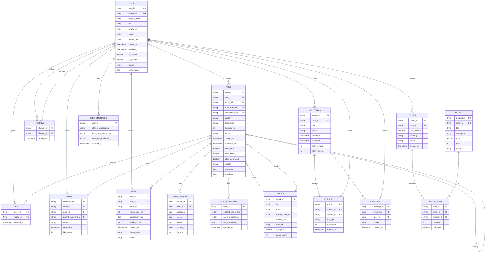

# Low-Level Design

[← Back to High-Level Design](./02-high-level-design.md) | [Next: Deep Dive & Bottlenecks →](./04-deep-dive-and-bottlenecks.md)

---

## Data Model

### Entity Relationship Diagram



### Schema Details

#### Users Table (PostgreSQL)

```
TABLE users (
    user_id         VARCHAR(24) PRIMARY KEY,  -- Snowflake ID
    username        VARCHAR(30) UNIQUE NOT NULL,
    display_name    VARCHAR(50),
    bio             TEXT,
    avatar_url      VARCHAR(500),
    email           VARCHAR(255),
    phone_hash      VARCHAR(64),              -- Hashed for privacy
    created_at      TIMESTAMP WITH TIME ZONE DEFAULT NOW(),
    updated_at      TIMESTAMP WITH TIME ZONE DEFAULT NOW(),
    is_verified     BOOLEAN DEFAULT FALSE,
    is_private      BOOLEAN DEFAULT FALSE,
    region          VARCHAR(10),              -- For compliance
    follower_count  BIGINT DEFAULT 0,         -- Denormalized
    following_count BIGINT DEFAULT 0,         -- Denormalized
    video_count     BIGINT DEFAULT 0,         -- Denormalized
    preferences     JSONB                     -- User settings
);

INDEX idx_users_username ON users(username);
INDEX idx_users_region ON users(region);
INDEX idx_users_created_at ON users(created_at);
```

#### Videos Table (PostgreSQL)

```
TABLE videos (
    video_id        VARCHAR(24) PRIMARY KEY,  -- Snowflake ID
    user_id         VARCHAR(24) NOT NULL REFERENCES users(user_id),
    sound_id        VARCHAR(24) REFERENCES sounds(sound_id),
    duet_video_id   VARCHAR(24) REFERENCES videos(video_id),
    stitch_video_id VARCHAR(24) REFERENCES videos(video_id),
    caption         TEXT,
    duration_ms     INTEGER NOT NULL,
    status          VARCHAR(20) DEFAULT 'processing',  -- processing, active, removed, hidden
    visibility      VARCHAR(20) DEFAULT 'public',      -- public, private, friends
    created_at      TIMESTAMP WITH TIME ZONE DEFAULT NOW(),
    published_at    TIMESTAMP WITH TIME ZONE,
    allow_duet      BOOLEAN DEFAULT TRUE,
    allow_stitch    BOOLEAN DEFAULT TRUE,
    allow_download  BOOLEAN DEFAULT TRUE,
    hashtags        TEXT[],                   -- Array of hashtag strings
    mentions        TEXT[],                   -- Array of mentioned user_ids
    like_count      BIGINT DEFAULT 0,         -- Denormalized
    comment_count   BIGINT DEFAULT 0,         -- Denormalized
    share_count     BIGINT DEFAULT 0,         -- Denormalized
    view_count      BIGINT DEFAULT 0,         -- Denormalized
    quality_score   FLOAT                     -- ML-computed quality
);

INDEX idx_videos_user_id ON videos(user_id);
INDEX idx_videos_sound_id ON videos(sound_id);
INDEX idx_videos_published_at ON videos(published_at DESC);
INDEX idx_videos_status ON videos(status);
INDEX idx_videos_hashtags ON videos USING GIN(hashtags);
```

#### Video Variants Table (PostgreSQL)

```
TABLE video_variants (
    variant_id      VARCHAR(24) PRIMARY KEY,
    video_id        VARCHAR(24) NOT NULL REFERENCES videos(video_id),
    resolution      VARCHAR(10) NOT NULL,     -- 240p, 480p, 720p, 1080p
    codec           VARCHAR(10) NOT NULL,     -- h264, av1
    bitrate_kbps    INTEGER NOT NULL,
    storage_url     VARCHAR(500) NOT NULL,
    file_size_bytes BIGINT NOT NULL,
    created_at      TIMESTAMP WITH TIME ZONE DEFAULT NOW()
);

INDEX idx_variants_video_id ON video_variants(video_id);
UNIQUE INDEX idx_variants_video_resolution_codec ON video_variants(video_id, resolution, codec);
```

#### Interactions (Cassandra)

```
-- Likes by video (for counting and listing)
TABLE likes_by_video (
    video_id    TEXT,
    user_id     TEXT,
    created_at  TIMESTAMP,
    PRIMARY KEY ((video_id), created_at, user_id)
) WITH CLUSTERING ORDER BY (created_at DESC);

-- Likes by user (for "liked videos" page)
TABLE likes_by_user (
    user_id     TEXT,
    video_id    TEXT,
    created_at  TIMESTAMP,
    PRIMARY KEY ((user_id), created_at, video_id)
) WITH CLUSTERING ORDER BY (created_at DESC);

-- Views for analytics
TABLE views (
    video_id        TEXT,
    user_id         TEXT,
    view_id         TEXT,
    watch_time_ms   INT,
    completion_rate FLOAT,
    replay_count    INT,
    created_at      TIMESTAMP,
    device_type     TEXT,
    region          TEXT,
    PRIMARY KEY ((video_id), created_at, view_id)
) WITH CLUSTERING ORDER BY (created_at DESC)
  AND default_time_to_live = 2592000;  -- 30 days retention
```

#### Social Graph (ByteGraph - Edge Model)

```
-- Follow relationships as edges
EDGE follow (
    follower_id     VERTEX,
    following_id    VERTEX,
    created_at      TIMESTAMP,
    notification_on BOOLEAN DEFAULT TRUE
);

-- Interest edges (user to topic)
EDGE interest (
    user_id         VERTEX,
    topic_id        VERTEX,
    score           FLOAT,
    updated_at      TIMESTAMP
);

-- Indexes for traversal
INDEX follow_out ON follow(follower_id);     -- Who does user follow?
INDEX follow_in ON follow(following_id);     -- Who follows user?
INDEX interest_user ON interest(user_id);    -- User's interests
```

#### Embeddings (Feature Store)

```
-- User embeddings (Redis/Aerospike)
KEY: user_embedding:{user_id}
VALUE: {
    "interest_embedding": [float; 256],      -- Long-term interests
    "short_term_embedding": [float; 128],    -- Recent activity
    "context_embedding": [float; 64],        -- Current context
    "updated_at": timestamp
}
TTL: 1 hour (refreshed on activity)

-- Video embeddings (Redis/Aerospike)
KEY: video_embedding:{video_id}
VALUE: {
    "content_embedding": [float; 256],       -- Visual features
    "audio_embedding": [float; 128],         -- Audio features
    "text_embedding": [float; 128],          -- Caption/hashtags
    "updated_at": timestamp
}
TTL: 24 hours
```

### Indexing Strategy

| Table | Index | Type | Purpose |
|-------|-------|------|---------|
| users | username | B-tree UNIQUE | Profile lookup |
| users | region | B-tree | Regional queries |
| videos | user_id | B-tree | Creator's videos |
| videos | published_at | B-tree DESC | Recency sorting |
| videos | hashtags | GIN | Hashtag search |
| views | (video_id, created_at) | Clustering | Time-range queries |
| likes_by_video | (video_id, created_at) | Clustering | Recent likes |

### Sharding Strategy

| Data | Shard Key | Strategy | Rationale |
|------|-----------|----------|-----------|
| Users | user_id | Hash | Even distribution |
| Videos | video_id | Hash | Even distribution |
| Views | video_id | Hash | Co-locate with video |
| Likes | video_id | Hash | Aggregate by video |
| Follows | follower_id | Hash | Fan-out queries |
| Embeddings | user_id/video_id | Hash | Random access |

---

## API Design

### Video APIs

#### Upload Video

```
POST /v1/videos
Content-Type: multipart/form-data
Authorization: Bearer {token}

Request:
{
    "video": <binary>,              // Required: Video file
    "caption": "string",            // Optional: Up to 2200 chars
    "hashtags": ["string"],         // Optional: Up to 10
    "mentions": ["username"],       // Optional: Tagged users
    "sound_id": "string",           // Optional: If using existing sound
    "visibility": "public|private|friends",
    "allow_duet": true,
    "allow_stitch": true,
    "allow_download": true,
    "scheduled_publish_at": "ISO8601"  // Optional: Schedule post
}

Response (202 Accepted):
{
    "video_id": "7234567890123456789",
    "status": "processing",
    "upload_url": "https://upload.tiktok.com/...",  // For resumable upload
    "estimated_processing_time_seconds": 30
}

Response (4xx/5xx):
{
    "error": {
        "code": "INVALID_VIDEO_FORMAT",
        "message": "Video must be between 15 seconds and 10 minutes"
    }
}
```

#### Get Video

```
GET /v1/videos/{video_id}
Authorization: Bearer {token}  // Optional for public videos

Response (200 OK):
{
    "video_id": "7234567890123456789",
    "author": {
        "user_id": "1234567890",
        "username": "creator",
        "display_name": "Content Creator",
        "avatar_url": "https://...",
        "is_verified": true
    },
    "caption": "Check this out! #fyp #viral",
    "duration_ms": 15000,
    "hashtags": ["fyp", "viral"],
    "sound": {
        "sound_id": "9876543210",
        "title": "Original Sound",
        "artist": "creator"
    },
    "stats": {
        "view_count": 1500000,
        "like_count": 250000,
        "comment_count": 5000,
        "share_count": 10000
    },
    "playback_urls": {
        "hls": "https://cdn.tiktok.com/.../playlist.m3u8",
        "dash": "https://cdn.tiktok.com/.../manifest.mpd",
        "download": "https://cdn.tiktok.com/.../video.mp4"  // If allowed
    },
    "created_at": "2024-01-15T10:30:00Z",
    "allow_duet": true,
    "allow_stitch": true,
    "is_liked": false,        // If authenticated
    "is_saved": false         // If authenticated
}
```

### Feed APIs

#### Get For You Page

```
GET /v1/feed/fyp
Authorization: Bearer {token}
X-Device-ID: {device_fingerprint}
X-Client-Version: {app_version}

Query Parameters:
- cursor: string           // Pagination cursor (opaque)
- count: int (default: 20) // Videos per page (max: 50)

Response (200 OK):
{
    "videos": [
        {
            "video_id": "7234567890123456789",
            "author": { ... },
            "caption": "...",
            "duration_ms": 15000,
            "stats": { ... },
            "playback_urls": { ... },
            "recommendation_reason": "Based on your interests"  // Optional
        },
        // ... more videos
    ],
    "cursor": "eyJvZmZzZXQiOjIwfQ==",
    "has_more": true,
    "prefetch_hints": [        // Next videos to prefetch
        {
            "video_id": "7234567890123456790",
            "playback_url": "https://..."
        },
        // ... 3-5 more
    ]
}

Headers:
X-RateLimit-Remaining: 100
X-Request-Id: uuid
```

#### Get Following Feed

```
GET /v1/feed/following
Authorization: Bearer {token}

Query Parameters:
- cursor: string
- count: int (default: 20)

Response (200 OK):
{
    "videos": [ ... ],        // Chronological order
    "cursor": "...",
    "has_more": true
}
```

### Interaction APIs

#### Like Video

```
POST /v1/videos/{video_id}/like
Authorization: Bearer {token}

Response (200 OK):
{
    "liked": true,
    "like_count": 250001      // Updated count
}

-- Idempotent: Calling again returns same response
```

#### Unlike Video

```
DELETE /v1/videos/{video_id}/like
Authorization: Bearer {token}

Response (200 OK):
{
    "liked": false,
    "like_count": 250000
}
```

#### Post Comment

```
POST /v1/videos/{video_id}/comments
Authorization: Bearer {token}

Request:
{
    "content": "string",              // Max 150 chars
    "parent_comment_id": "string"     // Optional: For replies
}

Response (201 Created):
{
    "comment_id": "9876543210123456789",
    "content": "Great video!",
    "author": { ... },
    "created_at": "2024-01-15T10:35:00Z",
    "like_count": 0
}
```

#### Log View Event

```
POST /v1/videos/{video_id}/view
Authorization: Bearer {token}

Request:
{
    "watch_time_ms": 12500,
    "completion_rate": 0.83,
    "replay_count": 1,
    "source": "fyp|following|profile|search"
}

Response (204 No Content)
-- Fire-and-forget, no response body
```

### Live Streaming APIs

#### Start Live Stream

```
POST /v1/live/start
Authorization: Bearer {token}

Request:
{
    "title": "string",
    "privacy": "public|friends"
}

Response (201 Created):
{
    "stream_id": "live_1234567890",
    "rtmp_url": "rtmps://live.tiktok.com/live/",
    "stream_key": "sk_abc123def456",
    "share_url": "https://www.tiktok.com/live/1234567890",
    "expires_at": "2024-01-15T14:30:00Z"  // Key expiration
}
```

#### Get Live Stream

```
GET /v1/live/{stream_id}
Authorization: Bearer {token}

Response (200 OK):
{
    "stream_id": "live_1234567890",
    "host": { ... },
    "title": "Live Q&A",
    "status": "live|ended",
    "viewer_count": 5432,
    "started_at": "2024-01-15T10:00:00Z",
    "playback_url": "https://live-cdn.tiktok.com/.../playlist.m3u8",
    "chat_enabled": true
}
```

#### Send Gift

```
POST /v1/live/{stream_id}/gifts
Authorization: Bearer {token}

Request:
{
    "gift_type": "rose|lion|diamond",
    "quantity": 1
}

Response (200 OK):
{
    "gift_id": "gift_9876543210",
    "coins_spent": 100,
    "remaining_balance": 900
}
```

### Search APIs

```
GET /v1/search
Authorization: Bearer {token}

Query Parameters:
- query: string (required)
- type: videos|users|sounds|hashtags|all
- cursor: string
- count: int

Response (200 OK):
{
    "videos": [ ... ],
    "users": [ ... ],
    "sounds": [ ... ],
    "hashtags": [
        {
            "name": "fyp",
            "view_count": 1500000000000
        }
    ],
    "cursor": "...",
    "has_more": true
}
```

### Rate Limiting

| Endpoint | Rate Limit | Window |
|----------|------------|--------|
| GET /feed/fyp | 100 | 1 minute |
| POST /videos | 10 | 1 hour |
| POST /*/like | 200 | 1 minute |
| POST /*/comments | 50 | 1 minute |
| POST /live/start | 5 | 1 day |
| GET /search | 60 | 1 minute |

### API Versioning

- URL path versioning: `/v1/`, `/v2/`
- Deprecation header: `X-API-Deprecation-Date: 2025-06-01`
- Sunset header: `Sunset: Sat, 01 Jun 2025 00:00:00 GMT`

---

## Core Algorithms

### 1. Monolith Recommendation System

The Monolith system is TikTok's real-time recommendation engine, combining online training with efficient embedding storage.

#### Two-Tower Model (Candidate Retrieval)

```
ALGORITHM: TwoTowerRetrieval

INPUT:
    user_id: string
    context: {device, time, location}
    candidate_pool_size: int (default: 5000)

OUTPUT:
    candidates: list of (video_id, retrieval_score)

PROCEDURE:
    // 1. Get user embedding
    user_embedding = feature_store.get(user_id + "_embedding")
    IF user_embedding IS NULL:
        // Cold start: use default interests + recent context
        user_embedding = compute_cold_start_embedding(context)

    // 2. Compute query vector (user tower output)
    query_vector = user_tower_model.forward(
        user_embedding,
        context_features(context)
    )

    // 3. ANN search in video embedding index
    candidates = ann_index.search(
        query_vector,
        top_k = candidate_pool_size,
        filters = {
            status: "active",
            region: allowed_regions(user_id),
            not_seen_recently: true
        }
    )

    // 4. Add diversity sources
    trending_videos = get_trending(limit=100)
    followed_videos = get_following_recent(user_id, limit=100)
    explore_videos = random_sample(explore_pool, limit=100)

    candidates = merge_and_dedupe(
        candidates,
        trending_videos,
        followed_videos,
        explore_videos
    )

    RETURN candidates[:candidate_pool_size]

COMPLEXITY: O(log N) for ANN search, where N = total videos indexed
LATENCY TARGET: <10ms
```

#### DLRM Ranking Model

```
ALGORITHM: DLRMRanking

INPUT:
    candidates: list of video_ids
    user_features: UserFeatures
    context_features: ContextFeatures

OUTPUT:
    ranked_videos: list of (video_id, score, prediction_breakdown)

PROCEDURE:
    scores = []

    // Batch feature lookup for efficiency
    video_features_batch = feature_store.batch_get(candidates)

    FOR EACH video_id IN candidates:
        video_features = video_features_batch[video_id]

        // 1. Process sparse features through embeddings
        sparse_embeddings = []
        FOR EACH sparse_feature IN [user_id, video_id, author_id, hashtags, sound_id]:
            emb = embedding_table.lookup(sparse_feature)  // Collisionless
            sparse_embeddings.append(emb)

        // 2. Concatenate dense features
        dense_features = concatenate(
            user_features.engagement_history,
            video_features.quality_scores,
            context_features.time_of_day,
            context_features.device_type
        )

        // 3. Feature interaction (cross features)
        interaction_output = feature_interaction_layer(
            sparse_embeddings,
            dense_features
        )

        // 4. Deep network forward pass
        hidden = dense_layers.forward(interaction_output)

        // 5. Multi-task prediction heads
        p_watch = watch_head.forward(hidden)        // P(watch >50%)
        p_complete = complete_head.forward(hidden)  // P(watch 100%)
        p_like = like_head.forward(hidden)          // P(like)
        p_share = share_head.forward(hidden)        // P(share)
        p_follow = follow_head.forward(hidden)      // P(follow from video)

        // 6. Compute final score (weighted combination)
        score = (
            w_watch * p_watch +
            w_complete * p_complete +
            w_like * p_like +
            w_share * p_share * 2.0 +     // Shares weighted higher
            w_follow * p_follow
        )

        scores.append((video_id, score, {
            "p_watch": p_watch,
            "p_complete": p_complete,
            "p_like": p_like,
            "p_share": p_share,
            "p_follow": p_follow
        }))

    // Sort by score
    ranked_videos = sort_descending(scores, key=score)

    RETURN ranked_videos

COMPLEXITY: O(C * F) where C = candidates, F = feature dimensions
LATENCY TARGET: <30ms for 5000 candidates
```

#### Collisionless Embedding Table (Cuckoo HashMap)

```
ALGORITHM: CollisionlessEmbeddingLookup

DATA STRUCTURE:
    primary_table: array of (key, embedding) pairs
    secondary_table: array of (key, embedding) pairs
    hash_function_1: key -> index
    hash_function_2: key -> index

PROCEDURE lookup(key):
    // Check primary table
    idx1 = hash_function_1(key) % primary_table.size
    IF primary_table[idx1].key == key:
        RETURN primary_table[idx1].embedding

    // Check secondary table
    idx2 = hash_function_2(key) % secondary_table.size
    IF secondary_table[idx2].key == key:
        RETURN secondary_table[idx2].embedding

    // Key not found - return default embedding
    RETURN default_embedding

PROCEDURE insert(key, embedding):
    // Try primary table first
    idx1 = hash_function_1(key) % primary_table.size
    IF primary_table[idx1] IS EMPTY:
        primary_table[idx1] = (key, embedding)
        RETURN

    // Primary occupied - try secondary
    idx2 = hash_function_2(key) % secondary_table.size
    IF secondary_table[idx2] IS EMPTY:
        secondary_table[idx2] = (key, embedding)
        RETURN

    // Both occupied - kick out existing entry (cuckoo)
    victim = primary_table[idx1]
    primary_table[idx1] = (key, embedding)

    // Reinsert victim recursively (with max iterations)
    reinsert(victim, max_iterations=500)

BENEFITS:
    - No hash collisions = no embedding quality degradation
    - O(1) lookup time guaranteed
    - Memory efficient (no chains or overflow)
```

### 2. Re-ranking with Diversity

```
ALGORITHM: DiversityReranking

INPUT:
    ranked_videos: list of (video_id, score)
    exploration_ratio: float (0.3 to 0.5)
    diversity_constraints: DiversityConfig

OUTPUT:
    final_list: list of video_ids

PROCEDURE:
    exploit_videos = []
    explore_videos = []

    // 1. Separate into exploit and explore pools
    exploit_threshold = len(ranked_videos) * (1 - exploration_ratio)

    FOR i, (video_id, score) IN enumerate(ranked_videos):
        IF i < exploit_threshold:
            exploit_videos.append(video_id)
        ELSE:
            explore_videos.append(video_id)

    // 2. Shuffle explore pool for randomness
    shuffle(explore_videos)

    // 3. Interleave with diversity constraints
    final_list = []
    seen_creators = set()
    seen_sounds = set()
    consecutive_same_topic = 0
    last_topic = None

    exploit_idx = 0
    explore_idx = 0

    WHILE len(final_list) < target_length:
        // Decide: exploit or explore
        IF random() < exploration_ratio AND explore_idx < len(explore_videos):
            candidate = explore_videos[explore_idx]
            explore_idx += 1
        ELSE IF exploit_idx < len(exploit_videos):
            candidate = exploit_videos[exploit_idx]
            exploit_idx += 1
        ELSE:
            BREAK

        video = get_video_metadata(candidate)

        // Apply diversity constraints
        IF video.creator_id IN seen_creators AND len(seen_creators) < 3:
            CONTINUE  // Skip consecutive same creator

        IF video.sound_id IN seen_sounds AND len(seen_sounds) < 2:
            CONTINUE  // Skip consecutive same sound

        IF video.topic == last_topic:
            consecutive_same_topic += 1
            IF consecutive_same_topic > 3:
                CONTINUE  // Avoid filter bubble
        ELSE:
            consecutive_same_topic = 0

        // Add to final list
        final_list.append(candidate)
        seen_creators.add(video.creator_id)
        seen_sounds.add(video.sound_id)
        last_topic = video.topic

        // Reset seen sets periodically
        IF len(final_list) % 5 == 0:
            seen_creators.clear()
            seen_sounds.clear()

    RETURN final_list

COMPLEXITY: O(N) where N = ranked videos
LATENCY TARGET: <10ms
```

### 3. Video Prefetch Prediction (DRL-based)

```
ALGORITHM: AdaptivePrefetchPolicy

STATE:
    current_video_index: int
    buffer_state: list of (video_id, buffered_percentage)
    network_bandwidth: float (Mbps)
    user_swipe_history: list of swipe_durations
    battery_level: float

ACTION SPACE:
    - prefetch_depth: 1 to 5 (how many videos ahead)
    - quality_level: low, medium, high, adaptive
    - prefetch_percentage: 25%, 50%, 75%, 100%

PROCEDURE get_prefetch_action(state):
    // 1. Encode state
    state_vector = encode_state(
        buffer_fullness = sum(b.buffered_pct for b in buffer_state) / len(buffer_state),
        network_speed = normalize(network_bandwidth),
        avg_watch_time = mean(user_swipe_history),
        battery = battery_level
    )

    // 2. Policy network forward pass
    action_probs = policy_network.forward(state_vector)

    // 3. Sample action (or greedy in production)
    action = argmax(action_probs)  // Greedy for production

    // 4. Decode action
    prefetch_config = decode_action(action)

    RETURN prefetch_config

PROCEDURE execute_prefetch(prefetch_config):
    videos_to_prefetch = fyp_queue[current_index + 1 : current_index + 1 + prefetch_config.depth]

    FOR i, video IN enumerate(videos_to_prefetch):
        priority = prefetch_config.depth - i  // Closer = higher priority

        // Determine quality based on position and config
        IF i == 0:
            quality = prefetch_config.quality_level
            percentage = 100%  // Full buffer for next video
        ELSE:
            quality = "adaptive"
            percentage = prefetch_config.prefetch_percentage * (1 - i * 0.2)

        // Enqueue prefetch request
        prefetch_queue.add(
            video_id = video.id,
            quality = quality,
            percentage = percentage,
            priority = priority
        )

    // Execute with bandwidth allocation
    bandwidth_per_video = network_bandwidth / len(videos_to_prefetch)
    execute_parallel_prefetch(prefetch_queue, bandwidth_per_video)

TRAINING (Offline):
    // Reward function
    reward = (
        + playback_smoothness_score     // No buffering = positive
        - bandwidth_waste_penalty       // Wasted data = negative
        - battery_drain_penalty         // Battery usage = negative
    )

    // Update policy using PPO
    policy_network.update(states, actions, rewards)

COMPLEXITY: O(D) where D = prefetch depth
LATENCY: <5ms for decision, async execution
```

### 4. Content Moderation Pipeline

```
ALGORITHM: ContentModerationPipeline

INPUT:
    video_id: string
    video_content: binary
    metadata: {caption, hashtags, audio}

OUTPUT:
    moderation_result: {
        status: approved|flagged|removed,
        violations: list,
        confidence: float
    }

PROCEDURE:
    // Stage 1: Fast AI screening (all videos)
    fast_signals = []

    PARALLEL:
        // Visual analysis
        frames = extract_keyframes(video_content, interval=1s)
        visual_signals = visual_classifier.batch_predict(frames)
        fast_signals.extend(visual_signals)

        // Audio analysis
        audio_track = extract_audio(video_content)
        audio_signals = audio_classifier.predict(audio_track)
        fast_signals.append(audio_signals)

        // Text analysis
        text_content = caption + " ".join(hashtags)
        text_signals = text_classifier.predict(text_content)
        fast_signals.append(text_signals)

    // Stage 2: Aggregation and decision
    risk_score = aggregate_signals(fast_signals)

    IF risk_score < LOW_THRESHOLD:
        RETURN {status: "approved", confidence: risk_score}

    IF risk_score > HIGH_THRESHOLD:
        // Auto-remove with high confidence
        RETURN {status: "removed", violations: extract_violations(fast_signals)}

    // Stage 3: Human review queue (medium risk)
    review_priority = compute_priority(risk_score, video.expected_reach)

    enqueue_for_human_review(
        video_id,
        fast_signals,
        priority = review_priority
    )

    // Temporarily reduce distribution while pending
    RETURN {status: "flagged", pending_review: true}

HUMAN REVIEW PROCEDURE:
    reviewer = assign_reviewer(video, expertise_required)

    decision = reviewer.review(video, fast_signals)

    IF decision == "approve":
        restore_full_distribution(video_id)
    ELSE IF decision == "remove":
        remove_video(video_id)
        notify_creator(video_id, violation_type)
        update_creator_standing(video.user_id)

    // Feedback to ML models
    ml_training_queue.add(video_id, fast_signals, decision)

LATENCY:
    - Fast AI screening: <5 seconds
    - Human review: Minutes to hours (based on priority)
```

---

## Idempotency & Consistency

### Idempotency Keys

```
// Like operation - idempotent by design
POST /v1/videos/{video_id}/like

// Server-side handling
PROCEDURE handle_like(user_id, video_id):
    idempotency_key = hash(user_id + video_id + "like")

    // Check if already processed
    IF cache.exists(idempotency_key):
        RETURN cached_response(idempotency_key)

    // Upsert pattern (insert or no-op)
    result = db.execute("""
        INSERT INTO likes (user_id, video_id, created_at)
        VALUES ($1, $2, NOW())
        ON CONFLICT (user_id, video_id) DO NOTHING
        RETURNING *
    """)

    // Update counter (eventual consistency)
    counter_service.increment_async(video_id, "like_count")

    // Cache result
    cache.set(idempotency_key, result, ttl=1h)

    RETURN result
```

### Eventual Consistency for Counters

```
// Counter aggregation service
PROCEDURE aggregate_counters():
    EVERY 5 seconds:
        pending_increments = redis.get_and_clear("counter_buffer")

        // Batch update to database
        FOR video_id, count IN group_by(pending_increments, video_id):
            db.execute("""
                UPDATE videos
                SET like_count = like_count + $2
                WHERE video_id = $1
            """, video_id, count)

        // Invalidate cache
        cache.invalidate_batch(affected_video_ids)
```

---

*[← Back to High-Level Design](./02-high-level-design.md) | [Next: Deep Dive & Bottlenecks →](./04-deep-dive-and-bottlenecks.md)*
