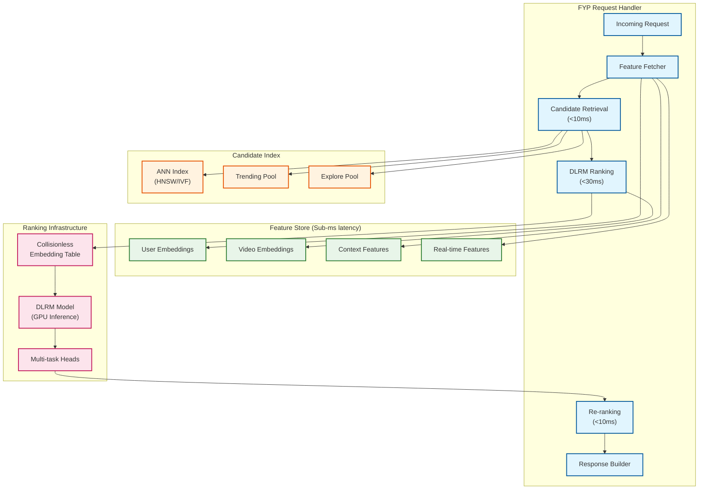
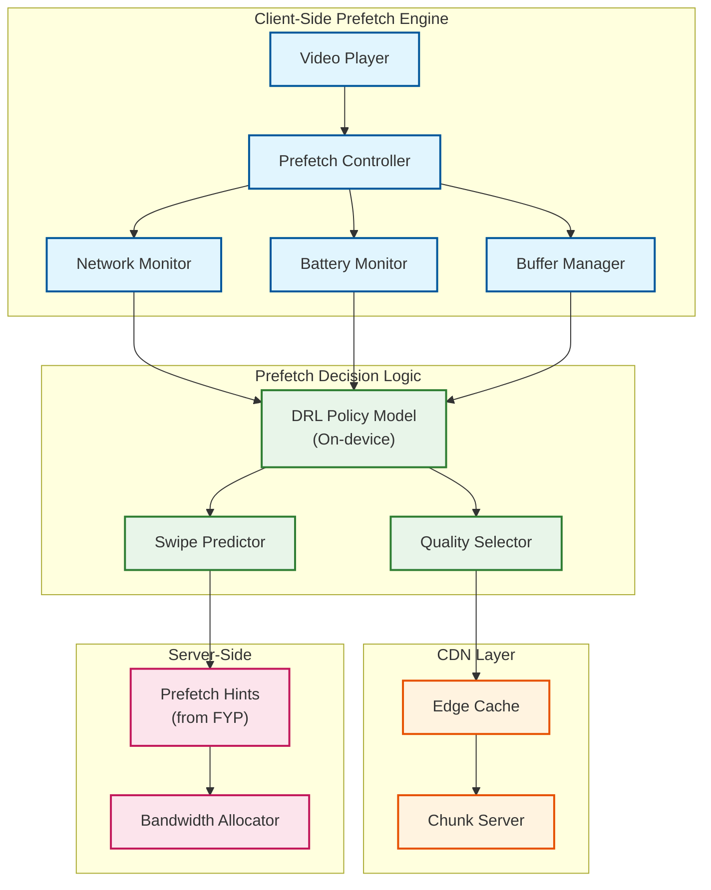
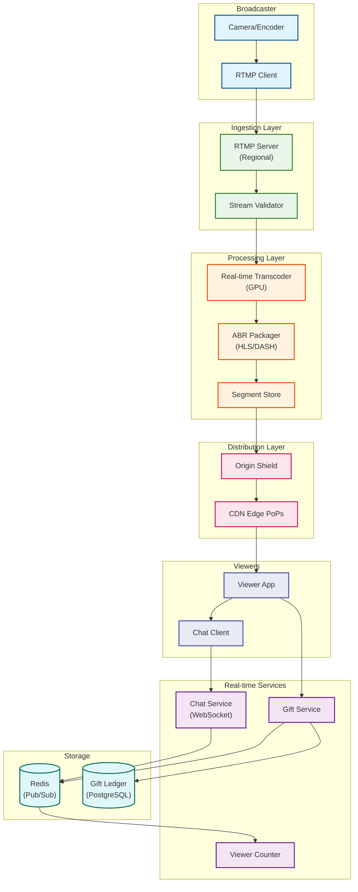

# Deep Dive & Bottlenecks

[← Back to Low-Level Design](./03-low-level-design.md) | [Next: Scalability & Reliability →](./05-scalability-and-reliability.md)

---

## Critical Component 1: For You Page (FYP) Ranking Engine

### Why This Is Critical

The FYP is TikTok's core value proposition. Unlike social-graph-based feeds, the FYP must deliver highly personalized content to each user in real-time, with a strict **50ms latency budget**. A 10ms increase in latency can measurably impact engagement metrics.

### Internal Architecture



### The 50ms Latency Budget Breakdown

| Stage | Budget | Operations |
|-------|--------|------------|
| **Request Parsing** | 1ms | Deserialize, validate |
| **Feature Fetch** | 3ms | Parallel lookups to Feature Store |
| **Candidate Retrieval** | 8ms | ANN search + merge pools |
| **Feature Extraction** | 5ms | Batch lookup video features |
| **DLRM Inference** | 25ms | GPU forward pass for 5K candidates |
| **Re-ranking** | 5ms | Diversity, exploration injection |
| **Response Building** | 3ms | Serialize, add prefetch hints |
| **Total** | **50ms** | End-to-end p99 |

### How Monolith Achieves This

1. **Collisionless Embedding Table**: Traditional hash-based embedding tables suffer from collisions that degrade quality. Monolith uses a Cuckoo HashMap that guarantees O(1) lookups without collisions.

2. **Online Training**: Models are updated in real-time based on user feedback, meaning recommendations adapt within minutes (not days).

3. **Unified Model**: Instead of separate retrieval and ranking models, Monolith uses a single architecture that serves both purposes, reducing overhead.

4. **Feature Store Optimization**: Features are pre-computed and cached with sub-millisecond access times.

### Failure Modes

| Failure | Impact | Detection | Mitigation |
|---------|--------|-----------|------------|
| Feature Store timeout | Stale recommendations | p99 latency spike | Use cached user embedding (1h TTL) |
| ANN index unavailable | No candidates | Health check failure | Fallback to trending + explore pools |
| DLRM inference timeout | Unranked content | Latency > 30ms | Return retrieval order with diversity |
| Model serving crash | Service unavailable | Pod health check | Auto-restart, load balancing |

### Graceful Degradation Strategy

```
IF feature_store.timeout:
    user_embedding = cached_embedding OR cold_start_embedding

IF ann_index.unavailable:
    candidates = trending_videos + explore_videos + recent_following

IF ranking_model.timeout:
    ranked = candidates.sort_by(
        engagement_score * recency_boost
    )  // Simple heuristic fallback

IF all_services.unavailable:
    return globally_trending_videos  // Static fallback
```

---

## Critical Component 2: Aggressive Video Prefetching System

### Why This Is Critical

TikTok's swipe-based UX demands **zero buffering** between videos. Users expect instant playback when swiping. This requires predicting which videos users will watch next and preloading them—while avoiding excessive bandwidth waste.

### Internal Architecture



### The Bandwidth vs UX Trade-off

```
┌─────────────────────────────────────────────────────────────────────────┐
│                    PREFETCH TRADE-OFF SPECTRUM                          │
├─────────────────────────────────────────────────────────────────────────┤
│                                                                         │
│  CONSERVATIVE                                        AGGRESSIVE          │
│  (Save bandwidth)                                    (Best UX)          │
│                                                                         │
│  ○────────────────────────────────●──────────────────────────○         │
│  │                                │                          │         │
│  │ • Prefetch 1 video            │ • Prefetch 3-5 videos    │         │
│  │ • 25% buffer depth            │ • 100% next, 50% others  │         │
│  │ • Low quality for far videos  │ • Adaptive quality       │         │
│  │ • ~10% bandwidth waste        │ • ~30-40% bandwidth waste│         │
│  │ • Occasional buffering        │ • Zero buffering         │         │
│                                   │                                     │
│                            TikTok's Position                            │
│                                                                         │
│  RESEARCH FINDINGS (2024-2025):                                         │
│  • Average user skips ~40% of videos within 2 seconds                  │
│  • Prefetched but unwatched data = 30-40% of total download            │
│  • Trade-off justified by engagement metrics                            │
│                                                                         │
└─────────────────────────────────────────────────────────────────────────┘
```

### Adaptive Prefetch Algorithm (APL - Lyapunov Optimization)

The algorithm balances three objectives:
1. **Playback smoothness** (minimize rebuffering)
2. **Bandwidth efficiency** (minimize waste)
3. **Battery conservation** (minimize radio usage)

```
STATE VARIABLES:
    Q(t) = buffer queue length at time t
    E(t) = energy consumption at time t
    W(t) = wasted bandwidth at time t

OPTIMIZATION OBJECTIVE:
    minimize: E[W(t)] + V * E[rebuffer_time(t)]
    subject to: Q(t) >= Q_min (minimum buffer)

LYAPUNOV FUNCTION:
    L(t) = Q(t)² + α * E(t)² + β * W(t)²

DRIFT-PLUS-PENALTY:
    Δ(t) = L(t+1) - L(t) + V * penalty(t)

ACTION AT EACH STEP:
    IF Q(t) < Q_min:
        prefetch_aggressively()  // Prioritize smoothness
    ELSE IF network_bandwidth > threshold:
        prefetch_moderately()    // Balance
    ELSE:
        prefetch_conservatively()  // Save bandwidth

PARAMETERS:
    V = user preference weight (TikTok sets high for UX)
    α = energy weight
    β = bandwidth waste weight
    Q_min = minimum buffer (typically 2 video lengths)
```

### Failure Modes

| Failure | Impact | Detection | Mitigation |
|---------|--------|-----------|------------|
| Network degradation | Buffering, quality drops | Bandwidth measurement | Reduce quality, increase buffer |
| CDN edge miss | Higher latency | Cache miss metrics | Fallback to origin, prefetch hints |
| Battery low | Aggressive drain | Battery API | Reduce prefetch depth, lower quality |
| Wrong prediction | Wasted bandwidth | Prediction accuracy | Retrain model, increase exploration |

### Metrics for Prefetch Optimization

| Metric | Target | Measurement |
|--------|--------|-------------|
| Rebuffer ratio | <1% | Rebuffer time / watch time |
| First frame delay | <150ms | Time from swipe to first frame |
| Bandwidth waste | <40% | Prefetched - watched / prefetched |
| Prediction accuracy | >70% | Correct next video / total swipes |

---

## Critical Component 3: Live Streaming Infrastructure

### Why This Is Critical

Live streaming is a major engagement and revenue driver (via gifting). It requires:
- **Ultra-low latency** (2-3 seconds glass-to-glass)
- **High concurrency** (millions of concurrent streams)
- **Real-time gift processing** (financial transactions during stream)

### Internal Architecture



### Latency Breakdown (Glass-to-Glass)

| Stage | Latency | Optimization |
|-------|---------|--------------|
| **Capture** | 16-33ms | 30-60 fps capture |
| **Encoding** | 50-100ms | Hardware encoder (H.264) |
| **Network (Upload)** | 50-200ms | Regional ingestion points |
| **Transcoding** | 100-200ms | GPU transcoding, parallel |
| **Segmentation** | 2000ms | 2-second HLS/DASH segments |
| **CDN Propagation** | 50-100ms | Edge push |
| **Network (Download)** | 50-200ms | CDN proximity |
| **Decoding/Display** | 16-33ms | Hardware decoder |
| **Total** | **2-3 seconds** | Glass-to-glass |

### Gift Processing Flow (Strong Consistency)

```
PROCEDURE process_gift(sender_id, stream_id, gift_type):
    // 1. Validate sender has sufficient balance
    balance = wallet_service.get_balance(sender_id)
    gift_cost = gift_catalog.get_cost(gift_type)

    IF balance < gift_cost:
        RETURN error("Insufficient balance")

    // 2. Begin transaction (ACID required)
    BEGIN TRANSACTION:
        // Deduct from sender
        wallet_service.deduct(sender_id, gift_cost)

        // Credit to streamer (minus platform fee)
        streamer_id = stream_service.get_host(stream_id)
        streamer_credit = gift_cost * 0.50  // 50% to creator
        wallet_service.credit(streamer_id, streamer_credit)

        // Record in gift ledger
        gift_ledger.insert(
            gift_id = generate_id(),
            sender_id = sender_id,
            receiver_id = streamer_id,
            stream_id = stream_id,
            gift_type = gift_type,
            coin_value = gift_cost,
            created_at = NOW()
        )

    COMMIT TRANSACTION

    // 3. Broadcast gift event (fire-and-forget)
    redis.publish(
        channel = "stream:" + stream_id + ":gifts",
        message = {
            sender: sender_id,
            gift_type: gift_type,
            timestamp: NOW()
        }
    )

    RETURN success(gift_id)
```

### Failure Modes

| Failure | Impact | Detection | Mitigation |
|---------|--------|-----------|------------|
| Transcoder overload | Stream quality drops | CPU/GPU utilization | Auto-scale, queue throttling |
| CDN edge failure | Regional viewers impacted | Health checks | Failover to backup CDN |
| Chat service overload | Message delays | Message queue depth | Rate limiting, priority queuing |
| Gift payment failure | Transaction incomplete | Payment gateway errors | Retry with idempotency, refund |
| Stream key leak | Unauthorized streaming | Duplicate stream detection | Invalidate key, terminate stream |

---

## Concurrency & Race Conditions

### View Count Aggregation

**Problem:** Millions of view events per second for popular videos.

**Solution:** Eventual consistency with batched updates.

```
// Client sends view event
POST /videos/{video_id}/view

// Server-side handling
PROCEDURE handle_view(video_id, user_id, watch_data):
    // 1. Write to streaming log (Kafka)
    kafka.produce("view_events", {
        video_id: video_id,
        user_id: user_id,
        watch_time_ms: watch_data.watch_time,
        timestamp: NOW()
    })

    // 2. Increment local counter in Redis (approximate)
    redis.incr("view_count:" + video_id)

    // 3. Return immediately (fire-and-forget)
    RETURN 204

// Background aggregator (runs every 5 seconds)
PROCEDURE aggregate_views():
    FOR video_id IN redis.scan("view_count:*"):
        count = redis.getset("view_count:" + video_id, 0)

        IF count > 0:
            // Batch update to PostgreSQL
            db.execute("""
                UPDATE videos
                SET view_count = view_count + $2
                WHERE video_id = $1
            """, video_id, count)

    // Full reconciliation (daily)
    // Recount from Kafka logs for accuracy
```

### Like Deduplication

**Problem:** Users might tap like multiple times; likes must be unique.

**Solution:** Database-level uniqueness constraint.

```
TABLE likes (
    user_id   VARCHAR(24),
    video_id  VARCHAR(24),
    created_at TIMESTAMP,
    PRIMARY KEY (user_id, video_id)  // Composite key ensures uniqueness
);

// Insert with conflict handling (idempotent)
INSERT INTO likes (user_id, video_id, created_at)
VALUES ($1, $2, NOW())
ON CONFLICT (user_id, video_id) DO NOTHING;
```

### Comment Reply Ordering

**Problem:** Replies must appear under correct parent; concurrent inserts can cause ordering issues.

**Solution:** Hierarchical ID scheme.

```
// Comment ID structure: {root_id}.{reply_depth}.{sequence}
// Example:
//   Root comment: "c1234"
//   First reply:  "c1234.1.001"
//   Nested reply: "c1234.2.001"

// Sorted retrieval maintains hierarchy
SELECT * FROM comments
WHERE video_id = $1
  AND comment_id LIKE $2 || '%'
ORDER BY comment_id ASC;
```

### Live Gift Race Condition

**Problem:** Two gifts sent simultaneously might overdraw balance.

**Solution:** Pessimistic locking with short timeout.

```
PROCEDURE safe_process_gift(sender_id, gift_cost):
    // Acquire lock on sender's wallet
    lock_key = "wallet_lock:" + sender_id
    acquired = redis.setnx(lock_key, "locked", ttl=5s)

    IF NOT acquired:
        // Another transaction in progress
        RETURN error("Please wait and try again")

    TRY:
        balance = wallet_service.get_balance(sender_id)

        IF balance < gift_cost:
            RETURN error("Insufficient balance")

        // Proceed with transaction
        wallet_service.deduct(sender_id, gift_cost)
        // ... rest of gift processing

    FINALLY:
        redis.del(lock_key)  // Release lock
```

---

## Bottleneck Analysis

### Bottleneck 1: ML Inference Latency at Scale

**Symptom:** FYP latency exceeds 50ms during peak traffic.

**Root Cause:**
- GPU inference can't keep up with 150K+ RPS
- Feature Store lookups become slow under load
- Memory bandwidth saturation for large embedding tables

**Mitigation Strategies:**

| Strategy | Impact | Implementation |
|----------|--------|----------------|
| **Model Quantization** | 2-4x speedup | INT8 inference, minimal quality loss |
| **Batching** | 3-5x throughput | Batch multiple users' requests |
| **Caching** | 50%+ cache hit | Cache popular video rankings |
| **Model Sharding** | Linear scaling | Distribute embedding table across GPUs |
| **Speculative Execution** | 30% latency reduction | Pre-compute for likely requests |

### Bottleneck 2: Video Transcoding Throughput

**Symptom:** Upload processing time increases during peak hours.

**Root Cause:**
- 34M uploads/day = ~400 uploads/second
- Each video needs 4-8 transcoding variants
- GPU transcoding capacity limited

**Mitigation Strategies:**

| Strategy | Impact | Implementation |
|----------|--------|----------------|
| **Priority Queuing** | Better UX for active users | High-follower creators get priority |
| **Progressive Upload** | Faster initial availability | Publish lowest quality first |
| **On-demand Transcoding** | Reduce waste | Only transcode requested qualities |
| **Edge Transcoding** | Reduce central load | Transcode at regional edge nodes |
| **Hardware Acceleration** | 5-10x throughput | NVENC/QSV dedicated encoders |

### Bottleneck 3: CDN Bandwidth During Viral Content

**Symptom:** Increased buffering and latency for specific videos.

**Root Cause:**
- Single video gets millions of requests
- Edge cache capacity exceeded
- Origin bandwidth saturated

**Mitigation Strategies:**

| Strategy | Impact | Implementation |
|----------|--------|----------------|
| **Multi-CDN Load Balancing** | 3x capacity | Distribute across Akamai, Fastly, etc. |
| **Predictive Caching** | Pre-position content | Push trending videos to more edges |
| **Quality Adaptation** | Reduce bandwidth | Lower default quality during spikes |
| **Geographic Spreading** | Even load distribution | Replicate to more edge locations |
| **P2P Assistance** | 20-30% offload | WebRTC-based peer streaming |

### Bottleneck Summary

```
┌─────────────────────────────────────────────────────────────────────────┐
│                    BOTTLENECK SEVERITY MATRIX                           │
├─────────────────────────────────────────────────────────────────────────┤
│                                                                         │
│  High Frequency │ ML Inference ● ─────────────────────── ● CDN Viral   │
│                 │ Latency                                  Content     │
│                 │                                                       │
│                 │                                                       │
│                 │         ● Transcoding                                 │
│                 │           Throughput                                  │
│                 │                                                       │
│                 │                        ● Feature                      │
│                 │                          Store                        │
│                 │                                                       │
│  Low Frequency  │                                    ● Live Stream     │
│                 │                                      Overload         │
│                 │                                                       │
│                 └─────────────────────────────────────────────────────  │
│                   Low Impact              Medium              High      │
│                                                                         │
│  LEGEND:                                                                │
│  ● = Bottleneck location                                               │
│  Top-right quadrant = Highest priority to address                      │
│                                                                         │
└─────────────────────────────────────────────────────────────────────────┘
```

---

*[← Back to Low-Level Design](./03-low-level-design.md) | [Next: Scalability & Reliability →](./05-scalability-and-reliability.md)*
