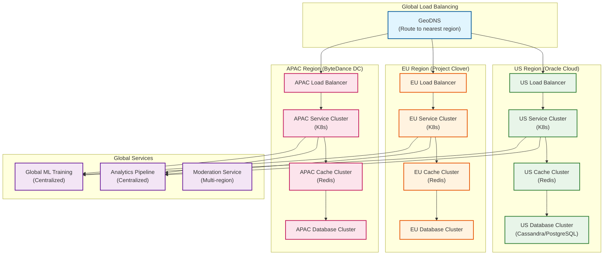
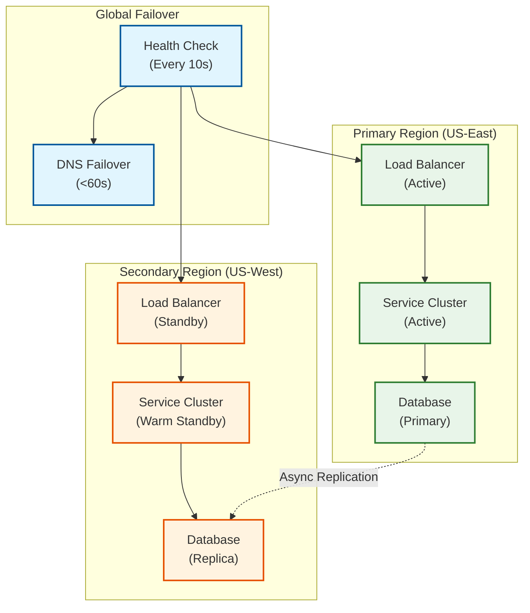

# Scalability & Reliability

[← Back to Deep Dive](./04-deep-dive-and-bottlenecks.md) | [Next: Security & Compliance →](./06-security-and-compliance.md)

---

## Scalability Strategy

### Horizontal Scaling Architecture



### Scaling Dimensions

| Dimension | Strategy | Trigger | Implementation |
|-----------|----------|---------|----------------|
| **API Servers** | Horizontal | CPU > 70% | K8s HPA, add pods |
| **ML Inference** | Horizontal + GPU | Latency > 40ms | Add GPU nodes |
| **Database (Read)** | Read Replicas | QPS > threshold | Add Cassandra replicas |
| **Database (Write)** | Sharding | Storage > 70% | Add shard nodes |
| **Cache** | Horizontal | Memory > 80% | Add Redis nodes |
| **CDN** | Edge expansion | Latency > 50ms | Add PoP locations |
| **Transcoding** | Auto-scale | Queue depth > 1000 | Add encoder workers |

### Database Scaling

#### Cassandra (Timeline Data)

```
KEYSPACE tiktok_timelines
    WITH replication = {
        'class': 'NetworkTopologyStrategy',
        'us-east': 3,
        'us-west': 3,
        'eu-west': 3,
        'apac': 3
    };

-- Sharding strategy: video_id hash determines partition
-- Each partition limited to ~100MB (Cassandra recommendation)

-- Virtual nodes for even distribution
num_tokens = 256  // Each node owns 256 token ranges

-- Read/Write consistency
READ consistency = LOCAL_QUORUM   // Fast reads from local DC
WRITE consistency = LOCAL_QUORUM  // Acknowledged by local DC
```

#### PostgreSQL (Metadata)

```
-- Sharding by user_id (hash-based)
CREATE TABLE users (
    user_id VARCHAR(24) PRIMARY KEY,
    ...
) PARTITION BY HASH(user_id);

-- 64 partitions across 8 shards
CREATE TABLE users_p0 PARTITION OF users FOR VALUES WITH (MODULUS 64, REMAINDER 0);
CREATE TABLE users_p1 PARTITION OF users FOR VALUES WITH (MODULUS 64, REMAINDER 1);
-- ... through p63

-- Shard mapping
Shard 0: partitions 0-7
Shard 1: partitions 8-15
-- ... through Shard 7
```

### Caching Strategy

```
┌─────────────────────────────────────────────────────────────────────────┐
│                    MULTI-TIER CACHING ARCHITECTURE                      │
├─────────────────────────────────────────────────────────────────────────┤
│                                                                         │
│  TIER 1: CLIENT CACHE                                                   │
│  ┌─────────────────────────────────────────────────────────────────┐   │
│  │ • SQLite/IndexedDB on device                                    │   │
│  │ • Cached FYP results (last 50 videos)                           │   │
│  │ • User preferences and session data                             │   │
│  │ • TTL: Session-based                                            │   │
│  │ • Hit rate: 80%+ for repeat requests                           │   │
│  └─────────────────────────────────────────────────────────────────┘   │
│                              ↓ Miss                                     │
│  TIER 2: EDGE CACHE (CDN)                                               │
│  ┌─────────────────────────────────────────────────────────────────┐   │
│  │ • Video files at 2,000+ edge PoPs                               │   │
│  │ • Thumbnails and static assets                                  │   │
│  │ • Popular user profiles                                         │   │
│  │ • TTL: Hours to days                                            │   │
│  │ • Hit rate: 95%+ for video content                             │   │
│  └─────────────────────────────────────────────────────────────────┘   │
│                              ↓ Miss                                     │
│  TIER 3: APPLICATION CACHE (REDIS)                                      │
│  ┌─────────────────────────────────────────────────────────────────┐   │
│  │ • FYP recommendation results                                    │   │
│  │ • User sessions and auth tokens                                 │   │
│  │ • Rate limiting counters                                        │   │
│  │ • Real-time view/like counts                                    │   │
│  │ • TTL: Seconds to minutes                                       │   │
│  │ • Hit rate: 70%+                                               │   │
│  └─────────────────────────────────────────────────────────────────┘   │
│                              ↓ Miss                                     │
│  TIER 4: FEATURE STORE CACHE                                            │
│  ┌─────────────────────────────────────────────────────────────────┐   │
│  │ • User embeddings (interest vectors)                            │   │
│  │ • Video embeddings (content vectors)                            │   │
│  │ • Real-time features (recent activity)                          │   │
│  │ • TTL: Minutes to hours                                         │   │
│  │ • Hit rate: 90%+ (embeddings rarely change)                    │   │
│  └─────────────────────────────────────────────────────────────────┘   │
│                              ↓ Miss                                     │
│  TIER 5: DATABASE (PostgreSQL/Cassandra)                                │
│  ┌─────────────────────────────────────────────────────────────────┐   │
│  │ • Source of truth                                               │   │
│  │ • Sharded and replicated                                        │   │
│  │ • Query caching at DB level                                     │   │
│  └─────────────────────────────────────────────────────────────────┘   │
│                                                                         │
└─────────────────────────────────────────────────────────────────────────┘
```

### Hot Spot Mitigation

**Problem:** Viral videos create hot spots in cache and database.

**Solutions:**

| Strategy | Implementation | Effect |
|----------|----------------|--------|
| **Request Coalescing** | Dedupe concurrent requests for same video | Reduce origin hits by 10x |
| **Replica Spreading** | Store hot content on more cache nodes | Distribute load |
| **Pre-warming** | Push trending videos to all edges | Reduce cold cache misses |
| **Separate Hot Pool** | Dedicated infrastructure for viral content | Isolate impact |
| **Rate Limiting** | Throttle excessive requests per video | Protect backend |

### Auto-Scaling Configuration

```
# Kubernetes HPA for FYP Service
apiVersion: autoscaling/v2
kind: HorizontalPodAutoscaler
metadata:
  name: fyp-service-hpa
spec:
  scaleTargetRef:
    apiVersion: apps/v1
    kind: Deployment
    name: fyp-service
  minReplicas: 100
  maxReplicas: 1000
  metrics:
  - type: Resource
    resource:
      name: cpu
      target:
        type: Utilization
        averageUtilization: 70
  - type: Pods
    pods:
      metric:
        name: fyp_latency_p99_ms
      target:
        type: AverageValue
        averageValue: "40"  # Scale up if p99 > 40ms
  behavior:
    scaleUp:
      stabilizationWindowSeconds: 30
      policies:
      - type: Percent
        value: 100  # Double capacity
        periodSeconds: 60
    scaleDown:
      stabilizationWindowSeconds: 300  # Wait 5 min before scaling down
      policies:
      - type: Percent
        value: 10
        periodSeconds: 60
```

---

## Reliability & Fault Tolerance

### Single Points of Failure (SPOF) Analysis

| Component | SPOF Risk | Mitigation |
|-----------|-----------|------------|
| **GeoDNS** | Low | Multiple DNS providers, health checks |
| **Load Balancer** | Low | Active-passive pair per region |
| **API Gateway** | Low | Horizontal scaling, stateless |
| **FYP Service** | Medium | Multi-AZ, fallback to cached/trending |
| **ML Inference** | Medium | GPU redundancy, model fallback |
| **Feature Store** | High | Redis Cluster, cross-DC replication |
| **PostgreSQL** | Medium | Primary-replica, auto-failover |
| **Cassandra** | Low | Multi-DC, tunable consistency |
| **Kafka** | Low | Multi-broker, replication factor 3 |
| **CDN** | Low | Multi-CDN, automatic failover |

### Redundancy Strategy



### Circuit Breaker Pattern

```
CIRCUIT BREAKER for ML Inference Service:

STATES:
    CLOSED: Normal operation, requests flow through
    OPEN: Failures exceeded threshold, requests fail fast
    HALF_OPEN: Testing if service recovered

THRESHOLDS:
    failure_rate_threshold = 50%
    slow_call_rate_threshold = 80%
    slow_call_duration = 40ms (for 50ms budget)
    minimum_calls = 100
    wait_duration_in_open_state = 30s
    permitted_calls_in_half_open = 10

PROCEDURE handle_request():
    IF circuit.state == OPEN:
        IF time_since_open > wait_duration:
            circuit.state = HALF_OPEN
        ELSE:
            RETURN fallback_response()  // Cached recommendations

    TRY:
        response = ml_service.get_recommendations()
        circuit.record_success()

        IF circuit.state == HALF_OPEN:
            IF success_count >= permitted_calls:
                circuit.state = CLOSED

        RETURN response

    CATCH timeout_or_error:
        circuit.record_failure()

        IF failure_rate > failure_rate_threshold:
            circuit.state = OPEN
            circuit.opened_at = NOW()

        RETURN fallback_response()

FALLBACK:
    RETURN cached_recommendations OR
           trending_videos OR
           recent_following_videos
```

### Retry Strategy

| Service | Max Retries | Backoff | Jitter | Timeout |
|---------|-------------|---------|--------|---------|
| **Feature Store** | 2 | 10ms, 50ms | ±10% | 5ms per retry |
| **ML Inference** | 1 | 20ms | ±20% | 40ms |
| **Database Read** | 3 | 10ms, 50ms, 200ms | ±20% | 100ms |
| **Database Write** | 3 | 100ms, 500ms, 2s | ±30% | 5s |
| **CDN Origin** | 2 | 100ms, 500ms | ±20% | 2s |
| **External APIs** | 3 | 1s, 5s, 15s | ±50% | 30s |

### Graceful Degradation

```
┌─────────────────────────────────────────────────────────────────────────┐
│                    DEGRADATION LEVELS                                   │
├─────────────────────────────────────────────────────────────────────────┤
│                                                                         │
│  LEVEL 0: NORMAL OPERATION                                              │
│  ┌─────────────────────────────────────────────────────────────────┐   │
│  │ • Full ML-powered FYP with real-time personalization           │   │
│  │ • All features enabled                                          │   │
│  │ • Full video quality selection                                  │   │
│  └─────────────────────────────────────────────────────────────────┘   │
│                                                                         │
│  LEVEL 1: ML DEGRADED (Triggered: ML latency > 50ms)                   │
│  ┌─────────────────────────────────────────────────────────────────┐   │
│  │ • Use cached ML recommendations (up to 1 hour old)             │   │
│  │ • Reduce candidate pool size (5K → 1K)                         │   │
│  │ • Disable real-time features, use batch features               │   │
│  └─────────────────────────────────────────────────────────────────┘   │
│                                                                         │
│  LEVEL 2: FEATURE STORE DEGRADED (Triggered: Feature Store unavailable)│
│  ┌─────────────────────────────────────────────────────────────────┐   │
│  │ • Use default user embedding (cold start model)                │   │
│  │ • Rely on content-based signals only                           │   │
│  │ • Increase trending/explore weight in FYP                      │   │
│  └─────────────────────────────────────────────────────────────────┘   │
│                                                                         │
│  LEVEL 3: DATABASE DEGRADED (Triggered: Database latency > 100ms)      │
│  ┌─────────────────────────────────────────────────────────────────┐   │
│  │ • Serve from cache only (stale content acceptable)             │   │
│  │ • Disable writes (uploads, comments, likes queued)             │   │
│  │ • Show "limited functionality" banner                          │   │
│  └─────────────────────────────────────────────────────────────────┘   │
│                                                                         │
│  LEVEL 4: REGIONAL FAILOVER (Triggered: Region unhealthy)              │
│  ┌─────────────────────────────────────────────────────────────────┐   │
│  │ • Route all traffic to healthy region                          │   │
│  │ • Accept higher latency for distant users                      │   │
│  │ • Scale up healthy region capacity                             │   │
│  └─────────────────────────────────────────────────────────────────┘   │
│                                                                         │
│  LEVEL 5: GLOBAL EMERGENCY (Triggered: Multiple regions down)          │
│  ┌─────────────────────────────────────────────────────────────────┐   │
│  │ • Static trending page (pre-generated, served from CDN)        │   │
│  │ • All interactive features disabled                            │   │
│  │ • Maintenance page with status updates                         │   │
│  └─────────────────────────────────────────────────────────────────┘   │
│                                                                         │
└─────────────────────────────────────────────────────────────────────────┘
```

---

## Disaster Recovery

### RTO/RPO Targets

| Tier | Services | RTO | RPO | Strategy |
|------|----------|-----|-----|----------|
| **Tier 1** | FYP, Video Playback | 5 min | 0 | Active-active, instant failover |
| **Tier 2** | Upload, Interactions | 15 min | 5 min | Warm standby, async replication |
| **Tier 3** | Live Streaming | 30 min | 0 | Regional failover |
| **Tier 4** | TikTok Shop | 1 hour | 0 | Cross-DC sync, strong consistency |
| **Tier 5** | Analytics, Reporting | 4 hours | 24 hours | Cold standby, daily backups |

### Backup Strategy

| Data Type | Backup Frequency | Retention | Location |
|-----------|------------------|-----------|----------|
| **User Data** | Continuous (CDC) | 30 days | Cross-region |
| **Video Metadata** | Hourly | 90 days | Cross-region |
| **Video Files** | None (replicated) | N/A | Multi-region storage |
| **Interaction Logs** | Daily | 7 days | Same region |
| **ML Models** | Per training | 30 versions | Global |
| **Configuration** | On change | 100 versions | Global |

### Multi-Region Active-Active

```
┌─────────────────────────────────────────────────────────────────────────┐
│                    MULTI-REGION DATA FLOW                               │
├─────────────────────────────────────────────────────────────────────────┤
│                                                                         │
│  US REGION                              EU REGION                       │
│  ┌─────────────────────┐               ┌─────────────────────┐         │
│  │ Users: US, LATAM    │               │ Users: EU, Africa   │         │
│  │                     │               │                     │         │
│  │ ┌───────────────┐   │               │ ┌───────────────┐   │         │
│  │ │ PostgreSQL    │◄──┼───Async───────┼─►│ PostgreSQL    │   │         │
│  │ │ (Primary)     │   │   Replication │ │ (Replica)     │   │         │
│  │ └───────────────┘   │               │ └───────────────┘   │         │
│  │                     │               │                     │         │
│  │ ┌───────────────┐   │               │ ┌───────────────┐   │         │
│  │ │ Cassandra     │◄──┼───Multi-DC────┼─►│ Cassandra     │   │         │
│  │ │ (Full copy)   │   │   Replication │ │ (Full copy)   │   │         │
│  │ └───────────────┘   │               │ └───────────────┘   │         │
│  │                     │               │                     │         │
│  │ ┌───────────────┐   │               │ ┌───────────────┐   │         │
│  │ │ Blob Storage  │◄──┼───CDN Sync────┼─►│ Blob Storage  │   │         │
│  │ └───────────────┘   │               │ └───────────────┘   │         │
│  └─────────────────────┘               └─────────────────────┘         │
│                                                                         │
│  CONFLICT RESOLUTION:                                                   │
│  • PostgreSQL: Last-writer-wins for non-critical, region-affinity      │
│  • Cassandra: Timestamp-based conflict resolution                      │
│  • User profiles: Region of residence is authoritative                 │
│  • Interactions: Merge (union of likes/comments)                       │
│                                                                         │
│  DATA RESIDENCY:                                                        │
│  • US users: Data stored in US (Oracle Cloud - Project Texas)          │
│  • EU users: Data stored in EU (Project Clover - Finland/Ireland)      │
│  • APAC users: Data stored in APAC (ByteDance Singapore/Japan)         │
│                                                                         │
└─────────────────────────────────────────────────────────────────────────┘
```

### Failover Procedure

```
PROCEDURE regional_failover(failed_region):
    // 1. Detection (automated)
    IF health_check.failed_count(failed_region) >= 3:
        alert.page_oncall("Regional failure detected: " + failed_region)

    // 2. Verification (human or automated)
    IF automated_failover_enabled:
        WAIT 30 seconds  // Avoid flapping
        IF still_unhealthy(failed_region):
            proceed_with_failover = TRUE
    ELSE:
        proceed_with_failover = oncall.approve_failover()

    IF NOT proceed_with_failover:
        RETURN

    // 3. DNS Update
    dns.remove_region(failed_region)
    dns.update_weights(healthy_regions)
    // DNS TTL = 60s, propagation ~1-2 min

    // 4. Capacity Scaling
    FOR region IN healthy_regions:
        kubernetes.scale(region, target = current * 1.5)

    // 5. Traffic Rerouting
    load_balancer.drain(failed_region)
    // Graceful connection handoff

    // 6. Data Verification
    verify_replication_lag(healthy_regions)
    IF lag > acceptable_threshold:
        alert.warn("Data lag detected, some users may see stale content")

    // 7. Status Page Update
    status_page.create_incident(
        title = "Regional service disruption",
        affected = failed_region,
        status = "Investigating"
    )

    // 8. Recovery (when region healthy)
    WHEN region.healthy(failed_region):
        sync_data(failed_region)
        verify_data_integrity()
        dns.add_region(failed_region, weight = 10%)  // Gradual
        WAIT 5 minutes
        IF no_errors:
            dns.restore_full_weight(failed_region)
            kubernetes.scale(healthy_regions, target = normal)
            status_page.resolve_incident()
```

---

*[← Back to Deep Dive](./04-deep-dive-and-bottlenecks.md) | [Next: Security & Compliance →](./06-security-and-compliance.md)*
