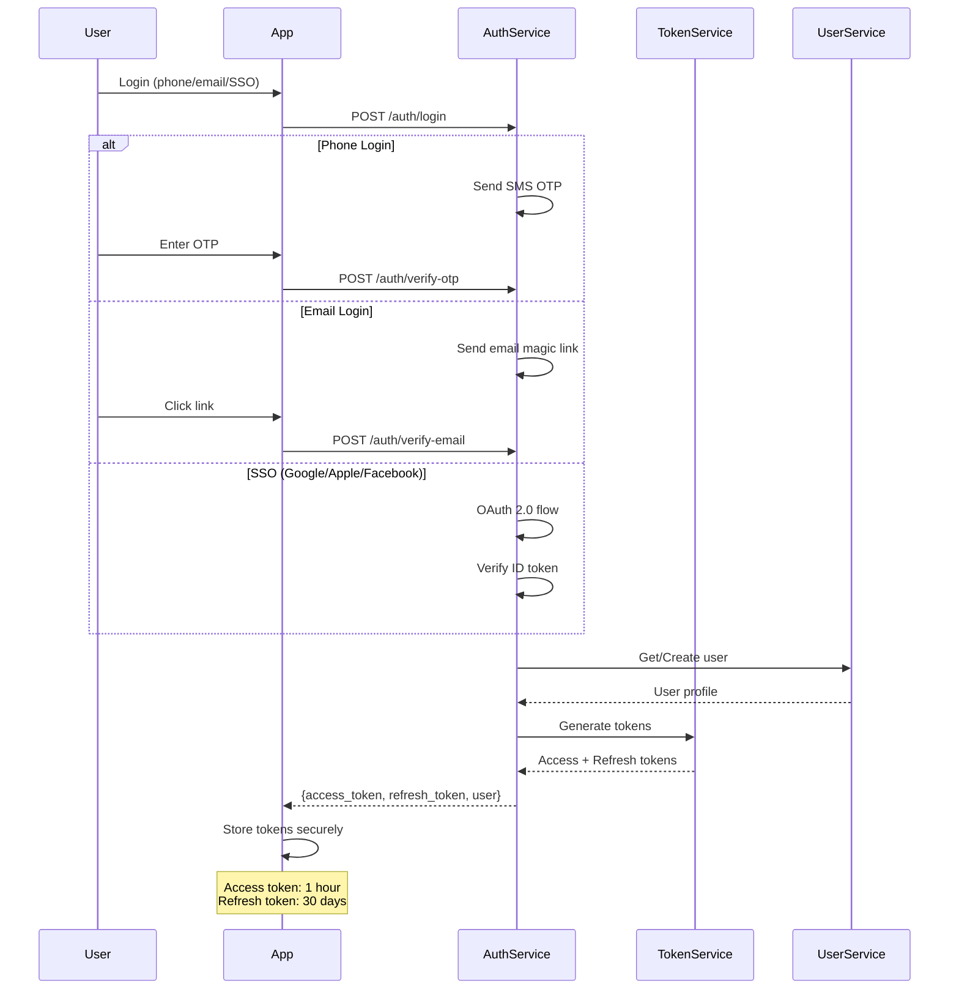
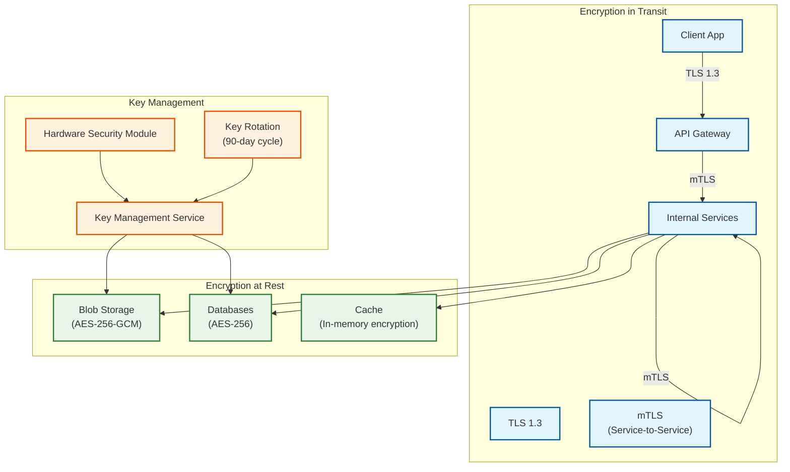
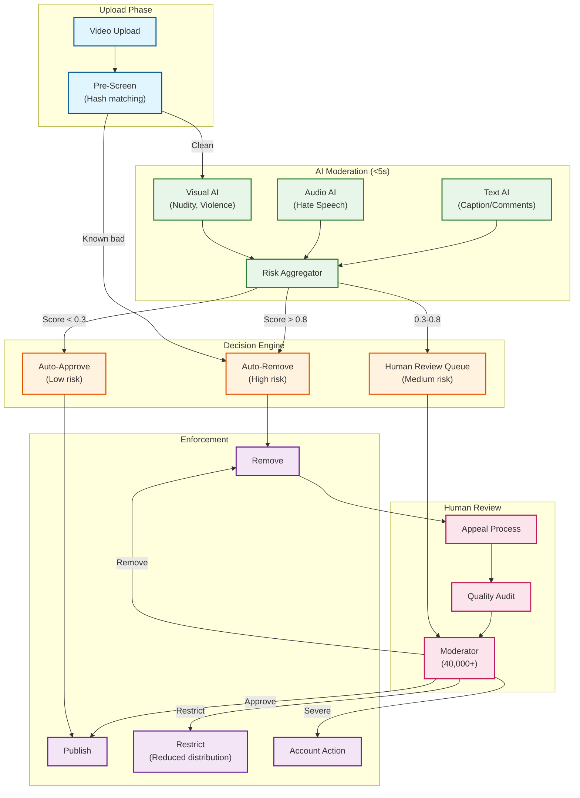

# Security & Compliance

[← Back to Scalability](./05-scalability-and-reliability.md) | [Next: Observability →](./07-observability.md)

---

## Authentication & Authorization

### Authentication Flow



### Token Structure

```
ACCESS TOKEN (JWT):
{
    "header": {
        "alg": "RS256",
        "typ": "JWT",
        "kid": "key-2024-01"
    },
    "payload": {
        "sub": "user_1234567890",       // User ID
        "iat": 1705312200,              // Issued at
        "exp": 1705315800,              // Expires (1 hour)
        "iss": "https://auth.tiktok.com",
        "aud": "tiktok-app",
        "device_id": "d_abc123",        // Device binding
        "region": "US",                 // Data residency
        "scopes": ["read", "write", "live"],
        "session_id": "sess_xyz789"
    },
    "signature": "..."
}

REFRESH TOKEN:
{
    "token_id": "rt_unique_id",
    "user_id": "user_1234567890",
    "device_id": "d_abc123",
    "created_at": timestamp,
    "expires_at": timestamp + 30 days,
    "last_used_at": timestamp,
    "revoked": false
}
-- Stored in database, not JWT
```

### Device Fingerprinting

```
DEVICE FINGERPRINT COMPONENTS:
    - Device ID (generated on first install)
    - OS version
    - App version
    - Screen resolution
    - Timezone
    - Language
    - Hardware identifiers (IDFA/GAID with consent)

RISK SCORING:
    IF device_fingerprint.new AND account.high_value:
        require_additional_verification()

    IF device_fingerprint.matches_known_fraud_pattern:
        block_or_challenge()

    IF device_fingerprint.multiple_accounts > 5:
        flag_for_review()
```

### Authorization Model (RBAC + ABAC)

```
ROLES:
    - user: Basic app access
    - creator: Upload, live streaming
    - verified_creator: Additional features, monetization
    - business: TikTok Shop, analytics
    - moderator: Content review
    - admin: Platform management

PERMISSIONS:
    videos:
        - read: View videos
        - create: Upload videos
        - delete: Delete own videos
        - moderate: Remove any video (moderator+)

    live:
        - start: Begin livestream (1000+ followers OR verified)
        - gift: Send gifts
        - receive_gifts: Receive gifts (verified_creator+)

    commerce:
        - browse: View shop
        - purchase: Buy products
        - sell: List products (business+)

ATTRIBUTE-BASED RULES:
    IF user.age < 18:
        restrict(content_type = "mature")
        disable(feature = "live_gifts")
        enforce(time_limits)

    IF user.region = "EU":
        apply(gdpr_controls)
        restrict(certain_features)

    IF video.creator.region != user.region:
        check(cross_border_restrictions)
```

---

## Data Security

### Encryption Architecture



### PII Handling

| Data Type | Classification | Storage | Encryption | Retention |
|-----------|---------------|---------|------------|-----------|
| **Phone Number** | PII | Hashed (SHA-256 + salt) | Yes | Account lifetime |
| **Email** | PII | Encrypted (AES-256) | Yes | Account lifetime |
| **IP Address** | PII | Anonymized after 30 days | Yes | 30 days full, then anonymized |
| **Location** | Sensitive PII | Coarse-grained only | Yes | Session only |
| **Biometric (Face)** | Sensitive PII | Processed on-device | N/A | Not stored |
| **Payment Info** | PCI-DSS | Tokenized (3rd party) | Yes | As required |
| **Watch History** | Behavioral | Pseudonymized | Yes | 90 days |
| **Messages** | Private | End-to-end available | Optional E2EE | 30 days default |

### Data Masking

```
PROCEDURE mask_pii_for_logs(data):
    // Phone: Show last 4 digits
    phone = "***-***-" + data.phone[-4:]

    // Email: Show first char and domain
    email = data.email[0] + "***@" + data.email.split("@")[1]

    // IP: Anonymize last octet
    ip = data.ip.rsplit(".", 1)[0] + ".0"

    // User ID: Hash for correlation
    user_id_hash = sha256(data.user_id + daily_salt)[:16]

    RETURN {phone, email, ip, user_id_hash}
```

---

## Content Moderation

### Moderation Pipeline



### AI Content Detection (2025-2026)

```
AI-GENERATED CONTENT DETECTION:

METHODS:
    1. C2PA Metadata Detection
       - Check for Coalition for Content Provenance and Authenticity markers
       - 47+ AI platforms supported (Midjourney, DALL-E, Stable Diffusion, etc.)

    2. Visual Analysis
       - Pixel-level inconsistencies
       - Unnatural lighting/shadows
       - Texture anomalies
       - Facial landmark irregularities

    3. Audio Analysis
       - Synthetic voice patterns
       - Unnatural prosody
       - Missing breath sounds
       - Lip-sync mismatches

    4. Watermarking
       - Invisible TikTok watermark for AI detection
       - Cross-platform identification

ENFORCEMENT:
    IF ai_generated AND not_labeled:
        auto_label("AI-generated")
        reduce_distribution()

    IF ai_generated AND policy_violation:
        remove()
        notify_creator()

STATS (2025):
    - 1.3B+ videos labeled as AI-generated
    - 51K+ synthetic media videos removed (6 months)
    - Projected: 120-150K annual removals
```

### Community Guidelines Enforcement

| Violation Type | Detection | Action | Appeal |
|---------------|-----------|--------|--------|
| **Nudity/Sexual** | AI visual | Auto-remove | Yes |
| **Violence/Gore** | AI visual | Auto-remove | Yes |
| **Hate Speech** | AI audio/text | Human review | Yes |
| **Misinformation** | Fact-check partners | Label + reduce | Yes |
| **Harassment** | AI + reports | Human review | Yes |
| **Minor Safety** | AI + proactive | Auto-remove | No |
| **Spam/Fake** | Behavioral AI | Auto-remove | Limited |
| **Copyright** | Fingerprinting | Remove/mute | Yes (counter-notice) |

---

## Compliance

### Regional Data Residency

```
┌─────────────────────────────────────────────────────────────────────────┐
│                    DATA RESIDENCY ARCHITECTURE                          │
├─────────────────────────────────────────────────────────────────────────┤
│                                                                         │
│  PROJECT TEXAS (United States)                                          │
│  ┌─────────────────────────────────────────────────────────────────┐   │
│  │ • Oracle Cloud Infrastructure manages US user data              │   │
│  │ • Data centers: Virginia, Oregon                                │   │
│  │ • US-based employees only for sensitive operations              │   │
│  │ • CFIUS oversight for algorithm operations                      │   │
│  │ • US-specific algorithm training (no global data sharing)       │   │
│  │ • Third-party security audits (annual)                          │   │
│  └─────────────────────────────────────────────────────────────────┘   │
│                                                                         │
│  PROJECT CLOVER (European Union)                                        │
│  ┌─────────────────────────────────────────────────────────────────┐   │
│  │ • €1.2B annual investment in European data centers              │   │
│  │ • Data centers: Finland, Ireland, Norway                        │   │
│  │ • GDPR compliant by design                                      │   │
│  │ • European Data Security Company oversight                      │   │
│  │ • Data minimization and purpose limitation                      │   │
│  │ • Right to erasure (17 GDPR) fully implemented                  │   │
│  └─────────────────────────────────────────────────────────────────┘   │
│                                                                         │
│  APAC (ByteDance Operated)                                              │
│  ┌─────────────────────────────────────────────────────────────────┐   │
│  │ • Data centers: Singapore, Japan, Indonesia                     │   │
│  │ • China data fully separated (Douyin, not TikTok)               │   │
│  │ • Regional compliance: PDPA (Singapore), APPI (Japan)           │   │
│  │ • Local data controllers per jurisdiction                       │   │
│  └─────────────────────────────────────────────────────────────────┘   │
│                                                                         │
└─────────────────────────────────────────────────────────────────────────┘
```

### GDPR Compliance

| GDPR Requirement | Implementation |
|------------------|----------------|
| **Lawful Basis** | Consent + Legitimate Interest |
| **Data Minimization** | Collect only necessary data |
| **Purpose Limitation** | Clear data use disclosures |
| **Storage Limitation** | Automated data retention policies |
| **Right to Access** | Self-service data download |
| **Right to Erasure** | Account deletion within 30 days |
| **Right to Portability** | JSON export of user data |
| **Data Protection Officer** | Designated DPO for EU |
| **Breach Notification** | 72-hour notification process |
| **Privacy by Design** | Built into development process |

### COPPA Compliance (US - Children's Privacy)

```
AGE VERIFICATION AND RESTRICTIONS:

UNDER 13:
    - Cannot create account (per COPPA)
    - If detected, account terminated
    - Parents can request data deletion

UNDER 16 (TikTok policy):
    - Private account by default
    - DMs disabled
    - Duet/Stitch disabled
    - Downloading disabled by others
    - Comments limited to friends
    - Restricted ad targeting

UNDER 18:
    - Screen time management defaults
    - Restricted from some effects
    - Live gifting disabled
    - Limited monetization features
    - Push notifications limited at night

PARENTAL CONTROLS (Family Pairing):
    - Screen time limits
    - Restricted mode
    - DM controls
    - Search restrictions
```

### Content Restrictions by Region

| Region | Restrictions | Implementation |
|--------|-------------|----------------|
| **China** | TikTok not available (Douyin instead) | Geo-block |
| **India** | Banned since 2020 | Geo-block |
| **EU** | GDPR, DSA compliance | Data residency, transparency |
| **UK** | Age assurance, OFCOM oversight | Age verification |
| **Russia** | Restricted since 2022 | Limited functionality |
| **Indonesia** | TikTok Shop banned (2023) | Feature removal |
| **US** | CFIUS oversight, potential restrictions | Project Texas |

---

## Threat Model

### Top Security Threats

| Threat | Risk Level | Attack Vector | Mitigation |
|--------|------------|---------------|------------|
| **Account Takeover** | High | Credential stuffing, SIM swap | MFA, device binding, anomaly detection |
| **Bot Networks** | High | Fake engagement, spam | Behavioral analysis, CAPTCHAs |
| **Recommendation Manipulation** | Medium | Coordinated viewing | Anomaly detection, rate limiting |
| **Data Scraping** | Medium | API abuse, automation | Rate limiting, fingerprinting |
| **DDoS** | Medium | Volumetric attacks | CDN protection, rate limiting |
| **SQL Injection** | Low | API inputs | Parameterized queries, WAF |
| **XSS** | Low | User-generated content | CSP, sanitization |
| **Insider Threat** | Medium | Employee access | Access controls, audit logs |

### Anti-Fraud Measures

```
BOT DETECTION PIPELINE:

SIGNALS:
    - Request patterns (timing, frequency)
    - Device fingerprint anomalies
    - Behavioral biometrics (swipe patterns, typing)
    - Network characteristics (VPN, proxy, datacenter)
    - Account age and activity patterns

SCORING:
    fraud_score = weighted_sum(
        request_pattern_score,
        device_score,
        behavioral_score,
        network_score,
        account_score
    )

ACTIONS:
    IF fraud_score < 0.3:
        allow()

    IF 0.3 <= fraud_score < 0.7:
        challenge(captcha)

    IF fraud_score >= 0.7:
        block()
        log_for_review()

    IF fraud_score >= 0.9:
        terminate_session()
        flag_account()
```

### DDoS Protection

```
LAYERED DDOS PROTECTION:

LAYER 1: CDN/EDGE
    - Absorb volumetric attacks at edge PoPs
    - Anycast distribution
    - Rate limiting per IP
    - Geographic blocking for attack sources

LAYER 2: API GATEWAY
    - Per-user rate limiting
    - Request validation
    - Payload size limits
    - Suspicious pattern blocking

LAYER 3: APPLICATION
    - Circuit breakers
    - Request queuing
    - Graceful degradation
    - Priority traffic shaping

LAYER 4: DATABASE
    - Connection pooling limits
    - Query timeout enforcement
    - Read replica routing
    - Cache-first serving

THRESHOLDS:
    - Global: 10M RPS capacity
    - Per IP: 100 requests/minute
    - Per User: 1000 requests/minute
    - Per Endpoint: Varies (e.g., /upload: 10/hour)
```

---

*[← Back to Scalability](./05-scalability-and-reliability.md) | [Next: Observability →](./07-observability.md)*
