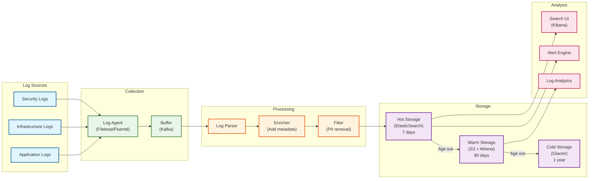

# Observability

[← Back to Security](./06-security-and-compliance.md) | [Next: Interview Guide →](./08-interview-guide.md)

---

## Metrics Strategy

### Key Metrics (USE/RED Method)

#### Utilization, Saturation, Errors (USE) - Infrastructure

| Component | Utilization | Saturation | Errors |
|-----------|-------------|------------|--------|
| **API Servers** | CPU %, Memory % | Request queue depth | 5xx rate, timeout rate |
| **ML Inference (GPU)** | GPU %, VRAM % | Inference queue depth | Model errors, OOM |
| **Database** | CPU %, Disk I/O % | Connection pool usage | Query errors, deadlocks |
| **Cache (Redis)** | Memory %, CPU % | Eviction rate | Connection errors |
| **CDN** | Bandwidth % | Cache fill rate | Origin errors, 4xx/5xx |
| **Message Queue** | Disk %, CPU % | Consumer lag | Publish failures |

#### Rate, Errors, Duration (RED) - Services

| Service | Rate (RPS) | Errors (%) | Duration (ms) |
|---------|------------|------------|---------------|
| **FYP Service** | 150K peak | <0.1% | p50: 20, p99: 50 |
| **Video Upload** | 800 peak | <1% | p50: 5s, p99: 30s |
| **Like/Comment** | 500K peak | <0.01% | p50: 10, p99: 50 |
| **Live Stream Start** | 10K peak | <0.5% | p50: 500, p99: 2s |
| **Search** | 50K peak | <0.1% | p50: 30, p99: 100 |
| **Gift Processing** | 100K peak | <0.001% | p50: 50, p99: 200 |

### Business Metrics

| Metric | Definition | Target | Alert Threshold |
|--------|------------|--------|-----------------|
| **DAU** | Daily active users | 1.12B | <1B (10% drop) |
| **Session Duration** | Avg time per session | 10 min | <8 min |
| **Videos Watched/Session** | Avg videos per session | 30 | <20 |
| **Upload Success Rate** | Successful uploads / attempts | 99.5% | <99% |
| **FYP Engagement Rate** | Interactions / impressions | 15% | <12% |
| **Live Gift Revenue** | Daily gift revenue | $X M | <0.8X |
| **Creator Retention** | Monthly active creators | 83% | <75% |

### FYP-Specific Metrics

| Metric | Description | Target | Importance |
|--------|-------------|--------|------------|
| **Inference Latency (p99)** | ML recommendation time | <50ms | Critical |
| **Watch Time per FYP Video** | Avg seconds watched | 25s | High |
| **Completion Rate** | % videos watched to end | 30% | High |
| **Rewatch Rate** | % videos replayed | 15% | Medium |
| **Exploration Success** | Engagement on explore videos | 10% | Medium |
| **Diversity Score** | Unique creators/10 videos | 8+ | Medium |
| **Cold Start Accuracy** | New user engagement (first 8 videos) | 70% | High |

---

## Dashboard Design

### Tier 1: Executive Dashboard

```
┌─────────────────────────────────────────────────────────────────────────┐
│                    TIKTOK EXECUTIVE DASHBOARD                           │
├─────────────────────────────────────────────────────────────────────────┤
│                                                                         │
│  HEALTH STATUS: 🟢 HEALTHY                    Last Updated: Just now    │
│                                                                         │
│  ┌─────────────────┐  ┌─────────────────┐  ┌─────────────────┐         │
│  │ ACTIVE USERS    │  │ VIDEOS SERVED   │  │ UPLOAD RATE     │         │
│  │                 │  │                 │  │                 │         │
│  │ 187.5M         │  │ 1.2B/hour      │  │ 394/sec        │         │
│  │ ↑ 3.2% vs LW   │  │ ↑ 5.1% vs LW   │  │ ↓ 1.2% vs LW   │         │
│  └─────────────────┘  └─────────────────┘  └─────────────────┘         │
│                                                                         │
│  ┌─────────────────┐  ┌─────────────────┐  ┌─────────────────┐         │
│  │ FYP LATENCY    │  │ ERROR RATE      │  │ LIVE STREAMS    │         │
│  │                 │  │                 │  │                 │         │
│  │ p99: 42ms      │  │ 0.05%          │  │ 850K active    │         │
│  │ 🟢 Under SLO   │  │ 🟢 Under SLO   │  │ ↑ 8% vs LW     │         │
│  └─────────────────┘  └─────────────────┘  └─────────────────┘         │
│                                                                         │
│  ┌─────────────────────────────────────────────────────────────────┐   │
│  │ ENGAGEMENT TREND (24h)                                          │   │
│  │ ███████████████████████████████████████████████████████        │   │
│  │ Sessions: 1.8B | Watch Time: 2.9B hrs | Interactions: 5.2B     │   │
│  └─────────────────────────────────────────────────────────────────┘   │
│                                                                         │
│  REGIONAL STATUS:                                                       │
│  🟢 US-East  🟢 US-West  🟢 EU-West  🟢 APAC  🟢 LATAM               │
│                                                                         │
└─────────────────────────────────────────────────────────────────────────┘
```

### Tier 2: Engineering Dashboard

```
┌─────────────────────────────────────────────────────────────────────────┐
│                    FYP SERVICE DASHBOARD                                │
├─────────────────────────────────────────────────────────────────────────┤
│                                                                         │
│  REQUEST RATE                          LATENCY DISTRIBUTION             │
│  ┌─────────────────────────────┐      ┌─────────────────────────────┐  │
│  │     150K ─────────────────  │      │ p50: 18ms ████████          │  │
│  │     100K ───────            │      │ p90: 35ms ████████████████  │  │
│  │      50K ─                  │      │ p99: 48ms █████████████████ │  │
│  │        0 ─────────────────  │      │ max: 72ms ██████████████████│  │
│  │          00:00  06:00  12:00│      └─────────────────────────────┘  │
│  └─────────────────────────────┘                                       │
│                                                                         │
│  ERROR BREAKDOWN                       CACHE PERFORMANCE                │
│  ┌─────────────────────────────┐      ┌─────────────────────────────┐  │
│  │ 5xx Errors:     0.03%       │      │ L1 (Client):    82%         │  │
│  │ Timeouts:       0.02%       │      │ L2 (Redis):     71%         │  │
│  │ ML Failures:    0.01%       │      │ L3 (Feature):   89%         │  │
│  │ Total Errors:   0.06%       │      │ Overall:        94%         │  │
│  └─────────────────────────────┘      └─────────────────────────────┘  │
│                                                                         │
│  ML INFERENCE                          FEATURE STORE                    │
│  ┌─────────────────────────────┐      ┌─────────────────────────────┐  │
│  │ Retrieval:      8ms avg     │      │ User Lookups:   2.1M/s      │  │
│  │ Ranking:        22ms avg    │      │ Video Lookups:  15M/s       │  │
│  │ Re-ranking:     6ms avg     │      │ Latency p99:    3ms         │  │
│  │ Total:          36ms avg    │      │ Error Rate:     0.001%      │  │
│  └─────────────────────────────┘      └─────────────────────────────┘  │
│                                                                         │
│  DEPLOYMENT STATUS                     CAPACITY                         │
│  ┌─────────────────────────────┐      ┌─────────────────────────────┐  │
│  │ Current Version: v3.42.1    │      │ Pods: 842/1000 (84%)       │  │
│  │ Canary: 5% on v3.43.0       │      │ CPU: 68%                   │  │
│  │ Last Deploy: 2h ago         │      │ Memory: 72%                │  │
│  │ Rollback: Ready             │      │ GPU: 75%                   │  │
│  └─────────────────────────────┘      └─────────────────────────────┘  │
│                                                                         │
└─────────────────────────────────────────────────────────────────────────┘
```

---

## Logging Strategy

### Log Levels

| Level | Usage | Retention | Example |
|-------|-------|-----------|---------|
| **ERROR** | System failures, exceptions | 90 days | "ML inference failed: timeout" |
| **WARN** | Degraded performance, retries | 30 days | "Feature store latency elevated" |
| **INFO** | Key business events | 14 days | "Video uploaded: v_123" |
| **DEBUG** | Detailed troubleshooting | 3 days | "Candidate retrieval: 4823 videos" |
| **TRACE** | Very detailed (dev only) | 1 day | "Feature vector: [0.1, 0.2, ...]" |

### Structured Log Format

```
{
    "timestamp": "2024-01-15T10:30:45.123Z",
    "level": "INFO",
    "service": "fyp-service",
    "instance": "fyp-service-7b4d5f6-abc12",
    "region": "us-east-1",
    "trace_id": "abc123def456",
    "span_id": "span789",
    "user_id_hash": "u_hash_xyz",  // Anonymized
    "event": "fyp_request_completed",
    "duration_ms": 42,
    "metadata": {
        "candidates_retrieved": 4823,
        "candidates_ranked": 4823,
        "final_count": 50,
        "exploration_ratio": 0.35,
        "cache_hit": true
    }
}
```

### What to Log

| Event | Log Level | Key Fields |
|-------|-----------|------------|
| FYP Request | INFO | duration, candidates, cache_hit |
| Video Upload | INFO | video_id, duration, size, status |
| Upload Failure | ERROR | video_id, error_code, reason |
| ML Inference | DEBUG | model_version, latency, batch_size |
| ML Fallback | WARN | fallback_reason, degradation_level |
| Authentication | INFO | auth_method, success, device_id_hash |
| Rate Limit Hit | WARN | endpoint, user_id_hash, limit |
| Gift Transaction | INFO | gift_id, amount, stream_id |
| Moderation Action | INFO | video_id, action, reason, confidence |

### Log Aggregation Pipeline



---

## Distributed Tracing

### Trace Propagation

```
HTTP HEADER PROPAGATION:
    X-Request-ID: unique request identifier
    X-Trace-ID: distributed trace identifier
    X-Span-ID: current span identifier
    X-Parent-Span-ID: parent span identifier
    X-Sampling-Decision: whether to sample this trace

CONTEXT PROPAGATION:
    - All service-to-service calls carry trace context
    - gRPC metadata for internal calls
    - HTTP headers for external calls
    - Kafka message headers for async
```

### Key Traces

#### FYP Request Trace

```
Trace: FYP Feed Request
├── api-gateway (2ms)
│   ├── auth-service (1ms)
│   └── rate-limiter (0.5ms)
├── fyp-service (42ms)
│   ├── feature-fetch (3ms)
│   │   ├── user-embedding-lookup (1ms)
│   │   └── context-features (1ms)
│   ├── candidate-retrieval (8ms)
│   │   ├── ann-search (5ms)
│   │   ├── trending-fetch (1ms)
│   │   └── merge-dedupe (2ms)
│   ├── ranking (25ms)
│   │   ├── feature-extraction (5ms)
│   │   └── dlrm-inference (20ms)
│   └── re-ranking (6ms)
│       ├── diversity-filter (3ms)
│       └── exploration-inject (3ms)
└── response-serialization (1ms)

Total: 45ms
```

#### Video Upload Trace

```
Trace: Video Upload
├── api-gateway (2ms)
├── video-service (100ms)
│   ├── validation (10ms)
│   ├── blob-upload (50ms)
│   └── metadata-write (40ms)
├── [async] transcoding-queue
│   └── transcoding-worker (15000ms)
│       ├── h264-encode (5000ms)
│       ├── av1-encode (8000ms)
│       ├── thumbnail-gen (500ms)
│       └── cdn-push (1500ms)
├── [async] moderation-queue
│   └── moderation-worker (3000ms)
│       ├── visual-ai (1000ms)
│       ├── audio-ai (800ms)
│       └── text-ai (200ms)
└── [async] feature-extraction
    └── embedding-worker (2000ms)

Sync: 102ms, Total: ~20s
```

### Sampling Strategy

| Trace Type | Sampling Rate | Rationale |
|------------|---------------|-----------|
| **Error Traces** | 100% | Always capture errors |
| **Slow Traces (>SLO)** | 100% | Debug performance issues |
| **FYP Requests** | 1% | High volume, sample sufficient |
| **Upload Requests** | 10% | Lower volume, more detail |
| **Live Streaming** | 5% | Balance detail vs overhead |
| **Payment Transactions** | 100% | Audit requirement |

---

## Alerting Strategy

### Alert Severity Levels

| Severity | Response Time | Notification | Examples |
|----------|---------------|--------------|----------|
| **P1 - Critical** | <5 min | Page on-call, escalate | Service down, data loss |
| **P2 - High** | <15 min | Page on-call | SLO breach, partial outage |
| **P3 - Medium** | <1 hour | Slack alert | Elevated errors, degradation |
| **P4 - Low** | <4 hours | Ticket | Warnings, capacity trending |

### Key Alerts

| Alert | Condition | Severity | Action |
|-------|-----------|----------|--------|
| **FYP Latency Breach** | p99 > 60ms for 5 min | P2 | Check ML inference, cache |
| **FYP Error Rate** | >1% for 2 min | P1 | Check dependencies, rollback |
| **Upload Failures** | >5% for 5 min | P2 | Check storage, transcoding |
| **CDN Error Rate** | >2% for 5 min | P2 | Check origin, failover CDN |
| **Database Latency** | p99 > 100ms for 5 min | P2 | Check queries, scale |
| **Cache Hit Rate** | <80% for 10 min | P3 | Check eviction, scale |
| **Gift Processing Failure** | Any failure | P1 | Immediate investigation |
| **Live Stream Failures** | >1% start failures | P2 | Check transcoding capacity |
| **Regional Health** | Health check fails 3x | P1 | Initiate failover |
| **ML Model Drift** | Accuracy drop >5% | P3 | Investigate, retrain |

### Alert Configuration Example

```
# FYP Latency Alert
alert: FYPLatencyHigh
expr: histogram_quantile(0.99, sum(rate(fyp_request_duration_seconds_bucket[5m])) by (le)) > 0.06
for: 5m
labels:
  severity: P2
  service: fyp-service
annotations:
  summary: "FYP p99 latency exceeds 60ms"
  description: "FYP p99 latency is {{ $value | humanizeDuration }} (threshold: 60ms)"
  runbook: "https://runbooks.internal/fyp-latency-high"
  dashboard: "https://grafana.internal/d/fyp-overview"

# Escalation Rules
route:
  receiver: slack-alerts
  routes:
    - match:
        severity: P1
      receiver: pagerduty-oncall
      continue: true
    - match:
        severity: P2
      receiver: pagerduty-oncall
      group_wait: 5m
```

### Runbook References

| Alert | Runbook | Key Steps |
|-------|---------|-----------|
| FYP Latency High | `/runbooks/fyp-latency` | 1. Check ML inference latency, 2. Check feature store, 3. Reduce candidate pool |
| Upload Failures | `/runbooks/upload-failures` | 1. Check blob storage, 2. Check transcoding queue, 3. Scale workers |
| Database Overload | `/runbooks/db-overload` | 1. Enable query caching, 2. Add read replicas, 3. Identify slow queries |
| Regional Failover | `/runbooks/regional-failover` | 1. Verify health, 2. DNS update, 3. Scale target region |

---

## SLO Dashboard

```
┌─────────────────────────────────────────────────────────────────────────┐
│                    SLO COMPLIANCE DASHBOARD                             │
├─────────────────────────────────────────────────────────────────────────┤
│                                                                         │
│  SERVICE                    SLO TARGET    CURRENT    BUDGET REMAINING   │
│  ─────────────────────────────────────────────────────────────────────  │
│  FYP Availability           99.99%        99.994%    🟢 72% (31 days)  │
│  FYP Latency p99            50ms          48ms       🟢 85% (31 days)  │
│  Upload Success Rate        99.5%         99.62%     🟢 80% (31 days)  │
│  Video Start Time           150ms         142ms      🟢 90% (31 days)  │
│  Gift Processing Success    99.99%        99.998%    🟢 95% (31 days)  │
│  Live Stream Start          99.9%         99.85%     🟡 45% (31 days)  │
│                                                                         │
│  ┌─────────────────────────────────────────────────────────────────┐   │
│  │ ERROR BUDGET BURN RATE (FYP Availability)                       │   │
│  │                                                                 │   │
│  │ 100% ─────────────────────────────────────────────────────     │   │
│  │  75% ───────────────●─────────────────────────────────────     │   │
│  │  50% ─────────────────────────────────────────────────────     │   │
│  │  25% ─────────────────────────────────────────────────────     │   │
│  │   0% ─────────────────────────────────────────────────────     │   │
│  │       Day 1                  Day 15                   Day 30   │   │
│  │                                                                 │   │
│  │  Budget consumed: 28%  |  Projected end-of-month: 35%          │   │
│  └─────────────────────────────────────────────────────────────────┘   │
│                                                                         │
│  RECENT INCIDENTS IMPACTING SLO:                                        │
│  • Jan 12: FYP latency spike (2 min) - 0.002% budget consumed          │
│  • Jan 8: Regional failover (5 min) - 0.008% budget consumed           │
│                                                                         │
└─────────────────────────────────────────────────────────────────────────┘
```

---

*[← Back to Security](./06-security-and-compliance.md) | [Next: Interview Guide →](./08-interview-guide.md)*
