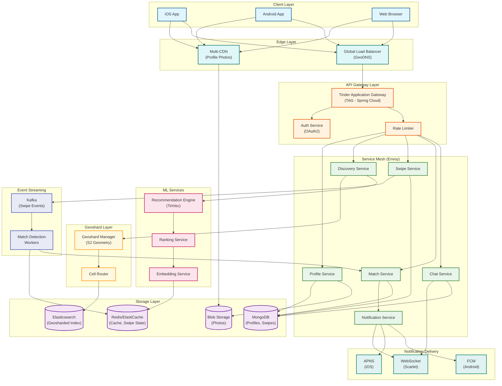

# Tinder System Design

[← Back to System Design Index](../README.md)

---

## Overview

Tinder is the world's most popular location-based dating application, serving 75 million monthly active users with a swipe-based profile discovery system. The platform's core technical challenges center on **geo-proximity matching at massive scale** using S2 Geometry (not traditional geohashing), **real-time mutual match detection** across billions of daily swipes, and a **sophisticated recommendation engine** (TinVec) that learns user preferences from behavioral signals to optimize for reciprocal attraction.

**Key Differentiators from Other Dating Apps:**
- **S2 Geosharding**: Uses Google's S2 Geometry with Hilbert curves for uniform geographic distribution (20x performance improvement over geohashing)
- **TinVec Embeddings**: ML-based user preference vectors learned from swipe history
- **Reciprocal Matching**: Algorithm optimizes for mutual attraction, not just one-sided preferences
- **Real-Time Architecture**: WebSocket-based messaging (Scarlet) replacing polling, achieving microsecond latency

---

## System Characteristics

| Characteristic | Value | Implication |
|----------------|-------|-------------|
| Traffic Pattern | Read-heavy (50:1 read-write for profiles) | Aggressive caching, CDN for photos |
| Latency Target | <100ms swipe response, <500ms profile load | Edge caching, optimized queries |
| Consistency Model | Eventual (recommendations), Strong (matches) | Hybrid storage strategy |
| Availability Target | 99.9% | Multi-region active-active |
| Data Model | Location-centric with preference overlay | Geosharded indexing |
| Scale | 75M MAU, 1.6B daily swipes | Horizontal scaling via geoshards |
| Unique Challenge | Geo-proximity + reciprocal matching | S2 Geometry + mutual preference optimization |

---

## Complexity Rating

| Component | Complexity | Reason |
|-----------|------------|--------|
| **Overall System** | High | Geo-proximity at scale + real-time matching + ML ranking |
| Geosharded Recommendation Engine | Very High | S2 Geometry, Hilbert curves, Elasticsearch sharding |
| Match Detection Pipeline | High | Real-time mutual swipe detection, race condition handling |
| Swipe Queue Generation | High | TinVec embeddings, multi-factor ranking, exploration/exploitation |
| Real-Time Messaging | Medium-High | WebSocket at scale, message ordering, delivery guarantees |
| Profile Discovery | Medium | Preference filtering, distance calculation |
| User Profile Service | Medium | Photo storage, profile validation |

---

## Quick Navigation

| Document | Description |
|----------|-------------|
| [01 - Requirements & Estimations](./01-requirements-and-estimations.md) | Functional/non-functional requirements, capacity planning |
| [02 - High-Level Design](./02-high-level-design.md) | Architecture, data flows, key decisions |
| [03 - Low-Level Design](./03-low-level-design.md) | Data models, APIs, algorithms (S2, TinVec) |
| [04 - Deep Dive & Bottlenecks](./04-deep-dive-and-bottlenecks.md) | Geosharding, match detection, recommendations |
| [05 - Scalability & Reliability](./05-scalability-and-reliability.md) | Scaling strategies, fault tolerance |
| [06 - Security & Compliance](./06-security-and-compliance.md) | Privacy, threat model, GDPR |
| [07 - Observability](./07-observability.md) | Metrics, tracing, alerting |
| [08 - Interview Guide](./08-interview-guide.md) | Pacing, trap questions, trade-offs |

---

## Core Modules

| Module | Responsibility | Key Challenge | Scale |
|--------|----------------|---------------|-------|
| **Profile Service** | User profiles, photos, preferences | Photo optimization, validation | 75M profiles |
| **Discovery Service** | Profile recommendations | Geosharding, ranking | 1.6B swipes/day |
| **Swipe Service** | Record swipe actions | High write throughput | 18,500 swipes/sec |
| **Match Service** | Detect mutual swipes | Real-time detection, race conditions | 26M matches/day |
| **Chat Service** | Real-time messaging | WebSocket at scale | Billions of messages |
| **Notification Service** | Push notifications | Multi-platform delivery | Match + message alerts |
| **Geoshard Manager** | S2 cell routing | Load balancing across cells | Geographic distribution |

---

## Architecture Overview



---

## Tinder vs Other Dating Apps

| Aspect | Tinder | Bumble | Hinge | OkCupid |
|--------|--------|--------|-------|---------|
| **Primary Mechanic** | Swipe (like/pass) | Swipe (women message first) | Like specific content | Questionnaire matching |
| **Geo Technology** | S2 Geometry (Hilbert curves) | Standard geohashing | Geohashing | Distance-based |
| **Matching Model** | Mutual swipe | Mutual swipe + time limit | Mutual like | Compatibility % |
| **Ranking Algorithm** | TinVec (activity-based) | Proprietary | Prompts engagement | Question matching |
| **Scale** | 75M MAU | 50M MAU | 23M MAU | 10M MAU |
| **Real-Time** | WebSocket (Scarlet) | WebSocket | WebSocket | Polling + WebSocket |
| **Owned By** | Match Group | Bumble Inc. | Match Group | Match Group |

---

## Key Scale Numbers

| Metric | Value | Context |
|--------|-------|---------|
| Monthly Active Users | 75 million | Global user base |
| Daily Active Users | 26.25 million | ~35% DAU/MAU ratio |
| Daily Swipes | 1.6 billion | ~18,500 swipes/sec |
| Daily Matches | 26 million | ~1.6% match rate |
| Stored Matches | 30+ billion | Historical matches in cache |
| Daily Member Actions | 2 billion | Swipes, messages, profile views |
| Paying Subscribers | 9.6 million | ~13% conversion rate |
| Microservices | 500+ | Service mesh architecture |
| API Gateway | Billions of requests/day | TAG handles all traffic |

---

## Swipe & Match Flow Overview

```
┌─────────────────────────────────────────────────────────────────────────┐
│                     TINDER SWIPE & MATCH PIPELINE                        │
├─────────────────────────────────────────────────────────────────────────┤
│                                                                         │
│  USER A SWIPES RIGHT ON USER B                                          │
│  ┌─────────────────────────────────────────────────────────────────┐   │
│  │ 1. Swipe event sent to Swipe Service                            │   │
│  │ 2. Event published to Kafka (swipe topic)                       │   │
│  │ 3. Swipe recorded in MongoDB (user_a, user_b, RIGHT, timestamp) │   │
│  └─────────────────────────────────────────────────────────────────┘   │
│                              ↓                                          │
│  MATCH DETECTION (Kafka Consumer Workers)                               │
│  ┌─────────────────────────────────────────────────────────────────┐   │
│  │ 4. Check Redis: Has B already swiped RIGHT on A?                │   │
│  │    • Key: swipes:{user_b}:{user_a}                              │   │
│  │    • If NO: Store A's swipe in Redis, exit                      │   │
│  │    • If YES: MATCH DETECTED! Continue to step 5                 │   │
│  └─────────────────────────────────────────────────────────────────┘   │
│                              ↓                                          │
│  MATCH CREATION                                                         │
│  ┌─────────────────────────────────────────────────────────────────┐   │
│  │ 5. Create match record in MongoDB                               │   │
│  │    • match_id, user_a, user_b, matched_at, conversation_id      │   │
│  │ 6. Create conversation record for chat                          │   │
│  │ 7. Publish MATCH event to Kafka                                 │   │
│  └─────────────────────────────────────────────────────────────────┘   │
│                              ↓                                          │
│  NOTIFICATION DELIVERY                                                  │
│  ┌─────────────────────────────────────────────────────────────────┐   │
│  │ 8. Notification Service receives MATCH event                    │   │
│  │ 9. Determine user online status:                                │   │
│  │    • Online → WebSocket push (instant)                          │   │
│  │    • Offline → APNS/FCM push notification                       │   │
│  │ 10. Both users see "It's a Match!" screen                       │   │
│  └─────────────────────────────────────────────────────────────────┘   │
│                                                                         │
└─────────────────────────────────────────────────────────────────────────┘
```

---

## Recommendation Pipeline Overview

```
┌─────────────────────────────────────────────────────────────────────────┐
│                  TINDER RECOMMENDATION PIPELINE                          │
├─────────────────────────────────────────────────────────────────────────┤
│                                                                         │
│  STAGE 1: GEOSHARD SELECTION (<5ms)                                     │
│  ┌─────────────────────────────────────────────────────────────────┐   │
│  │ • Get user's current location (lat, lng)                        │   │
│  │ • Convert to S2 Cell ID using Hilbert curve                     │   │
│  │ • Determine geoshard(s) within user's distance preference       │   │
│  │ • Route query to relevant Elasticsearch shards only             │   │
│  └─────────────────────────────────────────────────────────────────┘   │
│                              ↓                                          │
│  STAGE 2: CANDIDATE RETRIEVAL (<20ms)                                   │
│  ┌─────────────────────────────────────────────────────────────────┐   │
│  │ • Query Elasticsearch with filters:                             │   │
│  │   - Distance: Within user's radius preference                   │   │
│  │   - Age: Within user's age range                                │   │
│  │   - Gender: Match user's preference                             │   │
│  │   - Exclusions: Already swiped, blocked, reported               │   │
│  │ • Output: ~1,000-5,000 candidate profiles                       │   │
│  └─────────────────────────────────────────────────────────────────┘   │
│                              ↓                                          │
│  STAGE 3: ML RANKING (<30ms)                                            │
│  ┌─────────────────────────────────────────────────────────────────┐   │
│  │ • TinVec embedding similarity: user_vec ⊙ candidate_vec         │   │
│  │ • Ranking factors (weighted):                                   │   │
│  │   - User activity score (highest weight)                        │   │
│  │   - Geographic proximity                                        │   │
│  │   - Swipe selectivity (right-swipe ratio)                       │   │
│  │   - Mutual swipe history                                        │   │
│  │   - Profile completeness                                        │   │
│  │ • Output: Scored and sorted candidates                          │   │
│  └─────────────────────────────────────────────────────────────────┘   │
│                              ↓                                          │
│  STAGE 4: DIVERSITY & EXPLORATION (<5ms)                                │
│  ┌─────────────────────────────────────────────────────────────────┐   │
│  │ • Inject exploration candidates (new users, diverse profiles)   │   │
│  │ • Apply diversity rules (avoid consecutive similar profiles)    │   │
│  │ • Final batch: ~50 profiles for swipe queue                     │   │
│  └─────────────────────────────────────────────────────────────────┘   │
│                                                                         │
│  TOTAL LATENCY BUDGET: <60ms                                            │
│                                                                         │
└─────────────────────────────────────────────────────────────────────────┘
```

---

## Ranking Signals (2025-2026)

| Signal | Weight | Description |
|--------|--------|-------------|
| **User Activity** | Highest | Regular app usage → higher visibility |
| **Geographic Proximity** | Very High | Closer users prioritized for real meetups |
| **Swipe Selectivity** | High | Swiping right on everyone lowers your ranking |
| **Mutual Swipes** | High | Mutual right swipes boost both users |
| **Profile Completeness** | Medium | More photos/bio → higher ranking |
| **Recent Engagement** | Medium | Recent activity signals active user |
| **Super Likes Received** | Medium | Indicates high desirability |
| **Report/Block History** | Negative | Reports lower visibility |

**Note:** Tinder deprecated the ELO score system in 2019 in favor of the activity-based TinVec system.

---

## When to Use This Design

| Scenario | Applicable | Reason |
|----------|------------|--------|
| Location-based dating app | Yes | Core use case |
| Swipe-based discovery | Yes | Swipe queue architecture |
| Real-time matching | Yes | Match detection pipeline |
| Geo-proximity services | Yes | S2 Geosharding applies |
| Social networking with location | Partial | Geosharding applies, matching differs |
| E-commerce/marketplace | No | Different discovery model |
| Long-form content platform | No | Not swipe-based |

---

## Technology Stack Reference

| Layer | Technology Pattern | Real-World Example |
|-------|-------------------|-------------------|
| API Gateway | JVM-based gateway | TAG (Spring Cloud Gateway) |
| Service Mesh | Sidecar proxy | Envoy |
| Profile Storage | Document database | MongoDB |
| Search Index | Geosharded search | Elasticsearch |
| Caching | Distributed key-value | Redis, ElastiCache |
| Event Streaming | Distributed log | Kafka |
| Real-Time Messaging | Bidirectional socket | WebSocket (Scarlet) |
| Push Notifications | Platform-native | APNS, FCM |
| Geo Indexing | Spherical geometry | S2 Geometry |
| ML Embeddings | Vector similarity | TinVec |
| Photo Storage | Object storage | Blob Storage |
| CDN | Edge caching | Multi-CDN |

---

## Interview Readiness Checklist

Before your interview, ensure you can:

- [ ] Explain why Tinder uses S2 Geometry instead of traditional geohashing
- [ ] Walk through the swipe-to-match pipeline (swipe → Kafka → Redis check → match)
- [ ] Describe the TinVec embedding system and how it learns from swipe behavior
- [ ] Calculate capacity estimates (swipes/sec, matches/day, storage)
- [ ] Explain how geosharding improves query performance (20x)
- [ ] Handle the "mutual swipe race condition" question
- [ ] Discuss exploration vs exploitation in profile ranking
- [ ] Describe the evolution from polling to WebSocket (Project Keepalive)
- [ ] Explain fork-writing strategy for Redis cluster migrations
- [ ] Discuss privacy concerns with location data

---

## Quick Reference Card

```
┌─────────────────────────────────────────────────────────────────────────┐
│                    TINDER SYSTEM DESIGN CHEAT SHEET                      │
├─────────────────────────────────────────────────────────────────────────┤
│                                                                         │
│  SCALE NUMBERS:                                                         │
│  • 75M MAU  • 26M DAU  • 1.6B swipes/day  • 18,500 swipes/sec          │
│  • 26M matches/day  • 30B+ stored matches  • 500+ microservices        │
│                                                                         │
│  GEOSHARDING:                                                           │
│  • Technology: S2 Geometry (not geohash)                               │
│  • Why: Uniform cell distribution, no polar distortion                 │
│  • Math: Hilbert curves preserve spatial locality                      │
│  • Impact: 20x performance improvement                                 │
│                                                                         │
│  MATCH DETECTION:                                                       │
│  • Swipe → Kafka → Worker → Redis lookup → Match                       │
│  • Redis key: swipes:{user_b}:{user_a}                                 │
│  • If exists: MATCH! Create record, notify both users                  │
│                                                                         │
│  RECOMMENDATION (TinVec):                                               │
│  • Embedding: User preferences as vectors from swipe history           │
│  • Similarity: Cosine distance between user vectors                    │
│  • Ranking: Activity > Proximity > Selectivity > Mutual swipes         │
│  • No longer uses ELO score (deprecated 2019)                          │
│                                                                         │
│  REAL-TIME:                                                             │
│  • WebSocket library: Scarlet (Tinder open-source)                     │
│  • Before: Polling every 2 seconds (1s latency)                        │
│  • After: WebSocket (microsecond latency)                              │
│                                                                         │
│  KEY TRADE-OFFS:                                                        │
│  • S2 vs Geohash (chose S2 for uniformity)                             │
│  • Consistency: Eventual for recs, Strong for matches                  │
│  • Real-time vs batch ranking (chose real-time)                        │
│  • In-house gateway vs off-the-shelf (chose custom TAG)                │
│                                                                         │
│  COMMON TRAPS:                                                          │
│  • Assuming simple geohashing works at scale                           │
│  • Ignoring race conditions in mutual swipes                           │
│  • Forgetting exploration in recommendations                           │
│  • Not considering shard boundary effects                              │
│                                                                         │
└─────────────────────────────────────────────────────────────────────────┘
```

---

## Related Designs

| Design | Relevance |
|--------|-----------|
| [Recommendation Engine](../3.12-recommendation-engine/00-index.md) | ML ranking fundamentals |
| [Distributed Message Queue](../1.6-distributed-message-queue/00-index.md) | Kafka patterns |
| [Distributed LRU Cache](../1.4-distributed-lru-cache/00-index.md) | Redis caching |
| [CDN Design](../1.15-content-delivery-network-cdn/00-index.md) | Photo delivery |
| [API Gateway Design](../1.14-api-gateway-design/00-index.md) | TAG architecture |
| [Service Mesh Design](../2.11-service-mesh-design/00-index.md) | Envoy patterns |

---

## References

- [Geosharded Recommendations Part 1: Sharding Approach](https://medium.com/tinder-engineering/geosharded-recommendations-part-1-sharding-approach-d5d54e0ec77a) - Tinder Engineering
- [Geosharded Recommendations Part 2: Architecture](https://medium.com/tinder/geosharded-recommendations-part-2-architecture-3396a8a7efb) - Tinder Engineering
- [Geosharded Recommendations Part 3: Consistency](https://medium.com/tinder/geosharded-recommendations-part-3-consistency-2d2cb2f0594b) - Tinder Engineering
- [How Tinder Delivers Your Matches and Messages at Scale](https://medium.com/tinder-engineering/how-tinder-delivers-your-matches-and-messages-at-scale-504049f22ce0) - Tinder Engineering
- [Building Resiliency at Scale at Tinder with Amazon ElastiCache](https://aws.amazon.com/blogs/database/building-resiliency-at-scale-at-tinder-with-amazon-elasticache/) - AWS Database Blog
- [Matching the Scale at Tinder with Kafka](https://www.confluent.io/kafka-summit-sf18/matching-the-scale-at-tinder-with-kafka/) - Confluent
- [Taming WebSocket with Scarlet](https://medium.com/tinder/taming-websocket-with-scarlet-f01125427677) - Tinder Engineering
- [Tinder's Migration to Elasticsearch 8](https://medium.com/tinder/tinders-migration-to-elasticsearch-8-1999748ed7f4) - Tinder Engineering
- [S2 Geometry](https://s2geometry.io/) - Google
- [How Tinder Recommends to 75 Million Users](https://blog.bytebytego.com/p/how-tinder-recommends-to-75-million) - ByteByteGo

---

*Next: [Requirements & Estimations →](./01-requirements-and-estimations.md)*
