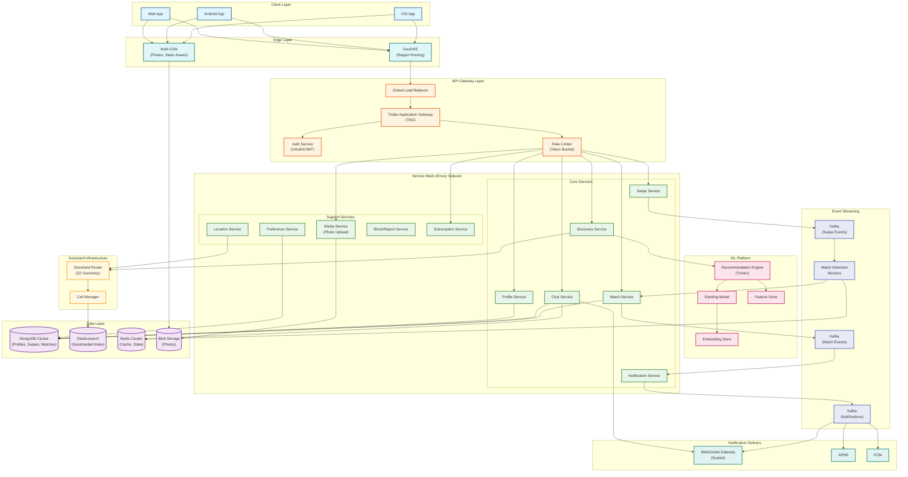
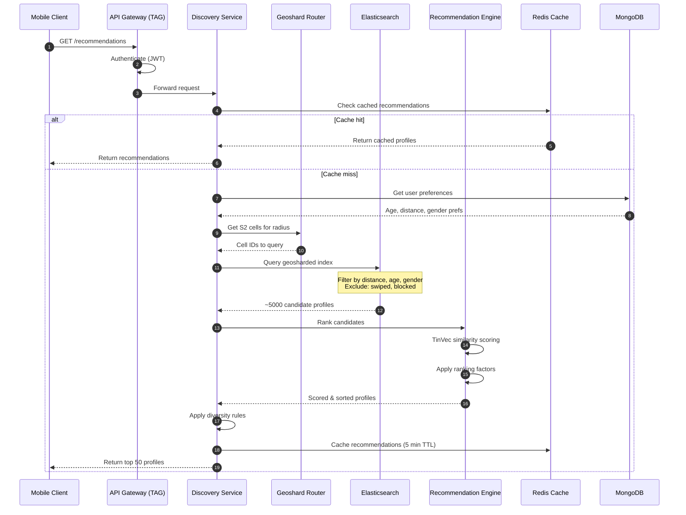
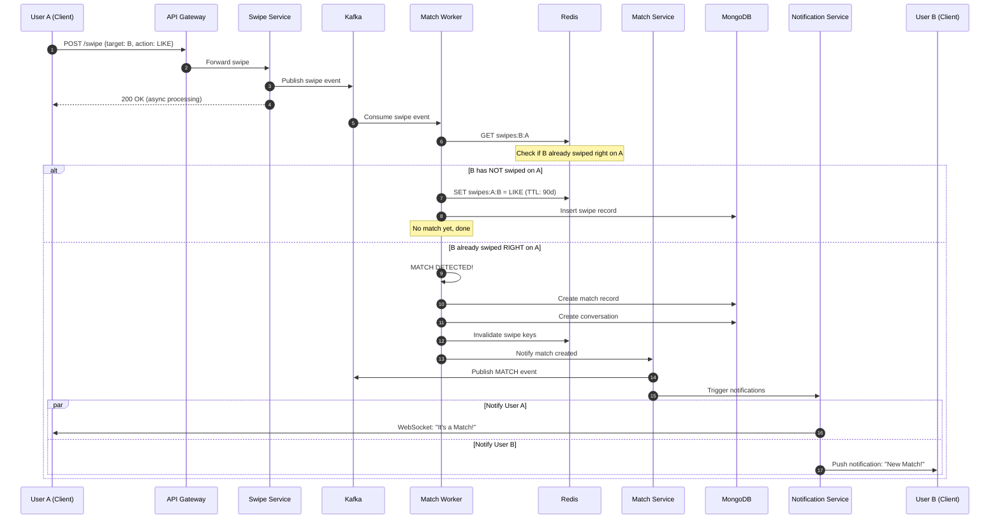
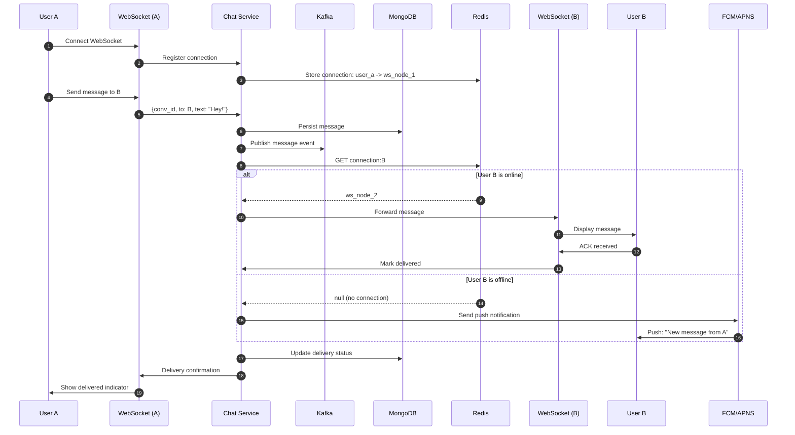
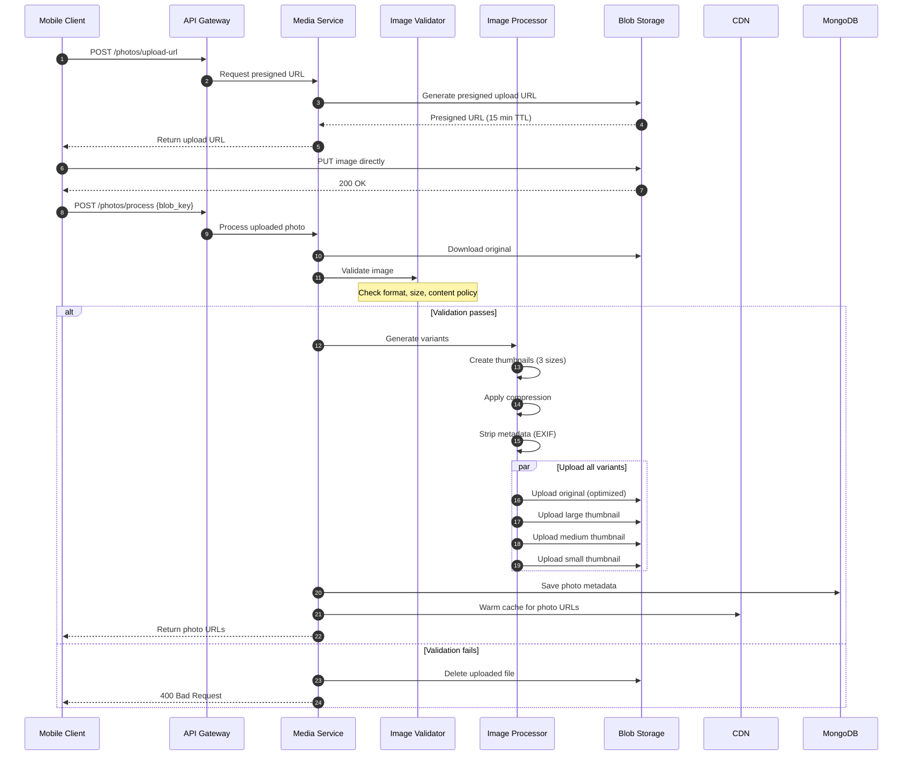
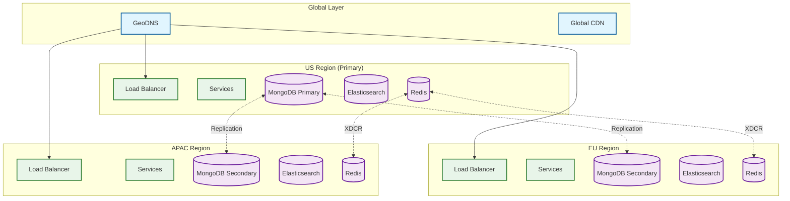

# High-Level Design

[← Back to Index](./00-index.md)

---

## System Architecture



---

## Data Flow Diagrams

### 1. Profile Discovery Flow



### 2. Swipe & Match Detection Flow



### 3. Real-Time Chat Flow



### 4. Photo Upload Flow



---

## Key Architectural Decisions

### 1. Microservices vs Monolith

| Decision | Choice | Justification |
|----------|--------|---------------|
| Architecture | **500+ Microservices** | Independent scaling, team autonomy, fault isolation |

**Trade-offs:**
- (+) Services scale independently (swipe service scales separately from chat)
- (+) Different teams own different services
- (+) Technology diversity possible per service
- (-) Operational complexity (service mesh required)
- (-) Distributed tracing essential for debugging
- (-) Network latency between services

### 2. S2 Geosharding vs Traditional Geohashing

| Approach | Pros | Cons |
|----------|------|------|
| **Geohashing** | Simple, well-understood | Uneven cells near poles, boundary issues |
| **S2 Geometry** ✓ | Uniform cells, Hilbert curves, no polar distortion | More complex math |

**Why S2:**
- Hilbert curves preserve spatial locality (nearby points → nearby cells)
- Uniform cell distribution globally (no polar distortion)
- 20x performance improvement in query throughput
- Natural load balancing across cells

### 3. Database Selection

| Data Type | Choice | Justification |
|-----------|--------|---------------|
| Profiles | **MongoDB** | Flexible schema, document model for profiles |
| Swipes | **MongoDB** | High write throughput, time-series-like data |
| Matches | **MongoDB** | Document model, relationship tracking |
| Messages | **MongoDB** | Document model, threading support |
| Search Index | **Elasticsearch** | Full-text search, geospatial queries, aggregations |
| Cache/State | **Redis** | Sub-ms latency, data structures for matching |

**Polyglot Persistence Benefits:**
- Each store optimized for its access pattern
- Elasticsearch handles complex geo queries
- Redis provides real-time state for match detection
- MongoDB provides flexible schema for evolving features

### 4. Synchronous vs Asynchronous Communication

| Flow | Choice | Justification |
|------|--------|---------------|
| Swipe Processing | **Async (Kafka)** | High throughput, decoupled match detection |
| Profile Fetch | **Sync (gRPC)** | Low latency required, <100ms SLO |
| Match Notification | **Async (Kafka + WebSocket)** | Event-driven, real-time delivery |
| Chat Messages | **Async (WebSocket)** | Real-time bidirectional |

### 5. Push vs Pull for Recommendations

| Approach | Pros | Cons |
|----------|------|------|
| **Pull (on-demand)** ✓ | Fresh recommendations, no stale data | Query latency on each request |
| Push (precomputed) | Instant response | Staleness, storage overhead |

**Hybrid Approach:**
- Pull with short caching (5-minute TTL)
- Background refresh for active users
- Invalidate cache on significant preference changes

### 6. Real-Time Messaging: Polling vs WebSocket

| Approach | Before (Polling) | After (WebSocket) |
|----------|-----------------|-------------------|
| Latency | ~1 second | Microseconds |
| Data usage | High (continuous polling) | Low (event-driven) |
| Server load | 500K requests/sec | 5K connections/node |
| Complexity | Simple | Connection management |

**WebSocket (Scarlet) chosen for:**
- Instant message delivery
- Reduced mobile data consumption
- Lower server CPU usage
- Better user experience

---

## Architecture Pattern Checklist

| Pattern | Decision | Implementation |
|---------|----------|----------------|
| Sync vs Async | **Hybrid** | Sync for reads, Async for writes |
| Event-driven vs Request-response | **Event-driven** for writes | Kafka for swipes, matches, notifications |
| Push vs Pull | **Pull with caching** | On-demand recommendations with 5-min cache |
| Stateless vs Stateful | **Stateless services** | State in Redis/MongoDB |
| Read-heavy vs Write-heavy | **Read-heavy (50:1)** | Cache-heavy architecture |
| Real-time vs Batch | **Real-time** | WebSocket, streaming Kafka |
| Edge vs Origin | **Edge for photos** | Multi-CDN, origin for API |

---

## Service Responsibilities

### Core Services

| Service | Responsibility | Dependencies | SLO |
|---------|----------------|--------------|-----|
| **Profile Service** | User profiles, preferences, photos | MongoDB, Blob Storage | 99.9%, <200ms |
| **Discovery Service** | Profile recommendations | Elasticsearch, ML Platform | 99.9%, <100ms |
| **Swipe Service** | Record swipe actions | Kafka, MongoDB | 99.99%, <100ms |
| **Match Service** | Create/query matches | MongoDB, Redis, Kafka | 99.99%, <2s |
| **Chat Service** | Real-time messaging | MongoDB, Redis, WebSocket | 99.9%, <500ms |
| **Notification Service** | Push notifications | Kafka, APNS, FCM, WebSocket | 99.9%, best-effort |

### Support Services

| Service | Responsibility | Notes |
|---------|----------------|-------|
| **Media Service** | Photo upload, processing, moderation | Presigned URLs, async processing |
| **Location Service** | Geo updates, geoshard routing | S2 cell calculation |
| **Preference Service** | Discovery filters | Age, distance, gender |
| **Block Service** | Block/report users | Affects recommendations |
| **Subscription Service** | Premium features | Boost, Super Like, Passport |

---

## Cross-Cutting Concerns

### Authentication & Authorization

```
┌─────────────────────────────────────────────────────────────────────────┐
│                      AUTHENTICATION FLOW                                 │
├─────────────────────────────────────────────────────────────────────────┤
│                                                                         │
│  1. User logs in via OAuth2 (Google/Apple/Facebook) or phone/email     │
│  2. Auth Service validates credentials, issues JWT                      │
│  3. JWT contains: user_id, subscription_tier, expiry                    │
│  4. TAG validates JWT on every request                                  │
│  5. Services receive user_id in X-User-Id header                        │
│                                                                         │
│  Token Refresh:                                                         │
│  • Access token: 1 hour expiry                                         │
│  • Refresh token: 30 days expiry                                       │
│  • Rotation on each refresh                                            │
│                                                                         │
└─────────────────────────────────────────────────────────────────────────┘
```

### Rate Limiting

| Endpoint | Limit | Window | Rationale |
|----------|-------|--------|-----------|
| GET /recommendations | 60/min | Per user | Prevent scraping |
| POST /swipe | 1000/hour | Per user | Natural usage cap |
| POST /messages | 200/hour | Per user | Spam prevention |
| POST /photos | 10/day | Per user | Resource protection |
| Auth endpoints | 5/min | Per IP | Brute force prevention |

### Service Mesh (Envoy)

```
┌─────────────────────────────────────────────────────────────────────────┐
│                      ENVOY SIDECAR RESPONSIBILITIES                      │
├─────────────────────────────────────────────────────────────────────────┤
│                                                                         │
│  Traffic Management:                                                    │
│  • Load balancing (round-robin, least-connections)                     │
│  • Circuit breaking (fail-fast on unhealthy upstreams)                 │
│  • Retries with exponential backoff                                    │
│  • Timeouts per route                                                  │
│                                                                         │
│  Security:                                                              │
│  • mTLS between all services                                           │
│  • Certificate rotation                                                │
│                                                                         │
│  Observability:                                                         │
│  • Distributed tracing (inject trace headers)                          │
│  • Metrics export (Prometheus format)                                  │
│  • Access logging                                                       │
│                                                                         │
└─────────────────────────────────────────────────────────────────────────┘
```

---

## Multi-Region Deployment



### Regional Routing Rules

| User Location | Primary Region | Failover |
|---------------|----------------|----------|
| North America | US-East | US-West → EU |
| Europe | EU-West | EU-Central → US |
| Asia-Pacific | APAC-Singapore | APAC-Sydney → US |
| South America | US-East | EU-West |

### Data Locality

| Data Type | Strategy | Rationale |
|-----------|----------|-----------|
| Profiles | Global replication | Users travel, profiles needed everywhere |
| Swipes | Regional + async sync | Local writes, eventual global visibility |
| Matches | Global replication | Both users may be in different regions |
| Messages | Regional with sync | Conversation should feel local |
| Photos | Global CDN | Edge caching handles distribution |

---

## Technology Stack Summary

| Layer | Technology | Purpose |
|-------|------------|---------|
| **Client** | iOS (Swift), Android (Kotlin), Web (React) | Mobile-first experience |
| **CDN** | Multi-vendor (CloudFront, Akamai, Fastly) | Photo delivery, static assets |
| **Load Balancer** | Cloud-native ALB | Traffic distribution |
| **API Gateway** | TAG (Spring Cloud Gateway) | Routing, auth, rate limiting |
| **Service Mesh** | Envoy | mTLS, traffic management |
| **Compute** | Containerized (ECS/Kubernetes) | Service deployment |
| **Primary DB** | MongoDB | Profiles, swipes, matches, messages |
| **Search** | Elasticsearch | Geosharded discovery index |
| **Cache** | Redis (ElastiCache) | Session, swipe state, hot data |
| **Queue** | Kafka | Event streaming |
| **Object Storage** | Cloud blob storage | Photos |
| **Real-time** | WebSocket (Scarlet) | Chat, notifications |
| **Push** | APNS, FCM | Mobile push notifications |
| **Geo** | S2 Geometry | Geospatial indexing |
| **ML** | TinVec, Custom models | Recommendations |

---

*Next: [Low-Level Design →](./03-low-level-design.md)*
