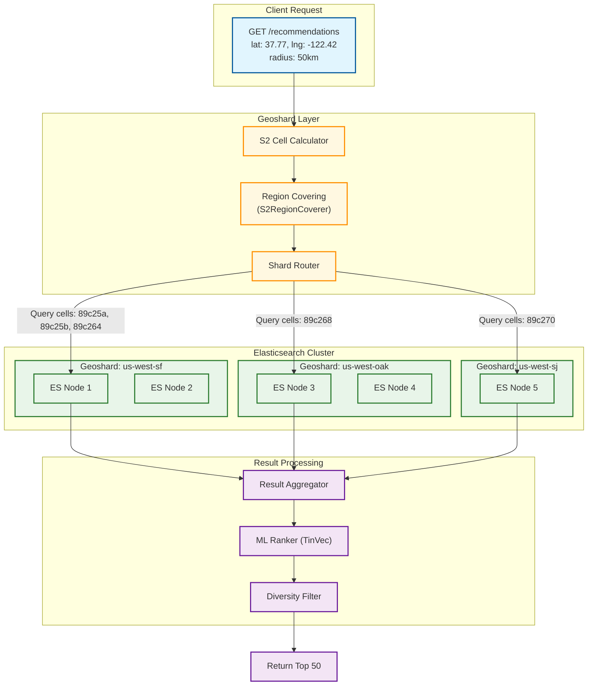
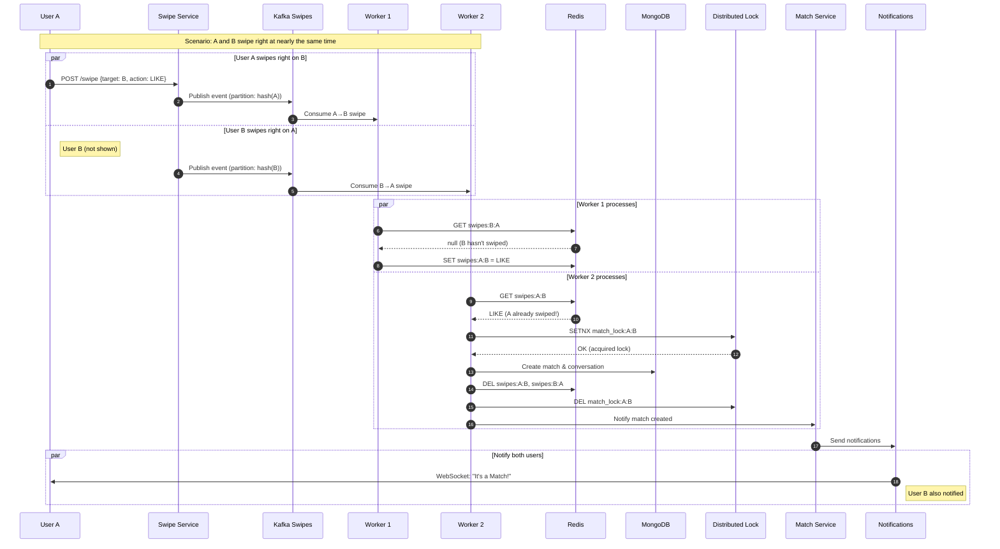
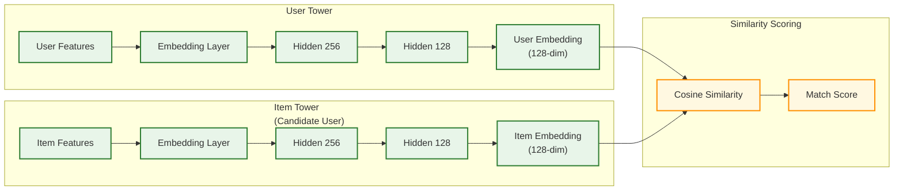

# Deep Dive & Bottlenecks

[← Back to Index](./00-index.md)

---

## Critical Component 1: Geosharded Recommendation Engine

### Why This Is Critical

The recommendation engine is Tinder's core product differentiator. It must:
- Query millions of users efficiently within geographic constraints
- Return personalized results in <100ms
- Handle 18,000+ recommendation requests per second
- Balance load across geographic regions without hotspots

### Architecture Deep Dive



### S2 Geometry: How It Works Internally

**Problem with Traditional Geohashing:**
- Uses Z-order curves (Morton codes)
- Cell sizes vary drastically near poles
- Adjacent cells may have very different hash prefixes
- Causes uneven load distribution

**S2's Solution - Hilbert Curves:**

```
Traditional Geohash (Z-curve):     S2 Geometry (Hilbert curve):

   0 1 4 5                           0 3 4 5
   2 3 6 7        vs                 1 2 7 6
   8 9 C D                           E D 8 9
   A B E F                           F C B A

Z-curve jumps across space         Hilbert curve is continuous
(0→1, then jumps to 4)             (follows connected path)
```

**Why Hilbert Curves Are Better:**
1. **Locality Preservation**: Points close on the curve are close in space
2. **Uniform Cell Sizes**: Each cell covers approximately equal area
3. **No Polar Distortion**: Works correctly at all latitudes
4. **Better Cache Performance**: Nearby queries hit nearby shards

### Geoshard Configuration

```
┌─────────────────────────────────────────────────────────────────────────┐
│                     GEOSHARD HIERARCHY EXAMPLE                           │
├─────────────────────────────────────────────────────────────────────────┤
│                                                                         │
│  Level 0-2: Continental regions (not used directly)                     │
│  Level 3-4: Countries                                                   │
│  Level 5-6: States/Provinces  ← GEOSHARD LEVEL                         │
│  Level 7-10: Cities                                                     │
│  Level 11-14: Neighborhoods                                             │
│  Level 15-30: Street/Building level                                     │
│                                                                         │
│  Tinder uses Level 12 for user indexing:                                │
│  • ~3.3 km² per cell at equator                                        │
│  • Provides good granularity for radius queries                        │
│  • Aggregates to Level 6 for shard routing (~21,000 km² per shard)     │
│                                                                         │
│  Example: San Francisco Bay Area                                        │
│  • Level 6 cells: 89c25, 89c26, 89c27 (3 geoshards)                    │
│  • Level 12 cells within 89c25: 89c250, 89c251, ... (4096 cells)       │
│  • Each Level 12 cell contains ~1000-5000 active users in dense areas  │
│                                                                         │
└─────────────────────────────────────────────────────────────────────────┘
```

### Failure Modes & Mitigations

| Failure Mode | Impact | Detection | Mitigation |
|--------------|--------|-----------|------------|
| **Elasticsearch shard unavailable** | Incomplete results for a region | Health checks, circuit breaker | Fallback to neighbor shards, degrade gracefully |
| **S2 cell calculator crash** | No recommendations | Service health monitoring | Stateless service, auto-restart, multiple instances |
| **Hot geoshard (NYC, LA)** | Increased latency, timeouts | Latency metrics, queue depth | Horizontal scaling, cell splitting |
| **Stale index data** | Users see blocked/matched profiles | Async index validation | Background refresh, stronger consistency for exclusions |
| **Embedding service timeout** | Fallback to rule-based ranking | Timeout monitoring | Pre-cached embeddings, rule-based fallback |

### Performance Optimization

**1. Query Routing Optimization:**
```
// Bad: Query all shards
SELECT * FROM users WHERE distance < 50km

// Good: Route to specific geoshards only
cells = S2.getCovering(user_location, 50km)
shards = cells.map(c => c.parent(GEOSHARD_LEVEL))
parallel_query(shards.unique())
```

**2. Embedding Pre-computation:**
- Compute TinVec embeddings daily for all active users
- Store in Elasticsearch as dense_vector field
- Use ANN (Approximate Nearest Neighbor) for similarity search

**3. Index Partitioning Strategy:**
- Shard by geoshard_id (geographic routing)
- Replicate hot geoshards 2-3x more than cold ones
- Time-based refresh: Hot data (active users) refreshed every 30 seconds

---

## Critical Component 2: Real-Time Match Detection

### Why This Is Critical

Match detection is the core value proposition - users expect instant notification when a match occurs. System must:
- Process 18,500 swipes/second
- Detect matches in <2 seconds end-to-end
- Never lose a match (100% accuracy required)
- Handle race conditions when both users swipe simultaneously

### Architecture Deep Dive



### Race Condition Handling

**Scenario: Both users swipe right within milliseconds**

```
Time T0: User A swipes right on B
Time T0+5ms: User B swipes right on A
Time T0+10ms: Worker 1 checks Redis - no reverse swipe yet
Time T0+15ms: Worker 2 checks Redis - A's swipe exists!
Time T0+20ms: Worker 1 stores A→B in Redis
Time T0+25ms: Worker 2 acquires lock, creates match
Time T0+30ms: Worker 2 deletes both Redis keys
```

**Solution: Atomic Check-and-Lock Pattern**

```
ALGORITHM: AtomicMatchDetection(swipe)

// Step 1: Check reverse swipe
reverse_key = "swipes:{swiped}:{swiper}"
reverse_exists = Redis.GET(reverse_key)

if reverse_exists == null:
    // No reverse swipe, just store this one
    forward_key = "swipes:{swiper}:{swiped}"
    Redis.SET(forward_key, action, TTL=90days)
    return null

// Step 2: Reverse swipe exists - try to create match
// Use sorted pair for consistent lock key
lock_key = "match_lock:" + SortedPair(swiper, swiped)

// SETNX ensures only one worker proceeds
if Redis.SETNX(lock_key, "1", EX=5):
    try:
        // Double-check match doesn't exist (idempotency)
        if MongoDB.matches.exists(user_a=min, user_b=max):
            return existing_match

        // Create match atomically
        match = CreateMatchAndConversation(swiper, swiped)

        // Clean up Redis state
        Redis.DEL(reverse_key, forward_key)

        return match
    finally:
        Redis.DEL(lock_key)
else:
    // Another worker is handling this
    // Could retry after short delay, or just return
    return null
```

### Failure Modes & Mitigations

| Failure Mode | Impact | Detection | Mitigation |
|--------------|--------|-----------|------------|
| **Kafka consumer lag** | Delayed match detection | Consumer lag metrics | Auto-scale consumers, partition rebalancing |
| **Redis unavailable** | Cannot detect matches | Health checks | Fallback to MongoDB-only (slower), circuit breaker |
| **MongoDB write failure** | Lost match record | Write acknowledgment | Retry with backoff, dead letter queue |
| **Duplicate match creation** | Data inconsistency | Unique constraints | Distributed lock, idempotent create |
| **Notification delivery failure** | User doesn't see match | Delivery confirmation | Retry queue, multi-channel delivery |

### Kafka Partition Strategy

```
┌─────────────────────────────────────────────────────────────────────────┐
│                     KAFKA PARTITION STRATEGY                             │
├─────────────────────────────────────────────────────────────────────────┤
│                                                                         │
│  Topic: swipes                                                          │
│  Partitions: 100 (adjustable based on throughput)                       │
│  Partition Key: swiper_id                                               │
│                                                                         │
│  Why partition by swiper_id:                                            │
│  • All swipes from one user go to same partition                        │
│  • Preserves ordering for that user's swipes                            │
│  • Allows parallel processing across different users                    │
│                                                                         │
│  Consumer Group: match-detection-workers                                │
│  Consumers: 20 instances (5 partitions per consumer)                    │
│                                                                         │
│  Alternative: Partition by sorted_pair(swiper, swiped)                  │
│  • Ensures both swipes go to same partition                             │
│  • Simpler match detection (no distributed lock needed)                 │
│  • Drawback: Harder to scale, potential hotspots                        │
│                                                                         │
└─────────────────────────────────────────────────────────────────────────┘
```

---

## Critical Component 3: Swipe Queue Generation

### Why This Is Critical

The swipe queue directly impacts:
- User engagement (good profiles = more swipes = more engagement)
- Match success rate (better matching = better retention)
- Fairness (all users should get visibility)
- Business metrics (conversion to premium features)

### How TinVec Works



### Feature Engineering

```
┌─────────────────────────────────────────────────────────────────────────┐
│                     TINVEC FEATURE CATEGORIES                            │
├─────────────────────────────────────────────────────────────────────────┤
│                                                                         │
│  EXPLICIT FEATURES (from profile):                                      │
│  • Age (normalized)                                                     │
│  • Gender (one-hot encoded)                                             │
│  • Location (geoshard embedding)                                        │
│  • Job category (embedded)                                              │
│  • Education level (ordinal)                                            │
│  • Profile completeness score                                           │
│                                                                         │
│  BEHAVIORAL FEATURES (from swipe history):                              │
│  • Swipe ratio (right swipes / total swipes)                           │
│  • Average session length                                               │
│  • Swipes per session                                                   │
│  • Time between swipes (engagement speed)                               │
│  • Match rate (matches / right swipes)                                  │
│  • Response rate (messages sent / matches)                              │
│                                                                         │
│  PREFERENCE FEATURES (learned from positive swipes):                    │
│  • Preferred age distribution                                           │
│  • Preferred distance distribution                                      │
│  • Preferred profile characteristics                                    │
│  • Bio word embeddings (Word2Vec on liked profiles)                     │
│                                                                         │
│  TEMPORAL FEATURES:                                                     │
│  • Active hours distribution (24-dim)                                   │
│  • Day of week preference (7-dim)                                       │
│  • Account age                                                          │
│  • Days since last active                                               │
│                                                                         │
│  INTERACTION FEATURES (for reciprocal prediction):                      │
│  • Historical success patterns with similar users                       │
│  • Communication style similarity                                       │
│  • Activity pattern overlap                                             │
│                                                                         │
└─────────────────────────────────────────────────────────────────────────┘
```

### Exploration vs Exploitation Trade-off

**The Dilemma:**
- **Exploitation**: Show profiles the user is most likely to swipe right on
  - Higher immediate engagement
  - Risk: Filter bubbles, unfairness to new users
- **Exploration**: Show diverse profiles outside typical preferences
  - Better long-term learning
  - Risk: Lower immediate engagement, user frustration

**Tinder's Approach: Epsilon-Greedy with Fairness**

```
function GenerateSwipeQueue(user):
    candidates = GetRankedCandidates(user)

    exploitation_count = 40  // 80%
    exploration_count = 10   // 20%

    exploitation_candidates = candidates[:exploitation_count]

    exploration_candidates = []
    // Fairness exploration: Users with low visibility
    exploration_candidates += GetLowVisibilityUsers(5)
    // New user exploration: Users registered < 7 days
    exploration_candidates += GetNewUsers(3)
    // Diversity exploration: Outside typical preferences
    exploration_candidates += GetDiverseCandidates(user, 2)

    // Interleave exploration throughout the queue
    final_queue = Interleave(exploitation_candidates, exploration_candidates)

    return final_queue
```

### Ranking Signal Weights (Estimated)

| Signal | Weight | Update Frequency | Rationale |
|--------|--------|------------------|-----------|
| Activity Score | 0.30 | Real-time | Active users more likely to match |
| TinVec Similarity | 0.25 | Daily (embedding refresh) | ML-learned preferences |
| Geographic Proximity | 0.20 | Per request | Closer = more likely to meet |
| Selectivity Score | 0.10 | Daily | Selective users are more desirable |
| Mutual Affinity | 0.10 | Daily | Historical match patterns |
| Profile Completeness | 0.05 | On profile change | Complete profiles convert better |

---

## Bottleneck Analysis

### Bottleneck 1: Hot Geoshards

**Problem:**
- Dense urban areas (NYC, LA, London) have 10-100x more users than rural areas
- Causes uneven load distribution
- Single geoshard becomes bottleneck

**Detection:**
```
// Metrics to monitor
shard_query_latency_p99 by geoshard_id
shard_doc_count by geoshard_id
shard_search_rate by geoshard_id
```

**Mitigation Strategies:**

```
┌─────────────────────────────────────────────────────────────────────────┐
│                     HOT GEOSHARD MITIGATION                              │
├─────────────────────────────────────────────────────────────────────────┤
│                                                                         │
│  Strategy 1: Dynamic Shard Splitting                                    │
│  • When shard exceeds threshold (e.g., 500K users), split into 4       │
│  • Automated based on metrics                                           │
│  • Requires re-indexing affected users                                  │
│                                                                         │
│  Before:                      After:                                    │
│  ┌─────────┐                  ┌───┬───┐                                 │
│  │  NYC    │     →            │NE │NW │                                 │
│  │ 2M users│                  ├───┼───┤                                 │
│  └─────────┘                  │SE │SW │                                 │
│                               └───┴───┘                                 │
│                                                                         │
│  Strategy 2: Read Replica Scaling                                       │
│  • Add more ES replicas for hot shards                                 │
│  • Distributes read load                                                │
│  • Doesn't help write load                                              │
│                                                                         │
│  Strategy 3: Tiered Caching                                             │
│  • L1: Per-request cache (user's recommendations)                      │
│  • L2: Geoshard-level cache (hot profiles)                             │
│  • L3: Global cache (celebrity profiles)                               │
│                                                                         │
│  Strategy 4: Query Routing Optimization                                 │
│  • Route queries to least-loaded replica                               │
│  • Circuit breaker on overloaded shards                                │
│  • Graceful degradation (return partial results)                       │
│                                                                         │
└─────────────────────────────────────────────────────────────────────────┘
```

### Bottleneck 2: Swipe Velocity Spikes

**Problem:**
- 3x peak traffic during evening hours (6-10 PM local time)
- Sudden spikes during events (Super Bowl, New Year's)
- Kafka consumers can't keep up → match detection delays

**Detection:**
```
kafka_consumer_lag > 10000 for 1 minute
match_detection_latency_p99 > 5s
swipe_processing_rate < expected_rate * 0.9
```

**Mitigation:**

```
// Auto-scaling based on consumer lag
if kafka_consumer_lag > HIGH_THRESHOLD:
    scale_up_consumers(2x)
    alert("High swipe lag - scaling up")

if kafka_consumer_lag < LOW_THRESHOLD for 5 minutes:
    scale_down_consumers()

// Backpressure mechanism
function ProcessSwipe(event):
    if queue_depth > MAX_QUEUE_DEPTH:
        // Delay response slightly to reduce client retry rate
        sleep(random(100, 500)ms)

    // Process with timeout
    result = ProcessWithTimeout(event, timeout=1s)

    if result.timeout:
        // Publish to retry topic
        Kafka.publish("swipes-retry", event)
```

### Bottleneck 3: Match Notification Storms

**Problem:**
- When a popular user comes online, they may generate hundreds of matches quickly
- Each match triggers notifications to two users
- Can overwhelm notification infrastructure

**Detection:**
```
notification_queue_depth > 100000
notification_send_rate > max_rate * 1.5
apns_error_rate > 1%
```

**Mitigation:**

```
// Rate limiting per user
function SendMatchNotification(match):
    user_a_rate = RateLimiter.check("notif:match:" + match.user_a_id)
    user_b_rate = RateLimiter.check("notif:match:" + match.user_b_id)

    // If either user is rate-limited, delay notification
    if user_a_rate.limited or user_b_rate.limited:
        // Queue for delayed delivery
        DelayedQueue.push(match, delay=5min)
        return

    // Send immediately
    SendPushNotification(match.user_a_id, "New Match!")
    SendPushNotification(match.user_b_id, "New Match!")

// Batching for notification delivery
function BatchNotifications():
    batch = CollectNotifications(max=100, timeout=100ms)

    // Send in batch to APNS/FCM
    APNS.sendBatch(batch.ios)
    FCM.sendBatch(batch.android)
```

### Bottleneck 4: Photo CDN Origin Load

**Problem:**
- 50 GB/s peak bandwidth for photo delivery
- CDN cache misses hit origin
- Origin can become bottleneck for new/updated photos

**Mitigation:**

```
┌─────────────────────────────────────────────────────────────────────────┐
│                     CDN OPTIMIZATION STRATEGY                            │
├─────────────────────────────────────────────────────────────────────────┤
│                                                                         │
│  1. Multi-Tier Caching:                                                 │
│     Client Cache (disk) → CDN Edge → CDN Shield → Origin                │
│                                                                         │
│  2. Pre-warming:                                                        │
│     • When photo uploaded, push to CDN edges proactively                │
│     • Especially for popular geoshards                                  │
│                                                                         │
│  3. Blur Hash Placeholders:                                             │
│     • Store 20-byte blur hash with profile                             │
│     • Render placeholder instantly                                      │
│     • Photo loads progressively                                         │
│                                                                         │
│  4. Smart Image Sizing:                                                 │
│     • Serve different sizes based on device/viewport                    │
│     • small: 100px (thumbnails, lists)                                 │
│     • medium: 400px (grid view)                                        │
│     • large: 800px (full card)                                         │
│     • original: only for zoom/download                                  │
│                                                                         │
│  5. Format Optimization:                                                │
│     • WebP for Android (30% smaller)                                   │
│     • HEIC for iOS (50% smaller)                                       │
│     • JPEG fallback for web                                            │
│                                                                         │
└─────────────────────────────────────────────────────────────────────────┘
```

---

## Concurrency & Race Conditions

### Race Condition 1: Simultaneous Mutual Swipes

**Scenario:** User A and B swipe right on each other at the same millisecond.

**Problem:** Without proper handling, could create duplicate matches or lose one.

**Solution:** Distributed lock with canonical key ordering (covered in Match Detection section).

### Race Condition 2: Swipe While Being Blocked

**Scenario:** User A swipes right on B. Simultaneously, B blocks A.

**Timeline:**
```
T0: A initiates swipe on B
T1: B blocks A (processed faster)
T2: A's swipe is processed
```

**Problem:** A's swipe might succeed even though B blocked them.

**Solution:**
```
function ProcessSwipe(swipe):
    // Check block status before recording
    if IsBlocked(swipe.swiper_id, swipe.swiped_id):
        return Error("Cannot swipe on blocked user")

    // Also check reverse (if swiper is blocked by swiped)
    if IsBlocked(swipe.swiped_id, swipe.swiper_id):
        return Error("You are blocked by this user")

    // Proceed with swipe
    RecordSwipe(swipe)
```

### Race Condition 3: Profile Update During Recommendation

**Scenario:** User updates preferences while recommendation query is in progress.

**Problem:** May return profiles that no longer match new preferences.

**Solution:**
- Accept eventual consistency for recommendations
- Recommendations cached for short TTL (5 minutes)
- Major preference changes invalidate cache immediately
- Client filters results locally as additional check

### Locking Strategy

| Operation | Lock Type | Granularity | Duration |
|-----------|-----------|-------------|----------|
| Match creation | Pessimistic (Redis SETNX) | Per user pair | <100ms |
| Profile update | Optimistic (version field) | Per user | N/A |
| Photo upload | Pessimistic (user-level) | Per user | Until upload complete |
| Preference update | Optimistic | Per user | N/A |
| Block/Unblock | Pessimistic | Per user pair | <50ms |

---

*Next: [Scalability & Reliability →](./05-scalability-and-reliability.md)*
