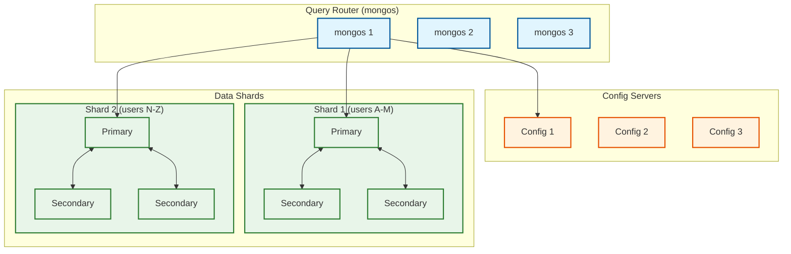
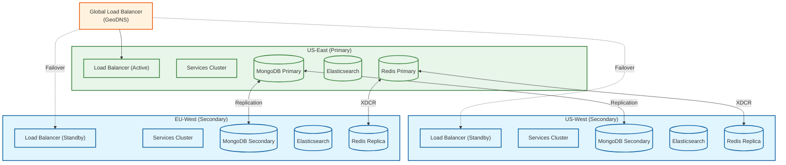
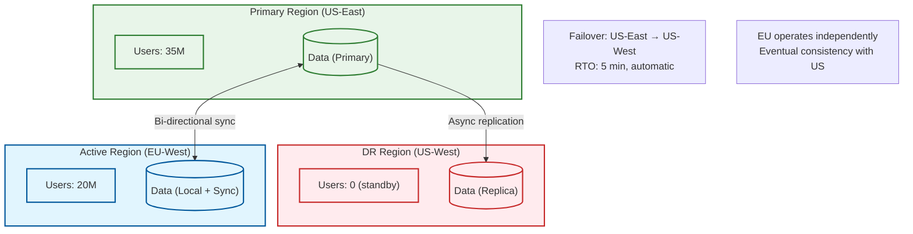

# Scalability & Reliability

[← Back to Index](./00-index.md)

---

## Scalability Strategy

### Horizontal vs Vertical Scaling Decisions

| Component | Strategy | Rationale |
|-----------|----------|-----------|
| API Gateway (TAG) | Horizontal | Stateless, CPU-bound, predictable load patterns |
| Profile Service | Horizontal | Stateless, read-heavy, scales with MAU |
| Discovery Service | Horizontal | CPU-intensive (ranking), scales with request rate |
| Swipe Service | Horizontal | Write-heavy, scales with swipe rate |
| Match Workers | Horizontal | Kafka consumers, scales with partition count |
| Chat Service | Horizontal | Connection-bound, scales with concurrent users |
| MongoDB | Horizontal (sharding) | Data volume exceeds single node capacity |
| Elasticsearch | Horizontal (geoshards) | Query throughput, geographic distribution |
| Redis | Horizontal (cluster) | Memory capacity, throughput |
| Kafka | Horizontal (partitions) | Throughput, parallelism |

### Auto-Scaling Configuration

```
┌─────────────────────────────────────────────────────────────────────────┐
│                     AUTO-SCALING TRIGGERS                                │
├─────────────────────────────────────────────────────────────────────────┤
│                                                                         │
│  API Gateway / Services:                                                │
│  ┌─────────────────────────────────────────────────────────────────┐   │
│  │ Scale UP when:                                                   │   │
│  │   • CPU > 70% for 2 minutes                                     │   │
│  │   • Memory > 80% for 2 minutes                                  │   │
│  │   • Request latency p99 > 200ms for 5 minutes                   │   │
│  │   • Request queue depth > 1000                                  │   │
│  │                                                                 │   │
│  │ Scale DOWN when:                                                │   │
│  │   • CPU < 30% for 10 minutes                                    │   │
│  │   • Memory < 50% for 10 minutes                                 │   │
│  │   • No scale-up trigger active                                  │   │
│  │                                                                 │   │
│  │ Constraints:                                                     │   │
│  │   • Min instances: 3 (per region)                               │   │
│  │   • Max instances: 50 (per region)                              │   │
│  │   • Cooldown: 5 minutes between scaling actions                 │   │
│  └─────────────────────────────────────────────────────────────────┘   │
│                                                                         │
│  Kafka Consumers (Match Workers):                                       │
│  ┌─────────────────────────────────────────────────────────────────┐   │
│  │ Scale UP when:                                                   │   │
│  │   • Consumer lag > 10,000 messages for 1 minute                 │   │
│  │   • Processing rate < 80% of partition rate                     │   │
│  │                                                                 │   │
│  │ Scale DOWN when:                                                │   │
│  │   • Consumer lag < 100 for 10 minutes                           │   │
│  │   • Consumers > partitions (idle consumers)                     │   │
│  │                                                                 │   │
│  │ Constraints:                                                     │   │
│  │   • Max consumers = partition count (100)                       │   │
│  │   • Min consumers: 10                                           │   │
│  └─────────────────────────────────────────────────────────────────┘   │
│                                                                         │
│  WebSocket (Chat Service):                                              │
│  ┌─────────────────────────────────────────────────────────────────┐   │
│  │ Scale UP when:                                                   │   │
│  │   • Connections per node > 50,000                               │   │
│  │   • Memory > 75% (connection state overhead)                    │   │
│  │                                                                 │   │
│  │ Scale with caution:                                             │   │
│  │   • WebSocket connections are stateful                          │   │
│  │   • Graceful drain before terminating nodes                     │   │
│  │   • Client reconnection handling required                       │   │
│  └─────────────────────────────────────────────────────────────────┘   │
│                                                                         │
└─────────────────────────────────────────────────────────────────────────┘
```

### Database Scaling Strategy

#### MongoDB Sharding



**Shard Key Selection:**

| Collection | Shard Key | Strategy | Rationale |
|------------|-----------|----------|-----------|
| users | user_id (hashed) | Hashed | Even distribution, point lookups |
| swipes | {swiper_id: 1, created_at: 1} | Range | Efficient time-range queries per user |
| matches | {user_a_id: 1, user_b_id: 1} | Compound | Both users can query efficiently |
| messages | {conversation_id: 1, sent_at: 1} | Range | Efficient conversation retrieval |

#### Elasticsearch Geoshard Scaling

```
// Current: 50 geoshards
// When a geoshard becomes hot (>500K users, >10K QPS):

function SplitGeoshard(hot_shard_id):
    // 1. Create 4 new shards at finer granularity
    parent_cell = S2Cell(hot_shard_id)
    child_cells = parent_cell.children()  // 4 children

    for child in child_cells:
        CreateElasticsearchShard(child.id())

    // 2. Reindex users to new shards (background job)
    users = QueryUsersByGeoshard(hot_shard_id)
    for user in users:
        new_shard = DetermineGeoshard(user.location, finer_level)
        ReindexUser(user, new_shard)

    // 3. Update routing config
    UpdateShardRouting(hot_shard_id, child_cells)

    // 4. Remove old shard after verification
    VerifyMigration(hot_shard_id)
    DeleteShard(hot_shard_id)
```

### Caching Layers

```
┌─────────────────────────────────────────────────────────────────────────┐
│                     MULTI-TIER CACHING ARCHITECTURE                      │
├─────────────────────────────────────────────────────────────────────────┤
│                                                                         │
│  L0: Client Cache (Mobile App)                                          │
│  ├── Profile images (disk cache, 500MB limit)                          │
│  ├── Recent conversations (SQLite)                                      │
│  └── TTL: Session-based, cleared on logout                             │
│                                                                         │
│  L1: CDN Edge Cache                                                     │
│  ├── Profile photos (all sizes)                                        │
│  ├── Static assets (JS, CSS, icons)                                    │
│  └── TTL: 24 hours, cache-busted on update                             │
│                                                                         │
│  L2: Application Cache (Redis)                                          │
│  ├── User sessions (1 hour TTL)                                        │
│  ├── Hot profiles (5 minute TTL)                                       │
│  ├── Recommendation cache (5 minute TTL)                               │
│  ├── Swipe state for matching (90 day TTL)                             │
│  ├── Rate limiting counters (1 minute windows)                         │
│  └── WebSocket connection registry (5 minute TTL with heartbeat)       │
│                                                                         │
│  L3: Database Query Cache                                               │
│  ├── Elasticsearch query cache (internal)                              │
│  ├── MongoDB query cache (WiredTiger)                                  │
│  └── TTL: Managed by database engine                                   │
│                                                                         │
│  Cache Hit Rate Targets:                                                │
│  • Photos (CDN): >95%                                                  │
│  • Sessions (Redis): >99%                                              │
│  • Hot profiles: >80%                                                  │
│  • Recommendations: >60%                                               │
│                                                                         │
└─────────────────────────────────────────────────────────────────────────┘
```

### Hot Spot Mitigation

| Hot Spot Type | Detection | Mitigation |
|---------------|-----------|------------|
| Celebrity profiles | View count > 10x average | Dedicated cache layer, rate limit views |
| Dense geoshards | Shard QPS > 10K | Split shard, add replicas |
| Viral content | Sudden spike in specific profile | Circuit breaker, stale-while-revalidate |
| New user surge | Registration rate > 2x normal | Queue registrations, delay non-critical |

---

## Reliability & Fault Tolerance

### Single Points of Failure (SPOF) Analysis

| Component | SPOF Risk | Mitigation |
|-----------|-----------|------------|
| API Gateway | Medium | Multiple instances, health checks, auto-failover |
| MongoDB Primary | High | Replica set auto-election, arbiter node |
| Redis Master | High | Sentinel for auto-failover, cluster mode |
| Kafka Broker | Medium | Replication factor 3, partition reassignment |
| Elasticsearch Master | Medium | Dedicated master nodes (3+), voting |
| DNS | Low | Multiple DNS providers, low TTL |
| Certificate Authority | Low | Multiple certs, automated rotation |

### Redundancy Strategy



### Failover Mechanisms

#### Database Failover (MongoDB Replica Set)

```
┌─────────────────────────────────────────────────────────────────────────┐
│                     MONGODB FAILOVER PROCESS                             │
├─────────────────────────────────────────────────────────────────────────┤
│                                                                         │
│  Normal Operation:                                                      │
│  Primary → receives all writes                                         │
│  Secondary 1, 2 → replicate from primary, serve reads                  │
│                                                                         │
│  Primary Failure Detection (heartbeat timeout: 10s):                    │
│  1. Secondaries detect primary heartbeat missing                       │
│  2. Election initiated by highest-priority secondary                   │
│  3. Majority vote required (2 of 3 nodes)                              │
│  4. New primary elected in ~10-12 seconds                              │
│  5. Connections automatically redirect                                  │
│                                                                         │
│  Application Handling:                                                  │
│  • Connection string includes all replica set members                  │
│  • Driver auto-discovers new primary                                   │
│  • Retry logic for transient failures                                  │
│  • Write concern: majority (ensures durability)                        │
│                                                                         │
│  RTO: ~15 seconds                                                       │
│  RPO: 0 (with write concern: majority)                                 │
│                                                                         │
└─────────────────────────────────────────────────────────────────────────┘
```

#### Redis Failover (ElastiCache with Fork-Writing)

```
// Tinder's fork-writing strategy for zero-downtime migration

function MigrateRedisCluster(old_cluster, new_cluster):
    // Phase 1: Warm up new cluster
    enable_fork_writing(old_cluster, new_cluster)
    // All writes go to BOTH clusters
    // Reads still from old cluster

    // Phase 2: Verify data consistency
    for key_sample in random_sample(1%):
        old_value = old_cluster.get(key_sample)
        new_value = new_cluster.get(key_sample)
        assert old_value == new_value

    // Phase 3: Switch reads
    switch_reads_to(new_cluster)
    // Monitor for errors

    // Phase 4: Disable fork-writing
    disable_fork_writing()
    // Writes only to new cluster

    // Phase 5: Decommission old cluster
    wait(24_hours)  // Safety period
    decommission(old_cluster)

// Benefits:
// • Zero downtime
// • Rollback possible (switch reads back)
// • New cluster warmed up before cutover
```

### Circuit Breaker Patterns

```
┌─────────────────────────────────────────────────────────────────────────┐
│                     CIRCUIT BREAKER CONFIGURATION                        │
├─────────────────────────────────────────────────────────────────────────┤
│                                                                         │
│  Discovery Service → Elasticsearch:                                     │
│  ┌─────────────────────────────────────────────────────────────────┐   │
│  │ failure_threshold: 5 failures in 10 seconds                     │   │
│  │ success_threshold: 3 successes to close circuit                 │   │
│  │ timeout: 30 seconds (half-open check interval)                  │   │
│  │ fallback: Return cached recommendations (stale OK)              │   │
│  └─────────────────────────────────────────────────────────────────┘   │
│                                                                         │
│  Match Service → MongoDB:                                               │
│  ┌─────────────────────────────────────────────────────────────────┐   │
│  │ failure_threshold: 10 failures in 30 seconds                    │   │
│  │ success_threshold: 5 successes to close circuit                 │   │
│  │ timeout: 60 seconds                                             │   │
│  │ fallback: Queue match creation for retry (MUST NOT lose)        │   │
│  └─────────────────────────────────────────────────────────────────┘   │
│                                                                         │
│  Notification Service → APNS/FCM:                                       │
│  ┌─────────────────────────────────────────────────────────────────┐   │
│  │ failure_threshold: 20 failures in 60 seconds                    │   │
│  │ success_threshold: 10 successes to close circuit                │   │
│  │ timeout: 120 seconds                                            │   │
│  │ fallback: Queue for delayed retry, alternative channel          │   │
│  └─────────────────────────────────────────────────────────────────┘   │
│                                                                         │
│  State Machine:                                                         │
│                                                                         │
│      ┌──────────┐  failures > threshold  ┌──────────┐                  │
│      │  CLOSED  │ ───────────────────────►│   OPEN   │                  │
│      │ (normal) │                         │ (failing)│                  │
│      └──────────┘                         └────┬─────┘                  │
│           ▲                                    │                        │
│           │ successes > threshold              │ timeout                │
│           │                                    ▼                        │
│      ┌────┴─────┐◄─────────────────────────────┐                       │
│      │HALF-OPEN │  test request                │                       │
│      │(testing) │───────────────────────────────                       │
│      └──────────┘  failure → reopen                                    │
│                                                                         │
└─────────────────────────────────────────────────────────────────────────┘
```

### Retry Strategies

| Service | Strategy | Max Retries | Backoff | Jitter |
|---------|----------|-------------|---------|--------|
| Database writes | Exponential | 3 | 100ms, 200ms, 400ms | ±20% |
| Kafka publish | Exponential | 5 | 50ms base | ±50% |
| HTTP calls | Exponential | 3 | 500ms, 1s, 2s | ±10% |
| Push notifications | Linear with cap | 5 | 1s, 1s, 1s, 1s, 1s | None |
| External APIs | Exponential | 3 | 1s, 2s, 4s | ±30% |

```
function RetryWithBackoff(operation, config):
    for attempt in range(config.max_retries):
        try:
            return operation()
        except RetryableError as e:
            if attempt == config.max_retries - 1:
                raise

            base_delay = config.initial_delay * (config.multiplier ** attempt)
            jitter = base_delay * config.jitter * random(-1, 1)
            delay = base_delay + jitter

            sleep(delay)

    raise MaxRetriesExceeded()
```

### Graceful Degradation

| Feature | Degradation Strategy | User Impact |
|---------|---------------------|-------------|
| Recommendations | Return cached/stale results | May see already-swiped profiles |
| Match notifications | Delay notification, retry later | Slight delay in match alert |
| Chat | Queue messages, deliver when available | Messages appear slightly delayed |
| Photo upload | Reject with retry-later | User asked to try again |
| Profile updates | Queue for async processing | Update reflected in minutes |
| Search/filters | Reduce filter precision | Slightly less accurate results |

### Bulkhead Pattern

```
┌─────────────────────────────────────────────────────────────────────────┐
│                     BULKHEAD ISOLATION                                   │
├─────────────────────────────────────────────────────────────────────────┤
│                                                                         │
│  Thread Pool Isolation:                                                 │
│                                                                         │
│  ┌─────────────┐  ┌─────────────┐  ┌─────────────┐                     │
│  │  Discovery  │  │   Swipe     │  │    Chat     │                     │
│  │  Service    │  │   Service   │  │   Service   │                     │
│  │             │  │             │  │             │                     │
│  │ Pool: 50    │  │ Pool: 100   │  │ Pool: 30    │                     │
│  │ Queue: 100  │  │ Queue: 500  │  │ Queue: 50   │                     │
│  └─────────────┘  └─────────────┘  └─────────────┘                     │
│                                                                         │
│  Benefits:                                                              │
│  • Discovery slowdown doesn't affect Swipe processing                  │
│  • Chat issues don't impact match detection                            │
│  • Each service has dedicated resources                                │
│                                                                         │
│  Connection Pool Isolation:                                             │
│                                                                         │
│  MongoDB Connections:                                                   │
│  • Profile Service: 50 connections                                     │
│  • Swipe Service: 100 connections                                      │
│  • Match Service: 50 connections                                       │
│  • Chat Service: 30 connections                                        │
│                                                                         │
│  Redis Connections:                                                     │
│  • Cache pool: 100 connections                                         │
│  • Session pool: 50 connections                                        │
│  • Rate limit pool: 20 connections                                     │
│                                                                         │
└─────────────────────────────────────────────────────────────────────────┘
```

---

## Disaster Recovery

### RTO and RPO Targets

| Tier | Services | RTO | RPO |
|------|----------|-----|-----|
| Tier 1 (Critical) | Swipe, Match, Auth | 5 minutes | 0 (no data loss) |
| Tier 2 (Important) | Discovery, Chat, Notifications | 15 minutes | 1 minute |
| Tier 3 (Standard) | Profile, Media, Analytics | 1 hour | 5 minutes |

### Backup Strategy

```
┌─────────────────────────────────────────────────────────────────────────┐
│                     BACKUP ARCHITECTURE                                  │
├─────────────────────────────────────────────────────────────────────────┤
│                                                                         │
│  MongoDB:                                                               │
│  ├── Continuous oplog replication to all secondaries                   │
│  ├── Hourly snapshots to object storage                                │
│  ├── Daily full backups retained for 30 days                           │
│  └── Cross-region replication to DR region                             │
│                                                                         │
│  Elasticsearch:                                                         │
│  ├── Snapshot every 6 hours to object storage                          │
│  ├── Retained for 7 days                                               │
│  └── Can rebuild from MongoDB (source of truth)                        │
│                                                                         │
│  Redis:                                                                 │
│  ├── RDB snapshots every hour                                          │
│  ├── AOF logging for point-in-time recovery                            │
│  └── Note: Redis data is cache/ephemeral - can be rebuilt              │
│                                                                         │
│  Photos (Blob Storage):                                                 │
│  ├── Cross-region replication (automatic)                              │
│  ├── 11 nines durability (99.999999999%)                               │
│  └── Versioning enabled for accidental deletion                        │
│                                                                         │
│  Kafka:                                                                 │
│  ├── Replication factor 3 across brokers                               │
│  ├── Topic data retained for 7 days                                    │
│  └── MirrorMaker for cross-region replication                          │
│                                                                         │
└─────────────────────────────────────────────────────────────────────────┘
```

### Multi-Region Considerations



### Disaster Recovery Runbook

```
RUNBOOK: Primary Region Failure

DETECTION:
- Multiple availability zones report unhealthy
- Global health check fails for >2 minutes
- Alert: "Primary region unreachable"

AUTOMATED RESPONSE:
1. Global load balancer removes primary region from rotation
2. Traffic automatically routes to DR region
3. Alert on-call engineer

MANUAL STEPS:
1. Verify failover completed
   - Check DR region health dashboard
   - Verify request rate matches expected

2. Promote DR databases
   - MongoDB: rs.stepDown() on any lingering primary
   - MongoDB: rs.reconfig() to make DR primary
   - Redis: CLUSTER FAILOVER on Sentinel

3. Verify data integrity
   - Run consistency checks
   - Compare recent write counts

4. Update DNS (if not automatic)
   - Lower TTL already set (60s)
   - Update records to point to DR

5. Communicate
   - Update status page
   - Notify stakeholders

RECOVERY (after primary restored):
1. Rebuild primary as new secondary
2. Allow replication to catch up
3. Planned failback during low-traffic window
4. Post-incident review
```

---

*Next: [Security & Compliance →](./06-security-and-compliance.md)*
