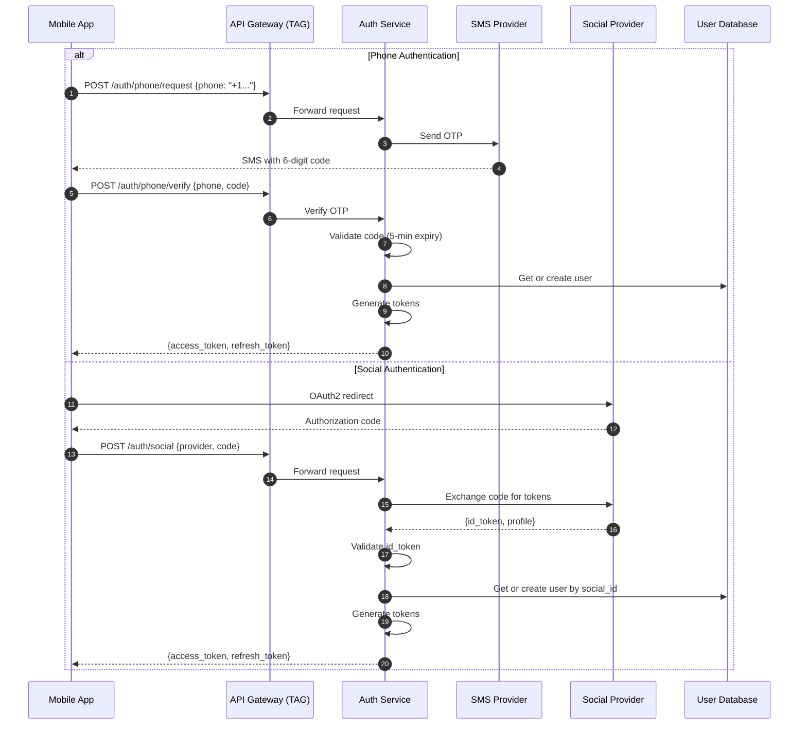
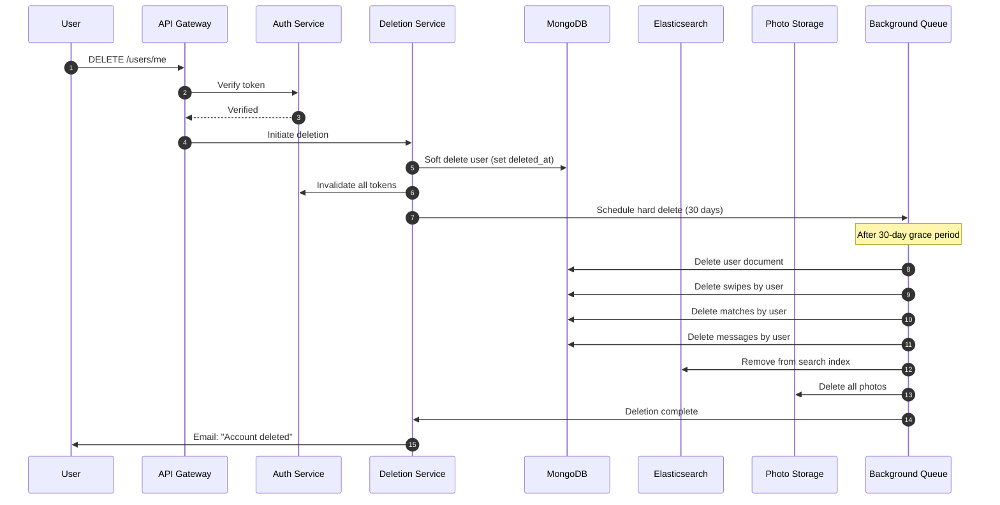

# Security & Compliance

[← Back to Index](./00-index.md)

---

## Authentication & Authorization

### Authentication Flow



### Token Management

```
┌─────────────────────────────────────────────────────────────────────────┐
│                     TOKEN ARCHITECTURE                                   │
├─────────────────────────────────────────────────────────────────────────┤
│                                                                         │
│  Access Token (JWT):                                                    │
│  ┌─────────────────────────────────────────────────────────────────┐   │
│  │ Header: { "alg": "RS256", "kid": "key-2024-01" }                │   │
│  │ Payload: {                                                       │   │
│  │   "sub": "user-uuid",                                           │   │
│  │   "iat": 1717200000,                                            │   │
│  │   "exp": 1717203600,        // 1 hour                           │   │
│  │   "tier": "GOLD",           // Subscription tier                │   │
│  │   "device_id": "device-uuid",                                   │   │
│  │   "scope": ["read", "write"]                                    │   │
│  │ }                                                                │   │
│  │ Signature: RS256(header + payload, private_key)                 │   │
│  └─────────────────────────────────────────────────────────────────┘   │
│                                                                         │
│  Refresh Token:                                                         │
│  ┌─────────────────────────────────────────────────────────────────┐   │
│  │ • Opaque string (not JWT)                                       │   │
│  │ • Stored in database with user_id, device_id, expiry            │   │
│  │ • 30-day expiry                                                 │   │
│  │ • Rotated on each use (old token invalidated)                   │   │
│  │ • One refresh token per device                                  │   │
│  └─────────────────────────────────────────────────────────────────┘   │
│                                                                         │
│  Token Refresh Flow:                                                    │
│  1. Client detects access token expired (or 401 response)              │
│  2. POST /auth/refresh with refresh_token                              │
│  3. Server validates refresh token                                      │
│  4. Server issues new access + refresh token pair                      │
│  5. Old refresh token invalidated                                       │
│                                                                         │
│  Security Measures:                                                     │
│  • Asymmetric signing (RS256) for token verification                   │
│  • Key rotation every 90 days                                          │
│  • Token binding to device (prevents token theft across devices)       │
│  • Refresh token rotation (single-use)                                 │
│  • Logout invalidates all refresh tokens for device                    │
│                                                                         │
└─────────────────────────────────────────────────────────────────────────┘
```

### Authorization Model

```
┌─────────────────────────────────────────────────────────────────────────┐
│                     AUTHORIZATION MATRIX                                 │
├─────────────────────────────────────────────────────────────────────────┤
│                                                                         │
│  Subscription Tiers:                                                    │
│  ┌─────────────────────────────────────────────────────────────────┐   │
│  │ Feature              │ FREE │ PLUS │ GOLD │ PLATINUM            │   │
│  │──────────────────────│──────│──────│──────│─────────            │   │
│  │ Swipes/day           │ 100  │ ∞    │ ∞    │ ∞                  │   │
│  │ Super Likes/day      │ 1    │ 5    │ 5    │ 5                  │   │
│  │ Rewind               │ ✗    │ ✓    │ ✓    │ ✓                  │   │
│  │ See who liked you    │ ✗    │ ✗    │ ✓    │ ✓                  │   │
│  │ Passport (location)  │ ✗    │ ✓    │ ✓    │ ✓                  │   │
│  │ Boosts/month         │ 0    │ 1    │ 1    │ 1                  │   │
│  │ Top Picks           │ ✗    │ ✗    │ ✓    │ ✓                  │   │
│  │ Priority Likes       │ ✗    │ ✗    │ ✗    │ ✓                  │   │
│  │ Message before match │ ✗    │ ✗    │ ✗    │ ✓                  │   │
│  └─────────────────────────────────────────────────────────────────┘   │
│                                                                         │
│  Resource-Level Access:                                                 │
│  • Profile: Owner can read/write; others can read (if not blocked)    │
│  • Photos: Owner can CRUD; others can read (if not blocked)           │
│  • Conversations: Only participants can access                         │
│  • Messages: Sender/recipient only                                     │
│  • Matches: Both users can read; either can delete (unmatch)          │
│  • Swipe history: Not accessible (internal only)                      │
│                                                                         │
└─────────────────────────────────────────────────────────────────────────┘
```

---

## Data Security

### Encryption at Rest

| Data Type | Encryption | Key Management |
|-----------|------------|----------------|
| MongoDB | AES-256 | Cloud KMS, auto-rotation every 90 days |
| Elasticsearch | AES-256 | Cloud KMS |
| Redis | AES-256 | Cloud KMS |
| Object Storage (Photos) | AES-256 | Cloud KMS, per-object keys |
| Backups | AES-256 | Dedicated backup keys |

### Encryption in Transit

```
┌─────────────────────────────────────────────────────────────────────────┐
│                     TLS CONFIGURATION                                    │
├─────────────────────────────────────────────────────────────────────────┤
│                                                                         │
│  External (Client → API Gateway):                                       │
│  • TLS 1.3 required (TLS 1.2 fallback)                                 │
│  • Strong cipher suites only                                           │
│  • Certificate pinning on mobile apps                                  │
│  • HSTS enabled (1 year, includeSubdomains)                            │
│                                                                         │
│  Internal (Service → Service):                                          │
│  • mTLS via Envoy service mesh                                         │
│  • Auto-rotating certificates (24-hour validity)                       │
│  • Certificate managed by service mesh CA                              │
│                                                                         │
│  Database Connections:                                                  │
│  • TLS required for all database connections                           │
│  • Certificate verification enabled                                     │
│                                                                         │
└─────────────────────────────────────────────────────────────────────────┘
```

### PII Handling

```
┌─────────────────────────────────────────────────────────────────────────┐
│                     PII DATA CLASSIFICATION                              │
├─────────────────────────────────────────────────────────────────────────┤
│                                                                         │
│  HIGH SENSITIVITY (encrypted, access logged):                           │
│  • Phone number                                                         │
│  • Email address                                                        │
│  • Date of birth                                                        │
│  • Precise location coordinates                                         │
│  • Payment information (if stored)                                      │
│  • IP addresses                                                         │
│  • Device identifiers                                                   │
│                                                                         │
│  MEDIUM SENSITIVITY (access controlled):                                │
│  • Name (display name)                                                  │
│  • Photos                                                               │
│  • Bio/description                                                      │
│  • Job/education information                                            │
│  • Swipe history                                                        │
│  • Match history                                                        │
│  • Messages                                                             │
│                                                                         │
│  LOW SENSITIVITY (aggregated/anonymized OK):                            │
│  • City (approximate location)                                          │
│  • Age (not DOB)                                                        │
│  • Gender                                                               │
│  • Account creation date                                                │
│                                                                         │
│  Retention:                                                             │
│  • Active users: Indefinite (until account deletion)                   │
│  • Inactive >2 years: Anonymize, delete PII                            │
│  • Deleted accounts: Soft delete, hard delete after 30 days            │
│  • Messages: Kept while conversation exists                            │
│  • Swipes: 90 days rolling window                                      │
│                                                                         │
└─────────────────────────────────────────────────────────────────────────┘
```

### Data Masking & Anonymization

```
// API Response Masking
function MaskUserForResponse(user, viewer):
    masked = {
        user_id: user.user_id,
        name: user.name,
        age: CalculateAge(user.birth_date),  // Age, not DOB
        bio: user.bio,
        photos: user.photos,
        verified: user.verified
    }

    // Distance shown only if preference enabled
    if user.settings.privacy.show_distance:
        masked.distance_km = CalculateDistance(viewer.location, user.location)
    else:
        masked.distance_km = null

    // Don't expose:
    // - Exact location coordinates
    // - Phone number
    // - Email
    // - DOB
    // - Internal scores

    return masked

// Analytics Anonymization
function AnonymizeForAnalytics(event):
    return {
        event_type: event.type,
        timestamp: TruncateToHour(event.timestamp),
        user_hash: SHA256(event.user_id + daily_salt),  // Pseudonymized
        age_bucket: AgeBucket(event.user_age),  // 18-24, 25-34, etc.
        city: event.city,  // Coarse location only
        // No: precise location, device ID, swipe targets
    }
```

---

## Threat Model

### STRIDE Analysis

| Threat | Example | Mitigation |
|--------|---------|------------|
| **Spoofing** | Fake accounts, impersonation | Photo verification, phone/social auth required |
| **Tampering** | Modify profile/messages in transit | TLS everywhere, signed API responses |
| **Repudiation** | Deny sending harassing message | Audit logs, message timestamps |
| **Information Disclosure** | Expose user locations | Location obfuscation, access controls |
| **Denial of Service** | Swipe bot overload | Rate limiting, bot detection |
| **Elevation of Privilege** | Access premium features free | Server-side feature enforcement |

### Top Attack Vectors & Mitigations

#### 1. Fake Profiles / Catfishing

```
┌─────────────────────────────────────────────────────────────────────────┐
│                     FAKE PROFILE DETECTION                               │
├─────────────────────────────────────────────────────────────────────────┤
│                                                                         │
│  Prevention:                                                            │
│  • Photo verification (selfie + gesture matching)                      │
│  • Phone number verification (SMS OTP)                                 │
│  • Social login linkage                                                │
│  • Rate limit new accounts                                             │
│                                                                         │
│  Detection:                                                             │
│  • ML model trained on known fake profiles                             │
│  • Reverse image search for stolen photos                              │
│  • Behavioral analysis (swipe patterns)                                │
│  • User reports aggregation                                            │
│                                                                         │
│  Signals of fake profile:                                               │
│  • Too-perfect photos (stock images, models)                           │
│  • Generic bio copied from web                                         │
│  • Unusual swipe patterns (all right swipes)                           │
│  • Immediate ask to move to external platform                          │
│  • Multiple reports from different users                               │
│                                                                         │
│  Response:                                                              │
│  • Shadow ban (user doesn't know they're limited)                      │
│  • Manual review queue                                                 │
│  • Permanent ban on confirmation                                       │
│                                                                         │
└─────────────────────────────────────────────────────────────────────────┘
```

#### 2. Location Spoofing

```
Detection Methods:
• Compare IP geolocation with reported location
• Check location history for impossible travel (500km in 1 hour)
• Validate GPS accuracy/timestamp on mobile
• Detect VPN/proxy usage

Mitigation:
• Flag suspicious location changes
• Require re-verification for large location changes
• Premium "Passport" feature for legitimate location changes
• Reduce visibility for spoofed locations
```

#### 3. Harassment & Safety

```
┌─────────────────────────────────────────────────────────────────────────┐
│                     HARASSMENT PREVENTION                                │
├─────────────────────────────────────────────────────────────────────────┤
│                                                                         │
│  Message Filtering:                                                     │
│  • Offensive language detection (ML + keywords)                        │
│  • Unsolicited image detection (nudity filter)                         │
│  • Link blocking (external sites in first messages)                    │
│  • Spam detection (repeated identical messages)                        │
│                                                                         │
│  User Controls:                                                         │
│  • Block (invisible to blocked user)                                   │
│  • Report (triggers review)                                            │
│  • Unmatch (removes from each other's matches)                         │
│  • Hide last active status                                             │
│  • Hide distance                                                        │
│                                                                         │
│  Safety Features:                                                       │
│  • Share date details with trusted contacts                            │
│  • Safety tips before first meetup                                     │
│  • Emergency services integration (some regions)                       │
│  • Video chat before meeting (verify identity)                         │
│                                                                         │
│  Reporting Flow:                                                        │
│  1. User reports with reason + optional details                        │
│  2. Immediate unmatch (if desired)                                     │
│  3. Report queued for review                                           │
│  4. ML pre-screening for urgency                                       │
│  5. Human review for high-severity                                     │
│  6. Action: warning, temp ban, permanent ban                           │
│                                                                         │
└─────────────────────────────────────────────────────────────────────────┘
```

#### 4. Bot Detection

```
Bot Indicators:
• Programmatic swipe patterns (too fast, too consistent)
• Missing device fingerprint
• Unusual API call patterns
• No app background activity
• Identical behavior across accounts

Detection:
• CAPTCHA on suspicious activity
• Device fingerprinting
• Behavioral biometrics (swipe speed, touch patterns)
• Rate limiting per device

Response:
• Temporary throttling
• CAPTCHA challenges
• Shadow ban (reduce visibility)
• Account termination
```

### Rate Limiting & DDoS Protection

```
┌─────────────────────────────────────────────────────────────────────────┐
│                     RATE LIMITING LAYERS                                 │
├─────────────────────────────────────────────────────────────────────────┤
│                                                                         │
│  Layer 1: CDN/Edge (IP-based)                                          │
│  • 1000 requests/minute per IP                                         │
│  • Automatic DDoS mitigation                                           │
│  • Geographic blocking for high-risk regions                           │
│                                                                         │
│  Layer 2: API Gateway (User-based)                                      │
│  • See API rate limits in design doc                                   │
│  • Token bucket algorithm                                              │
│  • 429 response with Retry-After header                                │
│                                                                         │
│  Layer 3: Service Level (Resource-based)                               │
│  • Per-conversation message limits                                     │
│  • Per-match limits                                                    │
│  • Prevents abuse even with valid token                                │
│                                                                         │
│  DDoS Response:                                                         │
│  1. CDN absorbs attack traffic                                         │
│  2. Automatic scaling of gateway                                       │
│  3. Circuit breakers protect backend                                   │
│  4. Alert on-call for manual intervention                              │
│  5. Fallback to static responses if needed                             │
│                                                                         │
└─────────────────────────────────────────────────────────────────────────┘
```

---

## Compliance

### GDPR Compliance

| Requirement | Implementation |
|-------------|----------------|
| **Right to Access** | Export all data via Settings → Privacy → Download My Data |
| **Right to Rectification** | Edit profile at any time |
| **Right to Erasure** | Delete account via Settings → Delete Account |
| **Data Portability** | JSON export of profile, matches, messages |
| **Consent** | Explicit opt-in for marketing, analytics |
| **Data Minimization** | Only collect necessary data |
| **Purpose Limitation** | Data used only for service provision |
| **Storage Limitation** | Auto-delete after retention period |

### Data Deletion Flow



### CCPA Compliance (California)

| Requirement | Implementation |
|-------------|----------------|
| **Right to Know** | Data access request via Settings or email |
| **Right to Delete** | Same as GDPR deletion |
| **Right to Opt-Out of Sale** | Tinder does not sell data; opt-out of sharing for ads |
| **Non-Discrimination** | Service same regardless of privacy choices |

### Content Moderation Compliance

```
┌─────────────────────────────────────────────────────────────────────────┐
│                     CONTENT MODERATION PIPELINE                          │
├─────────────────────────────────────────────────────────────────────────┤
│                                                                         │
│  Photo Upload:                                                          │
│  1. Automatic ML scan:                                                  │
│     • Nudity detection                                                 │
│     • Violence detection                                               │
│     • Minor detection                                                  │
│     • Prohibited content (drugs, weapons)                              │
│  2. Auto-reject high-confidence violations                             │
│  3. Queue borderline cases for human review                            │
│  4. Approved photos become visible                                     │
│                                                                         │
│  Bio/Text Content:                                                      │
│  1. Keyword filtering (slurs, contact info)                            │
│  2. ML toxicity scoring                                                │
│  3. Auto-reject obvious violations                                     │
│  4. Human review for appeals                                           │
│                                                                         │
│  Message Content:                                                       │
│  • Not pre-moderated (privacy)                                         │
│  • Scanned on report                                                   │
│  • ML flagging for severe cases                                        │
│                                                                         │
│  Regional Compliance:                                                   │
│  • Germany: NetzDG (remove illegal content in 24h)                     │
│  • UK: Online Safety Act                                               │
│  • India: IT Rules 2021                                                │
│  • Each region may have specific requirements                          │
│                                                                         │
└─────────────────────────────────────────────────────────────────────────┘
```

### Age Verification

```
Minimum Age: 18 years (enforced)

Verification Methods:
1. Self-reported DOB (primary)
2. ID verification for flagged accounts
3. ML-based age estimation from photos
4. Cross-reference with social login DOB

Under-18 Detection:
• ML model to detect minors in photos
• User reports of suspected minors
• Behavioral patterns inconsistent with adults

Response:
• Immediate account suspension
• Human review required to reinstate
• NCMEC reporting if CSAM suspected
```

---

## Security Monitoring

### Security Logging

```
// Events to log (immutable audit trail)

// Authentication events
{
  event_type: "AUTH_LOGIN",
  user_id: "uuid",
  timestamp: ISO8601,
  ip_address: "hashed",
  device_fingerprint: "hashed",
  method: "PHONE|GOOGLE|APPLE",
  success: true|false,
  failure_reason: null|"INVALID_CODE|RATE_LIMITED|..."
}

// Sensitive data access
{
  event_type: "DATA_ACCESS",
  user_id: "uuid",
  accessor_id: "uuid|SYSTEM",
  timestamp: ISO8601,
  resource: "profile|messages|location",
  action: "READ|EXPORT",
  justification: null|"USER_REQUEST|SUPPORT_TICKET_123"
}

// Security events
{
  event_type: "SECURITY_EVENT",
  user_id: "uuid",
  timestamp: ISO8601,
  event: "PASSWORD_CHANGE|SUSPICIOUS_LOGIN|RATE_LIMITED|BLOCKED",
  details: {...}
}
```

### Security Alerts

| Alert | Threshold | Response |
|-------|-----------|----------|
| Failed logins spike | >10x normal rate | Investigate, enable CAPTCHA |
| Mass account creation | >1000 new accounts/hour from same IP range | Block IP range, review |
| Data export spike | >100 exports/hour | Investigate for scraping |
| API abuse | Rate limit exceeded repeatedly | Temporary IP/account block |
| Unusual admin access | Off-hours access to PII | Alert security team |

---

*Next: [Observability →](./07-observability.md)*
